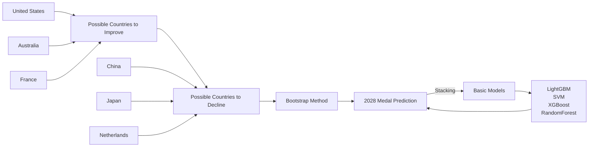
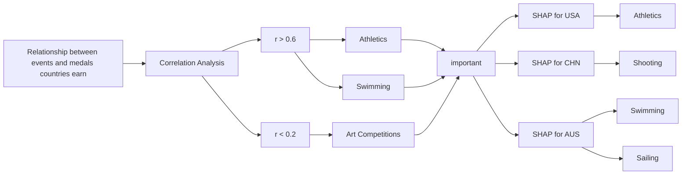
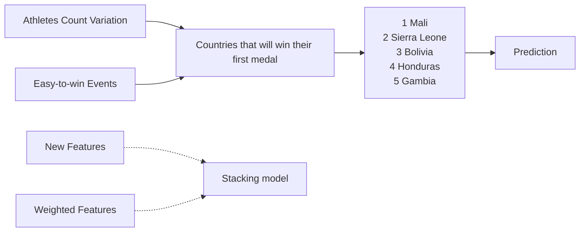
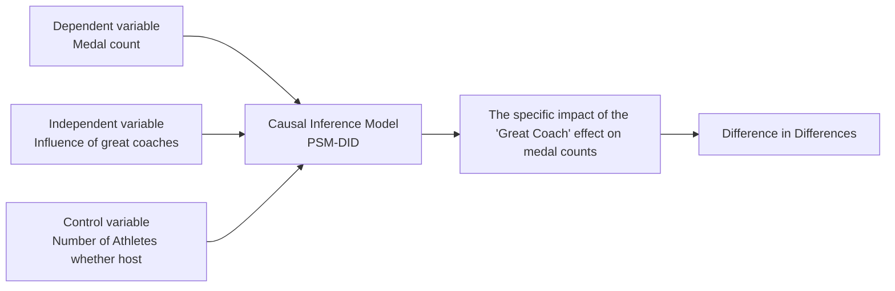
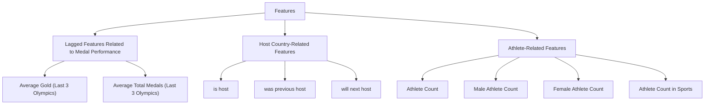
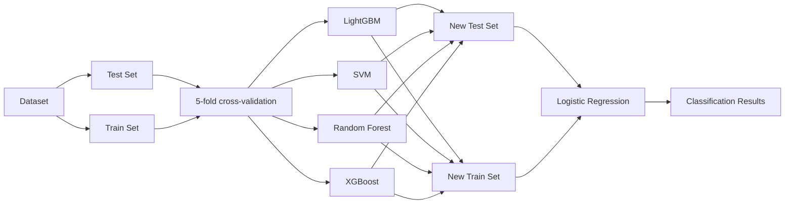
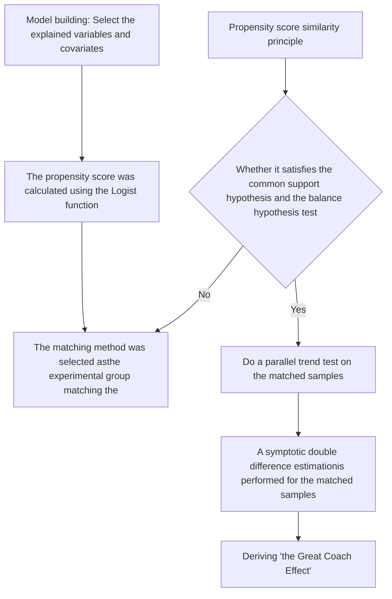
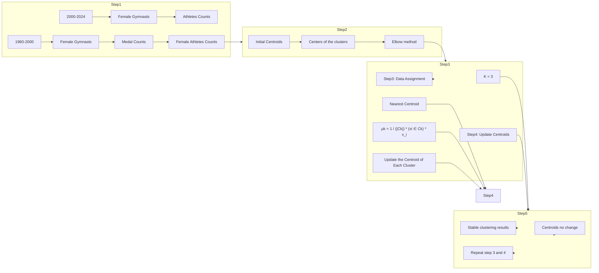

# 2028 Olympic Medal Predictions:

# Multi-Effect Analysis and Strategic Insights

Summary

The Olympic Games are a global event that unites nations in pursuit of excellence. This study develops a model to predict medal counts for the 2028 Los Angeles Olympics, identifies potential first-time medal-winning countries, analyzes the influence of different sports, and evaluates the "great coach effect."

In Task 1: We prepared the data by creating three key indicators: medal lag, host country effect, and participant count. These, combined with additional features, served as inputs for a Stacking ensemble model, which outperformed individual algorithms with an $R^{2}$ of 0.88. Using linear interpolation, we estimated 2028 feature values and predicted the top three gold medal winners: the United States (56), China (33), and Australia (25). We also calculated 95% confidence intervals using the Bootstrap method. The findings suggest that the U.S., Australia, and France will improve, while China, Japan, and the Netherlands may decline.

In Task 2: To identify countries likely to win their first medals in 2028, we analyzed participation trends for non-medal-winning nations (1960–2024) and introduced a binary variable ("Olympic investment level") based on these trends. We also identified Athletics, Taekwondo, and Wrestling as key breakthrough sports. The model predicted Mali, Sierra Leone, Honduras, Bolivia, and Gambia as the most likely to win their first medals, with prediction accuracies above 70%.

In Task 3: We calculated Pearson correlation coefficients and used a heatmap to analyze the relationship between sports and medal counts. Athletics, Shooting, and Swimming showed strong correlations (above 0.6), significantly influencing medal growth. SHAP analysis revealed that for the U.S., Athletics and Rugby-related events contributed most to medal gains. The addition of flag football could further enhance U.S. performance.

In Task 4: To evaluate the "great coach effect," we examined medal trends for the U.S. women's gymnastics team, focusing on coach Béla Károlyi. Using a PSM-DID model with 2000 as the intervention year, we estimated a 3.213 medal increase per Olympics, significant at the 2% level. K-Means clustering identified Spain, Japan, and Canada as nations with potential to benefit from hiring great coaches, with predicted medal increases of 4.32, 2.89, and 4.75, respectively.

Finally, 10-fold cross-validation confirmed the Stacking model's stability, while balance and sensitivity tests supported the robustness of the PSM-DID model. These findings demonstrate the reliability of our methods and provide valuable insights into medal predictions. We have shared these results with National Olympic Committees to assist their strategic planning for the 2028 Olympics.

Keywords: Medal predictions ; Stacking ensemble ; SHAP analysis ; PSM-DID model

# Contents

# 1 Introduction 3

1.1 Problem background 3  
1.2 Restatement of the problem 3  
1.3 Our work.... 3

# 2 Assumptions 4

# 3 Notations 5

# 4 Data Pre-processing 5

# 5 Task 1: 2028 Olympics Medal Prediction Model 6

5.1 Develop a model for medal counts for each country 6  
5.2 Prediction for the Olympics in 2028 9  
5.2.1 Projections for the medal table in the Los Angeles, Olympics in 2028 9  
5.2.2 Include prediction intervals for all results. 10  
5.2.3 Possible Countries to Improve or Decline 11

# 6 Task 2: Multifaceted analysis for Predicting the Next "First-Medal" Winner 12

# 7 Task 3: Exploration of the Relationship Between Olympic Events and Medal Win 15

7.1 Explore the relationship between the events and how many medals countries earn 15  
7.2 Most important sports for different countries 16  
7.3 Impact of Host Country's Event Selection on medal . . . . . . . . . . . . . . . . 18

# 8 Task 4: Analysis of the "Great Coach" Effect and Its Impact on Medals' Performance 18

8.1 The effect contributes to medal counts ..... 18  
8.2 3 Countries should consider investing "Great Coach" 22

# 9 Model Testing 23

9.1 Tests of the stacking model 23  
9.2 Tests of the PSM-DID model 24

# 10 Letter 25

# 1 Introduction

# 1.1 Problem background

As one of the most influential sporting events in the world, the Olympic Games have always attracted attention and participation from all over the world. Since the first modern Olympic Games in 1896, the Olympic medal table, especially the gold medal table, has become an important platform for countries to demonstrate their sports strength, national image and culture. In addition to the traditional sports strength, international political and socio-economic factors also affect the distribution of Olympic medals to different degrees. The accelerating process of globalisation and inter-country cooperation and competition are shaping the landscape of the Olympic Games.

With the development of big data, artificial intelligence and other technologies, data-based analysis and prediction models have become a hot research topic in the field of sports. These technologies are not only capable of handling complex multi-dimensional data, but also provide countries with a scientific basis for Olympic medal predictions through simulation and prediction. However, medal prediction is more than a simple analysis of data; it also needs to consider cultural, economic and social factors in the context of globalisation, which makes Olympic medal prediction an interdisciplinary and complex challenge.

# 1.2 Restatement of the problem

- Creating a model to predict the number of gold medals versus the total number of medals for each country and based on the model predicting the medal standings for the 2028 Summer Olympics in Los Angeles, USA as well as the prediction intervals and analysing whether certain countries are expected to improve or decline in their achievements in 2028 compared to 2024.  
- To predict which countries that have not won medals are likely to make a breakthrough at the upcoming 2028 Olympic Games in Los Angeles and evaluate the predicted results.  
- Analyse the number and type of Olympic events, explore the relationship between events and the number of medals won by each country, identify the events that have a significant impact on each country and analyse the impact of the events chosen by the host country on the outcome of the games.  
- Analyse the impact of the 'Great Coach Effect' on the number of medals won based on relevant data. Select three countries to analyse the sports in which they should invest in 'great coaches' and analyse their potential impact.

# 1.3 Our work

The content is summarized in Figure 1 and organized as follows:

Section 2 outlines the assumptions and rationale. Section 3 explains the study's notations. Section 4 details data preprocessing. Section 5 develops the Olympic medal prediction model. Section 6 analyzes the likelihood of first-time medalists. Section 7 examines

the impact of sports on medal counts. Section 8 quantifies the "great coach effect." Section 9 tests the models, and Section 10 evaluates their strengths and weaknesses.

Task1: 2028 Olympics Medal Prediction Model  

flowchart

Task3: Exploration of the Relationship Between Olympic Events and Medal Wins  

flowchart

flowchart

Task2: Multi-dimensional analysis for Predicting the Next "First-Medal" Winner

flowchart

Task4: Analysis of the "Great Coach" Effect and Its Impact on Medals' Performance  
Figure 1: Structure of our paper

# 2 Assumptions

1. Historically, the merging of different teams in a country has no significant effect on exploring a country's Olympic strength.

The Olympic teams of some countries historically may have been divided into sub-teams, such as 'Argentina-1', 'Argentina-2', etc., especially in team events where there may have been multiple teams competing. We believe that combining the results of these different teams historically will not have an impact on analysing the overall strength of the country in the Olympic Games.

2. There is a correlation between the number of participants from a country in an event and the country's investment in that event.

It is hypothesised that a higher number of participants from a country means that the country has invested more resources (e.g. training facilities, professional coaches, etc.) in the sport. An increase in the number of participants usually reflects the level of interest and importance the country attaches to the sport, and by increasing the participation of athletes, the country is likely to become more competitive in the sport and thus improve its chances of winning medals.

3. Certain countries are likely to win Olympic medals for the first time in 2028, and sports that have historically had a high number of first-time winners from other countries are also relatively more likely to win for the first time.

Based on past history, certain sports are typically more likely to be breakthroughs for

first-time medal-winning countries, particularly among emerging or less competitive countries. These sports have lower thresholds, more opportunities to compete, and can offer potential winning opportunities for countries that have not historically won an Olympic medal.

# 4. The effects of coaching do not diminish or enhance over time, but rather are maintained at a stable level that influences athletes' performance over time.

Specifically, we argue that the effects of coaching in terms of tactical instruction, technical enhancement, and psychological motivation will remain stable throughout an athlete's career and have a sustained positive effect on his or her Olympic performance. This influence does not diminish as the athlete gains experience or changes in competitive status. For example, a coach's training methods and strategic philosophy can still have a positive impact on an athlete in the long term, despite changes in age or fitness.

# 3 Notations

Table 1: Notations used in this paper

<table><tr><td>Symbol</td><td>Description</td></tr><tr><td> $x_{j}$ </td><td>Features of the attribute</td></tr><tr><td> $\Omega(f)$ </td><td>The regularization term that penalizes model complexity</td></tr><tr><td> $\xi_{i}$ </td><td>Slack variables represent the allowed tolerance for each data point</td></tr><tr><td> $\alpha_{i}$ </td><td>The learned weights for each base learner</td></tr><tr><td> $\beta$ </td><td>Parameters to be estimated</td></tr><tr><td> $\epsilon_{it}$ </td><td>Random error term</td></tr><tr><td> $r_{i}$ </td><td>Policy dummy variable</td></tr></table>

# 4 Data Pre-processing

# - Step 1: Special Data Handling

Firstly, we deal with data format inconsistencies. In the summerOly\_athletes.csv file, there were duplicate event names in the Sports column (Cycling Road, Cycling Track; Cycling Road, Triathlon), which were merged into the larger category, and there were multiple teams from the same country in the Team column, which were correctly grouped together. For example: Argentina-1, Argentina-2, they have been correctly grouped together. In addition, the historical data for Russia (RUS) and Russia 2020 (ROC), even though Russia has already missed the 2024 Olympics for other reasons and may continue to miss the 2028 Olympics, is informative, so we merged them and kept their data, but they are not involved in the subsequent medal predictions.

# - Step 2: Mapping the 'Team' column to 'NOC'

We mapped the 'Team' column (containing the full name of the country) in the sum-

merOly\_athletes.csv file to the corresponding 'NOC' (National Olympic Committee 3-letter code) to ensure that all participating teams matched their corresponding NOC codes, thus ensuring data consistency.

# - Step 3: Feature Engineering

In order to enhance the predictive power of the model, several new features were created, as shown below. These new features provide valuable insight into understanding the impact of Olympic host country effects on medal performance.

flowchart

Figure 2: Fearture Engineering

We input the number of entries from each country in different events as features into the model and can predict the number of medals more accurately than each event individually.

# - Step 4: Data Merging and Final Adjustments

In the final step, we merged the summerOly\_athletes.csv, summerOly\_hosts.csv, and summerOly\_medal\_counts.csv datasets. NOC and Year were used as key variables to ensure that the data could be accurately linked. In the end, a complete dataset was obtained containing all relevant information about each Olympic event, athlete performance and medal results for each country.

# 5 Task 1: 2028 Olympics Medal Prediction Model

# 5.1 Develop a model for medal counts for each country

In order to predict the number of medals for each country at the 2028 Summer Olympics in Los Angeles, in particular the number of gold medals and the total number of medals, the first step is to construct a machine learning regression prediction model that can make predictions with full consideration of multiple features constructed in the preprocessing portion of the data and use multiple evaluation metrics to measure the accuracy and stability of the predictions. The second step is to obtain prediction intervals for medals through a sampling method, and the third step is to analyse the results to explore which countries are likely to improve or decline.

# \* Step 1: Principle of Stacking

Stacking is an integrated learning approach that combines multiple base learners (LGBM, SVM, XGBoost, and RF) into a final prediction model. Each base learner is trained independently and their predictions are then fed as features into a meta-learner (logistic regression) to generate the final prediction. The core advantage of stacking is the ability to combine the strengths of different models to improve the overall prediction performance. The Olympic medal prediction problem faces multiple challenges, including taking into account the historical performance of countries, the impact of different events and disciplines, home country effects, and possible future changes.

flowchart

Figure 3: Principle of Stacking

In predicting the number of medals at the 2028 Olympics, the stacked approach allows us to integrate the unique strengths of each of the underlying models.LGBM, SVM, XGBoost, and RF are able to capture different patterns in the data, such as non-linear relationships, feature interactions, and variance, respectively. By combining the outputs of these models, the stacked approach provides more robust and accurate predictions that can effectively predict the total number of medals and gold medals for each country.

# ※ Step 2: Base Models

# 1. LightGBM (LGBM)

LightGBM is a gradient boosting algorithm based on decision trees. It gradually improves the predictive power of the model at each iteration step by constructing a series of decision trees, each one correcting the residuals of the previous one. LightGBM is extremely efficient when dealing with large datasets and is fast to train. By splitting the tree model, it is able to identify complex interactions between different features (e.g. the relationship between host country and historical performance) and accurately predict the number of medals.

The overall objective function is:Equation 1

$$
\mathcal {L} (\theta) = \sum_ {i = 1} ^ {N} \mathrm{l} (y _ {i}, \widehat {y _ {i}}) + \Omega (f) \tag {1}
$$

Where: $1(y_{i}, \widehat{y}_{i})$ is the loss function, typically the Mean Squared Error (MSE) for regression problems. $\Omega(f)$ is the regularization term that penalizes model complexity

to avoid overfitting.

By minimising this objective function, LightGBM optimises the parameters of the decision tree to improve the accuracy of Olympic medal count predictions.

# 2. Support Vector Machine (SVM)

SVM maximises the spacing between different classes of data points by finding an optimal hyperplane. The strength of SVM lies in its ability to model complex patterns, especially when the data is highly non-linear and noisy. It is able to find an optimal decision boundary to distinguish between different predictive trends, especially when dealing with features that have complex interactions, and it is effective in identifying which features (e.g., strength of a particular sport) have the greatest impact on medal counts.

The objective function of an SVM in regression is: Equation 2

$$
\mathcal {L} (w, b, \epsilon) = \frac {1}{2} | w | ^ {2} + C \sum_ {i = 1} ^ {N} \xi_ {i} \tag {2}
$$

Where: w and b are the weights and bias of the hyperplane. $\xi_{i}$ are the slack variables that represent the margin of tolerance for each data point. C is the regularization parameter that controls the trade-off between minimizing the error and maximizing the margin.

# 3. Extreme Gradient Boosting(XGBoost)

Unlike traditional boosting algorithms, XGBoost introduces Hessian matrices, making it faster in convergence and improving prediction accuracy. It also introduces regularisation to control model complexity and prevent overfitting. XGBoost is able to model complex interactions between features and is particularly well suited to deal with the combined effects of multiple factors.

The objective function of XGBoost is: Equation 3

$$
\mathcal {L} (\theta) = \sum_ {i = 1} ^ {N} \mathrm{l} (y _ {i}, \widehat {y _ {i}}) + \lambda \sum_ {j = 1} ^ {T} | w _ {j} | ^ {2} \tag {3}
$$

Where: $\lambda$ is a regularization parameter that penalizes large values of the tree parameters $w_{j}$ .

# 4. Random Forest (RF)

Random Forest is an integrated method that combines multiple decision trees trained on random subsets. By using Bagging strategy, it reduces variance, improves stability and avoids over-fitting. Since each tree is trained independently, Random Forest is able to handle multiple feature combinations, capturing complex patterns and potential feature associations in the data.

# ※ Step 3: Final Stacking Model Integration

Ultimately, the stacked model combines the predictions of LGBM, SVM, XGBoost, and RF into one final prediction. The prediction results of each base model are weighted and combined by a logistic regression model.

The integration formula is:Equation 4 Equation 5

$$
f _ {1} (x _ {i}) = \widehat {y _ {i} ^ {\mathrm{LGBM}}} = \sum_ {\stackrel {t = 1} {T}} ^ {T} f _ {t} (x _ {i}) \quad f _ {2} (x _ {i}) = \widehat {y _ {i} ^ {\mathrm{SVM}}} = w ^ {T} x _ {i} + b \tag {4}
$$

$$
f _ {3} \left(x _ {i}\right) = y _ {i} ^ {\widehat {\mathrm{XGBoost}}} = \sum_ {t = 1} ^ {T} f _ {t} \left(x _ {i}\right) \quad f _ {4} \left(x _ {i}\right) = \widehat {y _ {i} ^ {\mathrm{RF}}} = \frac {1}{T} \sum_ {t = 1} ^ {T} f _ {t} \left(x _ {i}\right) \tag {5}
$$

The final prediction is a weighted sum of the base models' outputs:Equation 6

$$
\widehat {y} _ {i} = \alpha_ {1} f _ {1} \left(x _ {i}\right) + \alpha_ {2} f _ {2} \left(x _ {i}\right) + \alpha_ {3} f _ {3} \left(x _ {i}\right) + \alpha_ {4} f _ {4} \left(x _ {i}\right) + \beta \tag {6}
$$

Where: $\alpha1,\alpha2,\alpha3,\alpha4$ are the learned weights for each base learner, and $\beta$ is the bias term. The meta-learner adjusts these weights during training to minimize the error and produce the most accurate prediction for the total medal count and gold medals for each country in the 2028 Olympic Games.

# 5.2 Prediction for the Olympics in 2028

# 5.2.1 Projections for the medal table in the Los Angeles, Olympics in 2028

We have developed an Olympic medal prediction model capable of predicting the medal table for the 2028 Summer Olympics in Los Angeles. For the number of athletes per country in 2028 and the number of participants in each sport, we have used linear interpolation based on data from 2012 to 2024 to estimate the corresponding values for 2028. For other characteristic data (historical performance, host country effects), they were filled in as appropriate. For model training, we chose data from 1908 to 2000 as the training set and data from 2004 to 2024 as the test set. After the model training, inputting the feature data of 2028, we can get the medal prediction results as below.

bar

| Country | Country | Total |
| :--- | :--- | :--- |
| USA | USA | 56 |
| CHN | CHN | 33 |
| AUS | AUS | 25 |
| FRA | FRA | 19 |
| GER | GER | 15 |
| GBR | GBR | 14 |
| JPN | JPN | 11 |
| ITA | ITA | 10 |
| KOR | KOR | 9 |
| BRA | BRA | 7 |
| CAN | CAN | 7 |
| NED | NED | 7 |
| NZL | NZL | 6 |
| ESP | ESP | 5 |
| HUN | HUN | 5 |

Figure 4: Prediction for medal table in 2028

To further validate the performance of the model, the following assessment metrics were used: coefficient of determination ( $R^{2}$ ), mean square error (MSE) and mean absolute percentage error (MAPE). These metrics are able to assess the accuracy and predictive effectiveness of the model from different perspectives. Equation 7

$$
R ^ {2} = 1 - \frac {\sum_ {i = 1} ^ {n} (y _ {i} - \widehat {y} _ {i}) ^ {2}}{\sum_ {i = 1} ^ {n} (y _ {i} - \overline {{y}}) ^ {2}} \tag {7}
$$

$R^{2}$ can help us assess the overall fit of the model and understand whether the model explains the variance of the data. Equation 8

$$
\mathrm{MSE} = \frac {1}{n} \sum_ {i = 1} ^ {n} (y _ {i} - \widehat {y _ {i}}) ^ {2} \tag {8}
$$

The MSE provides a quantitative assessment of the prediction error to help us understand the absolute magnitude of the prediction error. Equation 9

$$
\mathrm{MAPE} = \frac {1 0 0}{n} \sum_ {i = 1} ^ {n} \left| \frac {y _ {i} - \widehat {y _ {i}}}{y _ {i}} \right| \tag {9}
$$

MAPE, on the other hand, provides a standardised measure of error that is particularly suitable for making comparisons across countries and medal types, making it easy to assess the predictive effectiveness of the model on different countries.

These three indicators combine the model fit, error size and error ratio, which help us to comprehensively assess the predictive effectiveness of the model from multiple dimensions. The calculation results are shown in Table:

<table><tr><td></td><td>LGBM</td><td>SVM</td><td>XGBOOST</td><td>RF</td><td>Stacking</td></tr><tr><td> $R^2$ </td><td>0.78</td><td>0.73</td><td>0.86</td><td>0.84</td><td>0.88</td></tr><tr><td>MSE</td><td>0.53</td><td>0.62</td><td>0.37</td><td>0.39</td><td>0.32</td></tr><tr><td>MAPE</td><td>0.42</td><td>0.48</td><td>0.32</td><td>0.33</td><td>0.30</td></tr></table>

Figure 5: Model evaluation results

Overall, the Stacking model has the strongest fitting ability $R^{2}$ and the smallest MSE and MAPE prediction errors due to the integration of multiple base models, obtaining the most stable and accurate prediction results.

# 5.2.2 Include prediction intervals for all results.

In Olympic medal prediction, the Bootstrap method quantifies the prediction error through data resampling without the need to make assumptions, and is able to efficiently estimate the distribution and uncertainty of the prediction results.

- Step 1: Randomly draw n samples from the original dataset to generate a resampled dataset $X^{*} = \{x_{1}^{*}, x_{2}^{*}, \dots, x_{n}^{*}\}$ .  
- Step 2: Compute the statisticon $\widehat{\theta^{*}}$ the resampled dataset.  
- Step 3: Repeat the above process B times to obtain B statistics, $\widehat{\theta_1^*}, \ldots, \widehat{\theta_B^*}$ .  
- Step 4: Estimate Standard Error and Confidence Interval. Based on the B resampling results, estimate the standard error (SE) and confidence interval for the statistic. Assuming $\widehat{\theta^{*}}$ has a sample mean $\widehat{\theta_{mean}^{*}}$ , the standard error is calculated as:Equation 10

$$
S E (\widehat {\theta}) = \sqrt {\frac {1}{B} \sum_ {b = 1} ^ {B} \left(\widehat {\theta_ {b} ^ {*}} - \widehat {\theta_ {m e a n} ^ {*}}\right) ^ {2}} \tag {10}
$$

For the confidence interval, if we want to calculate the 95% confidence interval, we can use the percentiles of the B statistics:

$$
\text {Lower bound} = \text {percentile} \left(2.5\%, \widehat{\theta_{1}^{*}}, \widehat{\theta.0_{2}^{*}}, \dots , \widehat{\theta_{B}^{*}}\right)
$$

$$
\text {Upper bound} = \text {percentile} \left(97.5\%, \widehat {\theta_ {1} ^ {*}}, \widehat {\theta_ {2} ^ {*}}, \dots , \widehat {\theta_ {B} ^ {*}}\right)
$$

<table><tr><td rowspan="2">Country</td><td colspan="4">95% Prediction Interval</td></tr><tr><td>Gold</td><td>Sliver</td><td>Brozen</td><td>Total</td></tr><tr><td></td><td>52-57</td><td>38-42</td><td>33-39</td><td>123-138</td></tr><tr><td></td><td>31-36</td><td>30-35</td><td>26-31</td><td>87-102</td></tr><tr><td></td><td>23-26</td><td>19-22</td><td>23-28</td><td>65-76</td></tr><tr><td></td><td>17-20</td><td>21-26</td><td>23-26</td><td>61-72</td></tr><tr><td></td><td>13-16</td><td>10-12</td><td>12-14</td><td>35-42</td></tr></table>

Figure 6: prediction intervals for medal counts

# 5.2.3 Possible Countries to Improve or Decline

# Possible Countries to Improve:

1. United States (2024: 40 Golds, Predicted 2028: 56 Golds): As the host country for the 2028 Los Angeles Olympics, the United States will benefit from the home advantage, which is expected to enhance its performance. Furthermore, the U.S. has consistently ranked among the top countries in terms of gold medals in past Olympics, with a strong pool of athletes. Therefore, it is expected that the U.S. will maintain its lead in 2028 and further increase its gold medal count.  
2. Australia (2024: 18 Golds, Predicted 2028: 25 Golds): As the host country for the 2032 Olympics, Australia has been preparing extensively for future Games. A traditional sports powerhouse, Australia has already demonstrated strong performances across various events. In 2028, Australia is expected to make significant progress, especially in swimming, rowing, and other aquatic sports, resulting in a likely increase in gold medals.  
3. France (2024: 16 Golds, Predicted 2028: 19 Golds): Having successfully hosted the 2024 Paris Olympics, France has made significant improvements in athlete training and infrastructure. With a well-established athlete development system and solid training experience, France's preparations for 2024 are expected to positively impact its performance in the 2028 Los Angeles Olympics.

# Possible Countries to Decline:

1. China (2024: 40 Golds, Predicted 2028: 33 Golds): Although China has consistently performed strongly in the Olympics, its gold medal count is predicted to decrease slightly

in 2028. With other countries, such as the U.S. and Australia, becoming more competitive, China may face increased challenges. The U.S. will have the home advantage in 2028, which could make it more difficult for China to dominate in key events.

2. Japan (2024: 20 Golds, Predicted 2028: 14 Golds): Despite Japan's impressive performance in 2024, by 2028, it will have been eight years since the Tokyo Olympics. Over time, many of the athletes who won gold medals in Tokyo may have retired, and there is uncertainty about whether new athletes can quickly fill these gaps. Therefore, Japan is expected to see a decline in its gold medal count in 2028.  
3. Netherlands (2024: 15 Golds, Predicted 2028: 7 Golds): The Netherlands ranked 6th in the gold medal tally in 2024, achieving outstanding results, likely aided by its proximity to Paris, which boosted athlete morale and fan support. However, with the 2028 Olympics being held in Los Angeles, far from Europe, several factors could affect the Dutch athletes' preparation and performance. As a result, despite strong results in 2024, the Netherlands is expected to see a decrease in its gold medal count in 2028.

# 6 Task 2: Multifaceted analysis for Predicting the Next "First-Medal" Winner

Behind the medals at each Olympic Games is not only a representation of the strength of the country's athletes, but also a reflection of the investment, nurturing and development of the Olympic Movement in each country. Based on the available historical data of the Olympic Games, there are many countries in the world that have long failed to win medals, and their performance in the past few Olympic Games has often fallen short of significant expectations.

text_image

World map highlighting specific countries in red, likely for regional analysis or data visualization purposes.

Figure 7: Countries that have never won a medal

With the continued efforts of the IOC and various national sports organisations, participation in Olympic sports in these countries is increasing year on year. As the Olympic Games become more popular around the world and resources are distributed more equitably, it is still possible that in the future there will be a few 'dark horse' countries that could win medals for the first time at future Olympic Games.

In order to predict which non-medal-winning countries are likely to make a break-

through at the upcoming 2028 Olympic Games in Los Angeles, we have conducted a multi-dimensional analysis of these countries, using data modelling methods to extract key characteristics to more accurately assess their potential for a first medal.

# 1. Impact of changes in the number of participants

Firstly, we analysed the changes in the number of participants of the non-winning countries over the period 1960-2024. By looking at the trends in their participation numbers over the past few Olympics, we are able to surmise their commitment and involvement in the Olympic Games. If a country's participation numbers are increasing year on year, this tends to imply that the country is increasing its investment in the Olympic Movement, increasing the support it provides to its athletes, and in turn increasing its potential to win medals.

  
Figure 8: Participant Trends for Non-Medal-Winning Countries (Top 28)

In an effort to quantify the changes in these countries' inputs, we fitted a trend line to the change in the number of participants for each country. If the slope of the trend line is positive (The red fitted line in Figure 7) indicates an increase in participation, we labelled these countries as '1', indicating that their inputs are increasing, and '0', vice versa. This characteristic reflects whether countries have the potential to win medals at future Olympic Games.

# 2. Projects more likely to be first-time winners

In addition to changes in the number of entries, another key factor is which projects are more likely to be ‘breakthroughs’ for first-time winners. By analysing the countries that have won first-time prizes in the period 2000-2024, as shown in Figures.

sankey

| Source | Target |
| --- | --- |
| Rowing | AIN, CYP, MNE, CPV, EOR, MRI, FIJ, BAR, BOT, BRN, BUR, DMA, ERI, GRN, GUA, LCA, SUD, AFG, GAB, JOR, VIE, SRB, TOG, KGZ, KOS, ALB, MKD, SMR, TJK, KSA, KUW, UAE, PAR, ROC, TKM |
| Rowing | AIN, CYP, MNE, CPV, EOR, MRI, FIJ, BAR, BOT, BRN, BUR, DMA, ERI, GRN, GUA, LCA, SUD, AFG, GAB, JOR, VIE, SRB, TOG, KGZ, KOS, ALB, MKD, SMR, TJK, KSA, KUW, UAE, PAR, ROC, TKM |
| Rowing | AIN, CYP, MNE, CPV, EOR, MRI, FIJ, BAR, BOT, BRN, BUR, DMA, ERI, GRN, GUA, LCA, SUD, AFG, GAB, JOR, VIE, SRB, TOG, KGZ, KOS, ALB, MKD, SMR, TJK, KSA, KUW, UAE, PAR, ROC, TKM |
| Rowing | AIN, CYP, MNE, CPV, EOR, MRI, FIJ, BAR, BOT, BRN, BUR, DMA, ERI, GRN, GUA, LCA, SUD, AFG, GAB, JOR, VIE, SRB, TOG, KGZ, KOS, ALB, MKD, SMR, TJK, KSA, KUW, UAE, PAR, ROC, TKM |
| Rowing | AIN, CYP, MNE, CPV, EOR, MRI, FIJ, BAR, BOT, BRN, BUR, DMA, ERI, GRN, GUA, LCA, SUD, AFG, GAB, JOR, VIE, SRB, TOG, KGZ, KOS, ALB, MKD, SMR, TJK, KSA, KUW, UAE, PAR, ROC, TKM |
| Rowing | AIN, CYP, MNE, CPV, EOR, MRI, FIJ, BAR, BOT, BRN, BUR, DMA, ERI, GRN, GUA, LCA, SUD, AFG, GAB, JOR, VIE, SRB, TOG, KGZ, KOS, ALB, MKD, SMR, TJK, KSA, KUW, UAE, PAR, ROC, TKM |
| Rowing | AIN, CYP, MNE, CPV, EOR, MRI, FIJ, BAR, BOT, BRN, BUR, DMA, ERI, GRN, GUA, LCA, SUD, AFG, GAB, JOR, VIE, SRB, TOG, KGZ, KOS, ALB, MKD, SMR, TJK, KSA, KUW, UAE, PAR, ROC, TKM |
| Rowing | AIN, CYP, MNE, CPV, EOR, MRI, FIJ, BAR, BOT, BRN, BUR, DMA, ERI, GRN, GUA, LCA, SUD, AFG, GAB, JOR, VIE, SRB, TOG, KGZ, KOS, ALB, MKD, SMR, TJK, KSA, KUW, UAE, PAR, ROC, TKM |
| Rowing | AIN, CYP, MNE, CPV, EOR, MRI, FIJ, BAR, BOT, BRN, BUR, DMA, ERI, GRN, GUA, LCA, SUD, AFG, GAB, JOR, VIE, SRB, TOG, KGZ, KOS, ALB, MKD, SMR, TJK, KSA, KUW, UAE, PAR, ROC, TKM |
| Rowing | AIN, CYP, MNE, CPV, EOR, MRI, FIJ, BAR, BOT, BRN, BUR, DMA, ERI, GRN, GUA, LCA, SUD, AFG, GAB, JOR, VIE, SRB, TOG, KGZ, KOS, ALB, MKD, SMR, TJK, KSA, KUW, UAE, PAR, ROC, TKM |
| Rowing | AIN, CYP, MNE, CPV, EOR, MRI, FIJ, BAR, BOT, BRN, BUR, DMA, ERI, GRN, GUA, LCA, SUD, AFG, GAB, JOR, VIE, SRB, TOG, KGZ, KOS, ALB, MKD, SMR, TJK, KSA, KUW, UAE, PAR, ROC, TKM |
| Rowing | AIN, CYP, MNE, CPV, EOR, MRI, FIJ, BAR, BOT, BRN, BUR, DMA, ERI, GRN, GUA, LCA, SUD, AFG, GAB, JOR, VIE, SRB, TOG, KGZ, KOS, ALB, MKD, SMR, TJK, KSA, KUW, UAE, PAR, ROC, TKM |
| Rowing | AIN, CYP, MNE, CPV, EOR, MRI, FIJ, BAR, BOT, BRN, BUR, DMA, ERI, GRN, GUA, LCA, SUD, AFG, GAB, JOR, VIE, SRB, TOG, KGZ, KOS, ALB, MKD, SMR, TJK, KSA, KUW, UAE, PAR, ROC, TKM |
| Rowing | AIN, CYP, MNE, CPV, EOR, MRI, FIJ, BAR, BOT, BRN, BUR, DMA, ERI, GRN, GUA, LCA, SUD, AFG, GAB, JOR, VIE, SRB, TOG, KGZ, KOS, ALB, MKD, SMR, TJK, KSA, KUW, UAE, PAR, ROC, TKM |
| Rowing | AIN, CYP, MNE, CPV, EOR, MRI, FIJ, BAR, BOT, BRN, BUR, DMA, ERI, GRN, GUA, LCA, SUD, AFG, GAB, JOR, VIE, SRB, TOG, KGZ, KOS, ALB, MKD, SMR, TJK, KSA, KUW, UAE, PAR, ROC, TKM |
| Rowing | AIN, CYP, MNE, CPV, EOR, MRI, FIJ, BAR, BOT, BRN, BUR, DMA, ERI, GRN, GUA, LCA, SUD, AFG, GAB, JOR, VIE, SRB, TOG, KGZ, KOS, ALB, MKD, SMR, TJK, KSA, KUW, UAE, PAR, ROC, TKM |
| Rowing | AIN, CYP, MNE, CPV, EOR, MRI, FIJ, BAR, BOT, BRN, BUR, DMA, ERI, GRN, GUA, LCA, SUD, AFG, GAB, JOR, VIE, SRB, TOG, KGZ, KOS, ALB, MKD, SMR, TJK, KSA, KUW, UAE, PAR, ROC, TKM |
| Rowing | AIN, CYP, MNE, CPV, EOR, MRI, FIJ, BAR, BOT, BRN, BUR, DMA, ERI, GRN, GUA, LCA, SUD, AFG, GAB, JOR, VIE, SRB, TOG, KGZ, KOS, ALB, MKD, SMR, TJK, KSA, KUW, UAE, PAR, ROC, TKM |
| Rowing | AIN, CYP, MNE, CPV, EOR, MRI, FIJ, BAR, BOT, BRN, BUR, DMA, ERI, GRN, GUA, LCA, SUD, AFG, GAB, JOR, VIE, SRB, TOG, KGZ, KOS, ALB, MKD, SMR, TJK, KSA, KUW, UAE, PAR, ROC, TKM |
| Rowing | AIN, CYP, MNE, CPV, EOR, MRI, FIJ, BAR, BOT, BRN, BUR, DMA, ERI, GRN, GUA, LCA, SUD, AFG, GAB, JOR, VIE, SRB, TOG, KGZ, KOS, ALB, MKD, SMR, TJK, KSA, KUW, UAE, PAR, ROC, TKM |
| Rowing | AIN, CYP, MNE, CPV, EOR, MRI, FIJ, BAR, BOT, BRN, BUR, DMA, ERI, GRN, GUA, LCA, SUD, AFG, GAB, JOR, VIE, SRB, TOG, KGZ, KOS, ALB, MKD, SMR, TJK, KSA, KUW, UAE, PAR, ROC, TKM |
| Rowing | AIN, CYP, MNE, CPV, EOR, MRI, FIJ, BAR, BOT, BRN, BUR, DMA, ERI, GRN, GUA, LCA, SUD, AFG, GAB, JOR, VIE, SRB, TOG, KGZ, KOS, ALB, MKD, SMR, TJK, KSA, KUW, UAE, PAR, ROC, TKM |
| Rowing | AIN, CYP, MNE, CPV, EOR, MRI, FIJ, BAR, BOT, BRN, BUR, DMA, ERI, GRN, GUA, LCA, SUD, AFG, GAB, JOR, VIE, SRB, TOG, KGZ, KOS, ALB, MKD, SMR, TJK, KSA, KUW, UAE, PAR, ROC, TKM |
| Rowing | AIN, CYP, MNE, CPV, EOR, MRI, FIJ, BAR, BOT, BRN, BUR, DMA, ERI, GRN, GUA, LCA, SUD, AFG, GAB, JOR, VIE, SRB, TOG, KGZ, KOS, ALB, MKD, SMR, TJK, KSA, KUW, UAE, PAR, ROC, TKM |
| Rowing | AIN, CYP, MNE, CPV, EOR, MRI, FIJ, BAR, BOT, BRN, BUR, DMA, ERI, GRN, GUA, LCA, SUD, AFG, GAB, JOR, VIE, SRB, TOG, KGZ, KOS, ALB, MKD, SMR, TJK, KSA, KUW, UAE, PAR, ROC, TKM |
| Rowing | AIN, CYP, MNE, CPV, EOR, MRI, FIJ, BAR, BOT, BRN, BUR, DMA, ERI, GRN, GUA, LCA, SUD, AFG, GAB, JOR, VIE, SRB, TOG, KGZ, KOS, ALB, MKD, SMR, TJK, KSA, KUW, UAE, PAR, ROC, TKM |
| Rowing | AIN, CYP, MNE, CPV, EOR, MRI, FIJ, BAR, BOT, BRN, BUR, DMA, ERI, GRN, GUA, LCA, SUD, AFG, GAB, JOR, VIE, SRB, TOG, KGZ, KOS, ALB, MKD, SMR, TJK, KSA, KUW, UAE, PAR, ROC, TKM |
| Rowing | AIN, CYP, MNE, CPV, EOR, MRI, FIJ, BAR, BOT, BRN, BUR, DMA, ERI, GRN, GUA, LCA, SUD, AFG, GAB, JOR, VIE, SRB, TOG, KGZ, KOS, ALB, MKD, SMR, TJK, KSA, KUW, UAE, PAR, ROC, TKM |
| Rowing | AIN, CYP, MNE, CPV, EOR, MRI, FIJ, BAR, BOT, BRN, BUR, DMA, ERI, GRN, GUA, LCA, SUD, AFG, GAB, JOR, VIE, SRB, TOG, KGZ, KOS, ALB, MKD, SMR, TJK, KSA, KUW, UAE, PAR, ROC, TKM |
| Rowing | AIN, CYP, MNE, CPV, EOR, MRI, FIJ, BAR, BOT, BRN, BUR, DMA, ERI, GRN, GUA, LCA, SUD, AFG, GAB, JOR, VIE, SRB, TOG, KGZ, KOS, ALB, MKD, SMR, TJK, KSA, KUW, UAE, PAR, ROC, TKM |
| Rowing | AIN, CYP, MNE, CPV, EOR, MRI, FIJ, BAR, BOT, BRN, BUR, DMA, ERI, GRN, GUA, LCA, SUD, AFG, GAB, JOR, VIE, SRB, TOG, KGZ, KOS, ALB, MKD, SMR, TJK, KSA, KUW, UAE, PAR, ROC, TKM |
| Rowing | AIN, CYP, MNE, CPV, EOR, MRI, FIJ, BAR, BOT, BRN, BUR, DMA, ERI, GRN, GUA, LCA, SUD, AFG, GAB, JOR, VIE, SRB, TOG, KGZ, KOS, ALB, MKD, SMR, TJK, KSA, KUW, UAE, PAR, ROC, TKM |
| Rowing | AIN, CYP, MNE, CPV, EOR, MRI, FIJ, BAR, BOT, BRN, BUR, DMA, ERI, GRN, GUA, LCA, SUD, AFG, GAB, JOR, VIE, SRB, TOG, KGZ, KOS, ALB, MKD, SMR, TJK, KSA, KUW, UAE, PAR, ROC, TKM |
| Rowing | AIN, CYP, MNE, CPV, EOR, MRI, FIJ, BAR, BOT, BRN, BUR, DMA, ERI, GRN, GUA, LCA, SUD, AFG, GAB, JOR, VIE, SRB, TOG, KGZ, KOS, ALB, MKD, SMR, TJK, KSA, KUW, UAE, PAR, ROC, TKM |
| Rowing | AIN, CYP, MNE, CPV, EOR, MRI, FIJ, BAR, BOT, BRN, BUR, DMA, ERI, GRN, GUA, LCA, SUD, AFG, GAB, JOR, VIE, SRB, TOG, KGZ, KOS, ALB, MKD, SMR, TJK, KSA, KUW, UAE, PAR, ROC, TKM |
| Rowing | AIN, CYP, MNE, CPV, EOR, MRI, FIJ, BAR, BOT, BRN, BUR, DMA, ERI, GRN, GUA, LCA, SUD, AFG, GAB, JOR, VIE, SRB, TOG, KGZ, KOS, ALB, MKD, SMR, TJK, KSA, KUW, UAE, PAR, ROC, TKM |
| Rowing | AIN, CYP, MNE, CPV, EOR, MRI, FIJ, BAR, BOT, BRN, BUR, DMA, ERI, GRN, GUA, LCA, SUD, AFG, GAB, JOR, VIE, SRB, TOG, KGZ, KOS, ALB, MKD, SMR, TJK, KSA, KUW, UAE, PAR, ROC, TKM |
| Rowing | AIN, CYP, MNE, CPV, EOR, MRI, FIJ, BAR, BOT, BRN, BUR, DMA, ERI, GRN, GUA, LCA, SUD, AFG, GAB, JOR, VIE, SRB, TOG, KGZ, KOS, ALB, MKD, SMR, TJK, KSA, KUW, UAE, PAR, ROC, TKM |
| Rowing | AIN, CYP, MNE, CPV, EOR, MRI, FIJ, BAR, BOT, BRN, BUR, DMA, ERI, GRN, GUA, LCA, SUD, AFG, GAB, JOR, VIE, SRB, TOG, KGZ, KOS, ALB, MKD, SMR, TJK, KSA, KUW, UAE, PAR, ROC, TKM |
| Rowing | AIN, CYP, MNE, CPV, EOR, MRI, FIJ, BAR, BOT, BRN, BUR, DMA, ERI, GRN, GUA, LCA, SUD, AFG, GAB, JOR, VIE, SRB, TOG, KGZ, KOS, ALB, MKD, SMR, TJK, KSA, KUW, UAE, PAR, ROC, TKM |
| Rowing | AIN, CYP, MNE, CPV, EOR, MRI, FIJ, BAR, BOT, BRN, BUR, DMA, ERI, GRN, GUA, LCA, SUD, AFG, GAB, JOR, VIE, SRB, TOG, KGZ, KOS, ALB, MKD, SMR, TJK, KSA, KUW, UAE, PAR, ROC, TKM |
| Rowing | AIN, CYP, MNE, CPV, EOR, MRI, FIJ, BAR, BOT, BRN, BUR, DMA, ERI, GRN, GUA, LCA, SUD, AFG, GAB, JOR, VIE, SRB, TOG, KGZ, KOS, ALB, MKD, SMR, TJK, KSA, KUW, UAE, PAR, ROC, TKM |
| Rowing | AIN, CYP, MNE, CPV, EOR, MRI, FIJ, BAR, BOT, BRN, BUR, DMA, ERI, GRN, GUA, LCA, SUD, AFG, GAB, JOR, VIE, SRB, TOG, KGZ, KOS, ALB, MKD, SMR, TJK, KSA, KUW, UAE, PAR, ROC, TKM |
| Rowing | AIN, CYP, MNE, CPV, EOR, MRI, FIJ, BAR, BOT, BRN, BUR, DMA, ERI, GRN, GUA, LCA, SUD, AFG, GAB, JOR, VIE, SRB, TOG, KGZ, KOS, ALB, MKD, SMR, TJK, KSA, KUW, UAE, PAR, ROC, TKM |
| Rowing | AIN, CYP, MNE, CPV, EOR, MRI, FIJ, BAR, BOT, BRN, BUR, DMA, ERI, GRN, GUA, LCA, SUD, AFG, GAB, JOR, VIE, SRB, TOG, KGZ, KOS, ALB, MKD, SMR, TJK, KSA, KUW, UAE, PAR, ROC, TKM |
| Rowing | AIN, CYP, MNE, CPV, EOR, MRI, FIJ, BAR, BOT, BRN, BUR, DMA, ERI, GRN, GUA, LCA, SUD, AFG, GAB, JOR, VIE, SRB, TOG, KGZ, KOS, ALB, MKD, SMR, TJK, KSA, KUW, UAE, PAR, ROC, TKM |
| Rowing | AIN, CYP, MNE, CPV, EOR, MRI, FIJ, BAR, BOT, BRN, BUR, DMA, ERI, GRN, GUA, LCA, SUD, AFG, GAB, JOR, VIE, SRB, TOG, KGZ, KOS, ALB, MKD, SMR, TJK, KSA, KUW, UAE, PAR, ROC, TKM |
| Rowing | AIN, CYP, MNE, CPV, EOR, MRI, FIJ, BAR, BOT, BRN, BUR, DMA, ERI, GRN, GUA, LCA, SUD, AFG, GAB, JOR, VIE, SRB, TOG, KGZ, KOS, ALB, MKD, SMR, TJK, KSA, KUW, UAE, PAR, ROC, TKM |
| Rowing | AIN, CYP, MNE, CPV, EOR, MRI, FIJ, BAR, BOT, BRN, BUR, DMA, ERI, GRN, GUA, LCA, SUD, AFG, GAB, JOR, VIE, SRB, TOG, KGZ, KOS, ALB, MKD, SMR, TJK, KSA, KUW, UAE, PAR, ROC, TKM |
| Rowing | AIN, CYP, MNE, CPV, EOR, MRI, FIJ, BAR, BOT, BRN, BUR, DMA, ERI, GRN, GUA, LCA, SUD, AFG, GAB, JOR, VIE, SRB, TOG, KGZ, KOS, ALB, MKD, SMR, TJK, KSA, KUW, UAE, PAR, ROC, TKM |
| Rowing | AIN, CYP, MNE, CPV, EOR, MRI, FIJ, BAR, BOT, BRN, BUR, DMA, ERI, GRN, GUA, LCA, SUD, AFG, GAB, JOR, VIE, SRB, TOG, KGZ, KOS, ALB, MKD, SMR, TJK, KSA, KUW, UAE, PAR, ROC, TKM |
| Rowing | AIN, CYP, MNE, CPV, EOR, MRI, FIJ, BAR, BOT, BRN, BUR, DMA, ERI, GRN, GUA, LCA, SUD, AFG, GAB, JOR, VIE, SRB, TOG, KGZ, KOS, ALB, MKD, SMR, TJK, KSA, KUW, UAE, PAR, ROC, TKM |
| Rowing | AIN, CYP, MNE, CPV, EOR, MRI, FIJ, BAR, BOT, BRN, BUR, DMA, ERI, GRN, GUA, LCA, SUD, AFG, GAB, JOR, VIE, SRB, TOG, KGZ, KOS, ALB, MKD, SMR, TJK, KSA, KUW, UAE, PAR, ROC, TKM |
| Rowing | AIN, CYP, MNE, CPV, EOR, MRI, FIJ, BAR, BOT, BRN, BUR, DMA, ERI, GRN, GUA, LCA, SUD, AFG, GAB, JOR, VIE, SRB, TOG, KGZ, KOS, ALB, MKD, SMR, TJK, KSA, KUW, UAE, PAR, ROC, TKM |
| Rowing | AIN, CYP, MNE, CPV, EOR, MRI, FIJ, BAR, BOT, BRN, BUR, DMA, ERI, GRN, GUA, LCA, SUD, AFG, GAB, JOR, VIE, SRB, TOG, KGZ, KOS, ALB, MKD, SMR, TJK, KSA, KUW, UAE, PAR, ROC, TKM |
| Rowing | AIN, CYP, MNE, CPV, EOR, MRI, FIJ, BAR, BOT, BRN, BUR, DMA, ERI, GRN, GUA, LCA, SUD, AFG, GAB, JOR, VIE, SRB, TOG, KGZ, KOS, ALB, MKD, SMR, TJK, KSA, KUW, UAE, PAR, ROC, TKM |
| Rowing | AIN, CYP, MNE, CPV, EOR, MRI, FIJ, BAR, BOT, BRN, BUR, DMA, ERI, GRN, GUA, LCA, SUD, AFG, GAB, JOR, VIE, SRB, TOG, KGZ, KOS, ALB, MKD, SMR, TJK, KSA, KUW, UAE, PAR, ROC, TKM |
| Rowing | AIN, CYP, MNE, CPV, EOR, MRI, FIJ, BAR, BOT, BRN, BUR, DMA, ERI, GRN, GUA, LCA, SUD, AFG, GAB, JOR, VIE, SRB, TOG, KGZ, KOS, ALB, MKD, SMR, TJK, KSA, KUW, UAE, PAR, ROC, TKM |
| Rowing | AIN, CYP, MNE, CPV, EOR, MRI, FIJ, BAR, BOT, BRN, BUR, DMA, ERI, GRN, GUA, LCA, SUD, AFG, GAB, JOR, VIE, SRB, TOG, KGZ, KOS, ALB, MKD, SMR, TJK, KSA, KUW, UAE, PAR, ROC, TKM |
| Rowing | AIN, CYP, MNE, CPV, EOR, MRI, FIJ, BAR, BOT, BRN, BUR, DMA, ERI, GRN, GUA, LCA, SUD, AFG, GAB, JOR, VIE, SRB, TOG, KGZ, KOS, ALB, MKD, SMR, TJK, KSA, KUW, UAE, PAR, ROC, TKM |
| Rowing | AIN, CYP, MNE, CPV, EOR, MRI, FIJ, BAR, BOT, BRN, BUR, DMA, ERI, GRN, GUA, LCA, SUD, AFG, GAB, JOR, VIE, SRB, TOG, KGZ, KOS, ALB, MKD, SMR, TJK, KSA, KUW, UAE, PAR, ROC, TKM |
| Rowing | AIN, CYP, MNE, CPV, EOR, MRI, FIJ, BAR, BOT, BRN, BUR, DMA, ERI, GRN, GUA, LCA, SUD, AFG, GAB, JOR, VIE, SRB, TOG, KGZ, KOS, ALB, MKD, SMR, TJK, KSA, KUW, UAE, PAR, ROC, TKM |
| Rowing | AIN, CYP, MNE, CPV, EOR, MRI, FIJ, BAR, BOT, BRN, BUR, DMA, ERI, GRN, GUA, LCA, SUD, AFG, GAB, JOR, VIE, SRB, TOG, KGZ, KOS, ALB, MKD, SMR, TJK, KSA, KUW, UAE, PAR, ROC, TKM |
| Rowing | AIN, CYP, MNE, CPV, EOR, MRI, FIJ, BAR, BOT, BRN, BUR, DMA, ERI, GRN, GUA, LCA, SUD, AFG, GAB, JOR, VIE, SRB, TOG, KGZ, KOS, ALB, MKD, SMR, TJK, KSA, KUW, UAE, PAR, ROC, TKM |
| Rowing | AIN, CYP, MNE, CPV, EOR, MRI, FIJ, BAR, BOT, BRN, BUR, DMA, ERI, GRN, GUA, LCA, SUD, AFG, GAB, JOR, VIE, SRB, TOG, KGZ, KOS, ALB, MKD, SMR, TJK, KSA, KUW, UAE, PAR, ROC, TKM |
| Rowing | AIN, CYP, MNE, CPV, EOR, MRI, FIJ, BAR, BOT, BRN, BUR, DMA, ERI, GRN, GUA, LCA, SUD, AFG, GAB, JOR, VIE, SRB, TOG, KGZ, KOS, ALB, MKD, SMR, TJK, KSA, KUW, UAE, PAR, ROC, TKM |
| Rowing | AIN, CYP, MNE, CPV, EOR, MRI, FIJ, BAR, BOT, BRN, BUR, DMA, ERI, GRN, GUA, LCA, SUD, AFG, GAB, JOR, VIE, SRB, TOG, KGZ, KOS, ALB, MKD, SMR, TJK, KSA, KUW, UAE, PAR, ROC, TKM |
| Rowing | AIN, CYP, MNE, CPV, EOR, MRI, FIJ, BAR, BOT, BRN, BUR, DMA, ERI, GRN, GUA, LCA, SUD, AFG, GAB, JOR, VIE, SRB, TOG, KGZ, KOS, ALB, MKD, SMR, TJK, KSA, KUW, UAE, PAR, ROC, TKM |
| Rowing | AIN, CYP, MNE, CPV, EOR, MRI, FIJ, BAR, BOT, BRN, BUR, DMA, ERI, GRN, GUA, LCA, SUD, AFG, GAB, JOR, VIE, SRB, TOG, KGZ, KOS, ALB, MKD, SMR, TJK, KSA, KUW, UAE, PAR, ROC, TKM |
| Rowing | AIN, CYP, MNE, CPV, EOR, MRI, FIJ, BAR, BOT, BRN, BUR, DMA, ERI, GRN, GUA, LCA, SUD, AFG, GAB, JOR, VIE, SRB, TOG, KGZ, KOS, ALB, MKD, SMR, TJK, KSA, KUW, UAE, PAR, ROC, TKM |
| Rowing | AIN, CYP, MNE, CPV, EOR, MRI, FIJ, BAR, BOT, BRN, BUR, DMA, ERI, GRN, GUA, LCA, SUD, AFG, GAB, JOR, VIE, SRB, TOG, KGZ, KOS, ALB, MKD, SMR, TJK, KSA, KUW, UAE, PAR, ROC, TKM |
| Rowing | AIN, CYP, MNE, CPV, EOR, MRI, FIJ, BAR, BOT, BRN, BUR, DMA, ERI, GRN, GUA, LCA, SUD, AFG, GAB, JOR, VIE, SRB, TOG, KGZ, KOS, ALB, MKD, SMR, TJK, KSA, KUW, UAE, PAR, ROC, TKM |
| Rowing | AIN, CYP, MNE, CPV, EOR, MRI, FIJ, BAR, BOT, BRN, BUR, DMA, ERI, GRN, GUA, LCA, SUD, AFG, GAB, JOR, VIE, SRB, TOG, KGZ, KOS, ALB, MKD, SMR, TJK, KSA, KUW, UAE, PAR, ROC, TKM |
| Rowing | AIN, CYP, MNE, CPV, EOR, MRI, FIJ, BAR, BOT, BRN, BUR, DMA, ERI, GRN, GUA, LCA, SUD, AFG, GAB, JOR, VIE, SRB, TOG, KGZ, KOS, ALB, MKD, SMR, TJK, KSA, KUW, UAE, PAR, ROC, TKM |
| Rowing | AIN, CYP, MNE, CPV, EOR, MRI, FIJ, BAR, BOT, BRN, BUR, DMA, ERI, GRN, GUA, LCA, SUD, AFG, GAB, JOR, VIE, SRB, TOG, KGZ, KOS, ALB, MKD, SMR, TJK, KSA, KUW, UAE, PAR, ROC, TKM |
| Rowing | AIN, CYP, MNE, CPV, EOR, MRI, FIJ, BAR, BOT, BRN, BUR, DMA, ERI, GRN, GUA, LCA, SUD, AFG, GAB, JOR, VIE, SRB, TOG, KGZ, KOS, ALB, MKD, SMR, TJK, KSA, KUW, UAE, PAR, ROC, TKM |
| Rowing | AIN, CYP, MNE, CPV, EOR, MRI, FIJ, BAR, BOT, BRN, BUR, DMA, ERI, GRN, GUA, LCA, SUD, AFG, GAB, JOR, VIE, SRB, TOG, KGZ, KOS, ALB, MKD, SMR, TJK, KSA, KUW, UAE, PAR, ROC, TKM |
| Rowing | AIN, CYP, MNE, CPV, EOR, MRI, FIJ, BAR, BOT, BRN, BUR, DMA, ERI, GRN, GUA, LCA, SUD, AFG, GAB, JOR, VIE, SRB, TOG, KGZ, KOS, ALB, MKD, SMR, TJK, KSA, KUW, UAE, PAR, ROC, TKM |
| Rowing | AIN, CYP, MNE, CPV, EOR, MRI, FIJ, BAR, BOT, BRN, BUR, DMA, ERI, GRN, GUA, LCA, SUD, AFG, GAB, JOR |

Figure 9: Relationship Between Sports and Countries Winning First Medals

We found that certain sports such as Athletics, Taekwondo and Wrestling are more likely to be breakthrough areas for these countries. These disciplines typically have lower barriers to entry and a wider participation base than other traditional strengths, providing more opportunities for those countries that did not win.

Therefore, in our model, we assign higher weights to these projects to better reflect the importance of these projects among first-time award-winning countries. Such weighting assignments help our prediction model to capture the potential of these projects more accurately, thus improving the accuracy of the predictions.

# 3. Integrated prediction in conjunction with the Stacking model

Combining the above two features, we introduced them into the Stacking model in the previous section. We have combined the trends in the number of entries from each country, the weighting of the events and the historical medal data in our model to produce the following predictions.

Based on the predictions of the Stacking model, the following five countries are considered to be the most likely to win medals for the first time at the 2028 Olympics:

bar

| Country | Country | Accuracy |
| :--- | :--- | :--- |
| MLI | Mali | 88.32% |
| SLE | Sierra Leone | 85.30% |
| BOL | Bolivia | 80.82% |
| HON | Honduras | 79.76% |
| GBS | Gambia | 73.15% |

Figure 10: Countries Likely to Win Their First Medal in 2028 and Probabilities

# 7 Task 3: Exploration of the Relationship Between Olympic Events and Medal Wins

In the Olympic medal prediction model, the number and type of events is one of the key factors affecting medal allocation. We believe that the number of participants of a country in a particular event can better reflect the predictive power of that event on the number of medals won by that country, and the number of participants of each country in different events has been input into the model as a substitute for the number of events in the previous section. In order to further explore the relationship between the medals won by the events and the countries, a correlation between the number of entries in different events and the number of medals has been analysed. Finally, using the SHAP methodology, it was possible to explain the importance of individual features of the model in predicting outcomes and to analyse which events had the greatest impact on the number of medals won by each country.

# 7.1 Explore the relationship between the events and how many medals countries earn

We consider the number of participants from all countries in each event as the characteristics and the number of gold, silver, bronze and total medals as the target variables. The Pearson Correlation Coefficient enables us to calculate the linear correlation between the number of participants and the number of medals, and then to determine which events are most closely related to the number of medals, and which events have a lesser impact on the distribution of medals.

heatmap

| Sport | Gold | Silver | Bronze | Total |
| :--- | :--- | :--- | :--- | :--- |
| Gymnastics | 0.39 | 0.45 | 0.43 | 0.44 |
| Art Competitions | 0.08 | 0.10 | 0.08 | 0.09 |
| Football | 0.31 | 0.32 | 0.33 | 0.33 |
| Handball | 0.28 | 0.28 | 0.28 | 0.29 |
| Athletics | 0.64 | 0.67 | 0.68 | 0.69 |
| Judo | 0.23 | 0.24 | 0.28 | 0.26 |
| Volleyball | 0.39 | 0.38 | 0.41 | 0.40 |
| Basketball | 0.40 | 0.40 | 0.39 | 0.41 |
| Rugby | 0.17 | 0.18 | 0.15 | 0.17 |
| Fencing | 0.42 | 0.46 | 0.46 | 0.46 |
| Sailing | 0.41 | 0.45 | 0.46 | 0.45 |
| Cycling | 0.40 | 0.45 | 0.47 | 0.45 |
| Rowing | 0.56 | 0.60 | 0.62 | 0.61 |
| Shooting | 0.55 | 0.57 | 0.57 | 0.58 |
| Swimming | 0.58 | 0.61 | 0.63 | 0.63 |
| Wrestling | 0.48 | 0.50 | 0.50 | 0.51 |
| Baseball | 0.15 | 0.16 | 0.17 | 0.17 |
| Equestrianism | 0.31 | 0.37 | 0.37 | 0.36 |
| Softball | 0.17 | 0.17 | 0.16 | 0.17 |
| Weightlifting | 0.07 | 0.08 | 0.05 | 0.07 |
| Boxing | 0.44 | 0.44 | 0.42 | 0.45 |
| Cycling Track | 0.10 | 0.11 | 0.15 | 0.12 |
| Equestrian | 0.13 | 0.16 | 0.17 | 0.16 |
| Tennis | 0.35 | 0.40 | 0.37 | 0.38 |
| Badminton | 0.18 | 0.15 | 0.14 | 0.16 |
| Diving | 0.43 | 0.43 | 0.39 | 0.43 |
| Polo | 0.16 | 0.17 | 0.13 | 0.16 |

Figure 11: Correlation Coefficients Between Different Sports and Medal Counts

The Pearson Correlation Coefficient is a statistic that measures the strength and direction of the linear relationship between two variables, taking values from -1 to 1. Its formula is:Equation 11

$$
r = \frac {\sum_ {i = 1} ^ {n} (X _ {i} - \overline {{X}}) (Y _ {i} - \overline {{Y}})}{\sqrt {\sum_ {i = 1} ^ {n} (X _ {i} - \overline {{X}}) ^ {2} \sum_ {i = 1} ^ {n} (Y _ {i} - \overline {{Y}}) ^ {2}}} \tag {11}
$$

If the Pearson correlation coefficient is close to 1, it means that an increase in the number of entries in an event is usually accompanied by an increase in the number of medals in a particular event, and vice versa.

The heat map of correlation coefficients upon shows that the linear correlation between athletics,rowing,shooting,swimming and the number of medals is higher and has a higher impact on the growth of the number of medals. The linear correlation between athletics,rowing,shooting,swimming and the number of medals is higher and has a higher impact on the increase of the number of medals.

# 7.2 Most important sports for different countries

In order to quantify the impact of each sport on the medal predictions of different countries, SHAP (SHapley Additive exPlanations) provides an efficient solution, where SHAP values take into account the contribution of each feature to the predicted results from different types of models, in particular integrated models. Its value is derived from Shapley Values in game theory. We first calculate the marginal contribution of a feature, suppose we need to calculate the Shapley value of a feature $x_{j}$ , the steps are as follows:

natural_image

Seven vertical arrow shapes in yellow, orange, pink, teal, and blue, arranged horizontally (no text or symbols)

Figure 12: SHAP Calculation Process

Step 1, select a feature subset $S$ : Suppose we first select a feature subset $S$ , e.g. $S = \{x_{1}, x_{2}\}$ , denoting the historical number of gold medals and the number of participants of the country.

Step 2, calculating: Calculate the prediction result under the feature subset $S$ . Assuming that the historical number of gold medals and the number of participants of the country are $x_{1}$ and $x_{2}$ , we predict the number of gold medals is $f(S) = f(x_{1}, x_{2})$ .

Step 3, adding features: Then, we add features $x_{j}$ to the subset $S$ to get a new feature set $S \cup \{x_{j}\}$ . Assume that $x_{j}$ represents the number of participants of the country in a particular event.

Step 4, calculating $f(S \cup \{j\})$ : The prediction result under the feature set $S \cup \{x_j\}$ , i.e., $f(S \cup \{x_j\}) = f(x_1, x_2, x_j)$ .

Step 5, calculating the marginal contribution: The marginal contribution of the feature $x_{j}$ to prediction result is $\Delta f_{j} = f\big(S\cup \{x_{j}\} \big) - f(S)$ , i.e., the contribution of the feature $x_{j}$ is the change after it is added under the current feature set S.

• Averaging over all feature combinations:

To obtain the Shapley value of a feature $x_{j}$ , we need to sum over all possible feature combinations S and calculate their average marginal contribution. The final Shapley value is the weighted average of the marginal contributions of all combinations:Equation 12

$$
\phi_ {j} (f) = \sum_ {S \subseteq N \backslash \{j \}} \frac {| S | ! (| N | - | S | - 1) !}{| N | !} [ f (S \cup \{j \}) - f (S) ] \tag {12}
$$

Where: $\phi_{j}(f)$ is the Shapley value of the feature $x_{j}$ , i.e. the contribution of the feature to the model prediction; N is the collection of all features $x_{j}$ .

Through SHAP, we can quantify the contribution of each sport to national medal forecasts. Larger SHAP values indicate that the sport has a greater impact on medal forecasts, while smaller SHAP values indicate that the sport has a lesser impact on medal forecasts.

  
Figure 13: Top 10 SHAP Values for Different Sports in USA, CHN and AUS

The SHAP values of gold, silver and bronze medals of different countries are analysed separately. In the case of the USA, for example, the sports that contribute the most to the number of medals are track and field, which is much higher than the contribution of other sports, while the sports that contribute the most to China's medal forecasts are shooting, track and field, etc., and those that contribute the most to Australia's medal forecasts are swimming, cycling and rowing, etc.

# 7.3 Impact of Host Country's Event Selection on medal

Through the collection of information, we have learnt that the introduction of new competitive sports at the 2028 Los Angeles Olympics, namely baseball/softball, cricket, flag football, stick tennis and squash, will impact on the host country, the United States, in a number of ways in terms of its overall medal performance and overall Olympic strategy.

By analysing the shap values of each US sport to its medal count, it was found that rugby has a high contribution to the US medal count (9th out of all sports to the gold list, 8th to the silver list, and 6th to the bronze list), and that the US has a strong tradition of rugby-related sports, so the addition of flag rugby may bring more medals to the US. Similarly, the United States, as the originator of stick tennis, will likely win more medals in this sport.

The IOC mentioned that the selection of the five new sports is in keeping with the American sporting culture, showcasing iconic American sports to the world while bringing international sports to the United States. As a host country, choosing sports with traditional strengths along with those that are highly compatible with the country's sporting culture helps to create a cultural identity, further inspire athletes to perform and increase international competitiveness and influence.

# 8 Task 4: Analysis of the "Great Coach" Effect and Its Impact on Medals' Performance

# 8.1 The effect contributes to medal counts

In major international events like the Olympics, coaches play a critical role not only in strategy and technique but also in psychological support and team coordination. The "great coach effect" suggests that the addition of exceptional coaches can significantly enhance a nation's or team's medal count.

Béla Károlyi, a renowned gymnastics coach, initially led the Romanian team to success before joining the U.S. team in 2000. His coaching was pivotal in elevating the U.S. women's gymnastics team, leading to outstanding performances in the 2000-2016 Olympics. To evaluate his impact, we analyzed medal changes across nine Olympic Games from 1984 to 2016.

Directly comparing medal counts before and after 2000 might result in bias due to factors like the number of participants or the host nation effect. To address this, we applied the PSM-DID method: PSM reduces selection bias by matching similar samples, while DID controls for time effects by comparing changes before and after the intervention. In this study, the U.S. women's gymnastics team after 2000 was the treatment group, while the team before 2000 served as the control group.

# Selection of Explanatory Variables, Explained Variables and Control Variables

\- Dependent variable: The total number of medals won by the U.S. women's gymnastics team, focusing on the changes in medal counts after Károlyi joined in 2000.

- Independent variable: The effect of a great coach. The key time point is set at 2000, with Károlyi's coaching period as the treatment group (great\_coach=1) and other periods as the control group (great\_coach=0).  
- Control variables: The number of athletes and host country status. The number of athletes reflects the team's size during each Olympic cycle, while the host country status accounts for potential fluctuations in medal counts when the U.S. hosts the Olympics.

flowchart

Figure 14: Implementation steps and formulae derivation of the PSM-DID methodology

# - Step 1: Propensity Score Matching (PSM)

The purpose of PSM is to match units of observation with similar characteristics through propensity scores. First, the propensity score, which is the probability of being in the influence group of a great coach, is estimated for each sample through a logistic regression model. In our data, the PSM model is:Equation 14

$$
P (g r e a t _ {c} o a c h = 1 | X) = \text {logistic} (X \beta) \tag {13}
$$

where X is the control variable and $\beta$ is the parameter to be estimated.

The propensity scores were then used to match the 'treatment group' with the 'control group'. We use the nearest neighbour matching, i.e. we select the control group unit with the closest propensity score to match with each treatment group unit. After matching, we can obtain a set of similar samples that are similar on the control variables, thus reducing the impact of selection bias.

# - Step 2: Difference-in-Differences (DID)

The DID method is used to estimate the differential impact of a policy change or

intervention that occurred at a specific point in time (2000) on the difference between the treated and control groups. We set up the DID model as:Equation 14

$$
M e d a l = \beta 0 \quad + \beta 1 \quad \cdot D I D + \sum \beta 2 \quad \cdot C o n t r o l + \beta 3 \quad \cdot t i m e + r _ {i} + \epsilon_ {i t} \tag {14}
$$

Where: Medal is the number of medals in different years, DID is a cross-multiplier term $r_{i} * time$ indicating the effect of great coaching by Béla Károli; Control is a control variable containing factors that may affect the change in the number of medals; Time is a time dummy variable to control for the effect of annual trends, taking the value of 0 before 2000 and 1 in 2000 and beyond. $r_{i}$ is a policy dummy variable, i.e., whether a great coach was introduced or not, with no introduction taking the value of 0 and introduction taking the value of 1. $\epsilon_{it}$ is a random error term indicating unobserved other factors; $\beta_{0}, \beta_{1}, \beta_{2}, \beta_{3}$ are the coefficients to be estimated.

# - Step 3: Sample matching results and KDE analysis

In an attempt to verify the quality of matching, we compare the distribution of propensity scores in the treatment and control groups before and after matching by using the kernel density distribution of propensity scores (KDE). Ideally, the propensity score distributions after matching should be very similar, indicating that the matching is valid.

  
Figure 15: Distribution of Propensity Scores

Through the KDE graph, we can visualise the low overlap between the propensity score distributions of the two groups before matching. After the PSM distribution, the overlap is higher, indicating that the propensity score matching is effective and reduces the selection bias.

# - Step 4: Analysis of DID results

The key coefficient in the DID model is the interaction term, which reflects the estimate of the great coaching effect. If significant and positive, it indicates that great coaching has a positive effect on the change in the number of medals won by USA Gymnastics.

Table 2: DID regression analysis results

<table><tr><td>Variable</td><td>(1) Medal Growth (p-value)</td><td>(2) Medal Growth (p-value)</td><td>(3) Medal Growth (p-value)</td></tr><tr><td>DID Variable (Great Coach effect)</td><td>2.921** (0.03)</td><td>1.53** (0.05)</td><td>3.213** (0.02)</td></tr><tr><td>Athletes Counts</td><td>-</td><td>0.034** (0.05)</td><td>0.029** (0.04)</td></tr><tr><td>Home Effect</td><td>-</td><td>2.41 (0.02)</td><td>2.28 (0.02)</td></tr><tr><td>Constant Term</td><td>2.93*** (0.02)</td><td>2.57** (0.01)</td><td>2.66** (0.02)</td></tr><tr><td>Time Variable</td><td>Control</td><td>Not Control</td><td>Control</td></tr><tr><td>Policy Variable</td><td>Control</td><td>Not Control</td><td>Control</td></tr><tr><td>R-squared</td><td>0.648</td><td>0.534</td><td>0.681</td></tr></table>

- Column (1) shows the results of the test that controls for both time fixed effects and policy fixed effects without considering the control variables. At this point, the effect of the DID variable on MEDAL growth is 2.921 and is significantly positive at the 0.03 significance level.  
- Column (2) Shows the results of the test when control variables are included but not controlling for time and policy fixed effects. In this setting, the regression coefficient for the great coaching effect is 1.53.  
- Column (3) shows the results of the test with the inclusion of control variables and controlling for both time and policy fixed effects. In this case, the regression coefficient of the great coach effect is 3.213 and has a significant positive effect at the 0.02 significance level.

According to the regression results of the DID model, the great coaching effect had a significant positive impact on the growth of USA Gymnastics' medal count. Specifically:

1. The great coaching effect significantly increased the number of medals without considering the control variables.  
2. With the inclusion of control variables, the great coaching effect had a diminished, but still significant, effect on medal growth.  
3. After controlling for all relevant control variables and time and policy fixed effects, the great coaching effect has the largest impact on medal growth and is extremely significant.

With the PSM-DID method, we were able to more accurately estimate the contribution of great coaches to changes in medal counts, avoiding errors due to selection bias or temporal effects. The addition of Coach Béla Károlyi did provide a strong impetus to the growth of medal counts in the U.S. Gymnastics team. Therefore, given the importance of coaching in sports teams, future investment in good coaches may be an effective way to boost Olympic medal counts.

  
Figure 16: Changes in medal counts before and after Béla Károlyi's arrival

# 8.2 3 Countries should consider investing "Great Coach"

To explore how hiring a "great coach" can improve the medal count in gymnastics, we first established criteria for selecting countries. We focused on those countries where gymnastics has potential but whose medal count has declined in recent years. We compared data from two time periods: 1960-2000 and 2000-2024. First, we examined the total number of female gymnasts each country sent to the Olympics, which reflects the country's investment and emphasis on gymnastics. This metric is used to determine the size of the bubbles in the subsequent bubble chart.

Next, we compared the changes in medal counts, identifying countries that performed well between 1960-2000 but saw a decline in medals between 2000-2024. These countries may benefit from hiring a "great coach" to restore their gymnastics competitiveness. To this end, we used K-Means clustering analysis to identify countries with potential but poor recent performance. K-Means is an unsupervised learning method that divides data into groups.

flowchart

Figure 17: The steps of our implementation of K-Means

Based on the results of the K-Means cluster analysis, we identified Spain (ESP), Japan (JPN) and Canada (CAN) as potential countries. All of these countries achieved better results between 1960-2000, however, between 2000-2024, the number of medals declined, although their investment in gymnastics remained relatively robust. By analysing these three countries, we believe that hiring ‘great coaches’ has the potential to help these countries regain their level of performance, especially in women’s gymnastics.

Women's Gymnastics Medal Counts and Participation by Country (1960-2000)/(2000-2024)  

bubble

| Country | Medals (1960-2000) | Medals (2000-2024) |
| --- | --- | --- |
| RUS | ~75 | ~135 |
| CHN | ~180 | ~130 |
| GBR | ~220 | ~130 |
| FRA | ~260 | ~130 |
| EGY | ~350 | ~130 |
| ROE | ~350 | ~115 |
| BFA | ~40 | ~110 |
| UKR | ~70 | ~100 |
| AUS | ~190 | ~110 |
| JYA | ~190 | ~105 |
| CAN | ~260 | ~115 |
| JPN | ~310 | ~90 |
| ESP | ~240 | ~80 |
| NED | ~110 | ~40 |
| BEL | ~50 | ~35 |
| GPE | ~50 | ~30 |
| PRK | ~80 | ~50 |
| NLD | ~80 | ~25 |
| NLD | ~80 | ~20 |
| SWE | ~100 | ~15 |
| POL | ~180 | ~20 |
| BUL | ~260 | ~10 |
| HUN | ~330 | ~25 |
| FRG | ~150 | ~0 |
| GDR | ~180 | ~0 |
| PAF | ~40 | ~10 |
| PAF | ~40 | ~10 |
| FIN | ~50 | ~5 |
| YUG | ~50 | ~0 |
| NDR | ~80 | ~0 |

Figure 18: Women's Gymnastics Medal Counts and Participation by country

By sifting through the data from these countries and inputting it into the PSM-DID model mentioned above, we conclude that hiring ‘great coaches’ has led to significant increases in the number of medals won by women’s gymnastics in Spain, Japan, and Canada of 4.32, 2.89, and 4.75, respectively, and these increases have been statistically significant at the 0.05 level of significance. were within the statistical significance level of 0.05. This suggests that the influence of great coaches has a significant and reliable effect in improving the performance of the gymnastics programmes in these countries.

# 9 Model Testing

# 9.1 Tests of the stacking model

In this study, we use 10-fold cross-validation to assess the generalisation ability of the Stacking model.

Let the dataset be $D = \{x_{1}, x_{2}, ..., x_{N}\}$ , where N is the size of the dataset.

1. Divide the dataset: Randomly divide the dataset D into 10 subsets $D_{1}, D_{2}, \ldots, D_{10}$ , each of which is of approximately equal size.  
2. Training and Testing: For the ith iteration, all subsets except $D_{i}$ are used for training and the remaining subset $D_{i}$ is used as the validation set. Training set $T_{i} = D / D_{i}$ , Test set $V_{i} = D_{i}$ .  
3. Calculate the performance metrics For each validation, calculate the evaluation metrics of the model (e.g., accuracy, mean square error, etc.), denoted as:

$$
E _ {i} = \frac {1}{| V _ {i} |} \sum_ {x _ {j} \in V _ {i}} (y _ {j} - \widehat {y _ {j}}) ^ {2}
$$

4.Calculate the average performance: The final average performance index is:

$$
E _ {\mathrm{avg}} = \frac {1}{1 0} \sum_ {i = 1} ^ {1 0} E _ {i}
$$

Where $E_{avg}$ is the average error or evaluation metric of the 10-fold cross-validation.

After 10-fold cross-validation, the average $R^{2}$ of the Stacking model is 0.89, the average MSE is 0.31, and the average MAPE is 0.30, and these results do not fluctuate much from the performance without cross-validation, which indicates that the model's performance on different data subsets stays consistent with good stability and generalisation ability.

# 9.2 Tests of the PSM-DID model

# 1. Balance test

Balance testing is an important step in assessing the validity of the propensity score matching (PSM) method. Its central aim is to ensure the differences between the treatment and control groups on the covariates after matching have been effectively controlled for, so the causal effects estimated by the model are reliable. With the KDE plots drawn earlier, we have analysed the proximity of distributions of the treatment and control groups before and after matching. To further verify the balance of matching, we calculated the standardised mean difference (SMD) values. The formula for the SMD values is:Equation 15

$$
S M D = \frac {\overline {{X _ {T}}} - \overline {{X _ {C}}}}{\sqrt {\frac {\operatorname{Var} (X _ {T}) + \operatorname{Var} (X _ {C})}{2}}} \tag {15}
$$

The smaller the SMD value, the smaller the difference between the two groups, indicating better matching. Typically, an SMD value less than 0.1 suggests good matching quality. After calculation, we got the SMD value of 0.0013, which is significantly lower than the threshold of 0.1, indicating that the difference between the treatment group and the control group on the covariate has been effectively controlled, and the balance after matching is good. Therefore, the matching effect met the expectation and further verified the validity of our propensity score matching (PSM) method.

# 2. Sensitivity Analysis

Sensitivity analysis is used to evaluate the model's response to changes in input variables, particularly when facing uncertainty and changes in assumptions. It helps us understand how sensitive the model is to different inputs, ensuring the model's stability and reliability. In this study, the purpose of sensitivity analysis is to examine how changes in key factors affect the Olympic medal prediction model and assess its performance under different assumptions.

We selected input variables such as historical medal data, athlete participation, and host countries, and made small adjustments to these variables ( $\pm3\%$ , $\pm5\%$ , $\pm10\%$ ). After each adjustment, we reran the model and recorded the changes in the output, analyzing how the output changed with the input variations. By comparing the prediction results after different adjustments, we assess the model's stability. If the model remains stable despite small changes in input, it indicates that the model is not sensitive to these variables and is robust. The analysis results show that small changes in the input variables have a minimal impact on the prediction results (standard error changes of $\pm1.174\%$ , $\pm1.502\%$ , $\pm3.115\%$ ), indicating that the model is stable.

# 10 Letter

Dear Members of National Olympic Committees,

As we prepare for the 2028 Los Angeles Olympics, we have analyzed medal distribution patterns using historical data and advanced modeling. Our findings provide valuable insights to support strategic planning for participating nations.

We used the Stacking method to combine multiple models, improving prediction accuracy. Based on our model, the top five countries on the 2028 medal table are projected to be: the United States, China, Australia, France, and Germany. The model's low MSE and MAPE indicate high reliability. Leading countries should focus on optimizing resources, while others can invest in potential events to seek breakthroughs.

For non-medal-winning nations, we analyzed participation trends and identified events with higher probabilities of first-time medals. These nations should increase investment in their strongest events to improve medal chances.

We also explored the relationship between events and medals. Using SHAP analysis, we found that new sports like rugby-related events could significantly benefit the United States, aligning with its traditional strengths. Countries should strategically prepare for these new events to maximize their opportunities.

On the "Great Coach Effect," our analysis of the U.S. gymnastics team shows that exceptional coaching significantly boosts medal counts. The PSM-DID model confirmed this effect, and we identified Spain, Japan, and Canada as nations with potential to benefit from hiring great coaches to rebuild their competitiveness in gymnastics.

In summary, our analysis offers a data-driven approach for Olympic preparation. From medal predictions to identifying first-time winners and event-specific strategies, our findings provide actionable insights to help countries excel at the 2028 Olympics.

Sincerely,

Team 2510862

# References

[1] Sanchez-Fernandez, Patricio; Vaammonde-Liste, Antonio, "Olympic medals: success predictions for Rio-2016", Sabinet, 2016 Publishing Company, 1984-1986.  
[2] H.M.Shi,D.Y.Zhang,Y.H.Zhang, "Can Olympic medals be predicted? — A perspective based on interpretable machine learning",Journal,2024  
[3] F.Wang," Prediction of Olympic Medal Results for the 2020 Games Based on Neural Networks", Journal, 2023  
[4] Schlembach Christoph; Schmidt Sascha L.; Schreyer Dominik; Wunderlich Linus," Forecasting the Olympic medal distribution – A socioeconomic machine learning model", Elsevier,2022