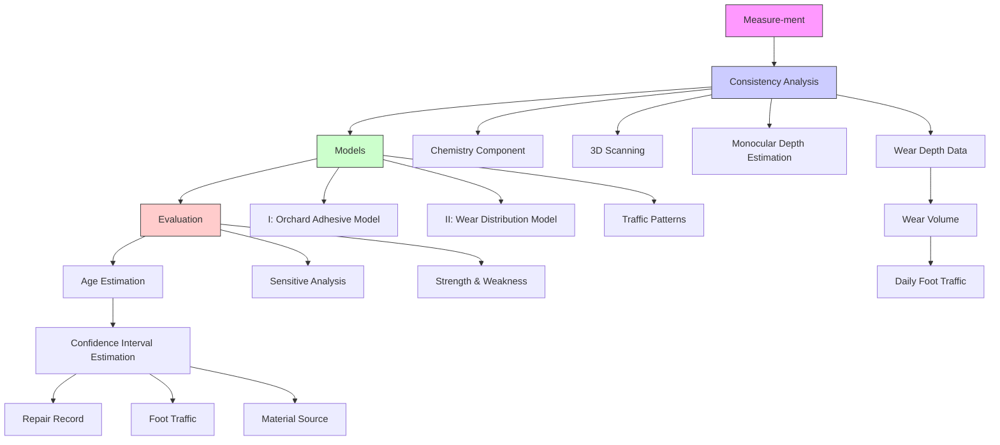
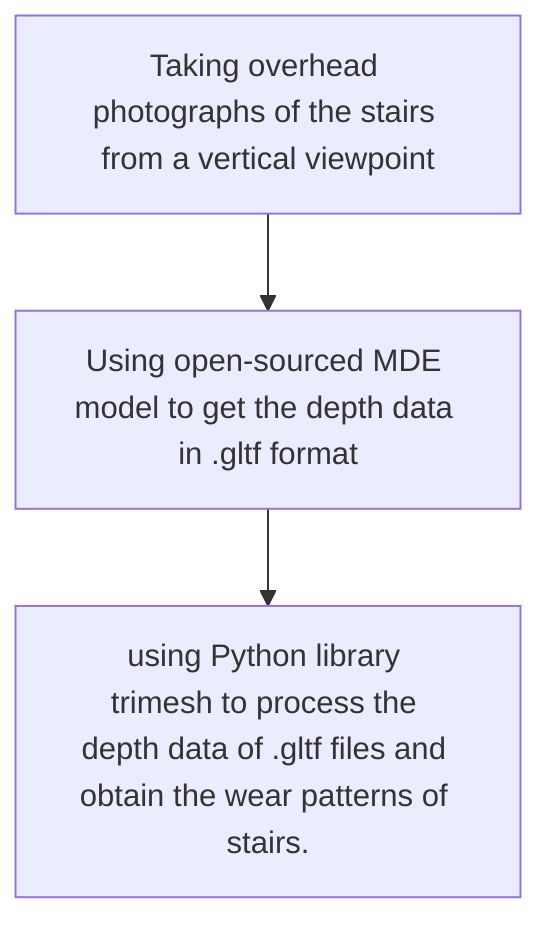

# Staircase Wear Analysis - Walking Through History

## Summary

Stair wear patterns in historic buildings can provide valuable archaeological evidence regarding the building's age, usage and traffic patterns throughout history. In this paper, we develop a comprehensive mathematical framework to analyze wear patterns and provide archaeologists with qualitative tools for historical interpretation.

First, we establish a non-destructive measurement methodology including physical, chemical and biological measurements. Physical measurements involve 3D scanning of stairs and monocular depth estimation. Chemical measurements include isotope analysis and mineral composition testing. Biological measurements involve the study of microbial colonies. Then, we personally collected top-down photos of stairs from ancient buildings. Using depth map estimation methods, we drew heatmaps and obtained wear data.

Following data collection, we address the challenge of quantifying wear volume from discrete point cloud data. We employ Delaunay triangulation to transform the theoretical volume integral into a weighted summation of local triangular volumes, thus accurately calculating spatial wear volume.

Second, we build a Daily Foot Traffic Model based on the Archard equation. We take Archard Adhesive Wear Model and Abrasive Wear Model both into consideration. Besides, we use Bayesian Inversion Framework to calculate the construction time to provide essential parameter.

Third, we establish a Wear Distribution Model to determine movement patterns and simultaneous occupancy levels. The model analyzes wear patterns to deduce whether people moved in single file or side by side, and whether there were predominant directional preferences.

For age estimation, we employ multiple approaches: C14 dating method for wooden staircases, weathering degree analysis for stone staircases, and Bayesian inversion. We constructed a weighted evaluation model of three representative Chemistry Weathering Indecies to evaluate the weathering condition of stone, providing information about its age.

To detect repairs or renovations, we analyze age distribution discontinuities using anomaly detection methods like the Z-score. We also verify the consistency of wear patterns with available historical information. For material source verification, we use the Archard Wear Model to calculate wear coefficients and perform chemical composition analysis to trace the origin of materials. We analyze usage patterns by examining the distribution of wear depth. By calculating the kurtosis of the distribution, we determine the usage pattern of stairs.

Finally, we perform a sensitivity analysis on the key parameters of our model to evaluate its responsiveness. The results demonstrate strong robustness.

Key Words: Stair Wear, Archard Equation, Depth Estimation, Weathering Degree Model, Bayesian Inversion

## Contents

## 1 Introduction 3

1.1 Problem Background 3  
1.2 Literature Review 3  
1.3 Problem Restatement and Analysis 3  
1.4 Our Work 4

## 2 Preparation 4

2.1 Notations 4  
2.2 Assumptions 5  
2.3 Detailed Measurement Plan 6  
2.4 Data collection and processing 8

## 3 Analysis and Modeling 9

3.1 Wear Volume Calculation 9  
3.2 Model I: Daily foot traffic model based on the Archard equation 10  
3.3 Model II: Wear Distribution Model——solving Problem 2 and 3 ..... 12

## 4 Estimate the Age of the Staircase 18

4.1 Estimate the Age of the Wooden Staircase With C14 Dating Method ..... 18  
4.2 Estimate the Age of the Stone Staircase Using Weathering Degree 19  
4.3 Estimate the Age of the Staircase Using Bayesian Inversion ..... 20  
4.4 Verify the Age Estimate through Confidence Interval Estimation 20

## 5 Further exploration 20

5.1 Detection of Repairs or Renovations 20  
5.2 Exploring the Consistency Between Wear and Information available 22  
5.3 Analysis of Usage Patterns 23

## 6 Evaluation of Models 23

6.1 Sensitivity of Model I 23  
6.2 Sensitivity of Model II 24  
6.3 Strength and Weakness 24

## References 24

## Report on Use of AI 26

## 1 Introduction

## 1.1 Problem Background

The constant wear on stairs, especially in historic buildings, is a thought-provoking phenomenon. For example, many ancient buildings, such as temples and churches, show more wear in the center of the stairs than on the sides due to long-term use. The wear not only reflects the use of the stairs, but can also provide some important clues to archaeologists about the history of the building and how the stairs were used. The study of stair wear can help archaeologists speculate on the age of the building, the frequency of use, restoration, and past traffic patterns.

Different patterns of stair use and wear reflect people's behavior, such as whether they walked up and down the stairs alone or with many people walking side by side. Our research aims to develop a mathematical model for archaeologists to better understand the history of building use and to infer information such as the frequency of using stairs, directional preference and the number of people using stairs at the same time. This process is important for the investigation and conservation of historic edifices, offering a scientific foundation for archaeological endeavors and serving as a valuable reference for restoration and preservation initiatives.

The major problems(tasks) dealt with in this paper will be specified in Section 1.3.

## 1.2 Literature Review

Our research focuses on the wear on stairs caused by prolonged foot traffic. However, there is little direct research on this topic. Previous research mainly focused on material wear such as rail wear, gear wear, or some other wear in precision instruments. Previous research pointed out that wear can be categorized into five types: adhesive wear, abrasive wear, corrosive wear, erosive wear, and fretting wear $^{[1]}$ . We primarily focus on adhesive wear and abrasive wear, and believe that the wear on stairs mainly belongs to abrasive wear, with adhesive wear being secondary $^{[2]}$ . Therefore, Archard's wear equation $^{[3]}$ can effectively link the wear volume to the usage conditions of the steps. Furthermore, some researchers have suggested that carbon-14 isotope dating can help determine the usage period of materials such as stone $^{[4]}$ . Additionally, some studies on using machine learning, specifically CNN models $^{[5]}$ , to train data and obtain rail wear amounts have provided us with valuable insights.

## 1.3 Problem Restatement and Analysis

Our aim is to provide some important clues to archaeologists about the history of the building and how the stairs were used. Before solving subsequent problems, we need to do undertake a preliminary step:

Find a non-destructive, low-cost, small-team, and minimal-tool measurement plan.

Then, after obtaining all the data we need, we can build mathematical models to solve the following problems:

Problem 1. The usage frequency of the stairs.

Problem 2. The tendency of movement up and down the stairs. We should figure out whether people move up as well as down the stairs at the same time or there was a predominant direction.  
Problem 3. The number of people who use the stairs at the same time. Determine whether pairs of people climb the stairs side-by-side or travel single file.

Assuming that we have obtained the basic estimates of the stair wear and built the necessary mathematical model, we need to :

Problem 4. Determine if the wear is consistent with the existing information.

Problem 5. Estimate the usage time of the stairs and assess the reliability of the estimate.

Problem 6. Figure out whether the stairs have been repaired or renovated.

Problem 7. Verify if the information source is accurate. (whether it comes from the quarry claimed by archaeologists; whether it matches the age and type of wood)

Problem 8. Get the information about the usage condition of the stairs. (short-term heavy use or long-term light use)

## 1.4 Our Work

Our paper will be organized following the structure below.


<details>
<summary>flowchart</summary>


</details>

Figure 1: Our Work

## 2 Preparation

## 2.1 Notations

The primary notations used in this paper are listed in Table 2.

<table><tr><td>Symbol</td><td>Definition</td><td>Unit</td></tr><tr><td> $V$ </td><td>Wear Volume</td><td> $mm^{3}$ </td></tr><tr><td> $P$ </td><td>Load Force</td><td>N</td></tr><tr><td> $H$ </td><td>Material Hardness</td><td>MPa</td></tr><tr><td> $L$ </td><td>Friction Distance</td><td>m</td></tr><tr><td> $K$ </td><td>Wear Coefficient</td><td>/</td></tr><tr><td> $t$ </td><td>Usage Time</td><td>day</td></tr><tr><td> $n$ </td><td>Daily Foot Traffic</td><td> $day^{-1}$ </td></tr><tr><td> $d$ </td><td>Friction Distance Per Step</td><td>m</td></tr><tr><td> $K_{abr}$ </td><td>Abrasive Wear Coefficient</td><td>/</td></tr><tr><td> $\theta$ </td><td>Angle of Abrasive Cone</td><td>rad</td></tr><tr><td> $N_{0}$ </td><td>Initial Number of Carbon-14 Atoms</td><td>atom</td></tr><tr><td> $N$ </td><td>Current Number of Carbon-14 Atoms</td><td>atom</td></tr><tr><td> $T_{0}$ </td><td>The Half-life of Carbon-14</td><td>year</td></tr><tr><td> $t_{w}$ </td><td>The Usage Time of the Wooden Stairs</td><td>year</td></tr><tr><td> $W_{0}$ </td><td>The Initial Weathering Rate</td><td> $year^{-1}$ </td></tr><tr><td> $\lambda$ </td><td>The Weathering Rate Constant</td><td>/</td></tr><tr><td> $\beta$ </td><td>The Persistent Effect of Microbial Communities</td><td>/</td></tr><tr><td> $d_{w}$ </td><td>The Wear Depth of a Step</td><td>mm</td></tr><tr><td> $\mu$ </td><td>The Mean Wear Depth</td><td>mm</td></tr></table>

Table 1: Notations

## 2.2 Assumptions

Through a complete analysis of the problem, in order to simplify our model, we make the following reasonable assumptions.

Assumption 1: The treading position on the stairs is normally distributed when a single person walks.

The deviation in walking is generally symmetric and is influenced by various random factors. As the number of steps increases, the distribution of treading positions approaches a normal distribution.

Assumption 2: The time spent on each step by an individual is the same.

People generally maintain a steady pace, especially when walking without significant external disturbances. In addition, the time spent on each step tends to be similar due to the coordinated rhythm of movement, particularly during continuous stair climbing.

Assumption 3: When multiple individuals walk side by side, their positions are symmetrically distributed.

People often adjust their walking positions to avoid crowding or collisions, naturally forming a pattern in which their positions are distributed symmetrically along the walking path.

Assumption 4: All steps on the staircase have the same initial material properties, including hardness and density.

Staircases are generally made from the same material or materials with very similar properties throughout the process.

Assumption 5: The steps will be renovated using the same materials as before, and the renovation will not be complete demolishing and rebuilding.

Renovation materials in regular construction are generally consistent with the original materials, and renovation is often the filling in worn areas rather than completely demolishing and rebuilding.

## 2.3 Detailed Measurement Plan

To analyze the wear patterns of stairs and make speculation about their usage, historical context, and traffic patterns, we propose a detailed measurement plan. The following approach integrates physical, chemical, and biological measurements to collect relevant data in a non-destructive, low-cost, small-team, and minimal-tool measurement.

## 2.3.1 Physical Measurements

Through physical measurements, we need to obtain the three-dimensional image of the staircase to establish the coordinate system, material hardness, wear degree and material properties.

(1) 3D Scanning of Stairs with Laser Scanner

We should use a laser scanner to scan the steps, capturing precise geometric data of the stairs $[6]$ .

## Data Collected:

1. Three-dimensional spatial coordinates of the stairs.  
2. High-resolution surface details, including the surface roughness and micro deformation.

Tool Required: Laser scanner (could be handheld or tripod-mounted).


<details>
<summary>natural_image</summary>

Close-up of weathered concrete stairs with visible grain and a small guardrail (no text or symbols)
</details>

Figure 2: An Opensourced Highpoly Stone Old Stairs 3D Model

(2) Depth Measurement of Stairs with Monocular Depth Estimation

Take overhead photographs of the stairs from a vertical viewpoint, and then use Monocular Depth Estimation Model to calculate the wear depth at various locations on the stairs without any destruction to the material $[7]$ . This measurement scheme perfectly meets the requirements of being non-destructive, relatively low-cost, and allowing measurements to be taken by a small team of people with minimal tools.

Data Collected: Precise wear depth at each point.

Tool Required: High-resolution camera.

## Precautions:

1. To address the issue of the MDE model only returning relative depth, a standard ruler should be placed during photography to convert relative depth into absolute measurements.  
2. Due to random errors, the shooting angle may not be perfectly horizontal. Gyroscope data from the device used during photography can be collected to correct the depth information.

Getting Depth Data of Stairs with MDE Model  


<details>
<summary>flowchart</summary>


</details>

Figure 3: Depth Measurement with MDE Model

## 2.3.2 Chemical Measurements——Isotope Analysis and Mineral Composition Testing

Utilize non-invasive isotopic techniques (such as Carbon-14 or stable isotope analysis) to identify chemical signatures in the stone or materials used to construct the stairs $[8]$ . Additionally, measure the mineral composition related to the weathering of the material. The required mineral compositions are listed in Table 4.

Data Collected: Isotopic ratios of the stone or material used to construct the stairs, and the mineral composition associated with weathering.

Tool Required: Portable isotopic analysis and calibration tools (such as the International Radiocobin Database) and tools for analyzing the weathering-related mineral content.

## 2.3.3 Biological Measurements——Acquiring microbial colonies

Take surface samples from the stairs to analyze the microbial colonies. Swab the stair surfaces and perform microbiological analysis to study the types of microbes present and their distribution $[9]$ .

## Data Collected:

1. Microbial diversity and abundance in different areas of the stairs.  
2. Identify the impact of microbial communities on the weathering degree of the staircase.

## Tool Required:

Microbial sampling kits, portable incubators, and analysis tools.

## 2.4 Data collection and processing

To address the lack of public stair wear data, we personally collected top-down photos of stairs from several old temples in China. Using depth map estimation methods, we obtained wear data for further analysis. The sampling points, stair materials, and estimated wear conditions of these stairs are summarized in the table below. In order to observe the wear patterns of each stair, the heatmaps are drawn for each sample.

<table><tr><td>Stair ID</td><td>Sampling Point</td><td>Stair Material</td><td>Visual Assessment of Wear Condition</td></tr><tr><td>1</td><td>1</td><td>Cement</td><td>Slight</td></tr><tr><td>2</td><td>1</td><td>Cement</td><td>Slight</td></tr><tr><td>3</td><td>1</td><td>Cement</td><td>Slight</td></tr><tr><td>4</td><td>1</td><td>Cement</td><td>Moderate</td></tr><tr><td>5</td><td>2</td><td>Blue Slate</td><td>Severe</td></tr><tr><td>6</td><td>2</td><td>Blue Slate</td><td>Severe</td></tr><tr><td>7</td><td>3</td><td>Marble</td><td>Slight</td></tr><tr><td>8</td><td>3</td><td>Marble</td><td>Slight</td></tr><tr><td>9</td><td>3</td><td>Marble</td><td>Slight</td></tr><tr><td>10</td><td>4</td><td>Granite</td><td>Moderate</td></tr><tr><td>11</td><td>4</td><td>Granite</td><td>Slight</td></tr></table>

Table 2: Summary Table of Stair Sample Data


<details>
<summary>natural_image</summary>

Close-up of a textured stone surface with no visible text or symbols
</details>

Sampling Point 1


<details>
<summary>natural_image</summary>

Close-up of concrete pavement tiles with visible aggregate and minor stains, placed on grass (no text or symbols)
</details>

Sampling Point 2


<details>
<summary>natural_image</summary>

Close-up of a textured, granular surface with no visible text or symbols
</details>

Stair No.4


<details>
<summary>natural_image</summary>

Close-up of a textured stone surface with dark and light patches, no visible text or symbols
</details>

Stair No.5


<details>
<summary>natural_image</summary>

Stone arch bridge with carved details, surrounded by greenery and rocks (no text or symbols visible)
</details>

Sampling Point 3


<details>
<summary>natural_image</summary>

Stacked concrete blocks on a grassy path, no visible text or symbols
</details>

Sampling Point 4


<details>
<summary>natural_image</summary>

Close-up of a textured gray surface with vertical striations and small dark specks (no text or symbols)
</details>

Stair No.7


<details>
<summary>natural_image</summary>

Close-up of a textured gray surface with no visible text, symbols, or markings
</details>

Stair No.11  
Figure 4: Photos of the Four Sampling Points and Four Stair Samples


<details>
<summary>heatmap</summary>

| X Range       | Y Range       | Wear Depth |
| ------------- | ------------- | ---------- |
| -0.0006 to 0.0006 | -0.0010 to 0.0010 | -0.00030 to 0.00000 |
| 0.0006 to 0.0006 | -0.0015 to 0.0015 | -0.00025 to 0.00015 |
| 4.0006 to 4.0006 | -0.0025 to 0.0025 | -0.0015 to 0.0015 |
| 8.0006 to 8.0006 | -0.0035 to 0.0035 | -0.0025 to 0.0025 |
| 12.0006 to 12.0006 | -0.0045 to 0.0045 | -0.0035 to 0.0035 |
| 16.0006 to 16.0006 | -0.0055 to 0.0055 | -0.0045 to 0.0045 |
| 20.0006 to 20.0006 | -0.0065 to 0.0065 | -0.0055 to 0.0055 |
| 24.0006 to 24.0006 | -0.0075 to 0.0075 | -0.0065 to 0.0065 |
| 28.0006 to 28.0006 | -0.0135 to 4.9999 | -0.135 to 4.9999 |
| 32.9999 to 32.9999 | -         | -          |
</details>

(a) Stair No.2


<details>
<summary>heatmap</summary>

| X Range | Y Range | Wear Depth |
| --- | --- | --- |
| -0.00060 to 0.00040 | -0.00125 to 0.00050 | -0.0006 to 0.0000 |
| -0.00040 to 0.00027 | -0.00100 to 0.00050 | -0.0006 to 0.0000 |
| -0.00025 to 0.00040 | -0.00075 to 0.00050 | -0.0006 to 0.0000 |
| -0.00050 to 0.00066 | -0.00125 to 0.00050 | -0.0006 to 0.0000 |
| -0.00125 to 0.00066 | -0.00125 to 0.00050 | -0.0006 to 0.0000 |
| -0.00125 to 0.00125 | -0.0125 to 0.0125 | -0.0125 to 0.125 |
| -0.0125 to 0.0125 | -0.125 to 0.125 | -0.125 to 1.125 |
| -0.125 to 1.125 | -1.125 to 1.125 | -1.125 to 1.125 |
| -1.125 to 1.125 | -1.125 to 1.125 | -1.125 to 1.125 |
| -1.125 to 1.125 | -1.125 to 1.125 | -1.125 to 1.125 |
| -1.125 to 1.1 | -1.125 to 1.1 | -1.1 |
| -1.125 to 1.1 | -1.1 | -1 |
| -1.1 | -1 | 1 |
| -1 | 1 | 1 |
| 1 | 1 | 1 |
| 1 | 1 | 1 |
| 1 | 1 | 1 |
| 1 | 1 | 1 |
| 1 | 1 | 1 |
| 1 | 1 | 1 |
| 1 | 1 | 1 |
| 1 | 1 | 1 |
</details>

(b) Stair No.3


<details>
<summary>heatmap</summary>

| X Range | Y Range | Wear Depth |
| --- | --- | --- |
| -0.0006 to 0.0006 | -0.0003 to 0.0004 | -0.0005 to 0.0001 |
| 0.0006 to 0.0006 | -0.0003 to 0.0004 | -0.0005 to 0.0001 |
| 0.0006 to 0.0006 | -0.0003 to 0.0004 | -0.0005 to 0.0001 |
| 2.0006 to 4.0006 | -0.0003 to 0.0004 | -0.0005 to 0.0001 |
| 4.0006 to 6.0006 | -0.0003 to 0.0004 | -0.0005 to 0.0001 |
| 6.0006 to 8.0006 | -0.0003 to 0.0004 | -0.0005 to 0.0001 |
| 8.0006 to 1.2e-4 | -0.0003 to 0.0004 | -0.0005 to 0.0001 |
| 1.2e-4 to 2.4e-4 | -0.0003 to 0.0004 | -0.0005 to 0.0001 |
| 2.4e-4 to 4.6e-4 | -0.0003 to 0.0004 | -0.0005 to 0.0001 |
| 4.6e-4 to 6.8e-4 | -0.0003 to 0.0004 | -0.0005 to 0.0001 |
| 6.8e-4 to 9.1e-4 | -0.0003 to 0.0004 | -0.0005 to 0.0001 |
| 9.1e-4 to 1.2e-4 | -0.0x | - |
</details>

(c) Stair No.5  
Figure 5: Wear Depth Heatmap Samples

## 3 Analysis and Modeling

## 3.1 Wear Volume Calculation

## 1.Mathematical Modeling of Step Surface Wear Volume

The goal of surface wear volume calculation is to estimate the spatial volume (the concave part) beneath a three-dimensional surface. Suppose a continuous surface $z = f(x,y)$ , the concave volume can theoretically be represented as:

$$
V = \iint_ {S} | f (x, y) | d A \tag {1}
$$

where: $f(x,y)$ is the height (or depth) function of the surface; dA is the differential area element.

However, the actual data consists of discrete point clouds without an analytical form of $f(x,y)$ , so the integral cannot be directly solved. We use the triangulation method to discretize the problem and replace the integral with a weighted summation over the areas and depths of triangles.

## 2. Principle of the Discrete Method

## Triangulation

Data points are distributed in the plane, and through triangulation (Delaunay Triangulation), the point cloud is divided into many small triangles; Each small triangle approximates a part of the original surface $[10]$ .

## Local Volume Calculation

For each triangle, we compute its area $A$ :

$$
A = \frac {1}{2} \| \vec {v _ {1}} \times \vec {v _ {2}} \| \tag {2}
$$

where $\vec{v}_{1}$ and $\vec{v}_{2}$ are the two edge vectors of the triangle.

Compute the average depth $h$ of the triangle region: $h = \frac{1}{3}(z_1 + z_2 + z_3)$

Compute the local volume: $V = A \cdot |h|$

## Global Volume Summation

The total volume is obtained by summing the local volumes of all triangles:

$$
V _ {\text { total }} = \sum_ {i} A _ {i} \cdot | h _ {i} | \tag {3}
$$

## 3.2 Model I: Daily foot traffic model based on the Archard equation

To solve Problem 1—the usage frequency of the stairs, we only need to consider the total wear. Based on our literature review and analysis, wear can be categorized into five types $^{[1]}$ , and we believe the wear on stairs mainly belongs to abrasive wear, with adhesive wear being secondary. Therefore, Archard's wear equation $^{[3]}$ can effectively link the wear volume to the usage conditions of the steps.

## 3.2.1 Archard Adhesive Wear Model

The wear volume V based on the Archard Adhesive model is given by the following formula:

$$
V = \frac {K P L}{3 H} \tag {4}
$$

where: V is the wear volume, K is the wear coefficient, P is the load force, L is the Friction distance and H is the material hardness.

## 3.2.2 Archard Abrasive Wear Model:

In adhesive wear, K represents the probability of wear debris being generated at the contact microasperities; while in abrasive wear, $K_{abr}$ represents the product of the abrasive particle geometric factor $\frac{2ctg\theta}{\pi}$ and a proportional constant. The actual proportional constant is the fraction of all abrasive particles that generate wear debris [11].

According to the Archard equation, the abrasive wear coefficient is given by:

$$
K _ {a b r} = \frac {3 \tan \theta}{\pi} = 0. 9 6 \tan \theta \approx \tan \theta \tag {5}
$$

Thus, the simplified abrasive wear equation can be:

$$
V = K _ {a b r} \cdot \frac {L}{3 H} \tag {6}
$$

Based on the theoretical calculations, the values of $\tan\theta$ and KP show little difference in the theoretical results of the stair wear model. Therefore, we can simplify the model and use formula (1) to solve the problem.

From the Archard model, we can estimate the wear volume by calculating the total friction distance. The total friction distance L is given by the formula:

$$
L = n \cdot d \cdot t \tag {7}
$$

where: n is the daily foot traffic, d is the friction distance of an average person, t is the total time.

According to the analysis, the theoretical value of d is 0.01 m, and P is 650 N.

Combining the equations above, we get:

$$
n = \frac {3 \cdot V \cdot H}{K \cdot P \cdot d \cdot t} \tag {8}
$$

Applying this formula to our 11 staircase samples, we calculated the estimated average daily pedestrian flow, as shown in the table below. The values of H and K used in the estimation were referenced from relevant literature on staircase materials, while t was estimated based on publicly available information about the building:

<table><tr><td>Stair ID</td><td>t (day)</td><td>V ( $mm^3$ )</td><td>Wear Condition</td><td>n ( $day^{-1}$ )</td></tr><tr><td>1</td><td>9100</td><td>3796.5</td><td>Slight</td><td>1925.5</td></tr><tr><td>2</td><td>9100</td><td>2395</td><td>Slight</td><td>1214.7</td></tr><tr><td>3</td><td>9100</td><td>3833</td><td>Slight</td><td>1944.0</td></tr><tr><td>4</td><td>9100</td><td>6277</td><td>Moderate</td><td>3183.6</td></tr><tr><td>5</td><td>29200</td><td>10617</td><td>Severe</td><td>8390.6</td></tr><tr><td>6</td><td>29200</td><td>13495</td><td>Severe</td><td>6399.1</td></tr><tr><td>7</td><td>5470</td><td>4024.5</td><td>Slight</td><td>5093.5</td></tr><tr><td>8</td><td>5470</td><td>3598</td><td>Slight</td><td>4553.7</td></tr><tr><td>9</td><td>5470</td><td>2351.5</td><td>Slight</td><td>5952.3</td></tr><tr><td>10</td><td>14600</td><td>7496.5</td><td>Moderate</td><td>4739.6</td></tr><tr><td>11</td><td>14600</td><td>5753.5</td><td>Slight</td><td>3637.6</td></tr></table>

Table 3: Foot Traffic Estimation for Stair Samples

## 3.2.3 Bayesian Inversion Framework

To estimate the daily foot traffic n and usage time t, a Bayesian inversion framework is employed. This approach combines prior knowledge with observed data to infer the posterior distribution of the parameters.

The prior distribution represents our initial knowledge about the parameters. For usage time t, a uniform distribution is assumed:

$$
t \sim \mathcal {U} (t _ {\min}, t _ {\max}), \tag {9}
$$

where $t_{min} = 50$ years and $t_{max} = 200$ years.

The likelihood function quantifies the agreement between the observed wear volume $V_{obs}$ and the model prediction $V_{model}$ . It is defined as:

$$
\mathcal {L} (t | V _ {\mathrm{obs}}) = \exp \left(- \frac {(V _ {\mathrm{model}} (t) - V _ {\mathrm{obs}}) ^ {2}}{2 \sigma^ {2}}\right), \tag {10}
$$

where:

$V_{\text{model}}(t)$ is the wear volume predicted by the Archard model for a given t, $\sigma$ is the standard deviation of the observation error.

Posterior distribution combines the prior distribution and the likelihood function using Bayes' theorem:

$$
P (t | V _ {\mathrm{obs}}) \propto \mathcal {L} (t | V _ {\mathrm{obs}}) \cdot P (t). \tag {11}
$$

The posterior distribution is estimated using a grid search over the range $t \in [t_{\min}, t_{\max}]$ .

The maximum a posteriori (MAP) estimate of t is obtained by maximizing the posterior distribution:

$$
t _ {\mathrm{MAP}} = \arg \max _ {t} P (t | V _ {\mathrm{obs}}). \tag {12}
$$

Once $t_{MAP}$ is determined, the daily foot traffic n is calculated using:

$$
n = \frac {3 \cdot V _ {\mathrm{obs}} \cdot H}{K \cdot P \cdot d \cdot t _ {\mathrm{MAP}}}. \tag {13}
$$

## 3.3 Model II: Wear Distribution Model——solving Problem 2 and 3

## The solution of Problem 2

## 1. Preliminary analysis

We establish a two-dimensional coordinate system, with the midpoint of the step edge as the origin. Take the step's horizontal length as the x-axis and the vertical width as the y-axis.

The difference between ascending and descending mainly lies in the different force points on the steps, reflected in the y-coordinate. This problem doesn't consider the lateral wear differences.

## 2. Analysis of Stair Wear Locations

When moving upstairs, the force is primarily applied to the front edge and the sides of the step. As the foot pushes upward, the pressure is focused on the front part of the stair, which leads to more wear on the front edge of the step.

In contrast, when moving downstairs, the body's weight shifts downward, causing more pressure to be applied to the central and rear parts of the step. This results in greater wear on the middle and rear edges of the stair. The force analysis diagrams of these two processes will be shown below.


<details>
<summary>text_image</summary>

v
f
N
y
F
G
x
</details>

Figure 6: Going upstairs


<details>
<summary>text_image</summary>

x
v
y
f
N
F
G
</details>

Figure 7: Going downstairs

According to the analysis of movement differences and the force analysis diagram, it can be seen that:

Upward movement causes wear primarily on the front edge and the edges of the stairs.

Downward movement causes wear mainly on the central part and the rear edge of the steps $[12]$ .

Based on the actual data and the model, it can be established that:

Upward movement: Wear is assumed to follow a "truncated" normal distribution, which means the wear at the front edge and the stair edges gradually decreases as we move along the stairs, with the highest wear occurring at the front part.

Downward movement: Wear follows a normal distribution, meaning the wear is most significant in a certain region on the central part of the stairs, and the distribution is typically more symmetrical.

If both upward and downward movements occur: Wear depth will exhibit a bimodal distribution, which is the combination of two normal distributions — one representing the wear from upward movement and the other representing the wear from downward movement.

## 3. Mathematical Modeling

To solve this problem, we can establish a mathematical model through the following steps:

## 3.1 Establishing the 2D Coordinate System

- Set up a 2D coordinate system, with the midpoint of the stair edge as the origin.  
- The y-coordinate represents the position along the stair from the front edge to the rear edge.

## 3.2 Wear Depth Function $h(y)$

Based on the wear distribution types, we define the average wear depth function $h(y)$ at position y. According to the given assumptions, if we only consider upward or downward movement, the wear depth can be modeled using normal distributions.

## Upward movement:

Assuming the wear depth for upward movement follows a "truncated" normal distribution, we can model it as:

$$
h _ {\mathrm{up}} (y) = \frac {1}{\sigma \sqrt {2 \pi}} \exp \left(- \frac {(y - \mu_ {\mathrm{up}}) ^ {2}}{2 \sigma^ {2}}\right), \quad y \geq 0 \tag {14}
$$

where $\mu_{\mathrm{up}}$ is the mean position of the wear for upward movement, and $\sigma$ is the standard deviation.

Downward movement: The wear for downward movement typically follows a normal distribution, so we can represent it as:

$$
h _ {\text { down }} (y) = \frac {1}{\sigma_ {\text { down }} \sqrt {2 \pi}} \exp \left(- \frac {(y - \mu_ {\text { down }}) ^ {2}}{2 \sigma_ {\text { down }} ^ {2}}\right) \tag {15}
$$

where $\mu_{down}$ is the mean position of the wear for downward movement, and $\sigma_{down}$ is the standard deviation.

Both upward and downward movements: If both upward and downward movements occur, the wear depth will exhibit a bimodal distribution, which can be represented by the sum of two normal distributions:

$$
h _ {\text { total }} (y) = \alpha \cdot h _ {\mathrm{up}} (y) + (1 - \alpha) \cdot h _ {\mathrm{down}} (y) \tag {16}
$$

where $\alpha$ is a weight coefficient representing the proportion of upward movement, and $1 - \alpha$ represents the proportion of downward movement.

## 3.3 Computer Simulation of Several Typical Wear Patterns.

After considering all the above factors, we wrote a Python program using the Monte Carlo method to simulate stair wear based on some hypothetical data. The program generates surface plots of the stair tread and wear depth heatmaps corresponding to the three typical wear patterns, which are shown below:


<details>
<summary>3d surface plot and heatmap</summary>

| x (degrees) | y (degrees) | Height of worm Sleep Distribution |
| ----------- | ----------- | ---------------------------------- |
| 0           | 5           | 1.895                              |
| 5           | 4           | 1.740                              |
| 10          | 3           | 1.585                              |
| 15          | 2           | 1.410                              |
| 20          | 1           | 1.275                              |
| 25          | 0           | 1.210                              |
| 30          | -1          | 1.045                              |
| 35          | -2          | 0.910                              |
</details>

(a) Single File Upstairs


<details>
<summary>3d surface plot and heat map</summary>

| X (length) | Y (height) | Height |
| ---------- | ---------- | ------ |
| 0          | 0          | 1.980  |
| 5          | 1.4        | 1.863  |
| 10         | 1.8        | 1.845  |
| 15         | 2.0        | 1.875  |
| 20         | 2.0        | 1.903  |
| 25         | 2.0        | 1.935  |
| 30         | 2.0        | 1.965  |
| 35         | 2.0        | 2.025  |
</details>

(b) Single File Downstairs


<details>
<summary>3d surface plot combined with a heatmap</summary>

| x_Light | y Position | Height of Warm Step |
| ------- | ---------- | ------------------- |
| 0       | 0          | 1.94                |
| 5       | 5          | 1.79                |
| 10      | 10         | 1.74                |
| 15      | 15         | 1.78                |
| 20      | 20         | 1.82                |
| 25      | 25         | 1.86                |
| 30      | 30         | 1.90                |
| 35      | 35         | 1.94                |
| 40      | 40         | 2.02                |
</details>

(c) Both Upstairs and Downstairs  
Figure 8: Typical Wear Patterns for Problem 2

## 3.4 Hypothesis Testing

Based on the wear depth data obtained, we can perform hypothesis testing.

Null Hypothesis (H0): The wear depth follows a normal distribution or truncated normal distribution.

Alternative Hypothesis (H1): The wear depth doesn't follow a normal distribution or truncated normal distribution.

We have obtained a set of stair wear depth data representing the wear at various positions y.

The Shapiro-Wilk test involves the following steps:

1. Calculate the sample mean $\bar{h}$ :

$$
\bar {h} = \frac {1}{n} \sum_ {i = 1} ^ {n} h _ {i} \tag {17}
$$

where n is the sample size and $h_{i}$ is the individual wear depth value.

2. Sort the data $h_{(1)}, h_{(2)}, \ldots, h_{(n)}$ , which means ordering the wear depths in increasing order.  
3. Calculate the Shapiro-Wilk statistic $W$ : The statistic $W$ is calculated using the formula:

$$
W = \frac {\left(\sum_ {i = 1} ^ {n} a _ {i} h _ {(i)}\right) ^ {2}}{\sum_ {i = 1} ^ {n} (h _ {i} - \bar {h}) ^ {2}} \tag {18}
$$

where $a_{i}$ is a set of constants calculated based on the sample size $n$ , $h_{(i)}$ are the ordered data points, and $\bar{h}$ is the sample mean.

4. Comparing the Statistic with Critical Values

For a sample size of n = 10 and a significance level of $\alpha = 0.05$ , you can refer to the Shapiro-Wilk critical value table to obtain the critical value $W_{crit}$ . If the computed W is greater than the critical value $W_{crit}$ , you fail to reject the null hypothesis, indicating that the data follows a normal distribution. If W is smaller than the critical value, you reject the null hypothesis, indicating that the data does not follow a normal distribution.

## 3.5 Interval Estimation

If the hypothesis testing results support the normal distribution assumption, we can perform interval estimation for the mean $\mu$ . Using the sample mean $\bar{y}$ and standard deviation s, we can estimate the confidence interval for $\mu$ using the following formula:

$$
\mu \in \left[ \bar {y} - t _ {\alpha / 2} \cdot \frac {s}{\sqrt {n}}, \bar {y} + t _ {\alpha / 2} \cdot \frac {s}{\sqrt {n}} \right] \tag {19}
$$

where $t_{\alpha/2}$ is the critical value from the t-distribution, and n is the sample size.

## 4. Considering "Edge Effect" in Wear

Wear is expected to be more significant at the edges of the stairs than at the center. Therefore, we need to account for this factor in our model. This can be done by adding an adjustment factor $k_{edge}$ for the edge region, such that wear is higher near the edges. Specifically, we can modify the wear depth function as follows:

$$
h _ {\text { total }} (y) = \left(1 + k _ {\text { edge }} \cdot | y |\right) \cdot \left(\alpha \cdot h _ {\text { up }} (y) + (1 - \alpha) \cdot h _ {\text { down }} (y)\right) \tag {20}
$$

where $k_{edge}$ is a constant representing the intensity of the edge effect, and $|y|$ is the absolute distance from the center.

## 5. Analysis on Stair Samples

To demonstrate the variation in wear extent along the y-axis, we developed a Python program that bins the y-axis into an appropriate number of equally spaced intervals. The maximum wear depth within each bin was then extracted, and a projection curve of wear depth distribution along the y-axis was plotted. It can be observed that they align with the patterns we previously analyzed, as several typical cases are shown below:


<details>
<summary>line chart</summary>

| Y        | Depth     |
| -------- | --------- |
| -0.0015  | 0.00000   |
| -0.0014  | -0.00001  |
| -0.0013  | -0.00002  |
| -0.0012  | -0.00003  |
| -0.0011  | -0.00004  |
| -0.0010  | -0.00005  |
| -0.0009  | -0.00006  |
| -0.0008  | -0.00007  |
| -0.0007  | -0.00008  |
| -0.0006  | -0.00009  |
| -0.0005  | -0.0001   |
| -0.0004  | -0.00011  |
| -0.0003  | -0.00012  |
| -0.0002  | -0.00013  |
| -0.0001  | -0.00014  |
| 0.0      | -0.00015  |
| 0.0      | -0.00016  |
| 0.0      | -         |
| 0.0      | -         |
| 0.1      | -         |
| 1.2      | -         |
| 2.3      | -         |
| 3.4      | -         |
| 4.5      | -         |
| 5.6      | -         |
| 6.7      | -         |
| 7.8      | -         |
| 8.9      | -         |
| 1    | -         |
</details>

(a) Both Upstairs and Downstairs


<details>
<summary>line chart</summary>

| Y-axis       | Depth     |
| ------------ | --------- |
| -0.0003      | -0.00006  |
| -0.0002      | -0.00008  |
| -0.0001      | -0.00009  |
| 0.0000       | -0.00008  |
| 0.0001       | -0.00007  |
| 0.0002       | -0.00005  |
| 0.0003       | -0.00003  |
</details>

(b) Downstairs Primarily


<details>
<summary>line chart</summary>

| Y        | Depth     |
| -------- | --------- |
| -0.0003  | -0.00010  |
| -0.0002  | -0.00011  |
| -0.0001  | -0.00012  |
| 0.0000   | -0.00013  |
| 0.0001   | -0.00014  |
| 0.0002   | -0.00015  |
| 0.0003   | -0.00016  |
| 0.0004   | -0.00017  |
</details>

(c) Upstairs Primarily  
Figure 9: Stair Cases for Problem 2

## The solution of Problem 3:

## 1. Initial Analysis

Regarding the number of people using the stairs simultaneously and whether they climb side-by-side or in single file, we can extend the concepts discussed in Problem 2.

When multiple people are involved, the wear distribution changes:

Side-by-side movement results in a multi-peak distribution of wear, which covers the front edge of the stairs (for upward movement) or the central part of the stairs (for downward movement). The peaks represent the locations where each person steps, and the number of peaks indicates how many people are moving simultaneously.

Single-file movement produces a single peak at the location of one person's step, with the intensity of wear varying along the length of the stairs.


<details>
<summary>3d surface plot and 2d heatmap visualization</summary>

| X (Length) | Y (Width) | Height of Worm Step |
| ---------- | --------- | ------------------- |
| 0          | 0         | 1.475               |
| 5          | 1.550     | 1.550               |
| 10         | 1.625     | 1.625               |
| 15         | 1.700     | 1.700               |
| 20         | 1.775     | 1.775               |
| 25         | 1.850     | 1.850               |
| 30         | 2.000     | 2.000               |
</details>

(a) Pairs of People Upstairs


<details>
<summary>3d surface plot combined with a 2d scatter plot</summary>

| X (Length) | Y (width) | Height of Worm Step |
| ---------- | --------- | ------------------- |
| 0          | 0         | 1.785               |
| 5          | 1         | 1.815               |
| 10         | 2         | 1.845               |
| 15         | 3         | 1.875               |
| 20         | 4         | 1.905               |
| 25         | 5         | 1.935               |
| 30         | 6         | 1.965               |
| 35         | 7         | 1.995               |
| 40         | 8         | 2.025               |
</details>

(b) Pairs of People Downstairs  
Figure 10: Typical Wear Patterns for Problem3

## 2. Mathematical Modeling of Multiple People Moving

If people are moving in side-by-side formation, the wear distribution can be represented as the sum of several normal distributions, with each peak corresponding to a person's position.

For upward movement, the wear can be modeled as:

$$
h _ {\text { side   -   by   -   side   up }} (y) = \sum_ {i = 1} ^ {N} \frac {1}{\sigma_ {\mathrm{up}} \sqrt {2 \pi}} \exp \left(- \frac {(y - \mu_ {\mathrm{up} , i}) ^ {2}}{2 \sigma_ {\mathrm{up}} ^ {2}}\right) \tag {21}
$$

where: $N$ is the number of people moving side-by-side, $\mu_{\mathrm{up},i}$ is the mean position of the $i$ -the person's step, $\sigma_{\mathrm{up}}$ is the standard deviation representing the spread of wear.

The same applies to downward movement.

If multiple people are moving both upward and downward simultaneously, the total wear depth distribution will be a multimodal distribution, representing the superposition of upward and downward movements.

As in Problem 2, we plotted the projection of wear depth along the x-axis for some staircase samples. In the following, three typical cases are presented.


<details>
<summary>line chart</summary>

| x        | y          |
| -------- | ---------- |
| -0.0008  | 0.000000   |
| -0.0006  | -0.000025  |
| -0.0004  | -0.000100  |
| -0.0002  | -0.000125  |
| 0.0000   | -0.000150  |
| 0.0002   | -0.000175  |
| 0.0004   | -0.000175  |
| 0.0006   | -0.000175  |
</details>

(a) Single File


<details>
<summary>line chart</summary>

| x        | y       |
| -------- | ------- |
| -0.0008  | -0.000050 |
| -0.0006  | -0.000125 |
| -0.0004  | -0.000375 |
| -0.0002  | -0.000150 |
| 0.0000   | -0.000280 |
| 0.0002   | -0.000175 |
| 0.0004   | -0.000125 |
| 0.0006   | -0.000150 |
| 0.0008   | -0.000125 |
| 0.0010   | -0.000150 |
| 0.0012   | -0.000175 |
| 0.0014   | -0.000125 |
| 0.0016   | -0.000150 |
| 0.0018   | -0.000125 |
| 0.0020   | -0.000150 |
| 0.0022   | -0.000175 |
| 0.0024   | -0.000125 |
| 0.0026   | -0.000150 |
| 0.0028   | -0.000125 |
| 0.0030   | -0.000150 |
| 0.0032   | -0.00-1.5  |
| 0.0-          | -         |
</details>

(b) Double Files


<details>
<summary>line chart</summary>

| x        | Depth     |
| -------- | --------- |
| -0.0008  | -0.00002  |
| -0.0007  | -0.00004  |
| -0.0006  | -0.00005  |
| -0.0005  | -0.00006  |
| -0.0004  | -0.00007  |
| -0.0003  | -0.0001   |
| -0.0002  | -0.00012  |
| -0.0001  | -0.00014  |
| 0.0      | -0.00016  |
| 0.0001   | -0.00018  |
| 0.0002   | -0.0002   |
| 0.0003   | -0.00022  |
| 0.0004   | -0.00024  |
| 0.0      | -0.00026  |
</details>

(c) Double Files  
Figure 11: Stair Cases for Problem 3

## 3. Dealing with Two-Way Traffic

If the stairs allow for simultaneous upward and downward movement (two-way traffic), two different scenarios arise:

## 3.1 Automatic two-way traffic:

If one side of the stairs is used for upward movement and the other side for downward movement (e.g., left side for up, right side for down), the wear distribution will show two distinct sets of peaks—one representing the upward movement and the other representing the downward movement.

The peak locations for the upward and downward movement will be distinct along the y-axis, and we can analyze these to determine the direction of movement.

## 3.2 Mixed two-way traffic:

If both upward and downward movements occur in the same region of the stairs, the wear distribution will be a multi-modal distribution (similar to the single-file or side-by-side cases), but with overlapping peaks. The distribution will reflect both upward and downward movement, and by analyzing the relative positioning of the peaks, we can estimate the number of people moving in both directions.


<details>
<summary>3d surface plot and heatmap</summary>

| Height of Worm Step | Value |
| ------------------- | ----- |
| 1.74                | 2.01  |
| 1.77                | 2.01  |
| 1.80                | 2.01  |
| 1.83                | 2.01  |
| 1.86                | 2.01  |
| 1.89                | 2.01  |
| 1.92                | 2.01  |
| 1.95                | 2.01  |
| 1.98                | 2.01  |
| 2.01                | 2.01  |
</details>

(a) Pairs of People Upstairs and Downstairs


<details>
<summary>3d surface plot combined with a 2d scatter plot</summary>

| X (length) | Y (width) | Height of Worm Step |
| --- | --- | --- |
| 0 | 0 | 1.785 |
| 5 | 1.8 | 1.815 |
| 10 | 2.0 | 1.845 |
| 15 | 1.9 | 1.875 |
| 20 | 1.8 | 1.905 |
| 25 | 1.7 | 1.935 |
| 30 | 1.6 | 1.965 |
| 35 | 1.5 | 1.995 |
| 40 | 1.4 | 2.025 |
| 45 | 1.3 | 1.995 |
| 50 | 1.2 | 1.965 |
| 55 | 1.1 | 1.935 |
| 60 | 1.0 | 1.905 |
| 65 | 0.9 | 1.875 |
| 70 | 0.8 | 1.845 |
| 75 | 0.7 | 1.815 |
| 80 | 0.6 | 1.785 |
| 85 | 0.5 | 1.785 |
| 90 | 0.4 | 1.785 |
| 95 | 0.3 | 1.785 |
| 100 | 0.2 | 1.785 |
| 105 | 0.1 | 1.785 |
| 110 | 0.0 | 1.785 |
| 115 | -0.1 | 1.785 |
| 120 | -0.2 | 1.785 |
| 125 | -0.3 | 1.785 |
| 130 | -0.4 | 1.785 |
| 135 | -0.5 | 1.785 |
| 140 | -0.6 | 1.785 |
| 145 | -0.7 | 1.785 |
| 150 | -0.8 | 1.785 |
| 155 | -0.9 | 1.785 |
| 160 | -1.0 | 1.785 |
| 165 | -1.1 | 1.785 |
| 170 | -1.2 | 1.785 |
| 175 | -1.3 | 1.785 |
| 180 | -1.4 | 1.785 |
| 185 | -1.5 | 1.785 |
| 190 | -1.6 | 1.785 |
| 195 | -1.7 | 1.785 |
| 200 | -1.8 | 1.785 |
| 205 | -1.9 | 1.785 |
| 210 | -2.0 | 1.785 |
| 215 | -2.1 | 1.785 |
| 220 | -2.2 | 1.785 |
| 225 | -2.3 | 1.785 |
| 230 | -2.4 | 1.785 |
| 235 | -2.5 | 1.785 |
| 240 | -2.6 | 1.785 |
| 245 | -2.7 | 1.785 |
| 250 | -2.8 | 1.785 |
| 255 | -2.9 | 1.785 |
| 260 | -3.0 | 1.785 |
| 265 | -3.1 | 1.785 |
| 270 | -3.2 | 1.785 |
| 275 | -3.3 | 1.785 |
| 280 | -3.4 | 1.785 |
| 285 | -3.5 | 1.785 |
| 290 | -3.6 | 1.785 |
| 295 | -3.7 | 1.785 |
| 300 | -3.8 | 1.785 |
| ... | ... | ... |
| ... | ... | ... |
| ... | ... | ... |
| ... | ... | ... |
| ... | ... | ... |
| ... | ... | ... |
| ... | ... | ... |
| ... | ... | ... |
| ... | ... | ... |
| ... | ... | ... |
| ... | ... | ... |
| ... | ... | ... |
| ... | ... | ... |
| ... | ... | ... |
| ... | ... | ... |
| ... | ... | ... |
| ... | ... | ... |
| ... | ... | ... |
| ... | ... | ... |
| ... | ... | ... |
| ... | ... | ... |
| ... | ... | ... |
| ... | ... | ... |
| ... | ... | ... |
| ... | ... | ... |
| ... | ... | ... |
| ... | ... | ... |
| ... | ... | ... |
| ... | ... | ... |
| ... | ... | ... |
| ... | ... | ... |
| ... | ... | ... |
| ... | ... | ... |
| ... | ... | ... |
| ... | ... | ... |
| ... | ... | ... |
| ... | ... | ... |
| ... | ... | ... |
| ... | ... | ... |
| ... | ... | ... |
| ... | ... | ... |
| ... | ... | ... |
| ... | ... | ... |
| ... | ... | ... |
| ... | ... | ... |
| ... | ... | ... |
| ... | ... | ... |
| ... | ... | ... |
| ... | ... | ... |
| ... | ... | ... |
| ... | ... | ... (approx) |
</details>

(b) Left Downstairs, Right Upstairs  
Figure 12: Composite Wear Patterns

## 4. Hypothesis Testing and Estimation

Using hypothesis testing, we can assess whether the observed wear distribution fits the expected patterns (normal or truncated normal distributions). For the wear data collected, we perform the Shapiro-Wilk test as described in Problem 2 to confirm the distribution type.

## 4 Estimate the Age of the Staircase

In this part, we will figure out the estimation of the age of the stairs. The reason for dedicating a separate section to it is that the C14 dating method, weathering degree model, and Bayesian inversion method used here have an insightful role in solving the subsequent problems.

For wooden stairs, the construction year can be inferred using the radiocarbon dating method (Carbon-14 dating).

For stone stairs, the construction year can be inferred by analyzing the degree of weathering. By selecting parts of the stairs that are less likely to be directly affected by foot traffic, such as the riser, stringer, or lightly worn areas of the step tread, and examining the degree of weathering, the construction year of the stone stairs can be accurately estimated.

Then, we use Bayesian inversion method to compare observed and theoretical values, and the maximum a posteriori (MAP) estimation method is used to find the most probable age t given the data.

With all the methods above, we finally assess the reliability of the age estimate through the calculation of a confidence interval.

## 4.1 Estimate the Age of the Wooden Staircase With C14 Dating Method

Carbon-14 dating is a method based on the half-life of carbon-14 to estimate the age of an object. By measuring the current carbon-14 content in a wood sample, we can estimate the age of the wood, i.e., the usage time of the wooden stairs $[13]$ .

The carbon-14 decay process follows an exponential decay law, represented by the formula:

$$
\frac {N}{N _ {0}} = e ^ {- \frac {t _ {\mathrm{w}}}{T _ {0}} \ln 2} \tag {22}
$$

where: $N_{0}$ : The initial number of carbon-14 atoms in the wood when it was cut. N: The current number of carbon-14 atoms in the sample. $T_{0} = 5730$ years: The half-life of carbon-14.

$t_{w}$ : the age of the wood, i.e., the usage time of the wooden stairs.

Rearranging the equation, we get:

$$
t _ {\mathrm{w}} = \frac {- T _ {0} \ln \frac {N}{N _ {0}}}{\ln 2} \tag {23}
$$

## 4.2 Estimate the Age of the Stone Staircase Using Weathering Degree

When estimating the age of stone stairs, one effective method is to analyze the degree of weathering, which is influenced by the exposure to environmental factors such as humidity, temperature, and microbial activities. Therefore, we will select parts of the stairs that are rarely touched by feet, such as the riser, stringer, or the least worn areas of the step tread, to examine their weathering level, in order to eliminate the influence of wear on the degree of weathering.

It is assumed that the weathering process occurs gradually and affects the surface of the stone in a regular pattern year by year. A common weathering rate model is the exponential decay model.

$$
W (t) = W _ {0} e ^ {- \lambda t} + \beta \tag {24}
$$

where: $W(t)$ is the degree of weathering at time t, $W_{0}$ is the initial weathering rate, $\lambda$ is the weathering rate constant and $\beta$ is the persistent effect of microbial communities

Due to the inherent variability in the chemical composition of rocks, it is difficult to characterize weathering conditions through changes in a single chemical component. The academic community generally uses chemical weathering indices to represent weathering conditions. Research has shown that the following three chemical weathering indices—WI, PI, and LOI—exhibit clear monotonicity and sensitivity to changes in weathering degree and time $[14]$ . These indices can be used as the primary basis for evaluating the degree of rock weathering and determining weathering depth. Their calculation methods are as follows, in which all chemical formulas represent the amount of substance:

<table><tr><td>Chemical Weathering Index</td><td>Formula</td></tr><tr><td>WI</td><td> $I = \frac{I_{Weather}/I_{Fresh},$  $K_2O + Na_2O + CaO - H_2O}{SiO_2 + Al_2O_3 + Fe_2O_3 + TiO_2 + CaO + MgO + Na_2O + K_2O} \times 100\%$ </td></tr><tr><td>PI</td><td> $I_{Weather}/I_{Fresh}, I = \frac{Si_2O}{Si_2O + Ti_2O + Fe_2O_3 + Al_2O_3} \times 100\%$ </td></tr><tr><td>LOI</td><td> $I_{Weather}/I_{Fresh}, I = \frac{m(H_2O)}{m} \times 100\%$ </td></tr></table>

Table 4: Chemical Weathering Indices

Therefore, we use these three indices to construct a weighted evaluation model for comprehensively assessing the weathering degree $W(t)$ of the stone, namely:

$$
W (t) = w _ {1} (W T) + w _ {2} (P I) + w _ {3} (L O I) \tag {25}
$$

$w_{1}, w_{2}, w_{3}$ represent the weights of the three chemical weathering indices, satisfying $w_{1} + w_{2} + w_{3} = 1$ . The sensitivity of different chemical weathering indices to different types of rocks varies, so the weights can be dynamically adjusted according to the rock type.

By obtaining the degree of weathering $W(t_{0})$ at a specific time $t = t_{0}$ and the current degree of weathering $W_{current}$ , we can estimate the construction age:

$$
t _ {0} = \frac {1}{\lambda} \ln \left(\frac {W _ {0}}{W _ {\text { current }} - \beta}\right) \tag {26}
$$

## 4.3 Estimate the Age of the Staircase Using Bayesian Inversion

The posterior distribution of $t$ is estimated using a uniform prior $t \sim \mathcal{U}(50,200)$ and a Gaussian likelihood:

$$
\mathcal {L} (t | V _ {\mathrm{obs}}) = \exp \left(- \frac {(V _ {\mathrm{obs}} - V _ {\mathrm{theory}}) ^ {2}}{2 \sigma^ {2}}\right). \tag {27}
$$

The maximum a posteriori (MAP) estimate of t is obtained by maximizing the posterior distribution.

## 4.4 Verify the Age Estimate through Confidence Interval Estimation

To assess the reliability of the estimate, we can calculate a confidence interval for the estimated age using the uncertainty in the measurement of $W_{\mathrm{current}}$ , $\lambda$ , and $\beta$ .

Using propagation of uncertainty, we can estimate the uncertainty in $t_0$ . The general propagation formula for a function $f(x_1, x_2, \ldots, x_n)$ with independent variables $x_1, x_2, \ldots, x_n$ is:

$$
\sigma_ {f} = \sqrt {\left(\frac {\partial f}{\partial x _ {1}} \sigma_ {x _ {1}}\right) ^ {2} + \left(\frac {\partial f}{\partial x _ {2}} \sigma_ {x _ {2}}\right) ^ {2} + \dots + \left(\frac {\partial f}{\partial x _ {n}} \sigma_ {x _ {n}}\right) ^ {2}} \tag {28}
$$

For the age estimation formula $t_{0}=\frac{1}{\lambda}\ln\left(\frac{W_{0}}{W_{\mathrm{current}}-\beta}\right)$ , we compute partial derivatives with respect to each parameter (such as $W_{current},\lambda,$ and $\beta$ ) and then calculate the uncertainty $\sigma_{t_{0}}$ .

Once the uncertainty in $t_{0}$ is determined, we use this to construct a confidence interval. With a normal distribution assumption, the 95% confidence interval for $t_{0}$ is:

$$
\left(t _ {0} - 1. 9 6 \cdot \sigma_ {t _ {0}}, t _ {0} + 1. 9 6 \cdot \sigma_ {t _ {0}}\right) \tag {29}
$$

## 5 Further exploration

## 5.1 Detection of Repairs or Renovations

To detect whether the stairwell has undergone repairs or renovations, we primarily use the aforementioned estimation of the staircase age with an anomaly detection method applied to the age data.

Let $S$ represent the staircase, and $P_{1}, P_{2}, \ldots, P_{n}$ be the set of distinct sampling points on the staircase. These points are chosen from locations less affected by foot traffic. The set of these points can be expressed as:

$$
P = \left\{P _ {1}, P _ {2}, \dots , P _ {n} \right\} \tag {30}
$$

For each sampling point $P_{i}$ , the measured value is denoted as $V_{i}$ . The set of all measurements is then:

$$
V = \left\{V _ {1}, V _ {2}, \dots , V _ {n} \right\} \tag {31}
$$

## Anomaly Detection in Staircase Age Estimation

To determine whether a staircase has been renovated or maintained, we can compare the estimated ages with each other to identify whether renovations or repairs have occurred and approximate the year of renovation.

With Carbon-14 dating, the age of the wood $(t_w)$ is calculated as:

$$
t _ {w} = \frac {- T _ {0} \ln \left(\frac {N}{N _ {0}}\right)}{\ln 2} \tag {32}
$$

Using weathering degree model, the construction age $t_{0}$ can then be estimated using:

$$
t _ {0} = \frac {1}{\lambda} \ln \left(\frac {W _ {0}}{W _ {\text { current }} - \beta}\right) \tag {33}
$$

We use the Z-score method to identify the sampling points with t significantly different from the local average:

$$
z = \frac {d _ {w} - \mu}{\sigma}, \tag {34}
$$

where: $d_w$ is the wear depth of a step, $\mu$ is the mean wear depth, $\sigma$ is the standard deviation of wear depths.

Steps with $|z| > 2.0$ are flagged as anomalies, indicating potential repairs or renovations.

If one or more of the estimated ages from the different methods significantly differ from the others, it could suggest that the staircase was renovated or replaced at some point.

The estimated age and the associated uncertainty in the age can help pinpoint the likely time frame when renovations or repairs occurred.


<details>
<summary>heatmap</summary>

| X (mm) | Y (mm) | Year |
|--------|--------|------|
| -400   | 0      | 1970 |
| -200   | 50     | 1980 |
| 0      | 100    | 1990 |
| 200    | 150    | 2000 |
| 400    | 200    | 2010 |
| 400    | 50     | 2020 |
</details>


<details>
<summary>heatmap</summary>

| X (mm) | Y (mm) | Year |
| --- | --- | --- |
| -400 | 0 | 1970 |
| -200 | 50 | 1972 |
| 0 | 100 | 1974 |
| 200 | 150 | 1976 |
| 400 | 200 | 1978 |
| -400 | 250 | 1980 |
| -200 | 300 | 1982 |
| 0 | 350 | 1980 |
| 200 | 400 | 1978 |
| 400 | 450 | 1976 |
| -400 | 500 | 1974 |
| -200 | 550 | 1972 |
| 0 | 600 | 1970 |
| 200 | 650 | 1968 |
| 400 | 700 | 1966 |
| -400 | 750 | 1964 |
| -200 | 800 | 1962 |
| 0 | 850 | 1960 |
| 200 | 900 | 1958 |
| 400 | 950 | 1956 |
| -400 | 1000 | 1954 |
| -200 | 1050 | 1952 |
| 0 | 1100 | 1950 |
| 200 | 1150 | 1948 |
| 400 | 1200 | 1946 |
| -400 | 1250 | 1944 |
| -200 | 1300 | 1942 |
| 0 | 1350 | 1940 |
| 200 | 1400 | 1938 |
| 400 | 1450 | 1936 |
| -400 | 1500 | 1934 |
| -200 | 1550 | 1932 |
| 0 | 1600 | 1930 |
| 200 | 1650 | 1928 |
| 400 | 1700 | 1926 |
| -400 | 1750 | 1924 |
| -200 | 1800 | 1922 |
| 0 | 1850 | 1920 |
| 200 | 1900 | 1918 |
| 400 | 1950 | 1916 |
| -400 | 2000 | 1914 |
| -200 | 2050 | 1912 |
| 0 | 2100 | 1910 |
| 200 | 2150 | 1908 |
| 400 | 2200 | 1906 |
| -400 | 2250 | 1904 |
| -200 | 2300 | 1902 |
| 0 | 2350 | 1900 |
| 200 | 2400 | nan |
| -400 | 2450 | nan |
| -200 | 2500 | nan |
| +25 | nan | nan |
| +35 | nan | nan |
| +45 | nan | nan |
| +55 | nan | nan |
| +65 | nan | nan |
| +75 | nan | nan |
| +85 | nan | nan |
| +95 | nan | nan |
| +185 | nan | nan |
| +185 | nan | nan |
| +385 | nan | nan |
| +385 | nan | nan |
| +385 | nan | nan |
| +385 | nan | nan |
| +385 | nan | nan |
| +385 | nan | nan |
| +385 | nan | nan |
| +385 | nan | nan```` |
</details>


<details>
<summary>scatter plot</summary>

| X (mm) | Y (mm) | Anomaly Detection (1 = Anomaly) |
| ------ | ------ | ------------------------------- |
| -400   | 0      | 0.0                             |
| -200   | 50     | 0.2                             |
| 0      | 100    | 0.4                             |
| 200    | 50     | 0.6                             |
| 400    | 0      | 1.0                             |
</details>

(a) Repair Conducted


<details>
<summary>scatter plot</summary>

| X (mm) | Y (mm) | Anomaly Detection (1 = Anomaly) |
| ------ | ------ | ------------------------------- |
| -400   | 150    | 0.8                             |
| -200   | 100    | 0.6                             |
| 0      | 50     | 0.4                             |
| 200    | 100    | 0.2                             |
| 400    | 150    | 0.0                             |
</details>

(b) Repair Not Conducted  
Figure 13: Anomaly Detection in Surface Year Distribution

## 5.2 Exploring the Consistency Between Wear and Information available

Both Problem 4 and 7 explore whether the stair wear is consistent with the available background information. Problem 7 is more specific, as it focuses on whether the wear can be used to verify the source of the materials used.

## 5.2.1 Daily Foot Traffic

Using Model 1, the daily foot traffic n of an ancient building can be calculated:

$$
n = \frac {3 \cdot V \cdot H}{K \cdot P \cdot d \cdot t} \tag {35}
$$

n can then be compared with the known daily foot traffic of the building. If the calculated foot traffic falls within a certain confidence interval, the result is considered reasonable. The confidence interval can be estimated as:

$$
\left(n _ {\mathrm{obs}} - 1. 9 6 \cdot \sigma_ {n}, n _ {\mathrm{obs}} + 1. 9 6 \cdot \sigma_ {n}\right) \tag {36}
$$

## 5.2.2 The Construction Year

For wooden and stone stairs, the construction year can be estimated using C14 Dating and Weathering Degree Models respectively.

the age of the wooden stairs $t_{w}$ is:

$$
t _ {w} = \frac {- T _ {0} \ln \frac {N}{N _ {0}}}{\ln 2} \tag {37}
$$

the age of the stone stairs $t_{w}$ is:

$$
t _ {0} = \frac {1}{\lambda} \ln \left(\frac {W _ {0}}{W _ {\text { current }} - \beta}\right) \tag {38}
$$

The reliability of the construction year can be verified through this confidence estimation:

$$
\left(t _ {0} - z \cdot \sigma_ {t _ {0}}, t _ {0} + z \cdot \sigma_ {t _ {0}}\right) \tag {39}
$$

## 5.2.3 Verifying Material Source

There are two methods to verify the material source:

## Wear Coefficient Verification

Using the Archard Wear Model, the expression for the wear coefficient $K$ is:

$$
K = \frac {3 V H}{P L} \tag {40}
$$

This formula can be used to calculate the wear coefficient K, as the values for wear volume V, material hardness H, load force P, and friction distance L are known.

We can compare it to the known wear coefficient of the material source. If the measured wear coefficient matches the expected value, the material can be traced back to its original source.

## Chemical Analysis Verification

The material's chemical composition can be analyzed to determine its source. For wood, the species can be identified, and for stone, mineral composition can be analyzed. By comparing these results with known material properties from a claimed source, the material's origin can be verified.

## 5.3 Analysis of Usage Patterns

If there is a small number of people walking over a long period, it can generally be assumed that people will follow the distribution of single-file walking and occasional walking side by side, which leads to localized deeper wear on the stairs.

However, if a large number of people use the stairs over a short period, they will have to walk side-by-side, following a distribution pattern for multiple people walking together, which results in a flatter distribution.

Therefore, we can determine the type of walking pattern and assess the density of foot traffic over a short time based on the distribution.

The kurtosis of the wear depth distribution is calculated to determine whether the stairwell experienced short-term high-intensity usage or long-term low-intensity usage:

$$
\text { Kurtosis } = \frac {\mu_ {4}}{\sigma^ {4}} - 3, \tag {41}
$$

where: $\mu_{4}$ is the fourth central moment, $\sigma$ is the standard deviation.

A high kurtosis (>3) indicates long-term low-intensity usage, while a low kurtosis ( $\leq 3$ ) indicates short-term high-intensity usage.

## 6 Evaluation of Models

## 6.1 Sensitivity of Model I

In the stair wear model, sensitivity is calculated using:

$$
\text { Sensitivity } = \frac {\Delta n / n}{\Delta \theta / \theta}, \tag {42}
$$

where: $\Delta n$ is the change in the output, $\Delta\theta$ is the change in the input parameter.

The Lord Force $(P)$ shows high sensitivity. The Material hardness $H$ and Wear coefficient $K$ has medium sensitivity while the friction distance per step $(d)$ exhibits low sensitivity.

As analyzed, the change in variables has little effect on the results, indicating that the model has good generalization ability.


<details>
<summary>bar chart</summary>

| Parameters | Sensitivity |
| ---------- | ----------- |
| K          | 1.7         |
| P          | 3.2         |
| H          | 2.0         |
| d          | 1.8         |
</details>

Figure 14: The sensitivity analysis of parameters in model I

## 6.2 Sensitivity of Model II

Model II focuses on wear depth based on movement patterns. The sensitivity of the wear depth function depends largely on parameters such as $\sigma$ , $\mu$ and $p_{up}$ .

As analyzed, our results indicate that the models are robust for typical parameter ranges.


<details>
<summary>line chart</summary>

| x    | ms_down=0.240 | ms_down=0.270 | ms_down=0.300 | ms_down=0.330 | ms_down=0.360 |
|------|----------------|----------------|----------------|----------------|----------------|
| -0.4 | 8.5            | 8.5            | 8.5            | 8.5            | 8.5            |
| -0.2 | 1.5            | 1.5            | 1.5            | 1.5            | 1.5            |
| 0.0  | 2.5            | 2.5            | 2.5            | 2.5            | 2.5            |
| 0.2  | 1.5            | 1.5            | 1.5            | 1.5            | 1.5            |
| 0.4  | 0.5            | 0.5            | 0.5            | 0.5            | 0.5            |
</details>

(a) Parameter: $\mu$


<details>
<summary>line chart</summary>

| y (m) | sigma=0.080 | sigma=0.090 | sigma=0.100 | sigma=0.110 | sigma=0.120 |
|-------|-------------|-------------|-------------|-------------|-------------|
| -0.6  | 0.0         | 0.0         | 0.0         | 0.0         | 0.0         |
| -0.4  | 0.5         | 0.4         | 0.3         | 0.2         | 0.1         |
| -0.2  | 1.5         | 1.2         | 1.0         | 0.8         | 0.6         |
| 0.0   | 2.5         | 2.2         | 2.0         | 1.8         | 1.6         |
| 0.2   | 1.5         | 1.2         | 1.0         | 0.8         | 0.6         |
| 0.4   | 0.5         | 0.4         | 0.3         | 0.2         | 0.1         |
| 0.6   | 0.0         | 0.0         | 0.0         | 0.0         | 0.0         |
</details>

(b) Parameter: $\sigma$


<details>
<summary>line chart</summary>

| y (min) | p_up=0.480 | p_up=0.540 | p_up=0.600 | p_up=0.660 | p_up=0.720 |
| ------- | ---------- | ---------- | ---------- | ---------- | ---------- |
| -0.4    | 0.0        | 0.0        | 0.0        | 0.0        | 0.0        |
| -0.2    | 1.0        | 1.2        | 1.3        | 1.4        | 1.5        |
| 0.0     | 2.5        | 2.7        | 2.8        | 2.9        | 3.0        |
| 0.2     | 1.5        | 1.6        | 1.7        | 1.8        | 1.9        |
| 0.4     | 0.5        | 0.6        | 0.7        | 0.8        | 0.9        |
</details>

(c) Parameter: $p_{\mathrm{up}}$  
Figure 15: The sensitivity analysis in model II

## 6.3 Strength and Weakness

## 6.3.1 Strength

- Innovativeness: Our model fully incorporates physical, chemical, and biological data from the staircase, employing cross-validation with multiple data sources to boost reliability.  
- High Practical Application Value: We collected a large amount of real and fresh data. By using actual measurements and 3D modeling, we applied the model to real data and tested the effectiveness.

## 6.3.2 Weakness

- First, some common destructive factors, such as knife marks, acid rain corrosion, etc. may have a certain impact on the results of the model.  
- Secondly, the accuracy of the collected data is limited, and the actual walking trajectories of people may be random.

## References

[1] Jianghai He and Yuwei Wang. Wear and Wear-Resistant Materials. Wear and Wear-Resistant Materials, 2001.  
[2] Z. Karaca, N. Guenes Yilmaz, and R. M. Goktan. Abrasion wear characterization of some selected stone flooring materials with respect to contact load. Construction Building Materials, 36:520–526, 2012.  
[3] Changlin Gui. Archard's wear design calculation model and its application method. Lubrication and Sealing, (1):10, 1990.  
[4] Jeerapong Laonamsai, Kiattipong Kamdee, Monthon Youngprawat, Chalermpong Polee, Chakrit Saengkorakot, Patchareeya Chanruang, Nichtima Uapoonphol, Peerapat Charoonchat, and Phongthorn Julphunthong. Assessment of groundwater age in the upper chao phraya river basin using tritium and carbon-14 isotope analysis. Geosciences, 14(9):231–231, 2024.  
[5] Yunfei Jia, Haohao Ding, Qian Xiao, Wenjian Wang, and Qiyue Liu. Research on rail wear prediction method based on machine learning. Lubrication and Sealing.  
[6] J. I. Shutting, Yueming Zhang, and Y. U. Yang. Testing device for material wear of cycloidal gear and needle bearing of rv reducer, 2022.  
[7] Zhaowei Huang, Yushun Lei, Huian Zhu, and Hong Yan. Effects of hot extrusion, load, sliding and velocity on the wear properties of zro2@cnts/2a70 composites. Transactions of the Indian Institute of Metals, 78(2):28–28, 2025.  
[8] Jenny L. Adams. Ground stone use-wear analysis: A review of terminology and experimental methods. Journal of Archaeological Science, 48(1):129–138, 2014.  
[9] Francesco Clementi, Gabriele Milani, Valentina Gazzani, Marina Poiani, Giammichele Cocchi, and Stefano Lenci. The non-smooth contact dynamics method for the analysis of an ancient masonry tower. 2018.  
[10] Sebastian Gapp, Georg Schnalzger, Jürgen Maierhofer, Werner Daves, Kazim Yildirimli, Roger Lewis, Uwe Oßberger, Christian Bucher, and Thomas Titze. Wear mechanisms and transitions in advanced railway materials - a twin disc benchmark of mn13, crb1400 and r400ht. Wear, 564-565:205713–205713, 2025.  
[11] Xiao Tian, Kejun Jia, Yan Zhu, and Cuibiao Wang. Review of wear mechanisms and wear degree evaluation methods for ceramic materials. Lubrication and Sealing, 37(1):5, 2012.  
[12] L. I. Jun-Mei, Liu Xuan, Dong Qi-Wei, L. I. Yan-Feng, and Wang Ze-Hang. Experimental study on the behavior of walking upstairs. Fire Science and Technology, 2018.  
[13] J. LABEYRIE and G. DELIBRIAS. Dating of old mortars by the carbon-14 method. Nature, 201(4920):742, 1964.  
[14] Liu Chengyu and He Manchao. Study on the chemical weathering index sensitive to the degree of rock weathering. Earth and Environment, 39(3):6, 2011.

# Report on Use of AI

## DeepSeek-R1

## Query1:

<Hi, I need assistance writing a Python program to process a GLTF file and generate a 2D depth map from its vertex data. The GLTF file contains a 3D model (specifically a staircase), and I am using depth map estimation methods to analyze the wear depth of the stairs.

Requirements: Load a GLTF file using a Python library (such as pygltflib or others) and extract the vertex data (particularly the positions of the vertices). Extract the Z-coordinate (depth) values from the vertices, as these represent the height/depth information for each point in the model. Organize these Z-values into a 2D array (depth map), assuming the vertices are distributed in a regular grid or can be mapped to one. The final output should be a 2D NumPy array representing the depth map, where each element corresponds to the depth value at a specific point in the grid.

Specific Details: The GLTF file may contain multiple meshes, so I need to iterate through the meshes and extract data accordingly. The depth map should have a specified resolution (e.g., 100x100), and if the 3D model doesn't naturally fit this resolution, I need to resample or downscale the vertex data appropriately. I want to focus on extracting depth information from the Z-axis (height) to analyze the wear depth of the stairs. Can you help me write the Python program to accomplish this? Any recommendations on libraries or functions would be great!>

## Output1:

<Here's a Python solution using trimesh and scipy to generate a depth map from a GLTF file:

```python
import numpy as np
import trimesh
from scipy.stats import binned_statistic_2d

def load_gltf_vertices(file_path):
    """Load GLTF file and extract all vertices."""
    scene = trimesh.load(file_path)
    mesh = scene.concatenate()  # Combine all meshes and apply transforms
    return mesh.vertices

def create_depth_map(vertices, resolution=(100, 100), statistic='mean'):
    """
    Create depth map from vertex data.

    Args:
    vertices: Nx3 array of vertex positions
    resolution: Tuple of (width, height) for output depth map
    statistic: Statistic to compute for each bin ('mean', 'max', 'min', etc.)

    Returns:
    2D numpy array of depth values
    """
```

```python
# Extract coordinates (assuming Z is vertical axis)
x = vertices[:, 0]
y = vertices[:, 1]
z = vertices[:, 2]

# Calculate bin edges based on data range
x_range = (x.min(), x.max())
y_range = (y.min(), y.max())

# Create 2D histogram of depth values
depth_map, x_edges, y_edges, _ = binned_statistic_2d(
    x, y, z,
    bins=resolution,
    statistic=statistic,
    range=[x_range, y_range]
)

# Replace NaN values with minimum depth
depth_map = np.nan_to_num(depth_map, nan=np.nanmin(z))

return depth_map

def process_gltf_to_depth_map(gltf_path, output_resolution=(100, 100)):
    """Main processing pipeline"""
    # Load and combine vertices from all meshes
    vertices = load_gltf_vertices(gltf_path)

    # Generate depth map
    depth_map = create_depth_map(
    vertices,
    resolution=output_resolution,
    statistic='mean'  # Change to 'max' for worst-case wear analysis
)

return depth_map

# Example usage
if __name__ == "__main__":
    depth_map = process_gltf_to_depth_map("stairs.gltf", (100, 100))

# Save or process the depth map
np.save("depth_map.npy", depth_map)

# Optional visualization
import matplotlib.pyplot as plt
plt.imshow(depth_map, cmap='viridis')
plt.colorbar(label='Depth')
plt.title('Staircase Depth Map')
plt.show()
```

Uses trimesh to handle GLTF/GLB files.

Combines all meshes and applies scene transforms.

Extracts vertex positions (including handling multiple meshes).

Uses scipy.stats.binned\_statistic\_2d for efficient binning.

Handles coordinate ranges automatically.

Supports different statistics (mean, max, min).

Replaces NaN values with minimum depth.

Assumes Z-axis is vertical (common in many CAD models).

If your model uses Y-axis for height, modify the coordinate indices.

Install required packages:

pip install trimesh scipy numpy matplotlib

Adjust the coordinate indices if needed (swap $[0,1,2]$ indices in line 23-25 if your vertical axis is different).

Choose an appropriate statistic:

mean: Average depth in each cell.

max: Maximum wear depth.

min: Minimum depth.

median: Median depth.

For wear analysis, you might want to:

Use min statistic to find maximum wear (deepest points).

Compare with mean or max of a reference model.

Calculate depth differences between worn and reference models.

The output is a 2D numpy array that can be:

Saved as a numpy file (.npy).

Exported as an image.

Used for further analysis (e.g., wear depth quantification).

## Query2:

<A photo of a single step was taken vertically, and a GLTF file was obtained through the depth map estimation model. Please write a Python program to read the wear depth at various positions of the single step from this GLTF file, store it in an appropriate data structure, and return a suitable image.>

## Output2:

<This Python script demonstrates how to:

1. Read mesh data from a glTF file (assuming the mesh contains step depth information) 2. Calculate "wear depth" 3. Store results in appropriate data structures (e.g., 2D array) 4. Visualize results using pseudocolor images

Required libraries:

- trimesh: For loading and manipulating 3D meshes  
- numpy: For numerical operations  
- matplotlib: For visualization  
- scipy (optional): For scatter-to-grid interpolation

Listing 1: Python Implementation  
```python
import trimesh
import numpy as np
import matplotlib.pyplot as plt

# Optional scipy import for interpolation
try:
    from scipy.interpolate import griddata
    HAS_SCIPY = True
except ImportError:
    HAS_SCIPY = False

def read_wear_depth_from_gltf(gltf_path):
    """
    Read glTF file and extract wear depth at step positions.
    Assumes Z-axis as vertical direction:
    wear_depth = z_max - current_z

    Parameters:
    gltf_path (str): Path to glTF file

    Returns:
    points (np.ndarray): (N,2) array of (x,y) coordinates
    depth_values (np.ndarray): (N,) array of wear depths
    """
    mesh = trimesh.load(gltf_path)
    vertices = mesh.vertices
    z_vals = vertices[:, 2]
    depth_values = np.max(z_vals) - z_vals
```

```python
return vertices[:, :2], depth_values

def visualize_depth_scatter(points, depths, save_path='scatter.png'):    """Method A: Direct scatter plot visualization"""
    plt.figure(figsize=(6, 5))
    sc = plt.scatter(points[:,0], points[:,1], c=depths,
    cmap='jet', s=5)
    plt.colorbar(sc, label='Wear Depth')
    plt.title('Wear Depth Scatter Plot')
    plt.xlabel('X'), plt.ylabel('Y')
    plt.tight_layout()
    plt.savefig(save_path, dpi=300)
    plt.show()

def visualize_depth_image(points, depths,
    save_path='grid.png',
    resolution=256):
    """Method B: Grid interpolation visualization"""
    if not HAS_SCIPY:
    print("Scipy required for interpolation")
    return

    x_min, y_min = np.min(points, axis=0)
    x_max, y_max = np.max(points, axis=0)
    grid_x, grid_y = np.mgrid[x_min:x_max:complex(resolution),
    y_min:y_max:complex(resolution)]
    grid_z = griddata(points, depths, (grid_x, grid_y),
    method='linear', fill_value=0)

    plt.figure(figsize=(6, 5))
    plt.imshow(grid_z.T, origin='lower',
    extent=(x_min, x_max, y_min, y_max),
    cmap='jet', aspect='auto')
    plt.colorbar(label='Wear Depth')
    plt.title('Interpolated Wear Depth Map')
    plt.xlabel('X'), plt.ylabel('Y')
    plt.tight_layout()
    plt.savefig(save_path, dpi=300)
    plt.show()

if __name__ == '__main__':
    points, depths = read_wear_depth_from_gltf('step.gltf')
    visualize_depth_scatter(points, depths)
    visualize_depth_image(points, depths)
```

## Implementation Notes:

\- The read\_wear\_depth\_from\_gltf function:

\- Loads mesh data using trimesh

- Calculates wear depth as $z_{\mathrm{max}} - z$  
- Returns 2D coordinates and corresponding depth values

\- Visualization methods:

- Scatter plot: Direct visualization of raw data points  
- Grid interpolation: Creates smooth depth map using scipy

• Data storage options:

- Raw data: np.save('points.npy', points)  
- Depth values: np.save('depths.npy', depths)  
- Grid data: np.save('grid.npy', grid\_z)

• Coordinate considerations:

- Default Z-axis assumption can be modified  
- For different axis orientations, modify coordinate indices

## Execution Requirements:

pip install trimesh numpy matplotlib scipy