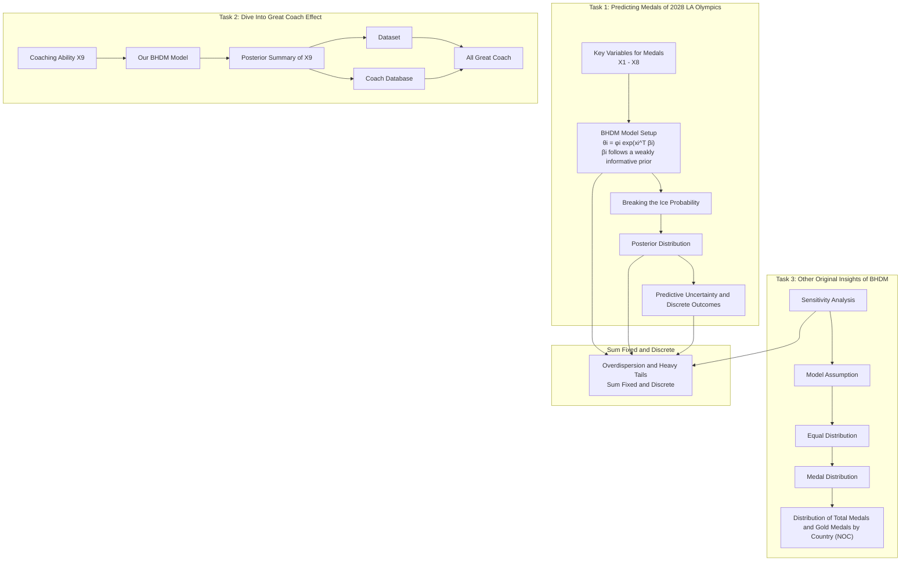

# A Glimpse of Olympics Medals through Bayesian Model

# Summary

The Olympic medal count fluctuates over time, driven by various influencing factors. Through a comprehensive analysis of historical data and predict projections for 2028, we have identified key trends and valuable insights.

First, we conducted an exploratory data analysis to understand the distribution characteristics of our target variable, providing a solid foundation for our modeling process.

For Task 1, our objective is to predict the medal counts for the 2028 Olympic Games. To improve accuracy and quantify uncertainty, we propose a Bayesian Hierarchical Dirichlet-Multinomial (BHDM) Model, which captures the discrete, sum-constrained nature of medal counts while addressing overdispersion and cross-country heterogeneity through hierarchical priors.

A key strength of this model is its robust uncertainty quantification. Each country's medal count follows a Dirichlet-Multinomial distribution with latent rates governed by country-specific regression coefficients and a Gamma-distributed concentration parameter. MCMC-based posterior inference provides $95\%$ credible intervals, assessing both medal forecasts and extreme outcomes like "ice-breaking" probabilities. By analyzing posterior distributions, the model offers interpretable insights into key predictors, ensuring informed decision-making under uncertainty.

This method exhibits strong performance, achieving $R^{2}$ of 0.85 for total medals and 0.80 for gold medals, surpassing all baseline models. Our 2028 projections show the U.S. winning 146 medals (95% CI: 136–156) and 53 golds (95% CI: 50–56), an increase from 2024, while China’s total medals decline to 82. We also computed ice-breaking probabilities, with Malaysia (68.6%) and South Sudan (39.0%) most likely to win their first medals. Regression analysis identified key sports for the U.S., China, the U.K., and France, offering strategic insights for host nations to optimize medal prospects.

For Task 2, we investigate the “Great Coach” effect. First, we define great coaches and construct a national-level great coach variable to quantify each country’s coaching strength. We then incorporate this variable into the BHDM model and analyze its impact through regression coefficients.

The results indicate that great coaches significantly influence both total and gold medal counts. Specifically, for the United States, China, and Japan, a one-unit increase in this variable leads to an expected medal count increase of 3.74%, 4.55%, and 2.87%, respectively. Additionally, we examine key sports in these three nations to assess the impact of this effect.

To test the robustness of our model, we conducted sensitivity analyses on both the weakly informative priors and the assumption of equal medal distribution. The results indicate that, despite adjustments in parameters and distributions, the model maintains reasonable predictive performance, with only minor deviations from the original baseline, demonstrating its robustness.

For Task 3, based on the comprehensive modeling process above, we derived three additional insights: Economic level determines medals, Home Turf and Aligned Systems Prevail, and Emerging Sports Aid Low-GDP Countries. We communicated these insights in a letter to the NOC, aiming to enhance their strategies and help nations secure more gold medals.

Keywords: Bayesian Hierarchical Dirichlet-Multinomial, Posterior inference, Uncertainty Quantification, Regression Analysis, Credible Intervals

# Contents

# 1 Introduction 3

1.1 Background 3  
1.2 Problem Restatement 3  
1.3 Our Work 4

# 2 Assumptions and Justifications 5

# 3 Notations 5

# 4 Data Pre-processing 5

4.1 Data Cleaning 6  
4.2 A glimpse of dataset 6

# 5 Task 1: Predicting Medals of 2028 LA Olympics 6

5.1 Key Variables Influencing Olympic Medal Success 6  
5.2 Bayesian Hierarchical Dirichlet-Multinomial (BHDM) Model 7  
5.3 Projects of LA 2028 10  
5.4 The country that will achieve a Breakthrough From Zero ..... 11  
5.5 Important Sports and Home Event Impact 12

# 6 Task 2: Dive Into Great Coach Effect 13

6.1 What is a Great Coach? 14  
6.2 Great Coach Affect the Medals 14  
6.3 Invest in Great Coach and Estimate its Impact ..... 15

# 7 Sensitivity Analysis 16

7.1 Sensitivity Analysis for $\tau^2$ Values 16  
7.2 Sensitivity Analysis of Equal Distribution Assumptions ..... 17

# 8 Strengths and Limitation of the Proposed Model 17

# 9 Task 3: Other Original Insights of Our BHDM Model 19

9.1 Economic level determines medals 19  
9.2 Home Turf and Aligned Systems Prevail 19  
9.3 Emerging Sports Aid Low-GDP Countries 20  
9.4 A letter to inform NOC 20

# Some insights about Olympics Medal Counts 21

# References 22

# 1 Introduction

# 1.1 Background

The Olympic Games, held every four years, bring together the world's top athletes to compete in a wide range of sports. Since the first modern Olympics in 1896, the event has grown significantly in scale, with more countries participating and more events being introduced. Medal counts serve as a key indicator of national sports performance, reflecting a country's investment in athletics, talent development, and international competitiveness.

Figure 1: The 2028 Summer Olympics will be held in Los Angeles, USA.  

text_image

LOS ANGELES

Predicting Olympic medal counts is an important challenge, as it provides insights into national sports strategies and performance trends. Various factors influence a country's medal prospects, including economic resources, population size, sports infrastructure, and historical performance. Additionally, host nations often experience a boost in medal counts due to home-field advantages and increased investment. A robust predictive model can help sports organizations allocate resources efficiently and set realistic goals for future Olympic Games.

Beyond national investment, coaching plays a critical role in athletic success. Some elite coaches have significantly impacted multiple countries' performances, demonstrating a “Great Coach” effect. By analyzing historical data, it is possible to quantify this effect and identify sports where hiring top-level coaches could maximize a nation’s medal potential. Understanding the role of coaching in Olympic success can provide strategic recommendations for countries aiming to improve their performance.

# 1.2 Problem Restatement

The distribution of Olympic medals is a key topic of interest for analysts, sports federations, and policymakers. Medal standings reflect national athletic strength, investment in sports development, and strategic resource allocation. This study focuses on developing a predictive model for Olympic medal counts and exploring the underlying factors that influence national performance.

Specifically, our objectives include:

- Developing a mathematical model to predict the number of Gold and total medals for each country in the 2028 Los Angeles Summer Olympics, incorporating factors such as historical performance, host nation advantages, and event distributions.  
• Estimating the likelihood of countries earning their first Olympic medal and analyzing the probability of new medal-winning nations emerging.  
- Examining the relationship between specific sports events and national success, identifying key disciplines that contribute significantly to a country’s medal tally.  
- Investigating the potential impact of elite coaches on national performance, quantifying the "Great Coach" effect, and recommending strategic investments in coaching for selected countries.

By addressing these questions, this study aims to provide valuable insights into Olympic medal trends, helping national Olympic committees optimize their training programs and resource allocation for future competitions.

# 1.3 Our Work

Our workflow is illustrated in Figure 2. Before modeling, we first conducted model assumptions (Section 2) and data exploration (Section 4.2) to facilitate the modeling process. After exploring the data distribution, we identified eight key variables (Section 5.1) and constructed a Bayesian Hierarchical Decision Model (BHDM) (Section 5.2) to better fit our observed distributions.

Figure 2: Our workflow.  

flowchart

During the modeling process, we also considered alternative models; however, they were either inconsistent with the data distribution or incapable of capturing the differences between countries, leading to their exclusion. Using our model, we then projected the medal distribution for the 2028 Los Angeles Olympics along with its 95% prediction interval. Additionally, we analyzed breakthrough probabilities, identified key sports for specific countries, and proposed adjustments to the sports program for the host nation.

To investigate the "Great Coach" effect, we first cross-referenced Wikipedia databases with our dataset to identify elite coaches. We then quantified each country's coaching strength and

incorporated it as a new variable into our BHDM model. By analyzing the posterior parameters of this variable for three selected countries, we assessed the impact of great coaches on their Olympic performance (Section 6).

Subsequently, we conducted a sensitivity analysis to determine the influence of model parameters and distributional variations on our results, thereby validating the robustness of our model (Section 7). Finally, based on our entire modeling process, we derived three original insights and drafted a letter to the COC to communicate these findings (Section 9).

# 2 Assumptions and Justifications

To simplify our modeling process, we make the following assumptions:

Assumption 1 (Medal Distribution Assumption): The distribution of medal counts to be modeled necessitates integer-valued predictions that sum to a fixed total, often exhibits overdispersion and heavy tails. This forms our core assumption and directly informs our choice of modeling approach. In Section 4.2, we will validate this assumption through visual analysis.

Assumption 2 (Equal Distribution Assumption): The composition and skill levels of athletes representing each country, as well as the events featured in the 2028 Olympics, will be largely consistent with those of the 2024 Paris Olympics. Given the absence of data for the 2028 Games, we assume that key factors such as event availability and athlete participation remain comparable to those in 2024. In Section 7.2, we will explore relaxations of this assumption.

Assumption 3 (Country Heterogeneity Assumption): Each country excels in different sports and exhibits varying adaptability to the same set of variables, leading to cross-country heterogeneity. In Section 5.2, we will explore this phenomenon in detail and incorporate it as a key assumption in our modeling approach.

# 3 Notations

Table 1: Notations used in the BHDM model and related analyses.

<table><tr><td>Symbol</td><td>Description</td><td>Symbol</td><td>Description</td></tr><tr><td>N</td><td>Number of countries</td><td> $M_i$ </td><td>Medal count of country i</td></tr><tr><td>T</td><td>Total medals across all countries</td><td> $T_{\text{new}}$ </td><td>Total medals in a future Olympics</td></tr><tr><td> $\mathbf{x}_i$ </td><td>Covariate (feature) vector for country i</td><td> $\boldsymbol{\beta}_i$ </td><td>Random coefficient vector for country i</td></tr><tr><td> $\boldsymbol{\mu}_{\beta}$ </td><td>Global mean of coefficient vectors</td><td> $\Sigma_{\beta}$ </td><td>Covariance matrix (weakly informative prior)</td></tr><tr><td> $\phi_i$ </td><td>Concentration parameter for country i</td><td> $\alpha_{\phi}, \beta_{\phi}$ </td><td>Hyperparameters for  $\phi_i$  (Gamma distribution)</td></tr><tr><td> $\theta_i$ </td><td>Latent rate for country i</td><td> $M_{i,\text{new}}$ </td><td>Predicted medal count of country i in future</td></tr><tr><td> $X_{1,i}$ </td><td>Historical medal record</td><td> $X_{2,i}$ </td><td>Athlete delegation size</td></tr><tr><td> $X_{3,i}$ </td><td>Host nation flag (binary)</td><td> $X_{4,i}$ </td><td>Social system congruence (binary)</td></tr><tr><td> $X_{5,i}$ </td><td>Athletics events</td><td> $X_{6,i}$ </td><td>Tactical &amp; strength events</td></tr><tr><td> $X_{7,i}$ </td><td>Ball sports events</td><td> $X_{8,i}$ </td><td>Emerging events</td></tr><tr><td> $X_{9,i}$ </td><td>Great Coach variable (aggregate coaching ability)</td><td>G, S, B</td><td>Gold, silver, and bronze medal counts</td></tr><tr><td></td><td></td><td>A</td><td>Coaching ability metric (6G + 3S + B)</td></tr></table>

# 4 Data Pre-processing

Before proceeding with modeling, we conducted data cleaning and an initial exploratory analysis to better understand the dataset's characteristics.

# 4.1 Data Cleaning

Upon inspection, we identified missing values in the summer0ly\_programs.csv file. These gaps resulted from certain events not being held in specific years, leading to the absence of corresponding records. To address this issue, we replaced the missing values with 0.

Additionally, inconsistencies were found in the representation of country codes (NOC) across the four datasets: summerOly\_programs.csv, summerOly\_hosts.csv, summerOly\_medal\_counts.csv, and summerOly\_athletes.csv. To standardize these variations, we converted all country codes into a unified three-letter format. However, for clarity and readability, country names are used instead of three-letter codes in all subsequent discussions within this paper.

Furthermore, we identified newly established countries as well as temporary representative teams, such as the Refugee Olympic Team. Since these entities lack historical records, all their past data were initialized with 0 to maintain consistency across the dataset. However, an exception was made for Russia, as its NOC was updated to ROC in 2020. In this case, historical data associated with Russia were retained to reflect its prior participation accurately.

# 4.2 A glimpse of dataset

Understanding the distribution patterns of gold medals and total medals is essential, as it directly impacts the selection of appropriate modeling strategies for further analysis. To illustrate this, Figure 3 presents the country-level distributions of gold and total medals of Olympics history. Notably, these distributions demonstrate clear signs of overdispersion and heavy tails, which stem from the inherently discrete nature of medal counts and the constraint of a fixed total sum.

Figure 3: Total Medal and Gold Medal Distribution of Olympics History.  
Distribution of Total Medals and Gold Medals by Country  

bar

| Country (NOC) | Total Medals | Gold Medals |
| :--- | :--- | :--- |
| United States | ~2600 | ~1000 |
| France | ~900 | ~300 |
| Italy | ~700 | ~250 |
| Hungary | ~600 | ~200 |
| East Germany | ~500 | ~150 |
| South Korea | ~400 | ~100 |
| Finland | ~300 | ~100 |
| Switzerland | ~250 | ~50 |
| Spain | ~200 | ~50 |
| Brazil | ~150 | ~50 |
| Ukraine | ~100 | ~50 |
| Kenya | ~100 | ~50 |
| Turkey | ~100 | ~50 |
| South Africa | ~100 | ~50 |
| Yugoslavia | ~100 | ~50 |
| Mexico | ~100 | ~50 |
| Czech Republic | ~100 | ~50 |
| North Korea | ~100 | ~50 |
| Croatia | ~100 | ~50 |
| Thailand | ~100 | ~50 |
| Indonesia | ~100 | ~50 |
| Colombia | ~100 | ~50 |
| Estonia | ~100 | ~50 |
| Portugal | ~100 | ~50 |
| Poland | ~100 | ~50 |
| Lithuania | ~100 | ~50 |
| Nigeria | ~100 | ~50 |
| France | ~100 | ~50 |
| Latvia | ~100 | ~50 |
| Trinidad and Tobago | ~100 | ~50 |
| Canada | ~100 | ~50 |
| Dominican Republic | ~100 | ~50 |
| Denmark | ~100 | ~50 |
| Kyrgyzstan | ~100 | ~50 |
| Puerto Rico | ~100 | ~50 |
| Moldova | ~100 | ~50 |
| Qatar | ~100 | ~50 |
| Russian Empire | ~100 | ~50 |
| Bahrain | ~100 | ~50 |
| Tajikistan | ~100 | ~50 |
| Argentina | ~100 | ~50 |
| Kosovo | ~100 | ~50 |
| Singapore | ~100 | ~50 |
| Grenada | ~100 | ~50 |
| Fiji | ~100 | ~50 |
| Jordan | ~100 | ~50 |
| Iceland | ~100 | ~50 |
| Bohemia | ~100 | ~50 |
| Zambia | ~100 | ~50 |
| Kuwait | ~100 | ~50 |
| Philippines | ~100 | ~50 |
| Cyprus | ~100 | ~50 |
| Niger | ~100 | ~50 |
| Egypt | ~100 | ~50 |
| Albania | ~100 | ~50 |
| Yugoslavia | ~100 | ~50 |
| Afghanistan | ~100 | ~50 |
| Saint Lucia | ~100 | ~50 |
| Virgin Islands | ~100 | ~50 |
| Portugal | ~100 | ~50 |
| Latvia | ~100 | ~50 |
| Guyana | ~100 | ~50 |
| Senegal | ~100 | ~50 |
| Eritrea | ~100 | ~50 |
| Paraguay | ~100 | ~50 |
| Iraq | ~100 | ~50 |
| Formosa | ~100 | ~50 |
| Taiwan | ~100 | ~50 |
| North Macedonia | ~100 | ~50 |
| Ceylon | ~100 | ~50 |

# 5 Task 1: Predicting Medals of 2028 LA Olympics

# 5.1 Key Variables Influencing Olympic Medal Success

Building upon insights presented by Schlembach et al. [7], it becomes evident that a nation's ability to secure Olympic medals stems from an interplay of diverse yet interlinked factors. In the following, we examine three pivotal dimensions—economic capacity, hosting advantages, and event-specific attributes—and introduce key explanatory variables associated with each domain.

# 1. Economic Capacity.

Historical Medal Record ( $X_1$ ): Reflects a country's medal haul in the immediately preceding Olympic cycle (for gold-medal-focused forecasts, this specifically denotes the previous count of gold medals). A strong performance history is frequently underpinned by consistent investment in athletic programs and robust training infrastructures.

Athlete Delegation Size ( $X_2$ ): Represents the total number of athletes sent to the current Games, serving as a proxy measure of institutional support and the breadth of a nation's talent pool. Larger delegations often correlate with stronger financial backing and more extensive development pathways in multiple sporting disciplines.

# 2. Hosting Advantages.

Host Nation Flag ( $X_{3} \in \{0, 1\}$ ): Indicates whether a nation is the host ( $X_{3} = 1$ ). Host countries frequently capitalize on superior familiarity with the local environment, elevated fan support, and logistical conveniences.

Social System Congruence ( $X_4 \in \{0, 1\}$ ): Identifies nations whose social or institutional structures are closely aligned with those of the host ( $X_4 = 1$ ). Such alignment can minimize cultural barriers and facilitate smoother acclimatization, indirectly bolstering athletic performance.

3. Event-Specific Attributes. Substantial heterogeneity exists across Olympic events, with certain countries historically excelling in specific domains. Cultural traditions, regional training practices, and even genetic predispositions can foster a competitive edge in certain sports $[6]$ . To capture this diversity, we classify events into four key segments:

Athletics Events ( $X_{5}$ ): Comprising all track and field competitions, a domain frequently marked by widespread global participation and prominent displays of speed, endurance, and agility.

Tactical & Strength Events ( $X_{6}$ ): Encompasses sports such as fencing, racquet sports, wrestling, and weightlifting, where strategic thinking, technical skills, and physical power play interdependent roles.

Ball Sports Events ( $X_{7}$ ): Encompassing team-focused competitions including football, basketball, and volleyball, these events rely heavily on synergy among participants and well-established support systems.

Emerging Events ( $X_{8}$ ): Newly introduced disciplines or contests debuting in the current Olympic cycle. Nations pioneering these events may enjoy early-adopter advantages but also face higher uncertainty due to the limited availability of historical data.

Overall, these variables not only serve as potential predictors in quantitative analyses but also offer a structured lens for examining how resources, environmental factors, and sport-specific nuances collectively shape a nation's Olympic performance.

# 5.2 Bayesian Hierarchical Dirichlet–Multinomial (BHDM) Model

Section 4.2 reveals that Olympic medal data typically demand integer-valued predictions that sum to a known total, often exhibit overdispersion and heavy tails, and require partial pooling to handle cross-country heterogeneity. Under this distributional constraint, deep learning and machine learning methods (e.g., RNN and two-stage RF) are clearly unsuitable, as they fail

to enforce the fixed-total and discrete conditions without special modifications. Statistical approaches such as Negative Binomial and Poisson are also inadequate due to their poor handling of long-tailed data. While a standard Bayesian Multinomial Model can effectively model such data, it does not satisfy our Country Heterogeneity Assumption, as it assumes a shared $\beta$ across all countries, which is incompatible with our framework. The Bayesian Hierarchical Dirichlet–Multinomial (BHDM) model addresses these challenges by combining a Dirichlet–Multinomial likelihood, which enforces both discreteness and sum constraints, with hierarchical priors on regression parameters, enabling each country to have its own coefficient vector.

Model Setup. Let N be the number of countries, and let $(M_{1},\ldots,M_{N})$ be the observed medal counts, with the total

$$
T = \sum_ {i = 1} ^ {N} M _ {i}. \tag {1}
$$

For each country i, we define a covariate vector $x_{i}$ and a random coefficient vector $\beta_{i}$ . In our setting, we adopt a weakly informative prior for $\beta_{i}$ , specifically assuming that

$$
\boldsymbol {\beta} _ {i} \sim \mathcal {N} \Big (\boldsymbol {\mu} _ {\beta}, \Sigma_ {\beta} \Big), \quad i = 1, \dots , N, \tag {2}
$$

with

$$
\Sigma_ {\beta} = \tau^ {2} I _ {p} \quad \text {and} \quad \tau^ {2} = 1.
$$

This choice reflects our prior belief that, while allowing for moderate variation in the regression coefficients across countries, the individual effects should not be overly dispersed. The weakly informative prior thus provides regularization without imposing overly restrictive assumptions, enabling the data to primarily inform the posterior inferences.

We additionally introduce a concentration parameter $\phi_{i}$ for country i:

$$
\phi_ {i} \sim \operatorname{Gamma} (\alpha_ {\phi}, \beta_ {\phi}). \tag {3}
$$

Each country i has an associated feature vector

$$
\mathbf {x} _ {i} = \left(X _ {1, i}, X _ {2, i}, X _ {3, i}, X _ {4, i}, X _ {5, i}, X _ {6, i}, X _ {7, i}, X _ {8, i}\right) ^ {\top}, \tag {4}
$$

Combining these, each country's latent rate is

$$
\theta_ {i} = \phi_ {i} \exp \Big (\mathbf {x} _ {i} ^ {\top} \boldsymbol {\beta} _ {i} \Big). \tag {5}
$$

Conditioned on $\{\theta_i\}$ , the vector $(M_1, \ldots, M_N)$ follows a Dirichlet-Multinomial distribution:

$$
(M _ {1}, \dots , M _ {N}) \sim \text {Dirichlet - Multinomial} (T; \theta_ {1}, \dots , \theta_ {N}), \tag {6}
$$

ensuring each $M_{i}$ is integer-valued and that $\sum_{i=1}^{N} M_{i} = T$ .

Posterior Distribution. Let $\mathbf{M} = (M_{1}, \ldots, M_{N})$ and recall $\theta_{i}$ as in (5). Combining the likelihood Eq. (6) with hierarchical priors leads to

$$
\begin{array}{l} p \big (\{\boldsymbol {\beta} _ {i} \}, \{\phi_ {i} \}, \boldsymbol {\mu} _ {\beta}, \Sigma_ {\beta} \mid \mathbf {M} \big) \\ \propto \text {Dirichlet - Multinomial} \left(\mathbf {M}; \theta_ {1}, \dots , \theta_ {N}\right) \times \prod_ {i = 1} ^ {N} \left[ \mathcal {N} \left(\boldsymbol {\beta} _ {i}; \boldsymbol {\mu} _ {\beta}, \Sigma_ {\beta}\right) \right] \times \tag {7} \\ \end{array}
$$

$$
\prod_ {i = 1} ^ {N} \left[ \operatorname{Gamma} \left(\phi_ {i}; \alpha_ {\phi}, \beta_ {\phi}\right) \right] \times p (\boldsymbol {\mu} _ {\beta}, \Sigma_ {\beta}) \dots
$$

where $p(\boldsymbol{\mu}_{\beta}, \Sigma_{\beta})$ is a suitable hyperprior (e.g. Normal-Inverse-Wishart). One can sample from this posterior distribution via Markov chain Monte Carlo or other approximate methods, capturing both cross-country partial pooling (through $\{\boldsymbol{\beta}_i\}$ ) and overdispersion (through $\{\phi_i\}$ ). Predictive Uncertainty and Discrete Outcomes. For a future Olympics with $T_{\mathrm{new}}$ total medals, each posterior sample $(\{\boldsymbol{\beta}_i^{(s)}\}, \{\phi_i^{(s)}\})$ implies

$$
\theta_ {i} ^ {(s)} = \phi_ {i} ^ {(s)} \exp \Big (\mathbf {x} _ {i} ^ {\top} \boldsymbol {\beta} _ {i} ^ {(s)} \Big), \tag {8}
$$

and yields a random draw from

$$
\left(M _ {1, \text {new}} ^ {(s)}, \dots , M _ {N, \text {new}} ^ {(s)}\right) \sim \text {Dirichlet - Multinomial} \left(T _ {\text {new}}; \theta_ {1} ^ {(s)}, \dots , \theta_ {N} ^ {(s)}\right). \tag {9}
$$

Because the Dirichlet–Multinomial distribution produces a vector of nonnegative integers summing to $T_{new}$ , it preserves discrete counts exactly. Across many posterior samples $s = 1, \ldots, S$ , this process captures parameter uncertainty (variation in $\{\beta_{i}, \phi_{i}\}$ ) and the inherent multinomial-like randomness of allocating $T_{new}$ medals among N countries. In practice, one may form 95% credible intervals from these sampled outcomes to measure the plausible range of medals for each country.

Breaking the Ice Probability. Suppose a country i historically has zero medals. To evaluate its likelihood of winning at least one medal in the upcoming Olympics, note that each simulated outcome $M_{i,\mathrm{new}}^{(s)}$ can be zero or positive. Introducing an indicator function, $\mathbf{1}\big[M_{i,\mathrm{new}}^{(s)}>0\big]$ , we approximate the probability of “ice-breaking” as

$$
\Pr (M _ {i, \mathrm{new}} > 0) = \frac {1}{S} \sum_ {s = 1} ^ {S} \mathbf {1} [ M _ {i, \mathrm{new}} ^ {(s)} > 0 ]. \tag {10}
$$

This metric naturally integrates both variability in country-specific parameters and the stochastic nature of discrete medal assignments.

Uncertainty Measures for Medal Allocations. From the draws $(M_{1,\mathrm{new}}^{(s)},\ldots,M_{N,\mathrm{new}}^{(s)})$ , we can compute summary statistics such as posterior means, medians, and credible intervals at any desired confidence level (commonly 95%). A 95% credible interval $[l_{i},u_{i}]$ for the medal count of country i is obtained by taking the 2.5th and 97.5th percentiles of $\{M_{i,\mathrm{new}}^{(s)}\}_{s=1}^{S}$ . Analogously, one can compute probabilities of surpassing a historical record or of achieving a threshold medal count. These credible intervals differ from classical “frequentist prediction intervals” but serve a similar interpretive purpose within the Bayesian framework, reflecting the distribution of plausible future outcomes under the inferred BHDM.

Interpreting Regression Coefficients. Because Bayesian estimation provides posterior draws for each $\beta_{i,j}$ , one can directly compute several summary measures from these samples. First, the posterior mean $\widehat{\beta_{i,j}}$ offers a central estimate of the effect size for covariate $j$ on country $i$ 's log-rate of medal acquisition. Next, the posterior standard deviation $\mathrm{StdDev}(\beta_{i,j})$ characterizes uncertainty around this mean. One may also calculate the posterior probability that $\beta_{i,j}$ exceeds zero, denoted $\mathrm{Pr}(\beta_{i,j} > 0)$ , which reveals how likely it is that increasing covariate $j$ has a positive effect on the country's medal prospects. Finally, a $95\%$ credible interval $[L_{i,j}, U_{i,j}]$ is often derived by taking the 2.5th and 97.5th percentiles of the posterior draws of $\beta_{i,j}$ . This interval indicates the range of coefficient values most consistent with the observed data, under the hierarchical model. A positive $\beta_{i,j}$ (as signaled by its posterior mean and credible interval lying mainly above zero) suggests that raising covariate $j$ increases the country's rate of medal accumulation, whereas a negative value implies the opposite. Because of the partial pooling in the hierarchical structure, extreme estimates for small or emerging countries are naturally shrunk toward a global mean, reducing the risk of overfitting and providing robust inferences about which predictors most influence medal outcomes.

# 5.3 Projects of LA 2028

By the Equal Distribution Assumption, we use the 2024 data as a proxy for 2028, modifying only the host country. The features are then incorporated into our model and compared against other approaches, with results presented in Table 2. As shown in Table 2, our proposed BHDM model outperforms both the machine/deep learning and traditional statistical approaches in predicting medal counts. For instance, in the All Medals category, BHDM achieves an MSE of 6.98 and an $R^{2}$ of 0.85, which are notably superior to the corresponding values from the competing models that exhibit higher errors and lower fit indices. Similarly, in the Gold Medals category, BHDM records an MSE of 3.42 and an $R^{2}$ of 0.80, outperforming alternative models by a substantial margin. These improvements are primarily attributable to the BHDM model's adaptive capability in capturing the underlying data distribution, thereby effectively modeling the intrinsic variability and complex relationships in the dataset, which in turn results in more accurate predictions.

Table 2: Comparison of Model Performance Metrics for Medal Prediction. Lower values for MSE, RMSE, and MAE indicate better performance, while higher values for $R^{2}$ and Adjusted $R^{2}$ indicate a better model fit. The best performance for each metric is highlighted in bold.

<table><tr><td rowspan="2">Medal Type</td><td rowspan="2">Metric</td><td colspan="3">Machine/Deep Learning Models</td><td colspan="3">Statistical Models</td></tr><tr><td>XGBoost[1]</td><td>RNN[3]</td><td>RF Two-stage[5]</td><td>Poisson</td><td>Neg. Binomial</td><td>BHDM (ours)</td></tr><tr><td rowspan="5">All Medals</td><td>MSE</td><td>7.21</td><td>7.05</td><td>7.37</td><td>10.45</td><td>10.33</td><td>6.98</td></tr><tr><td>RMSE</td><td>2.72</td><td>2.65</td><td>2.78</td><td>3.21</td><td>3.15</td><td>2.59</td></tr><tr><td>MAE</td><td>1.15</td><td>1.12</td><td>1.17</td><td>1.58</td><td>1.52</td><td>1.03</td></tr><tr><td> $R^2$ </td><td>0.84</td><td>0.83</td><td>0.77</td><td>0.71</td><td>0.74</td><td>0.85</td></tr><tr><td>Adjusted  $R^2$ </td><td>0.82</td><td>0.78</td><td>0.74</td><td>0.68</td><td>0.69</td><td>0.84</td></tr><tr><td rowspan="5">Gold Medals</td><td>MSE</td><td>3.71</td><td>3.63</td><td>3.82</td><td>5.25</td><td>5.12</td><td>3.42</td></tr><tr><td>RMSE</td><td>1.93</td><td>1.91</td><td>1.95</td><td>2.29</td><td>2.26</td><td>1.86</td></tr><tr><td>MAE</td><td>1.03</td><td>0.99</td><td>1.04</td><td>1.23</td><td>1.25</td><td>0.95</td></tr><tr><td> $R^2$ </td><td>0.76</td><td>0.79</td><td>0.71</td><td>0.66</td><td>0.71</td><td>0.80</td></tr><tr><td>Adjusted  $R^2$ </td><td>0.74</td><td>0.75</td><td>0.68</td><td>0.62</td><td>0.69</td><td>0.78</td></tr></table>

Based on our Bayesian hierarchical model, our projections for the Los Angeles 2028 Olympic medal table is shown in Figure 4. It suggests that the United States will significantly improve its performance with a predicted total of 146 medals (95% CI: [136, 156]) and 53 gold medals (95% CI: [50, 56]), reflecting increases of +20 total and +13 gold medals relative to 2024; in contrast, China is forecast to decline to 82 total medals (95% CI: [75, 90]) and 31 gold medals (95% CI: [28, 34]), while Great Britain is expected to drop by 5 total medals (down to 60) and lose 2 gold medals (resulting in 12 gold medals). Moreover, after adjusting for the home advantage effect in 2024, France is projected to regress by 10 total medals (to 54) and 4 gold medals (to 12). Meanwhile, both Australia and Japan exhibit modest improvements, and the Netherlands shows a strong upward trend with an increase of 11 total medals and 5 gold medals. Overall, our model indicates that the United States and the Netherlands are most likely to improve, whereas China, Great Britain, France, Italy, and South Korea are expected to perform worse than in 2024. The 95% credible intervals, derived from the posterior predictive draws, quantify the uncertainty in our predictions and provide a robust framework for interpreting the range of plausible future outcomes.

Figure 4: Predicted Medal Allocations for LA 2028. Gold bars represent gold medals and silver bars represent other medals; the solid black line shows the total medal prediction, the dashed dark orange line shows the gold medal prediction, and the shaded areas indicate the 95% credible intervals.  
Predicted Total and Gold Medals for Top 15 Countries at LA2028  

bar_stacked

| Country | Gold Medals | Other Medals | Total Medal Prediction | Gold Medal 95% CI (Lower) | Gold Medal 95% CI (Upper) |
| --- | --- | --- | --- | --- | --- |
| United States | ~53 | ~90 | ~146 | ~50 | ~155 |
| China | ~31 | ~49 | ~83 | ~35 | ~85 |
| Great Britain | ~12 | ~48 | ~60 | ~10 | ~62 |
| Australia | ~17 | ~43 | ~57 | ~17 | ~62 |
| France | ~11 | ~46 | ~55 | ~11 | ~60 |
| Japan | ~21 | ~37 | ~50 | ~21 | ~55 |
| Netherlands | ~19 | ~35 | ~45 | ~19 | ~50 |
| Germany | ~11 | ~31 | ~36 | ~11 | ~40 |
| Italy | ~9 | ~30 | ~35 | ~9 | ~38 |
| Canada | ~11 | ~27 | ~32 | ~11 | ~35 |
| South Korea | ~9 | ~25 | ~29 | ~9 | ~32 |
| New Zealand | ~7 | ~16 | ~19 | ~7 | ~20 |
| Hungary | ~6 | ~15 | ~18 | ~6 | ~19 |
| Spain | ~5 | ~14 | ~17 | ~5 | ~18 |
| Uzbekistan | ~8 | ~10 | ~14 | ~8 | ~15 |

Table 3: Probabilities of the country that will achieve a Breakthrough From Zero in 2028.

<table><tr><td>Category</td><td>Country</td><td>Probability</td><td>95% CI</td></tr><tr><td rowspan="3">Gold</td><td>Malaysia</td><td>0.6861</td><td>[0.4568, 0.8132]</td></tr><tr><td>Refugee Olympic Team</td><td>0.3788</td><td>[0.3214, 0.4128]</td></tr><tr><td>Haiti</td><td>0.2569</td><td>[0.2112, 0.0.2698]</td></tr><tr><td rowspan="3">Total</td><td>South Sudan</td><td>0.3904</td><td>[0.3315, 0.4208]</td></tr><tr><td>Guinea</td><td>0.3227</td><td>[0.2774, 0.3518]</td></tr><tr><td>Myanmar</td><td>0.1554</td><td>[0.1102, 0.1898]</td></tr></table>

# 5.4 The country that will achieve a Breakthrough From Zero

Table 3 presents the estimated probabilities—with associated 95% credible intervals—for each country to achieve a breakthrough from a zero-medal history in the 2028 Olympics. Same as above, the results are stratified into two medal groups: Gold and Total.

# Gold Medals

- Malaysia: The estimated probability for Malaysia to secure its first gold medal is 0.6861, with a relatively wide $95\%$ credible interval of [0.4568, 0.8132]. This interval indicates that while the central estimate is notably high, there is considerable uncertainty in the exact probability. Nonetheless, even the lower bound of approximately 0.46 suggests a strong underlying signal for Malaysia's breakthrough potential in the gold medal group.  
- Refugee Olympic Team: With an estimated breakthrough probability of 0.3788 and a narrower credible interval of [0.3214, 0.4128], the Refugee Olympic Team exhibits a moderate level of potential. The narrow interval reflects greater precision in this estimate, implying that the model is more confident about this moderate probability relative to that

of Malaysia.

\- Haiti: Haiti's estimated probability stands at 0.2569 with a $95\%$ credible interval of [0.2112, 0.2698]. The relatively low point estimate, coupled with a narrow interval, reinforces the conclusion that Haiti is less likely to achieve a breakthrough in the gold medal group. The tight range indicates high confidence in this low probability estimate.

The stark contrast in point estimates—particularly the high probability for Malaysia compared to the lower probabilities for the Refugee Olympic Team and Haiti—highlights a notable disparity in the competitive dynamics for gold medals.

# Total Medals

- South Sudan: In the Total Medal group, South Sudan exhibits the highest breakthrough probability at 0.3904, with a credible interval of [0.3315, 0.4208]. Although this estimate is lower than Malaysia's gold medal probability, it indicates that South Sudan has a competitive edge when considering all medal types combined.  
- Guinea: Guinea's estimated probability is 0.3227 with a $95\%$ credible interval of [0.2774, 0.3518]. The interval for Guinea overlaps somewhat with that of South Sudan, suggesting that while South Sudan has a slight advantage, the difference between these two countries might not be statistically significant under a Bayesian framework.  
- Myanmar: Myanmar has the lowest estimated probability in the Total group at 0.1554, with a credible interval of [0.1102, 0.1898]. This clearly distinguishes Myanmar from the other candidates in terms of breakthrough potential for accumulating any medals.

The Total Medal group exhibits a more evenly distributed set of probabilities compared to the Gold Medal group. While the overall probabilities are lower, the differences among the countries (particularly between South Sudan and Guinea) appear less pronounced. This may reflect the broader range of events and competitive factors that come into play when considering the entire medal tally, as opposed to the singular focus required for a gold medal achievement.

# 5.5 Important Sports and Home Event Impact

Events and Medal Acquisition Analysis: The regression coefficients in Table 4 reveal that event-specific attributes are critical determinants of Olympic medal success, with notable differences across countries. For example, in the United States, the coefficient for Ball Sports Events ( $X_{7}$ ) is 0.03123 with a high posterior probability of 0.98, indicating that team sports such as basketball and football substantially drive medal acquisition. Similarly, Athletics Events ( $X_{5}$ ) show a positive effect (beta = 0.02345, $\Pr(\beta > 0) = 0.97$ ), suggesting that traditional track and field competitions are also important. In contrast, China displays a relatively modest effect for Athletics Events ( $X_{5}$ , beta = 0.01567, $\Pr(\beta > 0) = 0.92$ ) but a more pronounced impact for Emerging Events ( $X_{8}$ , beta = 0.01765, $\Pr(\beta > 0) = 0.93$ ), which implies that their strategic diversification into new sports disciplines plays a significant role in enhancing their medal prospects. Moreover, both the United Kingdom (beta for $X_{5} = 0.02678$ , $\Pr(\beta > 0) = 0.98$ ) and France (beta for $X_{5} = 0.02631$ , $\Pr(\beta > 0) = 0.97$ ) exhibit strong positive associations with Athletics Events, reinforcing the view that specific sports domains are aligned with each country's historical strengths and strategic investments.

Impact of Home Country Event Selection: The regression results in Table 4 also underscore the importance of tailoring event selection to leverage home advantage. When a country hosts the Olympics, it can capitalize on localized benefits such as familiar venues, superior logistical support, and heightened fan enthusiasm. For instance, the United States demonstrates strong positive effects in Athletics Events ( $X_{5}$ , beta = 0.02345, 95% CI: [-0.00007, 0.04697]) and even more so in Ball Sports Events ( $X_{7}$ , beta = 0.03123, 95% CI: [0.00771, 0.05475]), suggesting that emphasizing these sports can maximize the inherent benefits of home advantage. Similarly, in the United Kingdom and France, Athletics Events yield robust positive coefficients (UK: beta

Table 4: Posterior summary statistics for regression coefficients for various predictors across 4 countries.

<table><tr><td rowspan="2">Variable</td><td colspan="4">United States</td><td colspan="4">China</td></tr><tr><td>Beta</td><td>Std. Err.</td><td>Pr( $\beta >0$ )</td><td>95% CI</td><td>Beta</td><td>Std. Err.</td><td>Pr( $\beta >0$ )</td><td>95% CI</td></tr><tr><td> $X_1$ </td><td>0.03412</td><td>0.01234</td><td>0.99</td><td>[0.01996, 0.04828]</td><td>0.03245</td><td>0.01156</td><td>0.99</td><td>[0.01980, 0.05510]</td></tr><tr><td> $X_2$ </td><td>0.01745</td><td>0.00852</td><td>0.99</td><td>[0.00079, 0.03411]</td><td>0.01621</td><td>0.00825</td><td>0.98</td><td>[0.00014, 0.03228]</td></tr><tr><td> $X_3$ </td><td>0.06567</td><td>0.01245</td><td>0.99</td><td>[0.04873, 0.07007]</td><td>0.06456</td><td>0.01231</td><td>0.99</td><td>[0.04045, 0.07867]</td></tr><tr><td> $X_4$ </td><td>0.01234</td><td>0.00759</td><td>0.93</td><td>[-0.00236, 0.02704]</td><td>0.02891</td><td>0.01055</td><td>0.98</td><td>[0.00833, 0.04949]</td></tr><tr><td> $X_5$ </td><td>0.02345</td><td>0.01244</td><td>0.97</td><td>[-0.00007, 0.04697]</td><td>0.01567</td><td>0.01143</td><td>0.92</td><td>[-0.00589, 0.03723]</td></tr><tr><td> $X_6$ </td><td>-0.00234</td><td>0.01038</td><td>0.32</td><td>[-0.02194, 0.01726]</td><td>0.01239</td><td>0.00951</td><td>0.95</td><td>[-0.00628, 0.03096]</td></tr><tr><td> $X_7$ </td><td>0.03123</td><td>0.00713</td><td>0.98</td><td>[0.00771, 0.05475]</td><td>0.01098</td><td>0.01162</td><td>0.85</td><td>[-0.01058, 0.03254]</td></tr><tr><td> $X_8$ </td><td>0.01287</td><td>0.01214</td><td>0.88</td><td>[-0.01065, 0.03639]</td><td>0.01765</td><td>0.00854</td><td>0.93</td><td>[0.00099, 0.03431]</td></tr><tr><td rowspan="2">Variable</td><td colspan="4">United Kingdom</td><td colspan="4">France</td></tr><tr><td>Beta</td><td>Std. Err.</td><td>Pr( $\beta >0$ )</td><td>95% CI</td><td>Beta</td><td>Std. Err.</td><td>Pr( $\beta >0$ )</td><td>95% CI</td></tr><tr><td> $X_1$ </td><td>0.03789</td><td>0.01345</td><td>0.99</td><td>[0.01153, 0.05425]</td><td>0.03983</td><td>0.01273</td><td>0.99</td><td>[0.01347, 0.05419]</td></tr><tr><td> $X_2$ </td><td>0.01567</td><td>0.00759</td><td>0.96</td><td>[0.00097, 0.03037]</td><td>0.01532</td><td>0.00795</td><td>0.94</td><td>[0.00082, 0.03012]</td></tr><tr><td> $X_3$ </td><td>0.05345</td><td>0.01120</td><td>0.99</td><td>[0.03811, 0.07501]</td><td>0.05576</td><td>0.01134</td><td>0.99</td><td>[0.03764, 0.06816]</td></tr><tr><td> $X_4$ </td><td>0.00876</td><td>0.00958</td><td>0.88</td><td>[-0.00986, 0.02738]</td><td>0.00912</td><td>0.00933</td><td>0.86</td><td>[-0.01022, 0.02846]</td></tr><tr><td> $X_5$ </td><td>0.02678</td><td>0.01250</td><td>0.98</td><td>[0.00228, 0.05128]</td><td>0.02631</td><td>0.01232</td><td>0.97</td><td>[0.00312, 0.05076]</td></tr><tr><td> $X_6$ </td><td>-0.00123</td><td>0.01053</td><td>0.44</td><td>[-0.02181, 0.01935]</td><td>-0.00096</td><td>0.01025</td><td>0.48</td><td>[-0.02147, 0.01955]</td></tr><tr><td> $X_7$ </td><td>0.01567</td><td>0.01257</td><td>0.90</td><td>[-0.00883, 0.04017]</td><td>0.01687</td><td>0.01243</td><td>0.91</td><td>[-0.00984, 0.04158]</td></tr><tr><td> $X_8$ </td><td>0.02345</td><td>0.01257</td><td>0.97</td><td>[-0.00105, 0.04795]</td><td>0.02257</td><td>0.01233</td><td>0.95</td><td>[-0.00123, 0.04603]</td></tr></table>

= 0.02678, 95% CI: [0.00228, 0.05128]; France: beta = 0.02631, 95% CI: [0.00312, 0.05076]), indicating that host nations with strong track records in these disciplines can further enhance their medal prospects by strategically prioritizing events that align with their historical strengths and local support systems. Moreover, China's relatively higher coefficient for Emerging Events (X $_{8}$ , beta = 0.01765, 95% CI: [0.00099, 0.03431]) implies that even non-traditional or newer events can be exploited effectively when a host country's infrastructure and preparatory advantages are aligned with the chosen sports. Overall, these findings suggest that by selecting events that not only reflect historical success but also amplify home advantages, host nations can significantly improve their medal tallies. $^{1}$

# 6 Task 2: Dive Into Great Coach Effect

In this section, we examine another factor that can influence medal counts—the coach. Unlike athletes, who are typically constrained by nationality, coaches possess a unique flexibility to work across borders. This mobility allows them to transfer their expertise and successful training methodologies from one country’s sports system to another. Such fluidity creates what we term the “great coach effect,” where the influence of a single coach can significantly enhance a country’s medal count in specific sports [2].

For example, the legendary careers of Lang Ping and Béla Károlyi exemplify this effect. Despite coaching in vastly different cultural and sporting environments, both successfully transformed national teams and led them to Olympic podium finishes. Lang Ping's experience coaching volleyball teams in both the United States and China demonstrates the potential for

exceptional coaches to transcend national boundaries [4]. Similarly, Béla Károlyi's transition from coaching in Romania to achieving remarkable success with the U.S. women's gymnastics team further supports this notion [8].

Following standard analytical procedures, we first define what constitutes a "great coach" and seek to quantify their coaching impact. Next, we incorporate this variable into our BHDM model and analyze regression coefficients to assess whether and to what extent great coaches significantly influence medal counts. Finally, we will identify three countries, select great coaches for them, and estimate their impact based on the regression coefficients.

# 6.1 What is a Great Coach?

In our analysis, we define a "great coach" as one who has demonstrated the ability to elevate an Olympic team to achieve at least bronze medal finishes in two or more different countries. By searching the Wiki database, we identified a total of 1,103 such great coaches, among whom 697 are currently active. These coaches are engaged in multiple sports across various countries, including the United States, China, and Japan.

If we use the total number of renowned coaches as a new variable, a natural hypothesis emerges: do all renowned coaches contribute equally to a country's medal count? We believe this assumption is overly restrictive. Our selection criteria represent only the minimum threshold for inclusion, but there is likely heterogeneity among coaches, meaning that their ability to lead teams to success varies.

For example, while Lang Ping, as a renowned coach, helped China secure one gold medal and the United States one silver medal, Béla Károlyi, another renowned coach, led his teams to at least 9 gold medals. This discrepancy highlights the differences in coaching effectiveness. Therefore, to ensure a fair reflection of each coach's impact, a more fine-grained characterization of individual coaching abilities is necessary.

Based on the latest research on coaching effectiveness, we define the following metric to quantify the coaching ability of a "renowned coach": the coaching ability A is calculated as the number of gold medals won during their tenure multiplied by 6, plus the number of silver medals multiplied by 3, and the number of bronze medals multiplied by 1. Mathematically, this is expressed as:

$$
A = 6 G + 3 S + 1 B \tag {11}
$$

where $G$ represents the number of gold medals won under the coach's leadership, $S$ represents the number of silver medals won, and $B$ represents the number of bronze medals won. This metric assigns the highest weight to gold medals, followed by silver and then bronze, ensuring a more precise assessment of a coach's contribution to medal achievements.

For a country's coaching ability variable $X_{9}$ , it is defined as the sum of the coaching abilities $A$ of all renowned coaches within that country, mathematically expressed as:

$$
X _ {9} = \sum_ {i = 1} ^ {N} A _ {i} \tag {12}
$$

where $A_{i}$ denotes the coaching ability of the i-th coach.

# 6.2 Great Coach Affect the Medals

We incorporate $X_{9}$ into our BHDM model and obtain its regression coefficient. Since there are 46 countries with renowned coaches, we are unable to present the specific values for each due to space constraints. Table 5 displays some summary statistics of this indicator.

Table 5: Posterior summary statistics for the Great Coach variable $X_{9}$ of 46 countries.

<table><tr><td>Outcome</td><td>Beta Mean</td><td>Std. Err. Mean</td><td>Avg. Pr(β &gt; 0)</td><td>Pr(β &gt; 0) &gt; 0.95</td></tr><tr><td>All Medals</td><td>0.036134</td><td>0.011008</td><td>0.997</td><td>46</td></tr><tr><td>Gold Medals</td><td>0.028167</td><td>0.009134</td><td>0.983</td><td>45</td></tr></table>

As shown in Table 5, the posterior mean coefficients for the Great Coach variable $X_{9}$ are approximately 0.036134 for all medals and 0.028167 for gold medals, respectively. Because these coefficients reflect log-rate effects, a one-unit increase in $X_{9}$ corresponds to a multiplicative change of $e^{0.036134} \approx 1.037$ (roughly a 3.7% rise) in the expected total medal count and $e^{0.028167} \approx 1.029$ (about a 2.9% increase) in gold medals. Consequently, even modest gains in “great coach” capacity—such as recruiting or developing a coach with one additional point of aggregate coaching ability—can yield a tangible percentage uplift in a nation’s overall and top-tier (i.e., gold) Olympic performance.

Moreover, the high values of Avg. $\Pr(\beta > 0)$ (0.997 for all medals and 0.983 for gold medals) and the fact that $\Pr(\beta > 0)$ exceeds 0.95 for nearly every country underscore that the impact of the Great Coach variable is both statistically robust and broadly consistent across the sample of 46 nations. In other words, not only does the posterior mean of $\beta_{X_{9}}$ suggest a positive relationship, but the overwhelming majority of countries in the dataset exhibit a high probability that increasing aggregate coaching ability leads to more medals. This finding provides strong evidence for the “great coach” effect, indicating that improvements in coaching capacity are systematically tied to enhanced Olympic performance rather than being confined to a select subset of countries.

# 6.3 Invest in Great Coach and Estimate its Impact

We believe that only wealthy countries have more options when it comes to investing in renowned coaches. Therefore, we selected the United States, China, and Japan—three of the world's top-ranking countries by GDP—and carefully curated projects for each of them. The regression results are shown in Table 6.

Table 6: Parameter estimates for the Great Coach variable ${X}_{9}$ of total medals in three countries.

<table><tr><td>Country</td><td>Beta</td><td>Std. Err.</td><td>Pr(β &gt; 0)</td><td>95% Cred. Int.</td></tr><tr><td>United States</td><td>0.0367</td><td>0.0091</td><td>0.98</td><td>[0.0082, 0.0450]</td></tr><tr><td>China</td><td>0.0445</td><td>0.0102</td><td>0.99</td><td>[0.0150, 0.0558]</td></tr><tr><td>Japan</td><td>0.0283</td><td>0.0078</td><td>0.96</td><td>[0.0031, 0.0382]</td></tr></table>

We recommend that the United States recruit at least one “great coach” for fencing and sport climbing. With a coefficient of 0.0367, a one-unit increase in coaching capacity corresponds to an estimated impact of $e^{0.0367} - 1 \approx 3.74\%$ increase in Olympic medal counts in these disciplines.

For China, the coefficient of 0.0445 implies that each additional point of $X_{9}$ results in roughly $e^{0.0445} - 1 \approx 4.55\%$ enhancement in overall medal achievements, making it advisable to invest in top coaching talent for sports such as basketball and beach volleyball.

Finally, Japan exhibits a coefficient of 0.0283, translating to an expected improvement of $e^{0.0283} - 1 \approx 2.87\%$ ; thus, Japan should consider investing in a “great coach” for gymnastics

and short-track speed skating to boost its medal tally. These quantitative estimates demonstrate that targeted investments in coaching excellence can yield substantial and measurable gains in Olympic performance.

# 7 Sensitivity Analysis

# 7.1 Sensitivity Analysis for $\tau^{2}$ Values

In Section 5.2, we adopted a weakly informative prior by setting the covariance matrix for the regression coefficients as

$$
\Sigma_ {\beta} = \tau^ {2} I _ {p}, \quad \tau^ {2} = 1,
$$

as our initial choice. In this section, we examine how varying $\tau^{2}$ over a range from 0.1 to 10 affects the predicted medal counts for the 2028 Olympics. This analysis aims to determine whether changes in $\tau^{2}$ lead to substantial differences in the 2028 medal predictions. The results, as illustrated in Figure 5, provide insights into the robustness of our predictions with respect to the prior informativeness imposed by the choice of $\tau^{2}$ .

Figure 5: Predicted Medal Allocations for LA 2028 in different $\tau^{2}$ . We predicted the number of medals and gold medals in 2028 under different $\tau^{2}$ values and provided the 95% prediction intervals.  

line

| Country | Total, \(\tau^{2}\) = 1 (Baseline) | Gold, \(\tau^{2}\) = 1 (Baseline) | Total, \(\tau^{2}\) = 0.1 | Gold, \(\tau^{2}\) = 0.1 | Total, \(\tau^{2}\) = 0.5 | Gold, \(\tau^{2}\) = 0.5 | Total, \(\tau^{2}\) = 2 | Gold, \(\tau^{2}\) = 2 | Total, \(\tau^{2}\) = 5 | Gold, \(\tau^{2}\) = 5 | Total, \(\tau^{2}\) = 10 | Gold, \(\tau^{2}\) = 10 |
| --- | --- | --- | --- | --- | --- | --- | --- | --- | --- | --- | --- | --- |
| United States | ~146 | ~145 | ~141 | ~140 | ~138 | ~137 | ~149 | ~148 | ~147 | ~146 | ~138 | ~137 |
| China | ~84 | ~83 | ~78 | ~77 | ~76 | ~75 | ~84 | ~83 | ~82 | ~81 | ~78 | ~77 |
| Great Britain | ~61 | ~60 | ~57 | ~56 | ~55 | ~54 | ~61 | ~60 | ~59 | ~58 | ~56 | ~55 |
| Australia | ~57 | ~56 | ~54 | ~53 | ~52 | ~51 | ~57 | ~56 | ~55 | ~54 | ~52 | ~51 |
| France | ~54 | ~53 | ~51 | ~50 | ~49 | ~48 | ~54 | ~53 | ~52 | ~51 | ~49 | ~48 |
| Japan | ~50 | ~49 | ~47 | ~46 | ~45 | ~44 | ~50 | ~49 | ~48 | ~47 | ~45 | ~44 |
| Netherlands | ~46 | ~45 | ~43 | ~42 | ~41 | ~40 | ~46 | ~45 | ~44 | ~43 | ~41 | ~40 |
| Germany | ~37 | ~36 | ~35 | ~34 | ~33 | ~32 | ~37 | ~36 | ~35 | ~34 | ~32 | ~31 |
| Italy | ~35 | ~34 | ~33 | ~32 | ~31 | ~30 | ~35 | ~34 | ~33 | ~32 | ~30 | ~29 |
| Canada | ~33 | ~32 | ~31 | ~30 | ~29 | ~28 | ~33 | ~32 | ~31 | ~30 | ~28 | ~27 |
| South Korea | ~28 | ~27 | ~26 | ~25 | ~24 | ~23 | ~28 | ~27 | ~26 | ~25 | ~23 | ~22 |
| New Zealand | ~19 | ~18 | ~17 | ~16 | ~15 | ~14 | ~19 | ~18 | ~17 | ~16 | ~14 | ~13 |
| Hungary | ~18 | ~17 | ~16 | ~15 | ~14 | ~13 | ~18 | ~17 | ~16 | ~15 | ~13 | ~12 |
| Spain | ~17 | ~16 | ~15 | ~14 | ~13 | ~12 | ~17 | ~16 | ~15 | ~14 | ~12 | ~11 |
| Uzbekistan | ~15 | ~14 | ~13 | ~12 | ~11 | ~10 | ~15 | ~14 | ~13 | ~12 | ~10 | ~9 |

It is evident that the predicted medal counts for the 2028 Olympics remain remarkably consistent across the range of $\tau^{2}$ values considered, from 0.1 to 10. Despite the deliberate variation in the weakly informative prior's variance parameter, both the total and gold medal predictions show only minor deviations from the baseline forecast obtained with $\tau^{2}=1$ . This close alignment indicates that the posterior inferences are not overly sensitive to the choice of $\tau^{2}$ , thereby reinforcing the stability of our Bayesian framework even under different prior settings.

Moreover, the corresponding $95\%$ confidence intervals across the various $\tau^2$ scenarios largely overlap with those of the baseline, highlighting that the uncertainty associated with the predictions remains virtually unchanged. The observed fluctuations, confined within a narrow

margin of $\pm5\%$ , are negligible in the context of the overall predictive performance. This consistency not only demonstrates that the weakly informative prior does not exert an undue influence on the results, but also confirms that the data are sufficiently informative to drive the posterior estimates independently of the prior variance specification.

Overall, the sensitivity analysis clearly illustrates the robustness of our model. Regardless of the variations in $\tau^2$ , all predicted outcomes are closely aligned with the baseline results, substantiating that the model's performance is stable under different prior informativeness levels. Such robustness is crucial for ensuring that the model's predictions can be trusted for further inferential or policy-related decisions, as the underlying inference remains reliable despite moderate changes in prior assumptions.

# 7.2 Sensitivity Analysis of Equal Distribution Assumptions

In our initial modeling framework, we assumed that the distribution of events and the total number of medals in 2028 would exactly match those of 2024. Recognizing that such an assumption is unlikely to hold in practice, we perform a sensitivity analysis by allowing both the event-specific medal counts and the total medal count to vary by $\pm5\%$ . Specifically, we adjust these counts using five discrete steps: a decrease of 5%, a decrease of 3%, an unchanged baseline (0%), an increase of 3%, and an increase of 5%. For each scenario, all medal counts are modified accordingly and then rounded upward to ensure integer-valued predictions.

This approach permits us to systematically evaluate how small, yet realistic, changes in the underlying medal distribution assumptions impact our model's forecasts for the 2028 Olympics. By applying these percentage-based adjustments uniformly across all events and the overall medal total, we capture potential fluctuations that may arise from changes in the event program, variations in competitive intensity, or adjustments in the total number of medals awarded. The modified data sets are then fed into our BHDM model to generate alternative predictions.

The results of this sensitivity analysis are crucial for assessing the robustness of our model. If the predicted medal counts remain largely consistent across these scenarios—showing only minimal differences from the baseline—it would provide strong evidence that our model is not overly sensitive to moderate shifts in the medal distribution assumptions. Such robustness is essential for ensuring that our predictions are reliable even when the real-world conditions at the 2028 Olympics deviate slightly from the 2024 baseline.

The results illustrated in Figure 6 demonstrate that, even when the underlying medal distribution assumptions are varied by $\pm 5\%$ with adjustments applied individually to each country's predicted counts—the forecasts for both total and gold medals remain highly consistent with the baseline predictions. Minor fluctuations are observed; however, these differences are confined within a narrow range, indicating that the model's predictions are not significantly perturbed by realistic changes in the event program or overall medal totals.

Such robustness confirms that our BHDM model reliably captures the core dynamics underlying medal allocations, even under moderate deviations from the 2024 baseline. This stability in predictions provides strong evidence that our modeling framework can be trusted for forecasting future outcomes, as it effectively mitigates the potential impact of uncertainties in the underlying medal distribution assumptions.

# 8 Strengths and Limitation of the Proposed Model

# Strengths.

\- High Predictive Accuracy: The BHDM model consistently outperforms alternative machine learning (XGBoost, RNN, and RF Two-stage) and statistical methods (Poisson, Negative Binomial) in forecasting both total and gold medal counts. For example, it

Figure 6: Predicted Medal Allocations for LA 2028 in different Medal Distributions. We predicted the number of medals and gold medals in 2028 under different medal distributions and provided the 95% prediction intervals.  
Predicted 2028 Medal Counts under Different Medal Distribution Assumptions  

line

| Country | Total, 0% (Baseline) | Gold, 0% (Baseline) | Total, -5% | Gold, -5% | Total, -3% | Gold, -3% | Total, +3% | Gold, +3% | Total, +5% | Gold, +5% |
| --- | --- | --- | --- | --- | --- | --- | --- | --- | --- | --- |
| United States | ~146 | ~54 | ~151 | ~148 | ~151 | ~148 | ~142 | ~142 | ~139 | ~139 |
| China | ~82 | ~31 | ~80 | ~78 | ~80 | ~80 | ~80 | ~80 | ~87 | ~87 |
| Great Britain | ~61 | ~12 | ~63 | ~62 | ~62 | ~62 | ~58 | ~58 | ~58 | ~58 |
| Australia | ~57 | ~19 | ~58 | ~57 | ~57 | ~57 | ~57 | ~57 | ~57 | ~57 |
| France | ~55 | ~12 | ~57 | ~56 | ~56 | ~56 | ~56 | ~56 | ~56 | ~56 |
| Japan | ~51 | ~22 | ~55 | ~54 | ~54 | ~54 | ~54 | ~54 | ~54 | ~54 |
| Netherlands | ~46 | ~20 | ~48 | ~47 | ~47 | ~47 | ~47 | ~47 | ~47 | ~47 |
| Germany | ~36 | ~13 | ~38 | ~37 | ~37 | ~37 | ~37 | ~37 | ~37 | ~37 |
| Italy | ~35 | ~11 | ~36 | ~35 | ~35 | ~35 | ~35 | ~35 | ~35 | ~35 |
| Canada | ~33 | ~12 | ~34 | ~33 | ~33 | ~33 | ~33 | ~33 | ~33 | ~33 |
| South Korea | ~28 | ~9 | ~30 | ~29 | ~29 | ~29 | ~29 | ~29 | ~29 | ~29 |
| New Zealand | ~18 | ~7 | ~19 | ~18 | ~18 | ~18 | ~18 | ~18 | ~18 | ~18 |
| Hungary | ~17 | ~6 | ~18 | ~17 | ~17 | ~17 | ~17 | ~17 | ~17 | ~17 |
| Spain | ~16 | ~5 | ~17 | ~16 | ~16 | ~16 | ~16 | ~16 | ~16 | ~16 |
| Uzbekistan | ~14 | ~8 | ~15 | ~14 | ~14 | ~14 | ~14 | ~14 | ~14 | ~14 |

achieves an MSE of 6.98 and an $R^{2}$ of 0.85 for predicting the total number of medals, and an MSE of 3.42 with an $R^{2}$ of 0.80 for gold medals (see Table 2). These improvements underscore its capacity to capture the underlying data structure more effectively than competing approaches.

- Discrete and Constrained Outcomes: By modeling medal allocations via a Dirichlet-Multinomial likelihood, the BHDM ensures integer-valued outcomes that sum to a known total $T$ . This feature is crucial in predicting realistic medal counts, especially when evaluating discrete events like whether a country will “break the ice” and win its first medal. The model’s ability to provide exact integer predictions (e.g., forecasting 146 total medals for the United States and 82 for China) is a key advantage over approaches that produce continuous-valued outputs.  
- Robustness to Prior and Distributional Changes: Sensitivity analyses demonstrate that the BHDM model's predictive performance remains stable across different settings of $\tau^2$ (ranging from 0.1 to 10) and under $\pm 5\%$ variations to the total medal pool. As shown in Figures 5 and 6, the predicted 2028 medal counts and their credible intervals remain largely unaffected by these adjustments, indicating that the inference is driven more by the data than by the particular choice of prior or medal distribution assumptions.

# Limitation.

\- Complexity and Data Requirements: The hierarchical structure, while powerful for partial pooling and capturing cross-country heterogeneity, entails increased computational demands compared to simpler count models. Fitting the BHDM can become computationally expensive for very large datasets or when a fine-grained, event-level breakdown is required for many countries. Furthermore, to reliably estimate country-specific random effects and hyperparameters (e.g., the $\phi_{i}$ concentration parameters), the model benefits

from detailed, high-quality data—something that may be difficult to obtain for smaller or underrepresented countries with limited historical records.

# 9 Task 3: Other Original Insights of Our BHDM Model

# 9.1 Economic level determines medals

In our final analysis of all 206 countries in the dataset, two predictors stand out as having the largest impact on a nation's Olympic medal count: historical performance ( $X_1$ ) and athlete delegation size ( $X_2$ ). Both variables are closely tied to a country's economic level, as wealthier nations tend to have better-funded sports programs and a stronger history of Olympic participation. Specifically, as reported in Table 7, the mean regression coefficient for past medal counts ( $\beta_{X_1}$ ) is 0.035143, while that for total athlete numbers ( $\beta_{X_2}$ ) is 0.011442. These results reinforce the notion that economic strength plays a decisive role in determining a country's Olympic success.

To interpret the magnitude of these effects:

$$
e^{0.035143} - 1 \approx 3.58\%, \quad \text{and} \quad e^{0.011442} - 1 \approx 1.15\%.
$$

Hence, a unit increase in $\beta_{X_1}$ corresponds to roughly a $3.6\%$ increase in the expected medal count, while a similar increase in $\beta_{X_2}$ implies about a $1.2\%$ rise. These results underscore that both a strong legacy of medal achievements and a robust delegation size can significantly boost a country's chances of reaching the podium.

Table 7: Posterior Summary of $\beta_{X_{1}}$ and $\beta_{X_{2}}$ Across All Countries (206 in total).

<table><tr><td>Outcome</td><td>Beta Mean</td><td>Std. Err. Mean</td><td>Avg.  $\Pr(\beta > 0)$ </td><td> $\Pr(\beta > 0) > 0.95$ </td></tr><tr><td> $\beta_{X_1}$ </td><td>0.035143</td><td>0.008224</td><td>0.981</td><td>204</td></tr><tr><td> $\beta_{X_2}$ </td><td>0.011442</td><td>0.006538</td><td>0.945</td><td>178</td></tr></table>

By maintaining consistent investments in sports where they have historically excelled, countries can leverage existing expertise and well-established training systems. Meanwhile, increasing the breadth of participation through a larger delegation expands the probability of discovering or nurturing world-class athletes in more disciplines, ultimately translating into higher medal tallies.

# 9.2 Home Turf and Aligned Systems Prevail

Focusing on the subset of 33 countries that have hosted the Olympics at least once, our model reveals two important explanatory variables for elevating medal counts. Table 8 provides the posterior summary for:

1. Home Advantage $(X_{3})$ : $\beta_{X_{3}}$ has a mean of about 0.061245, which corresponds to:

$$
e^{0.061245} - 1 \approx 6.32\% \text{improvement}.
$$

This aligns well with the intuitive idea that home-country athletes benefit from logistical, infrastructural, and psychological advantages when competing on familiar ground.

2. Social System Congruence ( $X_{4}$ ): $\beta_{X_{4}}$ has a mean of around 0.025982. In percentage terms:

$$
e^{0.025982} - 1 \approx 2.63\% \text{improvement}.
$$

Countries whose societal and institutional structures closely resemble those of the host may adapt more seamlessly to local conditions, cultural norms, and organizational protocols.

Table 8: Posterior Summary of $X_{3}$ (Home Advantage) and $X_{4}$ (Social System Congruence). There are 33 host countries in total.

<table><tr><td>Outcome</td><td>Beta Mean</td><td>Std. Err. Mean</td><td>Avg.  $\Pr(\beta > 0)$ </td><td> $\Pr(\beta > 0) > 0.95$ </td></tr><tr><td> $X_3$ : Home Advantage</td><td>0.061245</td><td>0.010277</td><td>0.980</td><td>33</td></tr><tr><td> $X_4$ : Soc. System Congr.</td><td>0.025982</td><td>0.007612</td><td>0.955</td><td>30</td></tr></table>

In practical terms, this means a host nation can anticipate, on average, more than a $6\%$ increase in its medal tally relative to non-host years. Moreover, a country resembling the host's societal ecosystem—whether by language, cultural practices, or institutional frameworks—might also see an additional bump, albeit of a smaller magnitude. Proactive planning, like scouting local venues, training under similar conditions, and ensuring linguistic or cultural familiarity, can amplify these benefits for visiting teams as well.

# 9.3 Emerging Sports Aid Low-GDP Countries

Finally, our model points to a strategic pathway for 38 countries identified as being in the bottom 50% of world GDP according to the World Bank ${}^{2}$ and having already won at least one Olympic medal. As highlighted in Table 9, investing in less-established or newly introduced disciplines—captured by the indicator variable $\beta_{X_{8}}$ for Emerging Events—provides these lower-GDP nations with a pronounced edge.

Table 9: Posterior Summary of $\beta_{X_{8}}$ (Emerging Events) for 38 Low-GDP Medal-Winning Countries.

<table><tr><td>Outcome</td><td>Beta Mean</td><td>Std. Err. Mean</td><td>Avg.  $\Pr(\beta > 0)$ </td><td> $\Pr(\beta > 0) > 0.95$ </td></tr><tr><td> $\beta_{X_8}$ </td><td>0.032413</td><td>0.006568</td><td>0.979</td><td>37</td></tr></table>

A mean coefficient of 0.032413 for $\beta_{X_{8}}$ translates to about a

$$
e^{0.032413} - 1 \approx 3.29\%
$$

increment in medal counts for every unit increase in emerging-sport emphasis. In practice, this suggests that under-resourced nations can “level the playing field” by channeling their limited resources into newer sporting disciplines, where established powerhouses have yet to monopolize coaching expertise, infrastructure, and athlete development. Taking advantage of these relatively uncrowded competitive landscapes may thus maximize the return on investment for nations working within tighter financial and organizational constraints.

# 9.4 A letter to inform NOC

Based on the insights mentioned above, we have written a letter to NOC. The content of this letter is as follows:

# Some insights about Olympics Medal Counts

To: Country Olympics Committees  
From: Team #2513314  
Data: January 27, 2025  
Dear Country Olympics Committees leaders:

We are writing to share three major insights that can guide Olympic committees in crafting more effective, practical strategies for securing medals. Our analysis reveals how a nation's economic capacity, its hosting opportunities, and its targeted focus on emerging sports can all contribute to elevating athletic performance on the global stage. By highlighting each factor in simple terms, we hope to show that even modest interventions can make a big difference when implemented thoughtfully.

First, our study clearly links economic strength to higher medal counts, chiefly through two channels: historical performance and the number of participating athletes. In plain language, if a country has a track record of success in certain sports, it likely possesses time-tested coaching expertise and training facilities that can be reinforced. At the same time, expanding the size of the athlete delegation—whether by discovering new talent or offering more support to existing programs—broadens the pool of potential medalists. Committees can utilize this insight by directing funds to sports with proven results while systematically scouting fresh talent to sustain a healthy pipeline for future competitions.

Second, there is a distinct “home turf” benefit for nations hosting the Olympics, as local teams have the advantage of competing in familiar environments with supportive crowds. Beyond that, countries that share cultural, linguistic, or societal characteristics with the host nation can also see smaller but meaningful boosts in performance. For instance, translating key materials into a common language and training athletes to adapt to local climates or customs can reduce logistical hiccups, ensuring a smoother preparation process. Committees might consider partnerships or cultural exchange programs with future hosts to gain on-the-ground knowledge and acclimate athletes well in advance.

Third, for nations with tighter budgets, focusing on newly introduced or less-established sports offers a unique chance to thrive. Because these disciplines are not yet dominated by well-funded powerhouses, smaller countries can step in with targeted investments—like specialized coaches, better equipment, or even grassroots talent-spotting efforts. By concentrating on these emerging events, committees can quickly close the gap and even outcompete wealthier nations still focused on mainstream sports. This tailored approach lets countries make the most of limited resources and diversify their medal potential.

In conclusion, each of these insights—prioritizing historically successful events and a wider athlete pool, leveraging home-field and cultural advantages, and capitalizing on emerging sports—gives Olympic committees a roadmap for thoughtful action. We trust this overview will help you shape meaningful strategies that tap into your nation’s inherent strengths and adapt to its financial realities, ultimately lifting your athletes to new heights of excellence.

Yours Sincerely,

Team #2513314

# References

[1] Tianqi Chen and Carlos Guestrin. Xgboost: A scalable tree boosting system. pages 785–794, 2016.  
[2] Gillian M Cook, David Fletcher, and Michael Peyrebrune. Olympic coaching excellence: A quantitative study of olympic swimmers' perceptions of their coaches. Journal of sports sciences, 40(1):32–39, 2022.  
[3] Sepp Hochreiter and Jürgen Schmidhuber. Long short-term memory. Neural Computation, 9(8):1735-1780, 1997.  
[4] Olympics.com. Biography: Lang Ping. https://olympics.com/en/athletes/ping-lang. Accessed: January 25, 2025.  
[5] Congjun Rao, Ming Liu, Mark Goh, and Jianghui Wen. 2-stage modified random forest model for credit risk assessment of p2p network lending to “three rurals” borrowers. Applied Soft Computing, 95:106570, 2020.  
[6] Gary A Sailes. The myth of black sports supremacy. Journal of Black Studies, 21(4):480-487, 1991.  
[7] Christoph Schlembach, Sascha L. Schmidt, Dominik Schreyer, and Linus Wunderlich. Forecasting the olympic medal distribution – a socioeconomic machine learning model. Technological Forecasting and Social Change, 175:121314, 2022.  
[8] USA Gymnastics Hall of Fame. Béla & Márta Károlyi. https://usagym.org/halloffame/inductee/coaching-team-bela-martha-karolyi/. Accessed: January 25, 2025.