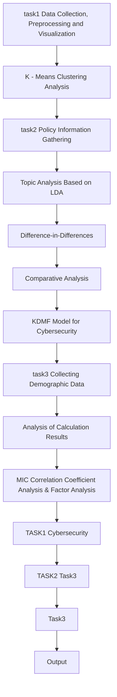

## Cracking the Cyber - Puzzle: KDMF in Action

In the digital era, cybercrime has become a significant global concern due to the increasing interconnectedness facilitated by modern technology. This study aims to identify patterns for data - driven development and refinement of national cybersecurity policies. Specifically, we developed the KDMF model, consisting of three sub - models, to achieve this goal.

To analyze the global distribution of cybercrime, we selected indicators like the National Cyber Security Index (NCSI), Cybersecurity Exposure Index (CEI), Legal Measures Index, and Cybercrime Reporting Rate. Through descriptive analysis and K - means clustering, we found that countries with high NCSI scores and strong legal measures, such as those in the Purple Cluster, are better at preventing and prosecuting cybercrimes. In contrast, countries in the Yellow Cluster with low scores are high - risk targets.

To assess the effectiveness of national cybersecurity policies, we employed Latent Dirichlet Allocation (LDA) and the Difference - in - Differences (DID) model. LDA categorized policies into six themes, and DID analysis showed that Data Protection and Privacy Regulations, Cybersecurity Obligations of Network Operators, and Cross - Border Data Flow Rules are effective in reducing cybercrime rates, while Cybercrime Criminal Legislation, Critical Information Infrastructure Protection, and Cybersecurity Incident Emergency Response Mechanisms need improvement.

To identify the correlation between demographic factors and cybercrime distribution, we used the Maximal Information Coefficient (MIC) method and factor analysis. The results indicated that the Internet Penetration Rate, Active mobile - broadband subscriptions, and GDP per capita growth have relatively strong correlations with cybercrime, while GDP and tertiary education enrollment have weaker effects. Different variables also have varying impacts across countries, which is similar to the pattern found when analyzing the distribution.

Finally, we arranged our research findings into a 1 - page memo for country leaders attending the ITU Summit on Cybersecurity, trying to offer key findings relevant for policymakers to better address cybercrime challenges.

Sensitivity analysis on the DID and MIC models indicates the models' stability and reliability. Overall, this research provides valuable insights for policymakers, helping them understand cybercrime patterns, evaluate policy effectiveness, and consider demographic factors when formulating more targeted and effective cybersecurity policies.

Key words: Cybercrime, KDMF, K-means, DID, MIC, Policy

## Contents

## 1 Introduction.....

1.1 Problem Background. 3  
1.2 Restatement of the Problem.. 3  
1.3 Our Work.. 4

## 2 Assumptions and Justifications ......

## 3 Notations .....

## 4 K-Means approach: Unveiling the Tapestry of Cybercrime ........... ....6

4.1 Introduction . 6  
4.2 Indicators Selection . 6  
4.3 Data Analysis. . 6  
4.3.1 Descriptive Analysis of Individual Indicators..... . 6  
4.3.2 Clustering Analysis of Cybercrime Distribution Patterns .. 9  
4.4 Discussion ...... .12  
4.4.1 Synthesis of Findings 12  
4.4.2 Emergent Patterns and Implications... 12

## 5 DID Analysis: Assessing Cyber - security Policies..... .12

5.1 Cracking the Policy Code: LDA and DID in Action.. .13  
5.1.1 LDA - based Thematic Analysis .. .. 13  
5.1.2 Efficiency Analysis by DID 14  
5.2 Decoding the Policy Efficacy: LDA - DID Results Uncovered. .15

## 6 MIC & Factor Strategy: Demographics - Cybercrime Correlations.............17

6.1 Analytical Framework: MIC Approach .18  
6.1.1 Data Preparation..... ... 18  
6.1.2 MIC Computation. 18  
6.2 Factor Analysis for Deeper Understanding. .18  
6.3 Results Unveiled: Variable Impact Profiles. .19  
6.3.1 Intra - variable Variations across Countries.. .. 19  
6.3.2 Inter - variable Comparative Analysis... ... 20

## 7 Sensitivity Analysis ........ ..20

## 9 Model Evaluation and Further Discussion...... .22

9.1 Strengths.. . 22  
9.2 Weaknesses.... .22  
9.3 Further Discussion... .23

## 10 References .... 24

## Memorandum.... .25

## Report on Use of AI ... ..26

## 1 Introduction

## 1.1 Problem Background

In the digital age, rapid technological progress has connected the world closely. However, this has led to a sharp increase in cybercrime. Reports show that the annual global cost of cybercrime is expected to reach a staggering \$10.5 trillion by 2025[1]. High - profile cases, like the 2024 cyber - attacks on cryptocurrency exchanges causing hundreds of millions of dollars in losses, clearly demonstrate the severe financial impact.

Cybercrime's transnational nature complicates matters. A single case can involve multiple countries, making it difficult to enforce laws due to jurisdictional issues. Moreover, many organizations hide cyber - attacks. A study found that over 60% of small - and medium - sized enterprises in a certain region didn't report security breaches, hiding the true scale of cyber threats.

Against this backdrop, the development and refinement of national cybersecurity policies grounded in data - driven insights are of paramount importance. Comprehending the patterns of cybercrime distribution, evaluating the efficacy of existing policies, and discerning the correlations with national demographics can offer invaluable guidance. Such knowledge equips countries to formulate more robust policies, foster closer international cooperation, and safeguard their digital assets and national security more effectively.

infographic

| Threat | Rank |
| --- | --- |
| Supply chain compromise of software dependencies | 1 |
| Advanced disinformation campaigns | 2 |
| Rise of digital surveillance authoritarianism/loss of privacy | 3 |
| Human error and exploited legacy systems within cyber-physical ecosystems | 4 |
| Targeted attacks enhanced by smart device data | 5 |
| Lack of analysis and control of space-based infrastructure and objects | 6 |
| Cross border ICT service providers as a single point of failure | 9 |
| Skill shortage | 8 |
| Artificial Intelligence Abuse | 10 |

Figure1 Top 10 threats in the Emerging Cybersecurity Threats 2030 published by the EU

## 1.2 Restatement of the Problem

The swift dissemination of modern technology has augmented global connectivity but has also precipitated a dramatic upsurge in cybercrime. This phenomenon has imposed formidable challenges on countries in their endeavors to safeguard their digital ecosystems. To extract patterns from effective national cybersecurity policies and laws and to propel the data - driven evolution and improvement of these policies, the following undertakings are imperative.

➢ Task 1: Analyze the global distribution of cybercrime. Identify high - target countries, successful and foiled crime regions, and areas of reporting and prosecution. Explore underlying patterns.

➢ Task 2: Examine national cybersecurity policies. Compare with cybercrime distribution to find effective or ineffective policy components. Consider policy adoption time.  
➢ Task 3: Investigate the correlation between demographic factors like internet access, wealth, and education levels and cybercrime distribution. Analyze their impact on the theory of effective policies.  
➢ Task 4: Based on data quantity, quality, and reliability, identify limitations for policymakers when using research findings for policy development.  
➢ Task 5: Write a one - page memo for country leaders at the ITU Cybersecurity Summit. Provide a non - technical overview of work objectives, context, theory, and key findings.

## 1.3 Our Work

Our work mainly includes developing the KDMF model to drive data - informed national cybersecurity policies.

For Task 1, we collected cybercrime data, visualized it, and used K - Means clustering to understand global cybercrime distribution.

For Task 2, we gathered and analyzed national cybersecurity policies. We categorized policies into six themes via LDA, and evaluated their effectiveness with DID model.

For Task 3, we used the MIC and factor analysis to explore the correlation between demographics and cybercrime.

These efforts provided insights into how demographic factors influence cybercrime, guiding more targeted cybersecurity strategies.

flowchart

## 2 Assumptions and Justifications

➢ Assumption 1: Data Completeness and Representativeness. The 9,867 cyber - crime cases sourced from the VCDB platform are assumed to be sufficiently comprehensive for representing global cyber - crime distribution.[2] Similarly, the cyber - security - related indicators used in our analysis are assumed to be authoritative.

Justification: VERIS – it is rooted in the examination of evidence and post-incident analysis, and given that these databases are exclusively from websites of global organizations, it's logical to deduce that the quality of their data is superior.

➢ Assumption 2: Stable Socio - Economic and Policy Context. We assume that the national economic conditions and policy environments remain relatively stable during the study period. Drastic economic events like recessions or financial crises, as well as sudden, unforeseen policy overhauls (beyond those being studied), are not expected.

Justification: Economic instability can significantly impact cyber - crime rates. Unstable policies would make it challenging to establish a clear link between policy implementation and cyber - crime distribution. A stable context allows us to isolate the effects of the policies and other variables we are analyzing.

➢ Assumption 3: Causal Independence of Variables. National demographics such as internet access, wealth, and education levels are assumed to be causally independent of policy implementation, except for the relationships we are explicitly exploring.

Justification: If demographics and policy implementation are causally intertwined in unaccounted ways, it would be challenging to disentangle the individual effects of each on cyber - crime distribution. By assuming causal independence, we can more easily analyze the correlations and test our theories.

## 3 Notations

The key mathematical notations used in this paper (mostly in the DID Method) are listed in Table 1. The data of different dimensions are normalized in the concrete operation process

Table 1 Notations used in this paper

<table><tr><td>Symbol</td><td>Description</td></tr><tr><td> $Y_{it}$ </td><td>The number of cybercrimes in country  $i$  during year  $t$ </td></tr><tr><td> $\alpha$ </td><td>Intercept; baseline cyber - crime level when all independent variables are zero</td></tr><tr><td> $\beta_1$ </td><td>Difference in cyber - crime rates pre - policy implementation</td></tr><tr><td> $\beta_2$ </td><td>General time - trend change in cyber - crime rates across all countries</td></tr><tr><td> $\beta_3$ </td><td>DID estimator; net policy implementation effect on cyber - crime rates</td></tr><tr><td> $X_{kit}$ </td><td> $k$ -th normalized control variable for country  $i$  in year  $t$ </td></tr><tr><td> $\gamma_k$ </td><td>Coefficient of  $X_{kit}$ </td></tr><tr><td> $\epsilon_{it}$ </td><td>Error term</td></tr></table>

# 4 K-Means approach: Unveiling the Tapestry of Cybercrime

## 4.1 Introduction

With development of technology, cybercrime has transcended borders, emerging as a pervasive threat that affects nations worldwide. Understanding its global distribution is essential for developing effective strategies to combat this menace. This part conducts a comprehensive analysis using key indicators and a clustering approach to reveal patterns in cybercrime distribution.

## 4.2 Indicators Selection

To conduct an in-depth examination of the global distribution of cybercrime, we selected four key indicators that collectively illuminate various dimensions of cybercrime dynamics and national responses:

➢ National Cyber Security Index (NCSI): This index measures a country's readiness and capability to prevent cyber threats and manage cyber incidents.[3] It reflects the robustness of a nation's cybersecurity infrastructure, policies, and strategic capacities. High NCSI scores indicate effective cybersecurity measures, reducing vulnerability to cyberattacks. Conversely, low scores suggest inadequate defenses.  
➢ Cybersecurity Exposure Index (CEI): The CEI evaluates the level of exposure a country has to cyber risks by considering both the frequency of cyberattacks and the country's cybersecurity commitment.[4] A high CEI score indicates significant exposure, potentially due to frequent attacks and insufficient cybersecurity measures.  
➢ Legal Measures (Global Cybersecurity Index): This indicator assesses the comprehensiveness and effectiveness of a country's laws, regulations, and enforcement mechanisms related to cybercrime.[5] Strong legal measures can deter potential cybercriminals through the threat of legal repercussions and provide the means to prosecute and penalize offenders.  
➢ Cybercrime Reporting Rate: This metric reflects the frequency with which cybercrime incidents are reported in a country relative to its number of internet users. High reporting rates suggest public awareness of cyber threats, efficient reporting mechanisms, and trust in law enforcement.

By examining cybersecurity preparedness, exposure to threats, legal infrastructures, and reporting behaviors, we gain comprehensive insights into both the vulnerabilities that enable cybercrime and the capacities that enable nations to respond effectively.

## 4.3 Data Analysis

## 4.3.1 Descriptive Analysis of Individual Indicators

## 1. National Cyber Security Index (NCSI)

The NCSI is a critical measure of a nation's ability to protect itself against cyber threats, evaluating factors such as cybersecurity policies, education, incident response capabilities, and protection of critical infrastructure.

➢ High-Scoring Countries: Nations such as Belgium (94.81), Lithuania (93.51), and Germany (90.91) exhibit excellent preparedness. Their high NCSI scores reflect comprehensive cybersecurity strategies, well-established policies, continuous investment in cybersecurity infrastructure, and robust incident response mechanisms. These countries are better positioned to prevent cyberattacks and mitigate their impact, reducing the likelihood of successful cybercrimes.  
➢ Low-Scoring Countries: In contrast, countries like Afghanistan (11.69), Saudi Arabia (10.39), and Myanmar (10.39) have significantly lower NCSI scores. This indicates insufficient cybersecurity measures, outdated or absent cybersecurity policies, limited resources, and lack of awareness or training. Such vulnerabilities make them attractive targets for cybercriminals, who can exploit these weaknesses to carry out attacks with a higher chance of success.

bar chart

| Country | Top 10 Cybercrime Target (%) |
| :--- | :--- |
| Greece | 96.1 |
| Belgium | 94.81 |
| Lithuania | 93.51 |
| Czech Republic | 92.21 |
| Germany | 90.91 |
| Portugal | 89.61 |
| Romania | 89.61 |
| Spain | 88.31 |
| Poland | 87.01 |
| Finland | 85.71 |

Figure2 Which countries are disproportionately high targets of cybercrimes?

## 2. Cybersecurity Exposure Index (CEI)

To provide a more intuitive representation of countries' cybersecurity levels, we processed the original Cybersecurity Exposure Index (CEI) values. Given that the original CEI ranges from 0 to 1, with higher scores indicating higher exposure to cybercrime, we transformed the data by calculating (1 − ???????????????? ?????? ??????????) × 100. This new calculation results in a modified CEI where a higher score now corresponds to a lower exposure level. This transformation was carried out to simplify the interpretation of the index, making it easier to understand which countries have a lower vulnerability to cybercrime at a glance.

➢ High-Security Countries: Finland (89.0) and Belgium (81.0) have high CEI scores, which may face lower exposure levels. These countries have well - developed digital infrastructure and high internet penetration, which would seemingly make them vulnerable. However, their advanced security strategies, including strong legal frameworks, active incident response teams, and high - level security awareness, effectively reduce their exposure to cyber threats, resulting in low CEI scores.  
➢ Low-Security Countries: Afghanistan (0.0) and Myanmar (0.0) report low CEI scores, suggesting they face a substantial number of cyber threats. Their limited technological capabilities and underdeveloped digital infrastructure result in less effective security measures. This

makes them more vulnerable to cyber threats, thereby increasing their exposure. Moreover, weak legal frameworks related to cybercrime in these nations are ineffective at deterring malicious actors.

bar chart

| Country | Value |
| :--- | :--- |
| Afghanistan | 0.00 |
| Myanmar | 9.00 |
| Ethiopia | 13.40 |
| Venezuela | 19.30 |
| Libya | 20.70 |

| The five highest countries | Value |
| :--- | :--- |
| Norway | 86.60 |
| Australia | 86.90 |
| Luxembourg | 87.60 |
| Denmark | 88.30 |
| Finland | 89.00 |

Figure3 Where are cybercrimes successful, and where are they thwarted?

## 3. Legal Measures (Global Cybersecurity Index)

Legal frameworks are fundamental in combating cybercrime, establishing the legal basis for action against cybercriminals.

➢ Countries with Strong Legal Measures: Nations such as Germany (20) and Australia (20) possess comprehensive cyber laws, regulations, and enforcement mechanisms. They have specific legislation addressing cybercrime, enforce legal actions against offenders, and participate in international cooperation. This legal rigor deters cybercriminals and enables effective prosecution when crimes occur.  
➢ Countries with Weak Legal Measures: Afghanistan (5.81) and Turkey (10.12) have lower scores, indicating insufficient legal frameworks to address cybercrime effectively. Weak or outdated laws, lack of enforcement, and judicial inefficiencies hinder their ability to prosecute cybercriminals, potentially making these countries safer havens for such activities.

heatmap

| Country | Value |
| --- | --- |
| India | 20 |
| Indonesia | 18 |
| Australia | 17 |
| United States | 16 |
| Mexico | 15 |
| Brazil | 14 |
| Russia | 13 |
| South Africa | 12 |
| Canada | 11 |
| Germany | 10 |
| France | 9 |
| United Kingdom | 8 |
| Italy | 7 |
| Spain | 6 |
| Japan | 5 |
| China | 4 |
| South Korea | 3 |
| Egypt | 2 |
| Saudi Arabia | 1 |
| Iran | 0.5 |
| Saudi Arabia | 0.4 |
| Turkey | 0.3 |
| Vietnam | 0.2 |
| Thailand | 0.1 |
| Philippines | 0.05 |
| Malaysia | 0.03 |
| Singapore | 0.02 |
| New Zealand | 0.01 |
| Norway | 0.005 |
| Sweden | 0.003 |
| Finland | 0.002 |
| Denmark | 0.001 |
| Netherlands | 0.0005 |
| Belgium | 0.0003 |
| Austria | 0.0002 |
| Poland | 0.0001 |
| Ukraine | 0.00005 |
| Belarus | 0.00003 |
| Moldova | 0.00002 |
| Moldova | 0.00001 |
| Mozambique | 0.000005 |
| Madagascar | 0.000003 |
| Guinea | 0.000002 |
| Ivory Coast | 0.000001 |
| Cameroon | 0.0000005 |
| Angola | 0.0000003 |
| Zambia | 0.0000002 |
| Somalia | 0.0000001 |
| Zimbabwe | 0.00000005 |
| Chad | 5.66 |
| Sudan | 5.66 |
| Yemen | 5.66 |
| Yemen | 5.66 |
| Yemen | 5.66 |
| Yemen | 5.66 |
| Yemen | 5.66 |
| Yemen | 5.66 |
| Yemen | 5.66 |
| Yemen | 5.66 |
| Yemen | 5.66 |
| Yemen (other) | 5.66 |
| Yemen (other) | 5.66 |
| Yemen (other) | 5.66 |
| Yemen (other) | 5.66 |
| Yemen (other) | 5.66 |
| Yemen (other) | 5.66 |
| Yemen (other) | 5.66 |
| Yemen (other) | 5.66 |
| Yemen | 5.66 |
| Yemen (other) | 5.66 |
| Yemen (other) | 5.66 |
| Yemen (other) | 5.66 |
| Yemen (other) | 5.66 |
| Yemen (other) | 5.66 |
| Yemen (other) | 5.66 |
| Yemen (other) | 5.66 |

Figure4 Where are cybercrimes prosecuted?

## 4. Cybercrime Reporting Rate

Reporting plays a crucial role in understanding the scale of cybercrime and implementing appropriate responses.

➢ High Reporting Rates: The United States (2.24e-05) and the United Kingdom (8.88e-06) exhibit relatively high reporting rates, reflecting efficient reporting systems, high public awareness, and trust in authorities. These countries encourage reporting through accessible channels, public education campaigns, and assurances of support and confidentiality. High reporting rates enable authorities to gather intelligence, track trends, and allocate resources effectively.  
➢ Low Reporting Rates: Countries like India, Ukraine, and Uganda display minimal or zero reporting rates. This may result from cultural stigmas, lack of awareness about cybercrime, mistrust of authorities, or insufficient reporting mechanisms. Low reporting hinders the ability of law enforcement and policymakers to grasp the true extent of cybercrime, allowing threats to persist unaddressed.

heatmap

| Country | Value |
|---|---|
| USA | 0.0022 |
| United Kingdom | 0.0022 |
| Cyprus | 0.0022 |
| Lithuania | 0.0022 |
| Finland | 0.0022 |
| United Arab Emirates | 0.0022 |
| Qatar | 0.0022 |
| Zimbabwe | 0.0022 |
| North Macedonia | 0.0022 |
| Slovenia | 0.0022 |
| Honduras | 0.0022 |
| Kazakhstan | 0.0022 |
| Uruguay | 0.0022 |
| Jordan | 0.0022 |
| Russia | 0.0022 |
| Pakistan | 0.0022 |
| Nepal | 0.0022 |
| Greece | 0.0022 |
| Brazil | 0.0022 |
| Nigeria | 0.0022 |
| Mauritius | 0.0022 |
| Nicaragua | 0.0022 |

Figure5 Where are cybercrimes reported?

## 4.3.2 Clustering Analysis of Cybercrime Distribution Patterns

## 1. Clustering Process Overview

To uncover underlying patterns in the global distribution of cybercrime, we employed Kmeans clustering,[6] focusing on the NCSI and Legal Measures indicators. This approach groups countries with similar characteristics, enabling the identification of clusters with shared vulnerabilities or strengths.

➢ Data Standardization: Ensured comparability across different scales and units.  
➢ Determination of Optimal Clusters: Used the Elbow Method to identify the optimal number of clusters for the K-means algorithm. It involved calculating inertia (sum of squared distances to nearest centers) for different K values. The Elbow Method graph showed inertia decrease slowed around K = 3, the "elbow" point, meaning more clusters above K = 3 had diminishing quality returns. We also considered the Silhouette Score. Although K = 2 had the highest score for cohesion and separation, overall, K = 3 balanced inertia reduction and high Silhouette Score better, so it was chosen as optimal.

line chart

| Number of culsters(K) | Inertia |
| --------------------- | ------- |
| 2                     | 248     |
| 3                     | 189     |
| 4                     | 130     |
| 5                     | 104     |
| 6                     | 85      |
| 7                     | 78      |
| 8                     | 66      |
| 9                     | 56      |

line chart

| Number of Clusters (K) | Silhouette Score |
| ---------------------- | ---------------- |
| 2                      | 0.41             |
| 3                      | 0.42             |
| 4                      | 0.43             |
| 5                      | 0.37             |
| 6                      | 0.38             |
| 7                      | 0.32             |
| 8                      | 0.32             |
| 9                      | 0.33             |

Figure6 Elbow and Silhouette Plots for Cluster Number Selection

➢ K-Means Clustering: Classified countries into three clusters—Purple, Yellow, and Cyan— based on similarities in cybersecurity preparedness and legal measures. The Purple Cluster includes countries that exhibit high standardized values for both NCSI and Legal Measures, signifying strong cybersecurity preparedness and well - established legal frameworks. In contrast, the Yellow Cluster consists of countries with low standardized values for these indicators, indicating significant vulnerabilities in both cybersecurity and legal protection. The Cyan Cluster represents countries with a more heterogeneous set of characteristics, where there are a mix of strengths and weaknesses in either NCSI or Legal Measures.  
➢ Visualization and Interpretation: Mapped the clustering results to facilitate analysis. Using principal component analysis (PCA) to project high - dimensional data onto a 2D plane helped visualize clustering results. Each country was a point, and cluster centers were red "X" symbols. This showed country distribution in clusters and overlapping areas, highlighting the complexity of differentiating countries by just NCSI and Legal Measures. It also showed a country's cyber - security was affected by many factors, calling for a more comprehensive analysis with more cyber - crime related variables.

scatter plot

| PCA Component 1 | PCA Component 2 | Cluster |
| --------------- | --------------- | ------- |
| -2.0            | 0.0             | Red     |
| 1.5             | 4.5             | Red     |
| 1.8             | 2.2             | Purple  |
| 1.7             | 1.4             | Purple  |
| 1.6             | 0.3             | Purple  |
| -2.5            | 0.8             | Teal    |
| -1.8            | 0.5             | Teal    |
| -1.2            | 0.2             | Teal    |
| -0.8            | -0.1            | Teal    |
| -0.5            | -0.3            | Teal    |
| -0.2            | -0.5            | Teal    |
| 0.0             | -0.7            | Teal    |
| 0.3             | -0.9            | Teal    |
| 0.5             | -1.1            | Teal    |
| 0.8             | -1.3            | Teal    |
| 1.0             | -1.5            | Teal    |
| 1.2             | -1.7            | Teal    |
| 1.5             | -1.9            | Teal    |
| 1.8             | -2.1            | Teal    |
| -4.0            | 2.5             | Purple  |
| -3.5            | 1.2             | Teal    |
| -3.0            | 0.8             | Teal    |
| -2.5            | 0.5             | Teal    |
| -2.0            | 0.2             | Teal    |
| -1.5            | 0.0             | Teal    |
| -1.0            | -0.2            | Teal    |
| -0.5            | -0.4            | Teal    |
| 0.0             | -0.6            | Teal    |
| 0.5             | -0.8            | Teal    |
| 1.0             | -1.0            | Teal    |
| 1.5             | -1.2            | Teal    |
| 2.0             | -1.4            | Teal    |
| 2.5             | -1.6            | Teal    |
| 3.0             | -1.8            | Teal    |
| 3.5             | -2.0            | Teal    |
| 4.0             | -2.2            | Teal    |
| 4.5             | -2.4            | Teal    |
| 5.0             | -2.6            | Teal    |
| 5.5             | -2.8            | Teal    |
| 6.0             | -3.0            | Teal    |
| 6.5             | -3.2            | Teal    |
| 7.0             | -3.4            | Teal    |
| 7.5             | -3.6            | Teal    |
| 8.0             | -3.8            | Teal    |
| 8.5             | -4.0            | Teal    |
| 9.0             | -4.2            | Teal    |
| 9.5             | -4.4            | Teal    |
| 10.0            | -4.6            | Teal    |
| 10.5            | -4.8            | Teal    |
| 11.0            | -5.0            | Teal    |
| 11.5            | -5.2            | Teal    |
| 12.0            | -5.4            | Teal    |
| 12.5            | -5.6            | Teal    |
| 13.0            | -5.8            | Teal    |
| 13.5            | -6.0            | Teal    |
| 14.0            | -6.2            | Teal    |
| 14.5            | -6.4            | Teal    |
| 15.0            | -6.6            | Teal    |
| 15.5            | -6.8            | Teal    |
| 16.0            | -7.0            | Teal    |
| 16.5            | -7.2            | Teal    |
| 17.0            | -7.4            | Teal    |
| 17.5            | -7.6            | Teal    |
| 18.0            | -7.8            | Teal    |
| 18.5            | -8.0            | Teal    |
| 19.0            | -8.2            | Teal    |
| 19.5            | -8.4            | Teal    |
| 20.0            | -8.6            | Teal    |
| 20.5            | -8.8            | Teal    |
| 21.0            | -9.0            | Teal    |
| 21.5            | -9.2            | Teal    |
| 22.0            | -9.4            | Teal    |
| 22.5            | -9.6            | Teal    |
| 23.0            | -9.8            | Teal    |
| 23.5            | -10.0           | Teal    |
| 24.0            | -10.2           | Teal    |
| 24.5            | -10.4           | Teal    |
| 25.0            | -10.6           | Teal    |
| 25.5            | -10.8           | Teal    |
| 26.0            | -11.0           | Teal    |
| 26.5            | -11.2           | Teal    |
| 27.0            | -11.4           | Teal    |
| 27.5            | -11.6           | Teal    |
| 28.0            | -11.8           | Teal    |
| 28.5            | -12.0           | Teal    |
| 29.0            | -12.2           | Teal    |
| 29.5            | -12.4           | Teal    |
| 30.0            | -12.6           | Teal    |
| 30.5            | -12.8           | Teal    |
| 31.0            | -13.0           | Teal    |
| 31.5            | -13.2           | Teal    |
| 32.0            | -13.4           | Teal    |
| 32.5            | -13.6           | Teal    |
| 33.0            | -13.8           | Teal    |
| 33.5            | -14.0           | Teal    |
| 34.0            | -14.2           | Teal    |
| 34.5            | -14.4           | Teal    |
| 35.0            | -14.6           | Teal    |
| 35.5            | -14.8           | Teal    |
| 36.0            | -15.0           | Teal    |
| 36.5            | -15.2           | Teal    |
| 37.0            | -15.4           | Teal    |
| 37.5            | -15.6           | Teal    |
| 38.0            | -15.8           | Teal    |
| 38.5            | -16.0           | Teal    |
| 39.0            | -16.2           | Teal    |
| 39.5            | -16.4           | Teal    |
| 40.0            | -16.6           | Teal    |
| 40.5            | -16.8           | Teal    |
| 41.0            | -17.0           | Teal    |
| 41.5            | -17.2           | Teal    |
| 42.0            | -17.4           | Teal    |
| 42.5            | -17.6           | Teal    |
| 43.0            | -17.8           | Teal    |
| 43.5            | -18.0           | Teal    |
| 44.0            | -18.2           | Teal    |
| 44.5            | -18.4           | Teal    |
| 45.0            | -18.6           | Teal    |
| 45.5            | -18.8           | Teal    |
| 46.0            | -19.0           | Teal    |
| 46.5            | -19.2           | Teal    |
| 47.0            | -19.4           | Teal    |
| 47.5            | -19.6           | Teal    |
| 48.0            | -19.8           | Teal    |
| 48.5            | -20.0           | Teal    |
| 49.0            | -20.2           | Teal    |
| 49.5            | -20.4           | Teal    |
| 50.0            | -20.6           | Teal    |
| 50.5            | -20.8           | Teal    |
| 51.0            | -21.0           | Teal    |
| 51.5            | -21.2           | Teal    |
| 52.0            | -21.4           | Teal    |
| 52.5            | -21.6           | Teal    |
| 53.0            | -21.8           | Teal    |
| 53.5            | -22.0           | Teal    |
| 54.0            | -22.2           | Teal    |
| 54.5            | -22.4           | Teal    |
| 55.0            | -22.6           | Teal    |
| 55.5            | -22.8           | Teal    |
| 56.0            | -23.0           | Teal    |
| 56.5            | -23.2           | Teal    |
| 57.0            | -23.4           | Teal    |
| 57.5            | -23.6           | Teal    |
| 58.0            | -23.8           | Teal    |
| 58.5            | -24.0           | Teal    |
| 59.0            | -24.2           | Teal    |
| 59.5            | -24.4           | Teal    |
| 60.0            | -24.6           | Teal    |
| 60.5            | -24.8           | Teal    |
| 61.0            | -25.0           | Teal    |
| 61.5            | -25.2           | Teal    |
| 62.0            | -25.4           | Teal    |
| 62.5            | -25.6           | Teal    |
| 63.0            | -25.8           | Teal    |
| 63.5            | -26.0           | Teal    |
| 64.0            | -26.2           | Teal    |
| 64.5            | -26.4           | Teal    |
| 65.0            | -26.6           | Teal    |
| 65.5            | -26.8           | Teal    |
| 66.0            | -27.0           | Teal    |
| 66.5            | -27.2           | Teal    |
| 67.0            | -27.4           | Teal    |
| 67.5            | -27.6           | Teal    |
| 68.0            | -27.8           | Teal    |
| 68.5            | -28.0           | Teal    |
| 69.0            | -28.2           | Teal    |
| 69.5            | -28.4           | Teal    |
| 70.0            | -28.6           | Teal    |
| 70.5            | -28.8           | Teal    |
| 71.0            | -29.0           | Teal    |
| 71 .d              (labeled as 'Centers')

Figure7 PCA - based 2D Visualization of Cyber - security Clustering Results

## 2. Analysis of Clustering Results

Purple Cluster: Prepared and Resilient Nations

Characteristics: High standardized values for both NCSI and Legal Measures.

Examples: Germany, Belgium, Australia, United Kingdom.

Analysis: Countries in the Purple Cluster exhibit strong cybersecurity infrastructures and comprehensive legal frameworks. Their high NCSI scores reflect advanced technical capabilities, effective policies, and proactive strategies. Robust legal measures indicate stringent laws, effective enforcement, and active participation in international cooperation against cybercrime.

Outcomes: These nations are better at preventing cyberattacks and successfully thwarting cybercriminal activities. High reporting rates facilitate timely responses to threats. Strong legal systems enable effective prosecution of cybercriminals, deterring potential offenders.

Cyan Cluster: Intermediate or Transitioning Nations

Characteristics: Moderate or mixed standardized values.

Examples: India, Ukraine, Finland.

Analysis: Countries in the Cyan Cluster display a mix of strengths and weaknesses. Some may have strong cybersecurity measures but weaker legal frameworks, or vice versa. This inconsistency may be due to transitional economies, evolving policies, or resource constraints.

Outcomes: These nations experience variable success in preventing and managing cybercrime. While some cyberattacks may be thwarted, others succeed due to gaps in defenses or enforcement. Reporting and prosecution rates may be inconsistent, reflecting the uneven development of systems and awareness.

Yellow Cluster: High-Risk and Vulnerable Countries

Characteristics: Low standardized values for both NCSI and Legal Measures.

Examples: Afghanistan, Myanmar, Saudi Arabia, Turkey.

Analysis: The Yellow Cluster comprises countries with significant vulnerabilities due to inadequate cybersecurity preparedness and weak legal measures. These nations lack the infrastructure, policies, and capabilities necessary to defend against cyber threats effectively. Legal frameworks may be outdated, poorly enforced, or insufficient to address the complexities of cybercrime.

Outcomes: Such countries are disproportionately high targets for cybercriminals, who exploit these weaknesses. Cybercrimes are more likely to succeed and remain unreported or unprosecuted. The lack of deterrence emboldens cybercriminals, perpetuating a cycle of vulnerability.

## 3. Integration with Individual Indicator Analyses

The clustering results corroborate the findings from the individual indicator analyses:

➢ Correlation Between Preparedness and Vulnerability: Countries with high NCSI scores tend to have strong legal measures, suggesting a holistic approach to cybersecurity that includes both technological defenses and legal deterrents.  
➢ Impact on Cybercrime Outcomes: The clusters illustrate how variations in preparedness and legal frameworks influence the prevalence and success of cybercrime. The Purple Cluster's strengths result in lower rates of successful cyberattacks and higher rates of reporting and prosecution. Conversely, the Yellow Cluster's weaknesses lead to higher vulnerability and fewer resources to combat cyber threats effectively.  
➢ Regional Patterns: The clustering reveals geographical trends, with many developing nations falling into the Yellow Cluster, while more developed nations generally occupy the Purple Cluster. This highlights the role of economic development and resource allocation in cybersecurity readiness.

## 4.4 Discussion

## 4.4.1 Synthesis of Findings

## 1. Cybercrime Distribution and Targeting

High-Risk Targets: Countries in the Yellow Cluster are disproportionately targeted by cybercriminals due to their low cybersecurity preparedness and weak legal measures. These vulnerabilities result in higher success rates of attacks.  
➢ Successful and Thwarted Cybercrimes: In the Purple Cluster, robust cybersecurity infrastructures and stringent legal frameworks enable effective prevention and mitigation of cybercrimes. Cyberattacks are more likely to be detected, reported, and thwarted. Conversely, the Yellow Cluster experiences higher rates of successful cybercrimes due to their vulnerabilities.

## 2. Reporting and Prosecution of Cybercrimes

➢ Reporting Rates: High reporting rates in the Purple Cluster indicate greater public awareness, efficient reporting mechanisms, and trust in law enforcement. This transparency allows for better tracking of cyber threats and more effective responses. In the Yellow and Cyan Clusters, underreporting due to lack of awareness, inadequate infrastructure, or distrust hampers efforts to combat cybercrime.

➢ Prosecution Efficacy: Strong legal frameworks in the Purple Cluster enable effective prosecution of cybercriminals, acting as a deterrent. Weak legal measures in the Yellow Cluster result in challenges in prosecuting offenders, allowing cybercrime to persist with minimal consequences.

## 4.4.2 Emergent Patterns and Implications

1. Interplay Between Preparedness and Vulnerability: There is a clear inverse relationship between a country's cybersecurity preparedness and its vulnerability to cybercrime. Nations investing in cybersecurity measures and legal reforms are less susceptible to attacks and better at managing incidents.  
2. Significance of Legal Frameworks: Effective legal measures are crucial for deterring cybercriminals and prosecuting offenders. International cooperation and adherence to global cybersecurity norms enhance a country's ability to combat cybercrime.  
3. Role of Societal Factors: Public awareness and education significantly impact reporting rates. Cultural attitudes towards technology and authority influence the willingness to report incidents.  
4. Economic and Developmental Factors: Developing nations often lack resources to invest in cybersecurity infrastructure or legal reforms. Economic disparities contribute to the uneven distribution of cybercrime impacts globally.

## 5 DID Analysis: Assessing Cyber - security Policies

In our prior exploration of the global cybercrime distribution, we grasped the gravity and complexity of cyber threats. Now, we turn to assessing national cyber - security policies' effectiveness. Cybercrime's rapid growth in the digital age demands a close look at these policies.

We use Latent Dirichlet Allocation (LDA) [7] to categorize various national security policies, and Difference - in - Differences (DID) model [8] to analyze their impact on cybercrime rates. By comparing policies with cybercrime distribution, we aim to find which policy elements are effective or not in preventing, prosecuting, or mitigating cybercrimes, also considering policy adoption timings.

## 5.1 Cracking the Policy Code: LDA and DID in Action

## 5.1.1 LDA - based Thematic Analysis

In the complex landscape of cybersecurity, national security policies vary widely in content and focus. To distill meaningful insights from these policies, we turned to Latent Dirichlet Allocation (LDA), a powerful topic - modeling technique in natural language processing.

Our approach began with collecting and pre - processing a diverse set of national cybersecurity policies. This involved basic text cleaning, including the removal of stop - words that carry little semantic value. We then fed the pre - processed data into the LDA model. Through iterative experiments and evaluations using perplexity and coherence scores, we determined the optimal number of latent topics within the policies. This allowed us to categorize the policies into distinct themes, which served as the foundation for further analysis using the Difference - in - Differences (DID) model to assess the impact of each policy theme on cybercrime rates.

The six topics we identified are as follows:

➢ Cybercrime Criminal Legislation: This topic encompasses keywords like "Cybercrime", "warrant", "Penalty", etc. It focuses on the legal frameworks and punitive measures in place to combat cybercrimes. Understanding these laws is crucial for assessing how countries prosecute cybercriminals.  
➢ Data Protection and Privacy Regulations: With keywords such as "Personal", "data", "Encryption", this topic is centered around how countries safeguard personal data. In an era of rampant data - driven cybercrimes, these regulations play a vital role in preventing identity theft, data breaches, and other privacy - related cyber threats.  
➢ Cybersecurity Obligations of Network Operators: Keywords like "Cybersecurity", "operator" define this topic. It delves into the responsibilities and requirements placed on network operators to ensure the security of their networks, which is a key aspect in preventing cyberattacks at the network level.  
➢ Critical Information Infrastructure Protection: Covering keywords "Infrastructure", "Protection", "obligation", this topic is about safeguarding the critical information infrastructure of a country. These infrastructures are the backbone of a nation's digital ecosystem, and their protection is essential for national security.  
➢ Cybersecurity Incident Emergency Response Mechanisms: This topic, marked by keywords "security", "warning", "Compliance", deals with how countries respond to cyber - security incidents. An effective response mechanism can mitigate the damage caused by cybercrimes.  
➢ Cross - Border Data Flow Rules: Keywords "border", "exporter", "consent" define this topic. In a globalized digital world, cross - border data flow is common, and these rules govern how data is transferred across national boundaries, which is crucial for preventing cross - border cybercrimes.

  
Figure8 Word Clouds Representing Six Cybersecurity Policy Themes

## 5.1.2 Efficiency Analysis by DID

After categorizing the policies using LDA, we employed the Difference - in - Differences (DID) approach to quantify the causal impact of each policy theme on cybercrime rates.

## 1. Data Preparation

We meticulously selected countries for the experimental and control groups. For each policy theme, the experimental group consisted of 1 - 2 countries that had implemented the relevant policies. In contrast, the control group was composed of an equal number of countries with similar internet penetration rates but without such policies. This careful selection was crucial for isolating the treatment effect of the policies, ensuring that any observed changes in cybercrime rates could be more accurately attributed to the policy implementation rather than other confounding factors related to internet usage.

## 2. Variable Definition

In our DID model, the dependent variable $Y _ { i t }$ denotes the number of cybercrimes in country ?? during year ??. The policy variable $t r e a t e d _ { i t }$ is a binary variable: a value of 1 indicates that country had implemented the relevant policy in year, while 0 means no implementation. The time variable $t i m e _ { i t }$ is also binary, with 1 representing the post - policy implementation period and 0 for the pre - period.

To control for other factors that might influence cybercrime rates, we incorporated several control variables, including GDP, internet penetration rate, mobile broadband subscribers, tertiary education enrollment rate, legal measures, capacity development, and cooperation measures.

Given the varying magnitudes of these control variables, we normalized them using the min - max normalization method. This normalization ensured that all variables were on a comparable scale, preventing any single variable from disproportionately influencing the model results due to its large magnitude.

## 3. Model Specification

The DID model was formulated as follows:

$$
Y _ {i t} = \alpha + \beta_ {1} \text { treated } _ {i t} + \beta_ {2} \text { time } _ {i t} + \beta_ {3} \text { treated } _ {i t} \times \text { time } _ {i t} + \sum_ {k = 1} ^ {n} \gamma_ {k} X _ {k i t} + \epsilon_ {i t}
$$

After categorizing the policies, we utilized the Difference - in - Differences (DID) approach to assess the causal impact of each policy theme on cybercrime rates.

## 5.2 Decoding the Policy Efficacy: LDA - DID Results Uncovered

## 1. Cybercrime Criminal Legislation

For the theme of Cybercrime Criminal Legislation, we chose Australia and Ireland as the experimental group and the UK and New Zealand as the control group. The Diff - in - Diff effect value was 0.151, but it was not significant $( p > 0 . 0 5 )$ , suggesting that the policy in this area had no discernible impact on cybercrime rates. Before the experiment, the Diff effect value was 0.062 $( p > 0 . 0 5 )$ , indicating no significant difference between the experimental and control groups. After the experiment, the Diff effect value was 0.212 $\left( \boldsymbol { p } > 0 . 0 5 \right)$ , still showing no significant difference. This lack of significance implies that, at least within the scope of our study, the existing cybercrime criminal legislation may not be effectively curbing cybercrimes.

Table 2 Summary of the DID model for Cybercrime Criminal Legislation

<table><tr><td>time</td><td>Item</td><td>Effected value Normalized number of cases</td><td>Standard error</td><td>t</td><td>p</td></tr><tr><td rowspan="3">Before</td><td>Control</td><td>0.009</td><td></td><td></td><td></td></tr><tr><td>Treated</td><td>0.071</td><td></td><td></td><td></td></tr><tr><td>Diff (T – C)</td><td>0.062</td><td>0.25</td><td>0.248</td><td>0.805</td></tr><tr><td rowspan="3">After</td><td>Control</td><td>-0.326</td><td></td><td></td><td></td></tr><tr><td>Treated</td><td>-0.113</td><td></td><td></td><td></td></tr><tr><td>Diff (T – C)</td><td>0.212</td><td>null</td><td>null</td><td>null</td></tr><tr><td colspan="2">Diff-in-Diff</td><td>0.151</td><td>0.107</td><td>1.411</td><td>0.168</td></tr></table>

Remarks: $\mathrm { R } ^ { 2 } = 0 . 7 1 3$ , adjust $\mathrm { R } ^ { 2 } = 0 . 6 3 5$  
\* p<0.05 \*\* p<0.01

## 2. Data Protection and Privacy Regulations

As most countries have related laws, the UK (without such policies in collected data) was chosen as the control group, and Australia (with similar internet penetration) as the experimental group.

The Diff - in - Diff value is 0.708, significant at the 5% level $\left( { { p = 0 . 0 2 2 } } \right)$ . Before the experiment, the Diff value of - 0.206 is not significant $( p > 0 . 0 5 )$ ), indicating no difference between groups. After the experiment, the Diff value of 0.502 is also not significant $( p > 0 . 0 5 )$ .

Despite non - significant pre and post - experiment Diff values, the significant Diff - in - Diff value implies that Data Protection and Privacy Regulations are effective in curbing cybercrimes, likely by making data - related crimes more difficult.

Table 3 Results of OLS Regression Analysis of Data Protection and Privacy Regulations

<table><tr><td></td><td>Regression Coefficient</td><td>Standard Error</td><td>t</td><td>p</td><td>95% CI</td></tr><tr><td>treated</td><td>-0.206</td><td>0.236</td><td>-0.874</td><td>0.396</td><td>-0.708 ~ 0.296</td></tr><tr><td>time</td><td>-0.814</td><td>0.185</td><td>-4.39</td><td>0.001</td><td>-1.209 ~ -0.419</td></tr><tr><td>treated * time</td><td>0.708</td><td>0.278</td><td>2.547</td><td>0.022</td><td>0.116 ~ 1.299</td></tr></table>

Remarks：Explained Variable = Normalized Number of Cases  
\* p<0.05 \*\* p<0.01

## 3. Cybersecurity Obligations of Network Operators

For the theme of Cybersecurity Obligations of Network Operators, with Australia and China as the experimental group and France and the Netherlands as the control group, the Diff - in - Diff effect value was 0.310, demonstrating a strong positive effect. Before the experiment, the Diff effect value was - 0.402, which might be due to pre - existing differences in cyber - security postures between the two groups. The significance of the interaction term ${ \bf \rho } _ { P } = 0 . 0 1 { \bf \rho } _ { , } { \bf \rho } _ { , }$ indicates that clearly defined cybersecurity obligations for network operators are effective. These obligations may require operators to conduct regular security audits, implement security patches promptly, and report security incidents in a timely manner. By doing so, they can proactively prevent cyberattacks and reduce the overall cybercrime rate.

Table 4 Results of OLS Regression Analysis of Cybersecurity Obligations of Network Operators

<table><tr><td></td><td>Regression Coefficient</td><td>Standard Error</td><td>t</td><td>p</td><td>95% CI</td></tr><tr><td>treated</td><td>-0.402</td><td>0.126</td><td>-3.204</td><td>0.003</td><td>-0.658 ~ -0.146</td></tr><tr><td>time</td><td>-0.448</td><td>0.095</td><td>-4.688</td><td>0</td><td>-0.642 ~ -0.253</td></tr><tr><td>treated * time</td><td>0.31</td><td>0.113</td><td>2.75</td><td>0.01</td><td>0.080 ~ 0.540</td></tr></table>

Remarks：Explained Variable = Normalized Number of Cases  
$^ { * } \mathrm { p } { < } 0 . 0 5 \ ^ { * * } \mathrm { p } { < } 0 . 0 1$

## 4. Critical Information Infrastructure Protection

For Critical Information Infrastructure Protection, the Diff - in - Diff effect value was 0.286 showing no significant impact. However, after the experiment, the Diff effect value was 0.634, indicating that the experimental group had a higher cybercrime rate than the control group. This unexpected result could be because protecting critical information infrastructure is a complex task that involves multiple stakeholders and technical challenges. The existing policies may not be comprehensive enough to address all aspects of the protection, such as the coordination between different sectors and the continuous evolution of cyber threats.

## 5. Cybersecurity Incident Emergency Response Mechanisms

When considering Cybersecurity Incident Emergency Response Mechanisms, the Diff - in - Diff effect value was - 0.189, indicating no significant impact. This may suggest that the current emergency response mechanisms are not well - designed or that there are difficulties in their implementation. For example, there may be a lack of clear communication channels between different response teams, or the response time may be too long to effectively mitigate the impact of cyber - security incidents.

## 6. Cross - Border Data Flow Rules

For the theme of Cross - Border Data Flow Rules, with Australia and Ireland as the experimental group and the UK and Singapore as the control group, the significance of the interaction term between ?????????????? and ???????? $( \ p = 0 . 0 4 7 \ )$ suggests that the policy in this area is effective. This could be due to the clear regulation of cross - border data flow, which may prevent cybercriminals from exploiting cross - border data loopholes.

Table 5 Results of OLS Regression Analysis of Cross - Border Data Flow Rules

<table><tr><td></td><td>Regression Co-efficient</td><td>Standard Error</td><td>t</td><td>p</td><td>95% CI</td></tr><tr><td>treated</td><td>-0.211</td><td>0.126</td><td>-3.204</td><td>0.003</td><td>-0.658 ~ -0.146</td></tr><tr><td>time</td><td>-0.448</td><td>0.095</td><td>-4.688</td><td>0</td><td>-0.642 ~ -0.253</td></tr><tr><td>treated * time</td><td>0.31</td><td>0.113</td><td>2.75</td><td>0.01</td><td>0.080 ~ 0.540</td></tr></table>

Remarks：Explained Variable = Normalized Number of Cases  
\* p<0.05 \*\* p<0.01

In summary, our analysis using LDA and DID has provided valuable insights into the effectiveness of different cyber - security policy themes. Data protection and privacy regulations, cybersecurity obligations of network operators, and cross - border data flow rules have shown positive impacts on reducing cybercrime rates, while cybercrime criminal legislation, critical information infrastructure protection, and cybersecurity incident emergency response mechanisms may need further improvement. These findings can guide policymakers in formulating more effective cyber - security policies and enhancing national cyber - security postures.

## 6 MIC & Factor Strategy: Demographics - Cybercrime Correlations

Building on the exploration of global cybercrime distribution and the assessment of national security policies' efficacy, we continue to explore the correlations between various national - level demographic factors, such as GDP, Internet Penetration Rate, Active mobile - broadband subscriptions, School enrollment in tertiary education, GDP per capita growth, and GNI per capita, and the number of cybercrime cases. Employing the Maximal Information Coefficient (MIC) method, we analyze data from 20 representative countries. Additionally, factor analysis is conducted to further clarify the relationships. The results show that different variables have varying degrees of influence on cybercrime cases across countries, and the overall average influence of variables also differs.

## 6.1 Analytical Framework: MIC Approach

Given the complexity and non - linear nature of real - world data, traditional correlation metrics like Pearson or Spearman coefficients may fall short. The MIC method, renowned for its universality, fairness and symmetry, emerges as a fitting choice.[9]

## 6.1.1 Data Preparation

Data on a suite of variables, including GDP, Internet Penetration Rate(IPR), Active mobile - broadband subscriptions(AMBS), School enrollment in tertiary education(SETE), GDP per capita growth(GDG), GNI per capita(GNC), and the Number of Cybercrime Cases, was amassed from 20 representative countries. These data were then ingested into a Pandas DataFrame, with the relevant features (independent variables) and the target variable (Number of Cybercrime Cases) meticulously extracted. Of course, rigorous data pre - processing was carried out to ensure data integrity and suitability for analysis.

## 6.1.2 MIC Computation

For each pair of a feature variable and the Number of Cybercrime Cases (e.g., GNI per capita and the Number of Cybercrime Cases), the scatter plots were subjected to a gridding process. By exploring a plethora of ?? and ?? scale combinations (e.g., ?? = 2, ?? = 2, among numerous others), multiple gridding scenarios were generated. The mutual information for each scenario was computed, and the scheme yielding the maximum mutual information was identified. This maximum value was then normalized. Through an exhaustive search across all scale combinations, the MIC value, representing the strongest association, was determined for each variable - target pair.

## 6.2 Factor Analysis for Deeper Understanding

In order to make the research results more convincing and provide effective reference for the implementation of national policies, factor analysis was utilized as a supplementary method.[10] First, Bartlett's test of sphericity was carried out, and the result with a p - value of 0.000 indicated the suitability of factor analysis for the data.

The factor analysis was then performed on variables including GDP per capita growth, GNI per capita, Internet access, Active mobile - broadband subscriptions, and School enrollment in tertiary education. Two factors were extracted, both having eigenvalues greater than 1. After rotation, these factors explained 50.657% and 24.605% of the variance respectively, with a cumulative variance explanation of 75.262%.

A composite score was formulated as follows:

$$
\text { Composite   Score } = 0. 6 7 3 \times \text { Factor   Score1 } + 0. 3 2 7 \times \text { Factor   Score2 }
$$

Subsequently, step - by - step linear regression analysis was conducted using Factor 1, Factor 2, and ??(the Number of Cyber - crime Incidents (NSCI)). It was found that Factor 2 had no direct impact on NSCI, resulting in the equation:

$$
Y = 6 9. 6 7 6 + 7. 2 1 9 \times F a c t o r 1
$$

The calculated result of the coefficient of each variable as follows:

Table6 The Coefficient of Each Variable

<table><tr><td></td><td>GNC</td><td>GDG</td><td>SETE</td><td>AMBS</td><td>IPR</td></tr><tr><td>Factor 1</td><td>0.278</td><td>-0.082</td><td>0.272</td><td>-0.322</td><td>0.376</td></tr></table>

By substituting the expression of Factor Score 1 into the NSCI equation, the final relationship was derived:

$$
Y = 6 9. 6 7 6 + 2. 0 0 7 \times G N C - 0. 5 9 2 \times G D G + 1. 9 6 4 \times S E T E - 2. 3 2 4 \times A M B S + 2. 7 1 4 \times I P R
$$

This process enabled a more in - depth exploration of the relationships between the demographic variables and the number of cyber - crime incidents, complementing the insights from the MIC analysis.

## 6.3 Results Unveiled: Variable Impact Profiles

## 6.3.1 Intra - variable Variations across Countries

➢ GDP: MIC values for GDP and cybercrime cases vary across countries. For example, Russia's 0.71 shows a strong link, perhaps due to its economic scale and structure. In contrast, Spain and Belgium's 0.25 indicates GDP has a minor role, with other factors being more influential.  
➢ Internet Penetration Rate: Though Internet penetration rate - cybercrime MIC values are generally high, there are country differences. Australia's 0.97 and Singapore's 0.74 suggest that usage environments and security measures play a role. Russia's high - activity digital landscape may strengthen the link, while Singapore's security and user education weaken it.  
➢ Active mobile - broadband subscriptions: MIC values for this variable differ greatly. Belgium's 0.88 implies a strong connection to cybercrime, maybe due to usage patterns. Australia's 0.48 indicates a weaker link, likely because of good network governance and user awareness.  
➢ Tertiary Education Enrollment: The MIC values for tertiary education enrollment and cybercrime also display a wide range of variation. China has a relatively high MIC value of 0.69, which could be related to the online behavior and technological proficiency of the highly - educated population. Conversely, the Netherlands and Singapore have lower MIC values of 0.35, indicating that tertiary education enrollment has a less significant influence on cybercrime in these countries.

➢ GDP per capita growth: Turkey exhibited a strikingly high MIC value of 0.96, highlighting a close connection between GDP per capita growth and cybercrime, possibly driven by the rapid evolution of network - based economic activities during its growth phase. In Russia, the MIC value of 0.65 was relatively lower, implying that GDP per capita growth has a less significant impact on cybercrime, possibly due to its well - established economic and cyber - regulatory frameworks.

## 6.3.2 Inter - variable Comparative Analysis

From the average MIC values, the Internet Penetration Rate demonstrated a relatively high average MIC value of 0.849 with the Number of Cybercrime Cases, underscoring its strong overall association. As the primary medium for cybercrime, the Internet's penetration level directly shapes the landscape for cybercriminal activities. Active mobile - broadband subscriptions also showed a substantial average MIC value of 0.682, indicating that the proliferation of mobile broadband contributes to the cybercrime risk. In contrast, GDP had the lowest average MIC value of 0.3215, suggesting that the mere magnitude of GDP has a limited impact on cybercrime, with network - related and economic structural factors likely playing more complex roles.

bar chart

| Category | Value |
|---|---|
| IPR | 0.849 |
| GDG | 0.735 |
| AMBS | 0.682 |
| GNC | 0.626 |
| SETE | 0.478 |
| GDP | 0.3215 |

Figure9 MIC values for each variable

In summary, different variables exhibit varying degrees of influence across countries, and their average impact levels also diverge. Variables like the Internet Penetration Rate, Active mobile - broadband subscriptions, and GDP per capita growth show relatively strong correlations with cybercrime, while GDP and tertiary education enrollment have more subdued effects, which is similar to those of factor analysis. These findings offer valuable insights into the intricate interplay between national - level characteristics and cybercrime, guiding the formulation of targeted cyber - security strategies. However, further research is imperative to explore the underlying mechanisms in greater depth and account for additional complex factors to more effectively combat cybercrime.

## 7 Sensitivity Analysis

Security Policies vs distribution of cybercrimes Differences-in-Differences Model and Maximal Information Coefficient Model are our basic models, so we con-ducted sensitivity analysis on these two models.

In the formula of the DID model for the comparison of security policies and crime distribution, ?????????????? ∗ ???????? is the interaction term, which is the core of the DID model, and its coefficient $\beta$ measures the causal effect of policy implementation on the number of cybercrimes.

We selected the fourth group - Cybersecurity Obligations of Network Operators for analysis, allowing $\beta$ to fluctuate by 5% (0.286±0.0143), and plotted the changes in the p-value (which reflects the effect value of significance), and the Diff-in-Diff effect value (before and after the experiment) with the change in $\beta ,$ as shown in the figure below. It is easy to see that the changes in the three are stable with the fluctuation of $\beta$ (p changed within a range of $0 . 2 2 9 { \scriptstyle \pm 0 . 0 0 0 5 } )$ . Calculations show that the change amplitude does not exceed 5%, which meets our stability expectations and proves that our data selection is reasonable. The model has passed the sensitivity analysis.

area chart

| X-Axis | DID(before) |
|---|---|
| 0.2717 | 0.3 |
| 0.2747 | 0.31 |
| 0.2777 | 0.31 |
| 0.2817 | 0.3 |
| 0.286 | 0.31 |
| 0.2893 | 0.31 |
| 0.2923 | 0.3 |
| 0.2953 | 0.31 |
| 0.2983 | 0.31 |
| 0.3003 | 0.31 |

Figure10 Relationship between β,P,DID(before) and DID(after)

What’s more, many institutions, especially investment firms, are reluctant to report hacker attacks due to concerns that disclosing such attacks could damage their reputation, leading to customer loss and business impairment. Instead, they tend to quietly pay the ransom. Therefore, to verify the robustness and stability of the MIC model, we added random noise to the data to simulate the potential impact of hackers and then calculated the MIC values for the data that might contain outliers and observed the changes in these values. After repeating these steps multiple times, we calculated the mean and standard deviation of the MIC values to evaluate the model's stability.

Taking Belgium as an example, we randomly added noise to the data multiple times and then calculated the average MIC values of six indicators, which were compared with the original data. The results are presented in the WiFi infographic. If the end of the ring exceeds the gray asymptote, the new MIC value is higher than the previous one.As expected, the new average MIC values of the six indicators are all stably distributed near the gray dotted line, indicating that the robustness and stability of the MIC model are quite remarkable.

natural_image

Blue Wi-Fi signal icon with concentric arcs, no text or symbols present

Figure11 Changes in MIC After Adding Noise (Belgium)

# 9 Model Evaluation and Further Discussion

## 9.1 Strengths

## 1. Comprehensive Data - Driven Analysis

The use of multiple data sources and indices, such as the National Cyber Security Index (NCSI), Cybersecurity Exposure Index (CEI), and Legal Measures from the Global Cybersecurity Index, provides a comprehensive view. These data sources capture different dimensions of cybercrime, from a country's preparedness against threats (NCSI) to the frequency of malicious attacks and cybersecurity commitment (CEI), and the legal framework for prosecution. Calculating the network threat reporting rate further enriches the dataset. This multi - source data approach enables a more in - depth understanding of cybercrime distribution patterns globally.

## 2. Advanced Analytical Methods

➢ We creatively came up with the KDMF model, which integrated these four sub - models and provided a holistic view of cybercrime. It enables a comprehensive analysis of cybercrime distribution, policy effectiveness, and the influence of demographics, offering a solid foundation for data - driven development and refinement of national cybersecurity policies.

➢ When evaluating the impact of national security policies on cybercrime rates, the DID model proves indispensable. By comparing an experimental group of countries implementing a specific policy with a control group of similar - internet - penetration countries lacking that policy, while controlling for factors like GDP and internet penetration rate, it can precisely isolate the policy's causal effect. This allows researchers to pinpoint which policy components are truly effective in curbing cybercrime, whether it's strengthening cybercrime criminal legislation or enhancing data protection regulations.

➢ The combination of MIC and factor analysis offers a more comprehensive analysis framework. Factor analysis provides a high - level view of the data structure, highlighting the underlying factors that drive the relationships among variables. MIC, in turn, validates and supplements the results of factor analysis. By using MIC to cross - check the relationships identified by factor analysis, we can ensure that all possible relationships, whether simple linear ones or complex non - linear ones, are thoroughly explored. This mutual verification not only enhances the accuracy of our analysis but also deepens our understanding of the complex interplay between national demographics and cybercrime cases.

## 9.2 Weaknesses

## 1. Data - related Limitations

The calculation of the network threat reporting rate depends on data from THE VERIS COM-MUNITY DATABASE (VCDB) and the World Bank. Since VCDB only includes publicly disclosed data breaches, it may lead to an under - estimation of the actual number of cyber threats.

## 2. Model - related Constraints

➢ K - clustering analysis may oversimplify the complex relationships between different factors contributing to cybercrime distribution. It assumes distinct and homogeneous clusters, while in reality, there may be overlapping characteristics and complex interactions between countries within and across clusters.

➢ The application of the DID model faces challenges in selecting appropriate experimental and control groups. Identifying countries with exactly the same or similar internet penetration rates and other characteristics is difficult, and there may be unobserved factors that differ between the two groups, confounding the results. Cultural differences, political stability, or law enforcement efficiency, which can influence cybercrime rates, may not be accounted for in the model.

➢ Although the MIC method can capture non - linear relationships, interpreting the MIC values can be complex. A high MIC value does not necessarily imply causation, and the values may be affected by data scale and range. Different data transformations can lead to different MIC values, making cross - study comparisons difficult.

## 9.3 Further Discussion

## 1. Augmenting Data Quality: Expansion and Standardization

Future studies should cast a wider net to gather data from diverse sources. This includes incorporating data from multiple international organizations, private - sector reports, and comprehensive cyber threat databases. Data standardization is equally vital. Harmonizing data collection and reporting methods across different sources ensures data comparability.

## 2. Policy - Oriented Exploration

A more comprehensive evaluation of national cybersecurity policies is imperative based on the current analysis. Future research should delve into how different policy components interact with each other and with demographic factors. For example, understanding how the combination of data protection regulations and cybercrime criminal legislation impacts cybercrime rates across different economic and social contexts can offer valuable insights for policymakers.

In addition, given the disparities in cybercrime distribution and policy effectiveness among countries, policies must be tailored to specific national contexts. Future research can leverage the analysis results to develop more targeted and effective cybersecurity policies. This involves considering each country's unique demographic, economic, and social characteristics, ensuring that policies are not only relevant but also practical and impactful in combating cybercrime.

## 10 References

[1] Morgan, S. (2020, November 13). Cybercrime To Cost The World \$10.5 Trillion Annually By 2025. Cybercrime Magazine.  
[2] Verizon RISK Team. (n.d.). The VERIS Community Database (VCDB). VERIS Framework. https://verisframework.org/vcdb.html  
[3] e - Governance Academy. (2016, May 23). The National Cyber Security Index gives governments a tool for developing cyber security. e - Governance Academy. https://ega.ee/news/the-national-cyber-security-index-gives-governments-a-tool-for-developing-cyber-security/  
[4] Password Managers. (n.d.). Cybersecurity Exposure Index. Password Managers. https://passwordmanagers.co/cybersecurity-exposure-index/  
[5] International Telecommunication Union. (2024). Global Cybersecurity Index 2024 (5th Edition).  
[6] Lloyd, S. P. (1982). Least squares quantization in PCM. IEEE Transactions on Information Theory, 28(2), 129-137. https://doi.org/10.1109/TIT.1982.1056489  
[7] Blei, D. M., Ng, A. Y., & Jordan, M. I. (2003). Latent Dirichlet Allocation. Journal of Machine Learning Research, 3, 993-1022.  
[8] Card, D., & Krueger, A. B. (1994). Minimum wages and employment: A case study of the fastfood industry in New Jersey and Pennsylvania. The American Economic Review, 84(4), 772-793.  
[9] Reshef, D. N., Reshef, Y. A., Finucane, H. K., Grossman, S. R., McVean, G., Turnbaugh, P. J., …& Sabeti, P. C. (2011). Detecting novel associations in large data sets. Science, 334(6062), 1518-1524.  
[10] Hair, J. F., Anderson, R. E., Tatham, R. L., & Black, W. C. (1998). Multivariate Data Analysis (5th ed.). Prentice Hall.

# Memorandum

To: Country leaders attending the upcoming ITU Summit on Cybersecurity

From: Team 2513705

Date: January 27, 2025

Subject: Insights on National Cybersecurity Policies for ITU Summit

In the digital age, cybercrime has emerged as a significant threat, with an expected annual global cost of \$10.5 trillion by 2025. Our research endeavors to provide data - driven insights for enhancing national cybersecurity policies.

After developing the KDMF model and analyze cybercrime comprehensively with three sub models, we propose that an effective national cybersecurity policy is expected to be comprehensive, adaptable, and tailored to a country's specific circumstances. It should integrate prevention, prosecution, and mitigation strategies while considering demographic, economic, and social factors. Our analysis is shown below:

## Cybercrime Distribution

➢ Approach: K-Means  
➢ Hidden patterns: Advanced cybersecurity infrastructures, proactive policies, and effective legal deterrents.

## Policy Effectiveness

➢ Approach: LDA & DID  
➢ Clearly effective: Data Protection and Privacy Regulations, Cybersecurity Obligations of Network Operators, and Cross - Border Data Flow Rules.

## Correlation Between Demographic Factors and Distribution

➢ Approach: MIC & Factor Analysis  
➢ Significant correlation: Internet Penetration Rate, Active mobile - broadband subscriptions, and GDP per capita growth.

Based on our findings, we recommend to prioritize strengthening data protection and pri vacy regulations, enhancing network operator security obligations, and clarifying cross - border data flow rules. When formulating policies, they should consider the unique demographic, economic, and social characteristics of their countries.

We believe that this project will have a significant impact on cybersecurity policies. Finally, thank you for reading our memo in your busy schedule.

# Report on Use of AI

OpenAI ChatGPT (Nov 5, 2023 version, ChatGPT-4)

<table><tr><td>Query1: Hello, I need to find out the national cyber security policies of all countries in the world. What channels can I find out?</td></tr><tr><td>Output: Finding the national cybersecurity policies of all countries can be quite challenging because cybersecurity policies vary widely from country to country, and some countries may not publicly share their detailed policies. However, there are several reliable channels and resources you can use to gather this information. Here&#x27;s a list of sources you can explore:1. Government Websites and Official DocumentsNational Governments: Many countries publish their cybersecurity policies on official government websites. These policies are usually found under sections related to digital security, national security, or technology policy.For example, in the United States, you can find cybersecurity-related documents on the Department of Homeland Security (DHS) website, or from CISA (Cybersecurity and Infrastructure Security Agency).Similarly, other countries like the UK, Canada, Australia, and the EU publish their cybersecurity strategies or frameworks on their respective official websites.Examples of government sources:United States: National Cyber Strategy (White House)European Union: EU Cybersecurity StrategyIndia: National Cyber Security Policy 20132. International Organizations and AgreementsSeveral international bodies and organizations focus on global cybersecurity standards and policies:United Nations (UN): The UN has cybersecurity-related frameworks, such as the UN Group of Governmental Experts (GGE), which can provide insights into national policies.OECD (Organisation for Economic Co-operation and Development): The OECD has a Cybersecurity Policy Framework and regularly publishes reports on global cybersecurity practices and policies.GAC (Government Advisory Board) of ICANN: This body includes representatives from countries around the world and provides discussions around global cybersecurity standards and policies.ITU (International Telecommunication Union): ITU offers resources, including the Global Cybersecurity Index (GCI), which ranks countries based on their cybersecurity commitment and policies.World Economic Forum (WEF): WEF often discusses cybersecurity policies in their reports and events.Useful Links:OECD Cybersecurity Policy: OECD Digital Economy Policy PapersUN GGE Reports: UN GGE Cybersecurity3. Cybersecurity Research Institutes</td></tr></table>

Many research institutes specialize in cybersecurity and often provide comprehensive reports and databases of national cybersecurity policies:

European Union Agency for Cybersecurity (ENISA): ENISA provides detailed reports and recommendations regarding cybersecurity strategies and frameworks across Europe, which can be insightful for other regions too.

Cybersecurity and Infrastructure Security Agency (CISA): For US-specific information, CISA’s website has a wide range of resources, including national policies, guides, and strategies.

Center for Strategic and International Studies (CSIS): CSIS often publishes comparative reports on cybersecurity strategies and policies from a global perspective.

Useful Links:

ENISA: ENISA Reports

CSIS Cybersecurity: CSIS Cybersecurity

4. Cybersecurity News Websites and Journals

There are several websites that keep track of the latest cybersecurity news, trends, and national policy updates:

CyberScoop: Covers global cybersecurity policy news and trends.

The Cybersecurity 202 (Washington Post): Regularly discusses the latest U.S. and global cybersecurity policies.

SC Magazine: Offers global cybersecurity news, including national policies.

The Hacker News: Provides information on global cybersecurity events and occasionally updates on national cybersecurity regulations.

5. Global Cybersecurity Index (GCI) by ITU

The Global Cybersecurity Index (GCI) by the International Telecommunication Union (ITU) is a ranking of countries based on their commitment to cybersecurity. This index includes detailed information about national policies and their effectiveness. You can use the GCI to explore which countries have comprehensive cybersecurity policies and how they compare to others.

Link: Global Cybersecurity Index (GCI)

6. Consultancy Reports and Industry Publications

Major consulting firms and industry research companies often publish global cybersecurity benchmarks and policy analysis:

PwC and Deloitte: Both firms regularly publish reports on cybersecurity regulations around the world.

McKinsey & Company: McKinsey publishes in-depth reports and insights into cybersecurity strategies globally.

Gartner: They publish research reports that discuss trends in cybersecurity and national policy developments.

Useful Links:

PwC Cybersecurity: PwC Cybersecurity

Deloitte Cybersecurity: Deloitte Cybersecurity

Gartner Cybersecurity: Gartner Cybersecurity

7. Academic Research and Papers

Universities and research centers publish papers on national cybersecurity strategies and policies. A few well-known databases for research papers include:

Google Scholar: Search for papers on national cybersecurity policies.

<table><tr><td>SSRN (Social Science Research Network): A repository of academic papers that can include analysis of national cybersecurity strategies.JSTOR and IEEE Xplore: These are also great academic databases where you can find papers on government and international cybersecurity policies.Useful Links:Google Scholar: Google ScholarSSRN: SSRNIEEE Xplore: IEEE Xplore8. Global Forums and ConferencesRSA Conference: It brings together global cybersecurity leaders, where countries&#x27; cybersecurity strategies are often discussed.Cybersecurity Conferences: Many countries and organizations present their national cybersecurity strategies at international forums and conferences, such as the Cybersecurity Summit or Black Hat conferences.Forum of Incident Response and Security Teams (FIRST): A global organization for incident response teams, providing information on cybersecurity policies in different regions.SummaryTo gather information on national cybersecurity policies, a multi-source approach is best:Explore official government websites for policy documents.Review international organizations like ITU, OECD, and UN for global perspectives.Utilize cybersecurity institutes and think tanks such as ENISA, CISA, and CSIS for comparative reports.Follow news platforms and academic databases for the latest research.By utilizing these channels, you&#x27;ll be able to compile a comprehensive list of national cybersecurity policies across the world.</td></tr><tr><td>Query2: From which aspects can I analyze the demographic characteristics of the country?</td></tr><tr><td>Output: Analyzing the demographic characteristics of a country involves examining a variety of factors that describe the population&#x27;s size, composition, distribution, and dynamics. Here are several key aspects you can explore when analyzing a country&#x27;s demographic characteristics:1. Population SizeTotal population: The most basic demographic statistic, providing the overall number of people living in the country.Growth rate: How quickly or slowly the population is increasing or decreasing, typically expressed as a percentage per year.Density: Population density indicates how many people live per unit of land area (usually per square kilometer or square mile). It gives an idea of how crowded a country is.2. Age StructureAge distribution: The breakdown of the population into different age groups (e.g., children, working-age adults, elderly). A typical classification is:Children (0-14 years)Working-age population (15-64 years)Elderly population (65+ years)</td></tr></table>

Median age: The median age of a country’s population, which gives an indication of the population's age balance. A lower median age suggests a younger population, while a higher median age indicates an older population.

Dependency ratio: This ratio compares the number of dependent people (children and elderly) to the working-age population. A higher dependency ratio may indicate more strain on social services.

## 3. Sex and Gender Composition

Sex ratio: The ratio of males to females in the population, typically expressed as the number of males per 100 females.

Gender distribution: The proportion of the population that identifies as male, female, or other gender identities, if such data is available.

Life expectancy by sex: Analyzing life expectancy at birth for males and females separately can reveal gender-specific health disparities.

## 4. Ethnic and Racial Composition

Ethnicity: The distribution of various ethnic groups within a country. This can include data on dominant ethnic groups, minorities, and indigenous populations.

Racial diversity: The diversity of the population in terms of race, which may include categories such as Caucasian, African, Asian, Indigenous, and mixed-race populations.

Immigrant and refugee populations: Analysis of foreign-born populations and the trends in immigration and refugee movements, including countries of origin.

## 5. Fertility and Reproductive Health

Birth rate: The number of live births per 1,000 people in a given year. This is an indicator of population growth and reproductive health.

Total fertility rate (TFR): The average number of children a woman is expected to have in her lifetime, based on current age-specific birth rates.

Infant mortality rate: The number of deaths of infants under one year old per 1,000 live births. A higher rate can reflect issues with healthcare, sanitation, and overall development.

Maternal mortality rate: The number of women who die due to pregnancy-related causes per 100,000 live births, providing insights into the healthcare system and maternal health.

## 6. Mortality and Life Expectancy

Life expectancy at birth: The average number of years a person can expect to live, based on current mortality rates. This is often used to gauge the overall health and healthcare standards in a country.

Death rate: The number of deaths per 1,000 people in a given year. This provides insight into the health of the population, the prevalence of diseases, and healthcare quality.

Leading causes of death: Analyzing the leading causes of death (e.g., infectious diseases, heart disease, accidents) helps to understand public health priorities.

## 7. Migration Patterns

Internal migration: Movement of people within the country, such as rural-to-urban migration, or internal displacement due to natural disasters or conflict.

International migration: Immigration and emigration rates, including patterns of labor migration, refugees, and asylum seekers. It can include both voluntary and forced migration.

Net migration rate: The difference between the number of immigrants and emigrants per 1,000 people, which can influence population growth.

## 8. Urbanization

Urban vs. rural population: The proportion of the population living in urban areas compared to rural areas. This reflects the level of urbanization, which impacts infrastructure, employment, and resource distribution.

Rate of urbanization: The speed at which a country is moving towards greater urbanization, typically measured by the increase in the percentage of the population living in cities.

## 9. Education Level

Literacy rate: The percentage of people aged 15 and older who can read and write in at least one language. Literacy rates often correlate with economic development and social equality.

Education attainment: The highest level of education completed by the population, such as high school, college, or graduate education.

Gender parity in education: The ratio of female-to-male enrollment in primary, secondary, and tertiary education.

## 10. Economic and Employment Demographics

Labor force participation rate: The percentage of the working-age population that is either employed or actively seeking employment.

Unemployment rate: The percentage of the labor force that is unemployed and actively seeking work.

Informal vs. formal employment: The proportion of people working in informal sectors (e.g., unregistered or self-employed) versus formal employment.

Income distribution: The distribution of income across the population, which is often analyzed using measures such as the Gini coefficient, poverty rate, and wealth inequality.

## 11. Disability and Health Conditions

Disability prevalence: The proportion of the population living with disabilities, including physical, sensory, intellectual, and mental health conditions.

Chronic health conditions: Prevalence of chronic conditions such as diabetes, cardiovascular diseases, and mental health disorders within the population.

Access to healthcare: Analysis of healthcare availability, access to medical services, and the public health infrastructure.

## 12. Religious and Cultural Composition

Religion: The distribution of different religious groups within a country. This can include major religions like Christianity, Islam, Hinduism, Buddhism, and other indigenous religions.

Religious practices and beliefs: Insights into religious practices, the role of religion in society, and how demographic changes are affecting religious institutions.

Cultural diversity: The diversity of cultural practices, languages, traditions, and social norms within the population, often linked to ethnic and religious composition.

## 13. Political and Social Characteristics

Political affiliations: Analysis of the political composition and affiliations within the population, including party preferences, voter behavior, and political engagement.

Social mobility: The ability of individuals to move up or down the social ladder, often linked to educational opportunities, income inequality, and public policies.

Social cohesion: The level of social integration and inclusion, including factors like inequality, discrimination, and community engagement.

## 14. Technology and Digital Connectivity

Internet penetration: The percentage of the population with access to the internet, which reflects technological infrastructure and digital inclusivity.

<table><tr><td>Mobile phone penetration: The percentage of the population that owns or has access to mobile phones, which impacts communication, commerce, and social connectivity.Technological adoption: The rate at which the population is adopting new technologies like social media, e-commerce, and digital banking.Data Sources for Demographic Analysis:National Statistical Offices: Most countries have official statistical agencies that publish demographic data (e.g., U.S. Census Bureau, Statistics Canada, etc.).United Nations: The UN provides a wealth of demographic information through organizations like the UN Department of Economic and Social Affairs (UNDESA) and the UN Population Division.World Bank: Offers global demographic, economic, and social data.CIA World Factbook: Provides concise demographic information for all countries.OECD: Offers detailed reports and statistics on education, employment, and other demographics for member countries.World Health Organization (WHO): Provides health-related demographic data, including life expectancy, mortality rates, and disease prevalence.By analyzing these aspects, you can gain a comprehensive understanding of a country&#x27;s demographic structure and the factors shaping its population dynamics.</td></tr><tr><td>Query3: How to make the drawing of broken line charts more beautiful?</td></tr><tr><td>Output: Making a broken line chart (also known as a line chart) more beautiful involves improving both the aesthetics and the clarity of the visual representation. Here are several tips and techniques to enhance the appearance and effectiveness of your line chart:1. Use Smooth LinesAvoid harsh, jagged lines: If your data has a lot of fluctuations, consider smoothing the line or using smoothed curves (e.g., spline interpolation). This can make the chart look more polished and readable.Line thickness: Opt for a line thickness that is neither too thin nor too thick. A moderate line width generally improves visibility and makes the chart more aesthetically pleasing.2. Add Color and ContrastColor choice: Use a color palette that is visually appealing and easy on the eyes. Soft colors with contrasting tones (e.g., a dark line on a light background) are often best. Avoid using too many colors; a chart with multiple lines should have distinct but harmonious colors.Highlight key lines: If there are important lines, make them stand out by using brighter colors or adding a line style (e.g., dashed or dotted) to make them easier to identify.3. Line Styles and MarkersLine style: Use different line styles to differentiate between multiple lines in a chart (e.g., solid, dashed, dotted, etc.).Markers: Adding markers (e.g., circles or squares) at key data points can make the chart more informative and visually appealing. However, don&#x27;t overdo it — too many markers can clutter the chart.4. Add Gradients and ShadowsFor a more modern and professional look, consider using gradient fills under the line or adding subtle shadows to make the line &quot;pop&quot; from the background.If you&#x27;re working with multiple lines, using a shadow effect can make the lines appear layered and more dynamic.</td></tr></table>

## 5. Customize Axes and Gridlines

Clean gridlines: Simplify the gridlines and use subtle lines to avoid distractions. You can reduce the number of gridlines if they don’t add much information.

Axes styling: Customize the axis lines, labels, and ticks. Use bold or larger font sizes for axis labels and titles, and adjust the tick marks so they are not too cluttered.

Hide unnecessary axes: If the chart’s readability is impacted, consider hiding certain axes or simplifying them.

## 6. Use Transparent Backgrounds

If possible, give your chart a transparent background or a subtle gradient instead of a solid color. This often helps the chart to blend better with surrounding content or presentations.

## 7. Proper Labeling

Data labels: Adding labels next to important data points (such as maximum, minimum, or key turning points) can improve clarity. But keep them minimal and non-intrusive.

Title & Axis labels: Include a concise but descriptive title, and ensure that axis labels are readable and informative.

Legend: If you have multiple lines, include a clear and well-positioned legend that helps viewers understand what each line represents.

## 8. Use Interactive Elements (if applicable)

In digital charts, adding interactivity (such as tooltips, zoom-in/out, or hover effects) can enhance the user experience and make the chart more engaging.

## 9. Add a Background Pattern or Texture (Optional)

For a more stylish look, some people prefer adding a subtle pattern or texture in the background (like faint diagonal stripes or a grid). Just make sure it doesn’t overpower the lines and labels.

## 10. Consider Overall Layout

Margins and padding: Ensure that there’s enough space around the chart so that it doesn’t feel cramped.

Consistent spacing: Maintain consistent spacing between lines and markers to make the chart feel organized.

Aspect ratio: Sometimes adjusting the aspect ratio (e.g., making it slightly wider or taller) can help improve the overall presentation of the data.

## Example:

Let’s consider an example of a line chart for stock prices over time:

Use smooth lines with subtle color gradients.

Mark important stock price events (e.g., highest price) with larger markers and bold labels.

Add a shadow effect to the main line for depth.

Use a clean, minimalistic grid with light grey lines, and make sure the axis labels are legible but not overly big.

Use interactive tooltips to display stock values when hovering over each point.

Tools for Making Beautiful Charts:

Excel/Google Sheets: While not as customizable as design-specific tools, you can still improve the chart’s aesthetics by adjusting colors, line styles, and gridlines.

Matplotlib/Seaborn (Python): For more control over design, these libraries in Python offer excellent customization options, from line styles to colors and gridlines.

Tableau: A popular tool for creating interactive and visually appealing charts with mini mal effort.

Power BI: Another tool that can help create beautiful, interactive charts with high customizability.

Canva: Great for simple design work if you need to create charts for presentations or marketing.

By implementing these strategies, you can make your broken line chart not only more beautiful but also more effective and user-friendly.