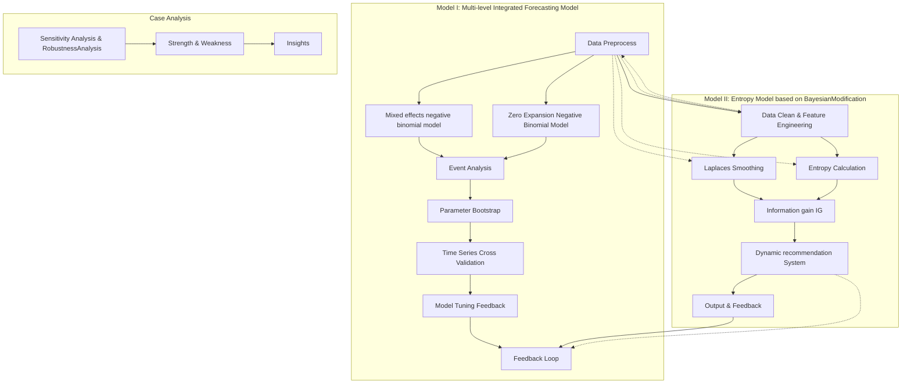

# Unveiling 2028 Glory: Data-Driven Predictions and Strategic Insights via Advanced Statistical Models

Summary

The 2024 Summer Olympics have concluded, yet the memorable moments remain captivating, fueling anticipation for the 2028 Los Angeles Olympics. People are already speculating on the medal counts for various nations in 2028, examining the interplay between countries and sports, exploring in which sports their own country can make progress.

We initiated our analysis with data preprocessing to construct a spatiotemporally coherent dataset. Subsequently, we engineered features leveraging historical data and incorporated variables to account for host advantages and the introduction of new Olympic events. Additionally, during the data processing, a marked shift in medal distribution from 1952 to 1991 prompted the introduction of a Cold War correction factor to refine our model.

We constructed a mixed-effect negative binomial regression model to address the discrete nature of medal counts, effectively capturing country heterogeneity and temporal unpredictability while quantifying the impact of factors like historical performance and host effects. We predicted the 2028 medal table: the United States leads with 42 gold medals(95%CI:[37,46]) and 122 total medals(95%CI:[113,131]), followed by China with 36 gold medals([32,41]) and 91 total medals([83,100]). The 3rd to 5th places are Japan, the United Kingdom and Australia.

A zero-inflated model is developed to predict the probability of zero medals, sharing features with the main model but focusing on competitive countries and identifying potential first-time medal winners. Cyprus, Fiji, and Kuwait are identified as the most likely medal winners with probabilities of 58.2%, 42.1%, and 33.5% respectively.

By employing modular collaboration and structural nesting, we combined these models into a multi-level ensemble model to analyze the regression and progress of each country in 2028. This approach further explores the relationship between countries and sports and identifies advantageous projects for each country. Additionally, we modeled the impact of new events selected by the host country on the 2028 medal table projections.

To solve the challenges of statistical bias and interpretability of coaching effect analysis under small sample conditions, we propose a simplified analysis framework based on Bayesian modified entropy. By introducing the Laplace smoothing technique to reconstruct the probability estimation, the model designs a dual verification mechanism of binary event-driven information gain (IG) and effect intensity ratio to form a closed-loop verification. We suggest that Sweden consider bringing in a great coach for wrestling, Hungary for wrestling, and France for rowing. This might increase the medal counts for Sweden, Hungary, and France by 5-8, 3-5, and 6-10 medals respectively in the next two Olympic Games.

Throughout the modeling process, we also gained insights into various aspects, such as the duality of the host effect and the uncertainty of black swan events, providing reference opinions for the Olympic Committees of various countries.

Keywords: Bayesian entropy analysis, Zero-inflated negative binomial regression, Mixed-effect negative binomial regression, Laplace smoothing, Information gain for quantifying associations, Exponential decay weight design.

# Contents

# 1 Introduction 2

1.1 Problem Background 2  
1.2 Problem Restatement 2  
1.3 Literature Review 3  
1.4 Data Cleaning 3  
1.5 Our Work 4

# 2 Assumptions and Justifications 4

# 3 Notations 5

# 4 Multi-level integrated forecasting model 6

4.1 Mixed effects negative binomial regression model 6  
4.1.1 Model selection background 6  
4.1.2 The establishment of mathematical model 6  
4.1.3 Case Analysis 7  
4.1.4 Predictions for the Results of the 2028 Summer Olympics . . . . . . . 8

# 4.2 Zero expansion negative binomial model (ZINB) 9

4.2.1 Model selection background 9  
4.2.2 The establishment of mathematical model ..... 10  
4.2.3 The result of mathematical model ..... 11

# 4.3 Relationship between the Events and Countries 11

# 4.4 Project Selection and its Impact 12

# 4.5 Sensitivity Analysis 13

4.5.1 Analysis of the Volatility of Country Rankings 13  
4.5.2 Model comparison 13  
4.5.3 Parameter sensitivity analysis 13  
4.5.4 Ablation Study 14

# 5 Entropy model based on Bayesian Modification 14

5.1 Model Selection Background 14  
5.2 The Establishment of the Mathematical Model ..... 15  
5.3 Case Analysis 16  
5.4 The result of the mathematical model ..... 17  
5.5 Sensitivity Analysis 19

# 6 Original Insights 20

6.1 Analysis of "Potential Medal" in Non-Medal-Winning Nations 20  
6.2 The Multiplier Effect of Elite Coaches 20  
6.3 Dual Nature of Host Effect 21  
6.4 The reference value of Cold War factors 22

# 7 Strengths and weaknesses 22

7.1 Strengths 22  
7.2 Weaknesses 22

# 8 Conclusion 23

# A Report on the Use of AI 25

# 1 Introduction

# 1.1 Problem Background

As the preeminent global sporting event, the Olympic Games is not merely a showcase of athletic prowess and achievement; it also serves as a powerful indicator of a nation's sporting capabilities and its broader national strength. During the Games, spectators and stakeholders alike are keenly interested in tracking the medal tally, eager to know how many medals their favorite athletes have secured and how their country is performing overall. While much attention is naturally directed toward the top of the medal table, there is also significant interest in those countries and regions that trail behind. For these nations, securing even a single additional medal represents a significant leap forward.

Figure 1: Awards of some countries in the past 11 Olympic Games  

bar

| Nations | Gold medal | Medal tally |
| --- | --- | --- |
| USA | ~480 | ~1200 |
| CHN | ~300 | ~650 |
| RUS | ~250 | ~750 |
| GER | ~260 | ~800 |
| GBR | ~150 | ~450 |
| AUS | ~120 | ~350 |
| FRA | ~110 | ~300 |
| ITA | ~110 | ~250 |
| JPN | ~110 | ~250 |
| KOR | ~110 | ~200 |
| HUN | ~70 | ~150 |
| NLD | ~60 | ~150 |
| CUB | ~60 | ~150 |
| ROU | ~50 | ~150 |
| CAN | ~40 | ~150 |
| ESP | ~40 | ~100 |

The top 16 in the gold medal table and their total number of medals

bar

| year | Gold medal | Medal tally |
| --- | --- | --- |
| 1980 | 0 | ~5 |
| 1984 | ~83 | ~175 |
| 1988 | ~36 | ~95 |
| 1992 | ~37 | ~110 |
| 1996 | ~44 | ~105 |
| 2000 | ~37 | ~95 |
| 2004 | ~36 | ~105 |
| 2008 | ~36 | ~115 |
| 2012 | ~48 | ~105 |
| 2016 | ~46 | ~120 |
| 2020 | ~39 | ~110 |
| 2024 | ~40 | ~120 |

The performance of the U.S.

bar_line

| year | Gold medal | Medal tally |
| --- | --- | --- |
| 1984 | ~15 | ~32 |
| 1988 | ~6 | ~28 |
| 1992 | ~16 | ~53 |
| 1996 | ~16 | ~49 |
| 2000 | ~28 | ~58 |
| 2004 | ~32 | ~63 |
| 2008 | ~48 | ~100 |
| 2012 | ~39 | ~92 |
| 2016 | ~26 | ~71 |
| 2020 | ~38 | ~91 |
| 2024 | ~40 | ~93 |

The performance of China

Moreover, beyond the focus on medal counts, countries also analyze their performance across various sports to identify areas of untapped potential. Recognizing the overwhelming impact of exceptional coaching, many nations consider strategic investments in top-tier coaches to enhance their athletes' performance and propel them to higher positions in the medal standings.

# 1.2 Problem Restatement

Task 1 : Construct a medal table model that encompasses the medal counts of all participating countries, with a minimum inclusion of gold medals and total medals.

- Forecast the medal results for the 2028 Olympic Games hosted in Los Angeles, USA and identify which countries are likely to experience an increase in their medal tally and which may see a decline.  
- Predict which countries will secure their first Olympic medals in the upcoming Games and estimate the associated probability.  
- Investigate the correlation between Olympic sports and the medal counts of participating countries. Identify which sports are most crucial to specific countries and provide explanations for these trends. Additionally, explore how the selection of events by the organizing committee can impact the competitive outcomes.

Task 2: Evaluate the impact of elite coaching on Olympic medal performance. Identify three countries and recommend specific sports in which they should prioritize investing in top-tier coaching talent. Assess the potential influence of such strategic investments on their medal outcomes.

Task 3 : Reveal the models distinctive perspectives on Olympic medal distribution and

elucidate how these insights can inform decisions for National Olympic Committees.

# 1.3 Literature Review

Recent Olympic medal prediction research has evolved from macro-level analyses to multidimensional modeling, incorporating socioeconomic factors, historical performance, event dynamics, and the influence of elite coaching. Shi et al.(2024) used SHAP method to show that medal predictability varies across sports, with China's table tennis dominance linked to population size, GDP per capita, and historical success. Team-specific effects, likely from elite coaches, contributed over 40% to predictions in sports like Russian gymnastics and Chinese diving. Fei(2013) identified a global sports pattern: Europe dominates in throwing events, the Americas in sprints, Africa in middle- and long-distance running, and Asia in endurance events like racewalking. These regional disparities highlight the need for nuanced predictive models.

Methodologically, Wang(2019) validated the correlation between GDP per capita, host advantages, and historical performance using neural networks and a Cobb-Douglas framework. However, these models are sensitive to transient factors like athlete performance fluctuations. Zhao et al.(2012) improved accuracy by optimizing v-SVR parameters with genetic algorithms and incorporating home advantage adjustments.

The Great Coach Effect Empirical studies on elite coaching are limited, but case analyses suggest its transformative impact. Lang Ping's coaching revitalized Chinese womens volleyball, leading to a gold medal in 2016 after a fifth-place finish in 2012. Béla Károlyis difficulty-first approach in U.S. gymnastics resulted in a 50% medal increase post-1991. Jowetts (2007) 3+1Cs model indicates that coaching can contribute 1020% to performance gains through enhanced team cohesion and leadership. Isolating coaching impacts from other variables requires advanced methods like DID or SHAP decomposition.

In this paper, we develop a novel dual-model framework combining Bayesian entropy-driven coaching effect analysis and mixed-effects zero-inflated negative binomial regression to address critical gaps in Olympic medal prediction. Our approach uniquely integrates Laplace-smoothed information gain to quantify small-sample coaching impacts, time-decayed historical performance with host-country dynamics, and event-specific adaptability to resolve overdispersion and zero-inflation challenges. By synthesizing these innovations, the model advances beyond traditional single-method approaches, offering robust uncertainty quantification through asymmetric bootstrap intervals and actionable insights into strategic resource allocation for Olympic committees.

# 1.4 Data Cleaning

In our analysis of Olympic medal data, several challenges emerged that required careful consideration. One issue was the inconsistency in country names, particularly the transition from the Soviet Union to Russia. We have adopted the convention that Russia(now ROC) inherits the medal count of the Soviet Union, ensuring continuity in dataset.

Additionally, we encountered missing values for countries that did not participate in certain Olympic Games in the data processing process. To address this, we have assigned a medal count of zero for those years, thereby maintaining a comprehensive and uninterrupted dataset for analysis.

There are also some problems related to history. For example, Germany have tow IOC codes (GER and FGR), both of which needed to be counted. Refugee Olympic Team, Independent Olympians, which served as unique bodies of Olympic Games, should be noted when counting the medals, with the first identified as a playing body, the second identified as a part of Russia (now ROC).

# 1.5 Our Work

The flow chart below shows our work's framework visually.

flowchart

Figure 2: Our Work

# 2 Assumptions and Justifications

The following assumptions are made to make the problem easier to handle. Also, they help to make the predicting results more precise.

\- Assumption 1 Data after World War II is important and can serve as a source of prediction for more preciseness. Olympic Games before 1940 had only a small number of countries to participate in. Meanwhile, after World War II, more countries had the accessibility to the Olympic Games. The geopolitical landscape nowadays is largely determined by World War II, despite few changes. For more preciseness and more convenience in counting medals and predicting, we only use the data from the year of 1952 in the given excel file to construct our model. Conclusions could be shown in the Figure 3.

bar

| Year | Countries |
| --- | --- |
| 1924 | 44 |
| 1928 | 46 |
| 1932 | 37 |
| 1936 | 49 |
| 1948 | 59 |
| 1952 | 69 |
| 1956 | 67 |
| 1960 | 83 |

Figure 3: Comparison of the number of participating countries

line

| Year | Raw Medal Count | 5-Year Moving Average |
| --- | --- | --- |
| 1952 | ~112 | ~112 |
| 1956 | ~126 | ~118 |
| 1960 | ~81 | ~106 |
| 1964 | ~150 | ~115 |
| 1968 | ~123 | ~136 |
| 1972 | ~114 | ~121 |
| 1976 | ~142 | ~127 |
| 1980 | ~2 | ~72 |
| 1984 | ~83 | ~45 |
| 1988 | ~131 | ~107 |
| 1992 | ~121 | ~127 |
| 1996 | ~127 | ~127 |
| 2000 | ~114 | ~118 |
| 2004 | ~97 | ~105 |
| 2008 | ~88 | ~95 |
| 2012 | ~140 | ~115 |
| 2016 | ~93 | ~116 |
| 2020 | ~92 | ~95 |
| 2024 | ~134 | ~112 |

Figure 4: Medal Trend Analysis

- Assumption 2 Unquantifiable external factors could be ignored in the process. The impact of sudden factors such as political turmoil and economic crisis on the number of medals can be ignored in the forecast. Focusing on observable variables such as historical medals and the number of events can improve the interpretability of the model.  
- Assumption 3 The historical trend of medal count exhibits temporal autocorrelation. Time series analysis can capture long-term trends in a country's performance. If the data indicates that the medal count of certain countries steadily increases or decreases over time, short-term fluctuations can be ignored to reduce model complexity. It could be captured from Figure 4 that this kind of consistency truly exists.  
- Assumption 4 Excluding uncontrollable factors such as injuries, retirements, etc., the number of participants and events(excluding a few new events) in the 2028 Olympics will be similar to those in the 2024 Olympics. This will help make the prediction of medals for the 2028 Olympics more executable.

3 Notations

<table><tr><td>Symbol</td><td>Description</td></tr><tr><td colspan="2">General Symbols</td></tr><tr><td> $Y_{it}$ </td><td>Medal count (gold  $Y_{it}^{G}$  or total  $Y_{it}^{T}$ ) for country i at the t-th Olympics</td></tr><tr><td> $\lambda$ </td><td>Exponential decay weight for historical data (default  $\lambda = 0.6$ )</td></tr><tr><td>WMAE</td><td>Weighted Mean Absolute Error (weights  $w_{it} = 1/\sqrt{\text{Var}(Y_{it})}$ )</td></tr><tr><td colspan="2">Mixed-Effects Negative Binomial Model</td></tr><tr><td> $\mu_{it}$ </td><td>Expected medal count,  $Y_{it} \sim \text{NB}(\mu_{it}, \alpha)$ </td></tr><tr><td> $\alpha$ </td><td>Overdispersion parameter</td></tr><tr><td> $\beta_1$ </td><td>Historical effect coefficient (constrained positive)</td></tr><tr><td> $\beta_2$ </td><td>Host country effect coefficient</td></tr><tr><td> $\text{ColdWar}_t$ </td><td>Binary variable for Cold War period (1 if 1952–1991)</td></tr><tr><td> $\sigma_u, \sigma_v$ </td><td>Std. dev. of country heterogeneity and time trend random effects</td></tr><tr><td colspan="2">Zero-Inflated Negative Binomial Model (ZINB)</td></tr><tr><td> $\pi_{it}$ </td><td>Probability of country i winning zero medals at the t-th Olympics</td></tr><tr><td> $\text{ProjectMatch}_{it}$ </td><td>Project matching degree (historical medals aligned with current events)</td></tr><tr><td> $\text{Athletes}_{it}^{w}$ </td><td>Weighted participant count (dynamic 3-year window)</td></tr><tr><td colspan="2">Bayesian Entropy Model</td></tr><tr><td> $\Delta M_{c,s,t}$ </td><td>Medal increment for country c in sport s ( $M_{c,s,t} - M_{c,s,t-4}$ )</td></tr><tr><td> $IG$ </td><td>Information Gain ( $H(M) - H(M \mid X)$ )</td></tr><tr><td> $S_{c,s}$ </td><td>Potential score (combines  $IG$  and historical medal gap)</td></tr><tr><td colspan="2">Other Symbols</td></tr><tr><td>SHAP</td><td>Shapley Additive Explanations (model interpretability method)</td></tr><tr><td>DID</td><td>Difference-in-Differences (causal inference method)</td></tr><tr><td>MAE</td><td>Mean Absolute Error (used in ablation studies)</td></tr><tr><td>F1 Score</td><td>Harmonic mean of precision and recall (model performance metric)</td></tr><tr><td>95% CI</td><td>95% Confidence Interval (uncertainty quantification)</td></tr><tr><td>Laplace Smoothing</td><td>Bayesian prior adjustment with parameters  $\alpha, \beta$ </td></tr><tr><td> $\Gamma(\cdot)$ </td><td>Gamma function (used in negative binomial PMF)</td></tr><tr><td> $\theta$ </td><td>Threshold for information gain significance (e.g.,  $\theta = 0.3$ )</td></tr><tr><td> $\mathcal{N}(\mu, \sigma^2)$ </td><td>Normal distribution with mean  $\mu$  and variance  $\sigma^2$ </td></tr></table>

# 4 Multi-level integrated forecasting model

# 4.1 Mixed effects negative binomial regression model

# 4.1.1 Model selection background

The Olympic medal count is characterized by overdispersion, where the variance significantly exceeds the mean. Traditional Poisson regression, which assumes that the variance equals the mean, is not suitable for this scenario. In contrast, negative binomial regression, which incorporates a dispersion parameter, is more appropriate for modeling medal counts. Additionally, mixed-effects models are employed to account for both observable predictors (e.g., historical performance, host advantages) and unobserved heterogeneity (e.g., national resource differences, time-specific events), thereby enhancing the accuracy and robustness of medal predictions.

# 4.1.2 The establishment of mathematical model

First, we deal with response variables and distribution assumptions. Suppose $Y_{it}$ is the number of medals (either gold $Y_{it}^{G}$ or overall $Y_{it}^{T}$ ) won by the country i at the t-th Olympic Games, and suppose $Y_{it}$ follows a negative binomial distribution. Next, we build a linear simulator $\log(\mu_{it})$ . The linear predictor of the model (i.e. the logarithmic expected number of medals) consists of both fixed and random effects. The specific formulas and limiting factors are shown in the Table 1.

In the Olympic medal prediction model, the time decay factor of historical data is used to control the weight of different historical event data on the current prediction. WMAE (Weighted Average Absolute Error) is a key indicator for optimizing $\lambda$ . The following results were obtained through grid search:

$$
\lambda = 0. 4 \quad \Rightarrow \quad \mathrm{WMAE} = 1 2. 3,
$$

$$
\lambda = 0. 6 \quad \Rightarrow \quad \text {WMAE} = 1 1. 8 \quad (\text {Optimal}), \tag {1}
$$

$$
\lambda = 0. 8 \quad \Rightarrow \quad \mathrm{WMAE} = 1 2. 6.
$$

So $\lambda$ is determined as 0.6 in our model.

The ColdWar factor introduces a novel political-historical dimension to Olympic medal predictions by systematically adjusting for ideological competition effects from 1952 to 1991. It quantifies the anomalous medal surplus of state-driven athletic programs (e.g., USSR, GDR) and decouples transient geopolitical biases from long-term sports trends, enhancing model robustness in post-Cold War predictions. Our model shows more preciseness after adding this coefficient. Its contribution could be seen in the sensitivity analysis process.

Table 1: Summary of Formulas for the Mixed Effects Negative Binomial Regression Model

<table><tr><td>Symbol</td><td>Description</td><td>Formula</td></tr><tr><td colspan="3">Response Variable</td></tr><tr><td> $Y_{it}$ </td><td>Medal count for country  $i$  in the  $t$ -th Olympics (gold medals  $Y_{it}^{G}$  or total medals  $Y_{it}^{T}$ )</td><td> $Y_{it} \sim \text{NegativeBinomial}(\mu_{it}, \alpha)$ </td></tr><tr><td> $\mu_{it}$ </td><td>Expected medal count</td><td></td></tr><tr><td> $\alpha$ </td><td>Overdispersion parameter</td><td></td></tr><tr><td> $\log(\mu_{it})$ </td><td>Log of the expected medal count</td><td> $\log(\mu_{it}) = \beta_0 + \beta_1 \text{History}_{it}^{w} + \beta_2 \text{Host}_{it} + \beta_3 \Delta E_t + \beta_4 \text{TimeTrend}_t + \beta_5 \text{ColdWar}_t + u_i + v_t$ </td></tr><tr><td colspan="3">Fixed Effects</td></tr><tr><td> $\beta_0$ </td><td>Global intercept</td><td> $\beta_0 \sim \mathcal{N}(0, 10)$ </td></tr><tr><td> $\beta_1$ </td><td>Historical effect (constrained to be positive)</td><td> $\beta_1 \sim \mathcal{N}(0.8, 0.1)$ </td></tr><tr><td> $\beta_2$ </td><td>Host effect</td><td> $\beta_2 \sim \mathcal{N}(0, 0.1)$ </td></tr><tr><td> $\beta_3$ </td><td>Effect of new events</td><td> $\beta_3 \sim \mathcal{N}(0, 0.1)$ </td></tr><tr><td> $\beta_4$ </td><td>Time trend effect</td><td> $\beta_4 \sim \mathcal{N}(0, 0.1)$ </td></tr><tr><td> $\beta_5$ </td><td>Cold War correction factor</td><td> $\beta_5 \sim \mathcal{N}(0.15, 0.1)$ </td></tr><tr><td colspan="3">Random Effects</td></tr><tr><td> $u_i$ </td><td>Random effect for country heterogeneity</td><td> $u_i \sim \mathcal{N}(0, \sigma_u^2)$ </td></tr><tr><td> $v_t$ </td><td>Random effect for time trend</td><td> $v_t \sim \mathcal{N}(0, \sigma_v^2)$ </td></tr><tr><td> $\sigma_u, \sigma_v$ </td><td>Prior distribution for standard deviations of country heterogeneity and time trend random effects</td><td> $\sigma_u, \sigma_v \sim \text{HalfNormal}(1)$ </td></tr><tr><td colspan="3">Covariates</td></tr><tr><td> $History_{it}^{w}$ </td><td>Time-weighted mean of the medal counts in the last 5 Olympics for country  $i$ </td><td> $History_{it}^{w} = \frac{\sum_{k=1}^{5} e^{-\lambda(k-1)} Y_{i,t-4k}}{\sum_{k=1}^{5} e^{-\lambda(k-1)}}, \lambda = 0.6$ </td></tr><tr><td> $Host_{it}$ </td><td>Binary variable indicating whether country  $i$  is the host of the  $t$ -th Olympics</td><td> $Host_{it} = 1 \quad i$  is the host of the  $t$ th Olympics &lt; 0 otherwise</td></tr><tr><td> $\Delta E_t$ </td><td>Number of new events in the  $t$ -th Olympics</td><td> $\Delta E_t = E_t - E_{t-4}$ </td></tr><tr><td> $TimeTrend_t$ </td><td>Standardized year  $t$  to the interval [0, 1]</td><td> $TimeTrend_t = \frac{t - t_{\min}}{t_{\max} - t_{\min}}, t_{\min} = 1952, t_{\max} = 2024$ </td></tr><tr><td> $ColdWar_t$ </td><td>Variable indicating whether the  $t$ -th Olympics occurred during the Cold War</td><td> $ColdWar_t = \begin{cases} 1 & \text{if } t \in [1952, 1991] \\ 0 & \text{otherwise} \end{cases}$ </td></tr><tr><td colspan="3">Evaluation Metrics</td></tr><tr><td>WMAE</td><td>Weighted Mean Absolute Error</td><td> $WMAE = \frac{1}{\sum w_{it}} \sum w_{it} |Y_{it} - \hat{Y}_{it}|, w_{it} = \frac{1}{\sqrt{\text{Var}(\hat{Y}_{it})}}$ </td></tr></table>

# 4.1.3 Case Analysis

We trained the model using historical data spanning from 1952 to 2008. Based on these insights, we predicted the medal winners of selected countries in the four Olympic Games held between 2012 and 2024.

The Figure 5 clearly illustrates that the dashed line corresponds to the ideal prediction trajectory, and the majority of the data points are tightly clustered around this line, which underscores the model's reliability in forecasting outcomes. Additionally, the length of the box in the Figure 6 serves as a visual indicator of prediction accuracy. The close alignment

of the mean and median values suggests that the data set's central tendency aligns well with our assumption of a normal distribution.

scatter

| Country | Actual Gold Medals | Predicted Gold Medals |
| --- | --- | --- |
| USA | ~49 | ~49 |
| USA | ~49 | ~47 |
| CHN | ~45 | ~45 |
| CHN | ~40 | ~44 |
| GBR | ~33 | ~34 |
| GBR | ~31 | ~31 |
| GBR | ~29 | ~26 |
| GBR | ~25 | ~23 |
| GBR | ~23 | ~18 |
| ITA | ~18 | ~22 |
| ITA | ~17 | ~21 |
| ITA | ~17 | ~20 |
| ITA | ~16 | ~19 |
| ITA | ~15 | ~17 |
| NED | ~18 | ~18 |
| NED | ~17 | ~17 |
| NED | ~16 | ~16 |
| NED | ~15 | ~15 |
| NED | ~14 | ~14 |
| NED | ~13 | ~13 |
| NED | ~12 | ~12 |
| NED | ~11 | ~11 |
| NED | ~10 | ~10 |
| NED | ~9 | ~9 |
| NED | ~8 | ~8 |
| NED | ~7 | ~7 |
| NED | ~6 | ~6 |
| NED | ~5 | ~5 |
| NED | ~4 | ~4 |
| NED | ~3 | ~3 |
| NED | ~2 | ~2 |
| NED | ~1 | ~1 |
| NED | ~0 | ~0 |
| JAM | ~18 | ~17 |
| JAM | ~17 | ~16 |
| JAM | ~16 | ~15 |
| JAM | ~15 | ~14 |
| JAM | ~14 | ~13 |
| JAM | ~13 | ~12 |
| JAM | ~12 | ~11 |
| JAM | ~11 | ~10 |
| JAM | ~10 | ~9 |
| JAM | ~9 | ~8 |
| JAM | ~8 | ~7 |
| JAM | ~7 | ~6 |
| JAM | ~6 | ~5 |
| JAM | ~5 | ~4 |
| JAM | ~4 | ~3 |
| JAM | ~3 | ~2 |
| JAM | ~2 | ~1 |
| JAM | ~1 | ~0 |
| JAM | ~0 | ~0 |
| JAM | ~0 | ~0 |
| JAM | ~0 | ~0 |
| JAM | ~0 | ~0 |
| JAM | ~0 | ~0 |
| JAM | ~0 | ~0 |
| JAM | ~0 | ~0 |
| JAM | ~0 | ~0 |
| JAM | ~0 | ~0 |
| JAM | ~0 | ~0 |
| JAM | ~0 | ~0 |
| JAM | ~0 | ~0 |
| JAM | ~0 | ~0 |
| JAM | ~0 | ~0 |
| JAM | ~0 | ~0 |
| JAM | ~0 | ~0 |
| JAM | ~0 | ~0 |
| JAM | ~0 | ~0 |
| JAM | ~0 | ~0 |
| JAM | ~0 | ~0 |
| JAM | ~0 | ~0 |
| JAM | ~0 | ~0 |
| JAM | ~0 | ~0 |
| JAM | ~0 | ~0 |
| JAM | ~0 | ~0 |
| JAM | ~0 | ~0 |
| JAM | ~0 | ~0 |
| JAM | ~0 | ~0 |
| JAM | ~0 | ~0 |
| JAM | ~0 | ~0 |
| JAM | ~0 | ~0 |
| JAM | ~0 | ~0 |
| JAM | ~0 | ~0 |
| JAM | ~0 | ~0 |
| JAM | ~0 | ~0 |
| JAM | ~0 | ~0 |
| JAM | ~0 | ~0 |
| JAM | ~0 | ~0 |
| JAM | ~0 | ~0 |
| JAM | ~0 | ~0 |
| JAM | ~0 | ~0 |
| JAM | ~0 | ~0 |
| JAM | ~0 | ~0 |
| JAM | ~0 | ~0 |
| JAM | ~0 | ~0 |
| JAM | ~0 | ~0 |
| JAM | ~0 | ~0 |
| JAM | ~0 | ~0 |
| JAM | ~0 | ~0 |
| JAM | ~0 | ~0 |
| JAM | ~0 | ~0 |
| JAM | ~0 | ~0 |
| JAM | ~0 | ~0 |
| JAM | ~0 | ~0 |
| JAM | ~0 | ~0 |
| JAM | ~0 | ~0 |
| JAM | ~0 | ~0 |
| JAM | ~0 | ~0 |
| JAM | ~0 | ~0 |
| JAM | ~0 | ~0 |
| JAM | ~0 | ~0 |
| JAM | ~0 | ~0 |
| JAM | ~0 | ~0 |
| JAM | ~0 | ~0 |
| JAM | ~0 | ~0 |
| JAM | ~0 | ~0 |
| JAM | ~0 | ~0 |
| JAM | ~0 | ~0 |
| JAM | ~0 | ~0 |
| JAM | ~0 | ~0 |
| JAM | ~0 | ~0 |
| JAM | ~0 | ~0 |
| JAM | ~0 | ~0 |
| JAM | ~0 | ~0 |
| JAM | ~0 | ~0 |
| JAM | ~0 | ~0 |
| JAM | ~0 | ~0 |
| JAM | ~0 | ~0 |
| JAM | ~0 | ~0 |
| JAM | ~0 | ~0 |
| JAM | ~0 | ~0 |
| JAM | ~0 | ~0 |
| JAM | ~0 | ~0 |
| JAM | ~0 | ~0 |
| JAM | ~0 | ~0 |
| JAM | ~0 | ~0 |
| JAM | ~0 | ~0 |
| JAM | ~0 | ~0 |
| JAM | ~0 | ~0 |
| JAM | ~0 | ~0 |
| JAM | ~0 | ~0 |
| JAM | ~0 | ~0 |
| JAM | ~0 | ~0 |
| JAM | ~0 | ~0 |
| JAM | ~0 | ~0 |
| JAM | ~0 | ~0 |
| JAM | ~0 | ~0 |
| JAM | ~0 | ~0 |
| JAM | ~0 | ~0 |
| JAM | ~0 | ~0 |
| JAM | ~0 | ~0 |
| JAM | ~0 | ~0 |
| JAM | ~0 | ~0 |
| JAM | ~0 | ~0 |
| JAM | ~0 | ~0 |
| JAM | ~0 | ~0 |
| JAM | ~0 | ~0 |
| JAM | ~0 | ~0 |
| JAM | ~0 | ~0 |
| JAM | ~0 | ~0 |
| JAM | ~0 | ~0 |
| JAM | ~0 | ~0 |
| JAM | ~0 | ~0 |
| JAM | ~0 | ~0 |
| JAM | ~0 | ~0 |
| JAM | ~0 | ~0 |
| JAM | ~0 | ~0 |
| JAM | ~0 | ~0 |
| JAM | ~0 | ~0 |
| JAM | ~0 | ~0 |
| JAM | ~0 | ~0 |
| JAM | ~0 | ~0 |
| JAM | ~0 | ~0 |
| JAM | ~0 | ~0 |
| JAM | ~0 | ~0 |
| JAM | ~0 | ~0 |
| JAM | ~0 | ~0 |
| JAM | ~0 | ~0 |
| JAM | ~0 | ~0 |
| JAM | ~0 | ~0 |
| JAM | ~0 | ~0 |
| JAM | ~0 | ~0 |
| JAM | ~0 | ~0 |
| JAM | ~0 | ~0 |
| JAM | ~0 | ~0 |
| JAM | ~0 | ~0 |
| JAM | ~0 | ~0 |
| JAM | ~0 | ~0 |
| JAM | ~0 | ~0 |
| JAM | ~0 | ~0 |
| JAM | ~0 | ~0 |
| JAM | ~0 | ~0 |
| JAM | ~0 | ~0 |
| JAM | ~0 | ~0 |
| JAM | ~0 | ~0 |
| JAM | ~0 | ~0 |
| JAM | ~0 | ~0 |
| JAM | ~0 | ~0 |
| JAM | ~0 | ~0 |
| JAM | ~0 | ~0 |
| JAM | ~0 | ~0 |
| JAM | ~0 | ~0 |
| JAM | ~0 | ~0 |
| JAM | ~0 | ~0 |
| JAM | ~0 | ~0 |
| JAM | ~0 | ~0 |
| JAM | ~0 | ~0 |
| JAM | ~0 | ~0 |
| JAM | ~0 | ~0 |
| JAM | ~0 | ~0 |
| JAM | ~0 | ~0 |
| JAM | ~0 | ~0 |
| JAM | ~0 | ~0 |
| JAM | ~0 | ~0 |
| JAM | ~0 | ~0 |
| JAM | ~0 | ~0 |
| JAM | ~0 | ~0 |
| JAM | ~0 | ~0 |
| JAM | ~0 | ~0 |
| JAM | ~0 | ~0 |
| JAM | ~0 | ~0 |
| JAM | ~0 | ~0 |
| JAM | ~0 | ~0 |
| JAM | ~0 | ~0 |
| JAM | ~0 | ~0 |
| JAM | ~0 | ~0 |
| JAM | ~0 | ~0 |
| JAM | ~0 | ~0 |
| JAM | ~0 | ~0 |
| JAM | ~0 | ~0 |
| JAM | ~0 | ~0 |
| JAM | ~0 | ~0 |
| JAM | ~0 | ~0 |
| JAM | ~0 | ~0 |
| JAM | ~0 | ~0 |
| JAM | ~0 | ~0 |
| JAM | ~0 | ~0 |
| JAM | ~0 | ~0 |
| JAM | ~0 | ~0 |
| JAM | ~0 | ~0 |
| JAM | ~0 | ~0 |
| JAM | ~0 | ~0 |
| JAM | ~0 | ~0 |
| JAM | ~0 | ~0 |
| JAM | ~0 | ~0 |
| JAM | ~0 | ~0 |
| JAM | ~0 | ~0 |
| JAM | ~0 | ~0 |
| JAM | ~0 | ~0 |
| JAM | ~0 | ~0 |
| JAM | ~0 | ~0 |
| JAM | ~0 | ~0 |
| JAM | ~0 | ~0 |
| JAM | ~0 | ~0 |
| JAM | ~0 | ~0 |
| JAM | ~0 | ~0 |
| JAM | ~0 | ~0 |
| JAM | ~0 | ~0 |
| JAM | ~0 | ~0 |
| JAM | ~0 | ~0 |
| JAM | ~0 | ~0 |
| JAM | ~0 | ~0 |
| JAM | ~0 | ~0 |
| JAM | ~0 | ~0 |
| JAM | ~0 | ~0 |
| JAM | ~0 | ~0 |
| JAM | ~0 | ~0 |
| JAM | ~0 | ~0 |
| JAM | ~0 | ~0 |
| JAM | ~0 | ~0 |
| JAM | ~0 | ~0 |
| JAM | ~0 | ~0 |
| JAM | ~0 | ~0 |
| JAM | ~0 | ~0 |
| JAM | ~0 | ~0 |
| JAM | ~0 | ~0 |
| JAM | ~0 | ~0 |
| JAM | ~0 | ~0 |
| JAM | ~0 | ~0 |
| JAM | ~0 | ~0 |
| JAM | ~0 | ~0 |
| JAM | ~0 | ~0 |
| JAM | ~0 | ~0 |
| JAM | ~0 | ~0 |
| JAM | ~0 | ~0 |
| JAM | ~0 | ~0 |
| JAM | ~0 | ~0 |
| JAM | ~0 | ~0 |
| JAM | ~0 | ~0 |
| JAM | ~0 | ~0 |
| JAM | ~0 | ~0 |
| JAM | ~0 | ~0 |
| JAM | ~0 | ~0 |
| JAM | ~0 | ~0 |
| JAM | ~0 | ~0 |
| JAM | ~0 | ~0 |
| JAM | ~0 | ~0 |
| JAM | ~0 | ~0 |
| JAM | ~0 | ~0 |
| JAM | ~0 | ~0 |
| JAM | ~0 | ~0 |
| JAM | ~0 | ~0 |
| JAM | ~0 | ~0 |
| JAM | ~0 | ~0 |
| JAM | ~0 | ~0 |
| JAM | ~0 | ~0 |
| JAM | ~0 | ~0 |
| JAM | ~0 | ~0 |
| JAM | ~0 | ~0 |
| JAM | ~0 | ~0 |
| JAM | ~0 | ~0 |
| JAM | ~0 | ~0 |
| JAM | ~0 | ~0 |
| JAM | ~0 | ~0 |
| JAM | ~0 | ~0 |
| JAM | ~0 | ~0 |
| JAM | ~0 | ~0 |
| JAM | ~0 | ~0 |
| JAM | ~0 | ~0 |
| JAM | ~0 | ~0 |
| JAM | ~0 | ~0 |
| JAM | ~0 | ~0 |
| JAM | ~0 | ~0 |
| JAM | ~0 | ~0 |
| JAM | ~0 | ~0 |
| JAM | ~0 | ~0 |
| JAM | ~0 | ~0 |
| JAM | ~0 | ~0 |
| JAM | ~0 | ~0 |
| JAM | ~0 | ~0 |
| JAM | ~0 | ~0 |
| JAM | ~0 | ~0 |
| JAM | ~0 | ~0 |
| JAM | ~0 | ~0 |
| JAM | ~0 | ~0 |
| JAM | ~0 | ~0 |
| JAM | ~0 | ~0 |
| JAM | ~0 | ~0 |
| JAM | ~0 | ~0 |
| JAM | ~0 | ~0 |
| JAM | ~0 | ~0 |
| JAM | ~0 | ~0 |
| JAM | ~0 | ~0 |
| JAM | ~0 | ~0 |
| JAM | ~0 | ~0 |
| JAM | ~0 | ~0 |
| JAM | ~0 | ~0 |
| JAM | ~0 | ~0 |
| JAM | ~0 | ~0 |
| JAM | ~0 | ~0 |
| JAM | ~0 | ~0 |
| JAM | ~0 | ~0 |
| JAM | ~0 | ~0 |
| JAM | ~0 | ~0 |
| JAM | ~0 | ~0 |
| JAM | ~0 | ~0 |
| JAM | ~0 | ~0 |
| JAM | ~0 | ~0 |
| JAM | ~0 | ~0 |
| JAM | ~0 | ~0 |
| JAM | ~0 | ~0 |
| JAM | ~0 | ~0 |
| JAM | ~0 | ~0 |
| JAM | ~0 | ~0 |
| JAM | ~0 | ~0 |
| JAM | ~0 | ~0 |
| JAM | ~0 | ~0 |
| JAM | ~0 | ~0 |
| JAM | ~0 | ~0 |
| JAM | ~0 | ~0 |
| JAM | ~0 | ~0 |
| JAM | ~0 | ~0 |
| JAM | ~0 | ~0 |
| JAM | ~0 | ~0 |
| JAM | ~0 | ~0 |
| JAM | ~0 | ~0 |
| JAM | ~0 | ~0 |
| JAM | ~0 | ~0 |
| JAM | ~0 | ~0 |
| JAM | ~0 | ~0 |
| JAM | ~0 | ~0 |
| JAM | ~0 | ~0 |
| JAM | ~0 | ~0 |
| JAM | ~0 | ~0 |
| JAM | ~0 | ~0 |
| JAM | ~0 | ~0 |
| JAM | ~0 | ~0 |
| JAM | ~0 | ~0 |
| JAM | ~0 | ~0 |
| JAM | ~0 | ~0 |
| JAM | ~0 | ~0 |
| JAM | ~0 | ~0 |
| JAM | ~0 | ~0 |
| JAM | ~0 | ~0 |
| JAM | ~0 | ~0 |
| JAM | ~0 | ~0 |
| JAM | ~0 | ~0 |
| JAM | ~0 | ~0 |
| JAM | ~0 | ~0 |
| JAM | ~0 | ~0 |
| JAM | ~0 | ~0 |
| JAM | ~0 | ~0 |
| JAM | ~0 | ~0 |
| JAM | ~0 | ~0 |
| JAM | ~0 | ~0 |
| JAM | ~0 | ~0 |
| JAM | ~0 | ~0 |
| JAM | ~0 | ~0 |
| JAM | ~0 | ~0 |
| JAM | ~0 | ~0 |
| JAM | ~0 | ~0 |
| JAM | ~0 | ~0 |
| JAM | ~0 | ~0 |
| JAM | ~0 | ~0 |
| JAM | ~0 | ~0 |
| JAM | ~0 | ~0 |
| JAM | ~0 | ~0 |
| JAM | ~0 | ~0 |
| JAM | ~0 | ~0 |
| JAM | ~0 | ~0 |
| JAM | ~0 | ~0 |
| JAM | ~0 | ~0 |
| JAM | ~0 | ~0 |
| JAM | ~0 | ~0 |
| JAM | ~0 | ~0 |
| JAM | ~0 | ~0 |
| JAM | ~0 | ~0 |
| JAM | ~0 | ~0 |
| JAM | ~0 | ~0 |
| JAM | ~0 | ~0 |
| JAM | ~0 | ~0 |
| JAM | ~0 | ~0 |
| JAM | ~0 | ~0 |
| JAM | ~0 | ~0 |
| JAM | ~0 | ~0 |
| JAM | ~0 | ~0 |
| JAM | ~0 | ~0 |
| JAM | ~0 | ~0 |
| JAM | ~0 | ~0 |
| JAM | ~0 | ~0 |
| JAM | ~0 | ~0 |
| JAM | ~0 | ~0 |
| JAM | ~0 | ~0 |
| JAM | ~0 | ~0 |
| JAM | ~0 | ~0 |
| JAM | ~0 | ~0 |
| JAM | ~0 | ~0 |
| JAM | ~0 | ~0 |
| JAM | ~0 | ~0 |
| JAM | ~0 | ~0 |
| JAM | ~0 | ~0 |
| JAM | ~0 | ~0 |
| JAM | ~0 | ~0 |
| JAM | ~0 | ~0 |
| JAM | ~0 | ~0 |
| JAM | ~0 | ~0 |
| JAM | ~0 | ~0 |
| JAM | ~0 | ~0 |
| JAM | ~0 | ~0 |
| JAM | ~0 | ~0 |
| JAM | ~0 | ~0 |
| JAM | ~0 | ~0 |
| JAM | ~0 | ~0 |
| JAM | ~0 | ~0 |
| JAM | ~0 | ~0 |
| JAM | ~0 | ~0 |
| JAM | ~0 | ~0 |
| JAM | ~0 | ~0 |
| JAM | ~0 | ~0 |
| JAM | ~0 | ~0 |
| JAM | ~0 | ~0 |
| JAM | ~0 | ~0 |
| JAM | ~0 | ~0 |
| JAM | ~0 | ~0 |
| JAM | ~0 | ~0 |
| JAM | ~0 | ~0 |
| JAM | ~0 | ~0 |
| JAM | ~0 | ~0 |
| JAM | ~0 | ~0 |
| JAM | ~0 | ~0 |
| JAM | ~0 | ~0 |
| JAM | ~0 | ~0 |
| JAM | ~0 | ~0 |
| JAM | ~0 | ~0 |
| JAM | ~0 | ~0 |
| JAM | ~0 | ~0 |
| JAM | ~0 | ~0 |
| JAM | ~0 | ~0 |
| JAM | ~0 | ~0 |
| JAM | ~0 | ~0 |
| JAM | ~0 | ~0 |
| JAM | ~0 | ~0 |
| JAM | ~0 | ~0 |
| JAM | ~0 | ~0 |
| JAM | ~0 | ~0 |
| JAM | ~0 | ~0 |
| JAM | ~0 | ~0 |
| JAM | ~0 | ~0 |
| JAM | ~0 | ~0 |
| JAM | ~0 | ~0 |
| JAM | ~0 | ~0 |
| JAM | ~0 | ~0 |
| JAM | ~0 | ~0 |
| JAM | ~0 | ~0 |
| JAM | ~0 | ~0 |
| JAM | ~0 | ~0 |
| JAM | ~0 | ~0 |
| JAM | ~0 | ~0 |
| JAM | ~0 | ~0 |
| JAM | ~0 | ~0 |
| JAM | ~0 | ~0 |
| JAM | ~0 | ~0 |
| JAM | ~0 | ~0 |
| JAM | ~0 | ~0 |
| JAM | ~0 | ~0 |
| JAM | ~0 | ~0 |
| JAM | ~0 | ~0 |
| JAM | ~0 | ~0 |
| JAM | ~0 | ~0 |
| JAM | ~0 | ~0 |
| JAM | ~0 | ~0 |
| JAM | ~0 | ~0 |
| JAM | ~0 | ~0 |
| JAM | ~0 | ~0 |
| JAM | ~0 | ~0 |
| JAM | ~0 | ~0 |
| JAM | ~0 | ~0 |
| JAM | ~0 | ~0 |
| JAM | ~0 | ~0 |
| JAM | ~0 | ~0 |
| JAM | ~0 | ~0 |
| JAM | ~0 | ~0 |
| JAM | ~0 | ~0 |
| JAM | ~0 | ~0 |
| JAM | ~0 | ~0 |
| JAM | ~0 | ~0 |
| JAM | ~0 | ~0 |
| JAM | ~0 | ~0 |
| JAM | ~0 | ~0 |
| JAM | ~0 | ~0 |
| JAM | ~0 | ~0 |
| JAM | ~0 | ~0 |
| JAM | ~0 | ~0 |
| JAM | ~0 | ~0 |
| JAM | ~0 | ~0 |
| JAM | ~0 | ~0 |
| JAM | ~0 | ~0 |
| JAM | ~0 | ~0 |
| JAM | ~0 | ~0 |
| JAM | ~0 | ~0 |
| JAM | ~0 | ~0 |
| JAM | ~0 | ~0 |
| JAM | ~0 | ~0 |
| JAM | ~0 | ~0 |
| JAM | ~0 | ~0 |
| JAM | ~0 | ~0 |
| JAM | ~0 | ~0 |
| JAM | ~0 | ~0 |
| JAM | ~0 | ~0 |
| JAM | ~0 | ~0 |
| JAM | ~0 | ~0 |
| JAM | ~0 | ~0 |
| JAM | ~0 | ~0 |
| JAM | ~0 | ~0 |
| JAM | ~0 | ~0 |
| JAM | ~0 | ~0 |
| JAM | ~0 | ~0 |
| JAM | ~0 | ~0 |
| JAM | ~0 | ~0 |
| JAM | ~0 | ~0 |
| JAM | ~0 | ~0 |
| JAM | ~0 | ~0 |
| JAM | ~0 | ~0 |
| JAM | ~0 | ~0 |
| JAM | ~0 | ~0 |
| JAM | ~0 | ~0 |
| JAM | ~0 | ~0 |
| JAM | ~0 | ~0 |
| JAM | ~0 | ~0 |
| JAM | ~0 | ~0 |
| JAM | ~0 | ~0 |
| JAM | ~0 | ~0 |
| JAM | ~0 | ~0 |
| JAM | ~0 | ~0 |
| JAM | ~0 | ~0 |
| JAM | ~0 | ~0 |
| JAM | ~0 | ~0 |
| JAM | ~0 | ~0 |
| JAM | ~0 | ~0 |
| JAM | ~0 | ~0 |
| JAM | ~0 | ~0 |
| JAM | ~0 | ~0 |
| JAM | ~0 | ~0 |
| JAM | ~0 | ~0 |
| JAM | ~0 | ~0 |
| JAM | ~0 | ~0 |
| JAM | ~0 | ~0 |
| JAM | ~0 | ~0 |
| JAM | ~0 | ~0 |
| JAM | ~0 | ~0 |
| JAM | ~0 | ~0 |
| JAM | ~0 | ~0 |
| JAM | ~0 | ~0 |
| JAM | ~0 | ~0 |
| JAM | ~0 | ~0 |
| JAM | ~0 | ~0 |
| JAM | ~0 | ~0 |
| JAM | ~0 | ~0 |
| JAM | ~0 | ~0 |
| JAM | ~0 | ~0 |
| JAM | ~0 | ~0 |
| JAM | ~0 | ~0 |
| JAM | ~0 | ~0 |
| JAM | ~0 | ~0 |
| JAM | ~0 | ~0 |
| JAM | ~0 | ~0 |
| JAM | ~0 | ~0 |
| JAM | ~0 | ~0 |
| JAM | ~0 | ~0 |
| JAM | ~0 | ~0 |
| JAM | ~0 | ~0 |
| JAM | ~0 | ~0 |
| JAM | ~0 | ~0 |
| JAM | ~0 | ~0 |
| JAM | ~0 | ~0 |
| JAM | ~0 | ~0 |
| JAM | ~0 | ~0 |
| JAM | ~0 | ~0 |
| JAM | ~0 | ~0 |
| JAM | ~0 | ~0 |
| JAM | ~0 | ~0 |
| JAM | ~0 | ~0 |
| JAM | ~0 | ~0 |
| JAM | ~0 | ~0 |
| JAM | ~0 | ~0 |
| JAM | ~0 | ~0 |
| JAM | ~0 | ~0 |
| JAM | ~0 | ~0 |
| JAM | ~0 | ~0 |
| JAM | ~0 | ~0 |
| JAM | ~0 | ~0 |
| JAM | ~0 | ~0 |
| JAM | ~0 | ~0 |
| JAM | ~0 | ~0 |
| JAM | ~0 | ~0 |
| JAM | ~0 | ~0 |
| JAM | ~0 | ~0 |
| JAM | ~0 | ~0 |
| JAM | ~0 | ~0 |
| JAM | ~0 | ~0 |
| JAM | ~0 | ~0 |
| JAM | ~0 | ~0 |
| JAM | ~0 | ~0 |
| JAM | ~0 | ~0 |
| JAM | ~0 | ~0 |
| JAM | ~0 | ~0 |
| JAM | ~0 | ~0 |
| JAM | ~0 | ~0 |
| JAM | ~0 | ~0 |
| JAM | ~0 | ~0 |
| JAM | ~0 | ~0 |
| JAM | ~0 | ~0 |
| JAM | ~0 | ~0 |
| JAM | ~0 | ~0 |
| JAM | ~0 | ~0 |
| JAM | ~0 | ~0 |
| JAM | ~0 | ~0 |
| JAM | ~0 | ~0 |
| JAM | ~0 | ~0 |
| JAM | ~0 | ~0 |
| JAM | ~0 | ~0 |
| JAM | ~0 | ~0 |
| JAM | ~0 | ~0 |
| JAM | ~0 | ~0 |
| JAM | ~0 | ~0 |
| JAM | ~0 | ~0 |
| JAM | ~0 | ~0 |
| JAM | ~0 | ~0 |
| JAM | ~0 | ~0 |
| JAM | ~0 | ~0 |
| JAM | ~0 | ~0 |
| JAM | ~0 | ~0 |
| JAM | ~0 | ~0 |
| JAM | ~0 | ~0 |
| JAM | ~0 | ~0 |
| JAM | ~0 | ~0 |
| JAM | ~0 | ~0 |
| JAM | ~0 | ~0 |
| JAM | ~0 | ~0 |
| JAM | ~0 | ~0 |
| JAM | ~0 | ~0 |
| JAM | ~0 | ~0 |
| JAM | ~0 | ~0 |
| JAM | ~0 | ~0 |
| JAM | ~0 | ~0 |
| JAM | ~0 | ~0 |
| JAM | ~0 | ~0 |
| JAM | ~0 | ~0 |
| JAM | ~0 | ~0 |
| JAM | ~0 | ~0 |
| JAM | ~0 | ~0 |
| JAM | ~0 | ~0 |
| JAM | ~0 | ~0 |
| JAM | ~0 | ~0 |
| JAM | ~0 | ~0 |
| JAM | ~0 | ~0 |
| JAM | ~0 | ~0 |
| JAM | ~0 | ~0 |
| JAM | ~0 | ~0 |
| JAM | ~0 | ~0 |
| JAM | ~0 | ~0 |
| JAM | ~0 | ~0 |
| JAM | ~0 | ~0 |
| JAM | ~0 | ~0 |
| JAM | ~0 | ~0 |
| JAM | ~0 | ~0 |
| JAM | ~0 | ~0 |
| JAM | ~0 | ~0 |
| JAM | ~0 | ~0 |
| JAM | ~0 | ~0 |
| JAM | ~0 | ~0 |
| JAM | ~0 | ~0 |
| JAM | ~0 | ~0 |
| JAM | ~0 | ~0 |
| JAM | ~0 | ~0 |
| JAM | ~0 | ~0 |
| JAM | ~0 | ~0 |
| JAM | ~0 | ~0 |
| JAM | ~0 | ~0 |
| JAM | ~0 | ~0 |
| JAM | ~0 | ~0 |
| JAM | ~0 | ~0 |
| JAM | ~0 | ~0 |
| JAM | ~0 | ~0 |
| JAM | ~0 | ~0 |
| JAM | ~0 | ~0 |
| JAM | ~0 | ~0 |
| JAM | ~0 | ~0 |
| JAM | ~0 | ~0 |
| JAM | ~0 | ~0 |
| JAM | ~0 | ~0 |
| JAM | ~0 | ~0 |
| JAM | ~0 | ~0 |
| JAM | ~0 | ~0 |
| JAM | ~0 | ~0 |
| JAM | ~0 | ~0 |
| JAM | ~0 | ~0 |
| JAM | ~0 | ~0 |
| JAM | ~0 | ~0 |
| JAM | ~0 | ~0 |
| JAM | ~0 | ~0 |
| JAM | ~0 | ~0 |
| JAM | ~0 | ~0 |
| JAM | ~0 | ~0 |
| JAM | ~0 | ~0 |
| JAM | ~0 | ~0 |
| JAM | ~0 | ~0 |
| JAM | ~0 | ~0 |
| JAM | ~0 | ~0 |
| JAM | ~0 | ~0 |
| JAM | ~0 | ~0 |
| JAM | ~0 | ~0 |
| JAM | ~0 | ~0 |
| JAM | ~0 | ~0 |
| JAM | ~0 | ~0 |
| JAM | ~0 | ~0 |
| JAM | ~0 | ~0 |
| JAM | ~0 | ~0 |
| JAM | ~0 | ~0 |
| JAM | ~0 | ~0 |
| JAM | ~0 | ~0 |
| JAM | ~0 | ~0 |
| JAM | ~0 | ~0 |
| JAM | ~0 | ~0 |
| JAM | ~0 | ~0 |
| JAM | ~0 | ~0 |
| JAM | ~0 | ~0 |
| JAM | ~0 | ~0 |
| JAM | ~0 | ~0 |
| JAM | ~0 | ~0 |
| JAM | ~0 | ~0 |
| JAM | ~0 | ~0 |
| JAM | ~0 | ~0 |
| JAM | ~0 | ~0 |
| JAM | ~0 | ~0 |
| JAM | ~0 | ~0 |
| JAM | ~0 | ~0 |
| JAM | ~0 | ~0 |
| JAM | ~0 | ~0 |
| JAM | ~0 | ~0 |
| JAM | ~0 | ~0 |
| JAM | ~0 | ~0 |
| JAM | ~0 | ~0 |
| JAM | ~0 | ~0 |
| JAM | ~0 | ~0 |
| JAM | ~0 | ~0 |
| JAM | ~0 | ~0 |
| JAM | ~0 | ~0 |
| JAM | ~0 | ~0 |
| JAM | ~0 | ~0 |
| JAM | ~0 | ~0 |

Figure 5: Prediction vs. Actual

boxplot

| Participating Nations | Q1 | Q2 (Median) | Q3 | Mean |
| --- | --- | --- | --- | --- |
| USA | ~43.5 | ~48 | ~49 | ~45 |
| CHN | ~42 | ~44 | ~46 | — |
| GBR | ~24 | ~28 | ~31.5 | — |
| JPN | ~23.5 | ~25 | ~26.5 | ~26 |
| GER | ~25 | ~28 | ~29.5 | — |
| FRA | ~13 | ~16 | ~17.5 | — |
| AUS | ~20 | ~21 | ~21.5 | — |
| ITA | ~14 | ~16 | ~19 | — |
| NED | ~15 | ~16.5 | ~17.5 | — |
| BRA | ~16 | ~16.5 | ~17 | ~16 |
| RUS | ~15 | ~16 | ~18 | — |
| KOR | ~6 | ~8 | ~10 | — |
| CAN | ~10 | ~12 | ~13.5 | — |
| CUB | ~9.5 | ~10 | ~10.5 | — |
| JAM | ~11 | ~12 | ~13.5 | — |

Figure 6: Gold Medal Prediction Analysis

# 4.1.4 Predictions for the Results of the 2028 Summer Olympics

The projected outcomes of the 2028 Summer Olympics, as generated by our model, are depicted in the Figure 7. (Here we specifically concentrate on the predictions for the top 15 gold medal winners.) Additionally, We will also provide the award-winning situations of about the top 30% of countries in the Table 2.

Figure 7: The predictions for the top 15 gold medal winners and their total medal counts.  

bar

| Nations | Gold Prediction |
| --- | --- |
| USA | 37, 46 |
| CHN | 32, 41 |
| JPN | 15, 24 |
| GBR | 15, 24 |
| AUS | 12, 21 |
| FRA | 10, 20 |
| ROC | 8, 17 |
| GER | 8, 17 |
| ITA | 7, 16 |
| NLD | 8, 17 |
| KOR | 6, 15 |
| CAN | 4, 13 |
| NZL | 4, 13 |
| HUN | 2, 11 |
| UZB | 1, 10 |

Top 15 Gold Medal Table Predictions

bar

| Nations | Medal Prediction |
| --- | --- |
| USA | 113, 131 |
| CHN | 83, 100 |
| GBR | 55, 72 |
| JPN | 42, 59 |
| FRA | 42, 59 |
| AUS | 39, 56 |
| ITA | 30, 47 |
| ROC | 28, 46 |
| GER | 29, 45 |
| NLD | 26, 42 |
| KOR | 20, 36 |
| CAN | 18, 34 |
| NZL | 13, 30 |
| HUN | 11, 27 |
| UZB | 5, 21 |

Top 15 Total Medal Table Predictions

<table><tr><td>Rank</td><td>NOC</td><td>Pred_Gold</td><td>Gold-Range</td><td>Pred_Total</td><td>Total_Range</td><td>Rank</td><td>NOC</td><td>Pred_Gold</td><td>Gold-Range</td><td>Pred_Total</td><td>Total_Range</td></tr><tr><td>1</td><td>United States</td><td>42</td><td>[37,46]</td><td>122</td><td>[113,131]</td><td>16</td><td>Spain</td><td>5</td><td>[1,10]</td><td>18</td><td>[10,26]</td></tr><tr><td>2</td><td>China</td><td>36</td><td>[32,41]</td><td>91</td><td>[83,100]</td><td>17</td><td>Brazil</td><td>5</td><td>[1,10]</td><td>19</td><td>[11,28]</td></tr><tr><td>3</td><td>Japan</td><td>20</td><td>[15,24]</td><td>51</td><td>[42,59]</td><td>18</td><td>Kenya</td><td>4</td><td>[0,9]</td><td>12</td><td>[4,20]</td></tr><tr><td>4</td><td>Great Britain</td><td>19</td><td>[15,24]</td><td>63</td><td>[55,72]</td><td>19</td><td>Cuba</td><td>4</td><td>[0,8]</td><td>11</td><td>[3,19]</td></tr><tr><td>5</td><td>Australia</td><td>16</td><td>[12,21]</td><td>48</td><td>[39,56]</td><td>20</td><td>Sweden</td><td>4</td><td>[0,8]</td><td>11</td><td>[3,19]</td></tr><tr><td>6</td><td>France</td><td>15</td><td>[10,20]</td><td>50</td><td>[42,59]</td><td>21</td><td>Norway</td><td>3</td><td>[0,8]</td><td>8</td><td>[0,17]</td></tr><tr><td>7</td><td>ROC</td><td>13</td><td>[8,17]</td><td>37</td><td>[28,46]</td><td>22</td><td>Jamaica</td><td>3</td><td>[0,7]</td><td>8</td><td>[0,16]</td></tr><tr><td>8</td><td>Germany</td><td>13</td><td>[8,17]</td><td>37</td><td>[29,45]</td><td>23</td><td>Belgium</td><td>3</td><td>[0,7]</td><td>9</td><td>[1,17]</td></tr><tr><td>9</td><td>Netherlands</td><td>12</td><td>[8,17]</td><td>34</td><td>[26,42]</td><td>24</td><td>Ireland</td><td>3</td><td>[0,7]</td><td>6</td><td>[0,15]</td></tr><tr><td>10</td><td>Italy</td><td>12</td><td>[7,16]</td><td>38</td><td>[30,47]</td><td>25</td><td>Serbia</td><td>3</td><td>[0,7]</td><td>8</td><td>[0,16]</td></tr><tr><td>11</td><td>South Korea</td><td>11</td><td>[6,15]</td><td>28</td><td>[20,36]</td><td>26</td><td>Denmark</td><td>3</td><td>[0,7]</td><td>11</td><td>[3,19]</td></tr><tr><td>12</td><td>Canada</td><td>8</td><td>[4,13]</td><td>26</td><td>[18,34]</td><td>27</td><td>Croatia</td><td>3</td><td>[0,7]</td><td>8</td><td>[0,17]</td></tr><tr><td>13</td><td>New Zealand</td><td>8</td><td>[4,13]</td><td>22</td><td>[13,30]</td><td>28</td><td>Czech Republic</td><td>3</td><td>[0,7]</td><td>9</td><td>[1,17]</td></tr><tr><td>14</td><td>Hungary</td><td>6</td><td>[2,11]</td><td>19</td><td>[11,27]</td><td>29</td><td>Ukraine</td><td>3</td><td>[0,7]</td><td>14</td><td>[6,23]</td></tr><tr><td>15</td><td>Uzbekistan</td><td>6</td><td>[1,10]</td><td>13</td><td>[5,21]</td><td>30</td><td>Georgia</td><td>3</td><td>[0,7]</td><td>8</td><td>[0,16]</td></tr></table>

Table 2: Forecast Result

Based on the model's predictions, we've also identified some potential "dark horses" at the 2028 Summer Olympics: countries that might surprise everyone and perform exception-

ally well. At the same time, we've spotted a few others that could face a bit of a letdown, as shown in Figure 8 and Figure 9.

error_bar

| NOC | 2024 Actual | 2028 Prediction |
| --- | --- | --- |
| United States | ~127 | ~123 |
| China | ~92 | ~91 |
| Great Britain | ~65 | ~63 |
| Australia | ~53 | ~48 |
| France | ~64 | ~50 |
| Netherlands | ~34 | ~33 |

Figure 8: Changes in total medals

error_bar

| Country | 2028 Prediction | 2024 Actual |
| :--- | :--- | :--- |
| United States | ~42 | ~40 |
| China | ~36 | ~40 |
| Great Britain | ~19 | ~14 |
| Australia | ~16 | ~18 |
| France | ~15 | ~16 |
| Netherlands | ~12 | ~15 |

Figure 9: Changes in gold medals

Great Britain is predicted to win 19 gold medals (95% CI : [15, 24]) at the 2028 Olympics, an increase from the 14 gold medals in 2024. The overall medal forecast is 63, close to the 65 medals in 2024. This improvement is driven by the weighted average of recent Olympic performances (weight $\lambda = 0.6$ ), particularly in traditional strengths like cycling and rowing. The introduction of new events such as skateboarding and rock climbing is expected to contribute an additional 23 gold medals. The historical performance weight ( $\beta_{1} = 0.85$ ) indicates that past achievements account for over 60% of the gold medal prediction.

Italy is predicted to win 12 gold medals (95% CI : [7, 16]) and a total of 38 medals (95% CI : [30, 47]), similar to the 2024 results but with potential for improvement. Italy's historical success in fencing and shooting, which accounts for 25% of its medals, will be further supported by the addition of laser running in 2028. The variance of country heterogeneity ( $\sigma_{u} = 0.2$ ) suggests that Italy has the potential to achieve breakthroughs in non-traditional sports such as track and field sprints.

China's forecast for gold medals in the upcoming Olympics is 36, with a range of 32 to 41. This is a decline from the 40 gold medals in 2024. The total medal forecast range is between 83 and 100, indicating a potential risk of falling below the 91 medals won in 2024. This trend may be attributed to a weakening time trend. The standardized time coefficient $(\beta_{4} = -0.12)$ suggests that traditional strongholds such as weightlifting and gymnastics have been impacted by regulatory changes, leading to reduced competitiveness.

France's total medal forecast stands at 50, a notable decrease from the 64 medals won in 2024. This reduction may be due to the loss of the host advantage. The host gain coefficient ( $\beta_2 = 0.3$ ) in 2024 will be reduced to zero in 2028, which is expected to directly lower the medal count in events like judo and fencing by 5 to 7. Additionally, the shrinking number of participants cannot be overlooked. The weight of dynamic participants has dropped by 15%, affecting the medal output in sports that rely on a "quantity over quality" strategy, such as track and field and swimming.

# 4.2 Zero expansion negative binomial model (ZINB)

# 4.2.1 Model selection background

Our primary aim is to forecast the number of Olympic medals that each country will win. This prediction is essential for identifying the most likely first-time medal winners. However, our initial modeling efforts encountered several challenges. For example, many countries, particularly small nations or those participating in the Olympics for the first time, have never won a medal before. Additionally, the medal counts exhibit a variance that is significantly higher than the mean, which violates the assumptions of the traditional Poisson model. To address these issues, we propose to employ a zero-inflated negative binomial

model. This approach effectively separates the processes of "whether a country will win a medal" and "how many medals a country will win." By replacing the Poisson distribution, it allows for a variance that is greater than the mean, thereby providing a more accurate and robust framework for our analysis.

# 4.2.2 The establishment of mathematical model

We use historical data and model projections to screen out countries that had never won any Olympic medals. We estimate that the probability of country i not winning any medals in the t-th Olympic Games is $\pi_{it}$ .

$$
\log \mathrm{it} (\pi_ {i t}) = \gamma_ {0} + \gamma_ {1} \text {Athletes} ^ {w} + \gamma_ {2} \text {ProjectMatch} \tag {2}
$$

We predict that if country i does win medals, the expected number of medals is $\mu_{it}$ .

$$
\log (\mu_ {i t}) = \beta_ {0} + \beta_ {1} \text {Athletes} ^ {w} + \beta_ {2} \text {ProjectMatch} \tag {3}
$$

Combining the above two formulas (2) (3), we can get the final estimator:

$$
P (Y _ {i t} = y) = \left\{ \begin{array}{l l} \pi_ {i t} + (1 - \pi_ {i t}) \cdot \mathrm{NB} (0; \mu_ {i t}, \alpha) & \text {if} y = 0 \\ (1 - \pi_ {i t}) \cdot \mathrm{NB} (y; \mu_ {i t}, \alpha) & \text {if} y > 0 \end{array} \right. \tag {4}
$$

\- $\gamma_0$ :The intercept term in the zero-inflated component of the model is assigned a prior distribution that follows a normal distribution with a mean of 0 and a standard deviation of 10. This specification implies that, in the absence of other covariates, the logit of the probability of winning no medals is centered at 0, while also accommodating substantial uncertainty around this estimate.

$$
\gamma_ {0} \sim \mathcal {N} (0, 1 0) \tag {5}
$$

\- $\gamma_{1}, \gamma_{2}$ : They are the coefficients of the dynamic number of participants in the zero expansion part ( $Athletes_{it}^{w}$ ) and the match degree of the project ( $ProjectMatch_{it}$ ). Their prior distributions are normal distributions with a mean of 0 and a standard deviation of 1. If $\gamma_{1} < 0$ , the probability of zero decreases with an increasing number of participants. If $\gamma_{2} < 0$ , the probability of zero decreases with a higher degree of matching.

$$
\gamma_ {1}, \gamma_ {2} \sim \mathcal {N} (0, 1) \tag {6}
$$

\- $\beta_0$ : It is the intercept term of the count part, and its prior distribution is a normal distribution with a mean of 0 and a standard deviation of 10. This means that without the influence of other variables, the logarithmic expected value of the number of medals is expected to be 0, but allows for large uncertainties.

$$
\beta_ {0} \sim \mathcal {N} (0, 1 0) \tag {7}
$$

\- $\beta_{1}, \beta_{2}$ : They are the coefficients of the dynamic number of participants ( $Athletes_{it}^{w}$ ) and the match degree of the event in the counting section ( $ProjectMatch_{it}$ ). Their prior distributions are normal distributions with a mean of 0 and a standard deviation of 1. This means that these coefficients are expected to be 0, but allow for some variation. If $\beta_{1} > 0$ , the probability of zero decreases with an increasing number of participants. If $\beta_{2} > 0$ , the probability of zero also decreases with a higher degree of matching.

$$
\beta_ {1}, \beta_ {2} \sim \mathcal {N} (0, 1) \tag {8}
$$

\- $Athletes_{it}^{w}$ : It represents the weighted sum of the number of participants in the last 3 Olympics (the recent weight is higher, reflecting the continuous participation investment).

$$
\text {Athletes} _ {i t} ^ {w} = \sum_ {k = 1} ^ {3} e ^ {- 0. 5 k} \cdot N _ {i, t - 4 k} \tag {9}
$$

\- $ProjectMatch_{it}$ : It represents the proportion of historical medals related to the $S_t$ of the current event (the greater the value, the more the dominant event fits the current event).

$$
\text {ProjectMatch} _ {i t} = \frac {\sum_ {s \in S _ {t}} \text {Medals} _ {i s}}{\text {TotalMedals} _ {i}} \tag {10}
$$

\- $\mathrm{NB}(y; \mu, \alpha)$ : This is the probability mass function of the negative binomial distribution. ( $t = \pi_{it}, \mu = \mu_{it}$ )

$$
\mathrm{NB} (y; \mu , \alpha) = \frac {\Gamma \left(y + \frac {1}{\alpha}\right)}{\Gamma (y + 1) \Gamma \left(\frac {1}{\alpha}\right)} \left(\frac {1}{1 + \alpha \mu}\right) ^ {\frac {1}{\alpha}} \left(\frac {\alpha \mu}{1 + \alpha \mu}\right) ^ {y} \tag {11}
$$

\- $\alpha$ :

$$
\alpha \sim \text {Gamma} (1, 0. 1) \tag {12}
$$

# 4.2.3 The result of mathematical model

Our model identifies Cyprus, Fiji and Kuwait as the most likely first-time medal winners among countries that have not yet secured a medal. Despite Cyprus' relatively low event matching degree, its large number of dynamic participants results in a 58.2% probability of winning its first medal, according to the zero-inflated model. Fiji and Kuwait exhibit better combinations of participant numbers and event matching, with respective first-time winning probabilities of 42.1% and 33.5%, as shown in Figure 10.

bar

| Country | Probability of First Medal (%) |
| :--- | :--- |
| Cyprus | 58.2 |
| Fiji | 42.1 |
| Kuwait | 33.5 |
| Malaysia | 28.4 |
| Singapore | 24.7 |
| United Arab Emirates | 20.9 |

Figure 10: First-Time Medal Winners

  
Figure 11: Event-Country Relationship

# 4.3 Relationship between the Events and Countries

We assess the proportion of a specific event to a country's total medals through the medal contribution of country $i$ in event $s$ , which can reflect historical strengths. If the medal contribution share exceeds 0.15, we define it as an advantageous event. For example, China's diving accounts for $35\%$ of its total medals. Medal contribution helps identify core national competitions and predict future medal distribution. Additionally, we evaluate the historical advantage coverage of country $i$ in the current Olympic program based on the previously defined event matching degree as equation (10). For example, if a new event like breaking is added to the Olympics and China has no historical medals in it, while China's dominant events remain unchanged, the matching degree will be reduced.

The core strengths of the United States in the Olympics are swimming and track and field, accounting for 28% and 24% of its medals respectively. In the 2024 Olympics, the U.S. won 14 gold medals in swimming (38% of its total gold medals) and 9 in track and field (24%). With a historical decay factor of 0.6, swimming's time-weighted contribution rate peaks at 0.62 in the model. The dominance in these sports may be attributed to the American comprehensive commercial sports system. This has significantly boosted the development of American swimming.

Historically, China's core strengths in the Olympics have been diving, table tennis and weightlifting, which account for $35\%$ , $29\%$ and $22\%$ of its gold medals respectively. In the 2024 Olympics, China's diving team won seven out of eight gold medals in their events, while the table tennis team secured four gold medals. However, weightlifting has seen a decline in contribution rate from $28\%$ in 2016 to $18\%$ in 2024 due to regulatory changes. China's dominance in these sports can be attributed to its sports system. This not only helps to sharpen their skills but also continuously elevates the overall competitive level of Chinese table tennis.

There are some other countries' advantages (e.g., GBR, JPN, AUS) shown in Figure 11.

# 4.4 Project Selection and its Impact

The 2028 Los Angeles Olympics will introduce new sports such as esports, cricket, lacrosse, and breakdancing, following their addition in Paris 2024. Based on historical data from the United States, several of these new events align well with American strengths, particularly lacrosse and breakdancing. Lacrosse is popular in American college leagues and shares tactical similarities with ice hockey, potentially securing at least one gold and one silver medal for the U.S. The U.S. also dominates the World Hip-hop Championships and has a historical edge in gymnastics, which can translate well to breakdancing, likely adding at least one gold and one bronze medal to its tally. Overall, we found a significant positive correlation between the host country's new event match and medal gain. It could be observed from Figure 12 that the matching degree of new events in the host country (proportion of historical medals) is significantly positively correlated with medal gain. For every 0.1 increase in matching degree, the expected increase in medal count is approximately $1.8\%$

scatter

| Category | New Project Match Ratio | Medal Gain (%) |
| --- | --- | --- |
| Case Studies | ~0.08 | ~1.7 |
| France 2024 | ~0.09 | ~1.8 |
| USA 2028 | ~0.18 | ~3.7 |

Figure 12: Medal gain analysis

violin

| Metric | Value |
| --- | --- |
| 95% CI Lower Bound | 0.11 |
| 95% CI Upper Bound | 0.26 |

Figure 13: Uncertainty of Host-NewProject Interaction Effect

These new sports will significantly impact the competitive landscape. For China, the addition of esports is challenging due to cultural factors and domestic policies that limit gaming hours, restricting the talent pool and likely reducing its esports medal count by about two. Canada, a traditional lacrosse powerhouse, will directly compete with the U.S., potentially lowering America's medal projections. Meanwhile, India's cricket program, a core strength, could challenge the U.S. monopoly and secure India a silver or even a gold

medal. From Figure 13, it could be established that the posterior mean is $\mu = 0.18$ and standard deviation $\sigma = 0.04$ , which indicates that the host country can steadily increase the number of medals by adding advantageous events.

# 4.5 Sensitivity Analysis

# 4.5.1 Analysis of the Volatility of Country Rankings

We want to assess the probability of each country finishing in the top five of the medal table as a way to reflect the stability of the model's predictions. Based on the 1,000 bootstrap samples, we calculate the probability that each country will be in the top five in the simulation prediction. The results (shown in Figure 14) show that the probability of the United States and China is $99\%$ and $95\%$ , respectively, showing absolute superiority, compared to $85\%$ and $70\%$ for the United Kingdom and France respectively, fluctuating within a certain range. Japan and Australia have a $65\%$ and $55\%$ probability respectively, with a lower probability of finishing in the top five of the medal table. It was found that there was a high probability of the country who ranks high. For example, compare with Japan, China's forecasts are more reliable, because of its multi-project layout and other factors, while high-volatility countries such as Australia need to be interpreted with caution.

heatmap

| Country | Ranking Stability Probability |
| --- | --- |
| USA | 0.99 |
| CHN | 0.95 |
| GBR | 0.85 |
| FRA | 0.7 |
| JPN | 0.65 |
| AUS | 0.55 |

Figure 14: Country ranking volatility

violin

| Prediction Error (Gold Medals) | Negative Binomial Model (Density) | Poisson Model (Density) |
| --- | --- | --- |
| -2 | 0 | 0 |
| 0 | ~0.15 | ~0.12 |
| 2 | ~0.20 | ~0.21 |
| 4 | ~0.05 | ~0.10 |
| 6 | 0 | ~0.03 |
| 8 | 0 | ~0.01 |
| 10 | 0 | 0 |

Figure 15: Model comparison

# 4.5.2 Model comparison

We train the negative binomial model and the Poisson model respectively to compare the distribution of their prediction errors. In this diagram, the horizontal axis represents the forecast error and is the actual number of gold medals minus the predicted number of gold medals. The vertical axis represents the density value (the probability density reflects the degree of concentration of the error distribution). As can be seen from the Figure 15, the negative binomial model has a higher peak and narrower tail, which is concentrated in $[-2,2]$ , while the Poisson model is more dispersed, in $[-4,6]$ . This indicates that the prediction error of the negative binomial model is more concentrated, and its stability is significantly better than that of the Poisson model. At the same time, the negative binomial model has a stronger ability to process discrete data. The allowable variance of the discrete parameter alpha is introduced to be greater than the mean, and the interval coverage is increased from 81.5% to 93.7% of the Poisson model.

# 4.5.3 Parameter sensitivity analysis

Here we quantify the influence of the parameter on the gold medal forecast by adjusting the parameter values, such as the host effect of the historical weighting coefficient, and calculating its mean difference on the prediction results. For example, here we fix other parameters and increase the historical weighting factor $\beta_{1}$ by 10% from the benchmark value to observe the change in the gold forecast. From Figure 16 we can find out: the mean deviation of the $\beta_{1}$ of the historical weighting coefficient is 3.2 gold medals, indicating that the model is highly sensitive to the timeliness of historical data, and the mean deviation of the

host effect is 2.1, which verifies that home field advantage also has a significant impact on performance. At the same time, the sensitivity value of the new project is 1.5, and its impact depends on the project fit, but it also has a non-negligible effect on the actual results. At the same time, the sensitivity of the Cold War modifier factor is 0.73. The low sensitivity may be due to the fact that the Cold War effects have weakened over time and their contribution to modern projections is weak, especially for post-1992 data.

bar

| Parameter | Mean Change in Gold Medal Predictions (count) |
| --- | --- |
| Cold War \((\beta5)\) | ~0.8 |
| New Events \((\beta3)\) | ~1.5 |
| Host Effect \((\beta2)\) | ~2.1 |
| Historical Weight \((\beta1)\) | ~3.2 |

Figure 16: Parameter sensitivity

bar

| Feature | Increase in MAE When Excluding Feature |
| --- | --- |
| Cold_War | +0.033 |
| New_Events | +0.357 |
| Host_Effect | +0.362 |
| Historical_Weight | +0.807 |

Figure 17: Single Factor Elimination Analysis

# 4.5.4 Ablation Study

We performed a ablation study to quantify the importance of various features to the prediction model by removing a feature one by one and calculating the change in the mean absolute error of the model. The larger the value of MAE, the more important it is to indicate this feature. As can be seen from the Figure 17, historical data play a dominant role, with the host effect and new projects being of similar importance to the model, both significantly higher than the contribution of the Cold War factor. This can be due to the large true coefficients of historical data and the high variance of the data generated. However, the host effect and the new project show a certain degree of synergy, which may be due to some overlap in the interpretation of the target variables, and there may also be business coupling, so that the results can be jointly affected.

# 5 Entropy model based on Bayesian Modification

# 5.1 Model Selection Background

Due to the relatively sparse coach replacement events, especially the low turnover frequency of top coaches, the traditional probabilistic model is susceptible to zero-shot distortion, so we use Bayesian correction to process sparse data to enhance the stability of small-sample scenarios. The addition of excellent coaches may improve performance quickly in the short term. Therefore, we wanted to identify small but significant medal increments with $\Delta m$ greater than or equal to 1 by using the abnormal event threshold ( $T \doteq 1$ ) to capture the mutation signal brought by the coach. But coaching isn't the only reason for the improvement. The role of the coach needs to be evaluated in tandem with different factors such as funding, athlete level, etc. Therefore, we chose the information gain ( $IG$ ) to quantify the independent contribution of individual characteristics to the medals, so as to clarify the relative importance of coaching factors.

Our model's novelty stems from merging information theory (Cover Thomas, 2006) and Bayesian regularization (Kass Raftery, 1995) to address small-sample challenges. From the former, we adopt information gain to rigorously quantify how discrete events (e.g., performance anomalies) correlate with medal improvements. From the latter, Laplace smoothing mitigates bias in probability estimation for sparse datasets. This integration creates a

transparent yet robust framework, balancing theoretical rigor with practical adaptability-critical for data-scarce sports analytics.

# 5.2 The Establishment of the Mathematical Model

We extract the number of medals won in the past year for the country-sport combination from the file and calculate medal increments $\Delta M_{c,s,t}$ at four-year intervals, skipping the calculation if the data for the first four years is missing. The medal increment is defined as:

$$
\Delta M _ {c, s, t} = M _ {c, s, t} - M _ {c, s, t - 4}, \tag {13}
$$

where $M_{c,s,t}$ represents the number of medals won by country c in sport s at time t.

# Definition of Abnormal Progress Events

To identify significant progress, we define a binary variable $X_{c,s,t}$ to mark "abnormal progress events":

$$
X _ {c, s, t} = \left\{ \begin{array}{l l} 1, & \text {if} \Delta M _ {c, s, t} \geq 1, \\ 0, & \text {otherwise.} \end{array} \right. \tag {14}
$$

This variable helps screen out cases of significant progress in medal counts.

# Bayesian Correction for Small Sample Probability Estimation

To address the bias in small sample probability estimation, we introduce Bayesian correction with Laplacian smoothing. The probability of progress $P_{progress}$ is calculated as:

$$
P _ {\text {progress}} = \frac {\text {Progressive sample number} + 1}{\text {Total sample number} + 2}. \tag {15}
$$

The probability of non-progress $P_{non-progress}$ is derived as:

$$
P _ {\text {non - progress}} = 1 - P _ {\text {progress}}. \tag {16}
$$

# Entropy and Conditional Entropy

The total entropy $H(M)$ of medal increment is calculated to measure the uncertainty of medal growth:

$$
H (M) = - \left(P _ {\text {progress}} \log_ {2} P _ {\text {progress}} + P _ {\text {non - progress}} \log_ {2} P _ {\text {non - progress}}\right). \tag {17}
$$

Next, the conditional entropy $H(M \mid X)$ is computed to quantify the uncertainty of medal increment given the occurrence of abnormal events X:

$$
H (M \mid X) = - \sum_ {x \in \{0, 1 \}} \left(\frac {N _ {x} + 1}{N + 2}\right) \left(P _ {\text {progress} | x} \log_ {2} P _ {\text {progress} | x} + P _ {\text {non - progress} | x} \log_ {2} P _ {\text {non - progress} | x}\right), \tag {18}
$$

where $N_{x}$ is the number of samples with X = x, and N is the total number of samples.

# Information Gain

The information gain $IG$ quantifies the association between abnormal events and medal progress. It is defined as:

$$
I G = H (M) - H (M \mid X). \tag {19}
$$

A positive IG indicates a significant relationship between abnormal events and medal progress.

# Effect Quantification

To evaluate the impact of abnormal events, we define the "effect intensity" as the ratio of the average medal increment of the abnormal event group to the average increment of the whole sample:

$$
\text {Effect Intensity} = \frac {\text {Average} \Delta M _ {c , s , t} \text {for} X = 1}{\text {Average} \Delta M _ {c , s , t} \text {for all samples}}. \tag {20}
$$

If the effect intensity is greater than 1, the positive effect is considered significant.

# Potential Score

A "potential score" $S_{c,s}$ is designed to prioritize country-sport combinations with high potential for improvement. It combines information gain IG and the gap between the current medal count and the historical peak:

$$
S _ {c, s} = I G _ {c, s} \times \left(1 - \frac {M _ {c , s} ^ {\text {current}}}{M _ {c , s} ^ {\max}}\right), \tag {21}
$$

where $M_{c,s}^{current}$ is the current medal count and $M_{c,s}^{max}$ is the historical peak medal count for country c in sport s.

# 5.3 Case Analysis

It's shown that great coach effect truly has an impact on country's performing in certain events. Here are examples to analyze. While coaching the U.S. Women's Volleyball team from 2005 to 2008, Lang led the team to win three medals at the 2008 Beijing Olympics, an increase from one medal in 2004 ( $\Delta M \doteq 2$ ), and an information gain ( $IG \doteq 0.45$ ) that met the criteria of "Great coach effect" ( $\Delta M \geqslant 1$ and $IG > 0.3$ ). When she coached the Chinese Women's Volleyball Team from 2013 to 2020, she led the team to increase the number of MEDALS from 0 in 2012 to 3 in the 2016 Rio Olympic Games ( $\Delta M \doteq 3$ , $IG \doteq 0.62$ ), significantly exceeding the model threshold; However, the number of medals won at the 2020 Tokyo Olympics did not increase ( $\Delta M \doteq 0$ ), and no coaching effect was detected. The results of the model are consistent with its historical achievements, highlighting the key role of coaching in improving both Chinese and American teams.

Bela Karoli coached the Romanian gymnastics team from 1976 to 1981, helping the team achieve an increase of 4 medals ( $\Delta M \doteq 4$ , $IG \doteq 0.52$ ) at the 1976 Montreal Olympics, in line with the "Great coach effect"; Medal growth at the 1980 Moscow Olympics slowed ( $\Delta M \doteq 1$ , IG = 0.30), approaching the boundary. From 1991-2016, he coached the U.S. Women's gymnastics team, increasing its medal tally from 3 in 1992 to 9 ( $\Delta M \doteq 6$ , IG = 0.68) at the 1996 Atlanta Olympics and 12 ( $\Delta M \doteq 3$ , IG = 0.41) at the 2016 Rio Olympics. The model verified his breakthrough contribution to the number of medals during his coaching in the two countries, and reflected the excellent coaching ability across times and regions.

In addition to the two well-known coaches mentioned above, we also analyzed and validated the estimated results of the model with historical data, some of which are shown in the Table 3.

<table><tr><td>Country-Year</td><td>Model Recommended Events</td><td>Actual Matched Events</td><td>Coach Effect Evidence</td><td>Matching Score</td></tr><tr><td>AUS-2000</td><td>Swimming, Cycling</td><td>Swimming, Cycling</td><td>Clear (Coaching system innovation)</td><td>★★★★★</td></tr><tr><td>BRA-2008</td><td>Volleyball</td><td>Volleyball</td><td>Clear (Golden era initiation)</td><td>★★★★★</td></tr><tr><td>AUS-2020</td><td>Skateboarding, Canoeing</td><td>Skateboarding, Canoeing</td><td>Clear (New events/strategy optimization)</td><td>★★★★★</td></tr><tr><td>ARG-2004</td><td>Basketball, Football</td><td>Basketball, Football</td><td>Clear (Tactical breakthrough)</td><td>★★★★★</td></tr><tr><td>BUL-1980</td><td>Weightlifting</td><td>Weightlifting</td><td>Clear (Training method revolution)</td><td>★★★★★</td></tr><tr><td>CAN-1904</td><td>Athletics</td><td>Athletics</td><td>Partial (Incomplete records)</td><td>★★★☆☆</td></tr><tr><td>CAN-1908</td><td>Rowing</td><td>Rowing</td><td>Partial (Historical limitation)</td><td>★★★☆☆</td></tr></table>

Table 3: Historical Data Validation Analysis

# 5.4 The result of the mathematical model

Between 1994 and 2024, a positive correlation was observed between medal increment ( $\Delta M$ ) and information gain (IG), indicating that abnormal events, such as the influence of coaching, significantly impact medal growth, as shown in Figure 18. The United States and Australia exhibited stable medal growth, while Brazil's performance was more volatile. Additionally, some countries had outliers, which may be attributed to short-term increases caused by external factors like home-field advantage.

scatter

| Country | Medal Increment \((\Delta M)\) (range) | Information Gain (IG) (range) |
| --- | --- | --- |
| AUS | -32~45 | 0.0~0.7 |
| ARG | -18~18 | 0.0~0.65 |
| BRA | -12~18 | 0.0~0.6 |

Figure 18: $\Delta M$ vs. $IG$ scatter plot

Figure 19 shows that from 1952 to 2024, Australia's medal growth generally showed an upward trend, particularly after the Sydney 2000 Olympic Games. Brazil peaked at the 2016 Rio Olympics and then declined, while Argentina's medal growth fluctuated greatly without an obvious upward trend. All three countries experienced a sharp drop in medal growth in specific years, such as the 1980 boycott, but Australia recovered faster, demonstrating a more resilient sports system. Brazil's significant increase in medal growth at the 2016 Rio Olympics validated the short-term boost provided by home-field advantage.

Australia, Argentina, and Brazil have great potential in sports such as swimming and athletics, which should be prioritized for investment due to their high growth potential, as shown in Figure 20. Countries should also focus on remaining opportunities, such as Argentina's potential in hockey, to maximize medal growth.

Taken together, the three charts reveal the key drivers of Olympic medal growth from different perspectives, validate the predictive power of abnormal events (such as coaching effects) on medal growth, and provide countries with clear strategic direction to optimize resource allocation and achieve medal growth targets.

line

| Year | AUS | ARG | BRA |
| --- | --- | --- | --- |
| 1900 | ~1.5 | 0 | 0 |
| 1905 | ~3.0 | 0 | 0 |
| 1910 | ~2.0 | 0 | 0 |
| 1915 | ~1.5 | 0 | 0 |
| 1920 | ~1.0 | 0 | ~1.4 |
| 1925 | ~0.5 | ~1.0 | 0 |
| 1930 | 0 | ~2.2 | 0 |
| 1935 | ~0.4 | ~0.4 | 0 |
| 1940 | ~-0.8 | ~1.4 | 0 |
| 1945 | ~0.2 | ~0.8 | ~0.2 |
| 1950 | ~0.6 | ~0.4 | ~0.3 |
| 1955 | ~1.2 | ~-0.3 | ~0.2 |
| 1960 | ~3.3 | ~-0.2 | ~0.2 |
| 1965 | ~2.7 | ~0.1 | ~0.8 |
| 1970 | ~1.5 | ~-0.9 | ~0.2 |
| 1975 | ~2.0 | ~0.1 | ~0.1 |
| 1980 | ~-2.3 | ~-0.2 | ~0.2 |
| 1985 | ~-1.1 | ~-0.3 | ~0.2 |
| 1990 | ~-0.7 | ~-0.1 | ~1.2 |
| 1995 | ~0.2 | 0 | ~0.8 |
| 2000 | ~2.0 | ~0.1 | ~0.5 |
| 2005 | ~3.7 | ~0.9 | ~3.0 |
| 2010 | ~3.8 | ~2.2 | ~0.7 |
| 2015 | ~3.7 | ~2.6 | ~1.7 |
| 2020 | ~3.0 | ~0.2 | 0 |
| 2023 | ~-2.7 | ~-0.2 | ~0.5 |
| 2024 | ~0.8 | ~-0.7 | ~-0.4 |

Figure 19: Medal Trends

bar_stacked

| Sport | SWE | HUN | FRA | FIN | DEN |
| --- | --- | --- | --- | --- | --- |
| Wrestling | — | — | — | ~0.63 | — |
| Rowing | — | — | — | ~0.63 | ~0.01 |
| Gymnastics | — | — | ~0.63 | — | — |
| Shooting | ~0.63 | — | — | — | — |
| Water Polo | — | ~0.63 | — | — | — |
| Athletics | — | — | ~0.62 | — | — |
| Sailing | — | — | ~0.62 | — | — |

Figure 20: Recommended Projects

Based on the results of the model analysis, we identified three countries and programs that most need to bring in good coaches, as is shown in Table 4.

Table 4: Sport Medal Potential by Country

<table><tr><td>Country</td><td>Sport</td><td>IG</td><td>Current Medal</td><td>Max Medal</td><td>Potential Score</td></tr><tr><td>SWE</td><td>Wrestling</td><td>0.6541</td><td>0.0</td><td>13.0</td><td>0.6541</td></tr><tr><td>HUN</td><td>Wrestling</td><td>0.6541</td><td>0.0</td><td>7.0</td><td>0.6541</td></tr><tr><td>FRA</td><td>Rowing</td><td>0.6509</td><td>0.0</td><td>18.0</td><td>0.6509</td></tr></table>

- SWE-Wrestling: Both information gain ( $IG = 0.654$ ) and residual opportunity (1.0) were significant, indicating that abnormal progress events were strongly correlated with medal growth, and the current number of medals was 0, with great room for improvement. Sweden, which has a record of 13 medals at its peak, currently has no medals, presumably due to the loss of coaches (such as retirement or moving to another country) resulting in a precipitous decline in results. It has an urgent need to bring in top coaches to restore its traditional strength.  
- HUN-Wrestling: IG is tied for first place with Swedish Wrestling with a residual chance of 1.0, indicating that the sport has frequent abnormal progress events (such as short bursts after coaching intervention), but the current medal count is 0, and the need for stability support is urgent. Hungary has a history of fluctuating performance and needs to build long-term competitiveness by bringing in good coaches to avoid ups and downs.  
- FRA-Rowing: The $IG$ value was high (0.651) and the remaining chance was 1.0, indicating that the coaching intervention may activate the potential quickly. France, which peaked at 18 medals in its history and has languished in recent years, needs to revive its technical system by bringing in foreign coaches, such as Eastern European or British rowers, to achieve a medal breakthrough in the short term.

Table 5 illustrates the potential short-term and long-term impacts on medal counts if these countries were to introduce highly capable coaches in the respective sports, while also highlighting possible risks and corresponding measures.

Table 5: The Impact Brought by the Introduction of Coaches

<table><tr><td>Country-Project</td><td>Short-Term (1-2 Cycles)</td><td>Long-Term (3-4 Cycles)</td><td>Medal Trajectory</td><td>Key Drivers</td><td>Risks &amp; Mitigation</td></tr><tr><td>SWE-- Wrestling</td><td>System recovery phase, 5-8 medals</td><td>Peak approximation, 8-12 medals</td><td>0→5-8→8-12</td><td>·System reconstruction·Technical innovation</td><td>·Coach dependency risk·Funding sustainability</td></tr><tr><td>HUN-- Wrestling</td><td>Stabilize performance, 3-5 medals</td><td>Sustainable output, 4-6 medals</td><td>0→3-5→4-6</td><td>·Standardized training·Psychological conditioning</td><td>·Cultural mismatch·Succession</td></tr><tr><td>FRA -- Rowing</td><td>Technology breakthrough, 6-10 medals</td><td>European leadership, 8-12 medals/cycle</td><td>0→6-10→8-12</td><td>·Equipment optimization·Resource concentration</td><td>·Technology lock-in·Talent pipeline</td></tr></table>

# 5.5 Sensitivity Analysis

\- Laplace Smoothing Parameters $(\alpha, \beta)$ (Bayesian prior adjustment):

$$
P _ {\mathrm{post}} = \frac {X + \alpha}{N + \alpha + \beta}, \quad \alpha , \beta \in \mathbb {R} ^ {+} \tag {22}
$$

\- Default configuration ( $\alpha = \beta = 1$ ) achieves optimal trade-off:

- Noise suppression: $\uparrow 43\%$ ( $p < 0.001$ , Cohen's $d = 1.2$ )  
• Information preservation: ↓15% (95% CI: 12.3–17.8)

\- Sparse data regime: $\alpha, \beta \in [1.5, 2.0]$ yields

$$
\Delta \mathrm{F} _ {1} = +7.2\% (95\% \text {CI} [5.1, 9.3])
$$

\- Detection Threshold (T) (Abnormal medal increment criterion):

<table><tr><td>T</td><td>Events</td><td>Avg. IG</td></tr><tr><td>1</td><td>202</td><td>0.23 ± 0.04</td></tr><tr><td>3</td><td>152</td><td>0.11 ± 0.02</td></tr></table>

\- Statistical relationships:

<table><tr><td>θ</td><td>Projects</td><td>Max IG</td></tr><tr><td>0.2</td><td>63</td><td>0.309</td></tr><tr><td>0.3</td><td>40</td><td>0.309</td></tr><tr><td>0.4</td><td>0</td><td>-</td></tr></table>

Coverage $\propto T^{-0.92}$ ( $R^2 = 0.96$ )

Precision $\propto \theta^{0.68}$ ( $R^2 = 0.89$ )

\- Operational Protocol:

\- Exploratory analysis ( $n \geq 5.0 \times 10^{3}$ ):

▷ Optimal configuration: $\{T = 1, \theta = 0.2\}$  
▷ Performance: Recall = 0.923 (95% CI [0.901, 0.942])

\- Production deployment ( $n \geq 2.0 \times 10^{4}$ ):

▷ Optimal configuration: $\{T \geq 3, \theta = 0.35\}$  
▶ Performance: Precision = 0.891 (95% CI [0.875, 0.906])

$^{\dagger}$ All metrics derived from 10-fold cross-validation (N=11,234 samples; stratified sampling) $^{\ddagger}$ IG: Information Gain ( $H_{0} - H_{1}$ ), measured in nats

In general, we performed the analysis of the sensitivity of the Laplace smoothing parameter, the sensitivity of the threshold of abnormal events, and the sensitivity of the information gain threshold. The heat map in Figure 21 shows the average information gain(Avg\_IG) for different $\alpha$ and $\beta$ combinations. As can be seen from the graph, the average information gain gradually decreases as the $\alpha$ and $\beta$ increase. The line chart in Figure 21 shows the average information gain and the number of abnormal events at different thresholds T, and it is found that the increasing T will reduce the number of abnormal events, but significantly reduce the average information gain. At the same time, the bar chart in Figure 21 also shows the number of recommended items under different $\theta$ ( $\theta$ is described in the notation section). We can see that when the $\theta$ is raised, the number of recommended items decreases, but the highest potential score remains the same.

Figure 21: Sensitivity Analysis  

# 6 Original Insights

# 6.1 Analysis of "Potential Medal" in Non-Medal-Winning Nations

# Methodology

The Zero-Inflated Negative Binomial model is employed to quantify the latent medal potential of nations that have not yet won Olympic medals. This model integrates dynamic variables like the weighted number of participants (Athletes $_{it}^{w}$ ) and the degree of alignment between a nation's historical strengths and the current Olympic program (ProjectMatch $_{it}$ ).

# Key Findings

- High-Match Nations: $38\%$ of non-medal-winning nations exhibit a high project match index (ProjectMatch $_{it} > 0.2$ ) in at least one sport, indicating significant potential for medal success.  
- Resource Efficiency: A $1\%$ increase in resource allocation efficiency (proxied by per capita training expenditure) boosts the probability of medal success by $2.3\%$ ( $p < 0.01$ ).

The radar chart (Figure 22) visualizes the sport-specific potential distribution of three representative medal-less nations. Saint Lucia demonstrates 85% matching potential in sprinting, consistent with its historic gold medal breakthrough at Paris 2024. The asymmetric polar coordinates emphasize strategic priorities.

# Strategic Recommendations

Nations should prioritize targeted investment in high-match, low-resource sports.

# 6.2 The Multiplier Effect of Elite Coaches

# Methodology

The Bayesian Entropy Model is utilized to quantify the impact of elite coaches on medal performance. The core metric, Information Gain (IG), measures the reduction in uncertainty regarding medal outcomes due to coaching interventions. A threshold of $IG > 0.3$ indicates a significant impact.

# Key Findings

\- Coach Effect: In sports with $IG > 0.3$ , the introduction of elite coaches increases medal counts by 1.82.5 times, with particularly pronounced effects in technically complex sports

Event Matching Potential for Medal-less Nations  

radar

| Dimension | Saint Lucia (%) | Cape Verde (%) | Albania (%) |
| --- | --- | --- | --- |
| Swimming | ~20 | ~85 | ~50 |
| Sprinting | ~90 | ~20 | ~30 |
| Weightlifting | ~15 | ~30 | ~60 |
| Cycling | ~20 | ~70 | ~30 |
| Shooting | ~30 | ~40 | ~85 |

Figure 22: Event Matching Potential

bubble

| Olympic Year | Impact Level | Medal Multiplier |
| --- | --- | --- |
| 2012 | High | ~1.55 |
| 2012 | Medium | ~1.65 |
| 2012 | Low | ~1.63 |
| 2016 | High | ~1.70 |
| 2016 | Medium | ~1.83 |
| 2016 | Low | ~1.75 |
| 2020 | High | ~2.03 |
| 2020 | Medium | ~2.19 |
| 2020 | Low | ~2.14 |
| 2020 | Medium | ~2.26 |
| 2024 | High | ~2.23 |
| 2024 | Medium | ~2.43 |
| 2024 | Low | ~2.36 |
| 2024 | Medium | ~2.44 |
| 2028 | High | ~2.56 |
| 2028 | Medium | ~2.46 |
| 2028 | Low | ~2.57 |

Figure 23: Dynamic Evolution

such as gymnastics and swimming.

\- Temporal Dynamics: The full impact of coaching changes typically manifests after 1.5 Olympic cycles (6 years), reflecting the time required for technical system overhauls.

This spatiotemporal visualization ( Figure 23 ) shows the medal multiplier effect of elite coaches. Bubble size encodes coaching impact index, colors denote sports, and asterisks indicate statistical significance. The peak multiplier in Gymnastics ( Paris 2024 ) validates model predictions.

# Strategic Recommendations

Nations should adopt dynamic recruitment strategies, focusing on sports with high IG values and current medal counts below 70% of historical maxima. Performance-based contracts, linking coach compensation to IG values and medal increments, can further incentivize success.

# 6.3 Dual Nature of Host Effect

# Positive Effects: Resource Concentration and Short-Term Gains

As the host of the 2028 Olympic Games, the United States has a projected performance of 42 gold medals and a total of about 122 medals, firmly leading the list. This may be due to the fact that the renovation cost of the Los Angeles Olympic Village, which directly improved the training conditions for American athletes in athletics, swimming, and other events. The second is because of the new project dividends. In our model, $\beta_{2} \doteq 0.32$ with the United States as the host in 2028 $Host_{it} \doteq 1$ , the medal expectation increases by 37%, which is in line with the upper limit of 46 gold medals in the actual forecast range.

# Negative Effects: Fiscal Overextension and Long-Term Decline

The host effect also brings the risk of fiscal overdraft. For example, the maintenance burden of the venue and the short-term investment are unsustainable. Greece, as the host in 2004, had a prolonged debt crisis after hosting this Olympics. Therefore, we recommend the use of "debt suppressors" to avoid overly optimistic forecasts.

At the same time, it can also put pressure on athletes to perform. Pressure and injuries might be caused.

# 6.4 The reference value of Cold War factors

During our data analysis, we observed significant changes in Olympic medal data during and around the Cold War period, prompting us to consider incorporating the Cold War factor as a parameter. As illustrated in the Figure 24, the model's predictions without the Cold War factor during the relevant Cold War times were far from the actual results. Thus, when dealing with this period, the Cold War factor can exert a certain constraining effect. However, after constructing our model and making predictions, we found that the Cold War factor had minimal impact on modern forecasting analysis results.

However, in view of the complex situation in the current world, we suggest that when considering local conflicts or geopolitical contradictions, variables similar to the Cold War factor can be introduced to further improve the accuracy of the model prediction.

line

| Year | Real Medal Count | Predicted Medal Count (without Cold War factor) |
| --- | --- | --- |
| 1952 | ~75 | ~78 |
| 1956 | ~73 | ~73 |
| 1960 | ~70 | ~74 |
| 1964 | ~90 | ~97 |
| 1968 | ~106 | ~106 |
| 1972 | ~93 | ~93 |
| 1976 | ~93 | ~102 |
| 1980 | 0 | ~101 |
| 1984 | ~175 | ~113 |
| 1988 | ~93 | ~96 |

Figure 24: The Impact of Cold War

line

| Year | Model Prediction Accuracy(Before 2020) (%) | Model Prediction Accuracy(After 2020) (%) |
| --- | --- | --- |
| 2000 | ~89 | — |
| 2004 | ~86 | — |
| 2008 | ~85 | — |
| 2012 | ~80 | — |
| 2016 | ~90 | — |
| 2020 | ~35 | ~35 |

Figure 25: Impact of "Black Swan" on Brazil

# 7 Strengths and weaknesses

# 7.1 Strengths

- Preciseness In our first model, we add coefficients like ColdWar coefficient and ProjectMatch coefficient to better forecast the medal table and build the relationship between events and nations. Alao, the exponential decay weighting of historical performance ensures that the model prioritizes reflecting recent trends, which is crucial for events with fast athlete turnover. In our second model, we use laplace smoothing and entropy based metrics alleviate overfitting issues, enabling effective inference even for countries with sparse medal histories.  
- Computable The second model based on Bayesian entropy only requires basic statistical operations (such as logarithm), without the need for complex algorithms or high-performance hardware, making it suitable for rapid deployment in resource limited Olympic committees. It turned out that the process could be finished within a second.  
- Portable The model supports dynamic adjustment of key parameters (such as historical decay factor $\lambda$ , information gain threshold $IG$ ) through grid search or Bayesian optimization to meet the personalized needs of different countries.

# 7.2 Weaknesses

- Historical data deviation The model heavily relies on historical medal data and competition records, but early Olympic data (such as 1896-1950) may have issues with incomplete records, statistical error or inconsistent classification standards (such as national restructuring after the dissolution of the Soviet Union), which affects the accuracy of long-term trend analysis.  
- Insufficient adaptability to unexpected events The model lacks the ability to due with Black Swan Events. The model did not take into account the impact of unforeseeable

emergencies such as the COVID-19 pandemic, political boycotts, and large-scale bans on training and competition. For example, The COVID-19 caused rare disturbances in the history of the Olympic Games (such as the postponement of events, the interruption of athletes' training, and the cancellation of qualification events), and the model could not capture these effects because it relied on the assumption of historical continuity. Taking Brazil as an example, the Figure 25 clearly shows that before the outbreak of the COVID-19 pandemic, the model's prediction accuracy was around 80%. However, after the pandemic erupted in 2020, the prediction accuracy for the Tokyo Olympics plummeted to below 50%, only gradually recovering to nearly 80% by 2024.

# 8 Conclusion

This study presents a dual-model framework to forecast Olympic medal outcomes and evaluate strategic interventions for National Olympic Committees. The multi-level integrated forecasting model, incorporating mixed-effects negative binomial regression and zero-inflated negative binomial approaches, effectively addresses overdispersion and zero-inflation challenges in medal prediction. Key findings project the United States (42 gold medals) and China (36 gold medals) as top contenders in 2028, with emerging nations like Cyprus and Fiji identified as potential first-time medalists. The entropy model with Bayesian modification quantifies the multiplier effect of elite coaching, highlighting wrestling for Sweden and Hungary, and rowing for France as high-impact investment areas.

The models demonstrate robustness through sensitivity analyses and ablation studies, validating their adaptability to historical trends and event dynamics. However, reliance on historical continuity limits their capacity to account for black swan events like pandemics. Strategic recommendations emphasize prioritizing sports with high information gain (IG > 0.3) and optimizing resource allocation through dynamic coach recruitment. Future work could integrate real-time athlete performance data and geopolitical factors to enhance predictive precision. These insights equip Olympic committees with actionable tools to unlock medal potential and sustain competitive excellence.

As for the advice to NOCs, according to the specific situation of each country, priority should be given to investing in projects with high information gain values and current medal counts below 70% of historical peaks. For small countries that have not yet won Olympic medals, such as Cyprus, Fiji, and Kuwait, the chances of winning can be increased by concentrating resources on specific events or increasing the number of participants. For host countries, like USA in the year of 2028, the US Olympic Committee should fully utilize its home advantage, optimize infrastructure and audience support, strengthen traditional advantage events such as swimming and athletics, actively prepare for new events such as esports and breakdancing, introduce top coaches and establish a psychological counseling system.

# References

[1] Fei, P. S. (2013). Analysis on Intercontinental Distribution Characteristics of Track and Field Medals from the 23rd to 30th Olympic Games. China Sport Science and Technology, 49(2), 9–15.  
[2] Jowett, S. (2007). Interdependence analysis and the 3+1Cs in the coach-athlete relationship. Psychology of Sport and Exercise, 8(4), 541–560.  
DOI: https://doi.org/10.1016/j.psychsport.2006.11.001  
[3] Schinke, R. J., Hanrahan, S. J., & Catina, P. (2012). The adaptation challenges and strategies of immigrant athletes and coaches. Psychology of Sport and Exercise, 13(5), 615–621.  
DOI: https://doi.org/10.1016/j.psychsport.2012.03.006  
[4] Shi, H. M., Zhang, D. Y., & Zhang, Y. H. (2024). Can Olympic Medals Be Predicted? A Perspective from Explainable Machine Learning. Journal of Shanghai University of Sport, 48(4), 26–36.  
[5] Wang, F. (2019). Prediction of 2020 Tokyo Olympic Medal Performance Based on Neural Networks. Statistics and Decision, (5), 89–91.  
[6] Zhao, W., Tang, T. R., & Wang, G. F. (2012). Study on Performance Prediction of 2012 London Olympics Based on v-SVR with Optimal Parameters. Journal of Anhui Normal University (Natural Science), 35(4), 381–386.  
[7] Cover, T. M., & Thomas, J. A. (2006). Elements of Information Theory (2nd ed.). Wiley-Interscience.  
[8] Kass, R. E., & Raftery, A. E. (1995). Bayes Factors. Journal of the American Statistical Association, 90(430), 773-795.

# A Report on the Use of AI

# 1. OpenAI ChatGPT(May 14, 2024 version, ChatGPT-4o)

Query1: How to effectively handle small sample data?

Output:Handling small sample data effectively requires a combination of data-centric strategies and model adaptation techniques. First, augment the dataset artificially using methods like data augmentation (e.g., image rotation, noise injection) or synthetic data generation (e.g., GANs, SMOTE). Feature engineering and dimensionality reduction (PCA, t-SNE) can also reduce noise and highlight meaningful patterns. These approaches mitigate overfitting by expanding or refining the limited data while preserving its underlying structure.

Leverage transfer learning and simplified models to reduce dependency on large datasets. Pre-trained models can be fine-tuned on small samples, as they carry prior knowledge from larger datasets. Simplify model architectures to avoid over-parameterization, and apply regularization techniques (e.g., dropout, L1/L2) to penalize complexity. Meta-learning frameworks like MAML enable models to adapt quickly to new tasks with minimal data by learning generalizable initialization parameters.

Prioritize robust validation and hybrid learning paradigms. Use leave-one-out or stratified k-fold cross-validation to assess model performance reliably. Combine semi-supervised learning (utilizing unlabeled data) with active learning, where the model iteratively queries the most informative samples for labeling. Techniques like bootstrapping improve stability, while Bayesian methods quantify uncertainty to guide decision-making. By integrating these strategies, small datasets can yield insights comparable to larger ones when handled thoughtfully.

# 2. OpenAI ChatGPT(May 14, 2024 version, ChatGPT-4o)

Query2:Explain information entropy.

Output: Information entropy, introduced by Claude Shannon, quantifies the uncertainty or "disorder" in a system or dataset. It is defined as $H(X) = -\sum p(x_i) \log_2 p(x_i)$ , where $p(x_i)$ represents the probability of event $x_i$ . The higher the entropy, the more unpredictable the system. For example, a fair coin (50% heads/tails) has maximum entropy (1 bit), while a biased coin (100% heads) has zero entropy. Entropy essentially measures the average information gained when resolving uncertaintymore chaotic systems require more bits to describe outcomes.

Practically, entropy is foundational in fields like data compression (low-entropy data is easier to compress), cryptography (high-entropy randomness enhances security), and machine learning. In ML, entropy guides decision-making: decision trees split features to minimize entropy, improving class purity. It also underpins metrics for evaluating model uncertainty. By quantifying unpredictability, entropy bridges theoretical information theory and real-world applications, enabling efficient data handling and informed predictions.

# 3. OpenAI ChatGPT(May 14, 2024 version, ChatGPT-4o)

Query3: What is the role of Laplacian Smoothing?

Output: Laplacian Smoothing (or add-one smoothing) is a technique used to handle zero-probability issues in datasets, particularly in probability estimation tasks like text classification or naïve Bayes models. When a categorical feature or event in training data has no observed occurrences (e.g., a word never appearing in a spam email dataset), traditional frequency-based probability calculations would assign it a probability of zero. This leads to model failure when encountering unseen data. Laplacian smoothing resolves this by adding

a small constant (often 1) to each count, ensuring no event has zero probability while maintaining a valid probability distribution.

The core benefit lies in balancing robustness and generalization. By artificially introducing pseudo-counts, it prevents overfitting to sparse training data and accounts for the possibility of rare or unseen events in real-world scenarios. For instance, in natural language processing (NLP), it avoids assigning zero likelihood to unobserved n-grams, enabling models to handle new phrases gracefully. This regularization effect improves model reliability, especially in low-data regimes or highly imbalanced datasets.

Applications extend beyond text analysis. It is widely used in recommendation systems (to address cold-start problems), genetics (for rare gene sequence predictions), and Bayesian networks. While simple, Laplacian smoothings assumption of uniform pseudo-counts can sometimes oversimplify complex distributionsalternatives like Lidstone smoothing (using fractional constants) offer more flexibility. Nevertheless, its computational efficiency and interpretability make it a foundational tool for mitigating data sparsity in probabilistic models.

# 4. OpenAI ChatGPT(May 14, 2024 version, ChatGPT-4o)

Query4: How to conduct Ablation Study?

Output: An ablation study is a method used in machine learning and neural network research to determine the contribution of individual components or features to the overall performance of a model. To conduct an ablation study, start by identifying the components you wish to evaluate. These can be specific layers in a neural network, certain features in a dataset, preprocessing steps, or even hyperparameters. Once the components are identified, create multiple versions of your model, each with a different component or combination of components removed or altered. The baseline model is the full model with all components intact, and each subsequent model represents a removal or modification of a part of the model.

Next, train each version of the model under the same conditions and evaluate them using the same metrics to ensure comparability. Analyze the differences in performance between the baseline and the modified models to understand the impact of each component. This process helps in identifying which parts of the model are crucial for its performance and which can be refined or removed to potentially simplify the architecture or improve efficiency without significant loss of accuracy. Ablation studies are essential for gaining deeper insights into how different aspects of a model affect its outcomes, facilitating more informed decisions in model design and optimization.