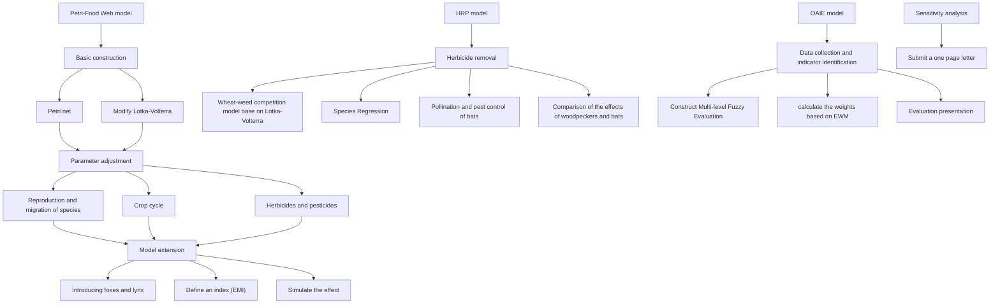
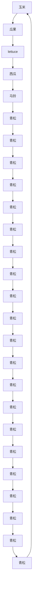
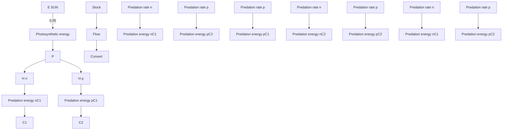
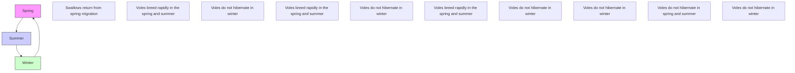

# From Forest to Farm, an Ecosystem's Charm

## Summary

It is imperative to ensure the stability, sustainability, and environmental integrity of agroecosystems during the transition from deforested lands to agricultural domains. To this end, we establish 3 model: Petri-Food Web (PFW) Model, Herbicide-Removal Prediction (HRP) Model, and Organic Agriculture Impacts Evaluation (OAIE) Model.

In Task 1, to quantify the complex changes in the ecosystem, we conduct a Petri-Food Web (PFW) Model, drawing upon the principles of Petri nets, Lotka-Volterra theory, and energy flow theory. The model incorporates considerations such as seasonal migration and reproduction of species, the crop cycle, and the impact of chemicals on the ecosystem. The model is then solved using the Longe-Kuta algorithm and the discrete dynamic simulation algorithm. Finally, the E-t curves of each species are plotted, and the conclusion that excessive chemicals are very harmful to the stability of the ecosystem is drawn.

In Task 2, the objective is to evaluate the impact of species regression on ecosystem stability. To this end, we expand the PFW model by incorporating two species, red fox and lynx. The ecosystem maturity index, $\Omega_{EcoMat}$ , was also defined to measure the stability. Subsequent to species regression, the E-t curves of producers and voles are plotted, and a shift in $\Omega_{EcoMat}$ from 9.35 to 11.33 is observed. This finding lead us to conclude that ecosystem stability have increased.

In Task 3, in order to predict the effects of herbicide removal on the ecosystem, we establish HRP Model. The model is solved based on the algorithm of model 1 by introducing the competitive relationship between weeds and wheat, the pollination and removal effects of bats to compare the effects of woodpeckers and bats on the ecosystem. The ensuing conclusions were as follows: Firstly, when parameter $\beta_{P}/\beta_{P} \geq 2.3$ , the ecosystem becomes vulnerable. Secondly, the introduction of bats has a substantial positive effect on ecosystem stability. Thirdly, the impact of woodpeckers is marginally weaker than that of bats in general.

In Task 4, to measure the impacts of organic farming methods on the ecosystem and its components, we establish OAIE Model based on a fuzzy comprehensive evaluation of the impacts of organic farming. The model is developed using real data collected from two agricultural methods, incorporating four primary and ten secondary indicators. The EWM was used to calculate the weights and the final degree of affiliation results is 0.5462, 0.7445, and 0.2458, indicating that organic agriculture has a more obvious positive impact.

Consequently, a sensitivity analysis was conducted on the model to ascertain its robustness. The study also examined the strengths and weaknesses of the model. A one-page letter was then submitted to the farmers, providing counsel on economic trade-offs and sustainability in organic farming.

Keywords: Agroecosystems; Organic agriculture; Lotka-Volterra; Petri-Food Web model; Lunger-Kutta algorithm

## Contents

## 1 Introduction 2

1.1 Problem Background 2  
1.2 Restatement of the Problem 2  
1.3 Overview of Our Work 2

## 2 Assumptions and Justifications 3

## 3 Notations 4

## 4 Model Preparation 4

## 5 Petri-Food Web (PFW) Model 4

5.1 Model Building and Design 5  
5.1.1 Basic Construction of Petri Net 5  
5.1.2 Lotka-Volterra-Based Modeling of Food Web Energy Flows 6  
5.1.3 Seasonal and cyclical correction 9  
5.1.4 Effects of Chemical Substances 12

5.2 Maturity Assessment of Ecosystems 13

5.3 Extension of the Model: Species Regression 14

## 6 Herbicide-Removal Prediction (HRP) Model 16

6.1 Impact Prediction Model Based on Wheat-Weed Competition ..... 16  
6.2 Restoration of Ecological Balance After the Introduction of Bats 18  
6.3 Introduction of Typical Species: Woodpeckers vs. Bats 18

## 7 Organic Agriculture Impacts Evaluation (OAIE) Model 19

7.1 Indicator Identification and Data Collection 19  
7.2 Multi-level Fuzzy Evaluation Modeling 20  
7.2.1 Determine the Set of Factors 20  
7.2.2 Determine the Collection of Comments 20  
7.2.3 Determination of a Fuzzy Composite Judgment Matrix 20

7.3 The Entropy Weight Method (EWM) 21

7.4 Presentation of Results and Discussion 22

## 8 Sensitivity Analysis 22

## 9 Model Evaluation 23

9.1 Strengths 23  
9.2 Weaknesses 23

## 1 Introduction

## 1.1 Problem Background

The process of converting forests into agricultural land leads to significant changes in ecosystems, resulting in issues such as soil degradation, loss of biodiversity, and increased dependence on chemicals.

In recent years, research on such issues has been increasing. For instance, Schmitz et al. (2020) highlighted that the intensification of agricultural activities, often through the use of fertilizers, pesticides, and herbicides, results in a rapid decline in soil quality and a reduction in agricultural biodiversity[1]. Additionally, studies suggest that as agricultural systems mature, marginal habitats begin to regenerate, providing space for species that had previously disappeared. For example, Baumgartner et al. (2019) demonstrated that by reducing the use of chemicals and introducing native species, the balance of ecosystems can be effectively restored[2]. Building on this, an increasing number of scholars are exploring how agricultural systems can achieve sustainable development by reducing chemical dependency and utilizing ecosystem services such as pest control and pollination[3]

This paper aims to construct a model to track the ecological succession process following the conversion of forests into agricultural land and to investigate the long-term impacts of human decisions on agricultural ecosystems.

## 1.2 Restatement of the Problem

Considering the problem background and actual situation, we need to solve the following problems:

- Construct a food web model for the new agricultural ecosystem, clarify the relationships between producers and consumers, and analyze the impacts of the agricultural cycle and seasonality on its dynamics.  
- Explore the effects of herbicides and pesticides on the population sizes of plants, insects, bats, birds, and the stability of the ecosystem.  
- Study the impacts of the return of two species on the agricultural ecosystem. Incorporate bats into the food web to analyze their functions and compare with another beneficial species.  
- Analyze the impacts of reducing herbicide use on the ecosystem, as well as the impacts of different organic farming scenarios in multiple aspects.

## 1.3 Overview of Our Work

To reflect our work more intuitively and avoid cumbersome statements, we have shown our work through the Figure 1.


<details>
<summary>flowchart</summary>


</details>

Figure 1: Overview of Our Work

## 2 Assumptions and Justifications

We make the following basic assumptions in order to simplify the problem. Each of our assumptions is justified.

★ Assumption 1: The efficiency of energy transfer between each level in the food web is estimated to be approximately 20%.

Justification: Research has demonstrated that, a considerable amount of energy is dissipated during the process of energy transfer between levels of the food chain. This dissipation ranges from approximately 10% to 20% of the total energy initially present.

★ Assumption 2: The energy relationship between populations satisfies the Lotka-Volterra equation.

Justification: The Lotka-Volterra equation is often the classical mathematical model describing the predator-prey interactions, and in addition to describing population size, it can also describe energy relationships.

★ Assumption 3: After the crop is harvested, the biomass drops to zero.

Justification: Since crops have an agricultural cycle, they are harvested at maturity and the biomass plummets dramatically. Therefore when analyzing only the energy changes, the biomass can be set to 0.

★ Assumption 4: The data on the performance of ecosystems where organic agriculture methods are applied are real and valid.

Justification: The data used were obtained from the Food and Agriculture Organization of the United Nations (FAO) database and relevant professional literature, which we believe to be authentic, valid and accurate.

## 3 Notations

The key mathematical notations used in this paper are listed in Table 1.

Table 1: Notations used in this paper

<table><tr><td>Symbols</td><td>Description</td></tr><tr><td> $P$ </td><td>Energy of the producer</td></tr><tr><td> $\alpha$ </td><td>Photosynthetic rate of producers</td></tr><tr><td> $H_{n}$ </td><td>Energy of pests</td></tr><tr><td> $\gamma$ </td><td>Influence coefficient of producers by consumers</td></tr><tr><td> $C_{i}$ </td><td>Energy of the i-th secondary consumer</td></tr><tr><td> $K_{p}$ </td><td>Carrying capacity of producers</td></tr><tr><td> $D$ </td><td>Energy of decomposers</td></tr><tr><td> $B$ </td><td>Energy of bat</td></tr><tr><td> $C_{0}$ </td><td>Initial energy of secondary consumers</td></tr><tr><td> $E(t)$ </td><td>Solar radiation energy at time t</td></tr><tr><td> $\alpha_{ij}$ </td><td>Energy transfer efficiency from organism i to organism j</td></tr><tr><td> $\beta_{ij}$ </td><td>Competition coefficient between organism i and organism j</td></tr></table>

## 4 Model Preparation

The data we used mainly comes from the sources below.

Table 2: Well - known International Ecosystem Data Query Databases

<table><tr><td>Database Names</td><td>Database Websites Data</td></tr><tr><td>INFOTERRA</td><td>https://www.unep.org/</td></tr><tr><td>International Plant Names Index (IPNI)</td><td>https://www.ipni.org/</td></tr><tr><td>World Resources Institute (WRI)</td><td>https://www.wri.org/</td></tr><tr><td>International Institute for Applied Systems Analysis (IIASA)</td><td>https://www.iiasa.ac.at/</td></tr><tr><td>Global Biodiversity Information Facility (GBIF)</td><td>https://www.gbif.org/</td></tr><tr><td>European Environment Agency (EEA)</td><td>https://www.eea.europa.eu/</td></tr><tr><td>FAO</td><td>http://www.fao.org/home/en/</td></tr></table>

## 5 Petri-Food Web (PFW) Model

From forests to agricultural lands, a new ecosystem will undergo a substantial evolution. Conventional food web modeling has historically concentrated on local relationships between populations and quantified food web models in terms of population size[4]. However, when measuring changes in the whole ecosystem with more complex internal relationships, it is more meaningful to model the network and use system dynamics to analyze changes in energy flow. Consequently, an agricultural food web model based on Petri[5] nets was developed to analyze the relationships and complex changes in the food web.

The construction of Petri nets serves as the foundation for the modeling of PFW, and thus, the ecosystem of wheat fields surrounding the city of Uppsala, Sweden, was initially selected as a reference for network modeling.

## 5.1 Model Building and Design

## 5.1.1 Basic Construction of Petri Net

Petri nets are composed of three basic elements: Place, Transition, and Directed Arc that connects these elements. Places usually represent resources in the system; Transitions represent activities. The Directed Arc is used to represent the logical relationship between the Place and Transition, i.e., the flow of resources. For the selected northern temperate wheatland ecosystem, the first step in modeling the food web with Petri nets is to identify the objects included in the network. The following Figure 2 offers a simplified representation of the food web at this site.


<details>
<summary>flowchart</summary>


</details>

Figure 2: The Food Web

Following the transformation of this agroecosystem from deforestation, its species richness was found to be comparatively lower than that of other systems. To address this, a selection of the most prevalent species was made, and a rudimentary food web model was formulated. This model consists of the following components:

- Producer: wheat  
- Decomposer: fungus  
• Primary consumers: ladybugs (beneficial insects), aphids (pests)  
• Secondary consumers: swallows, voles

Based on the object and role relationships within this food web, the composition of Places and Transition is proposed as follows:

$$
P = \left\{ \begin{array}{l} \text { Wheat,   Ladybug,   Aphid, } \\ \text { Swallow,   Field   Mouse,   Fungus } \end{array} \right\} \tag {1}
$$

$$
T = \{\text { Photosynthesis,   Intake,   Predation,   Decomposition } \} \tag {2}
$$

The Directed Arc establish a connection between the Places and Transitions, thereby indicating the direction of the flow of energy and matter. Constructing a Petri net from these data can elucidate further insights.


<details>
<summary>flowchart</summary>


</details>

Figure 3: Simulation of Petri Net Based on Stella

By reasonably configuring the parameters of state variables and transition variables (e.g., energy utilization, etc.) in Petri nets, the simulation analysis can be carried out as shown in Figure 3. Subsequently, the role relationship between each biological node will be quantitatively portrayed.

## 5.1.2 Lotka-Volterra-Based Modeling of Food Web Energy Flows

The traditional Lotka-Volterra model is employed to assess alterations in population size over time among distinct populations, i.e.,

$$
\frac {d N}{d t} = r N \left(1 - \frac {N}{K}\right) \tag {3}
$$

In the Lotka-Volterra model, N denotes the number of populations, r signifies the natural growth rate of populations, and K represents the environmental capacity of populations. A notable advantage of this model is its capacity to more accurately simulate the growth rate of populations, considering the constraints imposed by natural conditions, which can be both rapid and subsequent to a period of deceleration. However, utilizing the number of populations and the growth rate of the populations themselves as quantitative indicators does not adequately reflect the interconnections between ecosystem components and the characteristics of changes.

To enhance the measurement of ecosystems, the Lotka-Volterra model was modified based on the energy flow model proposed by biologist Lindemann. The modified equation for the change in the producer's (wheat's) own energy, P, over time is given as:

$$
\left\{ \begin{array}{c} \frac {d P}{d t} = \alpha E (t) \left(1 - \frac {P}{K _ {p}}\right) \left(1 - \alpha_ {n} \alpha_ {p}\right) \\ E (t) = E _ {0} + \xi (t) \\ \alpha = \alpha_ {0} \frac {P}{P _ {0}} - \gamma H _ {n} (t) \end{array} \right. \tag {4}
$$

The following section delineates the modified model.

Daily solar energy $E(t)$ : The solar radiant energy during a day always tends to a stable value, but can be affected by weather. Therefore, a random variable, designated as " $\psi$ ," is introduced to model the effect of weather variations on solar radiation energy. It is important to note that the weather considered here is independent of the season.

Photosynthetic efficiency alpha: The efficiency with which a producer absorbs energy from the outside world. Photosynthetic efficiency is a crucial indicator of ecosystem maturity. As crops grow, photosynthetic efficiency increases; however, it is undermined by an increase in pests.

Environmental holding capacity $K_{p}$ : It replaces the originally defined maximum number of populations with the maximum energy capacity.

The rewritten Lotka-Volterra energy flow equation for primary consumers is as follows, where $H_{n}$ and $\alpha_{n}$ are the energy and ingestion efficiencies of pests $H_{p}$ and $\alpha_{p}$ are the energy and ingestion efficiencies of beneficial insects respectively.

$$
\left\{ \begin{array}{l} \frac {d H _ {n}}{d t} = \alpha_ {n} \alpha E (t) \left(1 - \frac {H _ {n}}{K _ {H _ {n}}}\right) \\ \frac {d H _ {p}}{d t} = \alpha_ {p} \alpha E (t) \left(1 - \frac {H _ {p}}{K _ {H _ {p}}}\right) \end{array} \right. \tag {5}
$$

However, the producers in this model only consider wheat, and the primary consumers are ladybugs (beneficial insects) and aphids (pests), which must compete for food. The beneficial insects tend to act as a deterrent to the pests. Consequently, a robust competitive dynamic is postulated between the two.

To this end, we have modified the Lotka-Volterra energy flow formula to include competition coefficients, designated as $\beta_{1}$ and $\beta_{2}$ , and have extended it to encompass the influence of secondary consumers. The resulting modified formula is as follows:

$$
\left\{ \begin{array}{l} \frac {d H _ {n}}{d t} = \alpha_ {n} \alpha E (t) \left(1 - \frac {H _ {n}}{K _ {H _ {n}}} - \beta_ {2} \frac {H _ {p}}{K _ {H _ {n}}}\right) \left(1 - \sum_ {j = 1} \alpha_ {1 j}\right) \\ \frac {d H _ {p}}{d t} = \alpha_ {p} \alpha E (t) \left(1 - \frac {H _ {p}}{K _ {H _ {p}}} - \beta_ {1} \frac {H _ {p}}{K _ {H _ {p}}}\right) \left(1 - \sum_ {j = 1} \alpha_ {2 j}\right) \end{array} \right. \tag {6}
$$

The energy changes of the two insects before and after the correction are shown in Figure 4.


<details>
<summary>line chart</summary>

| Time (day) | producer | pest | beneficial insect |
| ---------- | -------- | ---- | ----------------- |
| 0          | 100      | 50   | 50                |
| 50         | 300      | 150  | 200               |
| 100        | 600      | 300  | 400               |
| 150        | 900      | 450  | 550               |
| 200        | 1100     | 500  | 580               |
| 250        | 1200     | 520  | 590               |
| 300        | 1220     | 530  | 595               |
| 350        | 1230     | 540  | 600               |
</details>

(a) Before Correction


<details>
<summary>line chart</summary>

| Time(day) | producer | pest | beneficial insect |
| --------- | -------- | ---- | ----------------- |
| 0         | 100      | 0    | 0                 |
| 50        | 400      | 150  | 100               |
| 100       | 800      | 250  | 200               |
| 150       | 950      | 280  | 350               |
| 200       | 1000     | 250  | 450               |
| 250       | 1000     | 200  | 500               |
| 300       | 1000     | 150  | 525               |
| 350       | 1000     | 100  | 550               |
</details>

(b) After Correction  
Figure 4: Energy Changes

For sub-consumers, the competition is negligible due to the abundance of food sources and the absence of intense competition. Consequently, the following equation can be used to describe the situation:

$$
\left\{ \begin{array}{l} \frac {d C _ {1}}{d t} = \left(\alpha_ {1 1} H _ {n} + \alpha_ {2 1} H _ {p}\right) \left(1 - \frac {C _ {1}}{K _ {C _ {1}}}\right) \\ \frac {d C _ {2}}{d t} = \left(\alpha_ {1 2} H _ {n} + \alpha_ {2 2} H _ {p}\right) \left(1 - \frac {C _ {2}}{K _ {C _ {2}}}\right) \end{array} \right. \tag {7}
$$

For the modeling of the decomposer, whose energy is derived from the carcasses of consumers, is contingent upon its mortality rate, thus yielding the following descriptive equation:

$$
\frac {d D}{d t} = (\delta_ {P} P + \delta_ {H} H + \delta_ {C} C) \alpha_ {D} \left(1 - \frac {D}{K _ {D}}\right) \tag {8}
$$

Utilizing data from an authentic rice field in Indonesia as a reference point, the model parameters were initialized with appropriate values and subsequently refined through iterative adjustment to assess the model's performance under varied parameter conditions. The parameter values that were ultimately determined are presented in the following table, and the model was solved.

Finally, we get the energy curve of each population in the food web as shown in Figure 5.

Table 3: The Parameter Values

<table><tr><td>Symbols</td><td>Values</td><td>Symbols</td><td>Values</td></tr><tr><td> $P_0$ </td><td>100</td><td> $\alpha_n$ </td><td>0.78</td></tr><tr><td> $H_{n0}$ </td><td>40</td><td> $\alpha_p$ </td><td>0.6</td></tr><tr><td> $H_{p0}$ </td><td>40</td><td> $\alpha_0$ </td><td>0.0035</td></tr><tr><td> $C_{10}$ </td><td>20</td><td> $K_{Hn}$ </td><td>543</td></tr><tr><td> $\beta_1$ </td><td>0.3076</td><td> $K_{Hp}$ </td><td>870</td></tr><tr><td> $\beta_2$ </td><td>0.5</td><td> $K_p$ </td><td>1000</td></tr></table>


<details>
<summary>line chart</summary>

| Time(day) | producer | pest | beneficial insect | Swallow | Vole |
| --------- | -------- | ---- | ----------------- | ------- | ---- |
| 0         | 100      | 50   | 50                | 20      | 20   |
| 50        | 250      | 100  | 100               | 40      | 40   |
| 100       | 400      | 150  | 150               | 60      | 80   |
| 150       | 600      | 250  | 250               | 100     | 120  |
| 200       | 800      | 300  | 350               | 150     | 180  |
| 250       | 900      | 280  | 450               | 180     | 220  |
| 300       | 950      | 250  | 550               | 200     | 250  |
| 350       | 1000     | 220  | 650               | 220     | 270  |
</details>

Figure 5: Energy Curve of Each Population

## 5.1.3 Seasonal and cyclical correction

## - Seasonal migration and reproduction of species

Seasonal changes frequently result in fluctuations in environmental factors, including temperature and food availability, which can precipitate a sudden decrease in resources. In such instances, migratory animals often have the capacity to identify more favorable habitats. A notable example is the ecosystem of north temperate wheat fields, where swallows are a prevalent migratory species. The migratory behavior of swallows is influenced by climate change and food resources, and they typically return north in the spring and depart again before the end of summer. In contrast, voles (Microtus) are non-hibernating species that undergo a rapid reproductive cycle in the spring and summer months.

Consequently, in the fall and winter seasons, the following corrections were implemented to incorporate the dynamics of animal migration within the model framework:


<details>
<summary>flowchart</summary>


</details>

Figure 6: Seasonal Ecosystem of North Temperate Wheat Fields

$$
\frac {d C _ {1}}{d t} = \left(\alpha_ {1 1} H _ {n} + \alpha_ {2 1} H _ {p}\right) \left(1 - \frac {C _ {1}}{K ^ {(w)} c _ {1}}\right) - \mu C _ {1} ^ {2} \tag {9}
$$

Throughout the spring and summer months, the following corrections were implemented in order to account for the impact of large animal activity and reproduction within the model framework

$$
\frac {d C _ {2}}{d t} = \left(\alpha_ {1 2} H _ {n} + \alpha_ {2 2} H _ {p}\right) \left(1 - \frac {C _ {2}}{K ^ {(s)} c _ {2}}\right) + \sigma \ln C _ {2} \tag {10}
$$

Introduce the term $-\mu C_{1}^{2}$ . The term " $\mu$ " is employed to denote the concept of self-regulation in the context of migratory animals, specifically in the case of swallows. It signifies the phenomenon in which large numbers of animals migrate in response to population growth that exceeds the capacity of available resources.

Introduce the term $\sigma \ln C_2$ . $\sigma$ is a self-regulation term for spring and summer breeding animals (voles), in order to take into account the large populations of voles that are active in groups.

Substitute K for $K^{(w)}$ . This adjustment is made because as the climate undergoes a transition into fall and winter, there is a concomitant decrease in food resources and environmental capacity.

## • Periodicity and seasonality of crops

The agricultural cycle encompasses the sequence of activities involved in the production of crops, from the initial planting and cultivation to the subsequent harvesting and preparation for consumption or sale. In the context of wheat cultivation in Uppsala, Sweden, the annual agricultural cycle is characterized by the singular occurrence of a single cycle specifically dedicated to winter wheat cultivation. This is primarily attributable to the prevailing cold climatic conditions that are characteristic of northern Europe. The cycle commences with the sowing of seeds in September, followed by the harvesting of the crop in May of the subsequent year. Consequently, during the four-month interval from May to September, the biomass of wheat in the food web is negligible.

Consequently, during this period, the primary consumers experience a direct impact, and the equation describing its energy would become:

$$
\left\{ \begin{array}{l} \frac {d H _ {n}}{d t} = - H _ {n} \sum_ {j = 1} \alpha_ {1 j} \\ \frac {d H _ {p}}{d t} = - H _ {p} \sum_ {j = 1} \alpha_ {2 j} \end{array} \right. \tag {11}
$$

Concurrently, the season exerts a substantial influence on the growth of wheat. During winter, temperatures are lower, and wheat enters the overwintering period. Warm winters have been observed to increase the prevalence of disease and insect sources in wheat fields, inducing insect pests. Conversely, cold winters have been shown to lead to frost damage to wheat and the phenomenon of dead stems and seedlings. Consequently, the period from November to February is characterized by a marked decline in wheat growth, which can be quantitatively assessed in terms of photosynthetic efficiency,

$$
\alpha = \left[ \alpha_ {0} \frac {P}{P _ {0}} - \gamma^ {(w)} H _ {n} (t) \right] \left(1 - \frac {t}{t _ {0}}\right) \tag {12}
$$

To solve the improved model, a discrete dynamic simulation algorithm is used. The initial values and parameters are set in steps of days and iterations are performed. The following algorithm pseudo-code outlines the specific simulation:

Algorithm 1 Discrete Dynamic Simulation Algorithm for Generalized Iterations  
1: Input: $(\alpha_0, \alpha_n, \alpha_p, K_p, K_{hn}, K_{hp}, \beta_1, \beta_2)$ , $(P_0, H_{n0}, H_{p0})$ , $(\Sigma \alpha_{1j}, \Sigma \alpha_{2j})$ , $N$ 2: Output: $t, P, H_n, H_p$ 1: Initialize $t = [], P = [], H_n = [], H_p = []$ 2: Define $func_\alpha(P, t)$ 3: for $i = 1 \to N$ do  
4: $t_i \leftarrow$ Generate time interval  
5: $P_i \leftarrow$ Runge-Kutta Method(Producer energy differential equation, $P_0, t_i$ )  
6: $H_{ni}, H_{pi} \leftarrow$ Runge-Kutta Method(Consumer populations differential equations, $(H_{n0}, H_{p0}), t_i)$ 7: $t \leftarrow t \cup t_i$ 8: $P \leftarrow P \cup P_i$ 9: $H_n \leftarrow H_n \cup H_{ni}$ 10: $H_p \leftarrow H_p \cup H_{pi}$ 11: end for  
12: return $t, P, H_n, H_p$


<details>
<summary>line chart</summary>

| Time(day) | Seasonally affected swallow | Seasonally affected voles | Seasonally invariant Swallow | Seasonally invariant voles |
| --------- | --------------------------- | ------------------------- | ---------------------------- | -------------------------- |
| 0         | 30                          | 30                        | 30                           | 30                         |
| 200       | 100                         | 140                       | 120                          | 100                        |
| 400       | 120                         | 140                       | 120                          | 100                        |
| 600       | 80                          | 140                       | 120                          | 100                        |
| 800       | 120                         | 140                       | 120                          | 100                        |
| 1000      | 80                          | 140                       | 120                          | 100                        |
| 1200      | 120                         | 140                       | 120                          | 100                        |
| 1400      | 80                          | 140                       | 120                          | 100                        |
| 1600      | 80                          | 140                       | 120                          | 100                        |
</details>

(a) Secondary Consumer


<details>
<summary>line chart</summary>

| Time(day) | producer | pest | beneficial insect |
| --------- | -------- | ---- | ----------------- |
| 0         | 0        | 0    | 0                 |
| 200       | 1000     | 300  | 350               |
| 400       | 1000     | 300  | 350               |
| 600       | 1000     | 300  | 350               |
| 800       | 1000     | 300  | 350               |
| 1000      | 1000     | 300  | 350               |
| 1200      | 0        | 0    | 0                 |
</details>

(b) Producer and Primary Consumers  
Figure 7: Energy of Each Part of the Ecosystem

## 5.1.4 Effects of Chemical Substances

## - Positive effects of herbicides and pesticides

In the realm of practical agriculture, the utilization of herbicides is frequently employed to eradicate weeds from agricultural fields. This practice is undertaken to prevent weeds from competing with crops for available resources. Similarly, pesticides are often utilized to mitigate the impact of pests, which can otherwise lead to the over-infestation of crops and subsequent crop necrosis.

Quantifying their impacts into the aforementioned food web model below:

$$
\begin{array}{c}\alpha = \alpha_ {0} \frac {P}{P _ {0}} - \gamma H _ {n} (t) \rightarrow \alpha = \alpha_ {0} \frac {P}{P _ {0}}\\K _ {p} \rightarrow \widetilde {K _ {p}}\end{array}\tag {13}
$$

The aforementioned equations reflect the positive impacts of pesticides on plant health and herbicides on the environmental capacity of plants, respectively. Nevertheless, it is imperative to note that the excessive utilization of these chemicals can result in the poisoning of ecosystem components, the disruption of soil pH, and the collapse of ecosystems.

## - Toxins accumulated along the food chain (bioconcentration)

Prolonged exposure to chemical pesticides can result in their accumulation in crops, which, if ingested by humans or other organisms in the food chain, can cause long-term health effects. Toxins are transferred along the food chain during the process of energy transfer. The higher the trophic level of an organism in an ecosystem, the greater its enrichment in toxins and the more significant its susceptibility.

When quantifying this phenomenon using a food web model, it is essential to incorporate the factor $-\gamma_{L}L_{i}$ , where $L_{i}$ represents the toxins accumulation of the ith trophic level, $-\gamma_{L}$ represents the effects of toxin accumulation on biological growth.

## 5.2 Maturity Assessment of Ecosystems

In the context of ecosystem development, a gradual transition is observed, accompanied by alterations in species richness, biomass (total bioenergy), P/R ratio, energy utilization, and food web complexity.

In order to assess the stability and maturity changes of the previously mentioned wheat field ecosystem (transformed by forested areas), the maturity index of the ecosystem, $\Omega_{EcoMat}$ , was defined and the meaning of the indicators in it was explained as follows,

Table 4: Maturity Index of Ecosystem

<table><tr><td>Index</td><td>Description</td></tr><tr><td>SR</td><td>Species Richness, measures the stability of the ecosystem</td></tr><tr><td>BM</td><td>Biomass, measures the development level of the ecosystem</td></tr><tr><td>P/R</td><td>Ratio of total production to total respiration</td></tr><tr><td>EUIR</td><td>Energy Utilization Rate, specifically photosynthetic efficiency</td></tr><tr><td>FWC</td><td>Food Web Complexity</td></tr></table>

The maturity index is derived from the weights of the aforementioned indicators, which are evaluated by experts. However, it should be noted that the weights employed in this process are exclusively utilized to regulate the order of magnitude consistency, as demonstrated by the following formula:

$$
\Omega_ {E c o M a t} = \omega_ {1} \cdot S R + \omega_ {2} \cdot B M + \omega_ {3} \cdot \frac {P}{R} + \omega_ {4} \cdot E U R + \omega_ {5} \cdot F W C \tag {14}
$$

Calculate the Maturity Index of the Wheat Food Web model and draw a graph of its variation over time, as well as graphs of the different metrics, as shown in Figure 8.


<details>
<summary>line chart</summary>

| Time(day) | Value  |
| --------- | ------ |
| 0         | 0.00   |
| 50        | 0.005  |
| 100       | 0.015  |
| 150       | 0.03   |
| 200       | 0.05   |
| 250       | 0.06   |
| 300       | 0.065  |
| 350       | 0.067  |
| 400       | 0.068  |
</details>

(a) Photosynthetic Efficiency


<details>
<summary>line chart</summary>

| Time(day) | Omega |
| --------- | ----- |
| 0         | 0.0   |
| 50        | 2.0   |
| 100       | 10.0  |
| 150       | 9.5   |
| 200       | 9.5   |
| 250       | 9.5   |
| 300       | 9.5   |
| 350       | 9.5   |
| 400       | 9.5   |
</details>

(b) Maturity Index of Ecosystem  
Figure 8: The Variation of Maturity Index over Time

It can be observed from the figure that during an agricultural cycle that:

- The maturity indicator rises to a certain value and then gradually stabilizes, representing an increase in the maturity and stability of the entire ecosystem.  
- Slow increase in species richness and food web complexity.  
- The P/R ratio starts at greater than 1 and gradually converges to 1, representing that the ecosystem has converged to a more stable state.

## 5.3 Extension of the Model: Species Regression

In order to assess the robustness and scalability of the model, two species from the fourth trophic level were selected for sensitivity analysis and ecosystem maturity assessment when expanding the layers of the Petri net.

Schematic Diagram of Agro-Ecosystems  


<details>
<summary>flowchart</summary>

```mermaid
graph TD
  A["farmland"] --> B["shallow"]
  C["marginal habitat"] --> D["hunt for food"]
  E["aphids"] --> F["swallow"]
  G["wheat"] --> H["swallow"]
  I["ladybug"] --> J["swallow"]
  K["vole"] --> L["swallow"]
  M["fungi"] --> N["swallow"]
  O(red fox] --> P["swallow"]
  Q["lynx"] --> R["swallow"]
```
</details>

Figure 9: Agro-Ecosystem

The species selected for this analysis were red fox and lynx and the simulation schematic is shown in Figure 9. The rationale for their selection is as follows: both species have historically inhabited forests, occupy analogous ecological niches, consume similar dietary items, and are capable of thriving within this particular ecosystem.

The energy flow equations for the returning species and the predated voles (with other species held constant) are to be written first.

$$
\left\{ \begin{array}{l} \frac {d C _ {3}}{d t} = \alpha_ {3 1} C _ {2} \left(1 - \frac {C _ {3}}{K _ {C _ {3}}}\right) \\ \frac {d C _ {4}}{d t} = \alpha_ {4 1} C _ {2} \left(1 - \frac {C _ {4}}{K _ {C _ {4}}}\right) \\ \frac {d C _ {2}}{d t} = (\alpha_ {1 2} H _ {n} + \alpha_ {2 2} H _ {p}) \left(1 - \frac {C _ {2}}{K _ {C _ {2}}}\right) (1 - \alpha_ {3 1} - \alpha_ {4 1}) \end{array} \right. \tag {15}
$$

Where $C_{3}$ and $C_{4}$ represent the bioenergy of the red fox and lynx, respectively, and $\alpha_{31}$ and $\alpha_{41}$ are their predation efficiencies on voles, respectively. The parameters were substituted into the equation to solve the food web model. The final study was done with a producer-vole pair to measure the change in Figure 10 as follows,


<details>
<summary>line chart</summary>

| Time(day) | Producers affected | Producers unaffected | Voles affected | Voles unaffected | Red fox | Lynx |
| --------- | ------------------- | --------------------- | -------------- | ----------------- | ------- | ---- |
| 0         | 0                   | 150                   | 0              | 0                 | 0       | 0    |
| 150       | ~750                | ~800                  | ~350           | ~380              | ~100    | ~100 |
| 350       | ~1000               | ~1000                 | ~400           | ~400              | ~150    | ~120 |
</details>

Figure 10: Change of Bioenergy over Time

As illustrated in the figure, voles, in their role as direct prey, exhibit a more pronounced response to the returning species. In contrast, producers, located farther along the food web, demonstrate minimal fluctuations, thereby reflecting the stability of the ecosystem and food web model.

Finally, the values of ecosystem maturity after the introduction of regression species were calculated. At the same moment, $\omega_{EcoMat} = 9.35$ before introduction, while $\omega_{EcoMat} = 11.33$ after introduction, which has an increase of 21%. The rationality of our model is verified and conclusions are drawn:

- The introduction of regressor species exerted a more pronounced effect on the local food web and had a negligible effect on the energy flow of the entire ecosystem.  
- The introduction of species capable of regeneration has led to a more stable ecosystem.

## 6 Herbicide-Removal Prediction (HRP) Model

## 6.1 Impact Prediction Model Based on Wheat-Weed Competition

As previously mentioned in Section 4.2.2, the utilization of herbicides results in the suppression of weed growth and the allocation of augmented resources to wheat for survival. Concurrently, these chemicals undergo accumulation along the food chain, leading to the poisoning of organisms.

Following the elimination of the herbicide, the weeds commence growth, thereby engaging in a competitive relationship with the wheat. Due to the weeds' frequently inedible nature, the bioenergy yield of wheat experiences a decline, resulting in a diminution of the energy source for the food web. This, in turn, impacts the subsequent stability of the entire ecosystem. To that end, the competitive relationship between wheat and weeds was simulated using the Lotka-Volterra model as follows:

$$
\frac {d P}{d t} = \alpha E (t) \left(1 - \frac {P}{\widetilde {K _ {p}}} - \beta_ {G} \frac {G}{\widetilde {K _ {p}}}\right) \left(1 - \alpha_ {n} - \alpha_ {p}\right) \tag {16}
$$

$$
\frac {d G}{d t} = \alpha_ {G} E (t) \left(1 - \frac {G}{K _ {G}} - \beta_ {P} \frac {P}{K _ {G}}\right)
$$

Below are explanations of some of the important variables:

- Competition coefficients $\beta_{G}$ and $\beta_{P}$ : $\beta_{G}$ is the coefficient of competition of weeds against wheat, the larger the value, the greater the inhibition of wheat; $\beta_{P}$ is the coefficient of competition of wheat against weeds.  
- Bioenergetics of weeds G: Weeds can photosynthesize like wheat, but their stored energy cannot be consumed by consumers.

In order to simulate the effect of herbicide removal on producers, starting at a certain point in time, we introduced weed growth. By setting reasonable initial values, we derived a curve of wheat-weed biomass over time as follows:


<details>
<summary>line chart</summary>

| Time(day) | Wheat Energy(×10⁷ J) | Weeds Energy(×10⁷ J) |
| --------- | -------------------- | -------------------- |
| 0         | 0                    | 0                    |
| 50        | ~950                 | ~100                 |
| 100       | ~1000                | ~100                 |
| 150       | ~850                 | ~450                 |
| 200       | ~750                 | ~550                 |
| 250       | ~700                 | ~600                 |
| 300       | ~680                 | ~650                 |
| 350       | ~670                 | ~670                 |
</details>

(a)


<details>
<summary>line chart</summary>

| Time(day) | Wheat Energy(×10⁷ J) | Weeds Energy(×10⁷ J) |
| --------- | --------------------- | --------------------- |
| 0         | 0                     | 0                     |
| 50        | ~950                  | 100                   |
| 100       | 1000                  | 100                   |
| 150       | ~600                  | ~450                  |
| 200       | ~400                  | ~600                  |
| 250       | ~300                  | ~700                  |
| 300       | ~200                  | ~750                  |
| 350       | ~150                  | ~800                  |
</details>

(b)  
Figure 11: Energy in Wheat and Weeds under Different Competition Coefficients

It can be observed from Figure that:

- To the left of the dashed line is the stage before herbicide removal, when wheat is growing normally and environmental accommodation is high.  
- To the right of the dashed line, the stage following herbicide removal is indicated, at which point weeds begin to grow and wheat bioenergy is slightly reduced.

It can be concluded that when the coefficient of competition of the species of weeds, denoted by $\beta_{G}$ , is significantly higher than the coefficient of competition of wheat against weeds, denoted by $\beta_{P}$ , the suppression of wheat is observed, its bioenergy gradually tends to zero, and the collapse of the entire ecosystem is initiated. This phenomenon is further exacerbated under conditions where wheat is the sole crop present and lacks natural predators. It is evident that by perpetually modifying the coefficient of competition, a scenario is materialized in which, when the condition $(\frac{\beta_{G}}{\beta_{P}} \geq 2.3)$ is met, wheat reaches a perilous state, consumers are deprived of sustenance, and the ecosystem teeters on the brink of disintegration.

## 6.2 Restoration of Ecological Balance After the Introduction of Bats

In order to increase the stability of ecosystems and reducing the use of chemicals, the species of bat is introduced. It feeds on pests, inhibiting their damage to producers, and pollinates, contributing to the bioenergetic growth of producers. Considering the interactions of bats with insects, plants, and predators, we first establish the Lotka-Volterra equations for all three, as follows:

$$
\frac {d P}{d t} = \alpha E (t) \left(1 - \frac {P}{\widetilde {K _ {p}}} - \beta_ {G} \frac {G}{\widetilde {K _ {p}}}\right) \left(1 - \alpha_ {n} - \alpha_ {p}\right) \tag {17}
$$

$$
\frac {d G}{d t} = \alpha_ {G} E (t) \left(1 - \frac {G}{K _ {G}} - \beta_ {P} \frac {P}{K _ {G}}\right)
$$

Where $\widetilde{\alpha}$ is the value of photosynthetic efficiency of bats after pollination enhancement, B is the bioenergy value of bats, and $\alpha_{B}$ is the predation efficiency of bats on pests. Through the parameter settings, the model was solved to obtain a significant increase in producer biomass and a larger decrease in pest biomass than before. In order to measure its impact on the stability of the whole ecosystem, we can calculate the change of maturity indicator of ecosystem, the specific result is shown in 6.3.

After calculation and analysis, it is obtained that:

- bat introduction significantly increased the photosynthetic efficiency of producers;  
- increased food web complexity, species richness;  
- the maturity index of the whole ecosystem changed from \*\* to \*\*, making the ecosystem more stable.

## 6.3 Introduction of Typical Species: Woodpeckers vs. Bats

The predictive modeling of herbicide removal impacts, constructed to consider the introduction of woodpeckers into food webs, is the foundation of this study. It possesses the capacity to regulate pests and pollination, yet its impact on the ecosystem may vary. In order to measure the difference between woodpeckers and bats affecting the ecosystem, data on woodpeckers and bats were collected. These data were then subjected to analysis to assess their impact on the photosynthetic efficiency of crops and the magnitude of predation efficiency on pests. This analysis was conducted to recalculate the maturity index and each indicator when the ecosystem is stable. The visualization results are as follows.


<details>
<summary>radar chart</summary>

| Category           | Bat   | Benchmark |
| ------------------ | ----- | --------- |
| Species richness   | 0.55  | 0.45      |
| Biomass            | 0.70  | 0.60      |
| P/R                | 0.60  | 0.55      |
| Energy efficiency  | 0.65  | 0.50      |
| Food web complexity| 0.60  | 0.45      |
</details>

(a) the Bat


<details>
<summary>radar chart</summary>

| Category           | Woodpecker | Benchmark |
| ------------------ | ---------- | --------- |
| Species richness   | 0.48       | 0.34      |
| Biomass            | 0.36       | 0.34      |
| P/R                | 0.42       | 0.40      |
| Energy efficiency  | 0.38       | 0.36      |
| Food web complexity| 0.40       | 0.36      |
</details>

(b) the WoodPecker  
Figure 12: Woodpeckers and Bats

The findings indicated that both bats and woodpeckers contributed to enhancing ecosystem stability; however, bats exhibited a more pronounced impact compared to woodpeckers.

## 7 Organic Agriculture Impacts Evaluation (OAIE) Model

The adoption of environmentally sustainable practices is an inevitable consequence of the pursuit of sustainable development. In this section, a comprehensive fuzzy integrated evaluation system of the impacts of organic agriculture is established. This system is based on real data collected on organic and conventional agriculture, selecting multi-level indicators. Building upon the findings of prior studies, this analysis will assess the broader ecosystem impacts of organic agriculture.

## 7.1 Indicator Identification and Data Collection

A comprehensive data set was meticulously assembled, encompassing conventional agriculture prior to 2010 and organic agriculture following 2020. This endeavor involved a synthesis of information from the Food and Agriculture Organization of the United Nations (FAO) database and relevant specialized literature. The data were categorized into four major aspects: ecosystem, crop growth, environmental protection, and cost-effectiveness. And ten secondary indicators were selected below in Figure 13.


<details>
<summary>flowchart</summary>

```mermaid
graph TD
  A["Organic agriculture (methodology)"] --> B["quite positive"]
  A --> C["slightly positive"]
  A --> D["slightly negative"]
  A --> E["ecosystem"]
  A --> F["growth of crops"]
  A --> G["eco-friendly"]
  A --> H["cost-effectiveness"]
  E --> I["ecosystem mature ratio (EMR)"]
  E --> J["leaf area index ratio (LAIR)"]
  E --> K["fruating rate ratio (FRR)"]
  F --> L["prevention and treatment ratio (PTR)"]
  F --> M["predation efficiency ratio (PER)"]
  F --> N["species richness ratio (SRR)"]
  G --> O["soil salinity (SSR)"]
  G --> P["pollution index ratio (PIR)"]
  H --> Q(cost ratio (CR)]
  H --> R["output ratio (OR)"]
```
</details>

Figure 13: Fuzzy Comprehensive Evaluation System

## 7.2 Multi-level Fuzzy Evaluation Modeling

## 7.2.1 Determine the Set of Factors

In accordance with the indicators selected in the preceding section, the primary and secondary factor sets were established as follows:

$$
U _ {1} = \{\text { Ecosystem } u _ {1}, \text { Crop   Growth } u _ {2}, \text { Environmental   Protection } u _ {3}, \text { Cost - Benefit } u _ {4} \} \tag {18}
$$

$$
U _ {2} = \left\{ \begin{array}{c c c c c} u _ {\mathrm{CER}}, & u _ {\mathrm{PER}}, & u _ {\mathrm{SPRR}}, & u _ {\mathrm{EMR}}, & u _ {\mathrm{LAIR}} \\ u _ {\mathrm{SORR}}, & u _ {\mathrm{SSR}}, & u _ {\mathrm{PIR}}, & u _ {\mathrm{CR}}, & u _ {\mathrm{OR}} \end{array} \right\} \tag {19}
$$

## 7.2.2 Determine the Collection of Comments

In order to measure the extent of the impact of organic agriculture on the ecosystem as a whole and on its individual components, three levels have been defined and constitute the following set of rubrics:

$$
V = \{\text { Quite   Positive } v _ {1}, \text { Slightly   Positive } v _ {2}, \text { Negative } v _ {3} \} \tag {20}
$$

A comprehensive evaluation system was meticulously engineered, delineated as follows:

## 7.2.3 Determination of a Fuzzy Composite Judgment Matrix

The fuzzy matrix is obtained by establishing an affiliation function for each indicator, with the function calculated separately for each indicator to determine its affiliation to the set of rubric indicators. In this context, the Cauchy distribution function is selected as the affiliation function, and its segmentation function is delineated as follows:

$$
A _ {1} (x) = \left\{ \begin{array}{l l} 1, & x \leq a \\ \frac {1}{1 + \alpha (x - a) ^ {\beta}}, & x > a \end{array} , \quad A _ {2} (x) = \frac {1}{1 + \alpha (x - a) ^ {\beta}}, \quad A _ {3} (x) = \left\{ \begin{array}{l l} 1, & x \leq a \\ \frac {1}{1 + \alpha (x - a) ^ {\beta}}, & x > a \end{array} \right. \right. \tag {21}
$$

The parameters a, $\alpha$ , and $\beta$ a must be formulated according to different indicators, thus yielding 10 groups of affiliation functions. The affiliation value is calculated respectively by these functions. The first-level fuzzy comprehensive judgment matrix is obtained by calculating, as follows:

$$
R _ {8 \times 4} = \left( \begin{array}{c c c c} r _ {1 1} & r _ {1 2} & \dots & r _ {1 4} \\ r _ {2 1} & r _ {2 2} & \dots & r _ {2 4} \\ \vdots & \vdots & \ddots & \vdots \\ r _ {8 1} & r _ {8 2} & \dots & r _ {8 4} \end{array} \right) \tag {22}
$$

## 7.3 The Entropy Weight Method (EWM)

An initial value matrix $R = (r_{ij})_{n \times m}$ was constructed using the aforementioned data, $i \in [1, n]$ , $j \in [1, m]$ , n = 8, m = 4. The subsequent four steps are imperative for the objective delineation of the weights of the indicators: First, use the initial value matrix $R = (r_{ij})_{n \times m}$ to compute the probability $p_{ij} \quad (i = 1, 2, \ldots, n; j = 1, 2, \ldots, m)$ , which represents the proportion of the ith sample under the jth indicator.

$$
p _ {i j} = \frac {t _ {i j}}{\sum_ {i = 1} ^ {n} t _ {i j}}, \quad i = 1, 2, \dots , n, j = 1, 2, \dots , m. \tag {23}
$$

Then, the information entropy of the jth indicator is calculated by the following formula.

$$
e _ {j} = - \frac {1}{\ln n} \sum_ {i = 1} ^ {n} t _ {i j} \ln t _ {i j}, \quad j = 1, 2, \dots , m. \tag {24}
$$

After that, the coefficient of variation for the jth indicator was calculated using the following formula:

$$
g _ {j} = 1 - e _ {j}, \quad j = 1, 2, \dots , m. \tag {25}
$$

Conversely, an increase in the information entropy of the indicator corresponds to a decrease in the coefficient of variation of the indicator, signifying a reduction in the magnitude of change in the indicator. Finally, the entropy weight normalized value of the jth metric is calculated by using the following formula:

$$
\omega_ {j} = \frac {g _ {j}}{\sum_ {j = 1} ^ {m} g _ {j}}, \quad j = 1, 2, \dots , m. \tag {26}
$$

Pursuant to the aforementioned formula and associated data calculation, the entropy weights of the four primary aspects can be derived. This weight plays a pivotal role in the calculation of the final total evaluation score.

## 7.4 Presentation of Results and Discussion

Substitution of the collected relevant data and calculation of the affiliation of all the indicators (including primary and secondary indicators) and derivation of their affiliation sums on the positive evaluations $v_{1}$ and $v_{2}$ yielded the correlation of each level of indicators, as shown in the following Figure 14.


<details>
<summary>pie chart</summary>

| Category | Value (%) |
|---|---|
| Ecosystem | 27.2 |
| Crop growth | 21.2 |
| Environmental protection | 33.4 |
| Cost-effectiveness | 18.2 |
</details>

(a) the First Level of Indicator Affiliation


<details>
<summary>bar chart</summary>

| Index | Black Bar Value | Red Bar Value |
|---|---|---|
| CER | 0.5 | 0.5 |
| PER | 0.78 | 0.39 |
| SPRR | 0.77 | 0.43 |
| EMR | 0.76 | 0.84 |
| LAIR | 0.74 | 0.82 |
| SORR | 0.43 | 0.51 |
| SSR | 0.84 | 0.40 |
| PIR | 0.82 | 0.52 |
| CR | 0.51 | 0.51 |
| OR | 0.51 | 0.51 |
</details>

(b) the Second Level of Indicator Affiliation  
Figure 14: Indicator Affiliation Result

As depicted in the figure, the affiliation value of pest control (Control Effectiveness Ratio CER and Predation Efficiency Ratio PER) is less than 1, indicating that pest control is less effective in comparison to conventional agriculture. The impact of cost per unit area is detrimental, suggesting that the cost of organic agriculture has increased relative to conventional agriculture.

All other indicators demonstrate that organic agriculture is significantly superior to conventional agriculture. Subsequent to the incorporation of entropy weights into the calculation, the comprehensive outcomes of the entire fuzzy evaluation model were determined to be 0.5462, 0.7445, 0.2458, thereby indicating that organic agriculture exerts a more pronounced positive influence on the ecosystem and its constituent elements.

## 8 Sensitivity Analysis

In this paper, a food web model based on Petri nets, a prediction model for the impact of herbicide removal, and a fuzzy comprehensive evaluation model for the impact of organic agriculture were developed. The primary focus of this study is the sensitivity analysis of the Petri net-based food web model. Given the absence of direct data, numerous parameters within the model were assigned artificial values, which were then refined through repeated simulations and adjustments. However, it is acknowledged that certain parameters may exhibit fluctuations in actual scenarios. For instance, solar energy E may demonstrate significant variability due to weather effects, and photosynthesis efficiency in crops may be diminished by environmental influences. Therefore, different values of k and $\alpha_{0}$ were adjusted while maintaining the other parameters constant. The re-simulation model 1 is presented below:


<details>
<summary>line chart</summary>

| Time (day) | Producers k=10 | Producers k=20 | Producers k=40 | Swallow k=10 | Swallow k=20 | Swallow k=40 |
| ---------- | -------------- | -------------- | -------------- | ------------ | ------------ | ------------ |
| 0          | 0              | 0              | 0              | 0            | 0            | 0            |
| 50         | ~200           | ~150           | ~180           | ~50          | ~60          | ~70          |
| 100        | ~400           | ~350           | ~450           | ~100         | ~120         | ~140         |
| 150        | ~600           | ~550           | ~650           | ~150         | ~180         | ~220         |
| 200        | ~800           | ~750           | ~850           | ~200         | ~240         | ~300         |
| 250        | ~900           | ~850           | ~950           | ~220         | ~260         | ~320         |
| 300        | ~950           | ~900           | ~980           | ~230         | ~270         | ~330         |
| 350        | ~980           | ~950           | ~1000          | ~240         | ~280         | ~340         |
</details>

(a) the Adjustment of K


<details>
<summary>line chart</summary>

| Time(day) | Producers alpha=0.05 | Producers alpha=0.10 | Swallow alpha=0.05 | Swallow alpha=0.10 | Swallow alpha=0.20 |
| --------- | -------------------- | -------------------- | ------------------ | ------------------ | ------------------ |
| 0         | 0                    | 0                    | 0                  | 0                  | 0                  |
| 50        | 950                  | 980                  | 150                | 160                | 170                |
| 100       | 1000                 | 1000                 | 180                | 180                | 190                |
| 150       | 1000                 | 1000                 | 190                | 190                | 200                |
| 200       | 1000                 | 1000                 | 200                | 200                | 210                |
| 250       | 1000                 | 1000                 | 210                | 210                | 220                |
</details>

(b) the Adjustment of $\alpha_0$  
Figure 15: Sensitivity Analysis

As demonstrated in the above figure, the model parameters k and $\alpha_{0}$ were varied from 10 to 20 and from 0.05 to 0.1 to 0.2, respectively. The displayed results indicate that when the model parameters are altered, the ecosystem (particularly the species at the base of the food chain) and the food web model exhibit minimal sensitivity.

It is noteworthy that the complexity of the food web is directly correlated with its stability, as more complex webs benefit from enhanced resistance and recovery capabilities of the ecosystem. The ecosystem demonstrates minimal change when most of the parameters fluctuate, indicating that further sensitivity analysis is not necessary to verify the robustness of the model.

## 9 Model Evaluation

## 9.1 Strengths

- The model demonstrates commendable sensitivity and robustness, exhibiting minimal susceptibility to extraneous factors that could potentially disrupt its performance.  
- The model utilizes energy as a metric to assess inter-population interactions rather than population size, a strategy that more accurately accounts for the transfer of roles throughout the food web.  
- We define ecosystem maturity indicators, which quantify the impacts of natural processes and human decisions on ecosystems at the whole ecosystem level.  
- We constructed Petri networks, which facilitated a more precise analysis of the food web using system dynamics in the subsequent process.

## 9.2 Weaknesses

\- In evaluating the impacts of organic agriculture on ecosystems, the analysis does not extend to the species level.

\- The modeling considerations remain ideal, and real-world scenarios may have more complex effects.

## References

[1] Schmitz, O. J., et al. (2020). The ecological impact of intensive agriculture. Ecology, 101(9), e03021. Publishing Company, 1984-1986.  
[2] Baumgartner, J. R., et al. (2019). Restoring biodiversity in agricultural systems. Agriculture, Ecosystems Environment, 282, 106-117.  
[3] Lal, R. (2021). Organic farming and sustainable agriculture: A global perspective. Soil Science Society of America Journal, 85(4), 897-910.  
[4] Liu, S. -L., Yin, Y. -J., An, N. -N., Dong, S. -K. "Full - process analysis and evaluation system construction for ecological and environmental effects of organic industry," Chinese Journal of Eco - Agriculture, vol. 23, no. 7, pp. 793 - 802, 2015, doi: 10.13930/j.cnki.cjea.141399.  
[5] Zhao, J., Feng, W. -Q., Qin, Y. -S., et al., "Effects of different nitrogen, phosphorus and potassium fertilizers on soil pH and cadmium availability," Acta Pedologica Sinica, vol. 47, no. 5, 2010.  
[6] De Laender, F., Morselli, M., Baveco, H., Van den Brink, P. J., Di Guardo, A., "Theoretically exploring direct and indirect chemical effects across ecological and exposure scenarios using mechanistic fate and effects modelling," Environment International, vol. 74, pp. 181 - 190, 2015.  
[7] Hutchison, C., Guichard, F., Legagneux, P., Gauthier, G., Bêty, J., Berteaux, D., Fauteux, D., Gravel, D., "Seasonal food webs with migrations: multi - season models reveal indirect species interactions in the Canadian Arctic tundra," Philosophical Transactions of the Royal Society A, vol. 378, no. 2190, p. 20190354, 2020.

## A Letter to

## Farmers

## Dear Friend,

Hello!

First of all, I am very pleased to learn that you are exploring the practice of organic farming, which is a commendable path towards sustainable development. As an environmentally friendly and healthy agricultural production method, organic farming does face some economic and technical challenges. However, its long-term environmental benefits and the growth in market demand will bring you sustainable returns. Below are some suggestions I offer regarding the main issues and trade-offs you may encounter as you transition to organic farming.


<details>
<summary>bar chart</summary>

| Category | Type | Yield | Fruiting Rate |
|---|---|---|---|
| Short Term | Yield | 0.5 | 0.7 |
| Short Term | Fruiting Rate | 0.0 | 0.8 |
| Long Term | Yield | 2.0 | 0.9 |
| Long Term | Fruiting Rate | 0.0 | 1.0 |
</details>

Firstly, regarding the cost issue, organic farming typically requires more investment in environmentally friendly practices.

These additional investments are necessary to ensure ecological balance and soil health. However, to avoid excessively high costs that may reduce economic efficiency, I recommend optimizing production techniques and management methods to control costs effectively.

Additionally, the government can provide subsidies and technical support to ensure your success in organic farming.


<details>
<summary>radar chart</summary>

| Category | Long-term organic | Short-term organic | Traditional |
|---|---|---|---|
| SORR | 0.3 | 0.4 | 0.2 |
| SSR | 0.1 | 0.2 | 0.5 |
| PIR | 0.2 | 0.3 | 0.6 |
| CR | 0.1 | 0.2 | 0.4 |
| OR | 0.1 | 0.3 | 0.7 |
</details>

Another challenge of organic farming is the conflict between yield and quality. Because organic farming emphasizes soil protection and the safety of agricultural products, it may result in lower yields in the short term. However, with the growing consumer demand for organic products, quality has become the key selling point in the market. Therefore, I suggest that while ensuring product quality, you work to improve agricultural techniques and management methods to increase yield, thereby meeting market demand and enhancing economic benefits.

Furthermore, the conflict between short-term economic benefits and long-term sustainability is also a key issue. As organic farming requires long-term investment and continuous improvement, there may be a risk of reduced income in the short term. To help you achieve long-term development, I recommend that the government and businesses provide ongoing economic support and technical guidance.

In summary, although there is a certain conflict between economic efficiency and sustainability in organic farming, it is not irreconcilable. Through government subsidies, technological innovation, brand development, and farmers' own efforts, it is entirely possible to achieve a win-win situation for both economic benefits and sustainable development.

I sincerely wish you great success in your exploration of organic farming!