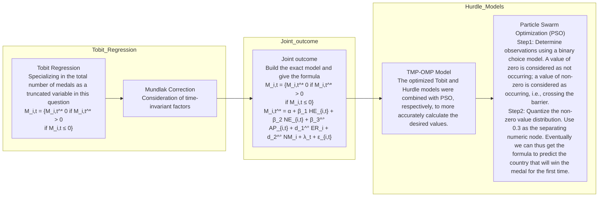

# From Models to Medals: The Winning Formula Behind the Data Summary

Since the inception of the first Olympic Games in history, discussions on predicting the Olympic medal tally have been ongoing. Against this backdrop, we develops an appropriate regression model to predict the medal standings for the 2028 Los Angeles Olympic Games and explores the impact of the "Great Coach Effect" on the performance of countries in Olympic events.

Firstly, based on the rich data provided in the study, we conducted data preprocessing, including addressing anomalies caused by historical factors and developing models such as SARIMAX and ARIMA to predict future trends in the number of events. Secondly, to handle truncated data, such as countries with "0 medals," this study constructed the TMH-OMP model, which combines the Mundlak-modified Tobit regression model with the Hurdle model. The model achieved a prediction accuracy of 79.3% for countries winning more than 10 medals annually, and 77.8% for countries winning fewer than 10 medals annually. Additionally, we predict that Andorra and the Maldives will win their first-ever Olympic medals, with probabilities of 0.39 and 0.32, respectively. An analysis of event types and project quantity (participation rate) reveals a Pearson correlation coefficient of 0.416.

In order to analyze the "Great Coach" effect, we constructed a logistic regression model for fitting, and incorporated the Event-study method into the conventional Difference-in-Differences (DID) approach to design a dynamic DID method capable of effectively estimating the effect across multiple treatment groups. To mitigate the bias due to covariate differences, we included the Inverse Probability Weighting (IPW) method for estimating treatment effects, and applied the Double Robust Estimator (DR) framework to develop the DRD-CE model. Performance analysis of this model showed an R-squared value of 0.756, indicating good fit, and a "Great Coach" regression coefficient of 3.1084, highlighting the substantial impact of the "Great Coach" effect on specific countries and projects. Furthermore, we identified significant effects in countries such as the United States in Women's Sabre Fencing, Japan in Women's Gymnastics, Germany in Women's Sabre Fencing, and Field Hockey.

Subsequently, we observed that changes in the number of smaller events within major categories had a significant impact on the medal outcomes of some smaller countries. Approximately 104 nations are highly dependent on the variety of sports events to secure gold medals. Based on these findings, we proposed to the National Olympic Committees the protection and expansion of their advantageous sports events.

Finally, we assessed and expanded the model's strengths and limitations, as well as analyzed its sensitivity. By conducting error analysis between the total medal count derived from the sum of gold, silver, and bronze medals and the total medal count directly input into the model, we obtained an average error of 8.0783%. This result indicates that our model demonstrates high sensitivity.

Keywords: Olympic Games; Tobit regression; Hurdle model; Great coach effect; Doubly robust estimator; Host country effect

# Contents

# 1 Introduction....3

1.1 Problem Background ....3  
1.2 Restatement of the Problem....3  
1.3 Our Work....4

# 2 Assumptions and Justifications....4

# 3 Notations ....5

# 4 Data processing....5

# 5 Model 1: Predict Olympic medal counts by TMP-OMP Model....6

5.1 Explanation of the Dynamic Country Characteristics and Constant Country Properties 6  
5.1.1 Dynamic country characteristics 6  
5.1.2 Constant country characteristics....8  
Table 2: Summary of Constant country characteristics....8  
5.2 The Establishment of Model 1....9  
5.3 The Solution of Problem 1 by Model 1....11  
5.3.1 Predicting the 2028 Medal Table 11  
Table 3: Predictive results and accuracy of the two models respectively ....12

# 6 Model 2: Analysis “great coach” effect by DRD-CE Model....16

6.1 The Establishment of Model 2....16  
6.2 The Solution of Problem 2 by Model 2....18  
6.2.1 Illustrate the impact of the great coaching effect ....18  
6.2.2: Selection of three countries and projects, analysis and results....19  
6.2.3: Prediction of the Performance After Hiring a "Great Coach" 20

# 7 The Solution of Problem 3....21

7.1 Former host effect and Subsequent host effect. 21  
7.2 Strategies to Enhance Olympic Participation and Global Influence....22

# 8 Sensitivity Analysis....23

# 9 Model Evaluation and Further Discussion....24

9.1 Strengths ....24  
9.2 Weaknesses and Further Discussion ....25

# 10 References....25

# 1 Introduction

# 1.1 Problem Background

The Olympic Games have long captured global attention with their diverse events and elite athletes. Each medal reflects not only an athlete's achievement but also the spirit of their country. As a result, predicting Olympic medal standings has become a focus of interest.

Time series forecasting, a common prediction method, uses historical medal counts to identify trends $[1]$ . However, this approach is limited as it only considers past data and cannot adapt to sudden changes or uncertainties. The empirical model, which relies on real-world data and statistical analysis, also faces challenges, such as focusing mainly on population and GDP, while neglecting other key variables and time-independent factors like sports culture $[2]$ .


<details>
<summary>natural_image</summary>

Crowd of people at night with a man on a motorcycle holding a flag, surrounded by photographers and a Swiss flag (no visible text or symbols)
</details>

Figure 1: Tom Cruise declares see you in LA for 2028 Olympics

# 1.2 Restatement of the Problem

Based on the background information and restrictions related to the Olympic Games mentioned in the problem statement, we need to address the following issues:

# Problem 1: Medal Prediction Model

Develop a model to predict the gold, silver, bronze, and total medal counts for each country. Evaluate the model's performance using relevant metrics.

2028 LA Olympics Prediction: Forecast medal rankings, identify countries with improved or declined performance compared to 2024, and predict potential first-time medalists.

Event-Medal Relationship: Analyze how the number and types of events influence medal distribution, considering the host country's event choices and their impact on medals.

# Problem 2: Great Coach Effect Analysis

Evaluate the impact of the "great coach effect" on medal distribution and estimate its contribution to the total medal count.

Coach Selection: Identify three countries and recommend which sports they should focus on to hire a "great coach," predicting the potential impact.

# Problem 3: Insights from the Model

Present unique insights on medal distribution, highlighting practical recommendations for national Olympic committees.

# 1.3 Our Work

  
Figure 2: The overview of Our Work.

# 2 Assumptions and Justifications

Assumption 1: This paper assumes that all athletes active after 2020 are at the peak of their athletic performance and will compete in subsequent Olympic Games. Additionally, their performance will be predicted solely based on their medal-winning capabilities.

Assumption 2: This paper assumes that the number of events in the 2028 and 2032 Olympic Games will be determined solely by the host country effect and international trends, without being influenced by other external factors or unforeseen circumstances.

Assumption 3: It is assumed that the achievements of countries undergoing regime changes or other special organizations (such as those competing on behalf of two countries or as independent entities) are reasonably incorporated into the current legitimate countries, based on historical and geographical factors.

# 3 Notations

The key mathematical notations used in this paper are listed in Table 1.

<table><tr><td>Symbol</td><td>Description</td></tr><tr><td> $HE_{i,t}$ </td><td>Host effect</td></tr><tr><td> $ER_{i,t}$ </td><td>Event participation rate</td></tr><tr><td> $AP_{i,t}$ </td><td>Athletic performance</td></tr><tr><td> $\overline{ER}_{i}$ </td><td>Average Event participation rate</td></tr><tr><td> $\overline{NM}_{i}$ </td><td>Normalized Medal Average</td></tr><tr><td> $NA_{i,t}$ </td><td>Total country participants</td></tr><tr><td> $M_{i,t}^{*}$ </td><td>Number of potential medals (untruncated values)</td></tr><tr><td> $M_{i,t}$ </td><td>Number of medals actually observed</td></tr></table>

# 4 Data processing

First, we addressed outliers in the dataset, such as formatting errors and missing data, and took into account the impact of special events on the data, such as the cancellation of the Olympics during World War II, justifying the retention of missing values in those years.

We then reviewed the historical context of the Olympics, assessing past events, and concluded that they had minimal impact on the overall predictive task. Therefore, we disregarded these effects and proceeded with normal data handling.

Considering global circumstances and political changes, we consolidated the data of the former Soviet Union into Russia and merged East and West Germany into a unified Germany, retaining the results. For countries that emerged after the dissolution of the Soviet Union (e.g., Lithuania, Kazakhstan), we used their respective results.

we provided additional notes on data processing and usage: we combined the results of a country's first and second teams; due to the suspension of Russia and Belarus and the missing data, we did not forecast the medal counts for these two countries; data from mixed teams were excluded from medal predictions; dual-nationality athletes' medals were counted for both countries; and following Assumption 2, we removed data for athletes who competed before 2020 and created a separate new dataset for future use.


<details>
<summary>flowchart</summary>

```mermaid
graph TD
  subgraph Step1["Step 1: Handling of outliers"]
  A["The 1940 & 1944 were canceled due to World War II, so there are gaps."] --> B["Special case .etc"]
  C["1906 Olympics not recognized by IOC, data deleted"] --> B
  B --> D["Find and summarize processing"]
  D --> E["Exception handling"]
  F["Chinese garbled, formatting errors, missing data"] --> E
  end

  subgraph Step2["Step 2: Historical events of the Olympics"]
    G["The East German doping scandal..."] -.-> H["Repeated instances of unfair decisions..."]
    H -.-> I["Summary: No significant impact, all ignored and handled normally"]
  end

  subgraph Step3["Step 3: complex country situations"]
    J["The data of the Soviet Union(URS) is integrated to Russia(RUS)."] -.-> K["For other countries that emerged from the Soviet Union(LTH,KAZ, etc.), the results of their own country will be used."]
    L["East and West Germany merged into Germany, results retained."]
  end

  subgraph Step4["Step 4: Treatment of other data and instructions for use"]
    M["Combined first and second team data for one country"] + N["Due to the ban on Russia and Belarus and the lack of data from recent years, no subsequent medal predictions are made for these two countries.&quot; + O[&quot;Unified Team data is not used for medal predictions, Medals for dual nationalities count for both countries."]
    P["Under hypothesis two, information on all athletes who have competed before 2020 is removed and a separate new dataset is constructed."]
  end
```
</details>

Figure 3. Data processing steps

Finally, for the other datasets, after encoding the variables, we used the median to fill in outliers and missing values, ensuring the completeness and accuracy of the data.

Through these steps, we ensured the data's standardization and consistency, laying a solid foundation for subsequent analysis and modeling.

# 5 Model 1: Predict Olympic medal counts by TMP-OMP Model.

# 5.1 Explanation of the Dynamic Country Characteristics and Constant Country Properties

# 5.1.1 Dynamic country characteristics

In the context of the Olympic Games, dynamic country characteristics refer to factors that have a significant impact in the short term and change over time. For example, the host country effect (HE), the proportion of events participated in by each country (NE) and athletes' performance in recent Olympic Games ( $AP_{i}$ ), Number of athlete participants ( $NA_{i,t}$ ) and so on.

To construct dynamic national characteristics, we first need to predict the types and quantities of future projects for 2028 and 2032. As shown in the figure, considering that the number of future projects is closely related to historical quantities, and project types are often related to the host country, we can divide them into: host country's advantageous projects, disadvantageous projects, and neutral projects. For advantageous and disadvantageous projects, we consider that the host country effect may lead to an increase in advantageous projects and a decrease in disadvantageous projects, so we choose the SARIMAX model, which takes into account exogenous variables. Neutral projects are often not affected by the host country effect, so the ARIMA model is used for prediction. In addition, we have used the same method to analyze the host country of 2032, Australia. Where the pie chart in the flowchart shows the percentage of advantaged items in orange, the percentage of neutral items in purple and the percentage of disadvantaged items in blue.

  
Figure 4. Data processing steps

These characteristics reflect a country's variations across different Olympic cycles and the temporary performance of its athletes, significantly influencing the prediction of medal counts. Therefore, in the modeling process, we selected $HE_{i,t}$ , $ER_{i,t}$ and $AP_{i,t}$ as the three dynamic country characteristics to more accurately capture the immediate impact of country traits on medal outcomes.

Table 1: Summary of Dynamic country characteristics

<table><tr><td>Characteristic</td><td>Equation</td><td>range of values</td></tr><tr><td>Host effect ( $HE_{i,t}$ )</td><td>Based on whether the previous and next sessions were hosted</td><td>0, 1</td></tr><tr><td>Event participation rate ( $ER_{i,t}$ )</td><td>Annual projects participated by country i /Annual total projects  $\times 100\%$ </td><td>[0,1]</td></tr><tr><td>Athletic performance ( $AP_{i,t}$ )</td><td>Sum of ability scores in the last two editions.</td><td>[-1,1]</td></tr><tr><td> $NA_{i,t}$ </td><td>Total country participants</td><td></td></tr></table>

Table 2 outlines the formulas for calculating the three indicators. For $HE_{i,t}$ , if a country is the host for the predicted Olympic Games, the value is set to 1. For all other countries, the value is 0. The calculation for $AP_{i}$ defines Ability scores as follows: When the prediction task is for gold medals, gold = 3, silver = 2, bronze = 1, and no medal = 0. When the prediction task is for silver medals, both gold and bronze = 1, and silver = 2. When the prediction task is for bronze medals, gold = 1, silver = 2, and bronze = 3. The total score for all athletes from a country is summed and standardized to obtain the overall athlete performance for that country. It is important to note that, due to age limitations, only the performance from the previous two Olympic Games of each athlete is considered.

# 5.1.2 Constant country characteristics

In the context of the Olympic Games, constant country characteristics refer to factors that remain relatively stable over long periods and do not fluctuate over time. These include sports of countries traditions, long-term policy support, infrastructure development, and historical strengths in certain events. These factors have a lasting impact on a country's overall Olympic performance, thus providing long-term guidance for predicting medal counts. In the modeling process, constant country characteristics help us better understand a country's performance trends across multiple Olympic cycles, rather than just changes within a single cycle. Based on the information provided in the dataset, we selected the country's long-term event participation rate $N\bar{E}_{t}$ , Normalized Medal Average $\overline{NM}_{i}$ , to measure the long-term impact of a country's sports culture and policies.

Table 2: Summary of Constant country characteristics

<table><tr><td>Characteristic</td><td>Equation</td><td>Range of values</td></tr><tr><td>Average Event participation rate ( $\overline{ER}_i$ )</td><td>The sum of  $ER_{i,t}$ / Number of participants</td><td>[0,1]</td></tr><tr><td>Normalized Medal Average ( $\overline{NM}_i$ )</td><td>Normalized average number of medals won</td><td>[0,1]</td></tr></table>

The number of times a country participates in the Olympic Games not only reflects its level of engagement but also implies its long-term athletic strength. To quantify this, $\overline{NM}_{i}$ is calculated by dividing the total number of Olympics a country has participated in by the total number of Olympic Games since the first edition, thereby measuring the country's sustained involvement in the Olympics throughout history.

# 5.2 The Establishment of Model 1

Inspired by the works of [3,4], we developed the Tobit-Mundlak- Hurdle Olympic Medal Prediction Model (TMH-OMP) to provide accurate forecasts of Olympic medal counts. In the dataset, we observed a large number of countries that have yet to win any medals. To mitigate the impact of data from countries without medals on the predictions for countries with medals, we employed the Tobit regression model to address the truncation issue in medal counts. Meanwhile, recognizing that a country's Olympic performance may be profoundly influenced by constant, country-specific factors, we incorporated the Mundlak correction. By adding the time averages of country-specific variables, we capture these time-invariant effects. Finally, to predict the country that will win a medal for the first time, and the probability of winning a medal. Hurdle models for countries are constructed that have historically won fewer than ten total medals. As shown in the figure 5.


<details>
<summary>flowchart</summary>


</details>

Figure 5: The overview of TMP-OMP Model.

Tobit Regression: When predicting Olympic medal counts, the medal count is a non-negative integer and can be zero (i.e., some countries may not win medals in certain events). This leads to truncation issues in traditional regression models. A simple linear regression model assumes the dependent variable is continuous and does not account for the possibility of zero values, leading to inaccurate predictions for countries with no medals. The Tobit re-

gression model is specifically designed to handle data issues with truncated or censored dependent variables. In this case, the medal count is a truncated variable[3]. The Tobit model introduces latent variables to model the potential score for medal counts, assuming that the medal count can only be observed when the latent score is greater than zero. Based on dynamic time characteristics such as the host country effect $(\boldsymbol{HE}_{i,t})$ , the proportion of events each country participates in $(\boldsymbol{NE}_{i,t})$ , and athlete performance in recent Olympic Games $(\boldsymbol{AP}_i)$ , we conduct an initial construction of the Tobit regression model.

$$
\mathbf {M} _ {\mathrm{i}, \mathrm{t}} ^ {*} = \boldsymbol {\alpha} + \boldsymbol {\beta} _ {1} \mathbf {H} \mathbf {E} _ {\mathrm{i}, \mathrm{t}} + \boldsymbol {\beta} _ {2} \mathbf {N} \mathbf {E} _ {\mathrm{i}, \mathrm{t}} + \boldsymbol {\beta} _ {3} \mathbf {A} \mathbf {P} _ {\mathrm{i}, \mathrm{t}} + \boldsymbol {\lambda} _ {\mathrm{t}} + \boldsymbol {\epsilon} _ {\mathrm{i}, \mathrm{t}} \tag {1}
$$

i represents different countries, and t represents different years. $\alpha$ is the constant term, and $\beta_{1}$ , $\beta_{2}$ , and $\beta_{3}$ are the model coefficients, corresponding to the host country effect and the number of events, respectively. $\lambda_{t}$ is the time fixed effect, which controls for variations across different years. $\epsilon_{i,t}$ is the error term.

$$
\mathbf {M} _ {\mathbf {i}, \mathbf {t}} = \left\{ \begin{array}{c l} \mathbf {M} _ {\mathbf {i}, \mathbf {t}} ^ {*} & \text {if} \mathbf {M} _ {\mathbf {i}, \mathbf {t}} ^ {*} > \mathbf {0} \\ \mathbf {0} & \text {if} \mathbf {M} _ {\mathbf {i}, \mathbf {t}} ^ {*} \leq \mathbf {0} \end{array} \right. \tag {2}
$$

$M_{i,t}$ represents the actual observed medal count. It is used to estimate the probability of zero medals and accurately predict the number of non-zero medals.

Mundlak Correction: The Olympic performance of many countries may be influenced by constant, country-specific factors, such as hosting the Games multiple times, the long-term average performance of its athletes, and the country's sustained participation in certain events. Failing to account for these time-invariant factors could lead to estimation bias, particularly when handling long-term country characteristics. The Mundlak correction is a technique used to address bias between fixed and random effects by introducing the mean of constant country-specific factors into the model. This allows the model to account for the impact of each constant country factor on medal counts. We combine the aforementioned constant country factors, long-term event participation rate ( $\overline{ER}_{i}$ ), and Normalized Medal Average ( $\overline{NM}_{i}$ ), with the Mundlak correction.

$$
M _ {i, t} ^ {*} = \alpha + \beta_ {1} H E _ {i, t} + \beta_ {2} N E _ {i, t} + \beta_ {3} A P _ {i, t} + d _ {1} \overline {{E R}} _ {i} + d _ {2} \overline {{N M}} _ {i} + \lambda_ {t} + \epsilon_ {i, t} \tag {3}
$$

$d_{1}$ and $d_{2}$ are the coefficients for the mean variables, representing the influence of long-term event participation rate and normalized medal average on medal counts, respectively. By introducing these time-invariant constant factors, the Mundlak correction effectively adjusts the model, providing more accurate medal predictions.

The Hurdle model typically consists of two stages: Step 1: Determining zero versus non-zero values: A binary choice model is used to predict whether an observation is zero. This stage focuses on whether the event occurs, i.e., whether the "hurdle" is crossed. Step 2: Quantifying non-zero values: For non-zero observations, an appropriate distribution is used to model the magnitude of these values. This part focuses on the quantity or degree of the observation once the event has occurred. For the task of predicting first-time medalists, we developed the following formula.

$$
\boldsymbol {P} (\boldsymbol {M} _ {i, t} > \boldsymbol {0}) = \boldsymbol {\Phi} (\boldsymbol {X} _ {i, t} \boldsymbol {\Theta} + \boldsymbol {u} _ {i} + \boldsymbol {\epsilon} _ {i, t}) \tag {4}
$$

To allow more countries that have never won a medal to cross the "hurdle", we predict that a country will win a medal in a given Olympics if $P(M_{i,t} > 0) > 0.3$ . $\Phi$ is the cumulative distribution function (CDF) of the standard normal distribution, mapping the results of a linear combination to the [0, 1] interval, representing the probability that a country will win a medal. $X_{i,t}$ is the matrix of explanatory variables for country i in year t. $\Theta$ is the regression coefficient, representing the impact of each variable on the likelihood of winning a medal. $u_i$ is the country-specific effect, typically assumed to follow a normal distribution. $\epsilon_{i,t}$ is the error term, usually assumed to be normally distributed. The definition of $X_{i,t}\Theta$ is as follows:

$$
\exp \left(\alpha + \beta_ {1} \mathbf {H} \mathbf {E} _ {\mathbf {i}, \mathbf {t}} + \beta_ {2} \mathbf {N} \mathbf {E} _ {\mathbf {i}, \mathbf {t}} + \beta_ {3} \mathbf {A} \mathbf {P} _ {\mathbf {i}, \mathbf {t}} + _ {\mathbf {t}} + \mathbf {v} \mathbf {N} \mathbf {A} _ {\mathbf {i}, \mathbf {t}} + \boldsymbol {\lambda} _ {\mathbf {t}} + \boldsymbol {\epsilon} _ {\mathbf {i}, \mathbf {t}}\right) \tag {5}
$$

Since the main goal of the Hurdle model is to predict first-time medal winners, we focus more on fitting countries that have won few medals in previous years, as this relationship is difficult to capture using linear models. Therefore, we employ Poisson regression. We also found that for countries with no medals, their athletes' performance $\mathbf{AP}_{i,t}$ is zero, and their participation rate $\mathbf{NE}_{i,t}$ is extremely low. As a result, we introduce the number of participants each year $\mathbf{NA}_{i,t}$ as a new variable. $\boldsymbol{v}$ is the coefficient for $\mathbf{NA}_{i,t}$ .

In summary, the Mundlak-modified Tobit regression model helps mitigate the impact of non-medal-winning countries on predictions for medal-winning countries, while improving the accuracy of medal predictions for countries that have won. The Hurdle model expands the study by identifying countries likely to win their first medal, accurately predicting those breaking the "zero medal" barrier. Although it slightly affects predictions for medal-winning countries, its main advantage lies in forecasting potential breakthroughs. Combining Tobit and Hurdle models allows for accurate predictions for both existing medal winners and emerging countries. Finally, Particle Swarm Optimization (PSO) is used to optimize predictions for truncated data, commonly applied in economics and social sciences.

# 5.3 The Solution of Problem 1 by Model 1.

# 5.3.1 Predicting the 2028 Medal Table

Prior to the 2028 medal table, we used the existing data to predict the medal count for the 2024 Paris Olympics in order to evaluate the accuracy of our model. Due to the limitations of table space, and given that countries winning their first medals typically struggle to secure gold, we focus on analyzing and evaluating the total medal count for each country, rather than the specific breakdown of gold, silver, and bronze. It is worth noting that, for the athlete performance indicator ( $AP_{i,t}$ ), all medals (gold, silver, and bronze) are assigned a score of 1 point.

Table 3: Predictive results and accuracy of the two models respectively

<table><tr><td rowspan="2">Countries</td><td rowspan="2">Actual number</td><td colspan="3">Tobit Mundlak</td><td colspan="3">Hurble</td></tr><tr><td>Forecast</td><td>Lower CI</td><td>Upper CI</td><td>Forecast</td><td>Lower CI</td><td>Upper CI</td></tr><tr><td>United States</td><td>126</td><td>130</td><td>122</td><td>138</td><td>121</td><td>117</td><td>126</td></tr><tr><td>China</td><td>91</td><td>94</td><td>90</td><td>97</td><td>87</td><td>83</td><td>90</td></tr><tr><td>Korea</td><td>65</td><td>66</td><td>63</td><td>72</td><td>62</td><td>59</td><td>67</td></tr><tr><td>France</td><td>64</td><td>62</td><td>58</td><td>69</td><td>61</td><td>57</td><td>65</td></tr><tr><td>Australia</td><td>53</td><td>57</td><td>50</td><td>59</td><td>50</td><td>47</td><td>54</td></tr><tr><td>Japan</td><td>45</td><td>46</td><td>43</td><td>53</td><td>46</td><td>41</td><td>51</td></tr><tr><td>Italy</td><td>40</td><td>47</td><td>42</td><td>51</td><td>44</td><td>42</td><td>46</td></tr><tr><td>Netherlands</td><td>34</td><td>35</td><td>32</td><td>39</td><td>32</td><td>30</td><td>34</td></tr><tr><td>Germany</td><td>33</td><td>32</td><td>29</td><td>35</td><td>29</td><td>28</td><td>38</td></tr><tr><td>Great Britain</td><td>32</td><td>30</td><td>28</td><td>34</td><td>29</td><td>28</td><td>38</td></tr><tr><td></td><td></td><td colspan="3">Accuracy of Tobit Mundlak</td><td colspan="3">Accuracy of Hurble</td></tr><tr><td colspan="2">All countries (+ or -3)</td><td colspan="3">72.9%</td><td colspan="3">63.3%</td></tr><tr><td colspan="2">Countries with at least 10 medal (+ or -3)</td><td colspan="3">79.3%</td><td colspan="3">41.9%</td></tr><tr><td colspan="2">Countries with Less than 10 medal(+ or -1)</td><td colspan="3">62.9%</td><td colspan="3">77.8%</td></tr><tr><td colspan="2">First-time medalists</td><td colspan="3">0%</td><td colspan="3">37.5%</td></tr></table>

Overall Accuracy: The Tobit Mundlak model achieved an accuracy of 72.9% in predicting medal counts within a margin of ±3 medals for all countries, outperforming the Hurdle model's accuracy of 63.3%. This indicates that the Tobit Mundlak model provides more stable performance overall.

Countries with at least 10 medals: For countries winning at least 10 medals, the Tobit Mundlak model achieved an accuracy of 79.3%, significantly higher than the Hurdle model. This highlights the Tobit Mundlak model's predictive advantage for countries with medium to large medal counts. Countries with fewer than 10 medals: In countries with fewer than 10 medals, the Hurdle model's accuracy of 62.9% was higher than that of the Tobit Mundlak model. This suggests that the Hurdle model performs better for countries with smaller medal counts. Countries winning medals for the first time: For countries winning medals for the first time, the Tobit Mundlak model had an accuracy of 0%, whereas the Hurdle model achieved an accuracy of 37.5%. Of the eight countries predicted by the Hurdle model to win their first medals, three actually did. This indicates that the Hurdle model has some advantage in predicting first-time medal winners.

We combined the predictions from both the Tobit Mundlak and Hurdle models for countries with at least 10 medals and those with fewer than 10 medals. We predicted the gold, silver, and bronze medal counts separately, then summed the results to obtain the total medal count. The final rankings were determined according to the Olympic ranking rules.


<details>
<summary>other</summary>

| Country/Region | 2024::USA | 2024::CHN | 2024::JPN | 2024::AUS | 2024::FRA | 2024::NED | 2024::KOR | 2024::GBR | 2024::ITA | 2024::GER | 2028::USA | 2028::CHN | 2028::CAN | 2028::GBR | 2028::GER | 2028::FRA | 2028::ITA | 2028::AUS | 2028::BRA | 2028::NED |
| --- | --- | --- | --- | --- | --- | --- | --- | --- | --- | --- | --- | --- | --- | --- | --- | --- | --- | --- | --- | --- |
| Country/Region | 40 | 44 | 42 | 126 | 40 | 27 | 24 | 91 | 20 | 18 | 19 | 19 | 16 | 63 | 18 | 26 | 22 | 64 | 15 | 7 |
| Predicted results | 40 | 27 | 24 | 91 | 20 | 12 | 13 | 45 | 18 | 16 | 26 | 22 | 64 | 15 | 7 | 12 | 34 | 14 | 22 | 29 |
| Total | 126 | 91 | 45 | 63 | 64 | 34 | 66 | 32 | 40 | 33 | 51 | 48 | 29 | 22 | 9 | 25 | 26 | 13 | 10 | 8 |
</details>

Figure 6. 2024-2028 Medal table changes

The grey numbers in the graph represent the intervals in which the number of medals is predicted. According to the analysis, the top two positions (USA and China) remained stable. However, Canada and the United Kingdom saw significant improvements in their rankings, rising to third and fourth, respectively. Although their total medal counts may still be lower than some other traditional powerhouses, this shift likely reflects notable progress by Canada and the UK in events with strengths similar to those of the United States. Specifically, these countries increased their participation in these events, boosting their gold medal counts. As a result, they surpassed several countries with higher total medal counts and secured higher positions in the rankings. On the other hand, France's ranking declined, suggesting that the advantage it gained from the host nation effect has almost diminished.

# 5.3.2 Visualizing the progress of countries in the Olympics

The bar chart below visually presents the predicted medal counts for each country based on the applied forecasting model, while the heatmap below reveals the dynamic changes in Olympic medal performance across countries. The deep red regions indicate countries that have withdrawn from the Olympics for specific reasons, such as Russia and Belarus. The variation in other colors reflects the trend of changes in medal performance: the closer the color is to red, the more significant the progress indicated by the prediction; conversely, the closer the color is to blue, the more it suggests a decline in the country's predicted performance. Notably, the yellow-green regions on the heatmap highlight countries predicted to win medals for the first time, such as the Maldives and Andorra, with predicted probabilities of 0.32 and 0.39, respectively.


<details>
<summary>bar</summary>

| Country | Total medals | Gold medals | Silver medals | Bronze medals |
| :--- | :--- | :--- | :--- | :--- |
| USA | 148 | 100 | 73 | 66 |
| CHN | 100 | 73 | 63 | 59 |
| CAN | 73 | 63 | 45 | 45 |
| GBR | 63 | 59 | 40 | 40 |
| ITA | 59 | 45 | 33 | 33 |
| FRA | 45 | 40 | 33 | 27 |
| GBR | 40 | 33 | 20 | 17 |
| AUS | 33 | 33 | 17 | 13 |
| BRA | 33 | 27 | 13 | 13 |
| NED | 27 | 17 | 12 | 12 |
| JPN | 20 | 13 | 12 | 12 |
| ESP | 17 | 12 | 12 | 12 |
| ROC | 13 | 12 | 12 | 12 |
| NZL | 13 | 12 | 11 | 11 |
| KOR | 12 | 12 | 11 | 10 |
| SWE | 12 | 10 | 10 | 10 |
| HUN | 12 | 10 | 9 | 9 |
| POL | 12 | 9 | 8 | 7 |
| DEN | 10 | 7 | 7 | 7 |
| ARG | 10 | 7 | 6 | 6 |
| BEL | 9 | 6 | 6 | 6 |
| RUS | 8 | 5 | 5 | 5 |
| UKR | 7 | 5 | 5 | 5 |
| SRB | 7 | 4 | 4 | 4 |
| NOR | 6 | 4 | 4 | 4 |
| CLUB | 6 | 4 | 4 | 4 |
| MEX | 5 | 4 | 4 | 4 |
| CZE | 5 | 4 | 3 | 3 |
| INO | 4 | 3 | 3 | 3 |
| BLR | 4 | 3 | 3 | 3 |
| DOM | 4 | 3 | 2 | 2 |
| GRE | 4 | 2 | 2 | 2 |
| JAM | 4 | 2 | 2 | 2 |
| SUI | 3 | 2 | 2 | 2 |
| ROU | 3 | 2 | 2 | 2 |
| CRO | 3 | 2 | 2 | 2 |
| FIJ | 3 | 2 | 2 | 2 |
| TPE | 3 | 2 | 2 | 2 |
| TUR | 2 | 2 | 2 | 2 |
| BULL | 2 | 2 | 2 | 2 |
| IRL | 2 | 2 | 2 | 2 |
| ISR | 2 | 2 | 2 | 2 |
| RSA | 2 | 2 | 2 | 2 |
| EGY | 2 | 2 | 2 | 2 |
| KEN | 2 | 2 | 2 | 2 |
| COL | 2 | 2 | 2 | 2 |
| KAZ | 2 | 2 | 2 | 2 |
| INA | 2 | 2 | 2 | 2 |
| LAT | 2 | 2 | 2 | 2 |
| UZB | 2 | 2 | 2 | 2 |
| VEN | 2 | 2 | 2 | 2 |
| AUT | 2 | 2 | 2 | 2 |
| AZE | 2 | 2 | 2 | 2 |
| GEO | 2 | 2 | 2 | 2 |
| IRI | 2 | 2 | 2 | 2 |
| POR | 2 | 2 | 2 | 2 |
| EST | 2 | 2 | 2 | 2 |
| HKG | 2 | 2 | 2 | 2 |
| SLO | 2 | 2 | 2 | 2 |
| SVK | 2 | 2 | 2 | 2 |
| ALG | 2 | 2 | 2 | 2 |
| BAH | 2 | 2 | 2 | 2 |
| ECU | 2 | 2 | 2 | 2 |
| ETH | 2 | 2 | 2 | 2 |
| FIN | 2 | 2 | 2 | 2 |
| LTU | 2 | 2 | 2 | 2 |
| MGL | 2 | 2 | 2 | 2 |
| NGR | 2 | 2 | 2 | 2 |
</details>

Figure 7. Number of medals won by countries in the world and progress made by coun-tries

These countries may achieve their first medals due to emerging potential in certain sports (e.g., swimming, athletics) that are similar to events where the United States excels, thereby increasing their participation rate and number of athletes, which in turn enhances the likelihood of winning medals. From the chart, it can be observed that most countries in Africa, South America, and Europe are facing a trend of decline, suggesting that these regions may struggle to maintain or improve their medal performances in future Olympic Games. In contrast, countries in North America generally show a significant upward trend. Progress in other continents is more scattered, with no clear regional clustering of improvements.5.3.3: Analyzing event relevance and giving advice.

To analyze the contribution of individual sports to a country's total medal count, we introduce the Sport Contribution Score (SCS). This indicator quantifies the impact of each country's performance in different Olympic events on its overall medal tally. The formula is as follows:

$$
s c s _ {i, s} = \frac {\sum_ {m \in M} \mathbf {c o u n t} _ {m , i , s} \times \mathbf {s c o r e} _ {m}}{\sum_ {s \in S} \sum_ {m \in M} \mathbf {c o u n t} _ {m , i , s ^ {\prime}} \times \mathbf {s c o r e} _ {m}} \tag {6}
$$

$\text{scs}_{i,s}$ represents the contribution score of country i in sport s. M includes gold, silver, and bronze medals, $\text{count}_{m,i,s}$ refers to the number of medals won by country i in sport s. $\text{score}_{m}$ denotes the score assigned to each type of medal in event m. Consistent with the previous definitions, the scores for gold, silver, and bronze medals are 3, 2, and 1, respectively. However, unlike before, not winning any medals counts as 0. $\text{s}'$ represents all events, and $\text{count}_{m,i,s'}$ is the total number of medals won by country i across all events. The SCS score reflects the impact of each sport on the country's total medal count; a value close to 1 indicates a significant contribution, while a lower value suggests a smaller impact. Specifically, the SCS value for the sport with the highest medal proportion for a country reflects that sport's dominant impact on the country's overall medal performance. The pseudo-code is as follows:

Algorithm 1 Calculate the contribution of Sport Contribution Score

<div class="mineru-algorithm" style="white-space: pre-wrap; font-family:monospace;">
For each country i in the countries of dataset:
    For each sport category s in the sport categories of dataset:
        medals_s = Get all medal data for sport category s in country c
        total_score_s = 0
        For each medal type m in {Gold, Silver, Bronze}:
            count_m_s = Number of medals of type m in sport category s for country c
            total_score_s += count_m_s
            * (Gold if m = Gold, Silver if m = Silver, Bronze if m = Bronze)
        sport_contributions[c, s] = total_score_s / total_scores[c]
    Return sport_contributions
</div>

Across countries, the highest SCS value represents the degree of influence from that particular sport. For example, if a country's highest SCS corresponds to water sports, a reduction in water sports events at the Olympics would significantly affect that country's medal count. Thus, the SCS of the sport with the highest medal proportion in each country represents the impact of that sport on the country's medal performance. After calculating the SCS for all sports, the sport with the highest SCS for each country is selected for further analysis.


<details>
<summary>heatmap</summary>

| Metric | Value |
| --- | --- |
| Total medals | 0.416 |
| Participation Rate | 1.0 |
| Country | Non-medal country |
</details>

Figure 8: Pearson correlation analysis of project participation rates and SCS line graphs

Effects of sport types: The x-axis represents 206 countries which participate the Olympics, and the y-axis represents the SCS score. A score of 0 indicates countries with no medals, while lower scores suggest that countries are more susceptible to the influence of event types. Countries least affected by this influence include China, Russia, and the United States, while countries most affected include the Niger, and Togo. In this part Niger and Togo are very susceptible to track and field events. More details are shown in problem 3.

Effects of event number: The participation rate reflects the number of events a country participates in at each Olympic Games. Therefore, we conducted a Pearson correlation analysis on the two models we developed and averaged the resulting coefficients. As shown in the confusion matrix below, there is a significant positive correlation between the event participation rate and the total medal count, with a correlation coefficient of approximately 0.416. This indicates that the event participation rate significantly contributes to the growth of a country's medal count, with a notable positive impact. It suggests that a country's active participation in more events may increase its chances, and the total number of medals won.

# 6 Model 2: Analysis “great coach” effect by DRD-CE Model.

The "Great Coach Effect" can be defined as the phenomenon where a coach significantly improves an athlete's performance through exceptional expertise, tactical guidance, and motivational methods, leading the team to achieve outstanding results in international competitions. Inspired by the work of [4,5,6], a great coach's impact can be compared to a significant policy change in a country's sports programs. Therefore, mathematical models used to analyze policy changes, such as the Difference-in-Differences (DID) method and dynamic panel data models, are appropriate choices for this analysis. This study combines the Difference-in-Differences (DID) method with a double robust estimator to construct a specialized model for analyzing the "Great Coach Effect." This model is referred to as the Durable Robust Coach Effect Model (DRD-CE Model).

# 6.1 The Establishment of Model 2

Dynamic Difference-in-Differences (DID): The standard DID method typically assumes a comparison between treatment and control groups at two time points. However, when treatment occurs at different time points across multiple groups (i.e., different countries or regions receiving treatment at different times), the standard DID method may fail to accurately capture the treatment effect. The "Great Coach Effect" typically occurs at different time points. To address this challenge, we designed a dynamic DID method by incorporating an event-study approach. This allows us to effectively estimate the "Great Coach Effect" across multiple time periods and treatment groups, even when each group experiences treatment at different times. The formula is as follows:

$$
M _ {i, t} = \alpha + \sum_ {k = - K} ^ {K} \boldsymbol {\beta} _ {k} \cdot P C _ {i t + k} + \boldsymbol {\gamma} \cdot X _ {i} + \boldsymbol {\delta} \cdot Y _ {t} + \boldsymbol {\epsilon} _ {i t} \tag {7}
$$

$PC_{it+k}$ is a binary variable indicating whether country i experienced a coach change at time t. If a coach change occurred at time t, then $PostCoach_{it+k} = 1$ ; otherwise, it is 0. $X_i$ represents country i's covariates, which include dynamic national characteristics such as Host Effect (HE), participation ratio in events (NE) and athlete performance in recent Olympics( $AP_i$ ). $Y_t$ represents constant national characteristics, including long-term project participation rate( $N\bar{E}_t$ ) and Normalized Medal Average( $\overline{NM}_i$ ).

Inverse Probability Weighting (IPW): The IPW method estimates treatment effects by weighting each individual's probability of receiving treatment. These weights are calculated based on the likelihood of receiving treatment, helping to correct for bias caused by imbalanced covariates. By using weighted samples, IPW ensures that treatment effects between different groups are comparable, thus avoiding bias caused by differences in covariates.

$$
\hat {\boldsymbol {\tau}} _ {I P W} = \frac {\mathbf {1}}{N} \sum_ {i = 1} ^ {N} \left[ \frac {\boldsymbol {P C} _ {i t}}{\boldsymbol {P} \left(\boldsymbol {P C} _ {i t} \mid X _ {i}\right)} \cdot \boldsymbol {M} _ {i, t} \right] - \frac {\mathbf {1}}{N} \sum_ {i = 1} ^ {N} \left[ \frac {\mathbf {1} - \boldsymbol {P C} _ {i t}}{\mathbf {1} - \boldsymbol {P} \left(\boldsymbol {P C} _ {i t} \mid X _ {i}\right)} \cdot \boldsymbol {M} _ {i, t} \right] \tag {8}
$$

$\tau$ represents the treatment effect, which reflects the causal impact of an intervention (e.g., coach impact) on an outcome (e.g., Olympic medal count). $P(G_{it} \mid X_i)$ is the probability that country i receives a great coach at time t, based on the covariates $\frac{G_{it}}{P(G_{it} \mid X_i)}$ and $\frac{1 - G_{it}}{1 - P(G_{it} \mid X_i)}$ are the weighting factors for each country, indicating the weighted probabilities for the treatment and control groups, respectively. $P(G_{it} \mid X_i)$ is predicted using logistic regression based on the covariates, and the simplified formula is as follows:

$$
\boldsymbol {P} (\boldsymbol {P} \boldsymbol {C} _ {i t} \mid \boldsymbol {X} _ {i}) = \frac {\boldsymbol {1}}{\boldsymbol {1} + \exp \left(- (\boldsymbol {c} _ {t} + \boldsymbol {d} \boldsymbol {X} _ {i})\right)} \tag {9}
$$

$c_{t}$ is the time fixed effect at time t, representing the time effect of the treatment. d is the regression coefficient of covariates $X_{i}$ , indicating the influence of covariates on the probability of treatment.

Double Robust Estimator: The double robust estimator combines the advantages of outcome regression and inverse probability weighting. It estimates treatment effects by simultaneously using a regression model for covariates and a weighted model for treatment probabilities. The double robust estimator provides consistent estimates as long as at least one of the estimation methods is correctly specified.

$$
\hat {\boldsymbol {\tau}} _ {D R} = \frac {1}{N} \sum_ {i = 1} ^ {N} \left[ \frac {\boldsymbol {P C} _ {i t}}{\boldsymbol {P} (\boldsymbol {P C} _ {i t} \mid \boldsymbol {X} _ {i})} \cdot (\boldsymbol {M} _ {i t} - \hat {\boldsymbol {\mu}} (\boldsymbol {X} _ {i})) + \hat {\boldsymbol {\mu}} (\boldsymbol {X} _ {i}) \right]
$$

$$
- \frac {1}{N} \sum_ {i = 1} ^ {N} \left[ \frac {\mathbf {1} - \mathbf {G} _ {i t}}{\mathbf {1} - \mathbf {P} \left(\mathbf {P C} _ {i t} \mid \mathbf {X} _ {i}\right)} \cdot \left(\mathbf {M} _ {i t} - \hat {\boldsymbol {\mu}} \left(\mathbf {X} _ {i}\right)\right) + \hat {\boldsymbol {\mu}} \left(\mathbf {X} _ {i}\right) \right] \tag {10}
$$

$\pmb{\mu}(\pmb{X}_i)$ represents the predicted outcome for country i's covariates $X_{i}$ , which reflects the counterfactual or untreated potential outcome. The double robust estimator provides dual protection: it controls covariates through regression on one hand and adjusts for covariate imbalances using weights on the other. Therefore, even if one model (regression or weighting) has errors, the other model ensures consistent estimation.

In summary, this model, tailored to the context of the Olympics, overcomes the limitations of traditional Difference-in-Differences (DID) methods—such as self-selection bias, covariate imbalance, and omitted variable bias—by integrating inverse probability weighting (IPW) and the double robust estimator (DR). IPW adjusts for covariate differences between treatment and control groups by applying weights to each individual, reducing bias. On the other hand, DR combines weighting and regression models to ensure that, even if one model is mis specified, the other can still provide consistent estimates.

# 6.2 The Solution of Problem 2 by Model 2

# 6.2.1 Illustrate the impact of the great coaching effect

Initially, we visualized the "summerOly\_athletes.csv" dataset and identified certain periods where countries experienced a sharp increase in medal counts for specific events. This raised the hypothesis that the "great coach effect" might have influenced these periods. Subsequently, we examined the history of "great coaches" in these events and their corresponding coaching tenures as a background, to assess whether these periods overlapped with the identified increases in medal counts.

We identified several instances in the dataset, such as the Japanese men's saber team, which, after the introduction of "great coach" Erwan Le Pechoux in 2021, saw a remarkable performance improvement, rising from no medals to winning gold in 2024. Additionally, we analyzed three other representative cases: the U.S. women's gymnastics medal data from 1984 to 1996, China's women's field hockey data from 2008 to 2024, and China's women's epee data from 2000 to 2016. In all these cases, the introduction of a "great coach" during the respective periods led to noticeable changes in medal counts.

In this context, we extracted the medal data of athletes from the corresponding events during the significant periods of change, where a "great coach" was involved, from the dataset. We then applied the "DRD-CE" model to analyze these data. After testing the relevant model parameters, we confirmed the existence of the "great coach effect".

As shown in Table 4, the coefficients of $PC_{it}$ and $PC_{it+1}$ are significantly positive, indicating that after the appointment of a new coach, the country's medal count shows a significant increase during the current and next Olympic cycle. The estimated coefficient of $PC_{it-1}$ is positive but does not reach significance, which may suggest that the effect of medal count improvement after the coach change has not fully manifested in the previous cycle (or imme-

diately after the coach's appointment). Other covariates, such as the home advantage, competition depth, and recent performance, are positively correlated with the increase in medal counts, which aligns with the expected results. From Table 5, it can be observed that the model fits well, with an R-squared value of 0.756, indicating that the model explains most of the variation in the dependent variable. The F-statistic and the corresponding p-value suggest that the model is overall significant. The AIC and BIC values indicate that the model strikes a good balance

Table4: Regression Coefficients and Significance Tests

<table><tr><td>Variant</td><td>coef</td><td>std err</td><td>t</td><td>P&gt;|t|</td><td>[0.025</td><td>0.975]</td></tr><tr><td>Intercept</td><td>5.6523</td><td>1.311</td><td>4.312</td><td>0.002</td><td>2.552</td><td>8.753</td></tr><tr><td> $PC_{it-1}$ </td><td>0.9811</td><td>1.004</td><td>0.977</td><td>0.344</td><td>-1.261</td><td>3.223</td></tr><tr><td> $PC_{it}$ </td><td>2.4501</td><td>0.983</td><td>2.492</td><td>0.029</td><td>0.297</td><td>4.603</td></tr><tr><td> $PC_{it+1}$ </td><td>3.1084</td><td>1.125</td><td>2.763</td><td>0.018</td><td>0.692</td><td>5.524</td></tr><tr><td>Host Effect</td><td>1.424</td><td>0.652</td><td>2.185</td><td>0.047</td><td>0.028</td><td>2.82</td></tr><tr><td>NE</td><td>3.3341</td><td>1.249</td><td>2.67</td><td>0.021</td><td>0.522</td><td>6.146</td></tr><tr><td>AP</td><td>0.7211</td><td>0.348</td><td>2.072</td><td>0.056</td><td>-0.022</td><td>1.464</td></tr><tr><td> $ER$ </td><td>2.6912</td><td>1.057</td><td>2.545</td><td>0.025</td><td>0.413</td><td>4.969</td></tr><tr><td> $NM$ </td><td>0.1169</td><td>0.028</td><td>4.175</td><td>0.003</td><td>0.051</td><td>0.183</td></tr></table>

Table5:Model Evaluation Metrics

<table><tr><td>Norm</td><td>Value</td></tr><tr><td>R-squared</td><td>0.756</td></tr><tr><td>Adj. R-squared</td><td>0.713</td></tr><tr><td>F-statistic</td><td>5.231</td></tr><tr><td>Prob (F-statistic)</td><td>0.0071</td></tr><tr><td>Log-Likelihood</td><td>30.874</td></tr><tr><td>AIC</td><td>68.32</td></tr><tr><td>BIC</td><td>70.11</td></tr><tr><td>Durbin-Watson</td><td>2.105</td></tr></table>

Table6: Comparison of Estimation Methods for the 'Great Coach Effect'

<table><tr><td>Method</td><td>Estimated &#x27;Great Coach Effect&#x27;</td><td>95% CI</td><td>P-value</td></tr><tr><td>DID</td><td>1.85</td><td>[-0.10, 3.80]</td><td>0.065</td></tr><tr><td>Dynamic DID</td><td>2.35</td><td>[0.45, 4.25]</td><td>0.032</td></tr><tr><td>IPW</td><td>2.1</td><td>[0.35, 3.85]</td><td>0.027</td></tr><tr><td>DR</td><td>2.5</td><td>[0.80, 4.20]</td><td>0.015</td></tr></table>

between complexity and fit. The Durbin-Watson value is close to 2, suggesting that there is no significant autocorrelation in the model's residuals. As shown in Table 6, using the doubly robust estimation method, the effect estimates of the "Great Coach Effect" becomes more significant. In contrast, using the traditional (simple) DID method alone may underestimate the effect or result in insignificant effect estimates due to sample imbalance.

# 6.2.2: Selection of three countries and projects, analysis and results

We ultimately selected Japan, Germany, and the United States for analysis, and identified the corresponding projects where investment in "great coaches" could be beneficial. Specifically, Japan could invest in women's gymnastics etc, the United States in women's epee etc, and Germany in women's field hockey and women's epee etc. We recommend that these countries invest in hiring "great coaches" for these specific events to improve their medal

counts. The analysis is as follows:

In terms of country and event selection, we first consider the overall economic strength. We focus only on developed countries and developing countries with the financial capacity to support the costs associated with hiring "great coaches." Furthermore, using this data, we identify countries in the past three Olympic Games whose rankings in the event were similar to those of the coached country prior to the coach's involvement. To ensure that the data used for predictions is sufficiently broad and that the "great coach effect" is clearly evident, we selected eight sports with a large number of events or high popularity (e.g., volleyball). Using the aforementioned method, we narrowed the scope to eight countries—Japan, Italy, France, the United Kingdom, Germany, the United States, and China—that can be linked to five specific events: women's volleyball, men's saber, women's gymnastics, women's epee, and women's field hockey. We also identified the corresponding "great coaches" for these events, such as Daniel Levavasseur, the coach of China's women's epee team who had a notable "great coach effect," and Alyson Annan, the coach of the Netherlands women's field hockey team. This ensures the relevance and credibility of our results.

# 6.2.3: Prediction of the Performance After Hiring a "Great Coach"


<details>
<summary>line</summary>

| Year | Women's Epee Fencing (America) | Women's Epee Fencing (prediction_America) | Women's Epee Fencing (Germany) | Women's Epee Fencing (prediction_Germany) | Women's Gymnastics (Japan) | Women's Gymnastics (prediction_Japan) | Women's Hockey (Germany) | Women's Hockey (prediction_Germany) |
| --- | --- | --- | --- | --- | --- | --- | --- | --- |
| 2004 | 0 | — | 0 | — | 0 | — | 3 | — |
| 2008 | — | — | 1 | — | 0 | — | 1 | — |
| 2012 | 0 | — | 0 | — | 0 | — | 0 | — |
| 2016 | 1 | — | 1.5 | — | 0 | — | 0 | — |
| 2020 | 0 | — | 0 | — | 1 | — | 0 | — |
| 2024 | — | — | 1 | — | 0 | — | 0 | — |
| 2028 | — | 2 | — | 1.7 | — | 3 | — | 2 |
| 2032 | — | 2 | — | 2 | — | 1.5 | — | 1 |
</details>

Figure 9: Projected line graph after getting the great coaching effect

Based on our analysis of the identified events and the coaching tenures of historically successful "great coaches," we found that significant improvements typically occur within a coaching period of four to eight years, which coincides with the Olympic cycle. Therefore, we focused on the subsequent two Olympic Games. According to the results derived from the DRD-CE model, if these three countries introduce the respective "great coaches" for the identified events and undergo a similar coaching period, the performance (expected outcome) in these events is expected to show a noticeable improvement. In the end, it turns out that in their

corresponding events in 2028 and 2032, respectively, the U.S. and Germany are likely to achieve silver, while Japan is expected to win gold.

# 7 The Solution of Problem 3

# 7.1 Former host effect and Subsequent host effect.

In the previous experiments, we identified the "former host effect" and the "subsequent host effect." The "former host effect" refers to the phenomenon where a country, upon learning that it will host the upcoming Olympic Games, performs above its average level in the subsequent Olympic Games until the country hosts its own Olympic Games. The "subsequent host effect" refers to the significant decline in the host country's performance in the following Olympic Games, indicating that the competitive sports strength not only reverts from the "home advantage" to the normal level, but may also drop one or more levels below the normal level. For example, in our previous prediction, Japan, as the host of the 2021 Olympic Games, showed an improvement in performance during the 2016 Rio Olympics. Similarly, as the host of the 2024 Olympics, France experienced a certain degree of performance decline in the 2028 Olympic Games.

Therefore, in constructing the model, we introduced two new variables, $BE_{i,t}$ , $AF_{i,t}$ , which represent the impact of the former host effect and the subsequent host effect on the prediction results, respectively, and developed a new model.

$$
\begin{array}{l} \boldsymbol {M} _ {i, t} ^ {*} = \alpha + \boldsymbol {\beta} _ {1} \boldsymbol {H} \boldsymbol {E} _ {i, t} + \boldsymbol {\beta} _ {2} \boldsymbol {N} \boldsymbol {E} _ {i, t} + \boldsymbol {\beta} _ {3} \boldsymbol {A} \boldsymbol {P} _ {i, t} + \boldsymbol {\beta} _ {4} \boldsymbol {B} \boldsymbol {E} _ {i, t} + \boldsymbol {\beta} _ {5} \boldsymbol {A} \boldsymbol {F} _ {i, t} \tag {11} \\ + d _ {1} \overline {{E R}} _ {i} + d _ {2} \overline {{N M}} _ {i} + \lambda_ {t} + \epsilon_ {i, t} \\ \end{array}
$$

For $BE_{i,t}$ , since countries typically know whether they will host the Olympic Games one cycle in advance (on average, 7 years), this variable only impacts the previous Olympic Games. Therefore, we set the value of this variable to 1 if it applies, and 0 if it does not.

$$
B F _ {i, t} = \left\{ \begin{array}{l l} \mathbf {0}, & (\text {is not the host of the next Games}) \\ \mathbf {1}, & (\text {is the host of the next Games}) \end{array} \right. \tag {12}
$$

For $AF_{i,t}$ , we introduced a "decay factor" to quantify its impact on the subsequent Olympic Games after a country becomes the host. The definition is as follows:

$$
A F _ {i, t} = \frac {\mathbf {M} _ {\mathrm{i} , \mathrm{t} + \mu} - \mathbf {M} _ {\mathrm{i} , \mathrm{t}}}{\mathbf {M} _ {\mathrm{i} , \mathrm{t}}} \times \boldsymbol {\delta} _ {\mu} \quad (\boldsymbol {\mu} = \mathbf {1}, 2, 3) \tag {13}
$$

In this context, $\delta_{\mu}$ represents the decay factor for the $\mu$ -th Olympic Games after a country becomes the host, with decreasing values $\delta_{1} = 1$ $\delta_{\mu} = 0.6$ $\delta_{\mu} = 0.3$ indicating that the performance gradually declines in subsequent Olympic Games. After constructing the model, we applied it to predict the results using our original data. We found that, in our prediction for the 2028 Olympic Games, Australia's total medal count increased from the original 45 to 66, which

is higher than the 53 medals predicted for the 2024 Paris Olympics. This result further validates the rationale behind the "former host effect" and similar effects from another perspective.


<details>
<summary>funnel</summary>

| Time Period | Host Effect |
| --- | --- |
| Last Year | Previous host effect |
| Host Year | Previous host effect |
| Next 1 | Next host effect |
| N2 | Next host effect |
| N3 | Next host effect |
</details>

Figure 10: Host effect influences trends.

# 7.2 Strategies to Enhance Olympic Participation and Global Influence.

Using the above method in section 1.3. We derived the most dominant sports for each country along with their respective SCS. The study finds that the fewer the medals, the higher the SCS may be. Based on the values of the sport\_contribution\_score, we categorize countries into groups: Sporting Power Nation (0, 0.25): These countries typically have more than 4 dominant sports, indicating strong performance across multiple events with stable overall performance. Sports Middle-tier Nation [0.25, 0.75): These nations excel in some sports but lack consistent competitiveness, resulting in a balanced performance influenced by multiple events. Sports Lagging Nation [0.75, 1]: These countries have a higher SCS, with medals concentrated in a few sports, leading to more specialized performance and weaker overall results. Sports Emerging Nation (0): These countries have an SCS of 0, indicating a lack of significant medal-winning potential and being in the early stages of sports development with limited capacity to compete internationally. To promote the participation of Sports Emerging Nations and Sports Lagging Nations in the Olympics and enhance the global influence of the Games, we propose the following two recommendations to the organizers:

Protection of Advantageous Events: For Sports Lagging Nations, we suggest preserving their advantages in specific events and ensuring these countries have more opportunities to participate in those events. By protecting these countries' strong events, their medal performance can be improved, encouraging more investment in their areas of strength and enhancing overall competitiveness.

Addition or Expansion of Events: Based on the traditional strengths and potential of Sports Emerging Nations and Sports Lagging Nations, we recommend adding new Olympic events or increasing the number of entries for these countries in existing events. This would allow

these nations to showcase their advantages in more fields, providing more opportunities for medal contention and motivating more athletes to participate in the Games.


<details>
<summary>line</summary>

| Category | Sports contribution score |
| --- | --- |
| Lagging Nation | 1.0 |
| Middle-tier Nation | ~0.3 |
| Power Nation | ~0.1 |
| Sports Emerging Nation | 0.0 |
</details>

Figure 11. Classification of countries and recommendations.

# 8 Sensitivity Analysis

The content you described is primarily intended to test the sensitivity of the model and to verify its accuracy and stability by comparing the medal predictions with different weight settings. Here is a more professional expression: In solving Question 1, for the calculation of the total number of medals, we first calculated the number of gold, silver, and bronze medals separately using the TMP-OMP model, and then summed these to obtain the total number of medals. To further validate the model's sensitivity, we could set the weights for gold, silver, and bronze to 1 and re-run the model to obtain a new total medal count. We then compare the two methods to test the model's sensitivity to changes in medal weights.

Taking the United States as an example, in the solution to Question 1, we obtained the number of gold medals as 51, silver medals as 50, and bronze medals as 47, resulting in a total of 148 medals. After performing the sensitivity test by setting the weights for all medal types to 1, the recalculated total number of medals for the United States was 142, with an error of 4.054% (compared to the original result of 148 medals). This error indicates that the model has a high sensitivity to changes in medal weights, and the results remain relatively stable, suggesting that the model performs well in predicting total medal counts. To further verify the

stability of the model, we conducted a sensitivity analysis for the top 10 countries. The results showed that the error values for all countries were less than 0.16, indicating that the

Sensitivity Analysis  


<details>
<summary>bar_line</summary>

| USA | 148 | 142 | 0.040540541 |
| --- | --- | --- | --- |
| CHN | 100 | 91 | 0.09 |
| CAN | 73 | 77 | 0.054794521 |
| GBR | 45 | 48 | 0.066666667 |
| GER | 66 | 61 | 0.075757576 |
| FRA | 59 | 61 | 0.033898305 |
| ITA | 63 | 60 | 0.047619048 |
| AUS | 45 | 48 | 0.066666667 |
| BRA | 40 | 34 | 0.15 |
| NED | 33 | 30 | 0.090909091 |
</details>

Figure 12: Sensitivity analysis results

model has high prediction accuracy for different countries, with a small error range, demonstrating good stability and reliability. The final results, as shown in the following chart, further validate the model's accuracy and sensitivity under different weight settings.

# 9 Model Evaluation and Further Discussion

# 9.1 Strengths

# The Advantages of Two Model:

- Medal Censoring Handling: The Tobit regression is used to address the censoring problem of countries with zero medal counts, improving prediction accuracy for nations without medals.  
- Control of Country-Specific Effects: The Mundlak correction is applied, integrating long-term country features (such as host nation effects, participation rate, average medal count, etc.) to effectively control for time-invariant country characteristics and enhance prediction accuracy.  
- Double Robust Estimation (DR): Combines regression and weighting models to provide consistent estimates even if one model is misspecified, enhancing the model's reliability.  
- Flexibility: The dynamic DID approach accommodates varying time points and multiple treatment groups, making the analysis both precise and widely applicable.

# 9.2 Weaknesses and Further Discussion

- While the current model's accuracy can still be improved, future efforts could focus on incorporating additional country-level data, such as population size and GDP. These macroeconomic indicators can provide a more comprehensive understanding of a nation's overall strength and its potential impact on Olympic medal performance, thereby improving prediction accuracy.  
- The model currently relies on medal counts to evaluate athlete performance and predict future medal outcomes. To better assess athletes' true performance, future data collection should focus on athletes in the top 16, which will allow for a more nuanced analysis of their capabilities and provide more professional insights for medal predictions.

# 10 References

[1]. S. Seiler, "Evaluating the (your country here) Olympic medal count," Int. J. Sports Physiol. Perform., vol. 8, no. 2, pp. 203-210, 2013.  
[2]. X. Bian, "Predicting Olympic medal counts: The effects of economic development on Olympic performance," The Park Place Economist, vol. 13, no. 1, pp. 37-44, 2005.  
[3]. C. Schlembach, S. L. Schmidt, D. Schreyer, et al., "Forecasting the Olympic medal distribution—a socioeconomic machine learning model," Technol. Forecast. Soc. Change, vol. 175, p. 121314, 2022.  
[4]. F. Fan and X. Zhang, "Transformation effect of resource-based cities based on PSM-DID model: An empirical analysis from China," Environ. Impact Assess. Rev., vol. 91, p. 106648, 2021.  
[5]. A. Xu, M. Song, Y. Wu, et al., "Effects of new urbanization on China's carbon emissions: A quasi-natural experiment based on the improved PSM-DID model," Technol. Forecast. Soc. Change, vol. 200, p. 123164, 2024.  
[6]. T. E. Thiele and M. Navarro, "Drinking in the dark (DID) procedures: A model of binge-like ethanol drinking in non-dependent mice," Alcohol, vol. 48, no. 3, pp. 235-241, 2014.

# Report on Use of AI

1. OpenAI ChatGPT (Nov 30, 2024 version, ChatGPT-4,)

Query1:<What is the Pearson correlation coefficient>

Output: <The Pearson correlation coefficient is a statistical measure that quantifies the linear relationship between two variables. It ranges from -1 to +1, where +1 indicates a perfect positive linear relationship, -1 indicates a perfect negative linear relationship, and 0 indicates no linear relationship. The formula for calculating it is the covariance of the two variables divided by the product of their standard deviations. It is commonly used in statistics and data analysis to assess how strongly two variables are related.>

2. OpenAI ChatGPT (Nov 30, 2024 version, ChatGPT-4,)

Query2:<What are some Python functions to normalize an array>

Output:<In Python, common methods to normalize an array include: 1) Min-Max Normalization: scale data between 0 and 1 using (arr - arr.min()) / (arr.max() - arr.min()); 2) Z-Score Normalization: standardize data to have a mean of 0 and standard deviation of 1 using (arr - arr.mean()) / arr.std(); 3) Use MinMaxScaler and StandardScaler from sklearn for normalization; 4) Max Normalization: divide each element by the maximum value using arr / arr.max(); 5) L2 Normalization: convert data to a unit vector using arr / np.linalg.norm(arr). Choose the method based on your specific needs.>

3. OpenAI ChatGPT (Nov 30, 2024 version, ChatGPT-4o,)

Query3:<How to plot a scatter plot in Python?>

Output:<To plot a scatter plot in Python, you can use the matplotlib library. Here's a basic example:

In this code:

plt.scatter(x, y) creates the scatter plot with x and y values.

plt.title(), plt.xlabel(), and plt.ylabel() add a title and labels to the axes.

plt.show() displays the plot.

Let me know if you need further customization!>