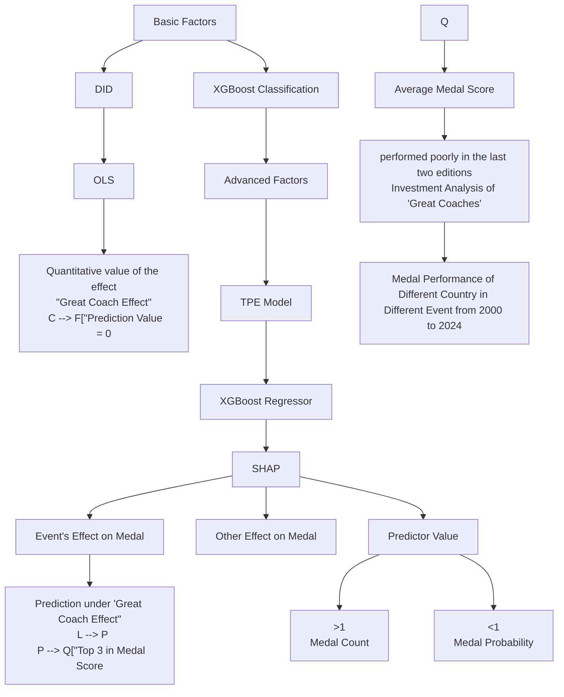
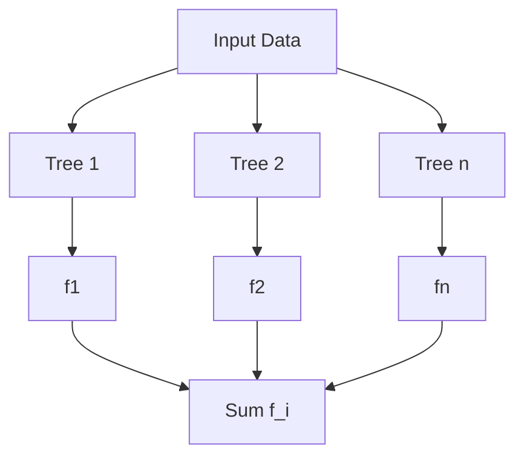
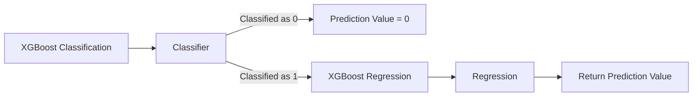

# Revealing the Hidden Forces Shaping Olympic Success Summary

Predicting the number of Olympic medals each country will win is crucial for various stakeholders. We therefore developed an Olympic medal model based on the dataset of past Olympic Games.

First, following model screening, we developed a dual-stage XGBoost model for predicting Olympic medal counts. The dual-stage XGBoost model is composed of an XGBoost binary classifier and a TPE-XGBoost regressor whose hyperparameters are optimized by the Tree-structured Parzen Estimator algorithm. The classifier serves to analyze historical data patterns in depth and effectively identify the potential competitiveness of small-scale participating countries. The regressor, on the other hand, accurately forecasts the specific number of medals for countries likely to win. Given the time-series nature of Olympic data, we employed the last-block cross-validation approach, a type of time-series cross-validation.

Second, an evaluation of the dual-stage XGBoost model's prediction performance was carried out. The model demonstrated outstanding performance in predicting the 2021 and 2024 Olympic Games, achieving a classification accuracy of 95% and an overall prediction accuracy of 68%, significantly outperforming existing Olympic prediction models. Confidence interval estimation was conducted using the non-parametric Bootstrap method. After 1000 iterative verifications, the model's sample coverage probability exceeded 0.95, and the probability that the predicted values fell within the confidence interval was over 70%. Based on these results, we predicted the medal distribution for the 2028 Olympic Games. Moreover, we innovatively combined the classifier and regressor to quantify the first-time medal-winning probability of small Olympic countries. Simultaneously, SHAP value analysis was utilized to uncover the contribution of different events to each country's medal-winning.

Third, we quantified the Olympic medal-winning scores and then developed a difference-in-differences model. The double-difference term incorporated in this model effectively controlled interfering variables other than the coach factor. For the Chinese and Dutch teams, the p-values of the regression coefficient tests of the model were 0.03 and 0.05 respectively, both reaching the significance level, providing reliable statistical evidence for the existence of the “great coach” effect. When applying this model to relevant projects of other countries, the predicted medal-number growth trend was highly consistent with the actual situation.

Finally, the SHAP Summary Plot was utilized to analyze the mechanism through which the standardized number of participants affects the number of Olympic medals. Based on this, a two-track optimization strategy was proposed: strategically expanding the overall participation scale while focusing on developing emerging projects with potential competitive advantages.

In addition, a sensitivity analysis was conducted to assess the model's responsiveness to changes in input parameters. The results indicated that the model exhibited high accuracy and robustness in handling diverse scenarios.

Keywords: Dual-stage XGBoost; Non-parametric Bootstrap algorithm; DID model; SHAP model

# Table of Contents

# 1 Introduction....3

1.1 Problem Background ....3  
1.2 Restatement of the Problem....3  
1.3 Our Work....4

# 2 Assumptions and Justifications....4

# 3 Notations ....5

# 4 Model Preparation ......5

4.1 Data Pre-processing ....5

# 5 Model I: Dual-staged XGBoost Medal Prediction....6

5.1 Parameterization of Influencing Factors 6  
5.2 Developing of the XGBoost Classifier 8  
5.3 Developing of the TPE-XGBoost Regressor ....9

# 6 Evaluation and Application of the Dual-Stage XGBoost Model ....12

6.1 Model Evaluation Metrics....12  
6.2 Evaluation of Model Prediction Accuracy....12  
6.3 Solving Confidence Intervals with the Non-parametric Bootstrap Algorithm ....13  
6.4 Application and Analysis of the Model for the 2028 Olympics....15  
6.5 Analysis of the Correlation between China-US Olympic Medals and Events Based on SHAP Values....16

# 7 Model II: DID Regression Evaluating the Great Coach Effect....17

7.1 Identifying Independent Variables ....18  
7.2 DID Model Building....19  
7.3 Solution of the Model ....20

# 8 Novel Insights from SHAP Analysis in Olympic Performance....22

# 9 Sensitivity Analysis....24

# 10 Model Evaluation 24

10.1 Strengths ......24  
10.2 Weaknesses ....25

# References....25

# Report on Use of AI....26

# 1 Introduction

# 1.1 Problem Background

In 2024, people worldwide witnessed the first Olympic Games following the COVID-19 pandemic. This grand event held in Paris rekindled the public's enthusiasm for this renowned sports event and spurred the audience's anticipation for the 2028 Los Angeles Olympics, specifically, how countries would perform in the upcoming Olympics. To address this question, this paper endeavors to predict the outcomes of the next Olympics through model-building.

natural_image

Crowd cheering under a colorful smoke plume with 'LA 8' logo, palm trees in foreground (no text or symbols on main subject)

Figure 1 The handover celebration of the 2028 Los Angeles Olympics

Since Ball [1] developed a correlation-based scoring model, the methodology for predicting Olympic results has witnessed remarkable evolution. Prediction models have advanced from the early ordinary least squares regression (OLS) to a probability-model system based on the Poisson distribution, encompassing Poisson regression and negative binomial models. Recently, research has trended towards a dual-stage approach: initially estimating the probability of medal-winning and subsequently predicting the specific number of medals. The Mundlak transformation of the Tobit model and the Hurdle model are the most emblematic. Simultaneously, the dimensions of prediction data have been continuously broadened, manifested in finer-grained data, an extended time span, and diverse explanatory variables. Nevertheless, during the data-expansion process, the validity of variables and the issue of multicollinearity must be carefully considered.

# 1.2 Restatement of the Problem

Considering the information given and conditions provided in the problem statement, we conclude that 4 objectives must be completed to finish all the goals required.

Objective 1: Accurately reflect and predict the medal-less status of many countries.  
Objective 2: Build a mathematical model to evaluate if and how much “great coach” effect and other factors work.  
Objective 3: Predict changes in the role of momentum, analyze what factors influence this fluctuation, and use the conclusions to guide player play.

Objective 4: Evaluate the results of the prediction and apply them to other sports events.

# 1.3 Our Work

flowchart

Figure 2 Overview of our work

# 2 Assumptions and Justifications

We make the following basic assumptions to simplify the problem, each of which is well justified.

Assumption 1: Only consider historical medal data, event factors, and coaching; ignore external non-sports-specific factors.  
⇒ Justification: Political changes, natural disasters, and economic crises can have an impact on a country's sports development, which are difficult to predict and quantify. By focusing on historical medal-winning data, event-related factors, and coaching, we can establish a relatively stable and analyzable model.  
Assumption 2: Coaches' impacts are comparable across countries and sports, overlooking cultural differences.  
⇒ Justification: The cultural background of a coach should not have an impact on their coaching performance when working with different national teams. A committed coach is expected to provide thorough and unsparing guidance to their athletes, regardless of the country they are coaching in.

Assumption 3: Olympic event rules and scoring systems are stable.

⇒ Justification: The International Olympic Committee (IOC) has the responsibility and ability to maintain the stability of the Olympic competition rules. Over the past century or so, regardless of how turbulent the global situation has been, the competition rules have always remained immune to the influence of international political situations. This is one of the reasons why the Olympic Games have always enjoyed great trust.

Assumption 4: Based on the resolutions officially approved by the IOC, when predicting

the medal count for the 2028 Los Angeles Olympics, each of the Cricket, Squash, Baseball/Softball, Lacrosse, and Flag Football events will have 2 additional medals.

⇒ Justification: The model in this paper is built as of the current time, considering only the known event changes. The International Olympic Committee has the authority to decide on adding competition events and their associated medal arrangements. Given the available information, we only consider the approved new events and their corresponding medal increments to ensure the model is based on existing and certain data.

# 3 Notations

The key mathematical notations used in this paper are listed in Table 1.

Table 1 Notations used in this paper

<table><tr><td>Symbol</td><td>Description</td></tr><tr><td> $People_{i,t}$ </td><td>The total number of participants of country  $i$  in the Olympic Games held in year  $t$ </td></tr><tr><td> $i$ </td><td>Country number</td></tr><tr><td> $t$ </td><td>Year</td></tr><tr><td> $Host$ </td><td>Whether a country is a host country</td></tr><tr><td> $\widehat{y_1^b}$ </td><td>predicted value of the  $i$ th sample under  $b$  Bootstrap models</td></tr><tr><td> $score_i$ </td><td>The medal score in the  $i$ th year</td></tr></table>

# 4 Model Preparation

# 4.1 Data Pre-processing

# 4.1.1 Time Limitation

First, we only adapt data from 1952 onwards as the post-war period saw significant transformations in the global sports landscape with countries recovering and rebuilding their sports systems, greater standardization of sports events ensuring data comparability and reliability, an expansion of international sports participation providing a more diverse dataset.

# 4.1.2 Identification and Processing of Invalid Data

Additionally, we excluded the data of years when countries such as East Germany and Russia, which had major scandals, participated. To be specific, incidents such as large-scale boycotts as occurred at the 1980 Moscow and 1984 Los Angeles Games and the East German doping program responsible for 17 percent of the medals awarded to female athletes in 1972 skewed the medal count in the past.

# 4.1.3 Processing of NOC

We also merged the names of certain teams. For instance, "Taiwan" and "Chinese Taipei" were combined. And some countries' names have random spaces or numbers attached, which have also been processed. Furthermore, certain countries that have ceased to exist, like Yugoslavia, were excluded from our analysis.

# 4.1.4 Event Data Cleaning

Moreover, in the dataset, there was some data with format or content errors, such as some

data showing incorrect characters or being vacant. By identifying and eliminating or correcting such faulty data, we have improved the quality of the dataset and made our subsequent analysis more reliable and valid.

# 4.1.5 Processing of Participant Numbers

We not only tabulated the number of participants from each country in every event but also recorded the number of medals each event yielded. Given that the number of participants varies across different events-for instance, a football team has eleven players, which might lead to the misconception of counting 11 medals per team — we standardized the number of participants. Specifically, we set the number of participants in the team with the fewest members in a particular event as 1 and scaled down the numbers of other countries proportionally.

# 4.1.6 Processing of the Medal Standings

By collating data on athletes' participation and medal-winning, we identified a set of countries that have never won medals throughout history.

# 5 Model I: Dual-staged XGBoost Medal Prediction

Based on the theoretical frameworks of the Tobit model and the Hurdle model, this paper proposes an innovative dual-stage machine learning approach [2].

# Stage 1: Addressing the Zero-Medal Scenario

A classifier is employed to specifically address the "zero-medal problem". The significance of this design lies in its ability to effectively capture the competitive characteristics of small-scale participating countries, preventing their medal-winning potential from being masked by the data characteristics of Olympic powerhouses. By deeply analyzing the latent patterns in historical data, the classifier can identify countries on the verge of breaking through the zero-medal barrier.

# Stage 2: Medal Quantity Prediction

A regressor is then introduced to estimate the specific number of medals for countries predicted to win medals. This design avoids systematic bias that could result from directly predicting medal counts for all participating countries, thereby significantly enhancing the overall prediction accuracy of the model.

This divide-and-conquer strategy not only improves the reliability of the predictions but also offers a novel methodological perspective for future research. Subsequently, the task is to select the most appropriate model architecture from existing machine learning algorithms to handle these two prediction tasks.

# 5.1 Parameterization of Influencing Factors

In this section, we identify the core independent variables of the developed model and elaborate on their quantification methods.

# 5.1.1 Standardization of Total Participants Number

After standardization, we define the total number of participants of country i in the Olympic Games held in year t as $People_{i,t}$ . To enhance the model's interpretability and the robustness of its predictions, we apply the equal-frequency binning algorithm to discretize

People $_{i,t}$ . Specifically, we transform the continuous variable People $_{i,t}$ into the discrete variable People $_{i,discrete}$ based on the 20%, 40%, 60%, and 80% frequency quantiles. The mathematical expression is as follows:

$$
P e o p l e _ {i, t \_ d i s c r e t e} = \left\{ \begin{array}{l l} 0, & P e o p l e _ {i, t} \leq Q _ {2 0} \\ 1, & Q _ {2 0} <   P e o p l e _ {i, t} \leq Q _ {4 0} \\ 2, & Q _ {4 0} <   P e o p l e _ {i, t} \leq Q _ {6 0} \\ 3, & Q _ {6 0} <   P e o p l e _ {i, t} \leq Q _ {8 0} \\ 4, & P e o p l e _ {i, t} > Q _ {8 0} \end{array} \right. \tag {1}
$$

Here, $Q_{n}$ denotes the value of the total number of participants at the n% quantile. Due to the non-constant marginal returns between participant and medal counts, discretization enables us to abandon the constant returns assumption, thereby enhancing model robustness.

# 5.1.2 Standardization of Participants Number in Each Event

We define the standardized number of participants of country i in a particular event at the t-year Olympic Games as $People_{i,t,sport}$ , where sport represents the specific event name. This variable is a continuous variable reflecting differences in geographical conditions and sports development levels across regions.

# 5.1.3 The "Host-country Effect"

We define the "host-country effect" on country $i$ in the Olympic Games as Host. Host nations enjoy significant advantages: athletes avoid travel fatigue and benefit from venue familiarity, while potentially receiving favorable officiating decisions. The seven-year preparation period following host selection enables systematic athletic development, often yielding performance improvements in pre-host Olympics. These enhancements frequently persist in post-hosting due to elite athletes' multi-Olympic career spans.

To quantify these temporal host-country effects, we implement three binary variables [3]:

$$
H o s t _ {t} = \left\{ \begin{array}{l l} 1, & t = t _ {\text {host}} \\ 0, & \text {otherwise} \end{array} \right.
$$

$$
H o s t _ {t - 4} = \left\{ \begin{array}{l l} 1, & t = t _ {\text {host}} - 4 \\ 0, & \text {otherwise} \end{array} \right. \tag {2}
$$

$$
H o s t _ {t + 4} = \left\{ \begin{array}{l l} 1, & t = t _ {\text {host}} + 4 \\ 0, & \text {otherwise} \end{array} \right.
$$

Here, $t_{host}$ denotes the year when country i hosts the Olympics. The discrete variables $Host_{t}$ , $Host_{t-4}$ , and $Host_{t+4}$ are respectively used to capture the "host-country effect" during the hosting year, four years before, and four years after the hosting year for country i.

# 5.1.4 Host Year

We define the year of the Olympic Games as year. This variable not only captures the historical evolution of the Olympic Games' scale but also reflects the development trends of global competitive sports among countries.

# 5.1.5 Event Medal Setup

Regarding the event-specific medal setup, we denote the total number of medals allocated by the IOC for a particular sport at the t-year Olympics as $Medal_{t,sport}$ . These variable

measures event-specific competitive intensity, with variations in medal distribution significantly impacting national performance outcomes, particularly in a country's specialized events.

# 5.1.6 Number of Medals Won by Each Country in Each Event

The total number of medals that country i wins in the sport event at the t-year Olympics is defined as $Medal_{i,t,sport}$ . These metric captures both a nation's event-specific competitive strength and its strategic sports development priorities. Event-level granularity enables more precise evaluation of competitive advantages.

# 5.2 Developing of the XGBoost Classifier

XGBoost, an efficient gradient-boosting algorithm, has shown remarkable performance in supervised learning $[4]$ . Its superior predictive power and broad application scope lead us to select this algorithm for developing a binary classifier. The algorithm's schematic diagram is presented below:

flowchart

Figure 3 XGBoost schematic diagram

Specifically, XGBoost's objective function comprises two components: the loss function and the regularization term:

$$
\operatorname{obj} (\theta) = \sum_ {i = 1} ^ {n} l (y _ {i}, \hat {y} _ {i}) + \sum_ {k = 1} ^ {K} \Omega (f _ {k}) \tag {3}
$$

The loss function $l(y_{i}, \widehat{y}_{i})$ measures the discrepancy between the predicted value $\widehat{y}_{i}$ and the true value $y_{i}$ . The regularization term $\sum_{k=1}^{K} \Omega(f_{k})$ controls the model's complexity. The model's predicted value is the sum of the predictions from K decision trees:

$$
\hat {y} _ {i} = \sum_ {k = 1} ^ {K} f _ {k} (x _ {i}), f _ {k} \in \mathcal {F} \tag {4}
$$

Where $f_{k}(x_{i})$ denotes the prediction of the kth decision tree for sample $x_{i}$ . The XGBoost model generates the final prediction by aggregating the forecasts of multiple decision trees. Each decision tree, to some degree, captures diverse patterns and characteristics.

When building a medal-number classifier using the XGBoost model, we need to binarize the total number of medals won by different countries. For country i's performance at the t year Olympics, we define the binary variable as:

$$
y _ {i, t} = \left\{ \begin{array}{l l} 1, & \text {if} \sum_ {\text {sport}} \text {Medal} _ {i, t, \text {sport}} > 0 \\ 0, & \text {if} \sum_ {\text {sport}} \text {Medal} _ {i, t, \text {sport}} = 0 \end{array} \right. \tag {5}
$$

To optimize the binary classifier's performance and address the data imbalance between large and small participating countries, thereby better capturing the competitive characteristics of small-scale participants, we only consider four indicators—People $_{i,t}$ , People $_{i,t,sport}$ , Host, and year—as independent variables. By incorporating the dependent variables $y_{i,t}^{gold}$ , $y_{i,t}^{silver}$ , and $y_{i,t}^{bronze}$ into the objective function for XGBoost model training, we obtain three target binary classifiers.

To systematically evaluate the classifier's performance, we take total-medal prediction as an example and compare three models: XGBoost, binary logistic regression, and random forest. We use the ROC (Receiver Operating Characteristic) curve as an evaluation tool, which comprehensively reflects the binary-classification model's discriminatory ability under different decision thresholds $[5]$ . The resulting ROC curve is as follows:

XGBoost  

roc

| False Positive Rate | True Positive Rate (Test ROC curve) | True Positive Rate (Random Guess) |
| --- | --- | --- |
| 0.0 | 0.0 | 0.0 |
| ~0.01 | ~0.42 | ~0.01 |
| ~0.02 | ~0.62 | ~0.02 |
| ~0.03 | ~0.72 | ~0.03 |
| ~0.05 | ~0.82 | ~0.05 |
| ~0.08 | ~0.88 | ~0.08 |
| ~0.10 | ~0.92 | ~0.10 |
| ~0.15 | ~0.95 | ~0.15 |
| ~0.20 | ~0.98 | ~0.20 |
| ~0.25 | 1.0 | ~0.25 |
| 1.0 | 1.0 | 1.0 |

Random Forest  

roc

| False Positive Rate | True Positive Rate (Test ROC curve) | True Positive Rate (Random Guess) |
| --- | --- | --- |
| 0.0 | 0.0 | 0.0 |
| ~0.05 | ~0.6 | ~0.05 |
| ~0.1 | ~0.65 | ~0.1 |
| ~0.2 | ~0.75 | ~0.2 |
| ~0.3 | ~0.85 | ~0.3 |
| ~0.4 | ~0.9 | ~0.4 |
| ~0.5 | ~0.92 | ~0.5 |
| ~0.6 | ~0.95 | ~0.6 |
| ~0.7 | ~0.96 | ~0.7 |
| ~0.8 | ~0.98 | ~0.8 |
| 1.0 | 1.0 | 1.0 |

Multiple Logistic Regression  

roc

| False Positive Rate | True Positive Rate (Test ROC curve) | True Positive Rate (Random Guess) |
| --- | --- | --- |
| 0.0 | 0.0 | 0.0 |
| ~0.02 | ~0.2 | ~0.02 |
| ~0.05 | ~0.4 | ~0.05 |
| ~0.1 | ~0.55 | ~0.1 |
| ~0.15 | ~0.6 | ~0.15 |
| ~0.2 | ~0.7 | ~0.2 |
| ~0.3 | ~0.8 | ~0.3 |
| ~0.4 | ~0.85 | ~0.4 |
| ~0.5 | ~0.9 | ~0.5 |
| ~0.6 | ~0.92 | ~0.6 |
| ~0.7 | ~0.93 | ~0.7 |
| ~0.8 | ~0.94 | ~0.8 |
| ~0.9 | ~0.95 | ~0.9 |
| 1.0 | 1.0 | 1.0 |

Figure 4 ROC curves of three models

Experimental results show that the XGBoost model significantly outperforms the others in classification, with the highest AUC (Area Under Curve) value of 0.957. This indicates a 95.7% accuracy in distinguishing between countries that "won gold medals" and those that "did not". This highly accurate prediction not only validates XGBoost's excellence in handling complex non-linear classification problems but also shows its ability to effectively capture multidimensional factors influencing Olympic medal winning. Based on these findings, choosing XGBoost as the final classifier is well-supported empirically.

# 5.3 Developing of the TPE-XGBoost Regressor

Next, we aim to build a machine-learning regressor for the countries predicted to win medals by the classifier. To enhance the regressor's prediction accuracy, we select six indicators —People $_{i,t}$ ,People $_{i,t,sport}$ , Host, year, Medal $_{t,sport}$ , and Medal $_{i,t,sport}$ —as independent variables for precise model development. Given the continuous nature of Olympic medal-count prediction, we adopt the mean squared error as the loss function:

$$
l (y _ {i}, \hat {y} _ {i}) = (y _ {i} - \hat {y} _ {i}) ^ {2} \tag {6}
$$

As every machine-learning regressor involves a set of hyperparameters, when the dimensionality of our independent variables is high, the proper setting of hyperparameters significantly affects the model's prediction accuracy and generalizability $[6]$ . Commonly used hyperparameter optimization methods include grid search (GS) and random search (RS). However, these two methods demand substantial computational resources $[7, 8]$ . Therefore, we employ the Bayesian algorithm, specifically the Tree-structured Parzen Estimator (TPE), to develop a TPE-XGBoost model for optimizing XGBoost's feature selection and hyperparameter tuning.

We continuously optimize the hyperparameter configuration, such as the maximum tree depth, learning rate, and minimum child weight, using TPE. This optimization process adaptively balances the model's fitting capacity and generalization performance.

To evaluate the machine-learning results, we introduce the coefficient of determination $R^2$ :

$$
R ^ {2} = 1 - \frac {\sum_ {i = 1} ^ {n} \left(y _ {i} - \hat {y} _ {i}\right) ^ {2}}{\sum_ {j = 1} ^ {n} \left(y _ {i} - \bar {y}\right) ^ {2}} \tag {7}
$$

For the XGBoost model, we obtain the changes in $R^{2}$ of the prediction regression models for gold, silver, and bronze medals after TPE hyperparameter optimization, as presented in the following table:

Table 2 ${R}^{2}$ of the prediction regression model

<table><tr><td></td><td>Before Optimization</td><td>After Optimization</td></tr><tr><td>Gold</td><td>0.910</td><td>0.938</td></tr><tr><td>Silver</td><td>0.828</td><td>0.905</td></tr><tr><td>Bronze</td><td>0.841</td><td>0.893</td></tr></table>

To further prevent overfitting, we divide the dataset into a training set and a validation set using cross-validation. The training data is used to train the model, while the validation data is employed to ensure the model's ability to generalize beyond the training sample. Given the temporal evolution and dependency between the independent and dependent variables in this regression model, randomly splitting the dataset to build the model is inappropriate. Thus, we adopt the last block cross-validation method, which takes the time series into account by using the most recent data points as test data. This is reflected in our approach to using data from the 2008-2021 Olympic Games as the training set to predict the medal table of the 2024 Olympic Games when selecting the best machine-learning model to develop the regressor, as shown in the following figure:

state_timeline

| Category | Training Phase | Start Year | End Year |
| --- | --- | --- | --- |
| Training of Different Models | Train | 2008 | 2024 |
| Training of Different Models | Train | 2008 | 2024 |
| Training of Different Models | VaL | 2024 | 2028 |
| Model Benchmarking | Train | 1952 | 2018 |
| Model Benchmarking | Train | 1952 | 2024 |
| Model Benchmarking | Test | 2018 | 2024 |
| Forecasting | Train | 1952 | 2028 |
| Forecasting | F.c. | 2028 | 2028 |

Figure 5 Model selecting, benchmarking and applying

We selected the Random Forest and Multiple Logistic Regression models for comparative analysis. The following is the visualized chart of $R^2$ for the three different models after

TPE hyperparameter optimization:  
  
Figure 6 Visualization of 3 models' $R^2$

Based on the $R^{2}$ values of the test and training sets, the XGBoost model exhibits the best performance. In gold-medal prediction, XGBoost achieves a test-set $R^{2}$ of 0.938 and a training – set $R^{2}$ of 0.983. The random forest model, in contrast, has a test-set $R^{2}$ of 0.724, while the linear regression model only reaches 0.570, indicating a significant performance disparity. This superiority is also evident in the prediction of silver and bronze medals.

Observing the scatter-point distribution, the prediction points of the XGBoost model are more closely clustered around the diagonal, suggesting the highest consistency between predicted and actual values. Particularly when predicting many medals, XGBoost shows significantly less prediction deviation than the other two models.

Based on the width of the confidence interval, the XGBoost model yields the narrowest confidence band for its predictions, reflecting the highest level of stability and reliability.

Finally, a dual-stage XGBoost framework can be established, where the first stage employs an XGBoost classifier for preliminary screening, followed by a second stage utilizing a TPE-XGBoost regressor for precise prediction. The detailed workflow is illustrated as follows:

flowchart

Figure 7 Visualization of a dual-stage XGBoost's workflow

# 6 Evaluation and Application of the Dual-Stage XGBoost Model

# 6.1 Model Evaluation Metrics

To further quantitatively assess the medal-prediction performance of the dual-stage XGBoost model, we introduce four evaluation parameters, $M_{1} - M_{4}$ .

- $M_{1}$ is the overall prediction accuracy, used to evaluate the model's overall prediction capability.  
- $M_2$ refers to the prediction accuracy for medal-winning countries, measuring how accurately the model predicts countries that will win medals.  
- $M_3$ represents the prediction accuracy for zero-medal countries, evaluating the model's prediction accuracy for countries that won't win any medals.  
- $M_4$ is the accuracy within the $95\%$ confidence interval, which gauges the stability and reliability of the model's predictions.

$$
M _ {1} = \frac {\text {Correct} _ {\text {total}}}{\text {Nations} _ {\text {total}}}, \quad M _ {2} = \frac {\text {Correct} _ {\text {nonzero}}}{\text {Nations} _ {\text {medal}}} \tag {8}
$$

$$
M _ {3} = \frac {\text {Correct} _ {\text {zero}}}{\text {Nations} _ {\text {zero}}}, \quad M _ {4} = \frac {\text {Nations} _ {\text {confidence}}}{\text {Nations} _ {\text {total}}} \tag {8}
$$

Here, $Correct_{total}$ denotes the total number of countries for which the medal count is accurately predicted. $Nations_{total}$ stands for the total number of countries included in the prediction. $Correct_{nonzero}$ represents the number of countries for which medal-winning is accurately predicted, while $Nations_{medal}$ is the total number of countries that actually win medals. $Correct_{zero}$ is the number of countries for which zero-medal status is accurately predicted, and $Nations_{zero}$ is the total number of countries with zero medals in reality. $Nations_{confidence}$ refers to the number of countries whose predicted values fall within the 95% confidence interval.

# 6.2 Evaluation of Model Prediction Accuracy

Subsequently, the dual-stage XGBoost model is evaluated by continuously applying the

last block cross-validation method. To be specific, the data from the Olympic Games held between 1952 and 2016 are utilized to build a training set. After that, the trained model is employed to predict the medal distribution of the 2021 Tokyo Olympics.

Following this, the actual data of the 2021 Tokyo Olympics are incorporated into the training set. The model is then retrained to predict the medal distribution of the 2024 Paris Olympics. The detailed process is depicted in Figure 5 Model selecting, benchmarking and applying.

Based on the quantitative assessment results of the dual-stage XGBoost model, we conduct a systematic analysis of the prediction performance for the 2020 Tokyo Olympics and the 2024 Paris Olympics. Table below presents the prediction accuracy indicators $(M_{1} - M_{3})$ for different medal levels.

Table 3 Evaluation Results of Prediction Performance for the 2020 and 2024 Olympics

<table><tr><td></td><td colspan="3">2020 Tokyo</td><td colspan="3">20204 Paris</td></tr><tr><td>Prediction</td><td> $M_1$ </td><td> $M_2$ </td><td> $M_3$ </td><td> $M_1$ </td><td> $M_2$ </td><td> $M_3$ </td></tr><tr><td>Gold</td><td>59%</td><td>11%</td><td>92%</td><td>68%</td><td>22%</td><td>95%</td></tr><tr><td>Silver</td><td>61%</td><td>14%</td><td>92%</td><td>63%</td><td>19%</td><td>95%</td></tr><tr><td>Bronze</td><td>57%</td><td>13%</td><td>92%</td><td>68%</td><td>17%</td><td>95%</td></tr></table>

Quantitative analysis reveals that the model's prediction accuracy for the 2024 Paris Olympics far exceeds that for the 2020 Tokyo Olympics. We can attribute this variance in prediction precision to the unique impact of the COVID-19 pandemic on the 2021 Olympics. The pandemic significantly altered the training schedules and preparatory strategies of participating countries.

Notably, the 2024-oriented prediction model demonstrates astonishing accuracy. For instance, in gold-medal prediction, our dual-stage XGBoost model significantly outperforms current mainstream prediction models, such as the Dual-staged Random Forest and Tobit models $[9]$ , in terms of both gold-medal prediction accuracy (68%) and range prediction accuracy (22%).

# 6.3 Solving Confidence Intervals with the Non-parametric Bootstrap Algorithm

When evaluating the confidence intervals of neural network models, traditional approaches predominantly rely on the Delta method and the Mean-Variance Estimation (MVE) method. However, these methods exhibit limitations such as high computational costs and low coverage rates in practical applications $[10]$ .

Given that machine-learning prediction results typically do not conform to the normal-distribution assumption and are influenced by multiple non-linear factors, this study employs the non-parametric Bootstrap method to develop the confidence interval for the regressor part within the dual-stage XGBoost model.

During the model-building process, we generate B Bootstrap samples. In this paper, B is set to 1000. For each sample, we train an XGBoost model to obtain the predicted value $\widehat{y_{1}^{b}}$ of the ith sample under b Bootstrap models. Then, we calculate the model's variance $\widehat{\sigma_{\hat{y}}^{2}}$ and regression mean $\hat{y}$ as follows:

$$
\hat {y} _ {i} = \frac {1}{B} \sum_ {b = 1} ^ {B} \hat {y} _ {i} ^ {b}, \quad \hat {\sigma} _ {y, i} ^ {2} = \frac {1}{B - 1} \sum_ {b = 1} ^ {B} (\hat {y} _ {i} ^ {b} - \hat {y} _ {i}) ^ {2} \tag {9}
$$

Next, we estimate the error variance $\sigma_{\mathrm{e}}^{2}$ using the data from the validation set.

$$
\sigma_ {e, i} ^ {2} = \max ((y _ {i} - \hat {y} _ {i}) ^ {2} - \hat {\sigma} _ {\hat {y}, i} ^ {2}, 0) \tag {10}
$$

Finally, for a new observation i, we develop its $(1 - \alpha) \times 100\%$ prediction interval as:

$$
\left[ \hat {y} _ {i} \pm t _ {1 - \text {alpha/2}} \sqrt {\hat {\sigma} _ {\hat {y} , i} ^ {2} + \sigma_ {e , i} ^ {2}} \right] \tag {11}
$$

Here, $\alpha$ represents the significance level. Since we are conducting an evaluation with a 95% confidence factor, $\alpha$ is set to 0.05. $t_{1-\alpha/2}$ is the critical value of the t-distribution with $(B-1)$ degrees of freedom.

To assess the performance of this prediction interval, we use the Prediction Interval Coverage Probability (PICP), calculated as follows:

$$
P I C P = \frac {1}{n} \sum_ {i = 1} ^ {n} c _ {i} \tag {12}
$$

where $c_{i}=1$ when the actual value falls within the prediction interval, and $c_{i}=0$ otherwise.

After 1000 rounds of Bootstrap-sample training, the PICP values of the dual-stage XGBoost model all exceed 0.95, validating the reliability of the confidence-interval estimation.

We conduct a visual analysis of the prediction interval, taking the gold-medal prediction of the 2020 Tokyo Olympics as an example.

line

| Country | Actual Gold | Predicted Gold | Gold Prediction Interval (Lower) | Gold Prediction Interval (Upper) |
| --- | --- | --- | --- | --- |
| 1 | 0 | 0 | 0 | 0 |
| 2 | 2 | 1 | 0 | 1 |
| 3 | 1 | 1 | 0 | 1 |
| 4 | 0 | 0 | 0 | 0 |
| 5 | 18 | 18 | 18 | 22 |
| 6 | 2 | 2 | 2 | 2 |
| 7 | 2 | 2 | 2 | 3 |
| 8 | 3 | 3 | 3 | 3 |
| 9 | 3 | 3 | 3 | 3 |
| 10 | 0 | 0 | 0 | 0 |
| 11 | 9 | 9 | 9 | 11 |
| 12 | 1 | 1 | 1 | 1 |
| 13 | 40 | 40 | 40 | 40 |
| 14 | 2 | 2 | 2 | 2 |
| 15 | 0 | 0 | 0 | 0 |
| 16 | 2 | 2 | 2 | 2 |
| 17 | 2 | 2 | 2 | 2 |
| 18 | 3 | 3 | 3 | 3 |
| 19 | 1 | 1 | 1 | 1 |
| 20 | 1 | 1 | 1 | 1 |
| 21 | 1 | 1 | 1 | 1 |
| 22 | 1 | 1 | 1 | 1 |
| 23 | 1 | 1 | 1 | 1 |
| 24 | 1 | 1 | 1 | 1 |
| 25 | 1 | 1 | 1 | 1 |
| 26 | 1 | 1 | 1 | 1 |
| 27 | 1 | 1 | 1 | 1 |
| 28 | 1 | 1 | 1 | 1 |
| 29 | 1 | 1 | 1 | 1 |
| 30 | 16 | 16 | 16 | 16 |
| 31 | 3 | 3 | 3 | 3 |
| 32 | 12 | 12 | 12 | 12 |
| 33 | 14 | 14 | 14 | 14 |
| 34 | 1 | 1 | 1 | 1 |
| 35 | 1 | 1 | 1 | 1 |
| 36 | 2 | 2 | 2 | 2 |
| 37 | 6 | 6 | 6 | 6 |
| 38 | 0 | 0 | 0 | 0 |
| 39 | 2 | 2 | 2 | 2 |
| 40 | 3 | 3 | 3 | 3 |
| 41 | 4 | 4 | 4 | 4 |
| 42 | 1 | 1 | 1 | 1 |
| 43 | 12 | 12 | 12 | 12 |
| 44 | 1 | 1 | 1 | 1 |
| 45 | 1 | 1 | 1 | 1 |
| 46 | 20 | 20 | 20 | 25 |
| 47 | 0 | 0 | 0 | 0 |
| 48 | 1 | 1 | 1 | 1 |
| 49 | 4 | 4 | 4 | 4 |
| 50 | 0 | 0 | 0 | 0 |
| 51 | 0 | 0 | 0 | 0 |
| 52 | 0 | 0 | 0 | 0 |
| 53 | 0 | 0 | 0 | 0 |
| 54 | 0 | 0 | 0 | 0 |
| 55 | 0 | 0 | 0 | 0 |
| 56 | 0 | 0 | 0 | 0 |
| 57 | 15 | 15 | 15 | 15 |
| 58 | 10 | 10 | 10 | 10 |
| 59 | 0 | 0 | 0 | 0 |
| 60 | 4 | 4 | 4 | 4 |
| 61 | 1 | 1 | 1 | 1 |
| 62 | 0 | 0 | 0 | 0 |
| 63 | 2 | 2 | 2 | 2 |
| 64 | 1 | 1 | 1 | 1 |
| 65 | 1 | 1 | 1 | 1 |
| 66 | 3 | 3 | 3 | 3 |
| 67 | 1 | 1 | 1 | 1 |
| 68 | 3 | 3 | 3 | 3 |
| 69 | 1 | 1 | 1 | 1 |
| 70 | 1 | 1 | 1 | 1 |
| 71 | 13 | 13 | 13 | 13 |
| 72 | 5 | 5 | 5 | 5 |
| 73 | 4 | 4 | 4 | 4 |
| 74 | 1 | 1 | 1 | 1 |
| 75 | 1 | 1 | 1 | 1 |
| 76 | 1 | 1 | 1 | 1 |
| 77 | 1 | 1 | 1 | 1 |
| 78 | 1 | 1 | 1 | 1 |
| 79 | 19 | 19 | 19 | 19 |
| 80 | 32 | 32 | 32 | 39 |
| 81 | 19 | 19 | 19 | 19 |
| 82 | 1 | 1 | 1 | 1 |
| 83 | 1 | 1 | 1 | 1 |
| 84 | 1 | 1 | 1 | 1 |
| 85 | 1 | 1 | 1 | 1 |
| 86 | 19 | 19 | 19 | 19 |
| 87 | 19 | 19 | 19 | 19 |
| 88 | 8 | 8 | 8 | 8 |
| 89 | 0 | 0 | 0 | 0 |
| 90 | 27 | 27 | 27 | 34 |

Figure 8 Visualization of prediction interval

Evidently, for countries with a relatively small number of medals per year, the probability that their actual results fall within the predicted confidence interval is markedly higher than that of Olympic powerhouses.

This phenomenon is attributed to the algorithmic features of the machine-learning model. When handling data points distant from the main sample distribution, the model tends to treat them as potential outliers, thereby moderately reducing the degree of fitting to these extreme situations.

Subsequently, we calculate the $M_4$ values for the 2020 Tokyo Olympics and the 2024 Paris Olympics, as presented in the following table:

Table 4 Comparison of Prediction Interval Coverage Rates ( $M_{4}$ ) for the 2020 and 2024 Olympics

<table><tr><td></td><td>Gold Model</td><td>Silver Model</td><td>Bronze Model</td></tr><tr><td>2020 Tokyo</td><td>72%</td><td>75%</td><td>71%</td></tr><tr><td>2024 Paris</td><td>82%</td><td>81%</td><td>78%</td></tr></table>

The relatively high $M_{4}$ values suggest that the model can reliably capture the underlying patterns of Olympic medal counts.

Considering the sociological impact of the pandemic, the data for 2024 outperform those for 2021.

# 6.4 Application and Analysis of the Model for the 2028 Olympics

# 6.4.1 Prediction of Olympic Medal Counts and Confidence Intervals

Finally, we use the dataset from 1952 to 2024 to build the final dual-stage XGBoost prediction model and calculate the confidence interval with the non-parametric Bootstrap algorithm. The resulting table is presented below:

Table 5 Prediction Results and Confidence Intervals of Medals for 2028 Olympics

<table><tr><td>Rank</td><td>Team</td><td>Gold</td><td>Silver</td><td>Bronze</td><td>Total</td><td>95% CI Gold</td><td>95% CI Silver</td><td>95% CI Bronze</td></tr><tr><td>1</td><td>USA</td><td>45</td><td>48</td><td>49</td><td>142</td><td>[39.7, 51.0]</td><td>[42.0, 54.0]</td><td>[43.2, 55.0]</td></tr><tr><td>2</td><td>CHN</td><td>40</td><td>27</td><td>24</td><td>91</td><td>[35.0, 46.0]</td><td>[23.0, 31.0]</td><td>[20.0, 27.0]</td></tr><tr><td>3</td><td>JPN</td><td>20</td><td>12</td><td>13</td><td>45</td><td>[17.0, 23.0]</td><td>[10.0, 14.0]</td><td>[11.0, 15.0]</td></tr><tr><td>4</td><td>AUS</td><td>18</td><td>19</td><td>16</td><td>53</td><td>[15.0, 21.0]</td><td>[16.0, 22.0]</td><td>[13.0, 18.0]</td></tr><tr><td>5</td><td>FRA</td><td>16</td><td>26</td><td>22</td><td>64</td><td>[13.0, 18.0]</td><td>[22.0, 30.0]</td><td>[19.0, 25.0]</td></tr></table>

By systematically comparing the actual results of the 2024 Olympics with the predicted results of the 2028 Olympics, we can observe the dynamic evolution of the Olympic competitive landscape, as the table shown below:

Table 6 Typical cases of predicted increases and decreases in the number of medals

<table><tr><td rowspan="2"></td><td colspan="5">Increased Cases</td><td colspan="5">Decreased Cases</td></tr><tr><td>REF</td><td>USA</td><td>ROM</td><td>SRB</td><td>AZE</td><td>KOR</td><td>KEN</td><td>IRI</td><td>BUL</td><td>CUB</td></tr><tr><td>2024</td><td>1</td><td>126</td><td>9</td><td>5</td><td>7</td><td>32</td><td>11</td><td>12</td><td>7</td><td>9</td></tr><tr><td>2028</td><td>4</td><td>142</td><td>19</td><td>10</td><td>9</td><td>25</td><td>7</td><td>9</td><td>5</td><td>8</td></tr><tr><td>Dif.</td><td>3</td><td>16</td><td>10</td><td>5</td><td>2</td><td>-7</td><td>-4</td><td>-3</td><td>-2</td><td>-1</td></tr></table>

# 6.4.2 Quantitative Analysis of First-Medal-winning Probability

In the Dual-stage XGBoost model, we developed an accurate probability assessment mechanism to quantify the likelihood of small participating countries winning their first Olympic medal.

For countries classified as having no winning possibility by the classifier (Classify(i) = 0), we directly assign a winning probability of 0. For countries classified as having winning potential (Classify(i) = 1), we transform the probability based on the predicted value of the regressor. If the regression-predicted value is less than 1, it is directly taken as the winning probability. If the predicted value is greater than 1, we consider it a certain-winning event and set the probability to 100%. For any country i that has never won an Olympic medal, the probability $P(\text{FirstMedal}|i)$ of winning its first Olympic medal is defined as:

$$
P (F i r s t M e d a l | i) = \left\{ \begin{array}{l l} 0, & \text {Classify} (i) = 0 \\ \text {Regression} (i), & 0 <   \text {Regression} (i) \leq 1 \text {and} \text {Classify} (i) = 1 \\ 1, & \text {Regression} (i) > 1 \text {and} \text {Classify} (i) = 1 \end{array} \right. \tag {13}
$$

Where $Classify(i)$ reflects the binary-classification result of the classifier, and $Regression(i)$ represents the predicted value of the regressor.

Based on this framework, we set the winning-probability threshold at 0.2. When $P(\text{FirstMedal}|i) > 0.2$ , we consider the country to have significant potential to win medals in the next Olympics, as shown in table below:

Table 7 Probability Analysis of Countries with Significant Potential to Win Their First Medal

<table><tr><td>NOC</td><td>NGA</td><td>EST</td><td>LAT</td><td>FIN</td><td>VEN</td><td>MNE</td><td>KSA</td><td>SYR</td><td>PRY</td></tr><tr><td>P(FirstMedal|i)</td><td>0.76</td><td>0.48</td><td>0.45</td><td>0.44</td><td>0.40</td><td>0.35</td><td>0.28</td><td>0.25</td><td>0.20</td></tr></table>

# 6.5 Analysis of the Correlation between China-US Olympic Medals and Events Based on SHAP Values

SHAP (Shapley Additive Explanations), a sophisticated machine-learning model interpretation tool, can effectively quantify the contribution of features to prediction results.

Given that the XGBoost model intrinsically supports the calculation and integration of SHAP values, this study opts to apply it to explore the underlying relationship between event settings and a country's medal attainment [11].

Taking the prediction of the 2028 Olympics as an instance, we performed a SHAP-value analysis of the number of gold medals $Medal_{i,t,sport}^{gold}$ that China and the United States are expected to win in each event:

Total Impact of Features on Medal Predictions  

bar

| Category | USA | CHN |
| --- | --- | --- |
| country_Swimming | ~0.31 | ~0.31 |
| country_Shooting | ~0.26 | ~0.31 |
| country_Wrestling | ~0.23 | ~0.22 |
| country_Artistic Swimming | ~0.09 | ~0.08 |
| country_Basketball | ~0.08 | ~0.02 |
| country_Weightlifting | ~0.07 | ~0.24 |
| country_Diving | ~0.07 | ~0.28 |
| country_Golf | ~0.06 | ~0.09 |
| country_Badminton | ~0.02 | ~0.16 |

Figure 9 Comparison of the SHAP Value Distributions of Olympic Events' Contribution to Gold Medals in China and the United States

The SHAP value magnitude directly reflects the influence degree of a specific event on a

country's gold-medal winning. For instance, the United States shows the largest SHAP value in the Athletics event, while China's SHAP value in this event is relatively small. This disparity indicates that the United States enjoys a significant competitive advantage in Athletics.

Conversely, in the Weightlifting and Diving events, China demonstrates significantly higher SHAP values than the United States, suggesting that these are China's traditional strong-suit events.

To gain a deeper understanding of how event settings affect different countries, we carried out a more meticulous study. We used the SHAP method to conduct a quantitative analysis of the silver-medal prediction models for the 2028 Olympics in China and the United States. Figures below respectively present the waterfall plots of event contribution levels for the United States and China:

line

| Category | Value |
| --- | --- |
| USA_Wrestling | 7 |
| USA_Swimming | 69 |
| USA_Shooting | 6 |
| USA_Athletics | 58 |

Figure 10 Analysis of the SHAP-value Waterfall Plot for U.S. 2028 Olympics Silver-medal Prediction

We can observe from the SHAP-value distribution of the United States (Figure 6.6) that the Swimming and Athletics events make significant positive contributions, with their SHAP values markedly higher than those of other events. This distribution feature indicates that the United States retains a strong competitive edge in these traditional advantageous events.

Observing from the SHAP-value distribution of the United States, the Swimming and Athletics events exhibit significant positive contributions, with their SHAP values markedly higher than those of other events. This distribution feature reveals that the United States retains a strong competitive edge in these traditional strong-suit events.

funnel

| Category | Value |
| --- | --- |
| fN_Wrestling | 5 |
| CHN_Badminton | 9 |
| CHN_Athletics | 4 |
| CHN_Boxing | 5 |
| CHN_Weightlifting | 5 |
| CHN_Swimming | 36 |
| CHN_Shooting | 12 |

Figure 11 Analysis of the SHAP-value Waterfall Plot for U.S. 2028 Olympics Silver-medal Prediction

In contrast, the SHAP-value distribution in China presents a distinct pattern. The Swimming and Shooting events exert the most significant positive influences, suggesting a strong positive correlation with China's silver-medal-winning probability. This reflects the crucial importance of these events for China to achieve excellent results.

A comparative analysis reveals significant differences in the composition of advantageous events among different countries, which directly impacts their overall Olympic performance. The historical performance and development potential of an event are mirrored in the prediction model through the SHAP-value magnitude.

However, a country's final Olympic achievements are related not only to its own advantageous event types but also, to a greater extent, to the total number of medals allocated to each event in the Olympics. For events with a relatively large number of total medals, a country's investment in the development of these events is more likely to boost its final medal count.

# 7 Model II: DID Regression Evaluating the Great Coach Effect

The “great coach” effect means that outstanding coaches can inspire the potential of

teams or individuals through professional guidance, enabling them to surpass their limits and achieve remarkable results. Nevertheless, a country's medal count is influenced by multiple factors, including the host-country effect and athlete turnover.

# 7.1 Identifying Independent Variables

To precisely verify and quantify the great coach effect, we first identify the independent variables necessary for developing this model:

# 7.1.1 Calculation of medal scores

For each athlete's medal results, we convert medal types into numerical values using mapping rules to facilitate subsequent statistical analysis. The specific mapping rules are as follows:

$$
\text {Score} _ {i} = \left\{ \begin{array}{l l} 0, & \text {Medal} _ {i} = \text {"No Medel"} \\ 1, & \text {Medal} _ {i} = \text {"Bronze"} \\ 2, & \text {Medal} _ {i} = \text {"Silver"} \\ 3, & \text {Medal} _ {i} = \text {"Gold"} \end{array} \right. \tag {14}
$$

These rules transform medal types into numerical values, facilitating quantitative processing. Subsequently, we group the data by year and calculate the total medal score

TotalScore $_{year}$ for each year:

$$
\text {TotalScore} _ {\text {year}} = \sum_ {i = 1} ^ {n} \text {Score} _ {i} \tag {15}
$$

Where i represents the ith athlete in that year, and n is the total number of athletes competing that year. Using this approach, we can obtain the annual total medal score of the Chinese men's table-tennis team at the Olympics.

# 7.1.2 Development of the "Coaching Status" Variable

To assess the coaching impact of Coach Alyson Annan, following the development of previous variables, we define a new variable, "Coaching Status". This variable is determined based on whether Alyson Annan coached the Chinese and Dutch women's hockey teams in a given year, as described by the following formulas:

For the Chinese women's hockey team, we define the variable Coach\_China:

$$
\text {Coach\_China} = \left\{ \begin{array}{l l} 0, & \text {Year} <   2 0 2 2 \\ 1, & \text {Year} \geq 2 0 2 2 \end{array} \right. \tag {16}
$$

For the Dutch women's hockey team, we define the variable Coach\_Netherlands:

$$
\text {Coach\_Netherlands} = \left\{ \begin{array}{l l} 0, & \text {Year} <   2 0 1 5 \\ 1, & 2 0 1 5 \leq \text {Year} <   2 0 2 2 \\ 0, & \text {Year} \geq 2 0 2 2 \end{array} \right. \tag {17}
$$

Using these variables, we can partition the data into pre-coaching and post-coaching segments, which will serve as the basis for subsequent hypothesis testing.

line

| Year | Dutch's Medal Count::Actual | Dutch's Medal Count::Predicted | China's Medal Count::Actual | China's Medal Count::Predicted |
| --- | --- | --- | --- | --- |
| 2000 | ~16 | ~16 | 0 | 0 |
| 2004 | ~32 | ~32 | 0 | 0 |
| 2008 | ~48 | ~48 | ~32 | ~32 |
| 2012 | ~48 | ~48 | 0 | 0 |
| 2016 | ~32 | ~28 | 0 | 0 |
| 2020 | ~54 | ~49 | 0 | 0 |
| 2024 | ~51 | ~51 | ~34 | ~29 |

Figure 12 Pre-coaching and post-coaching medal count comparison

Through these steps, we have processed the data on Chinese and Dutch women's hockey teams from 1988 to 2024 in the summerOly\_athletes dataset. The processed data now includes the total medal scores and "Coaching Status" identifiers, providing the necessary data foundation for developing and analyzing a difference-in-differences model. This pre-processing step ensures data consistency and reliability, which is crucial for quantitatively evaluating the "great coach" effect.

# 7.2 DID Model Building

We have developed a linear regression model to investigate how the coaching change (whether Coach Alyson Annan is in charge) affects the medal scores of the Chinese and Dutch women's hockey teams. To achieve our research objective, we adopt the ordinary least squares (OLS) method, which effectively estimates the linear relationship between independent and dependent variables.

To quantify the impact of the coaching change on the medal count, we formulate the following DID regression model:

$$
\text {score} _ {i} = \beta_ {0} + \beta_ {1} \text {Coach} _ {i} + \beta_ {2} \text {Time} _ {i} + \beta_ {3} \text {Coach\_Time} _ {i} + \epsilon_ {i} \tag {18}
$$

Here, $score_{i}$ represents the medal score of the Chinese or Dutch women's hockey team in year i. $Coach_{i}$ is a binary variable: 1 when Coach Alyson Annan is coaching, 0 otherwise, differentiating coaching and non-coaching periods. $Time_{i}$ is also binary, 1 after a predefined time node, 0 before, distinguishing post and pre-coaching change periods.

$Coach_{i} \times Time_{i}$ , the interaction term of $Coach_{i}$ and $Time_{i}$ , is the core of the DID model. Its coefficient $\beta_{3}$ reflects the differential effect between coaching and non coaching periods before and after the coaching change, capturing the additional impact of Coach Alyson Annan's coaching on medal scores.

$\beta_{0}$ is the regression model's intercept, representing the medal score unaffected by Coach Alyson Annan's coaching. $\beta_{1}$ and $\beta_{2}$ are regression coefficients for the impacts of coaching change and post-node time on medal scores respectively. $\epsilon_{i}$ is the error term for unobservable

factors affecting medal scores, helping to determine time-period impacts.

The regression coefficient $\beta_{3}$ is crucial for evaluating the great-coach effect. Its significance is determined by the t statistic and p value. If p < 0.05, the null hypothesis is rejected, indicating a significant impact on medal numbers. If $p \geq 0.05$ , the null cannot be rejected, meaning no significant impact.

Based on regression results, we test the impacts of coaching, time, and their interaction on medal scores. A significant positive coefficient implies a positive correlation, otherwise a negative one. Using regression and DID, we quantify the "great coach" (Alyson Annan) effect on medal scores of Chinese and Dutch women's hockey. High statistical significance of $\beta_{3}$ supports the "great coach" effect.

# 7.3 Solution of the Model

Based on the results of the Ordinary Least Squares (OLS) regression analysis, the model successfully quantified the impact of the "Great Coach" (Coach Alyson Annan) effect on the medal scores of the Chinese and Dutch women's hockey programs. Through regression model analysis, we evaluated the relationship between Coach Alyson Annan's coaching and the number of medals, obtaining the following regression coefficients and statistics.

Table 8 Results of Linear Regression Analysis

<table><tr><td>Team</td><td> $\beta_{3}$ </td><td> $t$ </td><td> $p$ </td><td> $\beta_{0}$ </td><td> $R^{2}$ </td></tr><tr><td>China</td><td>9.556</td><td>2.45</td><td>0.03</td><td>5.33</td><td>0.92</td></tr><tr><td>Dutch</td><td>4.875</td><td>2.131</td><td>0.05</td><td>28.37</td><td>0.83</td></tr></table>

The regression analysis results reveal that Coach Alyson Annan's coaching significantly influences the medal scores of both the Chinese and Dutch women's hockey teams. The change in coaching by Coach Alyson Annan has significantly boosted the medal scores. Specifically, the Chinese women's hockey team's medal score has increased by an average of 9.556 points, and the Dutch women's hockey team's has increased by an average of 4.875 points.

This conclusion suggests that the “great coach” effect plays a crucial role in the performance of the Chinese and Dutch women's hockey teams. The regression coefficients and their significance strongly support investment in coaching, especially in terms of coaching-resource allocation and strategic decision-making. Based on this analysis, when other countries recruit top-level coaches, they can predict the return on coaching investment based on this effect and make corresponding strategic arrangements.

# 7.3.1 Investment Analysis of Excellent Coaches

By analyzing the data from 2000 to 2024, we screened out the data of women's hockey teams from different countries and counted the scores of each year according to country and year. To draw more representative conclusions, we calculated the average annual score for each country and ranked them accordingly.

We set two-fold screening criteria. First, a country should have shown unsatisfactory performance in the women's hockey event in the last two Olympic Games. Second, it should have demonstrated excellent overall performance from 2000 to 2024, measured by the average annual score. Based on these criteria, we selected the top three countries with the highest average annual scores to determine the priority targets for coach investment.

After data processing, we found that the countries meeting the screening criteria were

Australia, Great Britain, and Germany. These countries had an outstanding overall performance in the women's hockey event from 2000 to 2024, yet their performance in the last two Olympics was poor. This indicates that they possess a solid foundation and potential in this sport, perhaps only lacking a "great coach" to unlock their potential.

Therefore, for the coach-investment strategies in these countries, we recommend focusing on the women's hockey event, with the aim of significantly enhancing medal-winning performance based on the existing good foundation.

# 7.3.2 Impacts of Excellent Coach Investment

To quantify the return on coach investment, we'll, based on the previous analysis framework, predict the returns of coach investment in different countries, providing a reference for future coach-resource allocation. We'll analyze the medal performance of women's hockey in various countries to predict the potential impact of great-coach investment on medal-count growth.

# 1. Definition of Medal Benchmark Score

The benchmark score is the average score calculated above, defined as $c_{country}$ .

# 2. Adjustment Coefficient

During Coach Alyson Annan's non-coaching period, assume the average medal score of a reference women's hockey team is $c_{country}$ . We calculate the adjustment coefficient adjustment for each investing country by computing the ratio of its average medal score $c_{country}$ to that of the reference team. The formula is:

$$
\text {adjustment} = \frac {c _ {\text {country}}}{c _ {\text {reference}}} \tag {19}
$$

This adjustment coefficient reflects each country's medal performance relative to the reference team under the same conditions. The larger the coefficient, the more competitive the country is under similar circumstances.

# 3. Prediction of Medal Score Increase

We calculate the predicted medal-increase value for each country after coach investment by multiplying the adjustment coefficient by the effect value $\beta_{3}$ of Coach Alyson Annan. The formula is:

$$
P I c o u n t _ {i} = a d j u s t m e n t _ {i} \times \beta_ {3} \tag {20}
$$

Here, $PIcount_{i}$ represents the predicted medal-increase value for the ith country after investing in an excellent coach.

# 4. Prediction of Final Medal Score

Finally, we obtain the predicted medal score by adding the predicted medal-score increase value to the benchmark medal score of each country. The formula is:

$$
P c o u n t _ {i} = c _ {c o u n t r y} + P I c o u n t _ {i} \tag {21}
$$

This value represents the medal score a country may reach after coach investment, assuming the effect of Coach Alyson Annan. Based on these calculations, we get the prediction results.

The final prediction results are as follows:

Table 9 Prediction of medal score of women's hockey with a “great coach”

<table><tr><td>Year</td><td>Australia</td><td>Great Britain</td><td>Germany</td><td>Australia Predicted</td><td>Great Britain Predicted</td><td>Germany Predicted</td></tr><tr><td>1984</td><td>0</td><td>0.0</td><td>0.0</td><td>11.8</td><td>8.3</td><td>7.7</td></tr><tr><td>1988</td><td>48</td><td>0.0</td><td>0.0</td><td>58.5</td><td>6.6</td><td>7.7</td></tr><tr><td>1992</td><td>0</td><td>16.0</td><td>32.0</td><td>10.9</td><td>22.5</td><td>39.6</td></tr><tr><td>1996</td><td>48</td><td>0.0</td><td>0.0</td><td>57.9</td><td>9.0</td><td>11.2</td></tr><tr><td>2000</td><td>48</td><td>0.0</td><td>0.0</td><td>66.0</td><td>11.3</td><td>7.3</td></tr><tr><td>2004</td><td>0</td><td>0.0</td><td>48.0</td><td>11.9</td><td>7.6</td><td>57.3</td></tr><tr><td>2008</td><td>0</td><td>0.0</td><td>0.0</td><td>11.8</td><td>6.4</td><td>6.5</td></tr><tr><td>2012</td><td>0</td><td>16.0</td><td>0.0</td><td>10.1</td><td>23.7</td><td>10.5</td></tr><tr><td>2016</td><td>0</td><td>48.0</td><td>17.0</td><td>10.0</td><td>56.6</td><td>29.1</td></tr><tr><td>2020</td><td>0</td><td>18.0</td><td>0.0</td><td>9.6</td><td>28.6</td><td>9.2</td></tr><tr><td>2024</td><td>0</td><td>0.0</td><td>0.0</td><td>9.6</td><td>15.9</td><td>7.4</td></tr></table>

The British women's hockey team has had a mediocre track record in the past, often ranking in the lower-middle positions in international competitions. With the new coach on board, the team has demonstrated a clear upward trend, and we anticipate a significant rise in its medal-winning rate in various future events.

Australia, a traditional powerhouse, achieved an outstanding five-consecutive-championship feat in the 1990s and claimed gold medals in numerous Olympic Games. Despite significant performance fluctuations in recent years, under the new coach's guidance, we expect the number of medals it wins to increase steadily. However, as the team already has a well-established system, it will take time for the new and old coaching concepts to be harmonized.

The German team has long struggled with performance instability. Even after the new coach took over, this situation has not seen fundamental improvement. This suggests that the team may be facing profound challenges in areas such as player selection and tactics, and it will be difficult for the coach alone to overcome these bottlenecks in the short term.

# 8 Novel Insights from SHAP Analysis in Olympic Performance

SHAP values provide a sophisticated framework for model interpretation through SHAP Summary Plots. These plots offer two complementary visualization approaches to demonstrate feature impacts on model predictions [12]: feature importance ranking and feature effect summary:

violin

| Feature | SHAP value (range) |
| --- | --- |
| total_participation | 0.1~1.3 |
| country_Athletics | 0.1~1.4 |
| country_Swimming | 0.1~0.9 |
| country_Wrestling | 0.1~0.8 |
| country_Boxing | 0.1~1.0 |
| country_Shooting | 0.1~0.6 |
| country_Rowing | 0.1~0.5 |
| Participation_Athletics | 0.1~0.8 |
| country_Gymnastics | 0.1~0.5 |
| country_Judo | 0.1~0.6 |
| country_Weightlifting | 0.1~0.4 |
| country_Cycling | 0.1~0.6 |
| total_participation_discretized | 0.1~0.4 |
| country_Canoeing | 0.1~0.5 |

Figure 13 Analysis of SHAP Values of Participation Numbers and Events on Medal Winning

The SHAP Summary Plot reveals intricate patterns of feature influence through point distribution and color coding, illustrating both the direction and magnitude of feature effects on prediction outcomes. For instance, in the case of country\_Athletics, the concentration of yellow points (indicating high participation) in the positive SHAP value region demonstrates a strong positive correlation between high participation in athletics and improved medal predictions.

The bar chart component displays mean absolute SHAP values, quantifying each feature's overall importance to prediction outcomes. Total participation emerges as the dominant factor, exhibiting the highest SHAP value and confirming its critical role in Olympic medal acquisition. Following closely are country\_Athletics and country\_Swimming, validating these disciplines' fundamental importance in Olympic competition.

Based on these SHAP analyses, we propose a dual-track approach to optimizing Olympic competitive strategies. The first track involves maintaining competitiveness in traditional strength events while strategically expanding participation scales. The second track emphasizes data-driven identification and development of emerging events with potential competitive advantages. This quantitative approach to strategy optimization not only enhances performance in individual events but also promotes balanced development of national Olympic capabilities.

# 9 Sensitivity Analysis

In the model-building process, when performing a sensitivity analysis of XGBoost's hyperparameters, the max\_depth parameter is selected as a crucial factor in controlling the complexity of the decision tree.

line

| X | max_depth=4 (default) | max_depth=3 | max_depth=6 | max_depth=9 |
|---|---|---|---|---|
| 0 | 0 | 0 | 0 | 0 |
| 5 | ~13 | ~13 | ~13 | ~13 |
| 10 | ~14 | ~14 | ~14 | ~14 |
| 15 | ~5 | ~5 | ~5 | ~5 |
| 20 | ~2 | ~2 | ~2 | ~2 |
| 25 | ~8 | ~8 | ~8 | ~8 |
| 30 | ~20 | ~20 | ~20 | ~20 |
| 35 | ~1 | ~1 | ~1 | ~1 |
| 40 | ~3 | ~3 | ~3 | ~3 |
| 45 | ~10 | ~10 | ~10 | ~10 |
| 50 | ~2 | ~2 | ~2 | ~2 |
| 55 | ~12 | ~12 | ~12 | ~12 |
| 60 | ~22 | ~22 | ~22 | ~22 |
| 65 | ~11 | ~11 | ~11 | ~11 |
| 70 | ~6 | ~6 | ~6 | ~6 |
| 75 | ~22 | ~22 | ~22 | ~22 |
| 80 | ~16 | ~16 | ~16 | ~16 |
| 85 | ~21 | ~21 | ~21 | ~21 |
| 90 | ~14 | ~14 | ~14 | ~14 |
| 95 | ~2 | ~2 | ~2 | ~2 |

Figure 14 Visualization of Sensitivity Analysis

max\_depth directly determines the tree's depth, thereby influencing the model's capacity to learn data features and its generalization ability. A large value of max\_depth tends to result in over-fitting, while a small value may lead to under-fitting. Based on the results presented in the line chart, the prediction curves for different max\_depth values exhibit significant discrepancies.

With an initial setting of max\_depth = 4, the model's prediction results are at a certain level. When max\_depth is decreased to 3, the prediction curve experiences an increased fluctuation range, suggesting heightened instability in the predicted values. When max\_depth is set to 6, the prediction curve remains relatively stable, indicating that the model performs stably at this point. When max\_depth = 9, the prediction curve shows a substantial upward trend in the later phase.

These results demonstrate that the choice of the max\_depth hyperparameter significantly impacts the accuracy and stability of the model's gold-medal-count prediction. In practical applications, it is essential to finely tune this parameter according to the dataset characteristics and model performance metrics to optimize the model's performance.

# 10 Model Evaluation

# 10.1 Strengths

1. Model innovation: The dual-staged XGBoost model combines classifiers and regressors, enhancing the accuracy of medal predictions.  
2. Rigorous data processing: Multiple aspects of data pre-processing are carried out to ensure data quality.

3. Comprehensive model evaluation: Various evaluation indicators are adopted to comprehensively measure the performance of the dual-stage XGBoost model and display its prediction effects from multiple dimensions.  
4. In-depth variable analysis: Variables are analyzed and quantified in detail, and SHAP values are used to analyze the influence of events on medal acquisition in China and the US, exploring variable relationships and providing a basis for practical applications.

# 10.2 Weaknesses

1. There is a lack of exploration of the impact of more factors on medal performance.  
2. The model for the "coaching effect" can be further optimized.

# References

1. Ball, D.W., Olympic Games Competition: Structural Correlates of National Success. International Journal of Comparative Sociology, 1972. 13: p. 186 - 200.  
2. Schlembach, C., et al., Forecasting the Olympic medal distribution – A socioeconomic machine learning model. Technological Forecasting and Social Change, 2022. 175: p. 121314.  
3. Bernard, A.B. and M.R. Busse, Who Wins the Olympic Games: Economic Resources and Medal Totals. The Review of Economics and Statistics, 2004. 86(1): p. 413-417.  
4. Ibrahim Ahmed Osman, A., et al., Extreme gradient boosting (Xgboost) model to predict the groundwater levels in Selangor Malaysia. Ain Shams Engineering Journal, 2021. 12.  
5. Nellore, S.B. Various performance measures in Binary classification – An Overview of ROC study. 2015.  
6. Zhou, J., et al., Estimation of the TBM advance rate under hard rock conditions using XGBoost and Bayesian optimization. Underground Space, 2021. 6(5): p. 506-515.  
7. Putatunda, S. and D. Kiran R, A Comparative Analysis of Hyperopt as Against Other Approaches for Hyper-Parameter Optimization of XGBoost. 2018. 6-10.  
8. Bergstra, J. and Y. Bengio, Random Search for Hyper-Parameter Optimization. J. Mach. Learn. Res., 2012. 13: p. 281-305.  
9. Kumbhakar, S.C. and Y. Wang, Global COVID-19 under-reporting: A Tobit model. Economic Modelling, 2024. 141: p. 106917.  
10. Vulimiri, P.S., et al., A mean-variance estimation bidirectional convolutional long short-term memory surrogate model predicting residual stress and model error for laser powder bed fusion. Additive Manufacturing, 2025. 97: p. 104591.  
11. Bergmeir, C. and J.M. Benítez, On the use of cross-validation for time series predictor evaluation. Information Sciences, 2012. 191: p. 192-213.  
12. Yu, R., et al., Interpretable predictive modelling of outlet temperatures in Central Alberta's hydrothermal system using boosting-based ensemble learning incorporating Shapley Additive exPlanations (SHAP) approach. Energy, 2025: p. 134738.

# Report on Use of AI

OpenAI ChatGPT(March, 2023 version, ChatGPT v2)

Query1: What's the pros and cons between XGBoost and Random Forest model?

Output: XGBoost vs. Random Forest

XGBoost

Pros: High accuracy, handles imbalanced data well, supports regularization, and is highly flexible.

Cons: Complex, requires careful tuning, prone to overfitting, and slower for large datasets.

Random Forest

Pros: Simple, robust, less prone to overfitting, faster to train, and easier to interpret.

Cons: Lower accuracy on complex datasets, treats all samples equally, and can be inefficient on large data.

When to Use

XGBoost: For complex, structured data requiring high accuracy and fine-tuning.

Random Forest: For simpler problems needing quick, interpretable results with minimal tuning.

Query2: What advantage would a host country of the Olympics get? In terms of competition wise.

Output: Hosting the Olympics offers several competitive advantages:

Home Field Advantage: Athletes benefit from familiar venues, supportive crowds, and no travel fatigue.

Increased Participation: Host nations often qualify automatically for certain events and can field larger teams.

Enhanced Preparation: More resources are invested in training, coaching, and facilities.

Psychological Boost: Competing on home soil boosts morale and national pride.

Event Scheduling: Hosts can influence schedules to favor their athletes.

Historically, host countries often see a "medal boost," as seen with Australia in 2000 and Great Britain in 2012.

Query3: What factors could have a great influence on Olympic Games' results? Other than training or coaching.

Output: Key factors influencing Olympic results beyond training and coaching include:

Home Advantage: Familiar venues, supportive crowds, and reduced travel fatigue.

Environment: Climate, altitude, and weather conditions.

Technology: Advanced equipment and resources.

Health: Injury prevention and illness management.

Mental Factors: Stress, focus, and handling pressure.

Travel Impact: Jet lag and acclimatization.

Economic Resources: Access to better facilities and support.

Judging Bias: Subjective scoring in certain sports.

Team Dynamics: Cohesion and morale.

Unpredictable Events: Weather changes or equipment failure.

These elements add complexity to Olympic success.