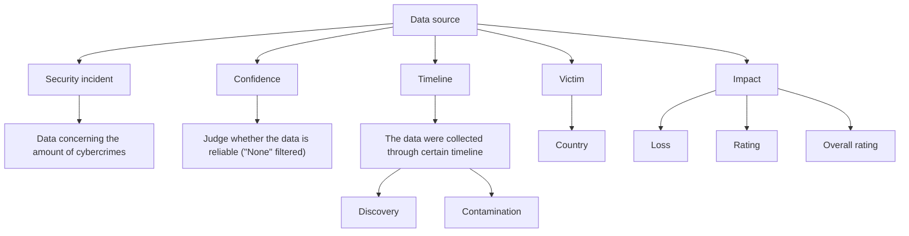

# Data-Driven Policy Effectiveness Evaluation and Country-

# Specific Characteristic Based Cybercrime Prediction

## Summary

In recent years, the rapid growth of cybercrime has raised concerns among governments, businesses, and individuals worldwide. With the increasing reliance on digital infrastructure, protecting information systems from cyberattacks has become a priority. However, analyzing the effectiveness of different cybersecurity policies in reducing cybercrime remains a complex challenge. This paper aims to propose a predictive model to forecast the impact of cybersecurity policies on the number of cybercrimes. By incorporating relevant economic, social, and technological factors, we explore how policies influence crime rates and provide insights into effective cybersecurity strategies.

For problem 1, we filtered and processed the data from the internet and found the cybercrime data for the countries required by the task. Next, we visualized this data on a world map and introduced some related indicators, such as: Ratio of being found, Ratio of being thwarted, ratio of loss and Severity. Through the analysis of these data, we selected a reasonable mdoel to evaluate whether a country is a high-risk area for cybercrime and compared it with the GCI (Global Cybersecurity Index). (Results: Figure 4, 5, 11)

For problem 2, we collected and classified relevant policies that different countries delivered to reduce cybercriminal activities. In this section, we came up with the threeinterval gradient and three-interval percentage model to quantify the effectiveness of each type of policy. (Results: Figure 13)

For problem 3, we collected some factors that are possibly related to cybercrime. After that, Pearson correlation coefficient, Spearman rank correlation coefficient and Kendall rank correlation coefficient were applied to decide which factor can be considered to be related. After that, a TimeXer model, an improved version of the traditional Transformer model, was established to make predictions on cybercrime trends based on demographic data of one country. TimeXer allows for the simultaneous handling of endogenous and exogenous variables in time series data. Endogenous variables, such as monthly cybercrime rates, are the target variables to provide additional contextual data that may influence crime rates. By integrating these factors, the model aims to generate more accurate predictions for cybercrime trends in response to policy changes. (Results: Figure 13)

Keywords: Cybercrime, Policy effectiveness, Correlation coefficient, Cybercrime prediction

## Content

## 1. Introduction. .3

1.1 Problem Background. ..3  
1.2 Restatement of the Problem. /  
1.3 Global Cybersecurity Index. 4  
1.4 Our Work.. .5

## 2. Model Preparation .6

2.1 Assumptions.. .6  
2.2 Notations.. .6  
2.3 Data Collection and Visualization.

## 3. Model Establishment .9

3.1 Model I: Define High Targets .9  
3.2 Model II: Define Effective Policies . .10

3.2.1 Policy Analysis and Classification ...... ...10  
3.2.2 Cybercrime Timeline of Some Countries .....  
3.2.3 Data Processing .... .11

3.3 Model III: Define Correlative Demographic Parameters and Make Prediction Accordingly.. .13

3.3.1 Parameter Selection and Data Preprocess .....  
3.3.2 Correlation Analysis ....  
3.3.3 Prediction Model: TimeXer .... .17

## 4. Results and Discussion .18

4.1 Problem 1. .. 18  
4.2 Problem 2.. .. 20  
4.3 Problem 3.. .. 22

## 5. Model Evaluation. .22

## 6. Conclusion. .23

## 7. Reference .23

## 8. Memo . .24

## 1. Introduction

## 1.1 Problem Background

Cybercrime, which refers to the use of a computer as an instrument to further illegal ends, has been evolving alongside technological advancements and has become an inevitable threat especially in this digital age. The term encompasses a broad range of illegal actions, including hacking, identity theft, online fraud, phishing, ransomware attacks, and the distribution of malware. Figure 1 below collected data from 202 Internet Crime Report delivered by Federal Bureau of Investigation (FBI), indicating that more than 300,000 Americans fell victim to phishing, vishing and smishing attacks in 2021, which identity theft and confidence fraud also high on the list of common offenses.


<details>
<summary>bar chart</summary>

| Type of Cyber Crime | Number of Victims |
| --- | --- |
| Phishing/Vishing/Smishing | 323,972 |
| Non-Payment/Non-Delivery | 82,478 |
| Personal Data Breach | 51,829 |
| Identity Theft | 51,629 |
| Extortion | 39,360 |
| Confidence/Romance Fraud | 24,299 |
| Tech Support | 23,903 |
| Investment | 20,561 |
Total victim losses from the listed crimes: $4.0 billion
</details>

Fig.1 Types of cybercrime [1]

Therefore, many countries have implemented relevant policies to prevent cybercrime. For instance, the United States has enacted the Computer Fraud and Abuse Act (CFAA) to address hacking and unauthorized access. In addition, the European Union has also introduced the General Data Protection Regulation (GDPR), which aims to ensure data privacy. These policies, along with international cooperation initiatives like the Budapest Convention on Cybercrime, highlight a global effort to deter cyber threats and protect individuals, organizations, and national security from the growing menace of cybercrime. However, the situation of one country differs in aspects like economy, internet popularization, schooling, etc. These differences make it hard to justify the effectiveness of certain kinds of policy based on the result in other countries. Consequently, it’s necessary to quantify the effectiveness of a series of verbal description based on the existing performance and data, which will be served as reference for a government to improve its national cybersecurity policy and give an estimation about the amount of cybercrime after enacting it.

## 1.2 Restatement of the Problem

In this problem, we are going to help identify patterns that could inform the datadriven development and refinement of national cybersecurity policies and laws based on those that have demonstrated effectiveness. Develop a theory for what makes a strong national cybersecurity policy and present a data-driven analysis to support your theory. In developing and validating our theory, things below will be included:

How is cybercrime distributed across the globe. Which countries are disproportionately high targets of cybercrimes, where cybercrimes are successful, where cybercrimes are thwarted, where are cybercrimes reported and where are cybercrimes prosecuted.  
Identify parts of a policy or law that are particularly effective or ineffective in addressing cybercrime by exploring the published national security policies of various countries and comparing these with the distribution of cybercrimes.  
National demographics correlate with our cybercrime distribution analysis and how these might support our theory.

Finally, based on the quantity, quality, and reliability of the data, limitations or concerns that national policy makers should consider when relying on our work to develop or refine their national cybersecurity policies will be explained.

## 1.3 Global Cybersecurity Index

In this study, one concept will be mentioned and used as reference frequently in successive content, which is the Global Cybersecurity Index (GCI) created by International Telecommunication Union (ITU). GCI is one of the trusted tools that can be deployed to measure the commitment of countries to cybersecurity at a global level. GCI is a control and feedback mechanism based on a composite indicator [2], and it has five pillars including legal, technical, organizational, capacity building and cooperation. In the later part of this article, GCI will be introduced in several sections to verify our modelling process.

## 1.4 Our Work

```mermaid
graph TD
  A["VCDB Raw Data"] --> B["Key Word Extraction"]
  B --> C["Global Month Statistic"]
  B --> D["Global Year Statistic"]
  E["Feature Statistic"] --> F["Global Distribution"]
  E --> G["Crimes Features"]
  H["Demographic Properties"] --> I["Correlation Evaluation"]
  J["Properties DownSampling"] --> I
  K["Efficient Properties"] --> I
  L["TimeXer Prediction"] --> I
  M["Crimes Prediction"] --> I
  N["Stage IV Demographic Evaluation"] --> O["Demographic Properties"]
  N --> P["Correlation Evaluation"]
  N --> Q["Properties DownSampling"]
  N --> R["Efficient Properties"]
  N --> S["TimeXer Prediction"]
  N --> T["Crimes Prediction"]
  U["Stage III Policy Evaluation"] --> V["National Policy Collection"]
  U --> W["Category Mapping"]
  U --> X["A"]
  U --> Y["B"]
  U --> Z["C"]
  U --> AA["Efficiency Ranking"]
  U --> AB["Policy Suggestion"]
```


<details>
<summary>flowchart</summary>


</details>

Fig.2 Our work

As shown in Figure 2, our work can be divided into four stages

## Stage I Data Preparation

Based on the specific rules of the VERIS framework, we purposefully filtered certain variables and built a robust data preprocessing system. This resulted in global cybercrime statistics with observable trends and temporal characteristics. In addition, we further examined the details of certain records in the VCDB dataset and aggregated and merged similar data. This strategy significantly reduced the number of outliers in the processed data and laid the foundation for the subsequent stages.

## Stage II High Risk Region Location

Using the cybercrime records in the VCDB and other indicators reflecting regional cybercrime risk levels, we developed a plausible risk assessment model and created a visualization system to represent global risk levels.

## Stage III Policy Evaluation

Based on the collected cybercrime records, we identified apparent crime trends in specific countries. We compiled the cybersecurity policies implemented by these countries and categorized them into three categories based on their characteristics.

Using the data collected, we analyzed and assessed the effectiveness of the policies in these three categories.

## Stage IV Demographic Evaluation

Using data provided by the World Bank, we selected a subset of indicators that are theoretically relevant to cybercrime activities. After conducting a correlation analysis, we removed two indicators and retained the remaining indicators as input data for the TimeXer model, a well-established time-series forecasting tool. This process produced more reliable cybercrime predictions.

## 2. Model Preparation

## 2.1 Assumptions

Assumption 1: When predicting the number of crime occurrences, statistics are conducted with monthly precision. Data records that are not precise to the month are assumed to be averaged across each month.

Assumption 2: Data with largely similar content but differing in a small amount of information, such as industry, is considered a single data entry and consolidated together.

Assumption 3: When conducting demographic properties with monthly precision, these data are assumed to be consistent in magnitude with the annual data for each month.

## 2.2 Notations

TABLE I. Symbols and Definitions

<table><tr><td>Symbol</td><td>Definition</td></tr><tr><td> $n_{it}$ </td><td>The number of cybercrimes for country i at time t</td></tr><tr><td> $n_{dc|it}$ </td><td>The number of discovered cybercrime for country i at time t</td></tr><tr><td> $n_{con|it}$ </td><td>The number of contaminated cybercrime for country i at time t</td></tr><tr><td> $X_{loss|nit}$ </td><td>Whether the  $n^{th}$  cybercrime causes loss for country i at time t</td></tr><tr><td> $n_{s|it}$ </td><td>The number of cybercrimes with confidence to be suspect for country i at time t</td></tr><tr><td> $n_{or|it}$ </td><td>The number of cybercrimes with overall rating to be unknown or NA for country i at time t</td></tr><tr><td> $X_{sig|nit}$ </td><td>Whether the  $n^{th}$  cybercrime is severe for country i at time t</td></tr><tr><td> $r_{th|it}$ </td><td>The ratio of being thwarted for country i at time t</td></tr><tr><td> $r_{loss|it}$ </td><td>The ratio of causing loss for country i at time t</td></tr></table>

$n _ { e f f | i t }$ The number of effective cybercriminal activities for country i at time t

## 2.3 Data Collection and Visualization

This section aims to solve the first problem about preliminary data collection and pre-process to find out how cybercrime is distributed globally and help define disproportionately high targets later. All the data was collected at websites in the table below.

TABLE II. Data Source Websites

<table><tr><td>Database Name</td><td>Website</td></tr><tr><td>HTML Publication</td><td>https://www.itu.int/epublications/publication/global-cybersecurity-index-2024</td></tr><tr><td>The VERIS Framework</td><td>https://verisframework.org/index.html</td></tr><tr><td>The VERIS Community Database</td><td>https://verisframework.org/vcdb.html</td></tr></table>

There are many categories of data you can fetch from online sources. In our consideration, we chose the data that can facilitate our analysis best with labels below to make further data-driven analysis. Figure 4 is the most obvious and direct illustration of global cybercrime situations presenting absolute amount of security incidents.


<details>
<summary>flowchart</summary>


</details>

Fig.3 Data used for later analysis


<details>
<summary>heatmap</summary>

| Country | Incident Count |
| --- | --- |
| United States | 40 |
| Canada | 35 |
| Mexico | 30 |
| Brazil | 25 |
| Argentina | 20 |
| South Africa | 15 |
| Australia | 10 |
| Russia | 5 |
| China | 30 |
| Japan | 25 |
| Germany | 20 |
| France | 15 |
| Italy | 10 |
| Spain | 5 |
| Netherlands | 30 |
| Sweden | 25 |
| Poland | 20 |
| Czech Republic | 15 |
| Hungary | 10 |
| Romania | 5 |
| Bulgaria | 30 |
| Slovakia | 25 |
| Slovenia | 20 |
| Estonia | 15 |
| Latvia | 10 |
| Lithuania | 5 |
| Iceland | 30 |
| Norway | 25 |
| Denmark | 20 |
| Finland | 15 |
| Ireland | 10 |
| Portugal | 5 |
| Greece | 30 |
| Belgium | 25 |
| Switzerland | 20 |
| Austria | 15 |
| Sweden | 10 |
| Finland | 5 |
| Poland | 30 |
| Czech Republic | 25 |
| Hungary | 20 |
| Romania | 15 |
| Bulgaria | 10 |
| Slovakia | 5 |
| Slovenia | 30 |
| Estonia | 25 |
| Croatia | 20 |
| Bosnia and Herzegovina | 15 |
| Serbia | 10 |
| Montenegro | 5 |
| Albania | 30 |
| North Macedonia | 25 |
| Kosovo | 20 |
| Cyprus | 15 |
| Malta | 10 |
| Panama | 5 |
| Jordan | 30 |
| Lebanon | 25 |
| Uzbekistan | 20 |
| Iraq | 15 |
| Yemen | 10 |
| Oman | 5 |
| Qatar | 30 |
| Kuwait | 25 |
| Bahrain | 20 |
| Israel | 15 |
| United Kingdom | 10 |
| Ireland | 5 |
| Czech Republic | 30 |
| Hungary | 25 |
| Romania | 20 |
| Bulgaria | 15 |
| Slovakia | 10 |
| Slovenia | 5 |
| Estonia | 30 |
| Croatia | 25 |
| Bosnia and Herzegovina | 20 |
| Serbia | 20 |
| Taiwan | 15 |
| Hong Kong | 10 |
| Singapore | 5 |
| Malaysia | 30 |
| Indonesia | 25 |
| Philippines | 20 |
| Vietnam | 15 |
| Thailand | 10 |
| Philippines | 5 |
| Malaysia | 30 |
| Vietnam | 25 |
| Thailand | 20 |
| Malaysia | 15 |
| Philippines | 10 |
| Malaysia | 5 |
| Malaysia | 30 |
| Malaysia | 25 |
| Malaysia | 20 |
| Malaysia | 15 |
| Malaysia | 10 |
| Malaysia | 5 |
| Malaysia | 30 |
| Malaysia | 25 |
| Malaysia | 20 |
| Malaysia | 15 |
| Malaysia | 10 |
| Malaysia | 5 |
| Malaysia | 30 |
| Malaysia | 25 |
| Malaysia | 20 |
| Malaysia | 15 |
| Malaysia | 10 |
| Malaysia | 5 |
| Malaysia | 30 |
| Malaysia | 25 |
| Malaysia | 20 |
| Malaysia | 15 |
| Laos | 30 |
| Myanmar | 25 |
| Ethiopia | 20 |
| Uganda | 15 |
| Kenya | 10 |
| Tanzania | 5 |
| Uganda | 3 |
| Zambia | 2 |
| Mozambique | 1 |
| Zimbabwe | 1 |
| Angola | 1 |
| Somalia | 1 |
| Zimbabwe | 1 |
| Angola | 1 |
| Somalia | 1 |
| Zimbabwe | 1 |
| Angola | 1 |
| Somalia | 1 |
| Zimbabwe | 1 |
| Angola | 1 |
| Somalia | 1 |
| Zimbabwe | 1 |
| Angola | 1 |
| Somalia | 144 |
</details>

Fig.4 Global distribution of cybercrime in 2014

However, as for other kinds of data, not all of the data is reliable or valid because of different sources, lack of records or totally useless or wrong. For example, under “Confidence” hierarchy, “None” means no reliability, which means the data with this property must be filtered from the dataset. This step is the preliminary process of data we set. Similarly, useless files or data were abandoned directly. If the wanted type of data fails to be detected, the filter will automatically create a “NA” file to represent.

After collecting wanted data, the next step is to apply proper index to effectively reflect the global situation of cybercrime. Therefore, four characteristics were defined to visualize the data:

$$
\text { Ratio   of   being   found } = n _ {d c | i t} / n _ {i t} \tag {1}
$$

$$
\text { Ratio   of   being   thwarted } r _ {t h | i t} = n _ {c o n | i t} / n _ {i t} \tag {2}
$$

$$
\text { Ratio   of   causing   loss } r _ {\text { loss } | i t} = \frac {\sum_ {n = 0} ^ {n _ {i t}} X _ {\text { loss } | n i t}}{n _ {i t} - n _ {s | i t}} \tag {3}
$$

$$
\text {Severity} = \frac {\sum_ {n = 0} ^ {n _ {i t}} X _ {s i g | n i t}}{n _ {i t} - n _ {o r | i t}} \tag {4}
$$

In (3), $X _ { l o s s | n i t } { \sim } B ( n )$ . The judgement is made based on whether the cybercrime activity causes loss. If the event is “confirmed” in “Security incident”, then this event is considered to result in loss, which should be valued to be 1. If the event is recorded to be “Never miss”, it will be considered to be 0. $ { n _ { s | i t } }$ refers to the “Suspected” event and the subtraction aims to eliminate the influence of uncertain events.

Similarly, in (4), $X _ { s i g | n i t } { \sim } B ( n )$ as well. This time the judgement is made based on whether the “Overall rating” of certain event is “insignificant”. If so, then this event didn’t cause severe damage, which can be considered to be 0. Vice versa. $n _ { o r | i t }$ refers to events that have no information about “Overall rating”. The subtraction at denominator also proposes to eliminate unnecessary influence from uncertain events.

Based on the functions above, the distribution diagram concerning the characteristics of global cybercrime can be attained. Figure 5 below shows the visualization of global distribution of four aspects taking the data in 2014 for example. The shadowed area represents NA, meaning there is no data recorded.

  
Fig.5 Relevant characteristics distribution in 2014

It can be seen from the picture that major victims of cybercrime distribute in North America area and Asian-Pacific region. Those data reflect the situation about global cybercrime, which lays solid foundation for later modelling processes.

## 3. Model Establishment

## 3.1 Model I: Define High Targets

Based on the data above, we proposed to judge whether a country is a high target of cybercrime by analyzing the effective amount of cybercriminal activities occur in this country throughout one year and compare it with the timeline average. The reason we approached it this way was that most crimes have had a significant impact, so they are not very representative. As for considering the severity of the crimes, there was a serious lack of data, making it not meaningful for reference. At the same time, simply analyzing the number of crimes and the crime prevention rate would be unfair to countries like the United States, which have high crime rates and high prevention rates, as well as to some underdeveloped regions with low crime rates and low prevention rates. Therefore, we have introduced both factors as indicators simultaneously.

$$
\overline {{n _ {e f f | l t}}} = \frac {\sum_ {t _ {s t a r t}} ^ {t _ {e n d}} n _ {i t} (1 - n _ {c o n | i t})}{t _ {e n d} - t _ {s t a r t}} \tag {5}
$$

In this study, the data were mainly collected within the range from $t _ { s t a r t } = 2 0 0 3$ to $t _ { e n d } = 2 0 2 3$ . After that, based on the value of $\overline { { n _ { e f f | \iota t } } }$ , we allocated all the countries into four categories: Extreme high risk $( > 2 . 0 )$ , High risk (2.0\~1.5), Moderate risk $( 1 . 5 { \sim } 0 . 5 )$ and Low risk (<0.5). After that, the distribution diagram can be made to visualize the results.

## 3.2 Model II: Define Effective Policies

## 3.2.1 Policy Analysis and Classification

In the previous section, we mentioned that cybersecurity is a globally significant issue, impacting information security at all levels, from nations to individuals. Since the advent of the digital age, governments around the world—particularly in countries like the United States, Canada, India, Australia, and the United Kingdom, where cybercrime is more prevalent—have placed great emphasis on protecting their national cybersecurity. To reduce cybercrime rates, these nations have proposed policies tailored to their specific circumstances. For ease of analysis regarding the effectiveness of these policies in controlling cybercrime rates, we have categorized the collected policies into three main areas: institutional development, cooperation, and the improvement of public education and talent cultivation.

As for institutional development, the methods including but not limited to incorporating cybercrime into criminal law [3]; establishing an interdepartmental committee to enhance coordination [4]; setting up a Cybercrime Center dedicated to addressing cybercrime [3]; creating the NCIIPC (National Critical Information Infrastructure Protection Center); mandating the protection of critical infrastructure [5]; Essential Eight: Proposing specific steps to ensure cybersecurity [6]; conducting regular drills [6]; adopting backup networks [7] and providing specific defense tools with more targeted approaches (e.g., ACD and Web Check) [8].

Cooperation including collaborating with other countries on cybersecurity [5]; government-private sector cooperation [6]; partnerships with private enterprises [7]; combating transnational crime and supporting international cooperation [9]; collaboration between the government and specific private enterprises [8] and emphasizing information sharing, allowing private entities to legally share cyber threat information [10].

Finally, for the improvement of public education and talent cultivation, it is suggested to train relevant cybersecurity personnel [5]; government can support for the cultivation of cybersecurity talent [7][11] and promoting cybersecurity awareness [12].

For convenience in expression, in the later sections of this article, the three categories of policies will be abbreviated to be A (institutional development), B (cooperation) and C (improvement of public education and talent cultivation) respectively.

## 3.2.2 Cybercrime Timeline of Some Countries

To more intuitively reflect the effects of different types of policies, we have marked the cybersecurity policies adopted by the country during different time periods on a line chart showing the number of cybercrimes in the country over a specific period of time, the results are shown in Figure 6 below.


<details>
<summary>line chart</summary>

| Year | Crime Count |
| ---- | ----------- |
| 2005 | 0           |
| 2006 | 0           |
| 2007 | 0           |
| 2008 | 4           |
| 2009 | 2           |
| 2010 | 8           |
| 2011 | 32          |
| 2012 | 50          |
| 2013 | 32          |
| 2014 | 45          |
| 2015 | 36          |
| 2016 | 23          |
| 2017 | 10          |
| 2018 | 8           |
| 2019 | 14          |
| 2020 | 8           |
| 2021 | 2           |
</details>

(a) Canada


<details>
<summary>line chart</summary>

| Year | Crime Count |
| ---- | ----------- |
| 2005 | 0           |
| 2006 | 0           |
| 2007 | 0           |
| 2008 | 10          |
| 2009 | 15          |
| 2010 | 10          |
| 2011 | 30          |
| 2012 | 45          |
| 2013 | 65          |
| 2014 | 60          |
| 2015 | 60          |
| 2016 | 65          |
| 2017 | 35          |
| 2018 | 15          |
| 2019 | 15          |
| 2020 | 10          |
| 2021 | 5           |
</details>

(b) Great Britian


<details>
<summary>line chart</summary>

| Year | Crime Count |
| ---- | ----------- |
| 2005 | 0           |
| 2010 | 0           |
| 2013 | 29          |
| 2014 | 12          |
| 2015 | 4           |
| 2016 | 12          |
| 2017 | 5           |
| 2018 | 12          |
| 2019 | 5           |
| 2020 | 21          |
| 2021 | 8           |
| 2022 | 2           |
</details>

(c) India  
Fig.6 Cybercrime Timeline of Some Countries

From the chart above, it can be seen that adjustments in policies can influence the number of cybercrimes to some extent. For example, after Canada introduced class C policy around 2016, there was a noticeable decrease in cybercrime numbers. Conversely, after India discontinued Class B policy, the number of cybercrimes increased again. Although this does not conclusively indicate which policy is more effective, it is clear that more data needs to be analyzed in order to objectively reflect the impact of each policy. Apart from that, another point worth mentioning is that fluctuations in the number of cybercrime still occur even though there is no specific policy delivered or deleted, which means that time or global trend is also an inevitable factor that has impact on cybercriminal activities.

## 3.2.3 Data Processing

Due to the large volume of data, our first idea was to calculate the annual crime rates for a certain country within a specific time period and analyze the trends. However, since some policies were introduced in the middle of the year, the data for that year actually consists of two different parts. Therefore, based on the annual analysis, we proposed a more precise analysis by analyzing data in each month. Both approaches have their advantages. The former ensures more accurate data, while the latter allows for more precise predictions, as it involves a process of derivation from the former one.

However, this led to a second problem: some months had missing or incomplete data, causing discrepancies between the sum of the twelve months and the total data for the year. To minimize the impact of data loss, our proposed solution was to divide the aforementioned data discrepancy by 12 and distribute it evenly across each month. If there is a remainder, we supplement the data according to the pattern: 1, 4, 7, 10, 2, 5, 8, 11, 3, 6, 9, 12.

Based on this basic logic, we then needed to analyze the changes in crime data around the policy implementation time. To ensure a comprehensive analysis, we chose to consider data from the year before, the year after, two years after, and three years afte the policy implementation, totaling four years of data. Next, we performed gradient analysis and slope analysis. Gradient analysis refers to considering the absolute difference in crime numbers between the year after and the year before. Slope analysis refers to considering the ratio of crime numbers between the year after and the year before, totaling three time intervals. As a result, each country has three sets of data.

After preliminary analysis, it turned out that slope analysis (percentage analysis) was more reasonable because as shown in the figure below, due to the large volume of data from the United States compared to other countries, analyzing absolute numbers tends to obscure the overall data trend.


<details>
<summary>bar chart</summary>

| Country   | 1st Gradient |
| --------- | ------------ |
| AU_1      | 0            |
| AU_2      | -10          |
| CA_1      | 0            |
| CA_2      | 15           |
| CA_3      | 8            |
| GB_1      | 2            |
| GB_2      | -5           |
| IN_1      | 6            |
| IN_2      | 2            |
| US_1      | 230          |
| US_2      | -20          |
| US_3      | -50          |
</details>

(a) Gradient analysis result  


<details>
<summary>bar chart</summary>

Bar Chart of 1st Percentage Change by Country
| Country (Unique) | 1st Percentage Change |
| :--- | :--- |
| AU_1 | 90 |
| AU_2 | 35 |
| CA_1 | 100 |
| CA_2 | 160 |
| CA_3 | 123 |
| GB_1 | 107 |
| GB_2 | 52 |
| IN_1 | 141 |
| IN_2 | 150 |
| US_1 | 188 |
| US_2 | 94 |
| US_3 | 62 |
</details>

(b) Percentage analysis result  
Fig.7 Results of the two methods

Based on this basic idea, we chose to calculate the average ratio of crimes in a year to the crimes in the year prior, across the three time intervals mentioned earlier. This allows us to better understand the impact of different policies on the country's cybercrime rate and made our discussion. When evaluating the effectiveness of control of the three types of policies (A, B, and C) on cybercrime, it is necessary to consider multiple factors, such as the population characteristics of each country and the timing of policy implementation. To this end, we have collected records of all policies issued in five countries with higher crime rates and distinct characteristics across different years, for each policy type. These records were then averaged to obtain a "policy index" that has a certain degree of universality. It is important to note that some countries may have implemented multiple types of policies simultaneously in the same period, so these events will appear in the statistical results of multiple categories during classification.

## 3.3 Model III: Define Correlative Demographic Parameters and Make Prediction Accordingly

## 3.3.1 Parameter Selection and Data Preprocess

In this section, our data source comes from the UNESCO Institute for Statistics website. After analysis, we selected several factors that we believe may be related to cybercrime, including GDP, enrollment rates, literacy rates, internet penetration rates, the coverage of cybersecurity servers, and public education. The primary reason for selecting these factors is that we believe the occurrence of cybercrime is likely closely linked to education levels, internet development, and the national economy.

However, different countries record data for different years with varying degrees of missing values. Therefore, we performed interpolation on the collected data. Specifically, we inserted a value of 0 for missing crime numbers, as the global trend for crime numbers was nearly 0 in the early years. As for the other factors, our strategy was to treat all missing values before the first non-zero valid value as 0, and to replace missing values after the first non-zero valid value with the preceding data point. The final example dataset is as shown on the table below.

TABLE III. Example dataset for India from 2019-2023

<table><tr><td>Year</td><td>Crime</td><td>Enrollment</td><td>GDP</td><td>Network</td><td>Server</td><td>Literacy</td><td>Education</td></tr><tr><td>2019</td><td>5</td><td>29.0234</td><td>2041.4</td><td>29.5235</td><td>382.86</td><td>69</td><td>3.8973</td></tr><tr><td>2020</td><td>21</td><td>29.8196</td><td>1907.0</td><td>43.4054</td><td>472.19</td><td>69</td><td>4.0401</td></tr><tr><td>2021</td><td>8</td><td>31.5742</td><td>2239.6</td><td>43.4054</td><td>528.19</td><td>69</td><td>4.6351</td></tr><tr><td>2022</td><td>2</td><td>32.6703</td><td>2352.6</td><td>43.4054</td><td>729.69</td><td>76</td><td>4.1207</td></tr><tr><td>2023</td><td>1</td><td>33.1165</td><td>2480.8</td><td>43.4054</td><td>966.08</td><td>77</td><td>4.1207</td></tr></table>

In the data preparation for this task, in order to study the United States as a sample, we aimed to develop a more rigorous model for predicting future crime numbers based on past crime data and multiple related geographic features. Further research was conducted using the U.S. cybercrime data obtained from the statistics in the first task. By plotting the U.S. cybercrime records for the period from 2020 to 2024, the results are shown in Figure 8(a). It can be seen that there is a significant spike in the number of cybercrimes in the U.S. during June 2023, which is clearly an outlier.


<details>
<summary>line chart</summary>

| Time       | US Crime Counts |
| ---------- | --------------- |
| 2023-06    | 751             |
</details>

(a) Original data


<details>
<summary>line chart</summary>

| Time     | Crime Counts |
| -------- | ------------ |
| 2019-01  | 27           |
| 2019-02  | 10           |
| 2019-03  | 22           |
| 2019-04  | 24           |
| 2019-05  | 17           |
| 2019-06  | 13           |
| 2019-07  | 15           |
| 2019-08  | 12           |
| 2019-09  | 16           |
| 2019-10  | 11           |
| 2019-11  | 13           |
| 2019-12  | 12           |
| 2020-01  | 10           |
| 2020-02  | 9            |
| 2020-03  | 8            |
| 2020-04  | 7            |
| 2020-05  | 6            |
| 2020-06  | 5            |
| 2020-07  | 4            |
| 2020-08  | 3            |
| 2020-09  | 5            |
| 2020-10  | 7            |
| 2020-11  | 9            |
| 2020-12  | 8            |
| 2021-01  | 7            |
| 2021-02  | 6            |
| 2021-03  | 5            |
| 2021-04  | 4            |
| 2021-05  | 5            |
| 2021-06  | 7            |
| 2021-07  | 9            |
| 2021-08  | 8            |
| 2021-09  | 7            |
| 2021-10  | 6            |
| 2021-11  | 5            |
| 2021-12  | 4            |
| 2022-01  | 5            |
| 2022-02  | 7            |
| 2022-03  | 9            |
| 2022-04  | 8            |
| 2022-05  | 7            |
| 2022-06  | 6            |
| 2022-07  | 5            |
| 2022-08  | 4            |
| 2022-09  | 5            |
| 2022-10  | 7            |
| 2022-11  | 9            |
| 2022-12  | 8            |
| 2023-01  | 7            |
| 2023-02  | 6            |
| 2023-03  | 5            |
| 2023-04  | 4            |
| 2023-05  | 3            |
| 2023-06* | 3            |
| 2023-07* | 4            |
| 2023-08* | 5            |
| 2023-09* | 6            |
| 2023-10* | 7            |
| 2023-11* | 8            |
| 2023-12* | 9            |
</details>

(b) After correction  
Fig.8 Crime data of the U.S.

To investigate the source of the outlier, we conducted a further examination of all the cybercrime samples in the U.S. that occurred in June 2023. We found that during this period, a large number of very similar cybercrime activities took place. Their "action", "asset", and "attribute" were identical, with only differences in the "victim" category, specifically in "Industry" and "Region." As shown in Figure M, 735 such near-identical samples were recorded in June 2023, which explains why the crime records for that year are so high. However, this large volume of attacks is likely due to planned actions taken by certain malicious actors, and such activities are not influenced by policy regulations or national characteristic factors. Therefore, this outlier data will distort the correlation analysis between national characteristics and cybercrime rates and may severely reduce the predictive effectiveness of the model. Additionally, in most records from the VCDB, it is common practice to aggregate nearly identical events occurring in the same period into a single time point. To obtain a more universally applicable correlation analysis and achieve better model predictions, we chose to replace the outlier data for this date with 17 non-duplicate normal data points. The processed results are shown in Figure 8(b).


<details>
<summary>bar chart</summary>

| Data Type | Count |
| :--- | :--- |
| Similar Data | 735 |
| Normal Data | 17 |
</details>

Fig.9 Outlier data of the U.S.

## 3.3.2 Correlation Analysis

After collecting data from hundreds of countries, we sequentially iterated through the datasets for each country based on every feature, extracting the corresponding data pairs of cybercrime numbers and feature indicators for each characteristic. The purpose of this step was to maximize the sample size, making subsequent operations more universally applicable, while eliminating the impact of time-related factors. Next, we performed a correlation analysis to examine the relationship between different factors and the number of cybercrimes. The commonly used correlation analysis methods include three types: Pearson correlation coefficient, Spearman rank correlation coefficient, and Kendall rank correlation coefficient. Next, we will first consider the strengths and weaknesses of different analysis methods and will test some of the data to decide which analysis method to use.

## Pearson Correlation Coefficient:

$$
r = \frac {\sum_ {i = 1} ^ {n} (x _ {i} - \bar {x}) (y _ {i} - \bar {y})}{\sqrt {\sum_ {i = 1} ^ {n} (x _ {i} - \bar {x}) ^ {2}} \sqrt {\sum_ {i = 1} ^ {n} (y _ {i} - \bar {y}) ^ {2}}} \tag {6}
$$

In which $x _ { i }$ and $y _ { i }$ represent the $\mathrm { i ^ { \mathrm { t h } } }$ value in sample, n is the number of sample and $\bar { x }$ and $\bar { y }$ represent the average of sample.

Due to the fact that Pearson correlation coefficient is commonly applied to test the linear relation between two variables, this method was applied first to examine whether some of the parameters are linearly relative to the number of cybercrime. After processing the dataset, the result was obtained and listed in the table below.

TABLE IV. Result using Pearson Correlation Coefficient in 2023

<table><tr><td></td><td>Enrollment</td><td>GDP</td><td>Literacy</td><td>Network</td><td>Server</td><td>Education</td></tr><tr><td>Correlation</td><td>0.321</td><td>0.311</td><td>0.249</td><td>0.267</td><td>-0.099</td><td>-0.289</td></tr></table>

As shown in Table IV, the feature data of each country exhibits a certain degree of linear correlation with the number of cybercrimes. Among these, GDP and the share of the population with internet access (Network penetration) show a positive correlation with crime rates, while cybersecurity infrastructure and education levels show a negative correlation with crime rates. This aligns with general understanding. Taking GDP as an example: countries with higher GDP are often more attractive targets for cybercriminals, leading to higher cybercrime rates. However, for the indicators of Enrollment and Literacy, which represent the education level of the population, the data shows a positive correlation with crime rates, which is a phenomenon that contradicts common sense. To provide a more comprehensive view of the relationship between various feature data and cybercrime rates, Spearman correlation analysis and Kendall correlation analysis were used to evaluate the data across all features.

## Spearman Rank Correlation Coefficient:

$$
\rho = 1 - \frac {6 \sum_ {i = 1} ^ {n} d _ {i} ^ {2}}{n (n ^ {2} - 1)} \tag {7}
$$

In which $d _ { i }$ is the difference between the ranks of each pair of corresponding values and ?? is the number of sample.

Spearman rank correlation coefficient is widely used when the data is ordinal or when the data is suspected that the relationship between the variables is not linear but still monotonic. It’s also more robust to outliers compared to Pearson's correlation. Based on the preliminary conclusion drew from the result of Pearson correlation coefficient, it can be speculated that Spearman rank correlation coefficient will have a better performance. However, this model is likely to be influenced by the outlier value since it focuses on the rank of samples.

## Kendall Rank Correlation Coefficient:

$$
\tau = \frac {C - D}{\frac {1}{2} n (n - 1)} \tag {8}
$$

In which C and D refer to the number of concordant $( x _ { i } > x _ { j }$ ?????? $y _ { i } > y _ { k }$ ???? $x _ { i } <$ $x _ { j }$ ?????? $y _ { i } < y _ { k } )$ and discordant pairs respectively while n is the number of sample.

Kendall rank correlation coefficient is another non-parametric measure used to assess the strength and direction of the association between two variables. Like the Spearman Rank Correlation, it also evaluates how well the relationship between two variables can be described using a monotonic function, but it differs in the way it handles pairs of data points. Compared with Spearman rank correlation coefficient, this method is more stable and precise for smaller amount of sample.

TABLE V and VI below illustrate the corresponding result calculated by each method. These two tables together with TABLE IV were the results of correlation between different factors and the occurrence of cybercrime.

TABLE V. Result using Spearman Rank Correlation Coefficient in 2023

<table><tr><td></td><td>Enrollment</td><td>GDP</td><td>Literacy</td><td>Network</td><td>Server</td><td>Education</td></tr><tr><td>Correlation</td><td>0.348</td><td>0.336</td><td>0.177</td><td>0.306</td><td>-0.196</td><td>-0.391</td></tr></table>

TABLE VI. Result using Kendall Rank Correlation Coefficient in 2023

<table><tr><td></td><td>Enrollment</td><td>GDP</td><td>Literacy</td><td>Network</td><td>Server</td><td>Education</td></tr><tr><td>Correlation</td><td>0.299</td><td>0.277</td><td>0.162</td><td>0.254</td><td>-0.166</td><td>-0.340</td></tr></table>

As seen, among these indicators, "Network Server" has the lowest correlation values, all of which are closest to 0. This indicates that it has the least impact on the number of cybercrimes. Therefore, in order to simplify subsequent model computations and avoid potential negative effects during prediction due to its low correlation, this indicator was removed from further predictions. As for the "Literacy Rate" indicator, due to significant data gaps in important countries—such as the U.S. and the UK, which have not reported this indicator from 1971 to 2023—this indicator was also excluded from the subsequent predictions. In the end, only four indicators were used to assist in the model's predictions.

## 3.3.3 Prediction Model: TimeXer

All the preparation works we've done earlier was actually aimed at training a model that can predict how the crime rate changes according to a nation’s demographic property. As for this problem, we chose to use the TimeXer model for predicting the number of cybercrimes. According to [13] the TimeXer model is an improvement on the traditional Transformer model, capable of handling both endogenous and exogenous variables in time series data. Endogenous variables are the target variables to be predicted, while exogenous variables are related external information. Figure 10 below shows the overall structure of the TimeXer model.


<details>
<summary>flowchart</summary>

```mermaid
graph TD
    subgraph b_Exogenous_Series_Embedding_Exogenous_Series_Embedding["(b) Exogenous_Series_Embedding[Exogenous Series Embedding]"]
  A1["Multiple Varies"] --> B1["θ"] --> C1["Variate Tokens"]
    end

    subgraph c_Endogenous_Series_Endogenous_Cross_Attention_Exogenous_to_Endogenous_Cross_Attention["(c) Endogenous_Series_Endogenous Cross-Attention[Exogenous-to-Endogenous Cross-Attention]"]
  D1["Cross-Attention"] --> E1["Key: Variate-wise Attention 1 x C"]
  D1 --> F1["Query: Forward to the Next Layer"]
  D2["Endogenous Self-Attention"] --> G1["Key: Temporal-wise Attention (N+1) x (N+1)"]
  D2 --> H1["Query: Forward to the Next Layer"]
    end

    subgraph d_Exogenous_to_Endogenous_Cross_Attention_Exogenous_to_Endogenous_Cross_Attention["(d) Exogenous-to-Endogenous Cross-Attention[Exogenous-to-Endogenous Cross-Attention]"]
  I1["Cross-Attention"] --> J1["Key: Variate-wise Attention 1 x C"]
  I1 --> K1["Query: Forward to the Next Layer"]
  I2["Endogenous Self-Attention"] --> L1["Key: Temporal-wise Attention (N+1) x (N+1)"]
  I2 --> M1["Query: Forward to the Next Layer"]
    end

    subgraph e_Endogenous_Series_Endogenous_Cross_Attention_Endogenous_Series_Embedding["(e) Endogenous_Series_Endogenous Cross-Attention[Endogenous Series Embedding]"]
  N1["Input Series"] --> O1["Random-initialized Global Token"]
  N1 --> P1["Non-overlap Patches"]
  N2["concat"] --> O2["φ"]
    end

    subgraph f_Exogenous_Index_Exogenous_Index["(f) Exogenous_Index[Exogenous Index]"]
  Q1["Embedding"] --> R1["Embedding"]
  R1 --> S1["Output"]
    end

    style (a) fill:#f9f,stroke:#333
    style (b) fill:#ccf,stroke:#333
    style (c) fill:#cfc,stroke:#333
```
</details>

Fig.10 Overall structure of TimeXer model [13]

The TimeXer model is designed to handle one-to-many prediction scenarios, where multiple variables are used to predict a single target variable. For the endogenous variable (target variable), the model adopts the PatchTST approach, segmenting the time series into non-overlapping patches. Each patch is mapped into an embedding, effectively capturing temporal dependencies within the target variable. On the other hand, for the exogenous variables (external variables), the model leverages the iTransformer methodology, where each exogenous variable is treated as a whole and mapped directly into a variate-level embedding. This design emphasizes modeling the spatial influence of exogenous variables on the endogenous variable, ensuring that the model focuses on the critical interactions.

After obtaining embeddings for both endogenous and exogenous variables, the model first applies self-attention to the patches of the endogenous variable. This enables the model to refine the temporal representations of the target variable while capturing intra-series dependencies. To incorporate external information, the model concatenates the endogenous patch embeddings with the variate-level embeddings of the exogenous variables, allowing for an effective fusion of external and internal dynamics.

In the cross-attention stage, the model focuses on extracting relationships between the target variable's representations and the embeddings of the external variables. This mechanism enables the endogenous variable to selectively attend to the most relevant external information, capturing causal and correlative influences across time. The design ensures that external variables, even with irregularities such as missing values or temporal misalignment, are effectively integrated into the forecasting process.

Furthermore, the inclusion of learnable global tokens for the endogenous variable bridges the patch-level embeddings with the variate-level embeddings of exogenous variables. These global tokens serve as a macroscopic representation of the target variable, allowing for more efficient information exchange between endogenous and exogenous components during cross-attention.

In our prediction, the endogenous variable is the number of cybercrimes in a given month, and the exogenous variables include per capita GDP (current US dollars), the percentage of the population using the internet, the ratio of total public expenditure on education to GDP, and the percentage of the population enrolled in higher education. These variables reflect the impact of the economy, internet usage, and education on cybercrime rates.

## 4. Results and Discussion

## 4.1 Problem 1

In section 2.3, the visualization of where cybercrimes are successful, problems concerning where are cybercrimes thwarted, where are cybercrimes reported and where are cybercrimes prosecuted globally in 2014 have been visualized in Figure 4 and Figure 5.

As for the high target countries, the distribution diagram based on average number of effective cybercriminal activities is illustrated in Figure 9 below.


<details>
<summary>heatmap</summary>

| Country | Risk Level |
| --- | --- |
| United States | Extreme Risk |
| Canada | High Risk |
| Mexico | High Risk |
| Brazil | High Risk |
| Argentina | Moderate Risk |
| Germany | Moderate Risk |
| France | Moderate Risk |
| Italy | Moderate Risk |
| Spain | Moderate Risk |
| United Kingdom | Moderate Risk |
| Russia | Moderate Risk |
| China | Moderate Risk |
| Japan | Moderate Risk |
| Australia | Low Risk |
| India | Low Risk |
| South Africa | Low Risk |
| Nigeria | Low Risk |
| Egypt | Low Risk |
| Saudi Arabia | Low Risk |
| Iran | Low Risk |
| Saudi Arabia | Low Risk |
| Turkey | Low Risk |
| Vietnam | Low Risk |
| Indonesia | Low Risk |
| Philippines | Low Risk |
| Malaysia | Low Risk |
| Thailand | Low Risk |
| Myanmar | Low Risk |
| Cambodia | Low Risk |
| Laos | Low Risk |
| Cambodia | Low Risk |
| Cambodia | Low Risk |
| Cambodia | Low Risk |
| Cambodia | Low Risk |
| Cambodia | Low Risk |
| Cambodia | Low Risk |
| Cambodia | Low Risk |
| Cambodia | Low Risk |
| Cambodia | Low Risk |
| Cambodia | Low Risk |
| Cambodia | Low Risk |
| Cambodia | Low Risk |
| Cambodia | Low Risk |
| Cambodia | Low Risk |
| Cambodia | Low Risk |
| Cambodia | Low Risk |
| Cambodia | Low Risk |
</details>

(a) Global risk distribution in 2014


<details>
<summary>heatmap</summary>

| Country | Risk Level |
| --- | --- |
| United States | Extreme Risk |
| Canada | High Risk |
| Mexico | Moderate Risk |
| Brazil | Moderate Risk |
| Argentina | Moderate Risk |
| Germany | Moderate Risk |
| France | Moderate Risk |
| Italy | Moderate Risk |
| Spain | Moderate Risk |
| Russia | Moderate Risk |
| China | Moderate Risk |
| India | Moderate Risk |
| Japan | Moderate Risk |
| Australia | Low Risk |
| South Korea | Low Risk |
| Nigeria | Low Risk |
| Egypt | Low Risk |
| Saudi Arabia | Low Risk |
| Iran | Low Risk |
| Turkey | Low Risk |
| South Africa | Low Risk |
| Kenya | Low Risk |
| Bangladesh | Low Risk |
| Pakistan | Low Risk |
| Vietnam | Low Risk |
| Philippines | Low Risk |
| Indonesia | Low Risk |
| Malaysia | Low Risk |
| Thailand | Low Risk |
| Myanmar | Low Risk |
| Cambodia | Low Risk |
| Laos | Low Risk |
| Tunisia | Low Risk |
| Iraq | Low Risk |
| Afghanistan | Low Risk |
| Ethiopia | Low Risk |
| DR Congo | Low Risk |
| Angola | Low Risk |
| Zimbabwe | Low Risk |
| Madagascar | Low Risk |
| Cameroon | Low Risk |
| Niger | Low Risk |
| Chad | Low Risk |
| Sudan | Low Risk |
| Uganda | Low Risk |
| Senegal | Low Risk |
| Tanzania | Low Risk |
| Zambia | Low Risk |
| Mozambique | Low Risk |
| Madagascar | Low Risk |
| Malawi | Low Risk |
| Eritrea | Low Risk |
| Guinea-Bissau | Low Risk |
| Guinea | Low Risk |
| Guinea | Low Risk |
| Guinea | Low Risk |
| Guinea-Bissau | Low Risk |
| Guinea | Low Risk |
| Guinea-Bissau | Low Risk |
| Guinea-Bissau | Low Risk |
| Guinea-Bissau | Low Risk |
| Guinea-Bissau | Low Risk |
| Guinea-Bissau | Low Risk |
| Guinea-Bissau | Low Risk |
| Guinea-Bissau | Low Risk |
| Guinea-Bissau | Low Risk |
| Guinea-Bissau | Low Risk |
| Guinea-Bissau | Low Risk |
| Guinea-Bissau | Low Risk |
</details>

(b) Global risk distribution in 2020  
Fig.11 Global risk distribution

It can be seen that countries have high risk of being attacked by cybercriminals mainly distributed in North and South America and Asian-Pacific region and Europe, including the America, Cannada, India, Australia, England etc.

In order to verify our modelling and our results, the GCI distribution was set as a reference. Figure 10 below illustrates the GCI in 2014 and 2020 around the world.


<details>
<summary>heatmap</summary>

| Country | Score |
| --- | --- |
| United States | 0.95 |
| Canada | 0.85 |
| Mexico | 0.75 |
| Brazil | 0.65 |
| Argentina | 0.55 |
| United Kingdom | 0.45 |
| Germany | 0.35 |
| France | 0.25 |
| Italy | 0.15 |
| Spain | 0.10 |
| Russia | 0.05 |
| China | 0.05 |
| India | 0.05 |
| Japan | 0.05 |
| Australia | 0.05 |
| South Africa | 0.05 |
| Nigeria | 0.05 |
| Egypt | 0.05 |
| Saudi Arabia | 0.05 |
| Iran | 0.05 |
| Saudi Arabia | 0.05 |
| Turkey | 0.05 |
| Indonesia | 0.05 |
| Philippines | 0.05 |
| Vietnam | 0.05 |
| Thailand | 0.05 |
| Malaysia | 0.05 |
| Singapore | 0.05 |
| New Zealand | 0.05 |
| Norway | 0.05 |
| Sweden | 0.05 |
| Finland | 0.05 |
| Denmark | 0.05 |
| Netherlands | 0.05 |
| Belgium | 0.05 |
| Austria | 0.05 |
| Poland | 0.05 |
| Ukraine | 0.05 |
| Belarus | 0.05 |
| Moldova | 0.05 |
| Estonia | 0.05 |
| Latvia | 0.05 |
| Lithuania | 0.05 |
| Iceland | 0.05 |
| Greenland | 0.05 |
| Faroe Islands | 0.05 |
| Tuvalu | 0.05 |
| Grenada | 0.05 |
| Samoa | 0.05 |
| Kiribati | 0.05 |
| French Guiana | 0.05 |
| Vanuatu | 0.05 |
| Solomon Islands | 0.05 |
| Palau | 0.05 |
| Marshall Islands | 0.05 |
| Micronesia | 0.05 |
| Greenland | 0.05 |
| Iceland | 0.05 |
| Greenland | 0.05 |
| Faroe Islands | 0.05 |
| Tuvalu | 0.05 |
| Grenada | 0.05 |
| Samoa | 0.05 |
| Kiribati | 0.05 |
| French Guiana | 0.05 |
| Vanuatu | 0.05 |
| Solomon Islands | 0.05 |
| Palau | 0.05 |
| Marshall Islands | 0.05 |
| Micronesia | 0.05 |
| Greenland | 0.05 |
| Iceland | 0.05 |
| Greenland | 0.05 |
| United Kingdom | 0.95 |
| Switzerland | 0.95 |
| Norway | 0.95 |
| Sweden | 0.95 |
| Finland | 0.95 |
| Denmark | 0.95 |
| Netherlands | 0.95 |
| Belgium | 0.95 |
| Luxembourg | 0.95 |
| Switzerland | 0.95 |
| Austria | 0.95 |
| Poland | 0.95 |
| Czech Republic | 0.95 |
| Slovakia | 0.95 |
| Hungary | 0.95 |
| Romania | 0.95 |
| Bulgaria | 0.95 |
| Croatia | 0.95 |
| Slovenia | 0.95 |
| Montenegro | 0.95 |
| Albania | 0.95 |
| North Macedonia | 0.95 |
| Montenegro | 0.95 |
| Bosnia and Herzegovina | 0.95 |
| Serbia | 0.95 |
| Montenegro | 0.95 |
| Bosnia and Herzegovina | 0.95 |
| Serbia | 0.95 |
| North Macedonia | 0.95 |
| Montenegro | 0.95 |
| Bosnia and Herzegovina | 0.95 |
| Serbia | 0.95 |
| North Macedonia | 0.95 |
| Montenegro | 0.95 |
| Bosnia and Herzegovina | 0.95 |
| Serbia | 0.95 |
| North Macedonia | 0.95 |
| Montenegro | 0.95 |
| Bosnia and Herzegovina | 0.95 |
| Serbia | 0.95 |
| North Macedonia | 0.95 |
| Montenegro | 0.95 |
| Bosnia and Herzegovina | 0.87 |
| Serbia | 0.97 |
| North Macedonia | 0.97 |
| Montenegro | 0.97 |
| Bosnia and Herzegovina | 0.97 |
| Serbia | 0.97 |
| North Macedonia | 0.97 |
| Montenegro | 0.97 |
| Bosnia and Herzegovina | 0.97 |
| Serbia | 1.3 |
| North Macedonia | — |
| Montenegro | — |
| Bosnia and Herzegovina | — |
| Serbia | — |
| North Macedonia | — |
| Montenegro | — |
| Bosnia and Herzegovina | — |
| Serbia | — |
| North Macedonia | — |
| Montenegro | — |
| Bosnia and Herzegovina | — |
| Serbia | — |
| North Macedonia | — |
| Montenegro | — |
| Bosnia and Herzegovina | — |
| Serbia | — |
| North Papua | — |
| Montenegro | — |
| Bosnia and Herzegovina | — |
| Serbia | — |
| North Papua | — |
| Montenegro | — |
</details>

(a) GCI distribution in 2014  


<details>
<summary>heatmap</summary>

| Country | Score |
| --- | --- |
| United States | 0.95 |
| Canada | 0.85 |
| Mexico | 0.75 |
| Brazil | 0.65 |
| Argentina | 0.55 |
| Germany | 0.45 |
| France | 0.35 |
| United Kingdom | 0.25 |
| Italy | 0.15 |
| Spain | 0.10 |
| Russia | 0.05 |
| China | 0.80 |
| India | 0.70 |
| Japan | 0.60 |
| Australia | 0.50 |
| South Africa | 0.40 |
| Nigeria | 0.30 |
| Egypt | 0.20 |
| Saudi Arabia | 0.15 |
| Iran | 0.10 |
| Saudi Arabia | 0.05 |
| Turkey | 0.05 |
| Indonesia | 0.05 |
| Philippines | 0.05 |
| Vietnam | 0.05 |
| Thailand | 0.05 |
| Malaysia | 0.05 |
| Singapore | 0.05 |
| New Zealand | 0.05 |
| Norway | 0.05 |
| Sweden | 0.05 |
| Finland | 0.05 |
| Denmark | 0.05 |
| Netherlands | 0.05 |
| Belgium | 0.05 |
| Austria | 0.05 |
| Poland | 0.05 |
| Czech Republic | 0.05 |
| Hungary | 0.05 |
| Romania | 0.05 |
| Bulgaria | 0.05 |
| Croatia | 0.05 |
| Slovenia | 0.05 |
| Bosnia and Herzegovina | 0.05 |
| Serbia | 0.05 |
| Montenegro | 0.05 |
| Albania | 0.05 |
| North Macedonia | 0.05 |
| Montenegro | 0.05 |
| Kosovo | 0.05 |
| Iceland | 0.05 |
| Greenland | 0.05 |
| Faroe Islands | 0.05 |
| Tuvalu | 0.05 |
| Samoa | 0.05 |
| Kiribati | 0.05 |
| French Guiana | 0.05 |
| Falkland Islands | 0.05 |
| Palau | 0.05 |
| Marshall Islands | 0.05 |
| Micronesia | 0.05 |
| Tuvalu | 0.05 |
| Samoa | 0.05 |
| Kiribati | 0.05 |
| Faroe Islands | 0.05 |
| Tuvalu | 0.05 |
| Marshall Islands | 0.05 |
| Micronesia | 0.05 |
| Tuvalu | 0.05 |
| American Samoa | 0.85 |
| French Guiana | 1.15 |
| Tonga | - |
| Samoa | - |
| Kiribati | - |
| French Guiana | - |
| French Guiana | - |
| French Guiana | - |
| French Guiana | - |
| French Guiana | - |
| French Guiana | - |
| French Guiana | - |
| French Guiana | - |
| French Guiana | - |
| French Guiana | - |
| French Guiana | - |
| French Guiana | - |
| French Guiana | - |
</details>

(b) GCI distribution in 2020  
Fig.12 GCI distribution

Taking China for example. In 2014, China had low GCI and is considered to be high target by our model. While in 2020, China is considered to have moderate risk when its GCI became larger. The same principle also works for Russia, Thailand and Turkey.

However, it is worth noticing that many countries don’t obey this rule actually, that is because GCI is a comprehensive index that includes the overwhelm consideration of not only absolute number of cybercrimes, but also technological development, education, economy etc. In other words, GCI admittedly reflects a nation’s capability of protecting itself from being damaged by cybercrime, but it won’t affect the fact that countries like America that boast advanced technology in preventing cybercrimes also have more opportunities for criminals simultaneously.

## 4.2 Problem 2

After completing the above statistics, we obtained the average change in cybercrime numbers for the three types of policies compared to the previous year: the first year compared to the previous year, the second year compared to the first year, and the third year compared to the second year. The results are shown in the figure below.


<details>
<summary>bar chart</summary>

Comparison of Average Values for 1st Percentage Change
| Category | Value |
|---|---|
| A_I | 209.88 |
| A_II | 132.25 |
| B_I | 162.40 |
| B_II | 104.78 |
| C_I | 204.38 |
| C_II | 123.88 |
</details>

(a) The ratio of first year to previous year  


<details>
<summary>bar chart</summary>

Comparison of Average Values for 2nd Percentage Change
| Category | Value |
|---|---|
| A_I | 96.01 |
| A_II | 84.06 |
| B_I | 100.24 |
| B_II | 95.34 |
| C_I | 82.48 |
| C_II | 95.98 |
</details>

(b) The ratio of second year to first year


<details>
<summary>bar chart</summary>

Comparison of Average Values for 3rd Percentage Change
| Category | Value |
|---|---|
| A_I | 118.52 |
| A_II | 103.70 |
| B_I | 96.89 |
| B_II | 97.45 |
| C_I | 119.62 |
| C_II | 102.72 |
</details>

(c) The ratio of third year to second year  
Fig.13 Performance of three types of policies

Figure 13(a) shows that there is usually a "delayed effect" after the policy is implemented. Whether analyzed on a monthly or annual basis, in the first year after the policy is issued, the ratio of average cybercrime numbers to the previous year's average is greater than 100%. This suggests that the implementation of the policy does not immediately curb crime in the short term.

However, as shown in Figure 13(b), after one year (i.e., the second year), the ratio of average cybercrime numbers to the previous year is less than 100%. This indicates that, as the policy is gradually implemented and enforced, all types of policies have some inhibitory effect on cybercrime. To more comprehensively measure the sustained control effect of each policy, we also calculated the comparison of the average number of cybercrimes in the third year after the policy was issued to the second year (see Figure 13(c)). This indicator mainly examines whether the policy can continue to suppress crime over a longer period.

From Figure 13(c), it can be seen that Policy B, across all countries (without considering the impact of time differences), still has a ratio of less than 100% for the third year compared to the second year. This suggests that Policy B may have a relatively more durable control effect. In contrast, the corresponding indicator for Policies A and C is slightly above 100%, indicating that their inhibitory effect on cybercrime over a longer period might not be as strong as that of Policy B.

Looking at all three figures, we can see that Policy B has the fastest effectiveness among the three types, as it has the smallest ratio in the first-year statistics. Although its suppressive effect on cybercrime in the second year is the weakest of the three, it still maintains an inhibitory effect on cybercrime in the third year. Furthermore, it does not show a significant difference in suppressive effect in the second year compared to Policies A and C. Therefore, Policy B is the optimal choice when not considering national contexts or time factors. Policies A and C show no significant difference in their suppressive effects, but because both achieve relatively good results in the second year (84.06% and 95.98%, respectively), they can both be considered generally effective policies, though their impact is not as strong as that of Policy B.

## 4.3 Problem 3

For comparison, we also conducted two sets of time series predictions based on U.S. data. In one experimental group, we included the relevant factors mentioned at the beginning of this question (such as GDP, education level, etc.) as exogenous variables to assist with training. The other control group conducted a pure time series prediction without these external variables. The results are shown in the figure and table below.


<details>
<summary>line chart</summary>

| Year     | Real Value | Predict Value | Predict Value without Features |
| -------- | ---------- | ------------- | ------------------------------ |
| 2020-12  | 12         | -             | -                              |
| 2021-12  | 9          | -             | -                              |
| 2022-12  | 10         | 7             | 8                              |
| 2023-12  | 3          | 6             | 5                              |
</details>

Fig.14 Prediction made by model TABLE VII. MAE and MSE for two sets of training

<table><tr><td></td><td>With Exogenous features</td><td>Without Exogenous features</td></tr><tr><td>MAE</td><td>14.313</td><td>17.668</td></tr><tr><td>MSE</td><td>2.938</td><td>3.659</td></tr></table>

From the figure, we can see that firstly, this model can accurately predict the actual trend of crime rate changes when forecasting. Apart from that, the prediction without exogenous variables performs significantly worse than the prediction with exogenous variables. This indicates that factors such as GDP, internet penetration rate, the ratio of total public expenditure on education to GDP, and the percentage of the population enrolled in higher education have a certain degree of impact on crime rates, which aligns with the results of the correlation analysis.

## 5. Model Evaluation

As for the advantages of our model, the first and the most significant point is precision. The result mentioned in section 4.3 has proved that our model is able to improve the effectiveness of prediction by integrating country-specific characteristics like GDP. Another point worth mentioning is that our model is capable of identifying repetitive or similar samples and considering them as one set of data.

Although we managed to establish a policy evaluation model using crime counts input based on data-driven method, the model cannot output a direct and objective score but to provide relative evaluation among three types of policies. Another disadvantage is that our model fails to combine country-specific characteristics with specific policies to make further analysis.

## 6. Conclusion

In this study, we tackled the growing challenge of cybercrime by developing models to evaluate the effectiveness of cybersecurity policies and predict cybercrime trends based on country-specific characteristics. Our work demonstrates the critical role of data-driven analysis in addressing complex, global problems like cybercrime.

Using a combination of statistical methods and advanced machine learning techniques such as the TimeXer model, we successfully identified patterns and factors influencing cybercrime rates. Key insights included the importance of policy categorization, the delayed yet sustained impact of certain policies, and the value of integrating demographic data into predictive models. Notably, cooperation-focused policies showed the most consistent long-term impact on reducing cybercrime rates.

While our models offer valuable insights, limitations such as incomplete datasets and challenges in combining national characteristics with specific policies highlight areas for improvement. Despite these constraints, our approach provides a strong foundation for policymakers to design more effective strategies for combating cybercrime.

It is suggested that future research could enhance our model by incorporating more complete data and exploring the dynamic interactions between demographic factors and policy implementation. By leveraging such advancements, we can better support global efforts to safeguard digital ecosystems against the ever-evolving threat of cybercrime.

## 7. Reference

[1] F. Richter, “The Most Common Types of Cybercrime”, U. S. internet users and cybercrime, Statista.com. May 18, 2022. Accessed: January 24, 2025.  
[2] R. Bruggemann, P. Koppatz, M. Scholl and R. Schuktomow, “Global Cybersecurity Index (GCI) and the Role of its 5 Pillars”, Social Indicators Research, volume 159, pp. 125-143. January 2022. doi: 10.1007/s11205-021-02739-y. Accessed: January 24, 2025.  
[3] “Statutes of Canada 2014”, Chapter 31, December 9, 2014. Accessed: January 26, 2025. [Online]. Available: https://slaws-lois.justice.gc.capdf2014\_31.pdf  
[4] “Action Plan 2010-2015 for Canada’s Cyber Security Strategy”, 2013. Accessed: January 26, 2025. [Online]. Available: https://www.publicsafety.gc.ca/cnt/rsrcs/pblctns/ctn-pln-cbr-scrt/ctn-pln-cbr-scrteng.pdf  
[5] “National Cyber Security Policy, 2013”, Ministry of Communication and Information Technology, July 2013, India. Accessed: January 26, 2025. [online].  
Available: https://nciipc.gov.in/documents/National\_Cyber\_Security\_Policy-2013.pdf  
[6] “Australia’s Cyber Security Strategy”, Australian Government, June 2016.  
Accessed: January 26, 2025. [Online]. Available:  
https://www.homeaffairs.gov.au/cyber-security-subsite/files/PMC-Cyber-Strategy.pdf  
[7] “Department of Defense Strategy for Operating in Cyberspace”, July 2011, the United States. Accessed: January 26, 2025. [Online]. Available:  
https://csrc.nist.gov/csrc/media/projects/ispab/documents/dod-strategy-for-operatingin-cyberspace.pdf  
[8] “Annual Review 2018”, National Cyber Security Centre, October 2018, the United Kingdom. Accessed: January 26, 2025. [Online]. Available:  
https://www.ncsc.gov.uk/annual-review/2018/ncsc/docs/ncsc\_2018-annual-review.pdf  
[9] “National Cyber Strategy of the United States of America”, September 2018.  
Accessed: January 26, 2025. [Online]. Available:  
https://trumpwhitehouse.archives.gov/wp-content/uploads/2018/09/National-Cyber-Strategy.pdf  
[10] “Cybersecurity Information Sharing Act of 2015”, December 2015, the United States. Accessed: January 26, 2025. [Online]. Available:  
https://www.cisa.gov/sites/default/files/publications/Cybersecurity%20Information%2 0Sharing%20Act%20of%202015.pdf  
[11] “Australia’s Cyber Security Strategy”, Australian Government, June 2017.  
Accessed: January 26, 2025. [Online]. Available:  
https://cybersecuritystrategy.homeaffairs.gov.au/Documents/cyber-security-strategyfirst-annual-update-2017.pdf  
[12] “Fundamentals of Cybersecurity for Canada’s Critical Infrastructure Community”, Public Safety Canada, 2016. Accessed: January 26, 2025. [Online].  
Available: https://publications.gc.ca/collections/collection\_2016/sp-ps/PS9-5-2016- eng.pdf  
[13] Y. Wang, H. Wu, J. Dong et. al, “TimeXer: Empowering Transformers for Time Series Forecasting with Exogenous Variables”, February 11, 2024. doi:  
10.48550/arXiv.2402.19072. Accessed: January 27, 2025. [Online]. Available: https://arxiv.org/abs/2402.19072

## 8.Memo

# Empirical Insights on Cybersecurity: Policy Effectiveness and Predictive Models for Global Cybercrime Trends

While the rapid development of the Internet has driven economic, technological and civilizational progress, it has also facilitated criminal activities such as hacking and DDoS attacks, posing a serious threat to individuals, businesses and governments. Since entering the 21st century, with the rapid expansion of the global Internet user base, governments around the world have introduced various policies to curb the increasingly rampant cybercrime. However, there is still a lack of sufficient empirical studies to measure the real effects of these measures.

## Establishing a Rigorous Statistical System for the VCDB Dataset

Using VCDB data compiled by the VERIS community, we systematically analyzed global cybercrime incidents from 1971 to 2023. By combining this data with other relevant indicators, we developed a visualization-based approach to assess the level of risk in different countries. This approach not only provides a clear picture of where and how cybercrime occurs but also supports further research with rich data. However, we identified certain anomalies in the VCDB dataset, including duplicate records. If left unaddressed, these anomalies could skew statistical results, which in turn could undermine research results and policy decisions.

## Systematic Evaluation and Ranking of Policy Effectiveness

When comparing countries' cybercrime rates to their GCI scores, we found that countries with high GCI scores do not necessarily have low cybercrime rates. For example, while the U.S. ranked first in the 2020 GCI, the U.S. also had the highest number of recorded cybercrime incidents in the same year, according to VCDB data. This suggests that relying solely on broad indices such as the GCI may not accurately reflect a country's actual cybersecurity posture. To get a more nuanced view of policy effectiveness, we examined several countries with significant changes in cybercrime trends. Based on publicly available government information from these countries, we identified three broad policy directions: institutional development, cooperation, and public education and talent improvement.

## A Feature-Fusion-Based Method for Predicting Cybercrime Rates Using National Characteristics

Our findings suggest that pursuing all three types of policies simultaneously is the most effective way to curb cybercrime, resources permitting. If governments can only choose one of these, then partnering with businesses or other countries tends to have the most significant impact. Finally, to predict future trends in cybercrime, we constructed a predictive model that integrates demographic variables that have been shown to correlate with cybercrime rates. Policymakers can use these analyses and predictions to determine whether new security measures should be put in place in order to be more proactive in dealing with the evolving cyberthreats of the digital age