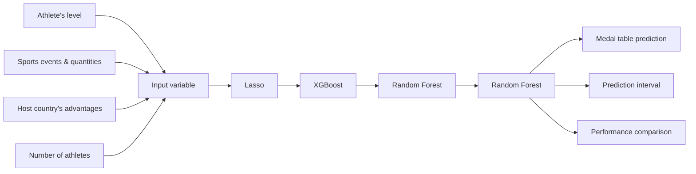
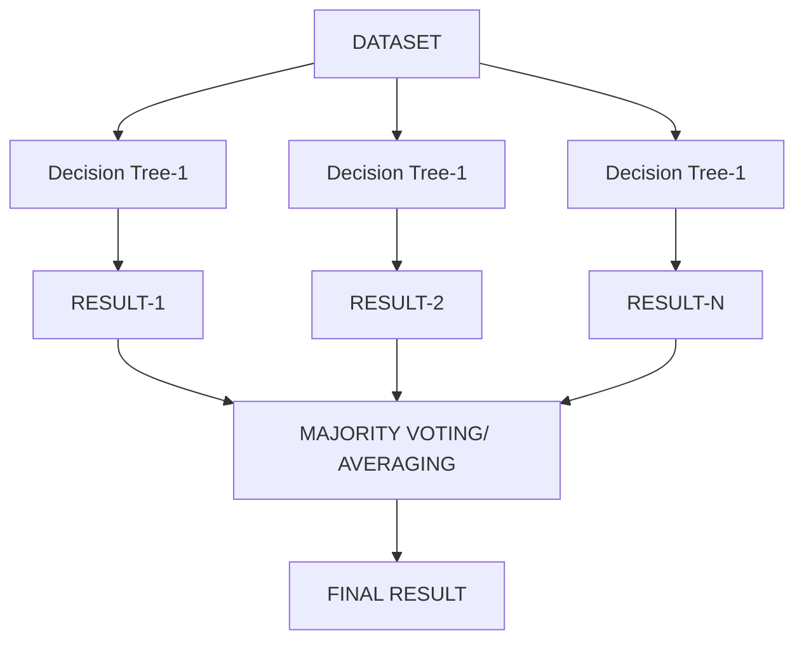
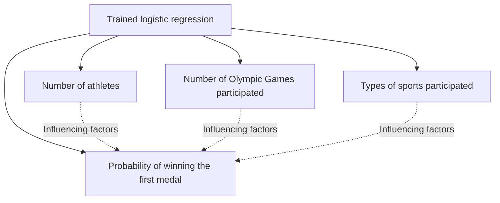
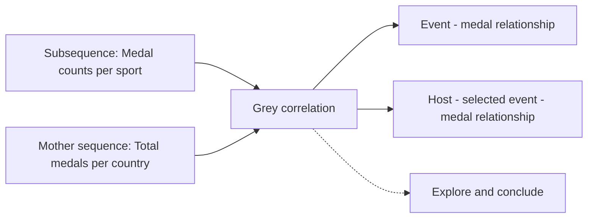
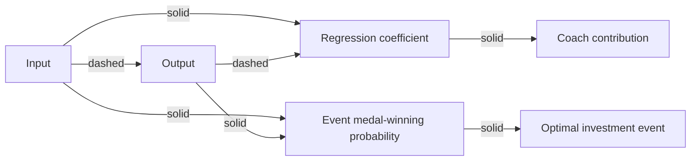
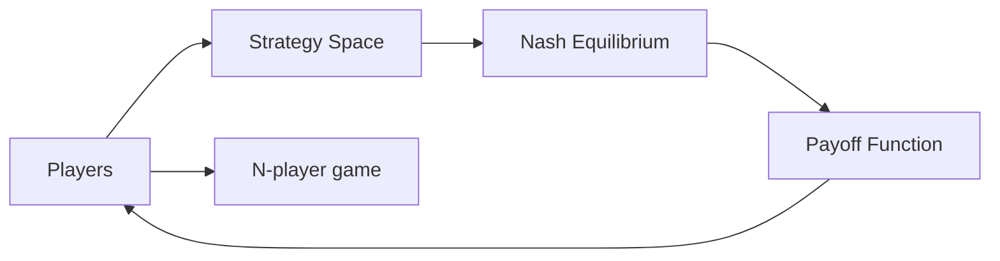

# Who will dominate the 2028 Olympic Games?

# Summary

Predicting Olympic medal counts is a hot topic in the sports world. Based on the data of previous Olympic Games, we constructed a Random Forest regression model for predicting the number of medals in future Olympic Games, offering a new approach to medal prediction.

In the first part of Problem 1, we constructed a medal prediction model by considering factors such as the level of athletes, the number and types of events, and the identity of the host country. Through ten-fold cross-validation, we compared Random Forest Regression, Lasso Regression, XGBoost Regression and Neural Network Regression models respectively, and evaluated model performance using metrics such as $R^{2}$ and MSE. The results show that the Random Forest Regression model performed best with an $R^{2}$ of 0.92 on the test set. Based on the predictions from this model, the three countries with the highest total medal counts at the 2028 Los Angeles Olympics are projected to be the United States, China, and the United Kingdom. Compared to previous Olympic Games, the United States is expected to see a 10% increase in the number of gold medals, while Japan is predicted to experience a 5% decrease in its gold medal count.

In the second part of Problem 1, for countries that have never won a medal, we constructed the Logistic Regression Model to predict their probability of winning, and the results show that four countries may win for the first time, with Angola's probability of winning for the first time being 0.81, making it the most likely to win for the first time. Subsequently, we explored the correlation between the events and the total number of medals by the Gray Correlation Analysis Model and found that there is a significant correlation between some of the events and the medal performance of specific countries.

For Problem 2, in order to explore the impact of the “great coach” effect on medal outcomes, we conducted the Two-sample mean hypothesis testing and the Chi-square test to examine the influence of great coaches on Olympic medal performance. The Logistic Regression Model was also applied to quantify the coach effect. The results show that the impact lies between athlete skill and the number of participants. Based on the results of the model analysis, we suggest that the United States, China and Japan should focus on investing in sports with great coaches.

For Problem 3, we explored the impact of host advantage on Olympic medal potential from a game-theoretic perspective. By utilizing the N-player Game Theory and analyzing the Nash Equilibrium, we revealed the interplay of medal distributions across countries and further elucidated the key role of host advantage in Olympic medal prediction.

Finally, we performed error evaluation and sensitivity analysis of the Cross-validation folds, verified the higher prediction accuracy and model robustness.

Keywords: Olympics ; medal prediction ; Machine Learning ; “great coach” effect

# Contents

# 1 Introduction....3

1.1 Problem Background ....3  
1.2 Restatement of the Problem....3  
1.3 Literature Review....4  
1.4 Our Work....4

# 2 Assumptions and Justifications....5

# 3 Notations ....5

# 4 Data Pre-processing and Visual Analytics 6

# 5 Olympic Medal Prediction Based on Machine Learning....8

5.1 Medal Table Prediction Model Based on Random Forest 8  
5.2 Prediction of First Medal Wins for Medal-less Countries 12  
5.3 Analysis of Factors Influencing Country Medal Counts....14

# 6 The Study of a "Great Coach" Effect....17

6.1 Analysis of the "great coach" effect 17  
6.2 Contribution of "great coach" Based on the Logistic....19  
6.3 Investment in "great coach" 20

# 7 Predicting Olympic Medals: Insights and Strategies ....21

7.1 The Number of Participating Athletes and the Potential to Win Medals ....21  
7.2 Medal Distribution of Different Countries in Various Events ....21  
7.3 Set Advantageous Events....21

# 8 Sensitivity Analysis and Error Analysis....22

8.1 Sensitivity Analysis....22  
8.2 Error Analysis ......23

# 9 Strengths and Weaknesses....24

9.1 Strengths 24  
9.2 Weaknesses ....24

# 10 Conclusion....25

# References....25

# 1 Introduction

# 1.1 Problem Background

The Olympic medal table measures countries' sporting prowess and informs their preparations for the Games. In the 2024 Paris Olympics, the United States, China, France, and the United Kingdom excelled, with the U.S. leading with 126 medals and China tying for the most golds. Several countries, including Albania, Cape Verde, Dominica, and St. Lucia, won medals for the first time, highlighting global competitiveness. However, over 60 countries still haven't won an Olympic medal, showing disparities in the global distribution of sports resources.

text_image

PARIS 2024

Figure 1: Paris 2024 Olympic Games

Predicting the number of Olympic medals has always been an important research problem, and traditional methods mostly rely on historical medal data. However, with the advance announcement of athlete lists and program settings, medal prediction based on more data and factors is gradually becoming a trend. By taking into account the strength of athletes, the types of events and other key factors, medal prediction can not only provide decision support for national Olympic committees but also help event organizations and related departments to optimize the allocation of resources.

# 1.2 Restatement of the Problem

Based on the given data, we specifically address the following questions:

Question1: Build a model using the given data to predict the number of gold medals and total medals for each country. Evaluate the model's uncertainty, accuracy, and performance.

- Based on the model, predict the medal standings for the 2028 Los Angeles Summer Olympics. Provide prediction intervals for all results and analyze which countries may show improvement and which countries may decline in performance.  
● Estimate the number of countries that have not won a medal yet, and predict the likelihood of these countries winning their first medal in the next Olympic Games.  
- Explore the relationship between the number and type of Olympic events and medal counts, and analyze how different sports matter to countries and how the host country's event selection affects competition results.

Question2: Analyze the impact of the "Great coach" Effect on medal counts, estimate its contribution, and recommend sports for three countries to invest in great coaches, along with the expected impact.

Question3: Present the novel insights revealed by the model regarding Olympic medal counts and explain how these insights can serve as valuable reference information for national Olympic committees.

# 1.3 Literature Review

The prediction of Olympic medals has always been a hot topic in sports science research. $^{[1]}$ The research of Nagpal P, Gupta K and Verma Y et al predicted the medal table through various regression methods (such as linear regression, polynomial regression, ridge regression, etc.). They found that socio-economic factors (such as GDP and population) have a significant impact on the number of medals. $[2]$ Zicheng Song's research predicted the number of Olympic medals of various countries based on a neural network model, emphasizing the advantages of deep learning in dealing with complex non-linear relationships. $[3]$ J. Moolchandani, V. Chole, and S. Sahu et al used machine learning methods to predict the medal distribution of the 2024 Summer Olympics. They used models such as linear regression, random forest, and support vector machine for prediction. The results showed that the random forest model had the highest accuracy, reaching 99%. Based on their research, this paper will further discuss and predict the medals of the 2028 Olympic Games.

1.4 Our Work  

```mermaid
graph TD
  subgraph Task1
  A["Athlete's level"] --> B["Sports events & quantities"]
  B --> C["Host country's advantages"]
  C --> D["Number of athletes"]
  D --> E["Input variable"]
  E --> F["Random Forest"]
  F --> G["Cross - validation"]
  F --> H["Lasso"]
  F --> I["XGBoost"]
  I --> J["Neural Network"]
  J --> K["Compare R² etc"]
  K --> L["Random Forest"]
  L --> M["Medal table prediction"]
  L --> N["Prediction interval"]
  L --> O["Performance comparison"]
  end

  subgraph Task2
  P["Number of athletes"] --> Q["Types of sports participated"]
  Q --> R["Number of Olympic Games participated"]
  R --> S["Trained logistic regression"]
  S --> T["Probability of winning the first medal"]
  end

  subgraph Task3
  U["Mother sequence: Total medals per country"] --> V["Grey correlation"]
  V --> W["Host - selected event - medal relationship"]
  W --> X["Event - medal relationship"]
  X --> Y["Invest in emerging projects"]
  X --> Z["Concentrate resources"]
  Y --> AA["The host sets up advantageous projects"]
  end

  subgraph Question2
  AB["Coaching duration of excellent coaches"] --> AC["Two-sample mean test"]
  AC --> AD["Chi-square test"]
  AD --> AE["Significantly affected"]
  AE --> AC
  AC --> AF["Medals won in event history"]
  AF --> AG["Trained logistic regression"]
  AG --> AH["Regression coefficient"]
  AH --> AI["Coach contribution"]
  AG --> AJ["Event medal-winning probability"]
  AG --> AK["Optimal investment event"]
  end

  subgraph Question3
  AL["Number of event participants"] --> AG
  AG --> AH
  AG --> AJ
  end
```

flowchart

Figure 2: Our Work Diagram

# 2 Assumptions and Justifications

To simplify the problem, we make the following basic assumptions, each of which is properly justified. Additional, more specific assumptions will be introduced as needed to refine our models.

\- Assumption 1: There will be no changes to the list of sports announced for the 2028 Los Angeles Olympics.

Justification: This assumption means that we assume that all new or existing Olympic sports will not undergo any changes before the 2028 Los Angeles Olympics, i.e. no new sports will be added and no existing sports will be deleted or canceled. This assumption helps us to simplify the model and to focus on existing data and known changes to the Olympic sports.

\- Assumption 2: New projects will have less impact on non-winning countries

Justification: We assume that for countries that have not yet won an Olympic medal, the addition of new sport will not immediately change their chances of winning a medal. These countries may be able to compete for medals in some of the new sports, but given their overall strength and athlete pool, the impact of the new sports is expected to be small, especially in the short term.

\- Assumption 3: Assuming that the level of sports in each country remains stable.

Justification: This assumption means that we assume that there will be no significant changes in the level of athletes (including skill, fitness, athleticism, etc.) in the different Olympic sports in each country.

\- Assumption 4: U.S will be competitive with home-field advantage in additional events at the 2028 Los Angeles Olympics.

Justification: With this assumption, we believe that the United States may be in a more favorable position than other countries to compete for medals in the five additional Olympic sports, especially since it has a clear competitive advantage in terms of technological accumulation and resource investment.

# 3 Notations

The key mathematical notations used in this paper are listed in Table 1.

Table 1: Notations used in this paper

<table><tr><td>Symbol</td><td>Description</td></tr><tr><td> $a_{ij}$ </td><td>Number of gold medals won in the j-th event of the i-th sport</td></tr><tr><td> $b_{ij}$ </td><td>Number of silver medals won in the j-th event of the i-th sport</td></tr><tr><td> $c_{ij}$ </td><td>Number of bronze medals won in the j-th event of the i-th sport</td></tr><tr><td> $d_{ij}$ </td><td>Non-medal participants in the j-th event of the ith sport</td></tr><tr><td> $X_1$ </td><td>Number of athletes who did not win a medal</td></tr><tr><td> $X_2$ </td><td>Number of participation in the programme</td></tr><tr><td> $X_3$ </td><td>Number of sessions of participation</td></tr><tr><td> $x_1$ </td><td>Number of hours of great coaching in the sport</td></tr><tr><td> $x_2$ </td><td>Historical medal count</td></tr><tr><td> $x_3$ </td><td>Number of participating athletes</td></tr></table>

# 4 Data Pre-processing and Visual Analytics

# 4.1 Data Pre-processing

Analyzing the given data reveals redundancy and scatter, so we first perform outlier removal, data complementation, integration, and collection to prepare for model construction later in the paper.

# ◆ Outlier Handling

The 1906 data in the summerOly\_athletes attachment pertains to the unofficial Olympic Games and should be removed as outliers. Additionally, data from several Olympic Games affected by international situations and other factors will be deleted to prevent negative impact on the model.

# ◆ Data Completion

The summerOly\_programs annex contains some missing data. After review, the missing values are filled in to ensure completeness and avoid affecting subsequent analysis.

# ◆ Data Consolidation

# (1) Text Data Processing

Gold medals are coded as 1, silver as 2, bronze as 3, and no medals as 0. The host country for each year is labeled as 1, while all others are labeled as 0.

# (2) Data Aggregation

Data aggregation is performed based on country, event, and year, with the following aggregation rules:

①Each event is categorized by sport, and the number of gold, silver, and bronze medals, as well as the number of participants, are calculated.  
②If an event is missing in a certain year, all countries will have a value of 0 for that event.

# (3) Data Encoding

Countries are sorted in ascending order by name, and each country is assigned a numerical code starting from 1 to replace the country name.

# (4) Standardization of region names

In the annex 'summerOly\_medal\_counts', add a column with the Olympic Games country abbreviation in the NOC column to facilitate subsequent modeling.

# ◆ Data Collection

Given that the total number of medals depends entirely on the events included in the Summer Olympics and that countries specialize in different sports, it is crucial to know the events scheduled for the 2028 Games. Relevant event details have been compiled and recorded in the annex 'summerOly\_programs' for unified processing. Below are the data sources:

Table 2:Data source website

<table><tr><td>Database Names</td><td>Database Websites Data</td></tr><tr><td>2028 Olympic sportsCountries participating in the 2028 Olympic GamesInternational Coach CouncilEntertainment Sports Programming Network</td><td>https://la28.org/https://www.olympics.com/en/https://coachfederation.org/https://www.espn.com/</td></tr></table>

# 4.2 Visual Analytics

This section presents a visual analysis of Olympic medal counts through statistical charts, offering insights into the distribution of medals across countries and highlighting their competitive strengths over time and in different sports.

# ◆ Number of medals by country

Analyze the data and draw the following statistical graphs:

bar

| Team | Gold Medal Total | Total Medal Count |
| :--- | :--- | :--- |
| United States | 1027 | 2583 |
| Soviet Union | 352 | 907 |
| China | 303 | 727 |
| Great Britain | 292 | 944 |
| France | 229 | 792 |
| Germany | 215 | 680 |
| Italy | 205 | 591 |
| Japan | 178 | 508 |
| Hungary | 175 | 494 |
| Australia | 171 | 573 |

Figure 3: Number of medals by country

Analysis of the graph reveals that the United States leads in both gold medals (1,027) and total medals (2,583), demonstrating its strong competitiveness. The USSR and China rank second and third with 352 and 303 gold medals, respectively, though China surpasses the USSR in total medals (727 vs. 907). Countries like Great Britain, France, and Germany show more balanced performances, with Great Britain achieving 292 gold medals and 944 total medals. In conclusion, the United States remains dominant in Olympic performance, while other nations show varying strengths in gold and total medal counts.

# ◆ Time series chart of the number of medals in each event

Under normal circumstances, the number of medals won by each country should follow a stable trend, either gradually increasing or decreasing, with no abrupt fluctuations. This is due to each country's unique geographical position and specialization in specific events, with performance trends accumulating over time. Taking the United States as an example, the medal count for each edition of the Games and the four disciplines where it performed most prominently were selected and analyzed, as shown in the chart below:

line

| Year | Swimming | Rowing | Basketball | Athletics |
| --- | --- | --- | --- | --- |
| 1900 | 0 | 0 | 0 | 17 |
| 1903 | 22 | 36 | 0 | 72 |
| 1906 | 5 | 0 | 0 | 41 |
| 1909 | 7 | 0 | 0 | 49 |
| 1912 | 22 | 17 | 0 | 36 |
| 1915 | 26 | 20 | 0 | 48 |
| 1918 | 21 | 19 | 0 | 34 |
| 1921 | 17 | 15 | 0 | 44 |
| 1924 | 17 | 10 | 14 | 34 |
| 1927 | 25 | 18 | 14 | 33 |
| 1930 | 19 | 14 | 14 | 40 |
| 1933 | 22 | 22 | 12 | 40 |
| 1936 | 40 | 7 | 12 | 32 |
| 1939 | 61 | 19 | 12 | 33 |
| 1942 | 83 | 4 | 12 | 37 |
| 1945 | 74 | 9 | 12 | 28 |
| 1948 | 55 | 12 | 24 | 31 |
| 1951 | 63 | 38 | 24 | 56 |
| 1954 | 45 | 14 | 24 | 40 |
| 1957 | 56 | 10 | 24 | 48 |
| 1960 | 60 | 12 | 24 | 39 |
| 1963 | 66 | 6 | 24 | 28 |
| 1966 | 65 | 18 | 24 | 38 |
| 1969 | 68 | 19 | 24 | 32 |
| 1972 | 75 | 17 | 24 | 42 |
| 1975 | 59 | 10 | 24 | 46 |
| 1978 | 68 | 0 | 24 | 52 |
| 1981 | 58 | 13 | 24 | 58 |

Figure 4: The number of medals in each event

line

| Year | Gold | Silver | Bronze | Total |
| --- | --- | --- | --- | --- |
| 1900 | ~10 | ~10 | ~5 | ~20 |
| 1903 | ~15 | ~15 | ~15 | ~50 |
| 1905 | ~75 | ~75 | ~75 | ~230 |
| 1908 | ~25 | ~25 | ~10 | ~50 |
| 1910 | ~25 | ~20 | ~15 | ~65 |
| 1920 | ~40 | ~30 | ~25 | ~95 |
| 1923 | ~45 | ~30 | ~25 | ~100 |
| 1927 | ~20 | ~20 | ~15 | ~55 |
| 1930 | ~45 | ~35 | ~30 | ~110 |
| 1933 | ~25 | ~25 | ~10 | ~55 |
| 1948 | ~40 | ~25 | ~15 | ~85 |
| 1950 | ~40 | ~25 | ~15 | ~75 |
| 1955 | ~35 | ~25 | ~15 | ~75 |
| 1958 | ~35 | ~20 | ~15 | ~70 |
| 1963 | ~40 | ~30 | ~25 | ~90 |
| 1965 | ~45 | ~30 | ~30 | ~105 |
| 1970 | ~35 | ~30 | ~30 | ~95 |
| 1973 | ~35 | ~35 | ~25 | ~95 |
| 1983 | ~85 | ~60 | ~30 | ~175 |
| 1987 | ~35 | ~35 | ~30 | ~95 |
| 1989 | ~40 | ~35 | ~35 | ~105 |
| 1990 | ~45 | ~30 | ~30 | ~100 |
| 1995 | ~35 | ~35 | ~30 | ~95 |
| 1998 | ~40 | ~35 | ~35 | ~100 |
| 2000 | ~40 | ~35 | ~35 | ~105 |
| 2003 | ~40 | ~35 | ~35 | ~110 |
| 2005 | ~45 | ~30 | ~30 | ~105 |
| 2008 | ~50 | ~35 | ~35 | ~120 |
| 2010 | ~45 | ~35 | ~35 | ~115 |
| 2013 | ~40 | ~40 | ~35 | ~125 |

Figure 5: U.S. Medal Count

Figure 4 shows that the number of medals won by the United States fluctuated significantly over the years. Notably, the U.S. reached peak medal counts in 1904 and 1984, likely due to its role as host. During both World Wars, U.S. medal counts declined, possibly reflecting the disruption caused by the wars. Since the 21st century, while fluctuations have occurred, the U.S. has maintained a generally high medal count.

Figure 5 highlights that swimming has been a traditional strength for the United States, with high medal counts sustained over most years. Basketball, since its Olympic debut in 1936, has been another stable area of success, reflecting the U.S.'s continued dominance, particularly through professional leagues like the NBA, which has kept U.S. basketball at the forefront globally.

# 5 Olympic Medal Prediction Based on Machine Learning

flowchart

Figure 6: Flowchart of part 1 of question 1

# 5.1 Medal Table Prediction Model Based on Random Forest

# 5.1.1 Determination of Input Variables

- The level of athletes in various sports: Different countries have significant advantages in certain Olympic events. Usually, this is because the athletes in these countries have undergone long-term training and possess high-level technical and tactical capabilities as well as excellent physical fitness.  
● The number and types of competition events: The number and types of events in each

Olympic Games affect a country's chances of winning medals. Some countries may have traditional advantages in the events that are added or removed from the Olympics, which will impact the number of medals they can obtain.

- The impact of being the host country on medal performance: The host country usually has certain advantages in terms of psychology, resources, funding, and audience support. This may enhance its performance in some events, and this is a typical 0 - 1 variable.  
- The number of athletes a country sends to the Olympics: Countries with a larger number of participating athletes can usually compete in multiple events, thus increasing their chances of winning medals. More athletes mean more opportunities to perform and greater potential to increase the number of medals.

# 5.1.2 Comprehensive Strength Evaluation of Each Event

By analyzing the medal distribution of each event in the previous Olympic Games and the number of non-winning participants, a quantitative indicator was constructed to measure the comprehensive competitive strength of each country in that event. Based on the total number of historical medals of athletes, it is possible to effectively evaluate a country's performance and competitiveness in the event, providing a reliable reference for medal predictions in future Olympic Games.

# Step1: Determine variables

Let $a_{ij}$ be the number of gold medals won in the j-th event of the i-th sport, $b_{ij}$ be the number of silver medals won in the j-th event of the i-th sport, $c_{ij}$ be the number of bronze medals won in the j-th event of the i-th sport, and $d_{ij}$ be the non-medal participants in the j-th Event of the i-th Sport

# Step 2: Subjectively assign weights

Each indicator (such as the number of gold medals, silver medals, bronze medals, and the number of non-medalists) contributes differently to the comprehensive strength. Therefore, we assign the following weights:

Table 3: Weighting of award indicators

<table><tr><td></td><td>Gold</td><td>Silver</td><td>Bronze</td><td>Total</td></tr><tr><td>Weight</td><td>0.45</td><td>0.35</td><td>0.15</td><td>0.05</td></tr></table>

# Step3: Quantification of the comprehensive strength of each country in each event

Let the comprehensive strength of the i-th event of the m-th country be $H_{mi}$ , which can be expressed as:

$$
H _ {m i} = 0. 4 5 \sum_ {j = 1} a _ {i j} + 0. 3 5 \sum_ {j = 1} b _ {i j} + 0. 1 5 \sum_ {j = 1} c _ {i j} + 0. 0 5 \sum_ {j = 1} d _ {i j} \tag {1}
$$

# 5.1.3 Establishment of the National Medal Quantity Prediction Model

Predicting the number of Olympic medals is a complex regression problem that involves multiple factors. To accurately predict the number of medals for each country, choosing an

appropriate machine-learning model is of great significance. Especially when dealing with multiple features and complex data relationships, different regression models have different advantages and applicable scenarios.

For this reason, this paper will compare four machine learning models widely used in regression problems: Random Forest regression, Lasso regression, XGBoost regression, and Neural Network regression. By comparing the prediction effects of these models, the aim is to find the model most suitable for the task of predicting the number of Olympic medals. To improve the accuracy of the regression models, this paper uses ten-fold cross-validation. The hold-out method is adopted, with 90% of the samples used as the training set and 10% of the samples used as the test set. The evaluation metrics of the four regression models are calculated, as shown in the following table:

Table 4: Results of regression model evaluation

<table><tr><td></td><td>Lasso</td><td>Random Forest</td><td>XGBoost</td><td>Neural Network</td></tr><tr><td> $R^2$ </td><td>0.55</td><td>0.92</td><td>0.68</td><td>0.79</td></tr><tr><td>MSE</td><td>89.50</td><td>12.20</td><td>66.70</td><td>47.10</td></tr><tr><td>RMSE</td><td>9.46</td><td>3.49</td><td>8.16</td><td>6.86</td></tr><tr><td>MAE</td><td>8.04</td><td>3.14</td><td>7.98</td><td>5.91</td></tr></table>

During the comparison of multiple regression models, after comprehensive evaluation and verification, the Random Forest regression model outperforms other models in evaluation metrics such as $R^{2}$ , MSE and MAE. Therefore, based on its high prediction accuracy and strong generalization ability, this study finally selects the Random Forest regression model as the main tool for predicting the number of medals in the 2028 Olympic Games.

# 5.1.4 Medal Table Prediction Results Based on Random Forest

In order to accurately predict the number of medals of each country in the 2028 Olympic Games, we adopt the Random Forest regression model. This model achieves efficient prediction by integrating multiple decision trees and is particularly suitable for dealing with data with complex non-linear relationships and multi-dimensional features. The advantages of the random forest regression model lie in its strong feature selection ability, low risk of overfitting, and excellent generalization ability. Through multiple trainings and evaluations, it has been confirmed that this model performs outstandingly when dealing with the task of Olympic medal prediction.

flowchart

Figure 7: Random Forest mechanism diagram

Based on the collected data of the 2028 Olympic Games, the trained Random Forest regression model is used for prediction. The model predicts the number of medals each country will win in the Olympics based on features such as the level and quantity of athletes from

each country, as well as the number of competition events. Due to space limitations, this paper only presents the prediction results of some countries. The specific prediction results are as follows (all values are integers):

Table 5:2028 Medal Table Prediction

<table><tr><td></td><td>Gold</td><td>Silver</td><td>Bronze</td><td>Total</td></tr><tr><td>United States</td><td>44</td><td>46</td><td>42</td><td>132</td></tr><tr><td>China</td><td>40</td><td>30</td><td>26</td><td>96</td></tr><tr><td>Great Britain</td><td>14</td><td>25</td><td>30</td><td>69</td></tr><tr><td>Australia</td><td>20</td><td>16</td><td>20</td><td>56</td></tr><tr><td>Japan</td><td>19</td><td>11</td><td>16</td><td>46</td></tr></table>

From the analysis, it can be seen that in the prediction for the 2028 Olympic Games, the number of gold medals won by the United States will increase by 10%, and it will still rank first in the total number of medals. The number of gold medals won by China remains unchanged, but the total number of medals will increase by 5%. The number of gold medals won by Japan will decrease by 5%.

# 5.1.5 Confidence Interval

To further evaluate the reliability and uncertainty of the model's predictions, this study also calculated the upper and lower limit intervals for the predicted medal counts of each country. By introducing the prediction interval, the upper and lower limits of each predicted value can be given, thereby indicating the possible range of the true medal count under a certain confidence level. The following figure shows the prediction results of some countries and their corresponding upper and lower limit intervals of the predictions. All values are integers.

The specific illustration is as follows:

  
Figure 8: Line graph of confidence limits on the number of medals predicted

As shown above, introducing the prediction interval can present the possible range of each country's true medal count at a certain confidence level. This not only enhances the transparency of prediction results but also offers more reliable information for decision-makers to evaluate potential uncertainties and risks.

# 5.2 Prediction of First Medal Wins for Medal-less Countries

# 5.2.1 Model Preparation

# (1) Determination of independent and dependent variables

\- Independent variables:

\$\left\{\begin{array}{l}\text{The number of medal - less athletes } (X\_1) \\ \text{The number of events participated in } (X\_2) \\ \text{The number of Olympic Games participated in } (X\_3)\end{array}\right.\$

\- Dependent variable:

$Y = \left\{ \begin{array}{ll}1, & \text{The country has won medals}\\ 0, & \text{The country has not won any medals} \end{array} \right.$

flowchart

Figure 9: Flowchart of part 2 of question 1

# (2) Establish a Logistic regression model

$^{[4]}$ Logistic regression is a statistical model widely used for classification problems, mainly for binary classification. It linearly combines features and uses the Sigmoid function to map the result to a probability value between 0 and 1 to address binary classification issues. The model uses maximum likelihood estimation to optimize parameters and interprets the impact of features on the probability of an event occurring through regression coefficients.

The steps of Logistic regression are as follows:

# Step1: Data preparation

Collect a dataset that includes multiple features $X_{1}$ , $X_{2}$ , $X_{3}$ and a target variable Y, which Y is a binary classification variable (0 or 1). Then standardize or normalize the data.

# Step2: Define the Logistic regression model

Express the linear combination of input features as:

$$
z = \beta_ {0} + \beta_ {1} X _ {1} + \beta_ {2} X _ {2} + \beta_ {3} X _ {3} \tag {2}
$$

Map the linear combination $z$ to the interval [0, 1] through the Sigmoid function. The probability of the event $Y = 1$ occurring is

$$
P (Y = 1 \mid X) = \frac {1}{1 + e ^ {- z}} = \frac {1}{e ^ {- (\beta_ {0} + \beta_ {1} X _ {1} + \beta_ {2} X _ {2} + \beta_ {3} X _ {3})}} \tag {3}
$$

# Step3: Model training

Based on the training data, define the likelihood function of Logistic regression, which represents the probability of observing the data given the parameter $\beta$ :

$$
L (\beta) = \prod_ {i = 1} ^ {m} P (Y _ {i} | X _ {i}) ^ {Y _ {i}} (1 - P (Y _ {i} | X _ {i})) ^ {1 - Y _ {i}} \tag {4}
$$

To simplify the calculation, take the logarithm to obtain the log-likelihood function:

$$
\log L (\beta) = \sum_ {i = 1} ^ {m} \left[ Y _ {i} \log P (Y _ {i} | X _ {i}) + (1 - Y _ {i}) \log (1 - P (Y _ {i} | X _ {i})) \right] \tag {5}
$$

Estimate the parameter $\beta$ of the model by maximizing the log-likelihood function:

$$
\hat {\beta} = \arg \max \log L (\beta) \tag {6}
$$

# Step4: Calculate the predicted probability and make a classification decision

For each sample in the test set, calculate the probability that its class is 1:

$$
\hat {P} (Y = 1 | X) = \frac {1}{1 + e ^ {- (\hat {\beta} _ {0} + \hat {\beta} _ {1} X _ {1} + \dots + \hat {\beta} _ {n} X _ {n})}} \tag {7}
$$

Based on the probability value, classify the sample as 0 or 1, setting the threshold at 0.5:

$$
\hat {Y} = \left\{ \begin{array}{l} 1, i f \widehat {P} (Y = 1 | X) \geq 0. 5 \\ 0, i f \widehat {P} (Y = 1 | X) <   0. 5 \end{array} \right. \tag {8}
$$

# 5.2.2 Model results

We trained the model using 10-fold cross-validation. The final regression model obtained is:

$$
\hat {P} (Y = 1 | X) = \frac {1}{1 + e ^ {- (0 . 0 0 6 + 0 . 1 4 X _ {1} + 0 . 2 8 X _ {2} + 0 . 3 4 X _ {3})}} \tag {9}
$$

In a logistic regression model, the odds ratio is the ratio of the probability of an event occurring to the probability of the event not occurring, that is:

$$
O d d s = \frac {P}{1 - P} \tag {10}
$$

Solving based on the data, the results are as shown in the following table:

Table 6: Forecast of first-time winners

<table><tr><td>Team</td><td>P</td><td>Odds</td><td>Whether to win a medal</td></tr><tr><td>Angola</td><td>0.81</td><td>4.26</td><td>1</td></tr><tr><td>El Salvador</td><td>0.72</td><td>2.57</td><td>1</td></tr><tr><td>Honduras</td><td>0.69</td><td>2.23</td><td>1</td></tr><tr><td>Nicaragua</td><td>0.67</td><td>2.03</td><td>1</td></tr></table>

Calculations show that only the p-values of the above four countries are all greater than 0.5 and the odds ratios are relatively large. That is, these countries have a relatively high possibility of winning their first medals at the 2028 Olympic Games. Among them, Angola has the largest p-value of 0.81, meaning it is the most likely to win its first medal.

# 5.3 Analysis of Factors Influencing Country Medal Counts

flowchart

Figure 10: Analysis of factors influencing the number of medals

# 5.3.1 Analysis of the Influence of Olympic Events

# (1) Analysis of the Medal Distribution of Olympic Events for Each Country Based on Radar Charts

To more intuitively display the medal distribution of each country in different Olympic events, this study uses radar charts as a visualization tool. Radar charts can effectively present multi-dimensional data and help compare the advantages and disadvantages of each country in various events. Taking the United States, China, and France as examples, the drawn radar charts are as follows:

radar

| Dimension | CHN | USA | FRA |
| --- | --- | --- | --- |
| Athletics | ~0.2 | ~0.9 | ~0.1 |
| Diving | ~0.3 | ~0.1 | ~0.1 |
| Shooting | ~0.2 | ~0.1 | ~0.1 |
| Swimming | ~0.2 | ~0.8 | ~0.2 |
| Wrestling | ~0.2 | ~0.1 | ~0.3 |

Figure 11: Radar chart analysing levels in selected sports

The above figure shows the performance differences among China, the United States, and France in five Olympic events. China stands out in swimming, wrestling, and diving, with particularly obvious advantages in diving and wrestling. The United States takes a dominant position in track and field and swimming, demonstrating its strong competitiveness in multiple events. France shows a relatively balanced performance, with certain advantages in shooting and swimming. Overall, it reflects the differences in competitiveness of the three countries in their respective advantageous events.

# (2) Grey Relational Analysis

Grey Relational Analysis quantifies the degree of association between different factors by comparing their changing trends $^{[5]}$ . It is particularly suitable for situations with incomplete information or uncertainty. This method identifies key influencing factors or conducts pattern recognition by calculating the degree of association. In this study, the number of medals in each sports event is regarded as a subsequence, and the total number of medals of each country is regarded as the mother sequence. The degree of association between each event and the total number of medals of each country is calculated, and the strength of their correlation is measured by the value of the degree of association.

The analysis steps are as follows:

# Step1: Determine the mother sequence and subsequences

Suppose there are m evaluation objects and n evaluation indicators. The mother sequence is $x_{0}=x_{0}(k)|k=1,2,\ldots,n$ , and the subsequences are $x_{i}=x_{i}(k)|k=1,2,\ldots,m$ .

# Step2: Preprocess the variables

Pre-process each indicator in the mother sequence and subsequences respectively. First, calculate the mean of each indicator, and then divide each element in the indicator by its mean. This can eliminate the influence of dimensions and narrow the range of variables to simplify calculations. Let the standardized matrix be Z, and the elements in Z be denoted as $Z_{ij}$ , The calculation formula is as follows:

$$
Z _ {i j} = \frac {x _ {i j}}{\overline {{x}} _ {i j}} \tag {11}
$$

Obtain the standardized matrix: $Z$

$$
\left[ \begin{array}{c c c c} Z _ {1 1} & Z _ {1 2} & \dots & Z _ {1 m} \\ Z _ {2 1} & Z _ {2 2} & \dots & Z _ {2 m} \\ \vdots & \vdots & \ddots & \vdots \\ Z _ {n 1} & Z _ {n 2} & \dots & Z _ {n m} \end{array} \right] \tag {12}
$$

Step3: Calculate the correlation coefficients between each indicator in the subsequences and the mother sequence

$$
y (x _ {0} (k), x _ {i} (k)) = \frac {a + \rho b}{| x _ {0} (k) - x _ {i} (k) | + \rho b} (i = 1, 2, \dots m, k = 1, 2, \dots n) \tag {13}
$$

Among them, $\rho$ is the distinguishing coefficient, usually taken as 0.5. a is the minimum difference of the two levels, and b is the maximum difference of the two levels. The calculation formulas are as follows:

$$
a = \min _ {i} \min _ {k} | x _ {0} (k) - x _ {i} (k) | \tag {14}
$$

$$
b = \max _ {i} \max _ {k} \mid x _ {0} (k) - x _ {i} (k) \mid
$$

Step4: Calculate the grey relational degree

$$
y (x _ {0}, x _ {i}) = \frac {1}{n} \sum_ {k = 1} ^ {n} y (x _ {0} (k), x _ {i} (k)) = \frac {1}{n} \sum_ {k = 1} ^ {n} \frac {a + \rho b}{| x _ {0} (k) - x _ {i} (k) | + \rho b} \tag {15}
$$

This study uses the grey relational analysis model to quantify the degree of association between each sports event and the total number of medals, and further explore their correlation. The following table shows the degree of association between some events and the total number of medals of some countries:

Table 7: Correlation between sports and medals

<table><tr><td></td><td>Athletics</td><td>Swimming</td><td>Diving</td><td>Volleyball</td><td>Triathlon</td></tr><tr><td>United States</td><td>0.84</td><td>0.83</td><td>0.45</td><td>0.67</td><td>0.51</td></tr><tr><td>China</td><td>0.54</td><td>0.65</td><td>0.87</td><td>0.79</td><td>0.21</td></tr><tr><td>Great Britain</td><td>0.45</td><td>0.66</td><td>0.12</td><td>0.34</td><td>0.82</td></tr><tr><td>Australia</td><td>0.5</td><td>0.54</td><td>0.56</td><td>0.21</td><td>0.56</td></tr><tr><td>Japan</td><td>0.44</td><td>0.32</td><td>0.45</td><td>0.45</td><td>0.11</td></tr></table>

By analyzing the above table, it can be seen that the United States has a high degree of association with track and field and swimming events, which are 0.84 and 0.83 respectively. This indicates that these two events are crucial to the number of its medals. China has the highest degree of association with the diving event (0.87), highlighting the dominant position of diving in its Olympic performance. The degree of association of the United Kingdom with the triathlon is 0.82, showing the significant impact of this emerging event on the total number of its medals. In contrast, Japan has a generally low degree of association with various events, indicating its relatively balanced overall competitiveness in multiple events.

# 5.3.2 Influence of the Events Chosen by the Host Country on the Results

# (1) Visual analysis

To visually display the changes in the medal performances of various countries in successive Olympic Games, the following chart shows the number of medals of different countries in each Olympic Games. The horizontal axis represents the year of the Olympic Games, the vertical axis represents the number of medals, and each line represents the number of medals of a particular country.

line

| Year | US | CHN | FRA | JPN | GBR |
| --- | --- | --- | --- | --- | --- |
| 1900 | ~20 | ~10 | ~10 | 0 | ~10 |
| 1903 | ~50 | ~30 | ~100 | 0 | ~30 |
| 1906 | ~230 | ~50 | ~20 | 0 | ~145 |
| 1909 | ~50 | ~65 | ~15 | 0 | ~40 |
| 1912 | ~95 | ~95 | ~40 | 0 | ~40 |
| 1915 | ~100 | ~100 | ~35 | 0 | ~35 |
| 1918 | ~55 | ~55 | ~20 | 0 | ~20 |
| 1921 | ~110 | ~110 | ~20 | 0 | ~20 |
| 1924 | ~55 | ~55 | ~20 | 0 | ~15 |
| 1927 | ~85 | ~85 | ~30 | 0 | ~20 |
| 1930 | ~75 | ~75 | ~20 | 0 | ~20 |
| 1933 | ~70 | ~70 | ~20 | 0 | ~20 |
| 1936 | ~90 | ~90 | ~20 | 0 | ~20 |
| 1939 | ~105 | ~105 | ~20 | 0 | ~20 |
| 1942 | ~95 | ~95 | ~20 | 0 | ~20 |
| 1945 | ~95 | ~95 | ~20 | 0 | ~20 |
| 1948 | ~175 | ~175 | ~35 | 0 | ~35 |
| 1951 | ~95 | ~95 | ~20 | 0 | ~20 |
| 1954 | ~105 | ~105 | ~30 | 0 | ~20 |
| 1957 | ~100 | ~100 | ~35 | 0 | ~20 |
| 1960 | ~95 | ~95 | ~35 | 0 | ~20 |
| 1963 | ~100 | ~100 | ~35 | 0 | ~20 |
| 1966 | ~105 | ~105 | ~35 | 0 | ~20 |
| 1969 | ~110 | ~110 | ~40 | 0 | ~20 |
| 1972 | ~105 | ~105 | ~40 | 0 | ~20 |
| 1975 | ~110 | ~110 | ~40 | 0 | ~20 |
| 1978 | ~115 | ~115 | ~40 | 0 | ~20 |
| 1981 | ~120 | ~120 | ~40 | 0 | ~20 |
| 1984 | ~125 | ~125 | ~40 | 0 | ~20 |
| 1987 | ~125 | ~125 | ~40 | 0 | ~20 |
| 1990 | ~125 | ~125 | ~40 | 0 | ~20 |
| 1993 | ~125 | ~125 | ~40 | 0 | ~20 |
| 1996 | ~125 | ~125 | ~40 | 0 | ~20 |
| 1999 | ~125 | ~125 | ~40 | 0 | ~20 |
| 2002 | ~125 | ~125 | ~40 | 0 | ~20 |
| 2005 | ~125 | ~125 | ~40 | 0 | ~20 |
| 2008 | ~125 | ~125 | ~40 | 0 | ~20 |
| 2011 | ~125 | ~125 | ~40 | 0 | ~20 |
| 2014 | ~125 | ~125 | ~40 | 0 | ~20 |
| 2017 | ~125 | ~125 | ~40 | 0 | ~20 |
| 2020 | ~125 | ~125 | ~40 | 0 | ~20 |
| 2023 | ~125 | ~125 | ~40 | 0 | ~20 |

Figure 12: Time series chart of the number of medals

From the graph, it can be observed that the total number of medals of the United States reached its peak in 1984, and this phenomenon is closely related to the fact that the Olympic Games were held in the United States that year. Similarly, China also achieved a record-high number of medals in 2008, reflecting the positive impact of the host status on its performance. In 2020, the total number of medals of France also reached its peak, which is inseparable from Paris being the host city. Thus, it can be seen that the host status significantly promotes the medal performance of the host country in the Olympic Games.

# (2) The potential impact of the United States' host status on its medal performance in 2028

The five new sports added to the 2028 Los Angeles Olympics - baseball/softball, lacrosse, cricket, squash, and flag football - will enhance the United States' medal potential. Baseball and lacrosse, as traditional strong suits of the United States, are expected to contribute a large number of medals. Although cricket and squash are relatively niche sports, their inclusion is expected to boost the United States' performance in these events. Flag football provides new opportunities for the young population, further increasing the United States' competitiveness in the Olympics.

# 6 The Study of a “Great Coach” Effect

# 6.1 Analysis of the “great coach” effect

# 6.1.1 Two-sample Mean Hypothesis Testing

To explore whether the "great coach" effect has an impact on Olympic medal performance, we selected the two-sample mean hypothesis testing method. This method is applicable for comparing whether there is a significant difference between the means of two independent samples. In this study, we defined the two samples as follows: one set of data represents the performance before a great coach took charge, and the other represents

Do excellent coaches affect the medal-winning situation?  

donut

| Region | Value |
| --- | --- |
| Two-sample mean test | — |
| Two-sample mean test & Chi-square test | Significantly affected |
| Chi-square test | — |

Figure 13: Test Method

the performance after the coach started coaching. By examining the differences in the number of Olympic medals between the two groups of countries, we can evaluate the potential impact of the "great coach" effect.

# Step1: Formulate hypotheses

$$
\text {Null Hypothesis} H _ {0}: \mu_ {1} = \mu_ {2} \tag {16}
$$

$$
\text {Alternative Hypothesis} H _ {1}: \mu_ {1} \neq \mu_ {2}
$$

Set the confidence level at 95%.

# Step2: Calculate the P - value

According to the results of the hypothesis test, when the P-value is less than the set significance level, we reject the null hypothesis and conclude that the coach's coaching has a significant impact on the country's performance. If the P-value is greater than 0.05, it indicates that there is no significant change in performance before and after the coach takes charge.

For the convenience of statistics, we record the total number of medals as follows:

$$
\text {Total} = 4 \times \text {Gold} + 2 \times \text {Silver} + \text {Bronze}
$$

We use SPSS for significance testing, and the results are shown in the following table (both Pre - coaching medals and Post - coaching medals in the table below are average values):

Table 8:Significance test results

<table><tr><td>Team</td><td>Sport</td><td>Coach</td><td>Time</td><td>Pre-coaching medals</td><td>Post-coaching medals</td><td>P</td></tr><tr><td>US</td><td>Volleyball</td><td>Lang Ping</td><td>2005-2008</td><td>0.5</td><td>2</td><td>0.05</td></tr><tr><td>US</td><td>Gymnastics</td><td>Martha Karolyi</td><td>1981-2016</td><td>0.71</td><td>3</td><td>0.01</td></tr><tr><td>CHI</td><td>Volleyball</td><td>Lang Ping</td><td>2013-2016</td><td>1.5</td><td>4</td><td>0.007</td></tr><tr><td>JAP</td><td>Gymnastics</td><td>Béla Károlyi</td><td>2000-2012</td><td>1.16</td><td>2.67</td><td>0.09</td></tr></table>

In the table, based on the analysis of the P-values, Lang Ping's coaching of the US women's volleyball team and the Chinese women's volleyball team significantly increased the medal counts of both teams. The P-values are 0.05 and 0.007 respectively, indicating her significant influence. Martha Karolyi's coaching of the US gymnastics team also significantly increased the medal count, with a P-value of 0.01, demonstrating her significant contribution. Although Béla Károlyi's influence on the Japanese gymnastics team led to an increase, the P-value is 0.07, indicating that the change is not significant. This shows that the "great coach" effect has played a key role in some teams.

# 6.1.2 Chi-square Test

The chi-square test is used to determine whether two categorical variables are related or independent $^{[6]}$ . By comparing the differences between the actual observed frequencies and the expected frequencies, if the p-value is significantly small, it indicates that there is a statistical association between the variables; otherwise, they are considered independent. In this paper, the frequency data of multiple categorical characteristics were analyzed, and contingency tables were constructed for the test.

First, when analyzing whether there is a relationship between great coaches and the award results, take Coach Lang Ping's guidance of the Chinese team and the US team as an example, by organizing the award-winning situations of the Chinese and US women's volleyball teams in 2008 and 2016, the following two - dimensional contingency table can be obtained:

Table 9:chi-square test series

<table><tr><td rowspan="2"></td><td colspan="2">Presence of an excellent coach</td><td rowspan="2">Total</td></tr><tr><td>Yes</td><td>No</td></tr><tr><td>CHI</td><td>12</td><td>1</td><td>13</td></tr><tr><td>USA</td><td>4</td><td>1</td><td>5</td></tr><tr><td>Total</td><td>16</td><td>2</td><td>18</td></tr></table>

Set up the null hypothesis $H_0$ : There is no relationship between the presence of a great coach and the number of medals won, that is, they are independent, which can be expressed as follows:

$$
H _ {0}: p _ {i j} = p _ {i}. p _ {. j} \tag {17}
$$

Next, under the condition that the null hypothesis holds, the maximum likelihood estimates of each parameter can be obtained:

$$
p _ {i \cdot} = \frac {n _ {i \cdot}}{n} (i = 1, 2) \tag {18}
$$

$$
p _ {\cdot j} = \frac {n _ {\cdot j}}{n} (j = 1, 2)
$$

Its test statistic is:

$$
\chi^ {2} = \sum_ {j = 1} ^ {2} \sum_ {i = 1} ^ {2} \frac {\left(n _ {i j} - n \hat {p} _ {i j}\right) ^ {2}}{n \hat {p} _ {i j}} \tag {19}
$$

Finally, the calculated p-value is 0.009, which is less than the significance level of 0.05. There is sufficient evidence to reject the null hypothesis $H_0$ . Therefore, it can be concluded that the guidance of a great coach has a significant impact on the award-winning situation of this event.

# 6.2 Contribution of “great coach” Based on the Logistic

flowchart

Figure 14: Coaching contribution analysis

In order to deeply explore the potential impact of "great coaches" on Olympic performance and provide guidance for countries in sports investment decisions, this study will use the Logistic regression model to test whether great coaches have significantly increased the medal counts of certain countries and explore the investment directions in which great coaches should be prioritized when different countries select sports events.

Let the coaching time of a great coach be $x_{1}$ (if there is no great coach for a certain event, $x_{1} = 0$ ), the number of medals won in the history of this event be $x_{2}$ ( $x_{2}$ has been converted.),

the number of athletes participating in this event for this country be $x_{3}$ , and y be a 0 - 1 variable indicating whether the sports event wins an award.

After substituting the standardized data into the logistic regression model and estimating the model parameters, the regression model is obtained as follows:

$$
\hat {P} (y = 1 | x) = \frac {1}{1 + e ^ {- (2 . 1 2 + 4 . 1 4 x _ {1} + 7 . 2 5 x _ {2} + 1 . 9 8 x _ {3})}} \tag {20}
$$

$$
\ln (\frac {p}{1 - p}) = 2. 1 2 + 4. 1 4 x _ {1} + 7. 2 5 x _ {2} + 1. 9 8 x _ {3} \tag {20}
$$

A significance test was conducted on the regression coefficients, and the results are as follows:

Table 10: Logistic Re-regression Significance Test Results

<table><tr><td>Variable</td><td>β</td><td>Standard Error</td><td>P</td></tr><tr><td>Coaching Duration</td><td>4.14</td><td>0.67</td><td>0.04</td></tr><tr><td>Historical medal tally</td><td>7.25</td><td>0.91</td><td>0.006</td></tr><tr><td>Number of participants</td><td>1.98</td><td>0.39</td><td>0.05</td></tr></table>

As can be seen from the above table, the influence of the coaching time of a great coach on whether the sports event wins an award is significant, and it shows a positive correlation. Based on the values of the regression coefficients, it can be seen that the contribution of the coaching duration to the award-winning result lies between the level of the athletes in this event and the number of participating athletes.

# 6.3 Investment in "great coach"

We select China, the United States, and Japan as the research objects.

(1) Screen out the events in which each country has not won any medals in the past four Olympic Games.

We believe that the events that have won medals in the past four Olympic Games are already mature enough. We also believe that there is greater room for improvement in the events in which countries have not won medals in the past four Olympic Games, and these events are in more urgent need of the guidance of great coaches.

(2) Selection of investment projects

Change the guidance time of the already selected events, set $x_{1}=4$ , input it into the trained logistic regression model, and select the projects for investment by comparing the probabilities of these projects winning awards. Take the Chinese team as an example:

Table 11: Investment projects and probability

<table><tr><td>Event</td><td>probability of winning</td></tr><tr><td>Men&#x27;s Volleyball</td><td>0.85</td></tr><tr><td>Table Tennis Men&#x27;s Doubles</td><td>0.79</td></tr><tr><td>Triathlon Men&#x27;s Olympic Distance</td><td>0.67</td></tr><tr><td>Table Tennis Men&#x27;s Singles</td><td>0.62</td></tr><tr><td>Triathlon Women&#x27;s Olympic Distance</td><td>0.58</td></tr><tr><td>Men&#x27;s Football</td><td>0.44</td></tr></table>

According to the analysis of the logistic regression model, the men's volleyball event has the highest probability of the Chinese team winning an award. Therefore, it is recommended to prioritize investment in "great coaches" to increase the winning chances of this event. In contrast, the probability of the Chinese men's football team winning an award is relatively low, and it may not be the main investment direction.

For the United States, the probabilities of winning awards in badminton and table tennis events are relatively high. It is recommended to allocate "great coach" resources to these two events. The Japanese team should increase its investment in coaches for the swimming event to enhance its competitiveness and medal potential in this field.

# 7 Predicting Olympic Medals: Insights and Strategies

# 7.1 The Number of Participating Athletes and the Potential to Win Medals

The model demonstrates the impact of the number of participating athletes on the number of medals. More athletes mean more competition opportunities and potential medal opportunities. Specifically, countries with a large number of participants, such as the United States and China, usually have strong competitiveness in multiple events.

National Olympic Committees can increase the overall number of medals by expanding the scope of athlete selection and increasing the number of participating athletes in certain events. Diversify the events of participation: In addition to traditional dominant events, National Olympic Committees can also encourage athletes to participate in more emerging or less popular events to increase the chances of winning awards in these events.

# 7.2 Medal Distribution of Different Countries in Various Events

We used the grey relational analysis model to reveal the medal distribution of different countries in various events. For example, the United States has a high degree of correlation with track and field and swimming events, indicating that these events have a significant impact on its total medal count; China has the highest correlation with the diving event, demonstrating the decisive role of diving in China's medal performance.

Based on this insight, countries can adopt the following strategies:

- Concentrate resources: National Olympic Committees can use grey relational analysis to identify the events that contribute the most to their total medal count. Then, they can concentrate resources on training and selection in these events to enhance their competitiveness in them.  
- Invest in emerging events: At the same time, grey relational analysis can also help identify those potentially overlooked and underdeveloped events, providing countries with more potential medal opportunities.

# 7.3 Set Advantageous Events

The advantages of the host country in the Olympic Games come not only from factors such as psychology, resources, and audience support but also from its influence on event setting, schedule arrangement and rule adjustment, which can further enhance this advantage.

From the perspective of game theory, the status of the host country actually provides a unique strategic gaming opportunity for the host nation.

# 7.3.1 N-player game

In a multi-party game $^{[7]}$ , the goal of each player is usually to maximize their own utility (such as winning more medals), and the strategic choices of each player will affect the outcomes of other players. Therefore, the overall outcome of the game depends not only on the strategy of each individual player but also on the combination of strategies of all players. This requires us to take into account the interaction of the strategies of each player during the analysis. Suppose there are multiple countries involved, including the host country and other participating countries. Each country has its own "strategy space", that is, choosing which events to compete for medals and maximizing its own interests (the number of medals) through strategic choices.

flowchart

Figure 15: N-Player Game Composition

# 7.3.2 The strategies chosen by the host country and other countries

- Strategies of the host country: The host country can create more medal opportunities in its own advantageous events. For example, it can increase the number of matches in certain competitions or optimize the competition format to enhance the probability of its own athletes winning medals. The host country can also use its control over the schedule to reduce the competition pressure on foreign athletes or increase the training time for its own athletes.  
- Strategies of other countries: Other countries will decide their investment in certain events based on the choices made by the host country. If the host country dominates in certain events, other countries may choose to avoid these events and instead allocate more resources to other events, especially those in which the host country may not have an edge.

# 7.3.3 Nash Equilibrium

Ultimately, this game will tend towards an equilibrium state $^{[8]}$ . In this state, each country's strategy reaches its best response strategy. That is, considering the choices of other countries, neither the host country nor other participating countries can increase their medal counts by unilaterally changing their own strategies. Under this equilibrium, the strategic choices of countries will influence each other and jointly determine the final medal distribution.

# 8 Sensitivity Analysis and Error Analysis

# 8.1 Sensitivity Analysis

We examined the sensitivity of the classification results by changing the number of folds for cross-validation of the logistic regression model. The number of folds for cross-testing is set to be 8, 9, 10, 11, respectively. The coefficient of variation of the classification results is detected to judge whether the model is robust or not.

Introducing the coefficient of variation $\phi$ , define:

$$
\varphi = \frac {\overline {{\omega}}}{\omega} \tag {21}
$$

Where $\omega$ represents the accuracy of the model cross-validated at 10 fold of the original scheme, $\overline{\omega}$ indicates the absolute value of the change in the accuracy rate after changing the number of folds.

Table12 Relationship between cross-test and coefficient of variation

<table><tr><td>Cross-checking Folds</td><td>coefficient of variatio  $\phi$ </td></tr><tr><td>8</td><td>5%</td></tr><tr><td>9</td><td>0</td></tr><tr><td>11</td><td>3.46%</td></tr></table>

From the above table, we can see that changing the number of cross folds changes the accuracy of the trained model within 5%, which indicates that the change in accuracy is not significant. Thus, this model is robust.

# 8.2 Error Analysis

In order to assess the prediction accuracy of the Random Forest regression model used in this study, a detailed error analysis was performed. By analyzing the performance of the model on the test set, it is possible to get a better understanding of the generalization ability and stability of the model under different conditions. And in this section, the error of the model is presented through visual graphs.

Firstly, we assessed the prediction accuracy of the model by plotting the true values of the test set against the fitted values of the model as follows:

line

| year | real | predict |
| --- | --- | --- |
| 1923 | ~45 | ~44 |
| 1928 | ~22 | ~21 |
| 1932 | ~44 | ~43 |
| 1936 | ~24 | ~26 |
| 1948 | ~38 | ~41 |
| 1976 | ~34 | ~33 |
| 1984 | ~83 | ~77 |
| 1988 | ~36 | ~39 |
| 1992 | ~37 | ~39 |
| 1996 | ~44 | ~45 |
| 1999 | ~37 | ~38 |
| 2003 | ~36 | ~38 |
| 2007 | ~36 | ~38 |
| 2011 | ~48 | ~47 |
| 2015 | ~46 | ~45 |
| 2019 | ~39 | ~40 |
| 2023 | ~40 | ~41 |

Figure 16: Comparison of test set prediction results

As can be seen from the figure, the model performs relatively accurately in predicting the number of medals for most countries, with small errors between the true and fitted values. However, some countries have relatively large prediction errors, which may be related to the characteristics of some specific events, data noise, or underfitting of the model to some variables.

To further analyze the performance of the Random Forest regression model, we explored the effect of the number of decision trees on the model error. We plotted the relationship between the number of decision trees and the error as follows:

line

| tree_num | loss |
| --- | --- |
| 50 | ~8.2 |
| 60 | ~7.4 |
| 70 | ~6.5 |
| 80 | ~5.0 |
| 90 | ~3.2 |
| 100 | ~2.5 |
| 110 | ~0.6 |
| 120 | ~0.5 |
| 130 | ~0.3 |
| 140 | ~0.3 |
| 150 | ~0.2 |
| 160 | ~0.1 |
| 170 | ~0.1 |
| 180 | ~0.1 |
| 190 | ~0.1 |
| 200 | ~0.2 |

Figure 17: Plot of the relationship between the number of decision trees and error

It can be observed from the figure that the error of the model gradually decreases as the number of decision trees increases, indicating that more decision trees help to improve the stability and accuracy of the model. When the number of decision trees reaches a certain value, the decrease of the error tends to level off, indicating that the fitting ability of the model is close to saturation at this point, and further increasing the number of decision trees has a limited effect on the improvement of the error.

# 9 Strengths and Weaknesses

# 9.1 Strengths

- The model we proposed makes full use of official data and analyses the data in depth, and the results of the study are highly informative and can be applied to future predictions about Olympic medals.  
- Random forests are more accurate, robust, and less prone to overfitting, and are used to predict the 2028 Olympic medal table with less error.  
- We use logistic regression to predict the probability of first-time winners for non-winning countries, taking full account of relevant factors, and is relatively robust to outliers, with reliable results.  
- The use of two-sample mean hypothesis tests and chi-square tests to simultaneously analyse the “great coach” effect reduces chance error and produces convincing results.

# 9.2 Weaknesses

\- The model we presented is very comprehensive in its consideration of the problem indicators, but the lack of data for some of the indicators may make the results subject to some errors.

# 10 Conclusion

We performed a multi-dimensional analysis of factors affecting Olympic medal counts and developed a machine learning prediction model. Key factors such as athlete performance, event types, host status, and participation were found to influence medal outcomes. The Random Forest regression model demonstrated high accuracy, with predictions for the 2028 Olympics indicating continued dominance by the U.S. and China, while Japan's gold medal count may decline.

Grey correlation analysis reveals performance differences across disciplines, helping countries identify competitive areas. The study emphasizes the impact of host status on medal counts, particularly for the U.S. at the 2028 Los Angeles Olympics, where new sports may boost medal potential. Overall, the findings offer a scientific basis for the Olympic Committee to optimize training and resource allocation strategies.

# References

[1] Nagpal P, Gupta K, Verma Y, et al. Paris Olympic (2024) Medal Tally Prediction[C]//International Conference on Data Management, Analytics & Innovation. Springer, Singapore, 2023.  
[2] Song, Z. (2024). Prediction of the Number and Trend of Olympic Medals Won by Various Countries Based on Neural Networks. Applied and Computational Engineering, 109, 87-91.  
[3] J. Moolchandani, V. Chole, S. Sahu, R. Kumar, A. Shukla and A. Kumar, "Predictive Analytics in Sports: Using Machine Learning to Forecast Outcomes and Medal Tally Trends at the 2024 Summer Olympics," 2024 4th International Conference on Technological Advancements in Computational Sciences (ICTACS), Tashkent, Uzbekistan, 2024, pp. 1987-1992.  
[4]Tomz M, King G, Zeng L. ReLogit: Rare Events Logistic Regression[J]. Journal of Statistical Software, 2003, 008.  
[5]Zhou L, Wang Y, An G, et al. Multi-objective grey correlation analysis based on CFRP Helical Milling simulation model[J]. The International Journal of Advanced Manufacturing Technology, 2024: 1-21.  
[6]Lugo-Armenta J G, Pino-Fan L R. An approach to inferential reasoning levels on the Chi-square statistic[J]. EURASIA Journal of Mathematics, Science and Technology Education, 2024, 20(1): em2388.  
[7]Liu Z, Wang J, Li X. Evolutionary dynamics of networked N-player trust games with exclusion strategy[J]. Chaos, Solitons & Fractals, 2024, 186: 115214.  
[8]Wei S, Wang L, Evans P C, et al. NAFLD and NASH: etiology, targets and emerging therapies[J]. Drug Discovery Today, 2024: 103910.  
[9] https://coachfederation.org/  
[10] https://www.bleacherreport.com/