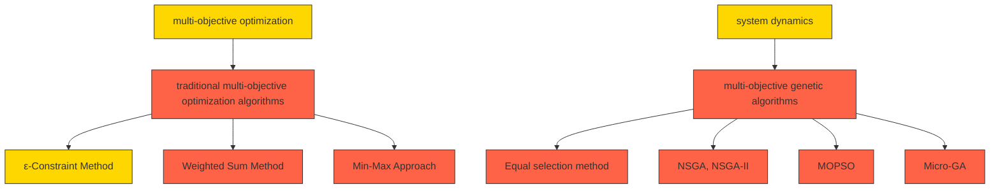
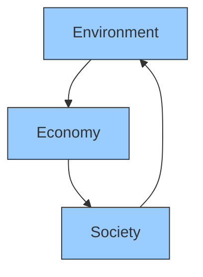

## From TBMP to TSMP: Juneau's Tourism Never Ends

With the development of tourism in Juneau, tourists are pouring into the city in an endless stream. While creating huge wealth, the living space of local residents has been squeezed. At the same time, the Mendenhall Glacier is gradually retreating. To resolve these contradictions, we develop a sustainable tourism measure plan (TSMP), aiming to balance tourism development with the well-being of local residents and environmental protection.

Several models are established: Model I: Multi-Objective Optimization Model for Sustainable Tourism; Model II: Expenditure-Feedback Model for Additional Revenue; Model III: Expansion Model for the Maldives.

For Model I: We built a multi-objective optimization model, aiming to maximize fiscal revenue, minimize environmental damage, and maximize residents' satisfaction. Regression analysis, the analytic hierarchy process (AHP) were used to construct the objective functions. The NSGA-II Algorithm was applied to search for the Pareto-optimal solution set. Taking the data of 2023 as an example, the optimal measures for the next year was obtained: limit the tourist flow to around 1.43 million, increase the tourist fee by 72.4 USB per person, and increase the hotel tax rate by 0.08.

For Model II: This model refines Model I by expending the extra revenue from its optimal measures for circular benefits. By examining the decision variables in the optimal solution of Model I, we found that the variables related to road area and infrastructure carrying capacity are always near initial upper-bounds, highlighting their significance for overall efficiency. Therefore, we constructed an expenditure allocation model for these two indicators and a feedback model regarding residents' satisfaction was constructed.

Before promoting the model, we conducted a sensitivity analysis using the local perturbation method and presented the results in a heatmap. We measured the importance of decision variables by comparing correlation coefficients. The results show that limiting the number of tourists is the most important indicator. Increasing tourist fees is more important than hotel taxes. Additionally, tourist diversion also needs to be taken into account.

For Model III: To verify the generalizability of the model, we applied it to the Maldives, which also faces tourism sustainability issues. The model was adjusted to get the optimal solution, and a sensitivity analysis was conducted. The results showed both consistency with Juneau and reasonable differences, like a higher correlation between residents' satisfaction and tourist numbers. This fully shows the model's universality.

In addition, we also discussed the applicability of the model in low-tourist-volume areas and offered feasible plans for sustainable tourism development, based on previous findings.

Keywords: Sustainable Tourism; Multi-Objective Optimization; NSGA-II Algorithm; Sensitivity Analysis

## Contents

## 1 Introduction....3

1.1 Problem Background ....3  
1.2 Restatement of the Problem....3  
1.3 Literature Review....4  
1.4 Our Work....4

## 2 Assumptions and Justifications....5

## 3 Notations ......6

## 4 Model Preparation ......7

4.1 Data Overview 7  
4.2 Data Collection 7  
4.3 Description of Tourism in Juneau 7

## 5 Sustainable Tourism Optimization Model....8

5.1 Multi-Objective Optimization Model ....8  
5.1.1 Objective Function 8  
5.1.2 Constraint 13  
5.2 NGSA-II for Multi-objective Optimization....16  
5.3 Expenditure Model for Additional Revenue 17  
5.3.1 Expenditure plan....17  
5.3.2 Feedback effect....18

## 6 Sensitivity Analysis....18

## 7 Expansion of the Model....20

7.1 Expansion Model for the Maldives....20  
7.2 Expansion Model in low-tourist-volume areas 22

## 8 Model Evaluation 23

8.1 Strengths ......23  
8.2 Weaknesses ....23

## Memo 24

## References 25

## 1 Introduction

## 1.1 Problem Background

Located in one of the largest wilderness areas in the U.S., Juneau, Alaska, is home to vast national parks, glaciers, and a coastline stretching 6,640 miles [1]. Cruise tourism is the city's pillar industry, annually generating over \$100 million in wealth for Juneau. However, with crowds sailing in in record numbers, a series of problems gradually emerge. Socially, pressures resulting from overcrowding continue to plague the locals. Environmentally, the melting of glaciers is exacerbated by rising temperatures, which is caused by overtourism in part. The situation of glacier ablation is shown in the following figure 1.


<details>
<summary>text_image</summary>

USGS
NASS
Mendenhall Lake
Mendeshall Glacier
Mendenhall Lake
Landsat 5
August 17,1984
Juneau International Airport
Mendenhall Glacier
Mendenhall Lake
Landsat 8
May 16,2014
Juneau International Airport
</details>

Figure 1: Comparison Chart of the Ablation of Mendenhall Glacier

The data above comes from the website of USGS [2]. It clearly shows that Mendenhall Lake expanded significantly from 1984 to 2014 due to glacier ablation.

Since 1997, Juneau has implemented the Tourism Best Management Practices (TBMP) to better manage the tourism industry[3]. In recent years, faced with more severe tourism problems, Juneau has taken measures including controlling the number of tourists, increasing tourism fees, and so on... However, Due to their short-sightedness and one-sidedness, the measures have not won the trust of the residents. Designing a Tourism Sustainable Management Plan (TSMP) is what locals eagerly anticipate.

## 1.2 Restatement of the Problem

We are tasked with building an optimization model for sustainable tourism in Juneau, Alaska. Our objective is to balance economic, social, and environmental concerns.

Consequently, the problem can be analyzed as follows:

## ● Model Building for Juneau's Sustainable Tourism

Construct an optimization model for the sustainable tourism industry in Juneau, Alaska. The model should balance multiple factors.  
✿ Develop a plan for the utilization of additional revenue and elaborate on how it promotes sustainable tourism within the model.  
✿ Conduct a sensitivity analysis for the model based on the discussion of key factors.

## ● Applicability to Other Destinations

Adopt the model to another crowded tourist destination and explore the impact of geographical location on measures.  
✧ promote the model to less-visited attractions for the sake of a more balanced tourism distribution.

## One-Page Memo

Considering the results obtained above, prepare a one-page memo to Juneau's tourist council.

## 1.3 Literature Review

This task is an optimization problem. Firstly, we need to determine the model-building method and the solution algorithm.

Regarding the modeling methods, system dynamics[4], and multi-objective optimization methods[5] can be adopted. Considering the accuracy and universality of the model, we use the multi-objective optimization method.

Ma Xiaoshu et al.[5] compared to the traditional multi-objective optimization algorithms and multi-objective genetic algorithms. Based on this, we finally choose the NSGA-II algorithm.


<details>
<summary>flowchart</summary>


</details>

Figure 2: Literature Review Framework

## 1.4 Our Work

This task requires us to construct an optimized model for sustainable tourism with universal applicability, which mainly includes:

1. Construct a multi-objective optimization model with the goals of maximizing fiscal revenue, minimizing environmental damage, and maximizing resident satisfaction.  
2. Solve the model using the NSGA-II algorithm and select the optimal combination of sustainable tourism measures.  
3. Based on the benefit magnitudes of decision variables, construct an expenditure-feedback model for additional revenue.

4. Conduct a sensitivity test using the local perturbation method and analyze the importance of variables.  
5. To test the universality of the model, we extended the model to the Maldives. In addition, suggestions for sustainable tourism development in low - tourist areas are provided.


<details>
<summary>flowchart</summary>

```mermaid
graph TD
  A["problem Analysis"] --> B["Model Preparation (4)"]
  B --> C["Model I (5.1)"]
  C --> D["Model II (5.3)"]
  D --> E["Sensitivity Analysis (6)"]
  E --> F["Model Expansion (7)"]
    
    subgraph Multi_Objective_Optimization_Model_5_1["Multi-Objective Optimization Model(5.1)"]
  G["Environment & Society"] --> H["Indicators"]
  H --> I["Number of visitors xᵢ Caps on the number of visitors x₀ Increase in Visitor Fees Δtᵢ Increase in Hotel Tax Rate Δr The pavementare S capacity of garbage disposalG"]
    end
    
    subgraph Expenditure_feedback_Model_5_3["Expenditure-feedback Model(5.3)"]
  I --> J["Expenditure plan Road surface and infrastructure construction"]
  J --> K["Close to the upper bounds"]
  K --> L["Financial Revenue Max FR Environmental Damage Min ED Resident Satisfaction Max RS regression analysis AHP"]
  L --> M["Find the optimal solution"]
  M --> N["x₀ Δtᵢ Δr"]
  N --> O["NGSA-II(5.2)"]
    
    subgraph Sustainable Tourism Optimization Model(5)
  O --> P["Sensitivity Analysis (6)"]
  P --> Q["local perturbation method"]
  Q --> R["Model Expansion (7)"]
    end
```
</details>

Figure 3: Flow Chart of Our Work

## 2 Assumptions and Justifications

\- Assumption 1: The structure of the tourism market and the spending preferences of tourists remain relatively stable.

Justification: Based on the empirical dimension, we assume that the consumer market and preferences are stable. Avoiding the instability of the model due to frequent changes in market structure and consumption preferences facilitates the construction and analysis of the model.

\- Assumption 2: The tourist attractions in Juneau are somewhat independent, i.e., tourists' choices to visit a specific attraction aren't strongly influenced by others.

Justification: This paper examines three major attractions in Juneau - Mendenhall Glacier, whale watching, and rain forests - that are independent of each other. We only need to consider the separate impacts of each on sustainable tourism, omitting the complex interrelationships between them to simplify the model.

\- Assumption 3: No extreme natural disasters or sudden major global events will occur in the short term.

Justification: Such events are highly unlikely but can severely and unpredictably disrupt the tourism industry if they do. Excluding these factors allows the model to concentrate on regular tourism development trends.

● Assumption 4: The actual number of tourists per day always meets the limit.

Justification: Currently, Juneau has a visitor limit policy in place, so it is reasonable to assume that the policy is efficiently enforced to accurately control the number of tourists; at the same time, a stable tourist count provides reliable inputs to the regression analysis model, enhancing its reliability and predictive power.

Note: Additional assumptions are made to simplify analysis for individual sections. These assumptions will be addressed in the relevant locations.

## 3 Notations

The key mathematical notations used in this paper are listed in Table 1.

Table 1: Major notations

<table><tr><td>Notation</td><td>Description</td><td>Unit</td></tr><tr><td> $x_{i}$ </td><td>Number of daily visitors to the attraction  $i$ </td><td>k/day</td></tr><tr><td> $t_{i}$ </td><td>attraction  $i$  Visitor Fees</td><td>USD/person</td></tr><tr><td> $\Delta t_{i}$ </td><td>Increase in attraction  $i$  Visitor Fees</td><td>USD/person</td></tr><tr><td>r</td><td>Hotel Tax</td><td>%</td></tr><tr><td> $\Delta r$ </td><td>Increase in Hotel Tax Rate</td><td>%</td></tr><tr><td>k</td><td>Hotel Spending</td><td>USD/person</td></tr><tr><td> $x_{0}$ </td><td>Caps on the number of daily visitors</td><td>k/day</td></tr><tr><td>S</td><td>The pavement area in Juneau</td><td>km2</td></tr><tr><td>G</td><td>The maximum carrying capacity of garbage disposal in Juneau</td><td>t</td></tr><tr><td>AT</td><td>Average Daily Temperature in Juneau</td><td>°C</td></tr><tr><td>RS</td><td>Resident Satisfaction</td><td>\</td></tr><tr><td>FR</td><td>Financial Revenue</td><td>USD / million</td></tr><tr><td>ED</td><td>Degree of Environmental Damage</td><td>\</td></tr></table>

Note: There are some variables that are not listed here and will be discussed in detail in each section.

## 4 Model Preparation

## 4.1 Data Overview

Since the material doesn't directly offer data, we must determine which data to collect during the model-building process. After analyzing the problem, we find that we need to gather relevant information about Juneau, Alaska, including data like the number of tourists, sightseeing spending, carbon footprint, and mean temperature, among others. Given the large volume of data, instead of listing everything, we opt to visualize the data for presentation.

## 4.2 Data Collection

Table 2 Data and Database Websites

<table><tr><td>Database Names</td><td>Description</td></tr><tr><td>Number of visitors per year</td><td>https://www.traveljuneau.com/</td></tr><tr><td>Attractions expenses</td><td>https://www.budgetyourtrip.com/</td></tr><tr><td>Carbon footprint per year</td><td>https://www.noaa.gov/</td></tr><tr><td>mean temperature per year</td><td>https://www.noaa.gov/</td></tr></table>

## 4.3 Description of Tourism in Juneau

To build a more reasonable model, based on the collected data, we first analyzed the distribution of tourist attractions and the traffic conditions in Juneau.


<details>
<summary>text_image</summary>

Juneau
Mendenhall Glacier
airport
Mendenhall Valley
Auke Bay
downtown
docks
Tongass National
Forest
</details>

Figure 4: General Situation Map of Juneau

## glacier landscape

The main one is the Mendenhall Glacier, which is located about 20 kilometers north of downtown Juneau.

## Whale watching

1. Take a boat from the docks to watch whales out at sea.  
2. Along the coastline, such as at Auke Bay.

## Rain forest

Juneau is located within the Tongass National Forest. Access the Tongass National Forest via the forest trails around downtown Juneau.

## Transportation

The majority of tourists opt to travel by ferry. A minority choose to arrive by plane.

## 5 Sustainable Tourism Optimization Model

## 5.1 Multi-Objective Optimization Model

Multi-objective optimization model is a model that simultaneously optimizes multiple conflicting objective functions to achieve an optimal balance. In this question, the aim is to explore the optimal implementation plan for tourism stability measures under the goals of optimization (maximizing financial revenue, minimizing environmental damage, and maximizing residents' satisfaction) and constraints (limits on the number of tourists, increases in tourist fees and hotel taxes, and restrictions on alcohol consumption) so as to achieve sustainable development.

## 5.1.1 Objective Function

Based on the given glossary, sustainable tourism focuses on economic, environmental and social indicators. Accordingly, we establish three quantifiable conflicting objectives—Maximum Revenue, Minimum Environmental Damage, and Maximum Resident Satisfaction—along with relevant decision variables for quantitative analysis. The function construction process is as follows:

```mermaid
graph TD
  A["Sustainable Tourism"] --> B["Residents' income 0.50"]
  A --> C["Urban congestion 0.34"]
  A --> D["Infrastructure pressure 0.16"]
  A --> E["rising temperatures 0.7"]
  A --> F["carbon footprint 0.3"]
  A --> G["financial revenue"]
  A --> H["attractions revenue"]
  A --> I["resident satisfaction"]
  A --> J["environmental damage"]
  A --> K["Increase in attraction Visitor Fees"]
  A --> L["hotel taxes"]
  A --> M["Resident Satisfaction Evaluation System"]
  M --> N["1.Analytic Hierarchy Process"]
  M --> O["2.the study by Dong-Wan Ko and William P. Stewart on South Korea"]
  A --> P["Fiscal revenue model"]
  P --> Q["1.Separate revenue calculation for three attractions"]
  P --> R["2.Expense data of three attractions and hotels"]
  A --> S["Environmental Damage Assessment Model"]
  S --> T["1.Logarithmic and exponential regression analysis by python"]
  S --> U["2.Meteorological data of Juneau"]
```


<details>
<summary>flowchart</summary>


</details>

Figure5: Flowchart of multi - objective programming

## ● Maximum Financial Revenue

## 1) Modelling ideas

Taking financial income as the optimization goal provides a material foundation for the sustainable development of Juneau. While promoting economic development, it offers financial support for environmental protection, infrastructure construction, and the development of community projects in Juneau.

## 2) Supplementary assumptions and justifications

There are differences in consumption revenue among the three scenic spots, and the increases in tourist fees also vary.

The attractions and features of different scenic spots vary, and their operation strategies such as ticket pricing and project fees also differ, resulting in different consumption revenues. To maximize benefits, there are also differences in the tourist fees increased when formulating stability policies for different scenic spots.

Hotels are concentrated in the urban area of Juneau.

The urban area of Juneau has convenient transportation and complete infrastructure. However, the three major natural scenic spots have harsh environments, which are not conducive to living. Then, it is reasonable to assume that hotels are concentrated in the urban area, tourists' accommodation expenses are basically the same across different scenic areas, and hotel taxes are managed uniformly.

## 3) Model construction

As a tourist destination, Juneau's primary fiscal revenues stem from direct tourism earnings and taxes. Consequently, we've chosen these two revenue streams as metrics for gauging the total fiscal revenue. When it comes to taxes, we primarily focus on the hotel tax.

## I. attractions revenues

Based on the previous assumptions, we calculate the revenues of the three scenic spots separately and then sum them up. The equation is given as (1):

$$
i n c o m e = \sum x _ {i} \cdot t _ {i} + x _ {0} \cdot \Delta t _ {i} \quad i = 1, 2, 3 \tag {1}
$$

\- $i$ represents the three scenic spots respectively, which $i = 1$ refers to the glacier scenic spot, $i = 2$ refers to the whale watching area, and $i = 3$ refers to the tropical rainforest.

\- $t_{i}$ and $\Delta t_{i}$ are attraction revenue and Increase in attraction Visitor Fees, respectively. Based on the data retrieved:

$$
t _ {1} = 2 3 9, t _ {2} = 1 8 9, t _ {3} = 1 6 0
$$

■ $x_{i}$ represents the number of daily visitors to the attraction.

## II. hotel taxes

Given reasonable assumptions, we calculate the government revenue from hotel taxes using the total number of tourists, the average accommodation expenditure per capita, and the hotel tax rates before and after the implementation of the stability policy. The equation is given as (2):

$$
\text { hotel   revenue } = x _ {0} \cdot k \cdot (r + \Delta r) \tag {2}
$$

- $x_0$ represents caps on the number of daily visitors, which is equivalent to the total number of tourists given the assumptions.  
■ k refers to the average accommodation expenditure per capita, valued at \$179.

■ $r, \Delta r$ are Hotel Tax and Increase in Hotel Tax Rate, respectively, r has a value of 0.09.

Sum up the consumption revenue and hotel revenue to obtain the revenue function. Therefore, from (1), (2), we have Eq.(3):

$$
\max F R = \sum_ {i = 1} ^ {3} x _ {i} \cdot t _ {i} + x _ {0} \cdot \Delta t + x _ {0} \cdot k \cdot (r + \Delta r) \tag {3}
$$

## ● Minimum Environmental Damage

## 1) Modelling ideas

Juneau is renowned for its natural scenery. Reducing environmental damage is, on the one hand, aimed at protecting its core tourism resources. On the other hand, it also prevents short-term benefits gained from stability measures at the cost of environmental damage.

## 2) Nonlinear regression analysis of average temperature and carbon footprint

We retrieved the average temperature, abiotic carbon dioxide emissions, and the corresponding number of tourists in Juneau for some years. By conducting logarithmic and exponential regression analyses on these data points respectively. We carried out the fitting process with Python, and the results are presented in the following figure.


<details>
<summary>scatterplot</summary>

| Visitors (million) | Average Temperature (Celsius) |
| ------------------ | ----------------------------- |
| 0.4                | 5.25                          |
| 0.6                | 5.75                          |
| 0.8                | 5.75                          |
| 1.0                | 6.35                          |
| 1.2                | 6.15                          |
| 1.4                | 6.75                          |
| 1.6                | 6.65                          |
</details>

(a) Fitted function of average temperature


<details>
<summary>line chart</summary>

| Visitors (million) | CO2 (tCO2e / thousand) |
| ------------------ | ---------------------- |
| 0.95               | 40                     |
| 1.00               | 38                     |
| 1.05               | 36                     |
| 1.10               | 38                     |
| 1.15               | 42                     |
| 1.20               | 50                     |
| 1.25               | 60                     |
| 1.30               | 70                     |
</details>

(b) Fitted function of carbon footprint  
Figure 6 : Function fitting results

To ensure the stability of the fitting model, we excluded data from the pandemic years (2020 and 2021) and some other outliers. Results show that the average temperature and the number of tourists follow a logarithmic distribution (a). After the number of tourists reaches a certain level, influenced by weather conditions and environmental regulation capabilities, the increase in average temperature tends to level off. However, based on the current number of tourists, the average temperature is rapidly rising. The relationship is shown in (4):

$$
T = 0. 9 2 8 6 \ln \left(0. 0 0 1 9 6 4 1 x _ {0}\right) + 5. 5 0 4 3 \tag {4}
$$

The carbon footprint and the number of tourists exhibit an exponential distribution (b). The growth in the number of tourists directly impacts the transportation and accommodation industries. Meanwhile, it triggers a chain reaction and aggregation effect in the catering and manufacturing industries, leading to a rapid increase in the carbon footprint. The relationship is (5):

$$
C = 7 8 1. 0 1 0 7 x _ {0} ^ {2} - 1 6 1 9. 7 9 9 8 x _ {0} + 8 7 5. 3 0 2 2 \tag {5}
$$

## 3) Environmental Damage Function

Based on the above functional relationships, we establish a model for the degree of environmental damage. We normalize the temperature and carbon dioxide emissions by dividing them by their respective historical minimum values and then perform a weighted sum.

Since temperature is a direct factor in glacier melting and the greenhouse effect caused by carbon dioxide emissions is an indirect factor, we assign weights of 0.7 and 0.3 to the average temperature and carbon footprint respectively. The expression is as follows:

$$
\min E D = \min \left[ w _ {1} \frac {T (x _ {0})}{T _ {\min}} + w _ {2} \frac {C (x _ {0})}{C _ {\min}} \right] \tag {6}
$$

- $T_{\text{min}}$ represents the minimum average annual temperature for Juneau, 2014-2023, which is 5.21°C.  
- $C_{\text{min}}$ represents the minimum annual carbon footprint of Juneau, 2014-2023, with a value of 3.64131.  
- $w_{1}, w_{2}$ refer to the corresponding weights of temperature and carbon, which are 0.7, 0.3, respectively.

## ● Maximum Resident Satisfaction

## 1) Modelling ideas

To quantify the satisfaction of Juneau residents, we need to consider both the positive and negative impacts of tourism on their life experiences. The positive impacts mainly stem from the economic income generated in related industries driven by tourists. The negative impacts, however, primarily result from the overcrowding in the city due to the influx of tourists, as well as the pressure exerted on urban infrastructure such as clean water supply and waste disposal.

Therefore, we need to comprehensively consider the weighted factors of job creation, urban congestion, and infrastructure pressure to establish a quantifiable evaluation system for residents' satisfaction.

## 2) Calculating Weights Based on the Analytic Hierarchy Process (AHP)

When we determine the weight of the three elements to construct the final objective, we apply the Analytical Hierarchy Process to avoid being overly subjective on weight selection.

When using AHP, we need to compare the relative importance of three elements: residents' income, urban congestion, and infrastructure pressure, and establish a Pairwise Comparison Matrix.

When developing a structural equation model of residents' attitudes towards tourism development in Jeju Island, South Korea (a popular tourist destination) [6], Dong-Wan Ko and William P. Stewart used a 5-point Likert-type scale in a questionnaire survey, asking residents to rate urban indicators and obtained items-total correlation data. The statistics for residents' income, urban congestion, and infrastructure were 0.64, 0.44, and 0.20 respectively.

Since both Juneau and Jeju Island in South Korea are popular tourist destinations, we'll use this as a reference to determine the relative importance of the three elements and establish the pairwise comparison matrix for the criterion layer. The results are as follows:

Table 3 Comparison matrix of the standard level

<table><tr><td></td><td>1</td><td>1.45</td><td>3.2</td></tr><tr><td></td><td>0.69</td><td>1</td><td>2.2</td></tr><tr><td></td><td>0.31</td><td>0.45</td><td>1</td></tr></table>

Normalize the matrix and calculate the weights of the three elements, which are 0.50, 0.34, and 0.16 respectively.

## 3) Environmental Damage Function

Based on the above weights, we need to establish relationships between the original decision variables and the three factors of residents' economic income, urban congestion, and infrastructure pressure, set up a scoring mechanism, and ultimately form a quantifiable evaluation system for residents' satisfaction.

According to data from the Juneau Tourism Bureau, in 2023, 38% of residents had a positive attitude towards tourism, 30% were neutral, and 25% were negative. Therefore, we can regard the residents' satisfaction in 2023 as the passing line. Thus, we normalize the indicators of job creation, urban congestion, and infrastructure pressure in 2023, and quantify the satisfaction in 2023 as 68 points (38 + 30).


<details>
<summary>stacked bar chart</summary>

| Attitude to tourism (2023) | positive (%) | neutral (%) | negative (%) | other (%) |
|---|---|---|---|---|
| Satisfaction (68%) | | | | |
</details>

Figure 7: Residents' Attitudes towards Tourism in 2023

Residents' income: Since the contribution of tourism can be attributed to the product of per-capita consumption and the number of tourists, we divide this value by the corresponding data in 2023.  
Urban congestion: We measure urban congestion using the road area per tourist. The level of congestion in the city is associated with both the volume of tourists and the total road area.  
Infrastructure pressure: It's mainly about waste disposal. EPA data shows Americans generate 2.2 kg of waste per person daily. Some studies suggest tourists produce 20% - 40% more waste than locals. So, we'll assume tourists generate 2.8 kg per day. We'll measure it by the ratio of total waste (locals and tourists) to the city's max waste-handling capacity.

Therefore, we present the following expression (4) for residents' satisfaction:

$$
R S = w _ {3} \cdot \frac {\left(t _ {0} + \Delta t\right) \cdot x _ {0}}{t _ {0} \cdot x _ {2 0 2 3}} + w _ {4} \cdot \frac {S \cdot x _ {2 0 2 3}}{S _ {2 0 2 3} \cdot x _ {0}} + w _ {5} \cdot \frac {G _ {0} (2 8 0 0 0 0 0 \cdot x _ {2 0 2 3} + 2 . 2 \cdot P _ {j})}{G _ {2 0 2 3} (2 8 0 0 0 0 0 \cdot x _ {0} + 2 . 2 \cdot P _ {j})} \tag {7}
$$

- $S_{2023}$ represents the road surface area of Juneau in 2023, which can be estimated at 300 square kilometers.  
■ S represents the upcoming planned road surface area of Juneau.  
- $G_{2023}$ represents the waste carrying capacity of Juneau in 2023, can be estimated at 10170  
■ G represents the upcoming planned waste-carrying capacity of Juneau.  
- $P_{i}$ represents the number of original residents in Juneau, which is approximately 31,700.

After simplification, the above formula is:

$$
R S = \frac {(2 4 3 + \Delta t) \cdot x _ {0}}{8 1 1 . 6 2} + \frac {S}{5 2 8 . 3 5 x _ {0}} + \frac {G}{2 6 2 5 0 0 0 0 x _ {0} + 6 5 3 8 1 2 5} \tag {8}
$$

## 5.1.2 Constraint

The constraint conditions of this model mainly consider the impact of Juneau's stable tourism measures on the independent variable, the number of tourists, and restrictions of environmental factors. The specific analysis is as follows:

## - Restrictions on the number of visitors

The regulation on the limit of the number of tourists stipulates the daily upper limit of the number of tourists received in Juneau. Subject to the constraint by (4):

$$
x _ {1} + x _ {2} + x _ {3} \leq x _ {0} \tag {9}
$$

However, considering the effectiveness of policy implementation and the complexity of the model, we made a reasonable assumption earlier: the daily number of tourists can always reach the upper limit. Thus, this constraint is transformed into an equality relationship and used as a known condition. The equation is given as (5):

$$
x _ {1} + x _ {2} + x _ {3} = x _ {0} \tag {10}
$$

## - Increase in visitor fees and hotel taxes

## 1) Modelling ideas

An increase in tourist fees leads to a decrease in the number of tourists in Juneau to some extent. To predict the impact, we construct a tourist volume prediction model based on the changes in the number of tourists over the past decade and Nguyen's research on tourism demand elasticity.

## 2) Supplementary assumptions and justifications

## \$196 represents a relatively rational market level in Juneau. i.e., the number of tourists has reached an equilibrium state at the current price level.

Based on the number of tourists in Juneau from 2014 to 2023 (from the Alaska Tourism Bureau) and the consumption data (from BudgetYourTrip.com), we've calculated that the average daily consumption per person is \$243. From an economic perspective, this price is the result of long-term interaction and adjustment among market participants.

## 3) Model construction

Based on Nguyen's research on the tourism demand elasticity in ASEAN [7], the local tourism demand (which can be regarded as the number of tourists here) is jointly determined by multiple factors including consumers' income, the consumption price in the tourist area itself, and the consumption price in alternative tourist areas. We applied the model proposed by Nguyen to the tourism industry in Juneau and obtained the following formula (6):

$$
\ln x = \beta_ {0} + \beta_ {1} \ln Y + \beta_ {2} \ln t + \beta_ {3} \ln S + \varepsilon \tag {11}
$$

- $x$ and $Y$ represents the demand of domestic tourists and the income of tourists, respectively.  
■ t is Tourism service prices, while S is the price of substitute tourism destinations  
■ $\beta_{0}, \beta_{1}, \beta_{2}$ and $\beta_{3}$ are parameters to be estimated.  
■ $\varepsilon$ represents the error term.

## 4) Calculate parameters

For this model, due to the lack of per capita income data of Juneau tourists, we will not consider the impact of tourists' income on Juneau's tourism industry for the time being.

Cruise ships are a major means of transport for travelers going to Juneau. They have stable passenger sources and offer unique services. Also, considering the weak correlation between Alaska's tourist numbers and per-capita consumption in the past four years, Juneau's tourism demand elasticity is less influenced by its consumption price. Since there is a negative correlation between the number of tourists and local consumption, $\beta_{2}$ should be negative.

In addition, we need to consider the self-paid prices in alternative tourist cities to Juneau. Common alternatives are Ketchikan and Anchorage in Alaska, with average daily per-person consumption prices of \$259 and \$266, respectively. Juneau accounts for about 13%- 15% of Alaska's tourism.

So, we tentatively assume that the absolute values of $\beta_{2}$ and $\beta_{3}$ are the same. Let $S$ be the average of the self-consumption prices of the other two alternative cities, which is \$262.5.

$$
S = 2 6 2. 5 \tag {12}
$$

Based on the research by Nguyen[7], the absolute value ratio between $\beta_{1}$ and $\beta_{2}$ is approximately 2.3, and the absolute value ratio between $\beta_{2}$ and $\beta_{3}$ is approximately 100.

$$
\beta 2 = \beta 3 = 1 0 0 \tag {13}
$$

Then, by substituting the number of tourists in Juneau in 2023 (1.67 million) and the average daily per-person consumption price of \$243, we can establish the relationship between Juneau's tourism demand and the planned self-consumption in Juneau:

$$
\ln x = - 0. 7 2 \ln t + 4. 4 3 \tag {14}
$$

Further, associate it with the decision variables of this model, that is (15):

$$
\ln x = - 0. 7 2 \ln (2 4 3 + \Delta t + 1 7 3 \Delta r) + 4. 4 3 \tag {15}
$$

## ● Environmental constraints

Environmental constraints are considered from three aspects: temperature, carbon footprint, and urban carrying capacity.

➢ Temperature constraints: The temperature in the scenic area should not be too high. Its value should be less than the average of historical extreme values, which is $6.03^{\circ}$ C.

$$
T \left(x _ {0}\right) <   \frac {T _ {\max} + T _ {\min}}{2} \tag {16}
$$

Carbon footprint constraints: The carbon footprint should not be too high. Its value should be less than the average of historical extreme values, which is $6.44 tCO_{2}e / k$ .

$$
C \left(x _ {0}\right) <   \frac {C _ {\max} + C _ {\min}}{2} \tag {17}
$$

➢ urban carrying capacity: The amount of garbage processed should not exceed the urban carrying capacity.

$$
\frac {(2 8 0 0 0 0 0 x _ {0} + 2 . 2 P _ {j})}{G} <   1 \tag {18}
$$

## 5.2 NGSA-II for Multi-objective Optimization

The model employs Non-dominated Sorting Genetic Algorithms (NGSA II) for multi-objective optimization, seeking the optimal balance among financial revenue, environmental damage, and residents' satisfaction. NSGA-II is an improved multi-objective genetic algorithm. It deals with multi-objective optimization problems by stratifying population individuals through a non-dominated sorting mechanism. The algorithm flow chart can be viewed in Figure 8.


<details>
<summary>flowchart</summary>

```mermaid
graph TD
  A["begin"] --> B["Initialize the population"]
  B --> C{Generate the first generation?}
  C -->|Y| D["2nd generation"]
  C -->|N| E["select, cross, mutate"]
  D --> F["Parent and child generations are merged"]
  F --> G{Generate a new parent?}
  G -->|Y| H["select, cross, mutate"]
  G -->|N| I["Gen=Gen 1"]
  H --> J{Gen reach maximum algebra?}
  J -->|Y| K "%output optimal ratio"]
  J -->|N| L["end"]
  E --> M["Fast non-dominant sorting"]
  M --> N["select, cross, mutate"]
  N --> C
  M --> O["Elite strategy picks"]
  O --> P["Congestion calculations"]
  P --> Q["Fast non-dominant sorting"]
```
</details>

Figure 8: NGSA II Algorithm Flowchart

After solving with Python, a Pareto front containing 255 solutions was obtained.


<details>
<summary>scatterplot</summary>

| FR    | ED    | RS    |
|-------|-------|-------|
| -450  | -300  | -1.0  |
| -400  | -250  | -1.2  |
| -350  | -200  | -1.4  |
| -300  | -150  | -1.6  |
| -250  | -100  | -1.8  |
</details>

Figure 9: Pareto Front

We selected three solutions with distinct characteristics, and the values of their corresponding objective functions are shown in the following table.

Tabel 4 Solutions with distinct eigenvalues

<table><tr><td></td><td>-584.7340389</td><td>6.535613545</td><td>-2.11708582</td></tr><tr><td></td><td>-376.3766352</td><td>1.828567732</td><td>-1.238253427</td></tr><tr><td></td><td>-464.2609648</td><td>2.819160665</td><td>-1.526391146</td></tr></table>

Analysis based on the above results:

The first group despite offering relatively high economic income and resident satisfaction, cause significant environmental damage, which is inconsistent with the goal of sustainable tourism development. Therefore, it is excluded.  
The second group results in minimal environmental damage. However, the limited number of tourists leads to low economic returns from tourism and subsequently reduced resident satisfaction. Hence, it is also discarded.  
➢ Conversely, the third group not only causes less environmental damage but also achieves relatively high economic returns and resident satisfaction. It is worthy of consideration for the final plan. To better illustrate the role of the decision variables, we identified four solutions with characteristics similar to those of the third group. The corresponding data for these solutions are shown in the table below.

Tabel 5 optimal solution

<table><tr><td></td><td>1.2481</td><td>0.1063</td><td>0.1291</td><td>1.4836</td><td>72.4388</td><td>0.0962</td><td>491.45</td><td>2760835</td></tr><tr><td></td><td>1.0386</td><td>0.1821</td><td>0.2311</td><td>1.4520</td><td>72.9</td><td>0.0773</td><td>498.75</td><td>2959685</td></tr><tr><td></td><td>1.0984</td><td>0.1149</td><td>0.1787</td><td>1.3920</td><td>72.2892</td><td>0.0715</td><td>500</td><td>2871410</td></tr><tr><td></td><td>1.1231</td><td>0.1009</td><td>0.1623</td><td>1.3864</td><td>72.5652</td><td>0.0757</td><td>498.38</td><td>2881902</td></tr></table>

## 5.3 Expenditure-Feedback Model for Additional Revenue

## 5.3.1 Expenditure plan

According to the decision variables of the optimal solution we chose, the road area S and infrastructure capacity G are close to the upper bounds of the initial variables set in NSGA-II. This shows that increasing S and G is crucial for overall benefits. Since enhancing S and G needs government spending, it's closely linked to the extra revenue the government gains via regulatory measures in this model.

In this model, the additional revenue obtained by the government mainly depends on the increases in fees and taxes. The specific relationship is as follows:

$$
\Delta F R = x _ {0} \left(\Delta t + k \Delta r\right) \tag {19}
$$

The benefits of S and G are mainly reflected in the resident satisfaction (RS). Let the cost of building one square kilometer of road surface be and the cost of increasing the infrastructure capacity by one unit be. We use the ratio of their correlation coefficients with the resident satisfaction (RS) to determine the expenditure weights for them. After calculation, the expenditure ratio w of S to G is 6.5.

Therefore, the total expenditure on S and G in that year can be expressed as:

$$
\mathrm{Cos} t _ {t} = a _ {1} \left(S _ {t} - S _ {t - 1}\right) + a _ {2} \left(G _ {t} - G _ {t - 1}\right) \tag {20}
$$

Undoubtedly, this expenditure plan is formulated from the perspective of resident satisfaction. If there is still a surplus in the additional revenue, the government should invest it in environmental protection projects to mitigate a series of issues such as glacier melting. This way, the parameters related to environmental damage can be reduced, and the impact of the number of tourists on environmental damage can be lessened

## 5.3.2 Feedback effect

Since the specific expenditure on S and G directly affects the resident satisfaction in that year, we need to weigh the previous year's revenue against the current year's expenditure.

When $\Delta FR_{t-1} > \text{Cos } t_t$ , that is, when the additional revenue from the previous year can cover the expenditure of the following year to meet the requirements of resident satisfaction, the model can achieve the expected results in terms of resident satisfaction, i.e.:

$$
R S = w _ {3} \frac {\left(t _ {0} + \Delta t\right) x _ {0}}{t _ {0} \cdot x _ {2 0 2 3}} + w _ {4} \frac {S _ {t} \cdot x _ {2 0 2 3}}{S _ {2 0 2 3} \cdot x _ {0}} + w _ {5} \frac {G _ {t} \left(2 8 0 0 0 0 0 x _ {2 0 2 3} + 2 . 2 P _ {j}\right)}{G _ {2 0 2 3} \left(2 8 0 0 0 0 0 x _ {0} + 2 . 2 P _ {j}\right)} \tag {21}
$$

When $\Delta FR_{t-1} < \cos t_t$ , due to the insufficient revenue in the previous year, the values of G and S can only be allocated in a weighted manner based on the maximum value of the additional revenue, i.e.:

$$
R S = w _ {3} \frac {\left(t _ {0} + \Delta t\right) x _ {0}}{t _ {0} \cdot x _ {2 0 2 3}} + w _ {4} \frac {x _ {2 0 2 3}}{S _ {2 0 2 3} \cdot x _ {0}} \cdot \left[ \frac {w \cdot \Delta F R _ {t - 1}}{(1 + w) a _ {1}} + S _ {t - 1} \right] + w _ {5} \frac {(2 8 0 0 0 0 0 x _ {2 0 2 3} + 2 . 2 P _ {j})}{G _ {2 0 2 3} (2 8 0 0 0 0 0 x _ {0} + 2 . 2 P _ {j})} \cdot \left[ \frac {\Delta F R _ {t - 1}}{(1 + w) a _ {2}} + G _ {t - 1} \right] \tag {22}
$$

## 6 Sensitivity Analysis

For each optimal solution, we used the local perturbation method to detect variable sensitivity. We varied one decision variable within the perturbation range of $(-10\%, +10\%)$ while keeping other decision variables constant and observed the impact on the objective function. The final results were presented in a heat map, where the color intensity or temperature variation indicates the magnitude of the correlation coefficient. The closer the absolute value is to 1, the stronger the correlation.


<details>
<summary>heatmap</summary>

Correlation Heatmap: Decision Variables and Objective Functions
| Objective Functions | x1 | x2 | x3 | x0 | dt | dr | S | G | FR | ED | RS |
|---|---|---|---|---|---|---|---|---|---|---|---|
| x1 | 1.00 | -0.48 | -0.89 | 0.61 | -0.06 | 0.80 | -0.22 | -0.65 | -0.80 | 0.62 | -0.42 |
| x2 | -0.48 | 1.00 | 0.69 | 0.35 | 0.12 | -0.09 | 0.05 | 0.49 | -0.11 | 0.33 | -0.38 |
| x3 | -0.89 | 0.69 | 1.00 | -0.22 | 0.08 | -0.77 | 0.22 | 0.70 | 0.50 | -0.23 | 0.06 |
| x4 | 0.61 | 0.35 | -0.22 | 1.00 | 0.03 | 0.59 | -0.15 | -0.19 | -0.94 | 0.99 | -0.85 |
| x5 | -0.06 | 0.12 | 0.08 | 0.03 | 1.00 | -0.01 | 0.00 | 0.06 | -0.14 | 0.03 | -0.09 |
| dr | 0.80 | -0.09 | -0.77 | 0.59 | -0.01 | 1.00 | -0.25 | -0.53 | -0.77 | 0.59 | -0.40 |
| s | -0.22 | 0.05 | 0.22 | -0.15 | 0.00 | -0.25 | 1.00 | 0.15 | 0.20 | -0.15 | -0.39 |
| G | -0.65 | 0.49 | 0.70 | -0.19 | 0.06 | -0.53 | 0.15 | 1.00 | 0.38 | -0.20 | 0.06 |
| FR | -0.80 | -0.11 | 0.50 | -0.94 | -0.14 | -0.77 | 0.20 | 0.38 | 1.00 | -0.94 | 0.77 |
| ED | 0.62 | 0.33 | -0.23 | 0.99 | 0.03 | 0.59 | -0.15 | -0.20 | -0.94 | 1.00 | -0.84 |
| RS | -0.42 | -0.38 | 0.06 | -0.85 | -0.09 | -0.40 | -0.39 | 0.06 | 0.77 | -0.84 | 1.00 |
</details>

Figure 10: Correlation Heatmap: Devision Variables and Objective Functions

From the heat map, we can see that:

The absolute values of the correlation coefficients between $x_{0}$ and FR, ED, RS are 1.00, 0.75, and 0.97 respectively. Its impact on the three objective functions is higher than all other decision-making variables. Therefore, in the Juneau sustainable tourism development model, restricting the total number of daily tourists is the most important factor.  
The absolute values of the correlation coefficients of the increase in fees with fiscal revenue, environmental damage, and resident satisfaction are 0.68, 0.35, and 0.66 respectively, which are much larger than those of hotel tax (0.03, 0.02, 0.25).  
Among $x_{1}$ , $x_{2}$ , and $x_{3}$ , $x_{3}$ has the greatest impact on the three objective functions. This clearly shows that diverting tourists to relatively less - popular attractions like the rainforest plays an important role in the overall sustainable development of tourism. Next is the number of tourists visiting the glacier. This indicates that the long - established popular attractions still have a significant influence on the overall tourism benefits and can bring considerable economic income to the community.  
The construction of urban roads and infrastructure also has different impacts on overall sustainable development. Expanding roads which relieves congestion will yield greater benefits than improving infrastructure such as increasing the maximum daily waste disposal capacity of the city. This provides significant reference for the government's fiscal expenditure decisions.

Based on the above sensitivity analysis, the most influential factor on tourism is the restriction on the total number of daily tourists. When considering measures from the perspective of tourist consumption, adjusting fees brings better benefits than changing hotel tax. When considering measures based on the distribution of tourist numbers, it is necessary to divert tourists from the popular glacier attraction to relatively less - visited but community - beneficial attractions like the rainforest through promotion and welfare policies.

## 7 Expansion of the Model

## 7.1 Expansion Model for the Maldives

To test the generalizability of the model, we applied it to another tourist destination, the Maldives. The Maldives is a country highly dependent on tourism. However, in recent years, with the increase in the number of tourists, high carbon emissions and global warming have led to several environmental problems such as sea - level rise and coral reef degradation, which have seriously affected the sustainable development of the tourism industry in the Maldives.

## 1) Modelling ideas

Similar to Juneau, we mainly divided it into three scenic spots: the most popular North Malé Atoll, and the relatively less - visited Malé and Haa Alifu Atoll.

The overall application of the model is similar to that in Juneau. But in terms of decision variables, considering that the Maldives is a small island - nation, the impact of the road area S on residents' satisfaction is ignored, and the degree of congestion caused by tourists is directly measured by the number of tourists.

## 2) Model construction

First, we collected the number of tourist arrivals, corresponding carbon dioxide emissions, and average annual temperature in the Maldives over the past decade. The following figure shows the results of the regression analysis:


<details>
<summary>line chart</summary>

| Visitors (million) | Average Temperature (Celsius) |
| ------------------ | ----------------------------- |
| 1.1                | 28.075                        |
| 1.2                | 28.125                        |
| 1.3                | 28.150                        |
| 1.4                | 28.175                        |
| 1.7                | 28.250                        |
</details>

(a) Fitted function of average temperature


<details>
<summary>scatterplot</summary>

| Visitors (million) | CO2 (million tons) |
| ------------------ | ------------------ |
| 1.1                | 1.58               |
| 1.2                | 1.62               |
| 1.3                | 1.59               |
| 1.4                | 1.61               |
| 1.5                | 1.83               |
| 1.7                | 2.12               |
</details>

(b)Fitted function of carbon footprint  
Figure 11: Function fitting results

Meanwhile, we collected the following data of the Maldives: the average daily consumption per tourist $t_0$ is \$351, the average price per person in hotels $k$ is approximately \$115.6, the hotel tax rate $r$ is 12%, the population of the original residents $P_j$ is about 521,400, the average daily garbage production per capita of the original residents is about 2.8 kg, the average daily garbage production per capita of tourists is about 3.5 kg, the maximum garbage carrying capacity $G_{2023}$ is estimated to be 9,612,420 kg/day, and the estimated per capita consumption in the three scenic spots is \$800, \$250, and \$300 respectively.

Substituting these data, we obtain the expression for residents' satisfaction as (23):

$$
R S = \frac {(3 5 1 + \Delta t) x _ {0}}{1 3 1 9 . 0 6} + \frac {0 . 6 3 8 9}{x _ {0}} + \frac {G}{2 6 2 5 0 0 0 0 x _ {0} + 1 0 7 5 3 8 7 5} \tag {23}
$$

For the degree of environmental damage, considering that carbon dioxide emissions play a major role in coral reefs, we set the weight of carbon dioxide emissions at 0.7 and the average annual temperature at 0.3. Its expression is (24):

$$
E D = 0. 3 \frac {0 . 4 0 6 2 \ln (1 4 4 7 9 x _ {0}) + 2 7 . 8 8 4 3}{2 8 . 0 7} + 0. 7 \frac {2 . 1 2 6 1 x _ {0} ^ {2} - 4 . 9 7 3 6 x _ {0} + 4 . 4 8 2 3}{1 . 5 7} \tag {24}
$$

For the government's fiscal revenue, its expression is (25):

$$
F R = 8 0 0 x _ {1} + 2 0 0 x _ {2} + 3 0 0 x _ {3} + x _ {0} \cdot \Delta t + 1 1 5. 6 x _ {0} (0. 1 2 + \Delta r) \tag {25}
$$

## 3) Result and Analysis

In response, we still used the NSGA - II method to solve the multi - objective programming problem. Eventually, similar to solving the problem in Juneau, we obtained three optimal solutions and conducted a sensitivity analysis. The scatter plot distribution (a) and the sensitivity heat map(b) are shown as follows.


<details>
<summary>scatterplot</summary>

| FR     | ED     | RS     |
| ------ | ------ | ------ |
| -1750  | -1750  | -0.8   |
| -1500  | -1500  | -1.0   |
| -1250  | -1250  | -1.25  |
| -1000  | -1000  | -1.5   |
| -750   | -750   | -1.75  |
| -500   | -500   | -2.0   |
| -250   | -250   | -2.25  |
| 0      | 0      | -2.5   |
| 2.5    | 2.5    | -2.75  |
| 5.0    | 5.0    | -3.0   |
</details>

(a) Pareto Front


<details>
<summary>heatmap</summary>

Correlation Heatmap: Decision Variables and Objective Functions
| Decision Variables | x1 | x2 | x3 | x4 | ab | ab | G | FR | ED | RS |
|---|---|---|---|---|---|---|---|---|---|---|
| a | 1.00 | -0.41 | -0.83 | -0.10 | 0.01 | 0.04 | 0.01 | 0.05 | -0.08 | -0.90 |
| b | -0.41 | 1.00 | -0.08 | 0.76 | -0.00 | 0.45 | -0.06 | -0.57 | 0.75 | 0.24 |
| c | -0.63 | -0.08 | 1.00 | -0.10 | -0.01 | -0.19 | 0.03 | 0.08 | -0.11 | 0.80 |
| d | -0.10 | 0.76 | -0.10 | 1.00 | 0.00 | 0.56 | -0.04 | -0.79 | 1.00 | -0.18 |
| e | 0.01 | -0.00 | -0.01 | 0.00 | 1.00 | 0.01 | 0.00 | -0.39 | 0.00 | -0.06 |
| f | 0.04 | 0.45 | -0.19 | 0.56 | 0.01 | 1.80 | -0.00 | -0.47 | 0.57 | -0.24 |
| g | 0.01 | -0.06 | 0.03 | -0.04 | 0.00 | -0.00 | 1.00 | -0.43 | -0.04 | -0.01 |
| h | 0.05 | -0.57 | 0.08 | -0.79 | -0.39 | -0.47 | -0.43 | 1.00 | -0.80 | 0.19 |
| i | -0.08 | 0.75 | -0.11 | 1.00 | 0.00 | 0.57 | -0.04 | -0.80 | 1.00 | -0.19 |
| j | -0.36 | 0.24 | 0.81 | -0.18 | -0.06 | -0.24 | -0.01 | 0.19 | -0.19 | 1.88 |
The values in the table represent the correlation coefficients between decision variables and objective functions for each decision variable.
</details>

(a) Correlation heatmap  
Figure 12: Result chart

From the sensitivity heat map, we can see that limiting the maximum number of daily tourists remains the most sensitive among all decision variables. Its absolute values of correlation coefficients relative to FR (Fiscal Revenue), ED (Environmental Damage), and RS (Residents' Satisfaction) are 0.84, 1.00, and 0.80 respectively. Similar to Juneau, in the Maldives, restricting the total tourist flow is still one of the most important measures for maintaining sustainable tourism development. Likewise, in terms of increasing tourist consumption, controlling the hotel tax brings more benefits than increasing tourist fees.

In addition, as shown in the figure, we also found that the correlation between residents' satisfaction and the number of tourists is higher in the Maldives compared to Juneau.


<details>
<summary>bar chart</summary>

| Category | Juneau | Maldives |
|---|---|---|
| x1 | 0.42 | 0.96 |
| x2 | 0.38 | 0.24 |
| x3 | 0.05 | 0.81 |
</details>

Figure 13: the correlation between residents' satisfaction and the number of tourists

This is determined by the characteristics of the Maldives itself. The average consumption per tourist in the Maldives is \$351, which is higher than the \$243 in Juneau. Moreover, as the Maldives is highly dependent on the tourism industry, many residents' incomes mainly come from it. Therefore, residents' satisfaction is more sensitive to the income brought by the number of tourists.

Model Promotion in Areas with Low Tourist Numbers

## 7.2 Expansion Model in low-tourist-volume areas

Unlike cities like Juneau, to promote the sustainable development of tourism in areas with a small number of tourists, the focus should be on developing the economic income effect, appropriately reducing the weight of ecological benefits, attracting more tourists, and making more reasonable expenditure plans.

First, according to the model proposed by Nguyen, the increase in fees and taxes in a region can affect tourism demand, i.e., the number of tourists. When applying our model to areas with fewer tourists, the correlation coefficients between fee/tax increases and the three objective functions will rise notably, with greater sensitivity. Thus, such areas can draw more tourists and yield more benefits by cutting prices.  
Secondly, an important conclusion drawn from this model is that diverting some tourists from popular scenic spots to less - visited ones plays a crucial role in the sustainable development of the overall tourism industry. Therefore, for regions with fewer tourists, they can attract tourists from other more popular areas through publicity, negotiation, or welfare policies.  
In addition, unlike Juneau, which spends on infrastructure, road construction, and ecological projects, cities with fewer tourists should focus spending on external promotion and the development of tourism projects to boost economic income.

## 8 Model Evaluation

## 8.1 Strengths

\- Strength 1: The TSMP model comprehensively considers multiple aspects of sustainable tourism.

The model takes fiscal revenue, residents' satisfaction, and environmental damage as optimization objectives, and uses multiple indicators such as urban congestion degree, residents' income, and carbon footprint for measurement. It comprehensively considers the coordinated development of the economy, society, and environment emphasized by sustainable tourism, and balances the needs of multiple stakeholders including tourists, residents, the government, and so on.

\- Strength 2: Quantified by multiple methods, our multi-objective optimization model is scientific and reasonable.

Regression analysis is carried out using Python in the assessment of environmental damage. In the assessment of residents' satisfaction, the Analytic Hierarchy Process and analogical inference method are used to determine the weights. In the analysis of the constraints from the growth of tourist fees and taxes, the tourism consumption model is adopted.

\- Strength 3: NSGA-II demonstrates remarkable superiority in solving multi-objective optimization problems.

NSGA-II uses a fast non-dominant ranking method to divide the population into multiple non-dominant layers, preferentially retaining solutions at the Pareto front, which guarantees the quality of understanding. In addition, NSGA-II uses crowding distance to measure the density of solutions in the target space, and prefers uniformly distributed solutions, which well maintains the diversity of the Pareto solution set and avoids the concentration of solutions in a local region of the target space.

● Strength 4: Our model boasts great stability and scalability.

After practical verification, our model can be applied to tourist attractions in different countries and regions, and can be predicted and inferred under many different conditions. In addition, on the basis of the original NGSA2 algorithm, we have added a constraint penalty mechanism, which can make the prediction results of the model more accurate by adding multiple constraints and customizing the penalty mechanism.

## 8.2 Weaknesses

- Weakness 1: We can incorporate more indicators such as alcohol consumption and housing pressure into the optimization model if we have more comprehensive data.  
- Weakness 2: Due to the large amount of statistical data being measured on an annual basis, we have ignored seasonal factors.  
- Weakness 3: The correlations and interactions among different scenic spots were not considered, such as the existence of joint ticketing.

## Memo

To: the Tourist Council of Juneau

From: Team 2517929

Data: 2025.1.27

Dear officials,

We are very honored to provide suggestions on measures for the development of sustainable tourism in Juneau. To address the series of issues arising from the continuously growing number of tourists, we developed an optimization model for sustainable tourism and designed a feasible tourism sustainable management plan for Juneau, also called TSMP, based on the model's results, to maintain their status as a tourist destination.


<details>
<summary>flowchart</summary>


</details>

## √ Tourism Sustainable Management Plan

## 1. Limit the Total Number of Visitors to Tourist Attractions

We hope that the authorities can limit the total number of tourists to tourist attractions to about 1.43 million per year, so as to facilitate the long-term stable development of local tourism.

## 2. Optimize the Tourist Experience of Different Attractions

We hope to optimize the experience of tourists in other tourist attractions and divert tourists, so as to reduce the bearing pressure of Mendenhall Glacier and achieve sustainable development in the future.

## 3. Increase Hotel Taxes Appropriately

We tend to recommend that the authorities appropriately increase hotel taxes and put more excess income into infrastructure construction and environmental protectionInvest.

## 4. More Fiscal Revenue into Infrastructure Construction and Environmental Protection

We suggest that the government spend more revenue on infrastructure such as road expansion, and should also spend more on environmental protection projects

## √ Optimization suggestions

Due to the lack of data and time constraints, there are inevitably some flaws in our plan. To enhance the effectiveness of the measure implementation, optimizations can be carried out in the following aspects:

Annual statistics of the number of tourists and tourism income  
✨ Resident satisfaction survey at least once a year  
✧ Collect opinions on infrastructure construction at least once a year  
✨ The effect of fiscal expenditure at least once a year

It is believed that from the Tourism Business Management Plan (TBMP) to the Tourism Sustainability Management Plan (TSMP), the tourism industry in Juneau will never fade away and will create more well-being for the people.

## References

[1] Alaska considers new limits for cruise ship visitors to help combat overtourism https://abc7.com/post/juneau-alaska-cruise-ship-limits-overtourism/15048713/  
[2] United States Geological Survey (USGS) https://www.usgs.gov/  
[3] 2024 Tourism Best Management Practices https://assets.simpleviewinc.com/simpleview/image/upload/v1/clients/juneau/2024\_TBMP\_GUIDLINES\_FINAL\_37c5cb49-9c8e-4ff2-92ee-187877834ec6  
[4] Wang Qifan. New Developments in the Theory and Methods of System Dynamics[J]. Systems Engineering - Theory, Methodology, Applications, 1995, (02): 6 - 12.  
[5] Ma Xiaoshu, Li Yulong, Yan Lang. A Comparative Review of Traditional Multi-objective Optimization Methods and Multi-objective Genetic Algorithms[J]. Electric Drive Automation, 2010, 32(03): 48 - 50 + 53.  
[6] Dong-Wan Ko, William P. Stewart, A structural equation model of residents' attitudes for tourism development, Tourism Management, Volume 23, Issue 5, 2002, Pages 521-530, ISSN 0261-5177, https://doi.org/10.1016/S0261-5177(02)00006-7  
[7] Nguyen, H. Q. (2021). Elasticity of tourism demand by income and price: evidence from domestic tourism of countries in ASEAN. Cogent Social Sciences, 7(1). https://doi.org/10.1080/23311886.2021.1996918