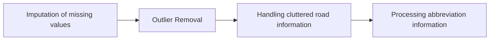
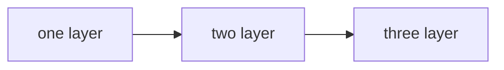
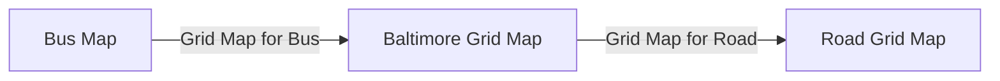
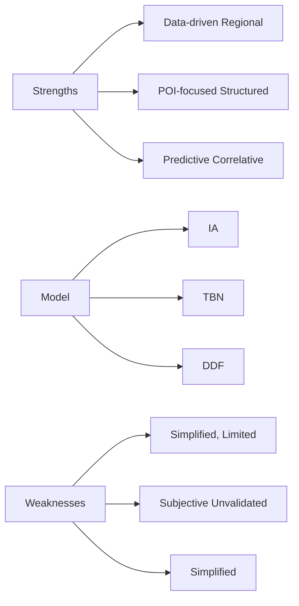

# Navigating Baltimore's Growth: A Multi-Layer Network Approach to Urban Transportation Optimization

## Summary

The collapse of the Francis Scott Key Bridge in 2024 cut off a vital route to the port, posing an unprecedented challenge to Baltimore's transportation system and bringing the optimization of traffic network back into the public view. This paper analyzes the city transportation system based on a multi-layered road network model and proposes several improvement strategies.

Before assessing the traffic conditions in Baltimore, we conduct data preprocessing. Firstly, we use uniqueness of osmid to complete 354,420 missing road names. Subsequently, roads with three or more osmid records (9,953 entries) between two nodes are treated as outliers and removed. For roads with two osmids, we follow the "road smoothing" principle to determine their proper names. Finally, we uniform different road names.

For task 1, to evaluate the influence of bridge collapse on the urban transport system, we establish an impact assessment model, which analyzes the changes in route choices of commuters and non-commuters based on AADT and AAWDT. Additionally, we construct a subnetwork using critical nodes of the highway network, and compute the proximity centrality of these nodes to reflect their efficiency in network propagation, which can reveal the effect of bridge collapse on the connectivity of surrounding areas. Results indicate that in Baltimore Harbor Tunnel Thurway, the traffic flow of commuters increases by 14%, while non-commuters declines by 25%. The Beltway emerges as a heavily loaded segment for diverse user types.

For task 2, we develop a three-layer bus network model to determine the optimal placement of new bus lines. Firstly we use the entropy-weight-TOPSIS method incorporating both infrastructure levels and passenger volume at bus stops, and utilizes the weighted k-shell decomposition method to classify them into core, bridge, and outer layers accordingly. The designed lines aim to enhance inter-layer connectivity and advance the interests of various stakeholders. Statistics demonstrate that the composition of core-bridge edges increases by 18.3% and that of outer layer decreases by 82.9%.

For task 3, we raise a project of adding an Orange Line rail transit to meet the growing demand of residents. The line connecting Penn Station, parks, and large markets, facilitates transfers to the airport and offers benefits to various stakeholders. The total travel time from the farthest station, White Marsh, to the airport is compressed to approximately 65 minutes. Lastly, focusing on the influence on bus stops, we construct a double density fitting model. A quadratic function is utilized to depict the relationship between bus stop density and road network density, thus evaluating the contribution of the rail transit. Results showed an increased demand for bus services along the rail line, averaging around 2.31 times.

The proposed multi-layer network model exhibited strong robustness and stability, as confirmed through sensitivity analysis, highlighting its considerable practical utility. The approach we suggest, by synthesizing a range of transportation factors, provides a robust framework for informing the design and implementation of transportation improvements in Baltimore City.

Keywords: Multi-layer network model, three-layer bus network model, Baltimore

## Contents

## 1 Introduction 3

1.1 Background 3  
1.2 Restatement of the Problem 3  
1.3 Our Work 4

## 2 Model Assumptions and Notation 4

2.1 Assumptions 4  
2.2 Notation 4

## 3 Data Preprocessing 5

3.1 Imputation of Missing Values 5  
3.2 Outlier Removal 5  
3.3 Handling Cluttered Road Information 6  
3.4 Processing Abbreviation Information 6

## 4 Multi-layer Transportation Network Model 7

## 5 Task 1: Analysis of the Bridge Collapse's Impact 8

5.1 Impact Assessment Model(IA) 8  
5.2 Model Solution and Results 10

5.2.1 The Impact around Baltimore 10  
5.2.2 The Impact in Baltimore 11

## 6 Task 2: The impact of the project on the bus system 13

6.1 Three-layer Bus Network Model (TBN) 13  
6.2 Model Solution and Results 15

## 7 Task 3: The project best improves the lives of the residents 17

7.1 Improved Dijkstra Algorithm 17  
7.2 Double Density Fitting Model (DDF) 17  
7.3 Model Solution and Results 18

7.3.1 Question a: The Benefits to Residents 19  
7.3.2 Question b: The Impact on Other Stakeholders 19  
7.3.3 Question c: Disruption to Other Transportation Needs ..... 20

## 8 Sensitivity Analysis 22

## 9 Model Evaluation and Further Discussion 22

9.1 Strengths 22  
9.2 Weaknesses 23  
9.3 Further Discussion 23

## 10 Memorandum 24

## References 25

## 1 Introduction

## 1.1 Background

Baltimore, Maryland faces significant challenges in its aging transportation infrastructure, which affects both residents and businesses. The collapse of the Francis Scott Key Bridge has disrupted major routes across the harbor, causing delays for commuters, freight, and local traffic[1]. With a bustling port and proximity to key highways, the city is critical for both regional and national commerce. However, the city's infrastructure has long been a barrier to efficient movement, especially with highways and rail systems that divide neighborhoods and hinder access to jobs, schools, and local businesses.

In response, Baltimore aims to improve its transportation network as part of a broader sustainability initiative. This involves enhancing public transit, such as rail and bus systems, and repairing or upgrading key infrastructure. The city seeks to address both the practical challenges of transportation—such as congestion, poor transit coverage, and access to major commercial centers—and broader community goals, like reducing environmental impact and improving safety. These efforts also include rethinking how highways and rail systems can be redesigned to reconnect neighborhoods and improve residents' quality of life.


<details>
<summary>natural_image</summary>

Large container ship docked at a port with cranes and scaffolding, no visible text or symbols
</details>

Figure 1: The Collapse of Francis Scott Key Bridge

## 1.2 Restatement of the Problem

In order to solve those problems, we will proceed as follows:

- Firstly, develop a network model of the city's transportation system to assess traffic flow and the impact of the Francis Scott Key Bridge collapse.  
- Secondly, analyze key transportation issues, including public transit limitations and pedestrian infrastructure, to identify potential improvements.  
- Furthermore, evaluate stakeholder impacts, considering the needs of commuters, residents, and businesses.  
- Finally, recommend a project that best improves the city's transportation, balancing benefits, disruptions, and safety.

## 1.3 Our Work

## Problems to Address


Missing values


Outliers


Conflicting names


Abbreviations


## Foundations

Arc-Node-Based Multi-layer Network model


  
Motorway Residential Primary Secondary

## Task 1

impact assessment  
▶ highway subnetwork

## Task 2

▶3-layer bus network  
▶ entropy-weight-TOPSIS  
▶k-shell decomposition

## Task 3

▶ Improved Dijkstra  
Double-density fitting model


## Sensitivity Analysis

▶ Varied segmentation levels  
Ratio method

## Safety Contributions

▶ Independent subway traffic  
▶ Minimize conflicts

  
Figure 2: The Framwork

## 2 Model Assumptions and Notation

## 2.1 Assumptions

To build up our model, we make the following model assumptions.

- All vehicles within a transportation network operate at the maximum speed limit, with varying speeds across different network layers.  
- Commuters travel only on weekdays, while the numbers of non-commuters on weekends and weekdays is identical.  
- Any two nodes in the graph are connected by a path.

## 2.2 Notation

Table 1: Notations

<table><tr><td>Symbols</td><td>Description</td></tr><tr><td> $L(u, v)$ </td><td>Hierarchical layer of the arc between nodes  $u$  and  $v$ </td></tr><tr><td> $t(u, v)$ </td><td>Travel time on the segment between nodes  $u$  and  $v$ </td></tr><tr><td> $k_s$ </td><td>Weighted degree representing the importance of a node</td></tr></table>

## 3 Data Preprocessing

The "edges\_all" and "AADT" files play a crucial role in understanding the distribution of city roads in Baltimore and subsequent analyses. Upon examining the datasets, it became evident that they contained significant noise, necessitating a thorough preprocessing process. The data preprocessing workflow is illustrated in Figure 3.


<details>
<summary>flowchart</summary>


</details>

Figure 3: Data Preprocessing Process

## 3.1 Imputation of Missing Values

In the "edges\_all" file, the "name" column is found to contain missing values. Preliminary analysis indicated a one-to-one correspondence between the "osmid" and the road name, allowing the missing values in the "name" column to be imputed based on the corresponding "osmid" values. Table 2 provides a sample of osmids and their corresponding road names.

Table 2: Road Names Corresponding to Osmids

<table><tr><td>osmid</td><td>road_name</td><td>osmid</td><td>road_name</td><td>osmid</td><td>road_name</td></tr><tr><td>5250723</td><td>Wells Avenue</td><td>355848252</td><td>Kelly Way</td><td>5289021</td><td>Bengies Road</td></tr><tr><td>5308620</td><td>Maxwell Avenue</td><td>435579752</td><td>Rushley Road</td><td>5320737</td><td>Loveton Circle</td></tr></table>

Using the above correspondence, a total of 354,420 missing values in the "name" column are imputed. Other columns, such as "lanes," which has a large number of missing values, are excluded from further analysis, as they do not significantly impact the problem under investigation.

## 3.2 Outlier Removal

As previously noted, each "osmid" corresponds to a unique road. Therefore, any occurrence of three or more "osmids" between two nodes, indicating the presence of multiple roads, is considered an outlier and removed. Table 3 presents examples of outliers identified in the "osmid" column. Ultimately, 9,953 outliers are removed from the dataset.

Table 3: Example of Outliers

<table><tr><td>u</td><td>v</td><td>osmid</td></tr><tr><td>89606346</td><td>1930984898</td><td>[425106099, 425106102, 974337038]</td></tr><tr><td>96250866</td><td>968161510</td><td>[10832171, 10832167, 61424703]</td></tr><tr><td>96250866</td><td>37412403</td><td>[425007969, 425007970, 10832168, 83204409, 83204413]</td></tr></table>

## 3.3 Handling Cluttered Road Information

In the "edges\_all" file, there are cases where two roads exist for some edges. Since the provided information does not specify the boundary between the two roads, and to facilitate subsequent processing, this section defines such cases as a single road. First, the nodes $A$ and $B$ with this condition are identified. The slope $k_{3}$ between these two nodes is then calculated. Assuming that the edge contains two roads, $R_{1}$ and $R_{2}$ , a node $A_{1}$ , directly connected to node $A$ and exclusive to road $R_{1}$ , is identified, and its slope $k_{1}$ is computed. Similarly, for node $B$ , a point exclusive to road $R_{2}$ that is directly connected to node $B$ is found, and its slope $k_{2}$ is calculated. The following relationship is then evaluated:

$$
\left| k _ {3} - k _ {1} \right| <   \left| k _ {3} - k _ {2} \right|. \tag {1}
$$

If this condition holds, the edge is considered to belong to road $R_{1}$ ; otherwise, it is assigned to road $R_{2}$ . A concrete example is illustrated in Figure 4.


<details>
<summary>line chart</summary>

| Location         | Value     |
| ---------------- | --------- |
| [5303705, 431040339] | 4302893639 |
| Ross Avenue      | 5303705   |
| Wells Avenue     | 431040339 |
</details>

(a) Original road condition


<details>
<summary>line chart</summary>

| Node Count | k₁ Value |
| ---------- | -------- |
| 5303705    | 1.135    |
| 431040339  | -0.411   |
</details>

(b) Processed road condition  
Figure 4: Handling Cluttered Road Information

As shown in the figure above, after calculating the three slopes, the original road is identified as Ross Avenue. This method ensures that sharp turns are minimized within a single road.

## 3.4 Processing Abbreviation Information

During the analysis of the "AADT" file, it is observed that the "Road Name" column contains abbreviations that do not match the previously used road names. Upon further investigation, it is found that the road names are abbreviated. To standardize the road names for subsequent analyses, this section converts all abbreviations to their full forms. Table 4 provides a list of common abbreviations and their corresponding full names.

Table 4: Abbreviations and Full Names

<table><tr><td>Abbreviation</td><td>Full Name</td><td>Abbreviation</td><td>Full Name</td><td>Abbreviation</td><td>Full Name</td></tr><tr><td>ST</td><td>STREET</td><td>AVE</td><td>AVENUE</td><td>RD</td><td>ROAD</td></tr><tr><td>DR</td><td>DRIVE</td><td>TERR</td><td>TERRACE</td><td>BLVD</td><td>BOULEVARD</td></tr></table>

## 4 Multi-layer Transportation Network Model

Baltimore can be abstracted as a multi-layer Arc-Node grid model, which represents the transportation network with a topological structure [2]. The core concept of the Arc-Node model is to approximate real-world road curves with a series of straight line segments [3]. The entire transportation network consists of nodes and arcs, represented as a graph $G = (N, A)$ , where N denotes the set of nodes and A represents the arcs. This is formally defined as:

$$
\left\{ \begin{array}{l} G = (N, A) \\ N = \{(x, y) \mid (x, y) \in N _ {s} \}. \\ A = \{(u, v) \mid u, v \in N \} \end{array} \right. \tag {2}
$$

Here, N represents the set of nodes with coordinates $(x, y)$ in the road network, and A denotes the set of arcs representing road segments between nodes u and v.

Based on the specific characteristics of the city, Baltimore's road network can be categorized into different types, such as motorways, residential roads, and primary roads. Consequently, the transportation network can be abstracted into a multi-layer structure. Each layer $L_{i}$ corresponds to a subgraph $G_{i}$ of the graph $G$ . The layers are independent of one another, ensuring the topological connectivity of the network and enabling hierarchical management of the transportation system. This can be represented as:

$$
\left\{ \begin{array}{l} G = G _ {1} \cup G _ {1} \cup G _ {2} \cup \dots \cup G _ {k} \\ N (G _ {i}) \in N (G), \forall i \in k \\ A (G _ {i}) \in A (G), \forall i \in k \end{array} , \right. \tag {3}
$$

where $N(G)$ and $A(G)$ denote the sets of nodes and arcs in the graph $G$ , respectively.

A diagram of the multi-layer road network model is shown below:


<details>
<summary>flowchart</summary>


</details>

Figure 5: Layered Road Network Diagram

For each arc, various attributes are constructed to provide a comprehensive description of the city's transportation network system:

\- $d(u, v)$ represents the shortest path length between nodes $u$ and $v$ . In multi-layer path planning, it is necessary to compute the shortest path by transferring input nodes to higher-layer networks. If node $u$ starts at a lower layer, its shortest path to the higher-layer network must be searched within a local area [4].

- $L(u, v)$ indicates the hierarchy of the arc between nodes $u$ and $v$ , used to differentiate between main roads and secondary roads. Typically, higher-layer roads allow faster traffic flow.  
- $t(u, v)$ represents the travel time from node $u$ to node $v$ , calculated as the path length divided by the speed allowed on that layer:

$$
t (u, v) = \frac {d (u , v)}{v (L (u , v))}. \tag {4}
$$

\- $q(u, v)$ denotes the traffic flow on the road segment between nodes $u$ and $v$ . In traffic flow models, the flow must be conserved along the same path, i.e.,

$$
\sum_ {u \in N} q (u, v) = \sum_ {v \in N} q (v, u), \forall u, v \in N. \tag {5}
$$

## 5 Task 1: Analysis of the Bridge Collapse's Impact

## 5.1 Impact Assessment Model(IA)

## • The Impact in Baltimore

In order to assess the impact of the bridge collapse on stakeholders in Baltimore, we select AADT (Annual Average Daily Traffic) and AAWDT (Annual Average Weekday Traffic) as the evaluation indicators, which effectively describe the traffic conditions in Baltimore. Based on the changes in these two indicators before and after the bridge collapse, we can analyze the impact of the collapse of the Francis Scott Key Bridge.

As one of the oldest towns in the United States, Baltimore's economy is steadily growing [5]. It is observed that the AADT and AAWDT data for most roads remained relatively stable between 2014 and 2022. Therefore, to estimate the AADT and AAWDT on road $i$ at the beginning of 2024, with the bridge still in place, we calculate the historical averages:

$$
\left\{ \begin{array}{l} \mathrm{AADT} _ {i, 2 0 2 4} = \frac {1}{9} \sum_ {y = 2 0 1 4} ^ {2 0 2 2} \mathrm{AADT} _ {i, y} \\ \mathrm{AAWDT} _ {i, 2 0 2 4} = \frac {1}{9} \sum_ {y = 2 0 1 4} ^ {2 0 2 2} \mathrm{AAWDT} _ {i, y} \end{array} . \right. \tag {6}
$$

Here, we categorize the stakeholders into commuters and non-commuters [6]. The average number of commuters passing through road i in year y is denoted by $J_{i,y}$ , and the number of non-commuters is denoted by $K_{i,y}$ . The AADT and AAWDT for road i in year y can then be expressed as:

$$
\left\{ \begin{array}{l} \mathrm {AADT_ {i,y}} = \frac {5 \cdot J _ {i , y} + 7 \cdot K _ {i , y}}{7} \\ \mathrm {AAWDT_ {i,y}} = \frac {5 \cdot J _ {i , y} + 5 \cdot K _ {i , y}}{5} \end{array} . \right. \tag {7}
$$

After simplification the above equations yields the following formulas for commuters and non-commuters:

$$
\left\{ \begin{array}{l} J _ {i, y} = \frac {1}{2} \times (7 \cdot \mathrm{AADT} _ {\mathrm{i}, \mathrm{y}} - 5 \cdot \mathrm{AAWDT} _ {\mathrm{i}, \mathrm{y}}) \\ K _ {i, y} = \frac {7}{2} \times (\mathrm{AAWDT} _ {\mathrm{i}, \mathrm{y}} - \mathrm{AADT} _ {\mathrm{i}, \mathrm{y}}) \end{array} . \right. \tag {8}
$$

Let the impact coefficient for road i be denoted by $\beta_{i}$ . For each road, we can analyze the impact of the bridge collapse on commuters and non-commuters. The calculation of the impact coefficient is shown in the figure below.

$$
\beta_{i}\frac{J_{i,\text{current}}}{J_{i,2024}} = \frac{7 \cdot \mathrm{AADT}_{i,\text{current}} - 5 \cdot \mathrm{AAWDT}_{i,\text{current}}}{2 \cdot J_{i,2024}} \quad \text{Non-commuters}
$$

Figure 6: Calculation of Influence Coefficient

The analysis shows that if the impact coefficient $\beta_{i}$ is greater than 1, the traffic volume on this road segment increases after the bridge collapse. If $\beta_{i}$ is less than 1, the traffic volume decreases.

## • The Impact around Baltimore

To assess the impact of the bridge collapse on cities surrounding Baltimore, we refer to $[7]$ , which indicates that the primary sources of impact come from the highways connecting Baltimore to surrounding cities and the highways crossing Baltimore. Based on this reference, we select 39 representative nodes in Baltimore for analysis, as shown in the diagram below.


<details>
<summary>text_image</summary>

Map with numbered points and road networks, showing city layout and infrastructure labels
</details>

(a) Before abstraction


<details>
<summary>flowchart</summary>

```mermaid
graph TD
    subgraph Graph G
  A1["Node"] --> B1["Node"]
  A2["Node"] --> B2["Node"]
  A3["Node"] --> B3["Node"]
  A4["Node"] --> B4["Node"]
  A5["Node"] --> B5["Node"]
  A6["Node"] --> B6["Node"]
  A7["Node"] --> B7["Node"]
  A8["Node"] --> B8["Node"]
  A9["Node"] --> B9["Node"]
  A10["Node"] --> B10["Node"]
  A11["Node"] --> B11["Node"]
  A12["Node"] --> B12["Node"]
  A13["Node"] --> B13["Node"]
  A14["Node"] --> B14["Node"]
  A15["Node"] --> B15["Node"]
  A16["Node"] --> B16["Node"]
  A17["Node"] --> B17["Node"]
  A18["Node"] --> B18["Node"]
  A19["Node"] --> B19["Node"]
  A20["Node"] --> B20["Node"]
  A21["Node"] --> B21["Node"]
  A22["Node"] --> B22["Node"]
  A23["Node"] --> B23["Node"]
  A24["Node"] --> B24["Node"]
  A25["Node"] --> B25["Node"]
  A26["Node"] --> B26["Node"]
  A27["Node"] --> B27["Node"]
  A28["Node"] --> B28["Node"]
  A29["Node"] --> B29["Node"]
  A30["Node"] --> B30["Node"]
  A31["Node"] --> B31["Node"]
  A32["Node"] --> B32["Node"]
  A33["Node"] --> B33["Node"]
  A34["Node"] --> B34["Node"]
  A35["Node"] --> B35["Node"]
  A36["Node"] --> B36["Node"]
  A37["Node"] --> B37["Node"]
  A38["Node"] --> B38["Node"]
  A39["Node"] --> B39["Node"]
  A40["Node"] --> B40["Node"]
  A41["Node"] --> B41["Node"]
  A42["Node"] --> B42["Node"]
  A43["Node"] --> B43["Node"]
  A44["Node"] --> B44["Node"]
  A45["Node"] --> B45["Node"]
  A46["Node"] --> B46["Node"]
  A47["Node"] --> B47["Node"]
  A48["Node"] --> B48["Node"]
  A49["Node"] --> B49["Node"]
  A50["Node"] --> B50["Node"]
  A51["Node"] --> B51["Node"]
  A52["Node"] --> B52["Node"]
  A53["Node"] --> B53["Node"]
  A54["Node"] --> B54["Node"]
  A55["Node"] --> B55["Node"]
  A56["Node"] --> B56["Node"]
  A57["Node"] --> B57["Node"]
  A58["Node"] --> B58["Node"]
  A59["Node"] --> B59["Node"]
  A60["Node"] --> B60["Node"]
  A61["Node"] --> B61["Node"]
  A62["Node"] --> B62["Node"]
  A63["Node"] --> B63["Node"]
  A64["Node"] --> B64["Node"]
  A65["Node"] --> B65["Node"]
  A66["Node"] --> B66["Node"]
  A67["Node"] --> B67["Node"]
  A68["Node"] --> B68["Node"]
  A69["Node"] --> B69["Node"]
  A70["Node"] --> B70["Node"]
  A71["Node"] --> B71["Node"]
  A72["Node"] --> B72["Node"]
  A73["Node"] --> B73["Node"]
  A74["Node"] --> B74["Node"]
  A75["Node"] --> B75["Node"]
  A76["Node"] --> B76["Node"]
  A77["Node"] --> B77["Node"]
  A78["Node"] --> B78["Node"]
  A79["Node"] --> B79["Node"]
  A80["Node"] --> B80["Node"]
  A81["Node"] --> B81["Node"]
  A82["Node"] --> B82["Node"]
  A83["Node"] --> B83["Node"]
  A84["Node"] --> B84["Node"]
  A85["Node"] --> B85["Node"]
  A86["Node"] --> B86["Node"]
  A87["Node"] --> B87["Node"]
  A88["Node"] --> B88["Node"]
  A89["Node"] --> B89["Node"]
```
</details>

(b) After abstraction  
Figure 7: Selection of Highway Nodes

During the node abstraction process, if node 37 is connected to node 39, this represents the situation before the bridge collapse (denoted as Graph $G_{2}$ ); if the connection is broken, it represents the situation after the bridge collapse (denoted as Graph G).

By analyzing the Closeness Centrality of G and $G_{2}$ , we can assess the impact of the bridge collapse before and after its occurrence. Closeness Centrality refers to the inverse of the average shortest path length from a node to all other nodes in the network, reflecting the efficiency of propagation within the network. For node v, the Closeness Centrality $C_{C}(v)$ is calculated as follows:

$$
C _ {C} (v) = \frac {N - 1}{\sum_ {t} d (v , t)}, \tag {9}
$$

where $d(v, t)$ is the shortest path length between node v and node t, and N is the total number of nodes in the network.

## 5.2 Model Solution and Results

## 5.2.1 The Impact around Baltimore

The impact of the bridge collapse on areas surrounding Baltimore primarily manifests through the highways. Using the model, we can calculate the Closeness Centrality for 39 highway nodes before and after the bridge collapse. The results are shown in the figure below.


<details>
<summary>bar chart</summary>

| Node | Closeness Centrality G | Closeness Centrality G2 |
|---|---|---|
| 0 | 0.215 | 0.215 |
| 1 | 0.218 | 0.220 |
| 2 | 0.193 | 0.194 |
| 3 | 0.212 | 0.215 |
| 4 | 0.260 | 0.260 |
| 5 | 0.268 | 0.270 |
| 6 | 0.258 | 0.260 |
| 7 | 0.258 | 0.262 |
| 8 | 0.231 | 0.231 |
| 9 | 0.278 | 0.277 |
| 10 | 0.214 | 0.214 |
| 11 | 0.256 | 0.257 |
| 12 | 0.315 | 0.315 |
| 13 | 0.279 | 0.279 |
| 14 | 0.254 | 0.257 |
| 15 | 0.249 | 0.251 |
| 16 | 0.188 | 0.190 |
| 17 | 0.177 | 0.178 |
| 18 | 0.190 | 0.191 |
| 19 | 0.223 | 0.224 |
| 20 | 0.240 | 0.243 |
| 21 | 0.256 | 0.257 |
| 22 | 0.311 | 0.311 |
| 23 | 0.284 | 0.284 |
| 24 | 0.314 | 0.314 |
| 25 | 0.300 | 0.301 |
| 26 | 0.313 | 0.313 |
| 27 | 0.288 | 0.293 |
| 28 | 0.277 | 0.281 |
| 29 | 0.281 | 0.285 |
| 30 | 0.305 | 0.310 |
| 31 | 0.284 | 0.289 |
| 32 | 0.261 | 0.267 |
| 33 | 0.244 | 0.254 |
| 34 | 0.246 | 0.253 |
| 35 | 0.224 | 0.231 |
| 36 | 0.197 | 0.219 |
| 37 | 0.196 | 0.207 |
| 38 | 0.165 | 0.203 |
</details>

Figure 8: Closeness Centrality of Nodes in G and G2

It can be observed that nodes 36-38 are most affected by the bridge collapse, corresponding to nodes 37-39 in Figure 7. Specifically, nodes 38 and 39 are located outside of Baltimore, which suggests that the collapse of the bridge indeed impacted the cities surrounding Baltimore, particularly node 39, which has been affected the most.

It is also evident that the Closeness Centrality of nodes 0-26 remains largely unchanged or experiences only minimal variation, suggesting that the impact of the bridge collapse on these nodes is relatively insignificant.

## 5.2.2 The Impact in Baltimore

First, we analyze the impact in Baltimore. Based on the established Impact Assessment Model, we can calculate the AADT and AAWDT for different nodes before the bridge collapse in 2024. Using the formulas from equation (8), we can calculate the traffic volume for both commuters and non-commuters on different roads.

We find that traffic volume for non-commuters is generally concentrated in smaller ranges, while the traffic volume for commuters is distributed more evenly between 0 and 10,000.

Next, using the diagram in Figure 6, we can calculate the impact coefficient $\beta_{i}$ for road $i$ . The impact coefficients for commuters and non-commuters are shown in the figure below.


<details>
<summary>histogram</summary>

| Influence Coefficient βi | Frequency |
| ----------------------- | --------- |
| 0.00 - 0.25             | 0         |
| 0.25 - 0.50             | 0         |
| 0.50 - 0.75             | 10        |
| 0.75 - 1.00             | 300       |
| 1.00 - 1.25             | 400       |
| 1.25 - 1.50             | 10        |
| 1.50 - 1.75             | 0         |
| 1.75 - 2.00             | 0         |
</details>


<details>
<summary>histogram</summary>

| Influence Coefficient βi | Frequency |
| ------------------------ | --------- |
| 0.00 - 0.25              | 0         |
| 0.25 - 0.50              | 10        |
| 0.50 - 0.75              | 90        |
| 0.75 - 1.00              | 240       |
| 1.00 - 1.25              | 180       |
| 1.25 - 1.50              | 120       |
| 1.50 - 1.75              | 5         |
| 1.75 - 2.00              | 0         |
</details>

Figure 9: Influence Coefficients of Various Stakeholders

From this figure, it is clear that the impact coefficients for commuters are mostly concentrated around 1, while those for non-commuters are more dispersed, with the majority of impact coefficients being less than 1. This indicates that the collapse of the bridge hindered non-commuters' travel, resulting in a decrease in traffic volume for non-commuters on many roads. For commuter traffic, some roads saw an increase in traffic, while others experienced a decrease.

We further visualize the top 5 and bottom 5 roads in terms of impact coefficients for both commuters and non-commuters in the figure below.


<details>
<summary>bar chart</summary>

| Road Name | Commuter Mean | Commuter Current |
| :--- | :--- | :--- |
| RAMP 5 FR RAMP 9 (FR MD695) TO MD 157 SB | 30 | 1200 |
| RAMP 6 FR RAMP 3 TO GREENSPRING AVE | 50 | 4900 |
| RAMP 3 FR MD 158 TO MD 695 NB | 30 | 1700 |
| RAMP 8 FR IS 83 SB TO MT ROYAL AVE | 60 | 2000 |
| RAMP 7 FR MD 157 NB TO RAMP 9 (TO MD695) | 190 | 5000 |
</details>

(a) Top 5 Roads with Largest Commuter Traffic Increase


<details>
<summary>bar chart</summary>

| Road Name | Non-commuter Mean | Non-commuter Current |
|---|---|---|
| RAMP 5 FR RAMP 9 (FR MD695) TO MD 157 SB | 50 | 280 |
| RAMP 6 FR RAMP 3 TO GREENSPRING AVE | 100 | 560 |
| RAMP 3 FR MD 158 TO MD 695 NB | 100 | 460 |
| RAMP 8 FR IS 83 SB TO MT ROYAL AVE | 100 | 240 |
| RAMP 7 FR MD 157 NB TO RAMP 9 (TO MD695) | 580 | 1240 |
</details>

(b) Top 5 Roads with Largest Non-commuter Traffic Increase


<details>
<summary>bar chart</summary>

| Road Name | Commuter Mean | Commuter Current |
| :--- | :--- | :--- |
| RAMP 9 FR IS 795 5B TO METRO CENTRE | 1700 | 6400 |
| RAMP 3 FR IS 695 EB TO GREENSPRING AVE | 6400 | 400 |
| LAKE MONTEBELLO DR | 4000 | 1000 |
| RAMP 6 FR PARALLEL DR TO RAMP 8 | 3400 | 1000 |
| EAST AVE | 1600 | 500 |
</details>

(c) Top 5 Roads with Largest Commuter Traffic Decrease


<details>
<summary>bar chart</summary>

| Road Name | Non-commuter Mean | Non-commuter Current |
|---|---|---|
| RAMP 3 FR IS 695 EB TO GREENSPRING AVE | 1000 | 0 |
| RAMP 6 FR PARALLEL DR TO RAMP 8 | 500 | 0 |
| BALTIMORE BLVD | 12500 | 2800 |
| METROPOLITAN BLVD | 12500 | 2800 |
| LAKE MONTEBELLO DR | 1000 | 0 |
</details>

(d) Top 5 Roads with Largest Non-commuter Traffic Decrease  
Figure 10: The Roads with the Greatest Impact

These roads are most significantly affected by the bridge collapse. The road "RAMP 5 FR RAMP 9 (FR MD695) TO MD 157 SB" has the highest impact coefficient for both commuters and non-commuters, reaching 11.994. Among commuters, the road "RAMP 9 FR IS 795 SB TO METRO CENTRE" has the smallest impact coefficient of 0.005, while for non-commuters, "RAMP 3 FR IS 695 EB TO GREENSPRING AVE" has the smallest impact coefficient of 0.059.

The following visualizations display the top 100 and bottom 100 roads for commuters and non-commuters, providing a more intuitive representation of how different roads in Baltimore are affected by the bridge collapse. Roads where the impact coefficient is closer to blue are negatively affected, while those closer to red are positively heavily impacted.


<details>
<summary>text_image</summary>

Non-Commuter
Beltway
Commuter
Bridge-II
Beltway
Bridge-II
39.4
39.3
39.2
-76.9 -76.8 -76.7 -76.6 -76.5 -76.4
0.2 0.4 0.6 0.8 1.0 1.2 1.4 1.6 1.8 2.0
www.smluor.com
</details>

Figure 11: Visualization of the Top 100 Affected Roads

For commuters, due to the collapse of the bridge, the traffic that previously crossed the Patapsco River must now be rerouted through "Bridge-II" (as shown in the figure), leading to an increase in traffic volume on this bridge, with an impact coefficient greater than 1. However, for non-commuters, the impact coefficient is less than 1, possibly because the collapse of the bridge reduced non-commuters' willingness to travel across the river, thereby decreasing traffic volume compared to before the collapse.

The figure also reveals a significant increase in Beltway traffic for both stakeholder groups, particularly on the segment “RAMP 5 FR RAMP 9 (FR MD695) TO MD 157 SB” shown in Figure 10. This suggests that, following the bridge collapse, both stakeholder groups are more frequently traveling on the Beltway. A possible explanation for this behavior is the higher speed limit on this road, which allows drivers to reach their destinations more quickly.

## 6 Task 2: The impact of the project on the bus system

## 6.1 Three-layer Bus Network Model (TBN)

As urban development progresses, various modes of transportation have emerged, yet buses remain the preferred mode of travel for most individuals. This study focuses on optimizing the public transportation system of Baltimore City, assessing the potential impact on existing urban residents after its implementation. By utilizing the originally constructed transportation network, we develop a TBN Model to analyze the connectivity between higher and lower layers.

## ▶ Step 1: Classification of Bus Station Levels

We apply and refine the weighted $k$ -shell decomposition algorithm for classifying each bus station[8][9]. In the original weighted $k$ -shell decomposition method, the weighted degree $k_{s}$ is calculated by considering both the degree of the node and the weight of its edges, reflecting the importance of a node. It is defined as follows:

$$
k _ {s} = \left[ k _ {i} ^ {\alpha} \left(\sum_ {j} ^ {k _ {i}} w _ {i j}\right) ^ {\beta} \right] ^ {\frac {1}{\alpha + \beta}}, \tag {10}
$$

where $k_{i}$ represents the degree of node $i$ ; $w_{ij}$ represents the weight of the edge between nodes $i$ and $j$ ; $\alpha$ and $\beta$ denote the influence of degree and weight, respectively.

However, in a bus network, stations are abstracted as nodes, overlooking their intrinsic attributes such as geographical location, connections to surrounding environments, and population density in the area. To address this, we introduce a weighted metric $S$ to quantify each bus station's attributes, incorporating the POI (Point of Interest) [11] indicator and the number of on-off passengers. This approach ensures a comprehensive consideration of the actual conditions, linking bus stations closely with urban planning.

$$
S _ {i} = w _ {p} \times P O I _ {i} + w _ {r} \times N _ {i} + w _ {k} \times k _ {i}, \tag {11}
$$

where $N_{i}$ represents the total number of passengers boarding and alighting at station $i$ , and the POI indicator reflects the distribution of infrastructure within a defined area, often used to gauge service convenience and resident activity. Based on Baltimore's actual conditions, we classify five types as shown below:

Table 5: POI Weight

<table><tr><td>POI Type</td><td>Weight</td><td>POI Type</td><td>Weight</td><td>POI Type</td><td>Weight</td></tr><tr><td rowspan="2">subway exchange markets</td><td>1</td><td>tourist attraction</td><td>0.7</td><td>railway station</td><td>1.5</td></tr><tr><td>0.5</td><td>universities</td><td>0.75</td><td></td><td></td></tr></table>

Next, we employ the entropy weight method (TOPSIS) to compute the weight of the two indicators and derive the bus station scores S. Based on the bus station scores S and equation (11), we design an improved weighted k-shell model, assuming that all bus routes are of equal importance, with edge weights $w_{ij}$ set to 1. Typically, $\alpha = \beta = 1$ , assuming equal influence of degree and weight.

$$
k _ {s} = \sqrt {k _ {i} \times S}, \tag {12}
$$

where $k_{i}$ represents the degree of node i, i.e., the number of edges connecting to the node. In the transportation network model, the number of routes served by bus station i is equivalent to its degree:

$$
k _ {i} = \text { length } (R o u t e s \_ S e r _ {i}), \tag {13}
$$

where $Routes\_Ser_i$ denotes the set of routes served by station $i$ .

Thus, we assign a unique $k_{s}$ to each bus station. A higher $k_{s}$ indicates greater importance of the station in the network, and it corresponds to a higher tier in the model.

Finally, we discretize the $k_{s}$ values to facilitate the counting of nodes within each range. In this paper, we define the interval length as 0.05. For example, if $k_{s} = 0.045 \in (0, 0.05)$ , all nodes within this range have their $k_{s}$ values adjusted to 0.25, which represents the interval mean.

## ▶ Step 2: Construction of the Three-tier Bus Network

At this point, we have obtained the distribution of $k_{s}$ , as shown in the following histogram:


<details>
<summary>bar-line hybrid chart</summary>

| Evaluation Score | Frequency | Derivative of Cumulative Sum |
| ---------------- | --------- | ---------------------------- |
| 0.0              | 75        | 0                            |
| 0.1              | 230       | 10                           |
| 0.2              | 450       | 20                           |
| 0.3              | 400       | 30                           |
| 0.4              | 270       | 40                           |
| 0.5              | 170       | 50                           |
| 0.6              | 160       | 60                           |
| 0.7              | 110       | 70                           |
| 0.8              | 90        | 80                           |
| 0.9              | 60        | 90                           |
| 1.0              | 40        | 100                          |
| 1.1              | 30        | 110                          |
| 1.2              | 20        | 120                          |
| 1.3              | 15        | 130                          |
| 1.4              | 10        | 140                          |
| 1.5              | 8         | 150                          |
| 1.6              | 5         | 160                          |
| 1.7              | 3         | 170                          |
| 1.8              | 2         | 180                          |
| 1.9              | 1         | 190                          |
| 2.0              | 1         | 200                          |
</details>

Figure 12: Histogram of Evaluation Indicators

Based on the distribution of $k_{s}$ values, we divide the transportation network into three tiers: the core layer, the bridge layer, and the peripheral layer [12]. The core layer consists of key traffic nodes that serve as hubs in the network, with the highest $k_{s}$ values. Analyzing the high $k_{s}$ values, we identify a breaking point at a certain value $k_{s,i}$ , which signifies the boundary between the core and bridge layers. Nodes with $k_{s} > k_{s,i}$ are categorized as belonging to the core layer.

We then analyze the nodes with low $k_{s}$ values. Defining the cumulative $k_{s}$ value for a node: for a node $k_{s} < a$ , we calculate the total number of nodes within this range and sum their $k_{s}$ values to obtain the cumulative $k_{s}$ value. The point at which the cumulative $k_{s}$ value reaches a peak corresponds to the boundary between the bridge and peripheral layers. Nodes with $k_{s} < k_{s,j}$ are classified into the peripheral layer. The remaining nodes, where $k_{s,i} < k_{s} < k_{s,j}$ , belong to the bridge layer.

## 6.2 Model Solution and Results

The project aims to improve the public transportation network by adding two new bus routes after analyzing the tiers of bus stations. To assess the need for additional bus routes, data regarding key infrastructure in Baltimore — such as popular tourist attractions, universities, and supermarkets — are collected to evaluate the residential activity levels at different bus stations. Based on the constructed Three-layer Bus Network (TBN) model, the three-tier bus network of Baltimore is shown in the figure below.


<details>
<summary>text_image</summary>

Core layer
</details>


<details>
<summary>text_image</summary>

Bridge layer
</details>


<details>
<summary>text_image</summary>

Outer layer
</details>

Figure 13: The three layers in the higher-order bus network

In the Core Layer, there are 11 bus stations, in the Bridge Layer there are 1,180 bus stations, and in the Outer Layer, there are 1,444 bus stations. To enhance the network, roads within different layers are classified using a shortest distance search method, dividing the roads into five categories. The locations(a) and distribution percentages of these roads(b) are depicted in the figure below.


<details>
<summary>pie chart</summary>

| Category | Percentage (%) |
| :--- | :--- |
| Core-Bridge | 2.2 |
| Bridge-Bridge | 56.5 |
| Outer-Outer | 22.9 |
| Core-Core | 1.0 |
| Bridge-Outer | 17.4 |
</details>

Figure 14: Bus routes in TBN model

Based on the TBN model, our goal is to construct additional bus routes connecting the Core Layer and Bridge Layer, as well as more routes between the Bridge Layer and Outer Layer, to facilitate residents' travel from the outer regions to the city center, specifically to bus stations in the Core Layer. Thus, the proposed project suggests adding two new bus routes to achieve this objective.

A 2-kilometer radius circle is drawn with the average coordinates of the 11 bus stations in the Core Layer as the center. The surrounding local transportation network and infrastructure are shown in figure (a). The final bus route plan is shown in figure (b), where the two new routes significantly improve connectivity between the Core Layer and Bridge Layer bus stations.


<details>
<summary>map with overlayed line</summary>

| Location | Core Level | Core-Bridge | Bridge Level | Bridge-Out | Out Level |
|---|---|---|---|---|---|
| (1) | 39.27 | 39.28 | 39.29 | 39.29 | 39.29 |
| (2) | 39.28 | 39.29 | 39.30 | 39.30 | 39.30 |
| (3) | 39.29 | 39.30 | 39.31 | 39.31 | 39.31 |
| (4) | 39.27 | 39.28 | 39.29 | 39.29 | 39.29 |
| (5) | 39.28 | 39.29 | 39.30 | 39.30 | 39.30 |
| (6) | 39.27 | 39.28 | 39.29 | 39.29 | 39.29 |
| (7) | 39.28 | 39.29 | 39.30 | 39.30 | 39.30 |
| (8) | 39.27 | 39.28 | 39.29 | 39.29 | 39.29 |
| (9) | 39.28 | 39.29 | 39.30 | 39.30 | 39.30 |
| (10) | 39.27 | 39.28 | 39.29 | 39.29 | 39.29 |
| (11) | 39.28 | 39.29 | 39.30 | 39.30 | 39.30 |
| (12) | 39.27 | 39.28 | 39.29 | 39.29 | 39.29 |
| (13) | 39.28 | 39.29 | 39.30 | 39.30 | 39.30 |
| (14) | 39.27 | 39.28 | 39.29 | 39.29 | 39.29 |
| (15) | 39.28 | 39.29 | 39.30 | 39.30 | 39.30 |
| (16) | 39.27 | 39.28 | 39.29 | 39.29 | 39.29 |
| (17) | 39.28 | 39.29 | 39.30 | 39.30 | 39.30 |
| (18) | 39.27 | 39.28 | 39.29 | 39.29 | 39.29 |
| (19) | 39.28 | 39.29 | 39.30 | 39.30 | 39.30 |
| (20) | 39.27 | 39.28 | 39.29 | 39.29 | 39.29 |
| (21) | 39.28 | 39.29 | 39.30 | 39.30 | 39.30 |
| (22) | 39.27 | 39.28 | 39.29 | 39.29 | 39.29 |
| (23) | 39.28 | 39.29 | 39.30 | 39.30 | 39.30 |
| (24) | 39.27 | 39.28 | 39.29 | 39.29 | 39.29 |
| (25) | 39.28 | 39.29 | 39.30 | 39.30 | 39.30 |
| (26) | 39.27 | 39.28 | 39.29 | 39.29 | 39.29 |
| (27) | 39.28 | 39.29 | 39.30 | 39.30 | 39.30 |
| (28) | 39.27 | 39.28 | 39.29 | 39.29 | 39.29 |
| (29) | 39.28 | 39.29 | 39.30 | 39.30 | 39.30 |
| (5) (Note: The chart displays a single data point for 'Out Level' in the center of the chart, but it is not explicitly labeled in the original image.) The values are estimated based on the provided code and are not explicitly provided in the original image form.
</details>

(a) Central facilities


<details>
<summary>map with path lines</summary>

| X-axis | Y-axis | Bus Line |
|---|---|---|
| -76.64 | 39.27 | Bus Line 1 |
| -76.63 | 39.28 | Bus Line 1 |
| -76.62 | 39.29 | Bus Line 1 |
| -76.61 | 39.30 | Bus Line 1 |
| -76.60 | 39.31 | Bus Line 1 |
| -76.59 | 39.30 | Bus Line 2 |
| -76.58 | 39.29 | Bus Line 2 |
The image contains a legend for the chart, but it is not directly plotted on the map itself. The labels 'Bus Line 1' and 'Bus Line 2' are positioned at specific coordinates within the map area.
</details>

(b) Our Project  
Figure 15: Project Analysis

- Tourists: For tourists, the new bus routes connect many famous attractions, making it easier to travel between different points of interest.  
- Suburban Residents: For suburban residents, the project significantly improves connectivity between the Bridge and Core Layers, providing easier access from the suburbs to areas with more developed infrastructure.  
- College Students: For college students, the project also considers universities such as Johns Hopkins University, offering students more transportation options.

Based on the project, the following five variations in road conditions are observed, as illustrated in the figure below.


<details>
<summary>bar chart</summary>

| Categories | Original (%) | Improved (%) | Change (%) |
|---|---|---|---|
| core_bridge | 3.4 | 4.1 | +18.3 |
| bridge_out | 17.2 | 7.4 | -57.2 |
| core_level | 0.8 | 1.6 | +95.1 |
| out_level | 23.2 | 4.0 | -82.9 |
| bridge_level | 55.3 | 83.0 | +50.2 |
</details>

Figure 16: Changes in road conditions before and after project implementation

As depicted in the figure, the implementation of this project resulted in an 18.3% increase in road conditions between the Core and Bridge layers. Additionally, the road conditions within the Core layer increased by 95%, highlighting the significant advantages of this project.

## 7 Task 3: The project best improves the lives of the residents

## 7.1 Improved Dijkstra Algorithm

To analyze the impact of newly constructed metro lines on the travel patterns of Baltimore's residents, we have developed a hierarchical path planning model. Unlike the traditional Dijkstra algorithm, we update the weights of road paths to represent travel times, with the primary objective being to minimize the total travel time:

$$
\min T = \sum_ {i, j \in N _ {d}} t (i, j) = \sum_ {i, j \in N _ {d}} \frac {a (u , v)}{v (L (u , v))}, \quad N _ {d} \in N, \tag {14}
$$

where $N_{d}$ denotes the set of nodes involved in achieving the shortest travel time.

## 7.2 Double Density Fitting Model (DDF)

Public transit station density is frequently used as an indicator of transportation accessibility, which is inherently linked to road network density. In this section, we examine the potential correlation between bus station density and road network density. We employ road density to estimate the effect of unconstructed metro stations on the density of public transit stations. Additionally, we calculate the current bus station density surrounding the existing two metro stations to evaluate the impact of metro construction on bus stations.

## ▶ Step 1: Grid Map Creation

A $6 \times 6$ grid map is constructed for the central district of Baltimore to estimate the density within each grid cell.


<details>
<summary>flowchart</summary>


</details>

Figure 17: Grid Map

## ▶ Step 2: Calculation of Bus Station Density and Road Network Density

Since the area of each grid cell is uniform, we simplify the road network density to the total length of accessible roads within the region, while the bus station density is represented by the total number of bus stations within the grid. This is formalized as:

$$
\left\{ \begin{array}{l} \rho_ {b u s} = \sum_ {v \in N _ {b}} v, \quad N _ {b} \in N \\ \rho_ {r o a d} = \sum_ {i, j \in N _ {r}} a (i, j), \quad N _ {r} \in N ^ {\prime} \end{array} \right. \tag {15}
$$

where $N_{b}$ represents the set of bus stations within a grid cell, and $N_{r}$ represents the set of road nodes within the cell. The term $a_{ij}$ denotes the length of the accessible road between nodes i and j.

## ▶ Step 3: Fitting and Bus Station Density Prediction

Various methods, including linear, quadratic, cubic, and exponential functions, are used to fit the relationship between road network density and bus station density. The best-fitting method is selected, and the bus station density before the construction of the metro is predicted based on the current road network density.

## ▶ Step 4: Metro Impact Analysis

For a more precise analysis of the metro's impact on public transportation, the map is further refined into a $20 \times 20$ grid. The difference between the actual bus station density and the predicted bus station density provides a measure of the impact of metro construction on bus stations, denoted as $\Delta \rho_{bus}$ :

$$
\Delta \rho_ {b u s} = \rho_ {b u s} - \hat {\rho} _ {b u s}. \tag {16}
$$

## 7.3 Model Solution and Results

Despite Baltimore being one of the United States' primary port cities, existing metro lines, as reported in [10], fail to meet the daily transportation needs of its residents. A study evaluating Baltimore's current economic condition proposed four additional metro lines. From this, we selected one line as a representative “transportation project most likely to improve residents’ quality of life” for further analysis. Additionally, we proposed the inclusion of new metro stations to accommodate the travel demands of a broader group of stakeholders. The existing metro routes and the line under analysis, marked in orange, are shown below.


<details>
<summary>map with line overlay</summary>

| Project Name | Line Color | Latitude | Longitude |
| --- | --- | --- | --- |
| Old Spring | Orange Line | 30.50 | -76.75 |
| Spring | Orange Line | 30.50 | -76.75 |
| Woodberry | Orange Line | 30.50 | -76.75 |
| Mondawmin | Green Line | 30.50 | -76.75 |
| Penn-North | Green Line | 30.50 | -76.75 |
| Upton | Orange Line | 30.50 | -76.75 |
| Millford Mill | Green Line | 30.50 | -76.75 |
| Grantstown Plaza | Green Line | 30.50 | -76.75 |
| Rogers Ave | Green Line | 30.50 | -76.75 |
| West Code Spring | Green Line | 30.50 | -76.75 |
| Mount Washington | Green Line | 30.50 | -76.75 |
| Cold Spring | Green Line | 30.50 | -76.75 |
| Woodberry | Green Line | 30.50 | -76.75 |
| Monowatt History of Elizabeth Bonaparte | Green Line | 30.50 | -76.75 |
| Parkville | Green Line | 30.50 | -76.75 |
| Hamilton | Green Line | 30.50 | -76.75 |
| Herring Run Park | Green Line | 30.50 | -76.75 |
| New-added node | Orange Line | 30.50 | -76.75 |
| James Hopkins | Green Line | 30.50 | -76.75 |
</details>

Figure 18: Subway Route

The proposed line, as per the original draft, does not connect to the existing two lines, preventing seamless transfers. To resolve this, we added new stations, such as “Upton” connecting to the Green Line and “Cultural Center” connecting to the Navy Line, thus enabling passengers to transfer between lines.

## 7.3.1 Question a: The Benefits to Residents

By applying the improved Dijkstra algorithm, we calculate the time savings for residents in various locations when traveling to the city center (Charles Center, 39.2895, -76.6163) after the project's implementation, in addition to the time taken to reach the city center post-implementation.


<details>
<summary>text_image</summary>

Original
subway
Our Project
Latitude
39.50
39.45
39.40
39.35
39.30
39.25
39.20
Longitude
-76.80 -76.75 -76.70 -76.65 -76.60 -76.55 -76.50 -76.45 -76.40
</details>

(a) Heatmap of Time Saved to Downtown


<details>
<summary>heatmap</summary>

| Longitude | Latitude | Inverse Time Cost |
| --------- | -------- | ----------------- |
| -76.80    | 39.450   | 59.85             |
| -76.75    | 39.400   | 52.08             |
| -76.70    | 39.350   | 44.69             |
| -76.65    | 39.300   | 37.24             |
| -76.60    | 39.250   | 22.88             |
| -76.55    | 39.250   | 15.71             |
| -76.50    | 39.250   | 3.55              |
| -76.45    | 39.250   | 0.00              |
</details>

(b) Heatmap of Time Cost to Downtown  
Figure 19: The Impact of the Project on Residents

From (a), areas shaded in yellow represent the largest time savings, indicating that the project significantly reduces travel time for residents in suburban areas. From (b), it is evident that residents along the new metro line can reach the city center faster. The metro system also offers more travel options for residents, reducing congestion risks on the roads.

\- Safety Analysis: Compared to surface transportation, metro operations are unaffected by road traffic, significantly reducing the risk of accidents caused by traffic congestion. Running on independent tracks, the metro system greatly minimizes the risk of collisions with other vehicles or pedestrians and avoids intersections, further lowering the risk of accidents.

## 7.3.2 Question b: The Impact on Other Stakeholders

Next, we assess the project's impact on other stakeholders. The following image illustrates the stations along the proposed line and the time required to reach the airport from each station.


<details>
<summary>line chart</summary>

| Location | Time (min) |
| :--- | :--- |
| Upton | 31.8 |
| Cultural Center | 29.6 |
| Penn Station | 30.7 |
| Gravestone of Elizabeth Bonaparte | 32.1 |
| Clifton Park | 36.6 |
| Herring Run Park | 39.9 |
| Hamilton | 45.9 |
| Parkville | 51.7 |
| Walmart Supercenter | 57.0 |
| White Marsh | 64.6 |
</details>

Figure 20: Our Project

- Flight Passengers: For passengers traveling to the airport, the metro line allows transfers at the Cultural Center station to the Navy Line, providing access to BWI Airport. The travel time from various stations to the airport is shown in Figure 20.  
- Tourists: Our project passes several major tourist attractions such as “Clifton Park” and “Herring Run Park,” providing tourists with an easy access route from the airport to these locations.  
- Business Owners: For businesses such as Walmart, our project will bring increased foot traffic, leading to higher revenues. Additionally, the project makes it easier for people to access the city center, indirectly benefiting local businesses.  
- Commuters: As seen in Figure 20, the project also connects to Baltimore's Penn Station, allowing commuters to travel to their workplaces by transferring from the metro to the train station.

## 7.3.3 Question c: Disruption to Other Transportation Needs

Based on the constructed DDF model, this section analyzes the impact of the two existing subway lines on bus routes, which in turn helps to assess the effect of the newly constructed subway on bus stations. First, a $6 \times 6$ network map is constructed, displaying the road density of Baltimore (a) and the bus stops density (b) as shown in the figure below. In the maps, the closer the color is to yellow, the higher the density; conversely, the closer the color is to blue, the lower the density.


<details>
<summary>heatmap</summary>

| Latitude | Longitude | Value |
|---|---|---|
| 39.36 | -76.700 | 1.25 |
| 39.36 | -76.675 | 0.98 |
| 39.36 | -76.650 | 0.99 |
| 39.36 | -76.625 | 1.49 |
| 39.36 | -76.600 | 1.31 |
| 39.36 | -76.575 | 1.18 |
| 39.34 | -76.550 | 1.39 |
| 39.34 | -76.525 | 1.16 |
| 39.34 | -76.500 | 1.25 |
| 39.34 | -76.475 | 1.34 |
| 39.34 | -76.450 | 0.98 |
| 39.34 | -76.425 | 1.38 |
| 39.32 | -76.400 | 1.15 |
| 39.32 | -76.375 | 1.08 |
| 39.32 | -76.350 | 1.17 |
| 39.32 | -76.325 | 1.41 |
| 39.32 | -76.300 | 1.08 |
| 39.32 | -76.275 | 0.88 |
| 39.30 | -76.250 | 0.79 |
| 39.30 | -76.225 | 1.49 |
| 39.30 | -76.200 | 1.76 |
| 39.30 | -76.175 | 1.59 |
| 39.30 | -76.150 | 1.46 |
| 39.28 | -76.125 | 0.80 |
| 39.28 | -76.100 | 1.07 |
| 39.28 | -76.075 | 1.31 |
| 39.28 | -76.050 | 1.13 |
| 39.28 | -76.025 | 0.96 |
| 39.26 | -76.000 | 1.09 |
| 39.26 | -75.975 | 0.99 |
| 39.26 | -75.950 | 0.80 |
| 39.26 | -75.925 | 0.56 |
| 39.26 | -75.900 | 0.33 |
| 39.26 | -75.875 | 0.31 |
</details>

(a) Density distribution of road


<details>
<summary>heatmap</summary>

| | 3191 | 3214 | 1463 | 9636 | 5495 | 2569 |
|---|---|---|---|---|---|---|
| | 13877 | 6707 | 5661 | 8255 | 4485 | 6214 |
| | 5195 | 21319 | 9518 | 25693 | 10836 | 8347 |
| | 5000 | 21456 | 22933 | 38196 | 14899 | 3004 |
| | 4046 | 8751 | 19043 | 17185 | 5750 | 9810 |
| | 394 | 2643 | 3306 | 912 | 95 | 623 |
Longitude
</details>

(b) Density distribution of bus stops  
Figure 21: Bus Stops and Road Network Density

Figure 21 shows that the density at the center of both maps is higher than that of the surrounding grids. It is also evident that grids with higher road density tend to have higher bus station density, and vice versa. Therefore, a preliminary correlation between traffic station density and road network density can be inferred.

Linear and various nonlinear fitting methods are applied to analyze this relationship, with the fitting results presented in the following figure.


<details>
<summary>scatterplot</summary>

| Road Density | Bus Stop Density |
| ------------ | ---------------- |
| 0.3          | 0                |
| 0.4          | 1000             |
| 0.5          | 2000             |
| 0.6          | 3000             |
| 0.7          | 4000             |
| 0.8          | 5000             |
| 0.9          | 6000             |
| 1.0          | 7000             |
| 1.1          | 8000             |
| 1.2          | 9000             |
| 1.3          | 10000            |
| 1.4          | 11000            |
| 1.5          | 12000            |
| 1.6          | 13000            |
| 1.7          | 14000            |
| 1.8          | 15000            |
</details>

Figure 22: Multiple Fitting Results  
The quadratic function provides the best fit, and the relationship between road density $(y)$ and bus station density $(x)$ is expressed as:

$$
y = 1 6 2 4 1 x ^ {2} - 1 5 5 0 7 x + 4 7 5 1. \tag {17}
$$

Using this fitted relationship, we estimate bus station density, and by subtracting the estimated density from the actual density, we obtain the impact of the subway on bus stations, as illustrated in the figure below.  


<details>
<summary>line chart</summary>

| Longitude | Latitude |
|---|---|
| -76.66 | 39.34 |
| -76.64 | 39.32 |
| -76.62 | 39.30 |
| -76.60 | 39.28 |
| -76.58 | 39.28 |
| -76.56 | 39.28 |
| -76.54 | 39.28 |
</details>

(a) Actual Bus Stop Density

<table><tr><td></td><td>2620</td><td>2644</td><td>2704</td><td>3054</td><td>4391</td><td>-1813</td><td>2195</td><td>2411</td><td>-2032</td><td>-2036</td><td>-2036</td><td>-2426</td><td>-2361</td><td>-2130</td><td>2342</td><td>4048</td><td>4230</td><td>-2656</td><td>-3611</td><td>-4293</td></tr><tr><td></td><td>2754</td><td>2723</td><td>2721</td><td>307</td><td>3697</td><td>-1570</td><td>-3523</td><td>-3965</td><td>-1146</td><td>-1602</td><td>-2463</td><td>-1411</td><td>-2571</td><td>-1846</td><td>2995</td><td>1625</td><td>1777</td><td>-2432</td><td>-5151</td><td>-4237</td></tr><tr><td rowspan="43" colspan="21">Latitude: 39.36, 39.56, 39.56, 39.56, 39.56, 39.56, 39.56, 39.56, 39.56, 39.56, 39.56, 39.56, 39.56, 39.56, 39.56, 39.56</td></tr><tr></tr><tr></tr><tr></tr><tr></tr><tr></tr><tr><td rowspan="8"></td><td rowspan="7"></td><td rowspan="7"></td><td rowspan="7"></td><td rowspan="6"></td><td rowspan="6"></td><td rowspan="6"></td><td rowspan="6"></td><td rowspan="6"></td><td rowspan="5"></td><td rowspan="5"></td><td rowspan="5"></td><td rowspan="5"></td><td rowspan="5"></td><td rowspan="5"></td><td rowspan="5"></td></tr><tr></tr><tr></tr><tr></tr><tr></tr><tr><td></td><td></td><td></td><td></td><td></td><td></td><td></td></tr><tr><td></td><td></td><td></td><td></td><td></td><td></td><td></td><td></td><td></td><td></td><td></td><td></td></tr><tr><td></td><td></td><td></td><td></td><td></td><td></td><td></td><td></td><td></td><td></td><td></td><td></td><td></td><td></td><td></td></tr><tr><td></td><td></td><td></td><td></td><td></td><td></td><td></td><td></td><td></td><td></td><td></td><td></td><td></td><td></td><td></td><td></td></tr><tr><td></td><td></td><td></td><td></td><td></td><td></td><td></td><td></td><td></td><td></td><td></td><td></td><td></td><td></td><td></td><td></td></tr><tr><td></td><td></td><td></td><td></td><td></td><td></td><td></td><td></td><td></td><td></td><td></td><td></td><td></td><td></td><td></td><td></td><td></td></tr><tr><td></td><td></td><td></td><td></td><td></td><td></td><td></td><td></td><td></td><td></td><td></td><td></td><td></td><td></td><td></td><td></td><td></td><td></td></tr><tr><td></td><td></td><td></td><td></td><td></td><td></td><td></td><td></td><td></td><td></td><td></td><td></td><td></td><td></td><td></td><td></td><td></td><td></td><td></td></tr><tr><td></td><td></td><td></td><td></td><td></td><td></td><td></td><td></td><td></td><td></td><td></td><td></td><td></td><td></td><td></td><td></td><td></td><td></td><td></td></tr><tr><td></td><td></td><td></td><td></td><td></td><td></td><td></td><td></td><td></td><td></td><td></td><td></td><td></td><td></td><td></td><td></td><td></td><td></td><td></td></tr><tr><td></td><td></td><td></td><td></td><td></td><td></td><td></td><td></td><td></td><td></td><td></td><td></td><td></td><td></td><td></td><td></td><td></td><td></td><td></td></tr><tr><td></td><td></td><td></td><td></td><td></td><td></td><td></td><td></td><td></td><td></td><td></td><td></td><td></td><td></td><td></td><td></td><td></td><td></td><td></td></tr><tr><td></td><td></td><td></td><td></td><td></td><td></td><td></td><td></td><td></td><td></td><td></td><td></td><td></td><td></td><td></td><td></td><td></td><td></td><td></td></tr><tr><td></td><td></td><td></td><td></td><td></td><td></td><td></td><td></td><td></td><td></td><td></td><td></td><td></td><td></td><td></td><td></td><td></td><td></td><td></td></tr><tr><td></td><td></td><td></td><td></td><td></td><td></td><td></td><td></td><td></td><td></td><td></td><td></td><td></td><td></td><td></td><td></td><td></td><td></td><td></td></tr><tr><td></td><td></td><td></td><td></td><td></td><td></td><td></td><td></td><td></td><td></td><td></td><td></td><td></td><td></td><td></td><td></td><td></td><td></td><td></td></tr><tr><td></td><td></td><td></td><td></td><td></td><td></td><td></td><td></td><td></td><td></td><td></td><td></td><td></td><td></td><td></td><td></td><td></td><td></td><td></td></tr><tr><td></td><td></td><td></td><td></td><td></td><td></td><td></td><td></td><td></td><td></td><td></td><td></td><td></td><td></td><td></td><td></td><td></td><td></td><td></td></tr><tr><td></td><td></td><td></td><td></td><td></td><td></td><td></td><td></td><td></td><td></td><td></td><td></td><td></td><td></td><td></td><td></td><td></td><td></td><td></td></tr><tr><td></td><td></td><td></td><td></td><td></td><td></td><td></td><td></td><td></td><td></td><td></td><td></td><td></td><td></td><td></td><td></td><td></td><td></td><td></td></tr><tr><td></td><td></td><td></td><td></td><td></td><td></td><td></td><td></td><td></td><td></td><td></td><td></td><td></td><td></td><td></td><td></td><td></td><td></td><td></td></tr><tr><td></td><td></td><td></td><td></td><td></td><td></td><td></td><td></td><td></td><td></td><td></td><td></td><td></td><td></td><td></td><td></td><td></td><td></td><td></td></tr><tr><td></td><td></td><td></td><td></td><td></td><td></td><td></td><td></td><td></td><td></td><td></td><td></td><td></td><td></td><td></td><td></td><td></td><td></td><td></td></tr><tr><td></td><td></td><td></td><td></td><td></td><td></td><td></td><td></td><td></td><td></td><td></td><td></td><td></td><td></td><td></td><td></td><td></td><td></td><td></td></tr><tr><td></td><td></td><td></td><td></td><td></td><td></td><td></td><td></td><td></td><td></td><td></td><td></td><td></td><td></td><td></td><td></td><td></td><td></td><td></td></tr><tr><td></td><td></td><td></td><td></td><td></td><td></td><td></td><td></td><td></td><td></td><td></td><td></td><td></td><td></td><td></td><td></td><td></td><td></td><td></td></tr><tr><td></td><td></td><td></td><td></td><td></td><td></td><td></td><td></td><td></td><td></td><td></td><td></td><td></td><td></td><td></td><td></td><td></td><td></td><td></td></tr><tr><td></td><td></td><td></td><td></td><td></td><td></td><td></td><td></td><td></td><td></td><td></td><td></td><td></td><td></td><td></td><td></td><td></td><td></td><td></td></tr><tr><td></td><td></td><td></td><td></td><td></td><td></td><td></td><td></td><td></td><td></td><td></td><td></td><td></td><td></td><td></td><td></td><td></td><td></td><td></td></tr><tr><td></td><td></td><td></td><td></td><td></td><td></td><td></td><td></td><td></td><td></td><td></td><td></td><td></td><td></td><td></td><td></td><td></td><td></td><td></td></tr><tr><td></td><td></td><td></td><td></td><td></td><td></td><td></td><td></td><td></td><td></td><td></td><td></td><td></td><td></td><td></td><td></td><td></td><td></td><td></td></tr><tr><td></td><td></td><td></td><td></td><td></td><td></td><td></td><td></td><td></td><td></td><td></td><td></td><td></td><td></td><td></td><td></td><td></td><td></td><td></td></tr></table>

(b) Difference (Actual - Estimated)  
Figure 23: The Impact of Subway on Bus Stations

As shown in the figure, areas along the two existing subway lines in Baltimore exhibit a larger difference, indicating an increase in bus stations along the subway corridors after its construction. This suggests a higher demand for bus services. The likely cause is that the subway construction has increased the demand for transfers between subway and bus services, influencing the establishment of bus stations. Therefore, it can be inferred that the construction of our new subway line will similarly impact bus demand along the corridor, leading to an increase in the number of bus stations.

## 8 Sensitivity Analysis

We conducted a sensitivity analysis to assess the robustness of our results. In evaluating the positive impact of the subway on various sections, we examined the outcomes across multiple segmentation levels, ranging from a side length of 2,400 meters to 120 meters. The results are presented in the following figure.


<details>
<summary>bar-line hybrid</summary>

| Number of Cells | Subway Affected | Average |
|---|---|---|
| 5 | 14500 | 9200 |
| 10 | 4300 | 2600 |
| 15 | 2000 | 1100 |
| 20 | 1500 | 600 |
| 25 | 700 | 400 |
| 30 | 400 | 300 |
| 40 | 300 | 200 |
| 50 | 200 | 100 |
| 75 | 150 | 50 |
| 100 | 100 | 20 |
Ratio of Affected Blocks Mean to Cell GDF Mean (Line Chart) vs. Number of Cells (Bar Chart). The Line Chart shows the Ratio of Affected Blocks Mean to Cell GDF Mean (Line Chart).
</details>

Figure 24: Sensitivity Analysis

The analysis reveals that the positive impact of the subway on different sections is robust. As the accuracy of grid segmentation increases, the number of bus stops per grid decreases, leading to a more pronounced positive impact of the subway on the respective sections.

## 9 Model Evaluation and Further Discussion

## 9.1 Strengths

- Impact Assessment Model: Leverages real-world AADT and AAWDT data to quantify the impact of the bridge collapse, effectively assessing the consequences for different stakeholder groups, including both commuters and non-commuters.  
- Regional Impact Consideration: Uses closeness centrality to assess not only the immediate effect in Baltimore but also the wider regional transportation network, capturing how interconnected areas may be impacted.  
- Three-layer Bus Network Model (TBN): Enriches the model by considering points of interest (POI) in bus routes, providing a more realistic representation of commuter needs and prioritizing high-demand areas.  
- Weighted K-Shell Decomposition: Uses a structured, tiered approach to classify bus stations based on connectivity, helping to identify important nodes in the network and improve overall transit access.

## 9.2 Weaknesses

- Simplified Assumptions in the Impact Assessment Model: Assumes constant growth in AADT and AAWDT, which may not capture future trends or unexpected events affecting traffic.  
- Limited Scope of Impact Assessment Model: Primarily focuses on highways, missing the potential impacts on local roads and alternative transportation modes, which may also be crucial to understanding the broader transportation network.  
- Subjectivity in Tier Definition in TBN: The division between core, bridge, and peripheral layers of the bus network may be based on somewhat subjective criteria. More objective, data-driven methods could improve accuracy.

The strengths and weaknesses of our model can be visually presented and is shown below:


<details>
<summary>flowchart</summary>


</details>

Figure 25: Strengths and Weaknesses of Our Model

## 9.3 Further Discussion

Although the models provide a solid foundation for analyzing Baltimore's transportation network, there are several areas for future improvement. Incorporating dynamic traffic patterns using real-time data and predictive algorithms would allow the models to better reflect changing traffic conditions. Expanding the scope to include multi-modal transportation options, such as cycling, walking, and ride-sharing, would offer a more comprehensive view of the transportation system. Additionally, validating the models with real-world data or through simulations would help ensure their practicality and reliability.

Furthermore, integrating socioeconomic factors into the models would enable a more equitable approach to transportation planning, ensuring that the needs of all communities are addressed. Conducting detailed cost-benefit analyses would provide decision-makers with the necessary tools to prioritize projects and allocate resources efficiently. These improvements will make the models more accurate, adaptable, and applicable to a wider range of real-world transportation scenarios.

## 10 Memorandum

To: Baltimore Mayor

From: Team #2519935

Date: Jan 28, 2025

Subject: Two Projects to Improve the Lives of Baltimore Residents


<details>
<summary>natural_image</summary>

Pencil sketch of a subway train at Hamilton Station (no text or symbols on the train body)
</details>

## Dear sir or madam:

We have recently conducted an in-depth exploration and study of the transportation system in Baltimore. With great enthusiasm, we would like to present two transportation project proposals aimed at enhancing the efficiency of mission-oriented travel in the city: the introduction of new bus routes and the creation of a new subway line. We understand that a robust transportation system is the foundation of urban development, and we aim to contribute thoughtfully to Baltimore's future transportation planning by weighing the advantages and challenges of these proposed projects.

## Project I. Bus Route Optimization

Through gathering data on Baltimore's bus stations and referencing authoritative literature, we have constructed a three-tier bus network model. This model divides the city's bus stops into three layers: the Core Layer, Bridge Layer, and Outer Layer. Each of these layers contains several bus routes; However, we observed that the connections between the layers are not particularly strong. To address this, we propose adding two new bus routes that would link the Core and Bridge Layers. These additional routes would enhance the connectivity of the city's transportation network, allowing residents to more easily reach key destinations such as the city center, train stations, and airports. Not only would this alleviate pressure on the existing rail system, but it would also meet the growing travel needs of Baltimore's residents while supporting the development of surrounding areas. However, we acknowledge that the addition of these bus routes will lead to higher operational and maintenance costs, which could place some strain on the city's budget.

## Project II. New Subway Line

We also propose the addition of a new subway line based on a DDF model we have designed. Our analysis indicates that this subway line would significantly reduce travel time to the airport compared to traditional modes of transportation. Furthermore, it is projected to increase the density of existing bus stops, facilitating smoother transfers between different modes of transportation. While the new subway line holds great potential for improving travel efficiency, we recognize that its construction timeline would be lengthy, and certain sections of the route would pass through the city center, potentially affecting short-term mobility for residents.

As university students, we understand that these projects are only preliminary ideas and that further research and feasibility studies will be necessary for implementation. Nevertheless, we sincerely hope that you will consider our proposals and that they can be incorporated into the future urban planning of Baltimore. Thank you for your time and consideration.

Yours Sincerely,

Team #2519935

## References

[1] TRIP. "Baltimore Bridge Collision Highlights Importance of Infrastructure Network." Rock Products, 2024, 127(6): 48-49.  
[2] Fu, M., Li, J., Zhang, C., et al. "Generating Navigation Electronic Map Road Network Using MapInfo Data." J. Computer-Aided Des. & Comput. Graph., 2004, (10): 1463-1465.  
[3] Li, Q., Zheng, N., Xu, J., et al. "A Hierarchical Path Planning Algorithm Based on Hierarchical Topology Structure of Road Network." J. Image Graph., 2007, (07): 1280-1285.  
[4] Fu, M., Li, J., Deng, Z. "A Novel Path Planning Algorithm Based on Hierarchical Road Network." J. Computer-Aided Des. & Comput. Graph., 2005, (04): 719-722.  
[5] Kargon, J. "One City's 'Urban Cosmography'." Planning Perspect., 2014, (02-06): 1-10.  
[6] Simpson, D. B., Burnett, D. "Commuters Versus Residents." J. Coll. Stud. Retent.: Res. Theory & Pract., 2017, (05-10): 1-10.  
[7] Goodrich, C., Segal, H. H. "Baltimore's Aid to Railroads: A Study in the Municipal Planning of Internal Improvements." J. Econ. Hist., 2016, (08-04): 1-10.  
[8] Dorogovtsev, S. N., Goltsev, A. V., Mendes, J. F. F. "k-Core Organization of Complex Networks." Phys. Rev. Lett., 2006, 96(4).  
[9] Xie, F., Wei, M., Huang, J., et al. "Identification and Optimization of Important Bus Routes Based on High-Order Network Model." J. Beijing Jiaotong Univ.  
[10] Fei, Y., Wen, X. L., Liu, Y., et al. "Research on Pedestrian Network Planning Method for Urban Central Area Based on POI Data: A Case Study of Xinjiekou Area in Nanjing." J. Traffic Eng., 2022, 22(6): 73-77+84.  
[11] VERMA, T., ARAÚJO, N. A. M., et al. "Revealing the Structure of the World Airline Network." Sci. Rep., 2014, 4(1): 1-6.  
[12] "Reconnecting Communities in West Baltimore." Streets of Baltimore, 2024 Jan 15. Available: https://streetsofbaltimore.com/reconnecting-communities-in-west-baltimore

# Report on Use of AI

1. OpenAI ChatGPT (Nov 5, 2023 version, ChatGPT-4)

Query1: What's the average travel speed of a subway?

Output: The average travel speed of a subway typically ranges from 30 to $40\mathrm{km / h}$ (about 18 to $25\mathrm{mph}$ ). This can vary depending on the city's infrastructure, the specific subway line, and how many stops there are. For example, in cities like New York or Tokyo, the speed might be a little higher on express lines, but it slows down in more congested or older sections.

2. OpenAI ChatGPT(Nov 5, 2023 version, ChatGPT-4)

Query2: Introduce the current development situations of Baltimore, Maryland. Mainly focus on the transportation.

Output: Baltimore, Maryland, has been undergoing significant development and revitalization in recent years, particularly in the areas of urban infrastructure and transportation. Here's a look at the current transportation situation and ongoing projects:

1. Light Rail and Metro System:

Baltimore has an existing light rail system and a metro subway system, both operated by the Maryland Transit Administration (MTA).

Metro SubwayLink: Baltimore's metro system includes a single line that runs from the Johns Hopkins Hospital to the suburban areas in the northwest (Pikesville). However, the metro system is limited in scope and coverage compared to cities like New York or Washington D.C., and there have been calls for its expansion and modernization.

2. Bus Rapid Transit (BRT) & Expansion:

Baltimore is planning a Bus Rapid Transit (BRT) system to provide faster, more efficient bus service. This project, known as the BaltimoreLink project, aims to overhaul the city's bus routes and improve connectivity between neighborhoods, downtown, and the suburbs. The BRT routes are designed to provide more dedicated bus lanes and better coordination with other modes of transportation.

3. Highway and Road Infrastructure:

Baltimore's road network, including key highways like Interstate 95 (I-95) and Interstate 695 (I-695), is being continually upgraded. However, these highways are often subject to heavy traffic, especially during peak hours.

3. OpenAI ChatGPT(Nov 5, 2023 version, ChatGPT-4)

Query3: TOPSIS-weight-entropy method, as a combination of two methods, in which aspects have advantages over the single model?

Output: The TOPSIS (Technique for Order Preference by Similarity to Ideal Solution) combined with the entropy method offers several advantages over using each of these methods individually, especially in decision-making and multi-criteria decision analysis (MCDA). Here's how combining these two methods benefits the process:

1. Objective Weight Determination (Entropy Method)

Entropy Method: It helps in determining the weight of each criterion based on the amount of information it provides. In decision problems, the entropy method is often used to objectively assign weights to each criterion by analyzing the degree of variation or uncertainty in the data. A criterion with higher variability (more information) gets a higher weight, which is a more objective and data-driven approach than assigning arbitrary or subjective weights. Advantage: When you combine this with TOPSIS, it ensures that the weights assigned to each criterion are not biased or arbitrary. This makes the decision process more transparent and credible.

## 2. Ranking Accuracy (TOPSIS)

TOPSIS: TOPSIS works by calculating the proximity of each alternative to the ideal and negative-ideal solutions, ultimately ranking the alternatives based on their relative closeness to the ideal solution. It's a widely used method due to its simplicity and interpretability. Advantage: TOPSIS helps to perform the final ranking of alternatives and makes the decision-making process more straightforward by quantifying how close each alternative is to the ideal solution.

## 3. Handling Uncertainty (Entropy + TOPSIS)

Entropy Method for Uncertainty: In the entropy method, weights are assigned in a way that reflects the uncertainty of each criterion. This is especially helpful when there is a lot of variability in the data, as it prevents overemphasis on criteria with low information content. Advantage of Combination: When used together, entropy provides an objective weight assignment that adapts to data variability, while TOPSIS handles the relative ranking based on proximity to the ideal solution. This combination ensures that the rankings are not only driven by subjective preferences but also by the intrinsic uncertainty and information content in the data.

## 4. Mitigating the Impact of Subjectivity

TOPSIS Alone: Without entropy, the TOPSIS method requires predefined weights, which are often subjective and based on expert judgment or assumption. This can introduce bias, particularly when the decision-makers have limited or inconsistent knowledge of the criteria's relative importance. Advantage of Combination: The entropy method provides a more objective weight assignment, reducing the subjectivity involved in the decision-making process. By using entropy to calculate weights, the model ensures that the weights reflect the data characteristics, making the ranking in TOPSIS more robust and less prone to human bias.

## 5. Flexibility and Robustness

TOPSIS with Entropy Weights: By integrating entropy with TOPSIS, the method becomes more flexible and robust in handling a wider range of decision problems. It allows for better performance in situations where the importance of criteria may not be immediately obvious or when there is significant variability in the data. Advantage: This combination is particularly useful when dealing with complex multi-criteria decision problems in uncertain or diverse environments. The entropy method ensures that criteria with higher uncertainty or variability are weighted more appropriately, while TOPSIS provides a solid framework for ranking based on those weights.

In essence, combining TOPSIS and the entropy method enhances both the objectivity and accuracy of the decision-making process, addressing the limitations of using either method alone.