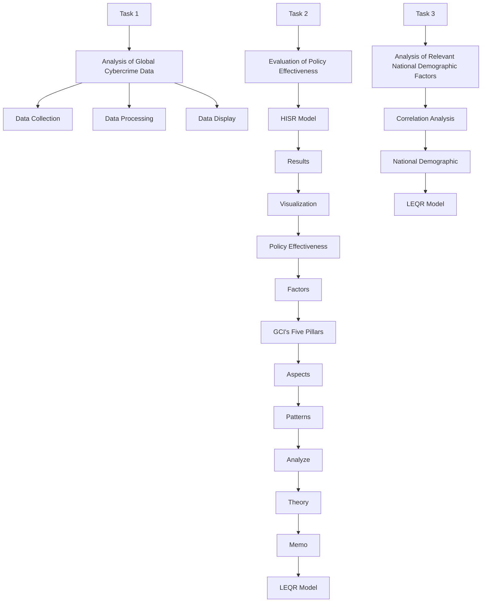
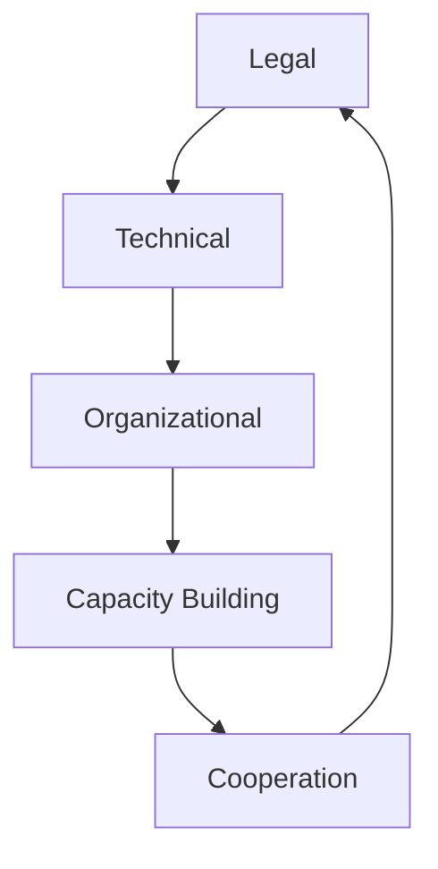
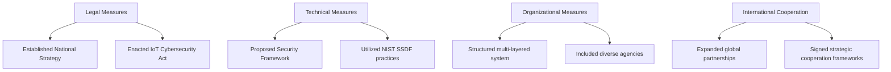

# The Global Cybersecurity Chessboard: Decoding Crime Distribution and Policy Effectiveness

Summary

With the acceleration of digital transformation, cybersecurity has become a critical area for national security, economic development, and social stability. This study aims to understand the global distribution of cybercrime, further assess the effectiveness of cybersecurity policies, and explore the key factors influencing the global distribution of cybercrime. By analyzing open data from the VERIS Community Database (VCDB), we employed correlation analysis, the Hierarchical Interaction Scoring Regression Model (HISR), and the Log-Enhanced Quadratic Regression Model (LEQR) to quantify the changes in cybercrime distribution before and after policy implementation, and evaluate the net effect of these policies. The results indicate that improvements in technological measures and organizational measures have a significant impact on the effectiveness of cybersecurity policies, while the reporting rate and disruption rate are key indicators for evaluating policy effectiveness.

Firstly, we conducted in-depth analysis and data visualization using open data from VCDB. In terms of geographical visualization, the study created a heatmap to display the global distribution of cybercrime events, and further analyzed key cybercrime indicators, such as the number of targets and success rates. The findings reveal a significant imbalance in the global distribution of cybercrime.

Subsequently, we developed a cybersecurity evaluation framework encompassing five pillars: legal measures, technical measures, organizational measures, capacity building, and international cooperation, to comprehensively assess the effectiveness of cybersecurity policies across countries. The results showed that the United States scored the highest, with its policies performing excellently in improving the reporting rate (0.32). In contrast, China scored the lowest with a composite score of -0.78. We then classified the policies based on the five pillars of the Global Cybersecurity Index (GCI) and found that improvements in technical capabilities and efficient organizational coordination are key factors for policy success.

Additionally, we explored the correlation between national demographic data, such as GDP, population size, and ICT development level, and cybercrime data, analyzing their influence on the number of cybercrime targets. The results showed that GDP, population size, and ICT development level are positively correlated with the distribution of cybercrime, consistent with the global crime distribution pattern.

Finally, we summarize the strengths and weaknesses of the models and methods used, offering appropriate policy recommendations. The study provides new perspectives and methodologies for the formulation and evaluation of global cybersecurity policies, emphasizing the importance of technological and organizational measures in enhancing cybersecurity levels.

Keywords: Cybersecurity; Hierarchical Interaction Scoring Regression Model; Log-Enhanced Quadratic Regression Model

## Contents

## 1 Introduction 3

1.1 Background of the Issue 3  
1.2 Restatement of the Problem 3  
1.3 Our Work . . 4

## 2 Assumptions and Justifications 4

## 3 Interpretation of Symbols 5

## 4 Global Cybercrime Data Analysis 5

4.1 Data Collection . . 5  
4.2 Data Processing . . . 5  
4.3 Data Analysis and Visualization 6

4.3.1 Global Cybercrime Distribution Heatmap . . 6  
4.3.2 Global Cybercrime Situation Analysis . . . 7  
4.3.3 Analysis of Target Count, Success Rate, Defeat Rate, Report Rate, and Prosecution Rate . . . 8  
4.3.4 Pattern Analysis 9

## 5 National Security Policies and Global Cybercrime Distribution 10

5.1 Preliminary Analysis . . 10

5.1.1 Data Visualization . . 10  
5.1.2 Influencing Factors Analysis . . 11

5.2 Model1: Hierarchical Interaction Scoring Regression Model(HISR) . . . 13

5.2.1 Identifying Experimental and Control Group . . . 13  
5.2.2 Verifying the Parallel Trend Assumption 13  
5.2.3 Model Process . 14  
5.2.4 Comprehensive Scoring Analysis of Policy Effectiveness . . . . 15

5.3 Pattern Analysis . . . 16

5.3.1 Analysis of GCI’s Five Pillars . . . 16  
5.3.2 Analysis of National Policy Content . . 17

5.4 Theoretical Summary . . 18

## 6 National Demographics and Cybercrime Distribution 19

6.1 Correlation Analysis 19  
6.2 Model2: Log-Enhanced Quadratic Regression Model(LEQR) . . . . 20  
6.3 Results Interpretation . . 21

## 7 Model Evaluation 22

7.1 Merits . . 22  
7.2 Limitations . 22

## 8 Conclusions 23

## 9 Memorandum 23

## References 25

## 1 Introduction

## 1.1 Background of the Issue

With the advancement of the digital wave, cyberspace has become a critical domain for global economy, society, and national security. [1] Information technology has significantly fostered economic development, enabling people to conduct transactions and make purchases online, beyond traditional in-person and face-to-face exchanges. For instance, platforms such as Tmall, Taobao, and JD.com in China, and Amazon in the United States, provide sellers with a marketplace and offer buyers a more diverse range of options. [2] However, we are also facing an unprecedented situation in a century the severe global security landscape poses serious threats to countries worldwide. Due to conflicts over political and jurisdictional issues between different countries and the protection of corporate reputation by various enterprises, combating cybercrime is challenging. Different countries have adopted distinct national cybersecurity policies and measures aimed at combating cybercrime. The International Telecommunication Union (ITU), an agency of the United Nations, leads global cooperation and sets standards for cybersecurity assessments, aiding in measuring global cyber information security.

venn diagram

| Category | Value |
| -------- | ----- |
| Organized Crime | 100% |
| Illlicit Trafficking | 80% |
| Cybercrime | 90% |
| Financial Crime/Corruption | 70% |
| TERRORISM | 60% |

Figure 1: 2022 INTERPOL Global Crime Trend Summary Report

## 1.2 Restatement of the Problem

By summarizing the findings of existing research, our team aims to address the following problems:

• Investigate the global cybercrime distribution and identify which countries are the primary targets of such activities.  
• Analyze the success rate, thwart rate, reporting rate, and prosecution rate of cybercrimes across different countries to uncover potential patterns or trends.  
• Based on the distribution data of cybercrime, collect and analyze national security policies and construct models to evaluate the effectiveness of these policies.  
• Examine the correlation between national demographic data (e.g., GDP, education levels) and the distribution of cybercrime, thereby further advancing theoretical research.  
• Provide recommendations for improving national policy-making and cybersecurity development based on the findings of existing studies.

## 1.3 Our Work

flowchart

Figure 2: Flow Chart of Our Work

## 2 Assumptions and Justifications

Assumption 1: Cybercrime statistics are consistent and comparable.

! Justifications: The data sources (e.g., GCI, VERIS database) are sufficiently representative, and differences in national statistics have a negligible impact on the overall analysis.

Assumption 2: The economic motives behind cybercrime are consistent with social and cultural factors

! Justifications: The fundamental motives of global cybercrime (e.g., economic gain, political objectives) are consistent and can be explained using similar economic and social variables.

Assumption 3: The influence of demographic variables is stable in the short term.

! Justifications: Variables such as internet penetration rate, education level, and economic conditions remain stable during the study period, with short-term changes having a limited impact on the results.

## 3 Interpretation of Symbols

Some important mathematical notations used in this paper are listed in Table 1.

Table 1: Symbols and Their Interpretations

<table><tr><td>Symbols</td><td>Interpretation</td></tr><tr><td>GCI</td><td>Global Cybersecurity Index</td></tr><tr><td>DID</td><td>Difference-in-differences</td></tr><tr><td>Policy_i</td><td>Whether a country has implemented the policy (0/1)</td></tr><tr><td>Post_t</td><td>Time period after the policy implementation (0/1)</td></tr><tr><td>Policy_i × Post_t</td><td>Interaction effect of policy implementation</td></tr><tr><td> $\beta_3$ </td><td>Net effect of the policy</td></tr><tr><td> $\epsilon_{it}$ </td><td>Error term</td></tr><tr><td>X1</td><td>Log_ICT_Goods_Export, the logarithmically transformed ICT export rate</td></tr><tr><td>X2</td><td>Log_Population, the logarithmically transformed population data</td></tr><tr><td>X3</td><td>Log_GDP, the logarithmically transformed GDP data</td></tr><tr><td> $\alpha_0$ </td><td>Intercept in the baseline linear regression model</td></tr><tr><td> $\alpha_i$ </td><td>Coefficients in the baseline linear regression model, where i = 1, 2, 3</td></tr></table>

## 4 Global Cybercrime Data Analysis

## 4.1 Data Collection

This study utilized the VERIS Community Database (VCDB) from the VERIS project, an open and free repository of security incident data. The database provides standardized data on publicly reported security incidents in the VERIS format, ensuring consistency and uniformity in data collection. By adhering to the VERIS standardized description of security incidents [3] , the use of VCDB provided a reliable data source for the research. By accessing the open data from VCDB, this study extracted event information relevant to the research topic and conducted an in-depth analysis.

## 4.2 Data Processing

After obtaining the VCDB database, we developed Python code to extract and process the JSON-formatted data. Based on research requirements, the data was organized across dimensions such as year, victimized countries, crime types, and outcomes. Records with missing or unknown values were excluded, and the cleaned data was analyzed and visualized.

By extracting information from the victim.country column, we aggregated countrylevel data on cybercrime incidents and ranked the results in descending order by total incidents, initially identifying countries with high cybercrime rates. Additionally, the countrycode package was used to convert country codes to full names and correct special cases (e.g., changing "United States" to "USA") to enhance data readability. To optimize analysis and visualization, the incident counts were logarithmically transformed.

Table 2: Major Databases and Their Sources

<table><tr><td>Database</td><td>Website of Data Source</td></tr><tr><td>ITU</td><td>https://www.itu.int/epublications/publication/global-cybersecurity-index-2024</td></tr><tr><td>VCDB</td><td>https://verisframework.org/vcdb.html</td></tr><tr><td>World Bank</td><td>https://data.worldbank.org</td></tr></table>

Using tools such as dplyr, countrycode, and ggplot2, we completed the entire process from data cleaning to visualization, ensuring data accuracy and consistency [4] [5] . The final results provide valuable data support for the study of global cybercrime distribution and policy development.

## 4.3 Data Analysis and Visualization

## 4.3.1 Global Cybercrime Distribution Heatmap

world map chart

| Country       | Log(Number of Incidents) |
| ------------- | ------------------------ |
| USA           | 8                        |
| Canada        | 6                        |
| UK            | 5                        |
| Germany       | 4                        |
| France        | 3                        |
| Italy         | 2                        |
| Spain         | 1                        |
| Brazil        | 0                        |
| Argentina     | -1                       |
| Russia        | -2                       |
| China         | -3                       |
| India         | -4                       |
| Japan         | -5                       |
| South Africa  | -6                       |
| Australia     | -7                       |
| Mexico        | -8                       |
| Nigeria       | -9                       |
| Egypt         | -10                      |
| Saudi Arabia  | -11                      |
| Iran          | -12                      |
| Turkey        | -13                      |
| Vietnam       | -14                      |
| Thailand      | -15                      |
| Philippines   | -16                      |
| Indonesia     | -17                      |
| Malaysia      | -18                      |
| Singapore     | -19                      |
| Netherlands   | -20                      |
| Belgium       | -21                      |
| Austria       | -22                      |
| Poland        | -23                      |
| Czechia       | -24                      |
| Hungary       | -25                      |
| Romania       | -26                      |
| Bulgaria      | -27                      |
| Croatia       | -28                      |
| Slovenia      | -29                      |
| Bosnia and Herzegovina | -30                |
| Serbia        | -31                      |
| Montenegro    | -32                      |
| Albania       | -33                      |
| North Macedonia | -34                  |
| Kosovo        | -35                      |
| Cyprus        | -36                      |
| Malta         | -37                      |
| Estonia       | -38                      |
| Latvia        | -39                      |
| Lithuania     | -40                      |
| Iceland       | -41                      |
| Faroe Islands  | -42                      |
| Tuvalu         | -43                      |
| Grenada       | -44                      |
| Samoa         | -45                      |
| Kiribati      | -46                      |
| Marshall Islands | -47                    |
| Palau         | -48                      |
| Micronesia    | -49                      |
| Vanuatu       | -50                      |
| Samoa         | -51                      |
| Kiribati      | -52                      |
| Vanuatu       | -53                      |
| Samoa         | -54                      |
| Kiribati      | -55                      |
| Vanuatu       | -56                      |
| Samoa         | -57                      |
| Kiribati      | -58                      |
| Vanuatu       | -59                      |
| Samoa         | -60                      |
| Kiribati      | -61                      |
| Vanuatu       | -62                      |
| Samoa         | -63                      |
| Kiribati      | -64                      |
| Vanuatu       | -65                      |
| Samoa         | -66                      |
| Kiribati      | -67                      |
| Vanuatu       | -68                      |
| Samoa         | -69                      |
| Kiribati      | -70                      |
| Vanuatu       | -71                      |
| Samoa         | -72                      |
| Kiribati      | -73                      |
| Vanuatu       | -74                      |
| Samoa         | -75                      |
| Kiribati      | -76                      |
| Vanuatu       | -77                      |
| Samoa         | -78                      |
| Kiribati      | -79                      |
| Vanuatu       | -80                      |
| Samoa         | -81                      |
| Kiribati      | -82                      |
| Vanuatu       | -83                      |
| Samoa         | -84                      |
| Kiribati      | -85                      |
| Vanuatu       | -86                      |
| Samoa         | -87                      |
| Kiribati      | -88                      |
| Vanuatu       | -89                      |
| Samoa         | -90                      |
| Kiribati      | -91                      |
| Vanuatu       | -92                      |
| Samoa         | -93                      |
| Kiribati      | -94                      |
| Vanuatu       | -95                      |
| Samoa         | -96                      |
| Kiribati      | -97                      |
| Vanuatu       | -98                      |
| Samoa         | -99                      |
| Kiribati      | -100                     |
| Vanuatu       | -101                     |
| Samoa         | -102                     |
| Kiribati      | -103                     |
| Vanuatu       | -104                     |
| Samoa         | -105                     |
| Kiribati      | -106                     |
| Vanuatu       | -107                     |
| Samoa         | -108                     |
| Kiribati      | -109                     |
| Vanuatu       | -110                     |
| Samoa         | -111                     |
| Kiribati      | -112                     |
| Vanuatu       | -113                     |
| Samoa         | -114                     |
| Kiribati      | -115                     |
| Vanuatu       | -116                     |
| Samoa         | -117                     |
| Kiribati      | -118                     |
| Vanuatu       | -119                     |
| Samoa         | -120                     |
| Kiribati      | -121                     |
| Vanuatu       | -122                     |
| Samoa         | -123                     |
| Kiribati      | -124                     |
| Vanuatu       | -125                     |
| Samoa         | -126                     |
| Kiribati      | -127                     |
| Vanuatu       | -128                     |
| Samoa         | -129                     |
| Kiribati      | -130                     |
| Vanuatu       | -131                     |
| Samoa         | -132                     |
| Kiribati      | -133                     |
| Vanuatu       | -134                     |
| Samoa         | -135                     |
| Kiribati      | -136                     |
| Vanuatu       | -137                     |
| Samoa         | -138                     |
| Kiribati      | -139                     |
| Vanuatu       | -140                     |
| Samoa         | -141                     |
| Kiribati      | -142                     |
| Vanuatu       | -143                     |
| Samoa         | -144                     |
| Kiribati      | -145                     |
| Vanuatu       | -146                     |
| Samoa         | -147                     |
| Kiribati      | -148                     |
| Vanuatu       | -149                     |
| Samoa         | -150                     |
| Kiribati      | -151                     |
| Vanuatu       | -152                     |
| Samoa         | -153                     |
| Kiribati      | -154                     |
| Vanuatu       | -155                     |
| Samoa         | -156                     |
| Kiribati      | -157                     |
| Vanuatu       | -158                     |
| Samoa         | -159                     |
| Kiribati      | -160                     |
| Vanuatu       | -161                     |
| Samoa         | -162                     |
| Kiribati      | -163                     |
| Vanuatu       | -164                     |
| Samoa         | -165                     |
| Kiribati      | -166                     |
| Vanuatu       | -167                     |
| Samoa         | -168                     |
| Kiribati      | -169                     |
| Vanuatu       | -170                     |
| Samoa         | -171                     |
| Kiribati      | -172                     |
| Vanuatu       | -173                     |
| Samoa         | -174                     |
| Kiribati      | -175                     |
| Vanuatu       | -176                     |
| Samoa         | -177                     |
| Kiribati      | -178                     |
| Vanuatu       | -179                     |
| Samoa         | -180                     |
| Kiribati      | -181                     |
| Vanuatu       | -182                     |
| Samoa         | -183                     |
| Kiribati      | -184                     |
| Vanuatu       | -185                     |
| Samoa         | -186                     |
| Kiribati      | -187                     |
| Vanuatu       | -188                     |
| Samoa         | -189                     |
| Kiribati      | -190                     |
| Vanuatu       | -191                    |
| Samoa         | -192                     |
| Kiribati      | -193                    |
| Vanuatu       | -194                    |
| Samoa         | -195                     |
| Kiribati      | -196                    |
| Vanuatu       | -197                    |
| Samoa         | -198                     |
| Kiribati      | -199                    |
| Vanuatu       | -200                     |
|
| Samoa         | 0                        |
|
| Yemen         | 0                        |

The data is extracted from the image. The 'Latitude' column contains the longitude and latitude coordinates for each country. The 'Number of Incidents' column contains the log-transformed number of incidents in each country's data point. There are no labels for the data series. The 'Longitude' column is not used in the plot. The 'Latitude' column is labeled as 'N', so it is not included in the plot area.

Figure 3: Global Cybercrime Distribution

During the geographic visualization phase, we loaded global map data and matched it with the processed country data, achieving a one-to-one correspondence by aligning regional fields with the corrected country names. The visualization employed a color gradient to represent the number of cybercrime incidents in each country, transitioning from light blue to deep red to illustrate the distribution trend from low to high. This heatmap visualization effectively reflected the global distribution patterns and characteristics of cybercrime.

The resulting global cybercrime distribution heatmap revealed that North America and Europe are high-incidence regions for cybercrime. Countries such as the United States, Canada, the United Kingdom, Germany, and Ireland exhibit a significantly higher frequency of cybercrime incidents. In contrast, South America and African countries report relatively fewer cybercrime cases. Among Asian countries, cybercrime activity varies significantly, with countries like China, Japan, and South Korea showing high levels of activity, while nations such as Indonesia and the Philippines experience much lower levels.

## 4.3.2 Global Cybercrime Situation Analysis

text_image

vectorDesktop sharing software
vector.Unknown
variety.HTTP response smuggling
variety.Format string attack
variety.Buffer overflow
vector.Physical access
variety.Abuse of functionality
result Offline cracking
variety.Cryptanalysis
result.Persist
vector.3rd party desktop
variety.Hijack
variety.XML injection
variety.XML external entities
variety.Session prediction
variety.Lateral deployment
variety.DBAP injection
variety.AitM
variety.IPAR project
variety.DBAP proxy about
variety wear array about
variety offer performance
variety.Integer overflows
variety.Forced browsing
variety.OS commanding
variety.XML entity expansion
variety.IPAR force
variety.XML attribute blow-up
variety.Exploit vuln
variety.Obtfulvuln
variety.Obtfulvuln
variety.RFI
variety.Unknow
variety.Obtfulvuln
variety.XML entity expansion
vector.VPN
variety.XML attribute blow-up
variety.Exploit vuln
variety.XML entity expansion
vector.Obtfulvuln
variety.IPAR force
variety.Exploit vuln
variety.XML entity expansion
vector.Obtfulvuln
variety.IPAR force
variety.Exploit vuln
variety.XML entity expansion
vector.Obtfulvuln
variety.IPAR force
variety.Exploit vuln
variety.XML entity expansion

Figure 4: Hacking word cloud map

Based on the data from the VCDB database, we first extracted several fields related to cyberattacks (e.g., attack outcomes, attack methods) and generated a word cloud based on the frequency of these fields. The font size visually represented the relative frequency of each term, providing an intuitive overview of the primary categories and their occurrence rates in cybercrime, thereby laying the foundation for further research.

pie chart

| Category | Count |
| :--- | :--- |
| Action Hacking Vector Backdoor | 2062 |
| Action Hacking Vector Command shell | 1025 |
| Action Hacking Vector Desktop sharing | 1025 |
| Action Hacking Vector Other | 1025 |
| Action Hacking Vector Partner | 1025 |
| Action Hacking Vector Physical access | 1025 |
| Action Hacking Vector Unknown | 1025 |
| Action Hacking Vector VPI | 1025 |
| Action Hacking Vector Web application | 1025 |
| Variety Type | 1778 |
| Action Hacking variety Abuse of functionality | 1778 |
| Action Hacking variety Backdoor | 1778 |
| Action Hacking variety Brute force | 1778 |
| Action Hacking variety DoSs | 1778 |
| Action Hacking variety Explicit vush | 1778 |
| Action Hacking variety Forced browsing | 1778 |
| Action Hacking variety Other | 1778 |
| Action Hacking variety SCU | 1778 |
| Action Hacking variety Unknown | 1778 |
| Action Hacking variety Use of stolen credible | 1778 |
| Result Type | 325 |
| Action Hacking result Deploy payload | 1117 |
| Action Hacking result Elevate | 1117 |
| Action Hacking result Extegrate | 1117 |
| Action Hacking result Inflate | 1117 |
| Action Hacking result Lateral movement | 1117 |
| Action Hacking result Other | 1117 |
| Action Hacking result Persist | 1117 |
| Action Hacking result Unknown | 1117 |

Figure 5: Classified statistics on cybercrime

The analysis revealed that cyberattack data is categorized into three main groups: Vector, Variety, and Result, all of which exhibit significant concentration. In the Vector category, Web application emerged as the most common type, occupying the largest proportion, followed by Backdoor and Unknown. In contrast, Command shell and Desktop sharing software had relatively fewer incidents. Within the Variety category, Use of stolen creds and Unknown accounted for the majority of incidents, while Backdoor, Exploit vuln, and Brute force were also prominent, indicating that attackers tend to exploit stolen credentials or system vulnerabilities for intrusions. In the Result category, Exfiltrate was identified as the most frequent goal, followed by Elevate and Deploy payload, while Lateral movement and Infiltrate occurred less frequently.

This distribution suggests that attackers typically focus resources on efficient attack methods and well-defined targets. Therefore, cybersecurity defenses should prioritize strengthening protections against Web application attacks and Exfiltrate data theft.

## 4.3.3 Analysis of Target Count, Success Rate, Defeat Rate, Report Rate, and Prosecution Rate

By analyzing the VERIS database and referencing its glossary definitions, we extracted key indicators such as target count, success rate, thwart rate, reporting rate, and prosecution rate to assess the distribution characteristics and trends of cybercrime.

• Target Count: Reflects the number of cybercrime incidents occurring in each country annually, calculated by grouping data based on the timeline.incident. year and victim.country fields.  
• Success Rate and Thwart Rate: Represent the proportions of incidents resulting in and not resulting in data breaches, respectively. These are calculated based on the attribute.confidentiality.data\_disclosure field (True for success, False for thwart).  
• Reporting Rate: Evaluates the proportion of incidents that were discovered and recorded, identified by filtering the discovery\_method field.  
• Prosecution Rate: Focuses on whether legal actions were taken, marked by keywords (e.g., “prosecuted” or “charged”) in the summary and reference fields.

Finally, these indicators were aggregated and merged into a unified dataset, enabling intuitive visualization and in-depth analysis. This process effectively reveals the temporal and spatial characteristics of cybercrime, providing valuable data support for the development of targeted cybersecurity strategies.

<table><tr><td>Country</td><td>Incidents</td><td>Success_Rate</td><td>Failure_Rate</td><td>Reported_Rate</td><td>Prosecution_Rate</td></tr><tr><td>United States</td><td>7225</td><td>0.769</td><td>0.297</td><td>0.013</td><td>0.097</td></tr><tr><td>United Kingdom</td><td>574</td><td>0.738</td><td>0.295</td><td>0.007</td><td>0.122</td></tr><tr><td>Canada</td><td>369</td><td>0.752</td><td>0.277</td><td>0.013</td><td>0.067</td></tr><tr><td>Australia</td><td>161</td><td>0.73</td><td>0.27</td><td>0.013</td><td>0.056</td></tr><tr><td>India</td><td>138</td><td>0.726</td><td>0.274</td><td>0.007</td><td>0.05</td></tr><tr><td>New Zealand</td><td>103</td><td>0.725</td><td>0.275</td><td>0.007</td><td>0.057</td></tr><tr><td>China</td><td>65</td><td>0.737</td><td>0.287</td><td>0.007</td><td>0.044</td></tr><tr><td>Japan</td><td>62</td><td>0.711</td><td>0.289</td><td>0.007</td><td>0.058</td></tr><tr><td>Ireland</td><td>60</td><td>0.672</td><td>0.328</td><td>0.004</td><td>0.061</td></tr><tr><td>Germany</td><td>57</td><td>0.682</td><td>0.318</td><td>0.008</td><td>0.042</td></tr><tr><td>Israel</td><td>49</td><td>0.749</td><td>0.276</td><td>0.014</td><td>0.051</td></tr><tr><td>Korea</td><td>49</td><td>0.664</td><td>0.336</td><td>0.004</td><td>0.055</td></tr><tr><td>France</td><td>32</td><td>0.722</td><td>0.278</td><td>0.008</td><td>0.041</td></tr></table>

Figure 6: Presentation of five types of cybercrime indicators by country

This chart illustrates the performance of different countries across various cybercrime related indicators, including target count, success rate, thwart rate, reporting rate, and prosecution rate. The data shows that the United States leads significantly in the number of cybercrime incidents (7,225 cases), with a high success rate (0.769). However, its reporting rate (0.013) and prosecution rate (0.097) are relatively low, highlighting the issue of cybercrime concealment. The United Kingdom stands out in prosecution rate (0.122), while Canada demonstrates strong performance with a relatively high success rate (0.752). Notably, although South Korea has fewer incidents (49 cases), it exhibits a higher thwart rate (0.336), which may reflect its advantage in cybersecurity defense capabilities. Overall, most countries show extremely low reporting rates (ranging from 0.007 to 0.014), which may be influenced by national policies or cultural factors, as well as the significant impact of organizational behavior. Many institutions, such as investment firms, tend to conceal hacking incidents and opt to pay ransoms to prevent customers or potential clients from becoming aware of their security vulnerabilities. This phenomenon further reduces the reporting rate and complicates the issue of cybercrime. Additionally, the differences in prosecution rates reveal disparities in legal frameworks and law enforcement capabilities across countries. For example, the United Kingdom and the United States have relatively high prosecution rates, while France and Germany perform comparatively lower. To effectively address cybercrime, countries should enhance incident disclosure rates and strengthen international collaboration. Particular focus should be placed on countries with high incident counts, such as the United States and the United Kingdom, to optimize cybersecurity policies and response strategies.

## 4.3.4 Pattern Analysis

bar chart

| Country        | Number of Incidents |
| -------------- | ------------------- |
| Ireland        | 29                  |
| Germany        | 30                  |
| Japan          | 30                  |
| China          | 41                  |
| New Zealand    | 61                  |
| India          | 95                  |
| Australia      | 116                 |
| Canada         | 232                 |
| United Kingdom | 342                 |
| United States  | 3728                |

Figure 7: The top ten countries by cybercrime count

By statistically analyzing the number of cybercrimes in various countries over the past decade and visualizing the top 10 countries with the highest incident counts in a bar chart, it becomes clear that the United States, United Kingdom, Canada, Australia, India, New Zealand, China, Japan, Germany, and Ireland are high-priority targets for cybercrime.

From the perspective of national development levels, the global cybercrime distribution exhibits significant disparities. Developed countries report noticeably higher numbers of cybercrime incidents. For instance, countries such as the United States (7,224), United Kingdom (574), and Canada (369) are represented in dark red on the heatmap. These nations have advanced economies, well-developed internet infrastructures, and high coverage rates, providing broader attack surfaces for cybercriminals. Additionally, their heavy reliance on digital technologies further increases their exposure, making them prime targets for cybercrime.

Additionally, small-to-medium-sized economies such as New Zealand (103) and Ireland (60) report relatively high numbers of cybercrime incidents, likely reflecting their reliance on internet-based economies and digital technologies, which increases their vulnerability to cybercrime.

In contrast, emerging economies such as China (65) and India (138) report significantly fewer cybercrime incidents than developed nations, with no clear upward trend observed in the data. This indicates that although increasing internet penetration and globalization have created more opportunities for cybercrime, the number of incidents in emerging economies remains below expectations based on their development levels. Meanwhile, in poorer regions such as much of Africa, the number of cybercrime incidents is extremely low, with most countries reporting fewer than five cases, as indicated by light blue areas on the heatmap. This is likely due to low internet penetration rates, economies largely centered around physical industries, and limited technological resources.

From a population size perspective, China and India, despite their large populations, report far fewer cybercrime incidents compared to the United States. This suggests that the distribution of cybercrime is more closely tied to economic development and digitalization levels rather than sheer population size.

Overall, the data reveals a pronounced unevenness in the global distribution of cybercrime incidents. Cybercrime is more concentrated in economically developed regions with advanced internet infrastructures. However, this distribution pattern is not solely determined by factors such as national development level or internet penetration rate. Demographic factors, including GDP, internet usage rates, and education levels, likely play a critical role in shaping the distribution of cybercrime.

## 5 National Security Policies and Global Cybercrime Distribution

## 5.1 Preliminary Analysis

## 5.1.1 Data Visualization

bar chart

Comparison of Target Count Before and After Policy Implementation (Log Scale)
| Nations | Before Policy | After Policy |
| :--- | :--- | :--- |
| Canada | 35 | 18 |
| Australia | 6 | 0 |
| France | 2 | 7 |
| United States | 800 | 600 |
| China | 6 | 4 |
| Korea | 0 | 5 |

Figure 8: Comparison of Target Count Before and After Policy implementation

This bar chart, using a logarithmic scale, illustrates the changes in the target count of different countries before and after policy implementation, represented by blue and orange bars, respectively. The use of a logarithmic scale effectively reduces data disparities, making the changes across countries more intuitive.

From the chart, it is evident that the United States has a significantly higher target count compared to other countries. The target count decreased from 706 before the policy implementation to 543 afterward. Although it remains at a high level, a downward trend is observed. Similarly, Canada experienced a notable reduction in target count, from 33 to 16, indicating that the policy may have contributed to the decrease in targets. Australia and China also showed declines in target counts after policy implementation, with Australia’s count dropping from 6 to 1 and China’s from 6 to 3, demonstrating a substantial reduction.

In contrast, France and Korea displayed different trends. France’s target count increased from 2 before the policy implementation to 7 afterward, suggesting a rise in targets post-policy. Koreas target count similarly grew, from 1 to 4, reflecting a comparable upward trend. These anomalies may be associated with the specific context of policy implementation or other external factors.

Overall, this chart clearly presents the changes in target counts across countries before and after policy implementation, highlighting the varied effects of the policy among different nations. It provides valuable data support for further analysis of the impact and underlying mechanisms of policy implementation.

## 5.1.2 Influencing Factors Analysis

line chart

|   Year | Country   |   Incident Count |
|-------:|:----------|-----------------:|
|   2014 | CA        |               39 |
|   2014 | AU        |               17 |
|   2014 | FR        |                3 |
|   2014 | JP        |                4 |
|   2014 | CN        |                7 |
|   2015 | CA        |               47 |
|   2015 | AU        |               20 |
|   2015 | FR        |                2 |
|   2015 | JP        |                5 |
|   2015 | CN        |                5 |
|   2016 | CA        |               64 |
|   2016 | AU        |               26 |
|   2016 | FR        |                2 |
|   2016 | JP        |                7 |
|   2016 | CN        |                7 |
|   2017 | CA        |               33 |
|   2017 | AU        |               21 |
|   2017 | FR        |                2 |
|   2017 | JP        |                4 |
|   2017 | CN        |                2 |
|   2018 | CA        |               13 |
|   2018 | AU        |               13 |
|   2018 | FR        |                1 |
|   2018 | JP        |                5 |
|   2018 | CN        |                6 |
|   2019 | CA        |               16 |
|   2019 | AU        |                5 |
|   2019 | FR        |                2 |
|   2019 | JP        |                6 |
|   2019 | CN        |                6 |
|   2020 | CA        |               15 |
|   2020 | AU        |               11 |
|   2020 | FR        |                7 |
|   2020 | JP        |                3 |
|   2020 | CN        |                3 |
|   2021 | CA        |                5 |
|   2021 | AU        |                4 |
|   2021 | FR        |                4 |
|   2021 | JP        |                1 |
|   2021 | CN        |                4 |
|   2022 | CA        |                4 |
|   2022 | AU        |                4 |
|   2022 | FR        |                3 |
|   2022 | JP        |                1 |
|   2022 | CN        |                1 |
|   2023 | CA        |                3 |
|   2023 | AU        |                3 |
|   2023 | FR        |                3 |
|   2023 | JP        |                3 |
|   2023 | CN        |                3 |
|   2024 | CA        |                1 |
|   2024 | AU        |                1 |
|   2024 | FR        |                1 |
|   2024 | JP        |                1 |
|   2024 | CN        |                1 |
|   2014 | AU        |               nan |
|   2014 | FR        |               nan |
|   2014 | JP        |               nan |
|   2014 | CN        |               nan |
|   2014 | KR        |               nan |
|   2015 | AU        |               nan |
|   2015 | FR        |               nan |
|   2015 | JP        |               nan |
|   2015 | CN        |               nan |
|   2015 | KR        |               nan |
|   2016 | AU        |               nan |
|   2016 | FR        |               nan |
|   2016 | JP        |               nan |
|   2016 | CN        |               nan |
|   2016 | KR        |               nan |
The data is already in CSV format. It includes the years as rows for the years. The actual values will vary due to the use of random number generation. There is no additional data series in this code. |

Figure 9: Incident Count Over Time Map

This line chart illustrates the temporal trends in target counts across different countries (CA, AU, FR, JP, CN, KR) from 2014 to 2024. Significant variations and fluctuations in target counts are observed among the countries over time.

Canada (CA) exhibited the most dramatic changes, peaking in 2016 with a target count exceeding 60, followed by a rapid decline until 2020, after which it stabilized. This pattern may reflect the impact of significant cybersecurity incidents or policy interventions during specific years. Australia (AU) showed a slow upward trend between 2015 and 2017, followed by a slight decline. However, its overall fluctuations remained relatively small and stable. In contrast, France (FR), Japan (JP), China (CN), and Korea (KR) maintained consistently lower target counts throughout the period, with minimal fluctuations, reflecting a relatively steady trend.

From a temporal perspective, between 2014 and 2016, target counts in Canada and Australia increased, with Canada’s sharp rise being particularly notable during this period. Between 2017 and 2020, Canada’s target count experienced a steep decline, while the target counts in other countries remained relatively stable. Post-2020, target counts across all countries generally stabilized, with no significant peaks or fluctuations observed.

These trends suggest that changes in target counts across countries may be influenced by the implementation of specific policies. To explore the impact of national cybersecurity policies and their timing on the distribution of cybercrime targets, a multilevel linear regression model was implemented using MATLAB. The study’s dataset covers multiple countries and includes key variables such as policy implementation status (Policy\_i), whether the country was in the post-implementation phase (Post\_t), and the interaction term (Policy\_i × Post\_t).

First, datasets for different countries were constructed and cleaned, then gradually merged into a complete analytical sample. In the regression analysis, the model treated countries as a random effect to control for potential heterogeneity across countries. At the same time, the main effects of policy and time, along with their interaction term, were included as fixed effects to quantify the combined impact of these factors on the target count of cybercrime. By fitting a multi-level linear model the coefficients (Coef.), significance levels (p-value), and standard errors (SE) were obtained.

$$
Y _ {i j} = \beta_ {0} + \beta_ {1} \mathrm{Policy} _ {i} + \beta_ {2} \mathrm{Post} _ {t} + \beta_ {3} (\mathrm{Policy} _ {i} \times \mathrm{Post} _ {t}) + u _ {j} + \epsilon_ {i j}
$$

The study revealed the independent effects of policy implementation and time phases on the target count, as well as the reinforcing effects of their interaction. The model results provide data-driven evidence for evaluating policy effectiveness while ensuring robustness by controlling for cross-country differences.

Table 3: Regression Results

<table><tr><td>Variable</td><td>Coef.</td><td>SE</td><td>pValue</td></tr><tr><td>Policy_i</td><td>5.225</td><td>0.5</td><td>0.036</td></tr><tr><td>Post_t</td><td>-3.4</td><td>0.866</td><td>0.038</td></tr><tr><td>Policy_i × Post_t</td><td>4.375</td><td>1</td><td>0.04</td></tr></table>

The results indicate the following:

• The main effect coefficient for the policy variable (Policy\_i) is 5.225, with a standard error of 0.5 and a p-value of 0.036, which is less than the significance level of 0.05. This demonstrates that the independent effect of the policy is statistically significant. This means that, without considering the time factor, countries that implemented the policy had an average of 5.225 more targets compared to countries that did not implement the policy. Additionally, the low standard error indicates that the model’s estimate of the policy’s main effect is robust.  
• The main effect coefficient for the time variable (Post\_t) is 3.4, with a standard error of 0.866 and a p-value of 0.038, which is also less than the significance level of 0.05. This suggests that the independent effect of time is statistically significant as well. It indicates that during the post-policy implementation phase, the average target count was 3.4 units lower than during the pre-policy phase. Although the standard error is slightly higher than that of the policy variable, the overall estimate of the time’s main effect remains relatively robust.  
• The interaction effect (Policy\_i Post\_t) coefficient is 4.375, with a standard error of 1.0 and a p-value of 0.02, which is below the 0.05 significance level. This indicates that the interaction effect between policy and time is significant. The positive coefficient for the interaction effect implies that in countries with policy implementation during the post-policy phase, the average target count increased by 4.375 units. However, the relatively high standard error for the interaction term suggests some uncertainty in its estimate, which may be due to a small sample size or data characteristics.

In summary, the model shows that both the independent effects of policy and time have a significant impact on the target count, while the interaction effect between policy and time further amplifies this impact. Particularly during the post-policy phase, the changes in target counts are more pronounced. The p-values for all variables are below 0.05, indicating that the model’s fit is statistically significant, and the relatively low standard errors reflect good robustness of the estimates.

## 5.2 Model1: Hierarchical Interaction Scoring Regression Model(HISR)

## 5.2.1 Identifying Experimental and Control Group

This study employed the difference-in-differences (DID) model to evaluate the effectiveness of cybersecurity policy implementation, quantifying changes in target count, success rate, thwart rate, reporting rate, and prosecution rate over time relative to policy implementation. The model divided the study subjects into an experiment group and a control group for comparative analysis. The experiment group reflects the effects of policy implementation, while the control group provides a baseline for comparison, supporting the assessment of net effects.

The experiment group includes countries that have implemented cybersecurity policies, such as:

• United States: Known for its long-standing policies with significant impacts on target count and success rate.  
• China: Recently enhanced legal frameworks and technical cooperation.  
• Korea: Renowned for its rapid response capabilities and robust technical defenses.

The control group includes countries that have not implemented relevant policies, such as:

• New Zealand: Policies focused on traditional security areas.  
• Ireland: Fragmented measures with no cohesive framework.  
• Germany: No formal cybersecurity policies introduced.

To ensure comparability between the groups, key indicators such as economic level, internet penetration rate, and education level were considered. By comparing metrics like GDP, GDP per capita, and internet access rate, the study balanced the experiment group and control group, reducing the influence of confounding factors.

## 5.2.2 Verifying the Parallel Trend Assumption

In the difference-in-differences (DID) model, the parallel trend assumption is a critical prerequisite. This assumption requires that, prior to policy implementation, the trends in the indicators for the experiment group and the control group remain consistent. If the parallel trend assumption holds, it can be inferred that the differences between the experiment group and the control group before policy implementation are primarily due to time trends or other common factors, rather than the policy itself.

We first extracted the target count, success rate, thwart rate, reporting rate, and prosecution rate for the experiment group and the control group from the data, ensuring consistency in the time range and statistical standards between the two groups. Then, we plotted line charts showing the temporal trends of these indicators for both groups to examine the changes prior to policy implementation.

By plotting the temporal changes in cybercrime target counts for the experiment

group and the control group, the results showed the following:

line chart

| Year | Experiment Group | Control Group |
|------|------------------|---------------|
| 2017 | 30               | 5             |
| 2018 | 5                | 5             |
| 2019 | 5                | 5             |
| 2020 | 700              | 5             |
| 2021 | 5                | 5             |

Figure 10: Parallel Trend Verification

Before policy implementation, the trends in target counts for the experiment group and the control group were largely consistent. For instance, during 2017-2018, the year-over-year decline in target counts for the experiment group was similar in magnitude to that of the control group, indicating consistent trends between the two groups prior to policy implementation.

Therefore, the parallel trend assumption for the experiment group and the control group is satisfied, allowing the DID model to be applied to analyze the net effect of the policy.

## 5.2.3 Model Process

During the data analysis process, it is essential to ensure that the input data includes all necessary dependent variables (e.g., target count, success rate, thwart rate, reporting rate, and prosecution rate) as well as independent variables (Policy\_i, Post\_t, Policy\_i Post\_t). For each indicator (such as target count and success rate), separate regression models are established:

$$
Y _ {i t} = \beta_ {0} + \beta_ {1} \text { Policy } _ {i} + \beta_ {2} \text { Post } _ {t} + \beta_ {3} (\text { Policy } _ {i} \times \text { Post } _ {t}) + \epsilon_ {i t}
$$

By performing regression calculations in MATLAB, the $\beta _ { 3 }$ coefficient values corresponding to each indicator for each country can be obtained, providing data support for the detailed analysis of policy effects.

In the results analysis, the key coefficient $\beta _ { 3 }$ is used to evaluate the effectiveness of national policies on the distribution of cybercrime. If $\beta _ { 3 } > 0$ and is significant, it indicates that the policy has a positive effect on reducing the target count of cybercrime. Conversely, if $\beta _ { 3 } < 0$ or is not significant, it suggests that the policy has limited effectiveness or may even have negative impacts.

The meaning of $\beta _ { 3 }$ varies depending on the indicator and requires logical adjustments. For instance, the $\beta _ { 3 }$ of target count represents the net effect of the policy in reducing the target count, where a negative value is preferable. Similarly, the $\beta _ { 3 }$ of success rate reflects the policy’s impact on reducing the success rate, with negative values being more favorable. On the other hand, the $\beta _ { 3 }$ of thwart rate, reporting rate, and prosecution rate reflects the policy’s effectiveness in improving these rates, where positive values are preferred.

Additionally, due to the significant differences in value ranges and units among the indicators (e.g., reporting rate is typically much smaller than target count), all indicators need to be standardized to eliminate the impact of unit differences. Finally, different weights are assigned to each indicator (target count: 0.2, success rate: 0.3, thwart rate: 0.2, reporting rate: 0.2, prosecution rate: 0.1) to calculate a composite score. A higher composite score indicates that the country’s policy has a more significant overall effect in reducing target count and success rate, as well as improving thwart rate, reporting rate, and prosecution rate.

Table 4: Regression Coefficients for Various Cybercrime Indicators

<table><tr><td>Nation</td><td>Target Count</td><td>Success Rate</td><td>Defeat Rate</td><td>Report Rate</td><td>Prosecution Rate</td></tr><tr><td>Canada</td><td>-0.22</td><td>0.57</td><td>0.73</td><td>0.48</td><td>1.07</td></tr><tr><td>Australia</td><td>-0.42</td><td>0.77</td><td>0.73</td><td>-0.19</td><td>1.07</td></tr><tr><td>France</td><td>-0.58</td><td>-1.25</td><td>-1.36</td><td>0.77</td><td>1.34</td></tr><tr><td>United States</td><td>2.22</td><td>0.17</td><td>0.16</td><td>0.29</td><td>0.27</td></tr><tr><td>China</td><td>-0.45</td><td>-1.45</td><td>-1.36</td><td>0.77</td><td>-1.34</td></tr><tr><td>Korea</td><td>-0.55</td><td>1.18</td><td>1.11</td><td>-2.11</td><td>0.27</td></tr></table>

## 5.2.4 Comprehensive Scoring Analysis of Policy Effectiveness

Table 5: Scores for Various Nations

<table><tr><td>Nation</td><td>Canada</td><td>Australia</td><td>France</td><td>United States</td><td>China</td><td>Korea</td></tr><tr><td>Score</td><td>0.48</td><td>0.36</td><td>-0.74</td><td>0.61</td><td>-0.78</td><td>0.07</td></tr></table>

The United States ranks highest in the composite score, with a score of 0.61, demonstrating strong performance across multiple key indicators in its cybersecurity policies. Notably, the United States excels in the reporting rate (0.32), indicating its robust capacity and efficiency in data recording and crime transparency. The high reporting rate reflects a well-developed monitoring and recording system and suggests a high level of public trust in its policies. Additionally, the significant reduction in the target count highlights the effectiveness of its policies in mitigating cybercrime threats. This success is attributed to its long-term, comprehensive cybersecurity policies, which include technological leadership and strong organizational coordination. However, despite its leading composite score, the thwart rate shows no significant improvement, suggesting room for growth in its technical applications for defending against cybercrime attacks. Future efforts could focus on enhancing technical defenses and optimizing rapid response mechanisms to further improve policy outcomes.

In contrast, China scores the lowest in the composite ranking with a score of -0.78, indicating substantial deficiencies in its cybersecurity policies across multiple indicators. While China’s target count decreased from 6 to $^ { 3 , }$ reflecting significant progress in reducing cybercrime targets, its success rate increased from 0.73 to 0.87. This trend suggests that although the target count has declined, the efficiency of cybercrime execution has risen, potentially indicating inadequate technical defense capabilities. Furthermore, its performance in reporting rate and thwart rate is relatively average, indicating room for improvement in monitoring cybercrime records and enhancing enforcement efficiency. Overall, China’s policy design emphasizes reducing the target count but lacks systematic improvements in increasing defense efficiency and execution coordination.

The performance of cybersecurity policies across various indicators shows significant differences among countries. Analysis of the composite scores and individual indicators highlights the critical importance of reporting rate and thwart rate in assessing the effectiveness of cybersecurity policies. The reporting rate not only reflects a country’s ability to monitor and record cybercrime but also demonstrates public recognition of transparency and trust in its policies. Meanwhile, the thwart rate directly showcases a country’s technical capability and operational efficiency in defending against and interrupting cybercrime attacks. These two indicators are pivotal in evaluating the actual effectiveness of cybersecurity policies.

## 5.3 Pattern Analysis

## 5.3.1 Analysis of GCI’s Five Pillars

To further analyze the effectiveness of cybersecurity policies, we classified policies based on the five pillars proposed by the International Telecommunication Union (ITU) in the Global Cybersecurity Index (GCI): Legal Measures, Technical Measures, Organizational Measures, Capacity Building, and International Cooperation. Based on the scores for these pillars, countries were grouped into full-score and non-fullscore groups, and the average composite score for each group was calculated to assess the impact of different pillars on policy effectiveness. Specifically, within each pillar group, countries were further divided into subgroups, such as those with full scores and those with non-full scores in Legal Measures, to compare policy effectiveness within each subgroup. This grouping approach allows for an in-depth exploration of the contributions of different pillars to the composite score and reveals the strengths and weaknesses of policies across various dimensions.

flowchart

Figure 11: The five pillars of GCI

By comparing the mean scores of each pillar group, we can determine which pillars have a more significant impact on the overall effectiveness of cybersecurity policies. The final analysis results show that the average composite scores for Technical Measures and Organizational Measures are significantly higher than those of other pillars, indicating that these pillars play a critical role in enhancing policy effectiveness. Technical Measures likely provide countries with stronger defensive capabilities and threat response mechanisms, while the high scores in Organizational Measures may reflect significant advantages in policy coordination and management.

To present the results more intuitively, we used bar charts to visualize and compare the mean scores across different pillar groups, further confirming the important roles of technical and organizational measures in cybersecurity policies. This analysis not only highlights the relative importance of different policy dimensions but also provides a foundation for optimizing the design and implementation of future cybersecurity policies.

bar chart

Average Scores by GCI Pillars
| GCI Pillars | Mean Scores |
|---|---|
| Legal Measures | -0.08 |
| Technical Measures | 0.34 |
| Organizational Measures | 0.16 |
| Capacity Building | -0.32 |
| International Cooperation | -0.09 |

Figure 12: Averages Scores by GCI Pillars

## 5.3.2 Analysis of National Policy Content

In the legal domain, to address the increasingly severe threat of cybercrime, the United States enacted the ˘aNational Cybersecurity Strategy ˘ain 2021.In addition, the ˘aInternet of Things (IoT) Cybersecurity Improvement Act of 2020 ˘a[8] and other related legislation successfully leveraged market forces to rebalance cybersecurity responsibilities for IoT devices.

In the technical domain, the strategy aims to develop software development security standards, named the˘aSecure Harbor Framework, which will draw from best practices such as the˘aNational Institute of Standards and Technology (NIST) Secure Software Development Framework (SSDF). [9]

In the organizational domain, the U.S. cybersecurity governance structure includes three main levels: the President, policy enforcement agencies, and the private sector. Policy enforcement bodies consist of coordinating departments, government agencies, intelligence agencies, and military departments. [10] This structure enables the United States to clearly define roles and responsibilities across departments in maintaining cybersecurity.

In the international cooperation domain, the United States has actively engaged in cybersecurity collaboration with the Asia-Pacific region, focusing on areas such as sharing cyber intelligence, strengthening military cooperation in cyberspace, building a secure cybersecurity environment, and coordinating internet policies based on the principles of freedom and security. [11] On April 26, 2023, the U.S. and South Korea signed the ˘aStrategic Cybersecurity Cooperation Framework ˘a[12] , further expanding global cybersecurity cooperation. Canada has also deployed personnel in Washington for bilateral cooperation, and has developed the˘aCanada-U.S. Cybersecurity Action Plan. [13]

In contrast, regarding technology, China faces significant challenges, with its investment in information security representing only 2% of the total IT market investment, far below that of developed nations. Additionally, there are notable gaps in key technological areas.Regarding organization, Chinas State Council Emergency Office offers only formal coordination between departments, lacking a clear leadership system and efficient division of responsibilities. Furthermore, local cybersecurity emergency departments are disorganized, leading to diminished overall efficiency in emergency response.Regarding capability building, China faces three critical issues: a lack of cyber sovereignty, nearly total dependence on foreign-controlled network infrastructure, and insufficient mastery of core technologies. [14] Regarding international cooperation, China’s cybersecurity collaboration with ASEAN is constrained.As a result, there is currently no unified cybersecurity cooperation framework, and tangible cooperation outcomes remain limited. [15]

flowchart

Figure 13: U.S. Policy Measures in Response to Cybersecurity Challenges

## 5.4 Theoretical Summary

To analyze the impact of cybersecurity policies and their implementation timing on the distribution of cybercrime targets, multi-level linear regression and HISR models were employed. The multi-level linear regression model demonstrated that policies and time have both independent and interaction effects on target counts. To further evaluate the effectiveness of policy implementation, the DID model was applied. The regression results revealed that the United States had the most effective policies, while China had the least effective policies.

To identify effective policy models, policies were classified and analyzed using the five pillars of the Global Cybersecurity Index (GCI). The analysis indicated that advancements in technical capabilities and efficient organizational coordination are critical factors for policy success. Additionally, a comparison of policies in the United States and China showed that the United States excels in legal framework, technical infrastructure, organizational coordination, and international cooperation, resulting in significant policy outcomes. In contrast, China suffers from insufficient investment in information security, a lack of unified leadership, weak core technologies, and the absence of a robust cybersecurity cooperation framework.

Overall, the United States’ policies are effective and balanced, emphasizing technical capabilities and data transparency. Conversely, Chinas policies are ineffective, reflecting weak technical capacity, insufficient comprehensiveness in policy design, and inadequate enforcement capabilities. Moving forward, optimizing cybersecurity policies should focus on enhancing technical capacity, defense mechanisms, and judicial process coordination while strengthening international cooperation and technology sharing to collectively address global cybercrime threats.

## 6 National Demographics and Cybercrime Distribution

## 6.1 Correlation Analysis

Based on the above conclusions, we collected nine national demographic data points from the World Bank Data Platform, including internet usage rate, ICT product export value, total population, Gini index, GDP, GDP growth rate, gross national income, education rate, and education level. These datasets were then integrated with cybercrime data (Target Count) from the VCDB database. After cleaning and organizing the data, scatter plots were created to observe and analyze the data distribution, providing an initial assessment of the correlation between national demographic data and cybercrime data (Target Count).

  
Figure 14: Scatter plot of national demographic data distribution

Next, we applied Spearman’s correlation coefficient to perform pairwise correlation analysis on the data, generating a Spearman correlation coefficient matrix. The results were visualized in the form of a heatmap to intuitively present the outcomes of the correlation analysis.

From the Spearman correlation heatmap, it is evident that the target variable (Target Count) exhibits significant correlations with several key variables. Among them, the correlation with GDP is the highest, with a coefficient of 0.77, indicating that economic scale has a strong influence on cybercrime targets. The correlation with Population is 0.50, reflecting a moderate impact of population size on the distribution of cybercrime. The correlation with ICT Goods Export is 0.41, suggesting that the level of internet access may partially influence the distribution of cybercrime.

In contrast, variables such as the Gini Index, education rate, and others show weaker correlations, indicating that income inequality and education levels have a limited impact on the target variable. Overall, economic and population size emerge as significant factors associated with the distribution of cybercrime.

  
Figure 15: Spearman Correlation Heatmap

## 6.2 Model2: Log-Enhanced Quadratic Regression Model(LEQR)

Based on the above correlation analysis and the distribution characteristics analysis observed in the scatter plots, a multiple linear regression model was constructed to investigate the mechanisms through which GDP, ICT Goods Export, and Population influence the target variable, Target Count.

To reduce data volatility and enhance the linear stability of the model, logarithmic transformations were applied to the three independent variables. Additionally, missing values and outliers in the dataset were removed, and all independent variables were standardized to prevent differences in variable scales from affecting the interpretation of regression coefficients.

At the basic model stage, the following linear regression model was constructed:

$$
Y = \alpha_ {0} + \alpha_ {1} \cdot X _ {1} + \alpha_ {2} \cdot X _ {2} + \alpha_ {3} \cdot X _ {3}
$$

The model aims to capture the linear relationship between the target variable and the independent variables. Through model evaluation, metrics such as $R ^ { 2 } ,$ , adjusted $R ^ { 2 }$ , and the significance of regression coefficients (p-values) were analyzed. The low $R ^ { 2 }$ value in the basic model may suggest a more complex relationship between the target variable and the independent variables. To further improve the model, a nonlinear term $X _ { 3 } ^ { 2 }$ (the squared term of Log\_GDP) was introduced, resulting in the construction of the improved model:

$$
Y = \alpha_ {0} + \alpha_ {1} \cdot X _ {1} + \alpha_ {2} \cdot X _ {2} + \alpha_ {3} \cdot X _ {3} + \alpha_ {4} \cdot X _ {3} ^ {2}
$$

By comparing the $R ^ { 2 } ,$ , adjusted $R ^ { 2 } , { \mathrm { A I C } } ,$ , and BIC metrics between the basic model and the improved model, it was found that the introduction of the nonlinear term significantly enhanced the explanatory power of the model. Additionally, the regression coefficient of the nonlinear term was significant (p-value < 0.05), confirming its effect on the target variable. This indicates that the improved model is better equipped to capture the complex relationships between variables.

After solving for the coefficients and substituting their values into the model, the Log-Enhanced Quadratic Regression Model was established. By plotting scatter diagrams and ideal reference lines, the consistency between predicted and actual values, as well as the distribution of deviations, was visually evaluated as shown below:

$$
Y = 2 6. 3 7 9 6 - 1 3. 2 8 0 2 \cdot X _ {1} - 1 5. 4 2 6 5 \cdot X _ {2} - 5 0 0. 2 9 4 7 \cdot X _ {3} + 5 5 1. 1 5 0 9 \cdot X _ {3} ^ {2}
$$

scatter plot

| Actual Target Count | Predicted Target Count |
| ------------------- | ---------------------- |
| 0                   | -20                    |
| 5                   | 10                     |
| 10                  | 30                     |
| 15                  | 40                     |
| 20                  | 20                     |
| 25                  | 10                     |
| 30                  | 0                      |
| 35                  | -10                    |
| 40                  | -20                    |
| 45                  | -30                    |
| 50                  | -40                    |
| 55                  | -50                    |
| 60                  | -60                    |
| 65                  | -70                    |
| 70                  | -80                    |
| 75                  | -90                    |
| 80                  | -100                   |
| 85                  | -110                   |
| 90                  | -120                   |
| 95                  | -130                   |
| 100                 | -140                   |

Figure 16: Actual vs Predicted Target Count

In addition, three curve plots were created to illustrate the influence trends of GDP, ICT Goods Export, and Population on Target Count while holding other variables at their mean values. These plots visualize the nonlinear relationships between these variables and the target variable.

line chart

| GDP     | Target Count |
| ------- | ------------ |
| 0.00    | 20           |
| 0.25    | 150          |
| 0.50    | 220          |
| 0.75    | 280          |
| 1.00    | 310          |
| 1.25    | 330          |
| 1.50    | 350          |
| 1.75    | 370          |

line chart

| ICT Goods Export | Target Count |
| ---------------- | ------------ |
| 0                | 22           |
| 10               | 8            |
| 20               | 2            |
| 30               | -2           |
| 40               | -4           |
| 50               | -5           |

line chart

| Population | Target Count |
| ---------- | ------------ |
| 0.0        | 0            |
| 0.2        | -75          |
| 0.4        | -125         |
| 0.6        | -175         |
| 0.8        | -200         |
| 1.0        | -225         |
| 1.2        | -230         |
| 1.4        | -235         |

Figure 17: Curves predicting crime counts based on factor variations

## 6.3 Results Interpretation

The nonlinear relationships in the plots indicate that GDP has a significant positive impact on the number of cybercrime targets, while ICT Goods Export and Population are negatively correlated with target counts. This relationship arises because the logarithmic squared term of GDP in the model holds high representational significance, causing the coefficients of other variables to take negative values to balance the overall data. These findings highlight the complex roles that economic scale, technological exports, and population distribution play in the distribution of cybercrime.

The results show that the higher the GDP, the greater the number of cybercrime incidents. This finding aligns with the global crime distribution patterns analyzed in

Section 4, where developed countries exhibit significantly more cybercrime incidents compared to developing and poor countries. Based on the five pillars of GCI (Legal Measures, Technical Measures, Organizational Measures, Capacity Building, and Cooperation), GDP influences a country’s scores in the Technical and Capacity Building pillars. Combined with the conclusions from Section 5, advancements in technical capabilities and efficient organizational coordination are critical to the effectiveness of cybersecurity policies. Changes in GCI scores further impact the ultimate outcomes of cybercrime distribution, which aligns with the influence of GDP on cybercrime, providing strong theoretical support for Model 1.

## 7 Model Evaluation

## 7.1 Merits

## 1. Reliable Data Sources and Robust Data Processing

We utilized the VCDB database from the VERIS project and applied logarithmic transformations to the variables. Missing values and outliers were cleaned to enhance data quality. Standardization was performed to avoid inaccuracies in the model caused by differences in variable scales.

## 2. Suitability for Policy Implementation Analysis

The HISR model is well-suited for analyzing natural experiments such as policy implementation, where random assignment is not feasible. It effectively evaluates the net effects of policies or interventions. By controlling for time variables, the model avoids biases caused by temporal changes.

## 3. Comprehensive Modeling

Key indicators such as baseline economic conditions, internet penetration rates, and education levels were referenced to maximize the balance between the experiment group and the control group. This approach effectively eliminated the influence of time trends and other external factors.

## 4. Clear Modeling Logic

The model’s core variables intuitively reflect the actual effects of policies, offering strong practical guidance for policy-making. The overall construction of the model follows an optimization strategy that progresses from simple to complex, systematically and reasonably improving its performance.

## 7.2 Limitations

## 1. Heterogeneity in Policy Implementation and Context

Differences in policy implementation and execution environments across countries may exist, and these heterogeneity factors might not be fully captured by simple interaction terms.

## 2. Limitations of Influencing Factors

Although the model incorporates GDP, ICT Goods Export, and Population as variables, many other potential influencing factors were not fully included, which may result in the model failing to comprehensively reflect the driving forces behind the target variable.

## 8 Conclusions

In this study, we first processed open data from the VCDB database to analyze the global cybercrime distribution. The results show that cybercrime incidents are more concentrated in economically developed regions with well-established internet infrastructure.

Next, we employed a multi-level linear regression model to explore the effects of policies and their implementation timing on the distribution of cybercrime. We then used the HISR model to evaluate the effectiveness of cybersecurity policy implementation, and finally validated the study’s theoretical framework through correlation analysis and the LEQR Model.

The results indicate that policies and their implementation timing have both independent and interactive effects on global cybercrime distribution. Moreover, advancements in technical capabilities and efficient organizational coordination are critical to enhancing the effectiveness of cybersecurity policies. Additionally, analysis of countries composite scores and indicators reveals that reporting rate and thwart rate are key metrics for evaluating the effectiveness of cybersecurity policies. The reporting rate reflects a country’s capacity to monitor and record cybercrime, as well as public recognition of policy transparency and trust. The thwart rate directly demonstrates a country’s technical skills and operational efficiency in defending against and interrupting cybercrime attacks.

To comprehensively enhance national cybersecurity levels, countries can learn from those with varying composite scores by leveraging strengths and addressing weaknesses. According to the five pillars of GCI (Legal Measures, Technical Measures, Organizational Measures, Capacity Building, and Cooperation), policymakers should prioritize improving cybersecurity technology and optimizing organizational structures to ensure effective policy implementation. Examples include emphasizing advancements in cybersecurity technology, strengthening national and sectoral cybersecurity emergency response agencies, establishing robust national cybersecurity standards frameworks, and implementing child online protection initiatives.

Our research also reveals that national demographic data, such as GDP, population size, and ICT development levels, significantly influence the formulation and implementation of cybersecurity policies. GDP, population size, and ICT development levels are positively correlated with cybercrime incidence. This suggests that policymakers should fully consider their country’s development context when formulating cybersecurity policies tailored to national conditions. For countries with higher GDP, larger populations, and more advanced ICT development, there is a greater likelihood of experiencing higher levels of cybercrime. These countries should emphasize cybersecurity, allocate more resources to combating cybercrime, and ensure network security.

## 9 Memorandum

Dear National Leader,

Greetings!

With the advancement of digitalization, cyberspace has become a critical domain for national security and social stability. The threat of cybercrime is becoming increasingly severe, presenting significant challenges to both the nation and society. Based on our team’s recent in-depth research on global cybersecurity policies and the analysis of cybercrime distribution and related factors, we present the following recommendations for strengthening cybersecurity, which we hope will be of value to you.

p Focus on enhancing technical capabilities and organizational capacity during the policymaking and implementation process. Relevant policies could improve cybersecurity defense capabilities by establishing special funds and encouraging corporate innovation. Furthermore, optimizing the organizational structure by creating a unified cybersecurity management body, clarifying departmental responsibilities, and strengthening coordination and cooperation is crucial. The U.S. organizational model could serve as a reference, establishing a multi-tier collaborative system to ensure rapid response and coordinated action across departments.

p Regularly evaluate the effectiveness of your cybersecurity policies, with a focus on reporting rate and thwart rate. The report rate reflects the nation’s ability to monitor and record cybercrime activities, while the disruption rate directly reflects the technical capabilities and efficiency in defending against and interrupting cybercrime attacks. Both metrics are key to evaluating the effectiveness of cybersecurity policies.

p Optimize policies based on your country’s demographic data. Our research indicates that countries with higher GDP, larger populations, and more advanced ICT development should place greater emphasis on cybersecurity, strengthening protective measures to prevent more significant losses from cybercrime.

Comprehensively enhance national cybersecurity across five pillars. The technical and organizational measures have already been mentioned, so they will not be mentioned further here.

Legal measures: Recommend building a legal framework for cybercrime, defining classification standards for cybersecurity incidents, establishing emergency response processes, and creating a robust law enforcement and supervision system to ensure the effective implementation of cybersecurity laws and regulations.

Capacity building: Collaborating with universities, research institutions, and businesses to improve national cybersecurity awareness.

International cooperation: The U.S.- Korea “Strategic Cybersecurity Cooperation Framework” can serve as a model, promoting information sharing, timely reporting of threats and vulnerabilities, and advancing international technical exchanges and cooperation.

Our team sincerely hopes that your country will build a secure, stable, and prosperous cyberspace to safeguard the public’s efficient and convenient online lives, thus promoting the stable development of the economy and society, and ensuring long-term national stability.

## References

[1] Li, Y., Wang, H., Li, Y., et al. Research on the Layout and Enlightenment of Foreign Industrial Internet Security Industry [J]. China Engineering Science, 2021, 23(02):112-121.  
[2] Li, X. Research on U.S. Cybersecurity Legislation and Its Implications [D]. Chongqing University, 2016.  
[3] Moreira, G. B., Calegario, V. M., Duarte, J. C., et al. Extending the VERIS Framework to an Incident Handling Ontology [C]//2018 IEEE/WIC/ACM International Conference on Web Intelligence (WI). IEEE, 2018: 440-445.  
[4] Boehmke, B. C. Transforming Your Data with dplyr [J]. Data Wrangling with R, 2016: 219-232.  
[5] Villanueva, Chen. ggplot2: Elegant Graphics for Data Analysis (2nd ed.) [J]. Measurement: Interdisciplinary Research and Perspectives, 2019, 17(3):160-167.  
[6] National Security Memorandum on Improving Cybersecurity for Critical Infrastructure Control Systems CyberIR@MIT [EB/OL]. [2025-01-26]. https://cyberir.mit.edu/site/national-security-memorandum-improvingcybersecurity-critical-infrastructure-control-systems/.  
[7] Biden, J. R. Jr. National Cybersecurity Strategy [EB/OL]. [2025-01-26]. https://www.whitehouse.gov/wp-content/uploads/2023/03/National-Cybersecurity-Strategy-2023.pdf.  
[8] The Senate and House of Representatives of the United States of America. IoT Cybersecurity Improvement Act of 2020 [EB/OL]. [2025-01-26]. https://www.congress.gov/bill/116th-congress/house-bill/1668.  
[9] National Institute of Standards and Technology. Secure Software Development Framework (SSDF) Version 1.1 [EB/OL]. [2025-01-26]. https://nvlpubs.nist.gov/nistpubs/SpecialPublications/NIST.SP.800-218.pdf.  
[10] Zhang, L., Huang, R. Analysis of the Organizational Structure of Cybersecurity in the United States [J]. Journal of Jiangnan Social Institute, 2014, 16(02):18-21.  
[11] Cai, C., Li, J. Cybersecurity Cooperation within the U.S.-Asia-Pacific Alliance Sys tem [J]. World Economics and Politics, 2018, (06):51-77+157.  
[12] Chen, H. U.S.-South Korea Cybersecurity Cooperation: Motivations, Plans, and Limitations [J]. Journal of Intelligence, 2024, 43(11):52-60.  
[13] Shen, C. Study on Canada’s Cybersecurity Strategy [J]. Cybersecurity Technology and Application, 2023, (04):168-170.  
[14] Liu, D., Yang, G., Zhu, C. Challenges in China’s Cybersecurity Ecosystem [J]. Peo ple’s Forum, 2016, (04):47. DOI:10.16619/j.cnki.rmlt.2016.04.067.  
[15] Wei, H., Hao, X. Differences in ASEAN Cybersecurity Governance Systems and China-ASEAN Cooperation [J]. South and Southeast Asian Studies, 2023, (03):22- 36+153-154. DOI:10.13848/j.cnki.dnynybjb.2023.03.006.

# Report on Use of AI

## 1. OpenAI ChatGPT (Jan 27, 2025 version, ChatGPT-4)

Query1: Where can I find reliable sources to collect national demographic data, such as internet access levels, wealth, and education levels?

## Output:

Recommended the following reliable data sources:

• World Bank: Comprehensive global data on internet access, GDP, and education  
• ITU: Specialized in ICT statistics, including internet and mobile penetration.  
• UNDP: Offers indices related to education and human development.  
• OECD: Focused on high-income countries, providing detailed socio-economic data.  
UNESCO UIS: Dedicated to education statistics, including literacy and enrollment rates.  
• CIA World Factbook: General demographic data for global countries.  
• Kaggle: User-generated datasets suitable for research and analysis.  
• IMF: Primarily for economic indicators like GDP and income distribution.  
Government Statistics Offices: Official national demographic and economic statistics.  
Our World in Data: Combines data visualization with downloadable datasets on demographics and technology.

Query2: How should I prioritize these sources for data collection?

## Output:

Guided to prioritize based on:

Specific needs: For ICT, start with ITU; for education, use UNESCO UIS or UNDP.  
Comprehensive datasets: World Bank and Our World in Data for multi-indicator studies.  
• Cross-validation: Use multiple sources like OECD and national government sites for accuracy.

Query3: How can I set the height of an inserted image in LaTeX?

## Output:

You can set the height of an image by using the includegraphics command with parameters like height=5cm or scale=0.8. The width parameter can also control the image width.

Query4: How to adjust the spacing around section headings?

## Output:

Use the titlesec package and the titlespacing command to control spacing for section, subsection, and subsubsection headings. For example:

$\setminus \mathrm { t ~ i ~ t ~ l ~ e ~ s ~ p ~ a ~ c ~ i ~ n ~ g \star ~ \{ ~ \setminus ~ s e c t ~ i ~ o n ~ \} ~ \{ ~ 0 { p t } ~ \} ~ \{ ~ 1 0 { p t } ~ \} ~ \{ ~ 5 { p t } ~ \} ~ }$

Query3: Can you help me format a regression results table?

Output: Provided specific longtable and tabular environment code for clear and professional table formatting.

## Overall Experience

1. ChatGPT provided highly relevant and authoritative data sources for collecting national demographic information. Its responses were well-structured and included:

Direct access links to reliable datasets.  
• Specific use cases for each data source to ensure efficient prioritization.  
• Practical recommendations for cross-verifying data from multiple sources.

By leveraging these recommendations, we gained a clearer understanding of reliable sources for demographic indicators, simplifying the data collection process.

2. ChatGPT demonstrated excellent capabilities in generating and supporting formatting codes, particularly in:

• Providing detailed LaTeX formatting solutions and optimization tips.  
Assisting in understanding complex commands (e.g., adjusting heading spacing, image dimensions).  
• Showing flexibility and professionalism in designing and formatting tables.

Through multiple interactions, we successfully completed tasks like inserting images, generating formulas, and optimizing documents.

## Limitations and Suggestions

ChatGPT cannot validate the availability or format of specific datasets in real time. Users must manually explore the provided resources to determine if the data supports their research.  
ChatGPT cannot directly verify the execution of LaTeX codes and only provides theoretical guidance.