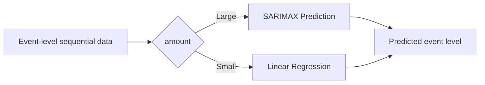
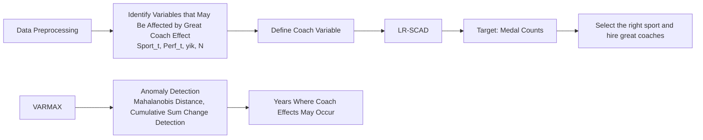

# Beyond Medals: A Predictive Model for Olympic Success and Identifying Opportunities

# Summary

The Olympics have always been a topic of great interest. With the 2028 Summer Olympics set to take place in Los Angeles, there is much anticipation not only for the exciting competitions but also for which countries will achieve success or experience setbacks in the medal standings. Meanwhile, a greater and more intriguing challenge has emerged: utilizing information from past Olympics to predict future Olympic medal outcomes. This is the primary question we address in this paper.

To establish a reasonable model, our first task is to develop an appropriate model for national medal counts. We built a bottom-up medal analysis and prediction model using the TrueSkill-SARIMAX-RF method. For traditional events, the TrueSkill model is used to evaluate a country's performance in each event. Then, the SARIMAX model is applied to predict the country's performance level for 2028. The host country factor was considered in this step. To account for potential errors, a Bayesian prediction method is employed. Finally, the predicted performance for 2028 determines the medal allocation. The results from these two parts of events are aggregated to form the final medal count model for each country.

For Task 1, using our model, we predicted medal winners for each event. Based on our simulated medal table, we also predicted which countries are most likely to show the greatest decline or improvement. Our model then address the second major question in Task 1: predicting medal-winning probabilities for countries that have never won medals. Through rigorous probability analysis, we concluded that in 2028, there is a 0.25 probability that 2 countries without previous medals will win their first medals. Regarding the third question in Task 1, since we derived overall national medal outcomes from event-level predictions, we aggregate event performance predictions to determine which sports are most crucial for each country. Finally, we analyzed the host country's newly chosen events and various countries' medal performances, discovering that host countries have higher chances of winning medals in home competitions and newly selected events.

For Task 2, we performed residual analysis to find evidence of how coaches influence athletes' performance and medal counts. By analyzing different variables, we identified anomaly information in the data, providing evidence of how the possible “great coach” effect alters the data. Subsequently, we introduced LR-SCAD model to study how the “great coach” effect contributed to changes in the total medal count for different countries and created visualizations for this. Finally, we selected USA NOC, SWE NOC, and CHN NOC and identified the sports in which these countries should invest in a great coach. We then evaluated the impact of the great coach on their medal counts.

For Task 3, based on the model, we analyzed and derived 2 factors that affect a country's medal count, which were not covered in Tasks 1 and 2. We found that countries without previous medals should introduce coaches in events with higher winning probabilities to significantly increase their chances of success. Additionally, we discovered that the proportion of experienced athletes in a team affects medal-winning probabilities.

Lastly, we conducted sensitivity analysis on our model, finding that it demonstrates strong generalizability across different datasets, proving its robustness.

Keywords: TrueSkill, SARIMAX, Residual Analysis, LR-SCAD Model, Great Coach Effect

# Contents

# 1 Introduction 3

1.1 Problem Background 3  
1.2 Restatement of The Problem 3  
1.3 Our Work 4

# 2 Assumptions 5

# 3 Notations 5

# 4 Data Preprocessing 6

# 5 Medal Projection Model 6

5.1 TrueSkill Sports Performance Evaluation Model 7  
5.2 SARIMAX-Bayesian Model: Predicting Future Medals 8  
5.3 Random Forest Model: Predicting Medals in New Events 10  
5.4 Model Aggregation 11  
5.5 Model Evaluation 11

# 6 Task 1: Medal Prediction and Analysis for the 2028 Olympics 12

6.1 Medal Table Projections 12  
6.2 First Ever Medal 13  
6.3 Task 1.3 14

# 7 Task 2: Great Coach Effect 16

7.1 Residuals Test: Evidence of Changes That Might Be Due to Great Coach Effect . . . . 16  
7.2 LR-SCAD: Estimate Great Coach Effect Contributes To Medal Counts ..... 18  
7.3 Choose three countries and identify sports where they should consider investing in a “great” coach and estimate that impact ..... 19

# 8 TASK 3: Oringinal Insights 20

8.1 Insights and Recommendations for Countries That Have Never Won Medals ..... 20  
8.2 Insights and Advice for NOCs on Deploying Experienced Athletes ..... 21

# 9 Model Evaluation 22

# 10 Sensitivity Analysis 23

# 11 Conclusion 24

# References 25

# 1 Introduction

# 1.1 Problem Background

The Olympics have always been a topic of great interest. With the 2028 Summer Olympics set to take place in Los Angeles, there is much anticipation not only for the exciting competitions but also for which countries will achieve success or experience setbacks in the medal standings, as well as whether countries that have never won medals will secure their first one. Also, predicting the medal counts for the United States in the 2028 Olympics, as the host nation, is an exciting and dynamic challenge.

Figure 1 shows new events added to the 2028 Los Angeles Olympics:

natural_image

Collage of three women's Olympic athletes in action, including a female volleyball player, a female volleyball player, and a female volleyball player, with Olympic rings and 'LA 2028' text overlay (no readable signage or symbols on main subjects)

Figure 1: New events added to the Los Angeles Olympics[1].

# 1.2 Restatement of The Problem

We have divided the entire problem into three main tasks:

Task1: Medal Prediction and Analysis for the 2028 Olympics For Task 1, the following objectives must be accomplished: Build a model to represent and predict the medal counts for each country, including gold medals and total medals, while evaluating the model's accuracy and performance. Once the model is constructed, the subsequent tasks based on its outputs must be completed:

- Predict the medal table for the 2028 Los Angeles Olympics and obtain prediction intervals. Identify the countries most likely to improve or decline in the medal table according to our predictions.  
- Predict how many countries that have never won a medal in the Olympics will win medals in the 2028 Los Angeles Olympics, along with the probability of this occurrence.  
- Identify the most important sports for different countries, provide reasons, and analyze how the events chosen by the host country influence the gold and total medal counts of various countries.

Task 2 The Impact of the “Great Coach” Effect For Task 2, the study of the “great coach” effect is required. First, evidence needs to be found showing how the “great coach” effect changes the data.

Then, analyze the contribution of the “great coach” effect to changes in the total medal count. Lastly, select three countries, identify which sports they should invest in a “great” coach, and assess the impact on their medal counts.

Task 3 Exploring Strategic Insights For Task 3, additional insights need to be derived from the model, and these insights must be explained in a way that they can provide useful reference for the national Olympic committees.

# 1.3 Our Work

Figure 2 below shows the implementation steps of our entire work:  

```mermaid
graph LR
  A["Data Preprocessing"] --> B["New Events"]
  A --> C["Traditional Events"]
  B --> D["Random Forest Model For New Events"]
  C --> E["TrueSkill Sports Performance Evaluation Model"]
  D --> F["SARIMAX-Bayesian Model For Future Medal Prediction"]
  E --> G["Monte Carlo Simulation"]
  G --> H["First Ever Medal"]
  G --> I["Most Important Sports"]
  F --> J["Medal Table"]
  J --> K["Variable Selection Model LR-SCAD"]
  K --> L["LR-SCAD"]
  K --> M["Define Coach Variable"]
  L --> N["Select the right sport and hire great coaches"]
  M --> O["Years Where Coach Effects May Occur"]
  O --> P["Anomaly Detection"]
  P --> Q["Mahalanobis Distance"]
  P --> R["Cumulative Sum Change Detection"]
  Q --> S["VARMAX"]
  R --> S
  S --> T["Identify Variables that May Be Affected by Great Coach Effect"]
  T --> U["Sport_t"]
  T --> V["Perf_t"]
  U --> W["N"]
  V --> W
  W --> X["VARMAX"]
  X --> Y["Model Analysis"]
  Y --> Z["Insight1"]
  Y --> AA["Insight2"]
  Z --> AB["Suggestion1"]
  AA --> AC["Suggestion2"]
```

flowchart

Figure 2: Overall Structure of Our Model

For Task 1, we built a bottom-up medal projection model using the TrueSkill-SARIMAX-RF method. The model first categorizes all events into traditional events and new events. For traditional events, the TrueSkill-SARIMAX model is applied to predict the country's performance level for 2028. To account for potential errors, a Bayesian prediction method is employed. The model determines the allocation of medals based on the predicted performance rankings. For new events, a Random Forest model is used to predict medal allocation. The results from these two parts are aggregated to form the final medal count model for each country. We used the model to predict and analyze all the issues mentioned in the statement of the problem, and provided an analysis of the model's accuracy.

For Task 2, we performed residual analysis. By analyzing different variables, we identified outliers in the data, providing evidence of how the “great coach” effect alters the data. Subsequently, we studied how the “great coach” effect contributed to changes in the total medal count for different countries and created visualizations for this. Finally, we selected USA, CHN and SWE to identify the sports in which these countries should invest in a “great” coach. We then evaluated the impact of the “great” coach on their medal counts.

For Task 3, Based on the model, we analyzed and identified several factors that affect a country's medal count, which were not covered in Tasks 1 and 2. These factors were then integrated into insights, and based on these insights, we provided recommendations for the concerned national Olympic committees.

# 2 Assumptions

To ensure the accuracy of our proposed model, we make the below assumptions, which are properly justified:

1. The performance in different sports does not affect each other. This assumption aligns with the International Olympic Committee's sport categorization framework that treats disciplines as distinct competitive domains.  
2. All athletes without medals can be treated as holding equivalent competitive standing to fourth-place finishers, because of limited historical records.  
3. Each country is restricted to obtaining at most one medal per event, regardless of the number of participating athletes, which enables holistic evaluation of national athletic ecosystems by preventing single-event dominance from overshadowing broader capability distributions.  
4. Since dissolved states without internationally recognized successor entities can contaminate modern Olympics prediction result, they are excluded from the modeling framework, with their historical data truncated at the dissolution timestamp.  
5. Consistent with IOC sanctions on Russia, Russian athlete participation parameters for the 2028 Olympiad can be excluded, reflecting suspension measures in response to geopolitical conflicts.

# 3 Notations

The key mathematical notations used in this paper are listed in Table 1:

Table 1: Notations used in this paper

<table><tr><td>Symbol</td><td>Description</td><td>Symbol</td><td>Description</td></tr><tr><td> $\Delta\mu$ </td><td>Difference in Athlete Performance</td><td> $\sigma_{team}$ </td><td>National Team Std Dev</td></tr><tr><td> $Per\,f_{i}^{t}$ </td><td>Athlete’s Real Performance</td><td> $\epsilon_{t}$ </td><td>White Noise Error Term</td></tr><tr><td> $Per\,f_{team}$ </td><td>Team Performance</td><td> $Per\,f_{i}^{Sports_{k}}$ </td><td>Country Sport Performance</td></tr><tr><td> $\sigma_{athlete}$ </td><td>Athlete Std Dev</td><td> $Coach_{i,k}$ </td><td>Coaching Effect</td></tr></table>

# 4 Data Preprocessing

Our data preprocessing work primarily focused on the summerOly\_athletes.csv dataset.

1. We removed data from countries that no longer exist and those no longer competing, like RUS. For merged countries like East and West Germany, we merged them under a single NOC.  
2. To better utilize the data, we standardized event names. Events were categorized into currently existing and discontinued events. Discontinued events were removed from the dataset. For existing events, we mapped historical names to their 2024 counterparts.  
3. Based on the assumptions outlined in section 2, we consolidated athletes from different teams of the same country into their respective national teams.

# 5 Medal Projection Model

Figure 3 below shows the implementation steps of Task 1:  

flowchart

This flowchart illustrates a machine learning pipeline for predicting and evaluating sports performance, starting from event data preprocessing and traditional events, through SARIMAX and Bayesian prediction models, to final medal counts and performance evaluation.

Figure 3: Overall Structure of Task 1

We first divide all events into two categories: traditional events that occur in every Olympics and new events being introduced every year.

For traditional events, we use a TrueSkill-SARIMAX model with a bottom-up approach. This involves evaluating each national team's performance at the event level, predicting their future performance, and determining medal outcomes based on predicted performance rankings.

For new events, we use a random forest model to predict medal outcomes for 2028's new events, using historical data from previously introduced events and their medal distributions.

Finally, we aggregate the medal predictions and their confidence intervals from both categories to produce the overall medal table.

# 5.1 TrueSkill Sports Performance Evaluation Model

Research indicates that Olympic medal predictions cannot rely solely on historical medal tables. A country's success in specific events depends on their relative Performance level. To evaluate a country's performance and uncertainty in various events, we innovatively introduced the TrueSkill[2] sports performance evaluation model.

For each event, athletes are grouped by their national teams. Assume each athlete i has a real-valued skill at time t, denoted as $skill_{i}^{t}$ . The initial Skill is drawn from a Gaussian distribution with mean $m_{0}$ and variance $v_{0}$ , expressed as:

$$
\mathrm{Skill} _ {i} ^ {t _ {0}} \sim \mathcal {N} (m _ {0}, v _ {0}) \tag {1}
$$

where $t_0$ represents the athlete's first Olympic appearance time, and $m_0$ and $v_0$ are adjustable parameters.

After each Olympics, each athlete's Skill changes by a value drawn from a Gaussian distribution. Athletes also gain experience from competitions:

$$
\text {Skill} _ {i} ^ {t + L} \sim \mathcal {N} \left(\text {Skill} _ {i} ^ {t}, \gamma^ {2}\right) \quad \text {Skill} _ {i} ^ {t ^ {\prime}} \sim \mathcal {N} \left(\text {Skill} _ {i} ^ {t}, \tau^ {2} \left(t ^ {\prime} - t\right)\right), \quad \text {where} t ^ {\prime} > t \tag {2}
$$

where L represents the number of Olympics participated.

The next step generates match results based on athlete skills. TrueSkill assumes each athlete has a real-valued performance in each match:

$$
\operatorname{Perf} _ {i} ^ {t} \sim \mathcal {N} \left(\text {skill} _ {i} ^ {t} + \text {teamOffset} (\text {size of team}), \beta^ {2}\right) \tag {3}
$$

where $\beta$ is an adjustable parameter reflecting game randomness.

For subsequent discussion, we omit Perf $_i$ 's dependence on $t$ as we're discussing specific matches. During Olympic competitions, each team's performance is defined as the weighted sum of all athletes' performances, with weights proportional to their participation time to account for experience:

$$
\text {Perf} _ {\text {team}} = \sum_ {i \in \text {team}} \frac {\text {Perf} _ {i} \cdot \text {timePlayed} _ {i}}{L} \tag {4}
$$

Then rank the national performance $\mathrm{Perf}_{\mathrm{team}}$ in descending order to determine which countries can win medals. We adjust $m_0$ and $v_0$ according to the actual results of that year. Based on this process, we obtained each country's performance in a particular event for each year.

We also need to determine the error of the event performance. For the error calculation of individual athlete's Skill $_{i}$ , it is divided into two cases: case 1 is applied when comparing different athletes, while case 2 is applied due to long-term non-participation:

$$
\sigma_ {\text {athlete}} = \left\{ \begin{array}{l} \sqrt {\sigma^ {2} (1 - \frac {\sigma^ {2}}{v _ {\text {total}}} \cdot w)}, w = \frac {\phi (x)}{\Phi (x)} \left(\frac {\phi (x)}{\Phi (x)} + \frac {\Delta \mu}{\sqrt {v _ {\text {total}}}}\right), \text {case} 1 \\ \sqrt {\sigma^ {2} + (\tau \cdot t) ^ {2}}, \text {case} 2 \end{array} \right. \tag {5}
$$

where $v_{total}$ represents the total variance, calculated as $v_{total} = \sum_{i=1}^{n} \sigma_{i}^{2} + 2\beta^{2}$ , $\tau$ is the time decay factor, t is the number of days without participation in the competition.

Subsequently, the national team's standard deviation is derived from the standard deviation values of all athletes within the team:

$$
\sigma_ {t e a m} = \sqrt {\sum_ {i = 1} ^ {n} \sigma_ {p l a y e r , i} ^ {2}} \tag {6}
$$

In this way, we obtain the yearly Performance values Perf $_{t}$ for each country in each event and its standard deviation $\sigma_{team}$ .

Part of our results is illustrated in the following Figure 4, showing changes over time in the performance of different countries in various events.

area_stacked

| Country | Trend Description |
| --- | --- |
| Canada | Fluctuating distribution with a peak in early periods, followed by a decline and subsequent rise. |
| United States | Fluctuating distribution with a peak in early periods, followed by a decline and subsequent fluctuation. |
| United Kingdom | Fluctuating distribution with a peak in early periods, followed by a decline and subsequent rise. |
| Japan | Fluctuating distribution with a peak in early periods, followed by a decline and subsequent rise. |
| China | Fluctuating distribution with a peak in early periods, followed by a decline and subsequent fluctuation. |
| France | Fluctuating distribution with a peak in early periods, followed by a decline and subsequent rise. |

Figure 4: Performance of Different Countries in Various Events

# 5.2 SARIMAX-Bayesian Model: Predicting Future Medals

From subsection 5.1, we obtained the performance levels of different countries in each Olympic event from 1896-2024. Since a country's performance level in an event shows periodic fluctuations and is directly related to the Olympic host country, we innovatively introduced the SARIMAX time series prediction model to predict future national performance levels in specific events using these factors.

Figure 5 below shows the implementation steps of our SARIMAX-Bayesian Prediction Model:

flowchart

Figure 5: Structure of SARIMAX-Bayesian Prediction Model

The SARIMAX model combines autoregression AR, moving average MA, seasonal patterns S, and exogenous variables X[3]. It requires target, a country's performance on a typical event, donated as Perf $_{t}$ , where t represents time. Host country, donated as Host $_{t}$ , is the exogenous variable model use.

To begin with, SARIMAX process the AR part, representing the relationship between the current target value and its past values. Also, MA part is processed to represent the relationship between current error and past errors. Periodic patterns are then captured by SARIMAX through seasonal auto-regression coefficients $\phi_{k}$ :

$$
\mathrm{Perf} _ {t} = \alpha + \sum_ {i = 1} ^ {p} \beta_ {i} y _ {t - i} \quad \mathrm{Perf} _ {t} = \epsilon_ {t} + \sum_ {j = 1} ^ {q} \theta_ {j} \epsilon_ {t - j} \quad \mathrm{Perf} _ {t} = \sum_ {k = 1} ^ {S} \phi_ {k} y _ {t - k \cdot s} \tag {7}
$$

Where: $\alpha$ is the constant term. $\beta_{1},\ldots,\beta_{p}$ are autoregression coefficients, representing the relationship between the current value and previous p moments values. $\theta_{1},\ldots,\theta_{q}$ are moving average coefficients that represent the relationship between current error and previous q moment errors. s is the period of time, and $\phi_{k}$ is the seasonal autoregression coefficient.

Then, fit the AR and MA coefficients by minimizing the sum of squared residuals:

$$
\hat {\beta} _ {i}, \hat {\theta} _ {j}, \hat {\phi} _ {k}, \hat {\gamma} = \arg \min \sum_ {t = 1} ^ {T} (\mathrm{Perf} _ {t} - \hat {\mathrm{Perf}} _ {t}) ^ {2} \tag {8}
$$

This completes the model training. Finally, aggregate all parts to obtain the complete model and use the complete model to predict future data:

$$
\hat {\mathrm{Perf}} _ {t + h} = \alpha + \sum_ {i = 1} ^ {p} \hat {\beta} _ {i} \hat {y} _ {t + h - i} + \sum_ {j = 1} ^ {q} \hat {\theta} _ {j} \hat {\epsilon} _ {t + h - j} + \sum_ {k = 1} ^ {S} \hat {\phi} _ {k} \hat {\mathrm{Perf}} _ {t + h - k \cdot s} + \mathrm{Host} _ {t + h} \hat {\gamma} \tag {9}
$$

Additionally, the SARIMAX model performs very inaccurately on small datasets. For events with shorter time spans, we used simple linear regression.

Through this method, we obtain the performance levels of events of each country $\mathrm{Perf}_{t + 1}$ for traditional events in 2028.

In section 5.1, the result $\hat{Perf}_{t+1}$ of the TrueSkill model involves a standard deviation. Similarly, the prediction results from SARIMAX also have a standard deviation. Since this standard deviation cannot be predicted using the SARIMAX model, we use a Bayesian prediction method, based on the same principle as TrueSkill, to predict the standard deviation.

We model the future standard deviation using an Inverse Gamma distribution, which is a natural conjugate prior for variance parameters[4]:

$$
\sigma^ {2} \sim \operatorname{InvGamma} (\alpha , \beta) \tag {10}
$$

Given historical standard deviations $\sigma_1^2, \sigma_2^2, \dots, \sigma_T^2$ , we can update the parameters as:

$$
\alpha_ {T} = \alpha_ {0} + \frac {T}{2}, \quad \beta_ {T} = \beta_ {0} + \frac {1}{2} \sum_ {t = 1} ^ {T} (\sigma_ {t} ^ {2} - \mu) ^ {2} \tag {11}
$$

Finally updating $\alpha_{T}$ and $\beta_{T}$ to obtain the new predicted standard deviation:

$$
\hat {\sigma} _ {T + 1} ^ {2} = \frac {\beta_ {T}}{\alpha_ {T} - 1} \tag {12}
$$

Using this method, we can obtain the predicted values for the standard deviation $\hat{\sigma}_{t+1}$ of the performance level $\hat{P}erf_{t+1}$ . We made a heatmap to show the predicted performance of certain countries in various events, as shown in the following Figure 6. We also made a heatmap to illustrate the predicted standard deviation of certain countries in various events, as shown in the following Figure 7:

heatmap

| Sports Programs | AUS | CHN | CHN | ESP | FIA | GBR | GES | ITA | JPN | USA |
| :--- | :--- | :--- | :--- | :--- | :--- | :--- | :--- | :--- | :--- | :--- |
| Archery Men's Individual | ~1445 | ~291 | ~1069 | ~1069 | ~1445 | ~291 | ~291 | ~291 | ~1069 | ~1069 |
| Artistic Gymnastics Men's All-Around | ~291 | ~1069 | ~1445 | ~1445 | ~1445 | ~1445 | ~1445 | ~1445 | ~1445 | ~1445 |
| Artistic Gymnastics Men's Horizontal Bar | ~291 | ~1069 | ~1445 | ~1445 | ~1445 | ~1445 | ~1445 | ~1445 | ~1445 | ~1445 |
| Badminton Men's Singles | ~291 | ~291 | ~291 | ~291 | ~291 | ~291 | ~291 | ~291 | ~1069 | ~291 |
| Basketball Men | ~239643 | ~291 | ~291 | ~239643 | ~239643 | ~239643 | ~239643 | ~239643 | ~239643 | ~239643 |
| Boxing Men's +f32g | ~291 | ~291 | ~291 | ~291 | ~291 | ~291 | ~291 | ~291 | ~291 | ~291 |
| Canoe Sialom Men's Canoe Single | ~291 | ~291 | ~291 | ~291 | ~291 | ~291 | ~291 | ~291 | ~291 | ~291 |
| Canoe Sprint Men's Canoe Single 1000m | ~291 | ~291 | ~291 | ~1069 | ~291 | ~291 | ~291 | ~291 | ~291 | ~291 |
| Cycling Mountain Bike Women's Cross-country | ~291 | ~1069 | ~1069 | ~291 | ~291 | ~291 | ~291 | ~291 | ~291 | ~291 |
| Football Men | ~291 | ~291 | ~291 | ~291 | ~291 | ~291 | ~291 | ~291 | ~291 | ~291 |

Figure 6: Predicted Performance of Certain Countries in Various Events

heatmap

Error Analysis by NOC and Program (Cell Aspect Ratio=1:1)
| Sports Programs | AUS | CAN | CYN | ESP | FIN | GBRB | GPR | JRA | JPN | USA |
| :--- | :--- | :--- | :--- | :--- | :--- | :--- | :--- | :--- | :--- | :--- |
| Archery Men's Individual | ~7.58 | ~6.96 | ~6.96 | ~6.96 | ~9.64 | ~6.96 | ~6.96 | ~6.96 | ~6.96 | ~6.96 |
| Artistic Gymnastics Men's All-Around | ~6.96 | ~6.96 | ~9.64 | ~6.96 | ~9.64 | ~9.64 | ~9.64 | ~9.64 | ~13.16 | ~13.16 |
| Artistic Gymnastics Men's Horizontal Bar | ~6.96 | ~6.96 | ~9.64 | ~6.96 | ~9.64 | ~9.64 | ~9.64 | ~9.64 | ~13.16 | ~13.16 |
| Badminton Men's Singles | ~6.96 | ~6.96 | ~6.96 | ~6.96 | ~6.96 | ~6.96 | ~6.96 | ~6.96 | ~6.96 | ~6.96 |
| Basketball Men | ~13.16 | ~13.16 | ~13.16 | ~13.16 | ~13.16 | ~13.16 | ~13.16 | ~13.16 | ~13.16 | ~13.16 |
| Boxing Men's +92kg | ~6.96 | ~6.96 | ~6.96 | ~6.96 | ~6.96 | ~6.96 | ~6.96 | ~6.96 | ~6.96 | ~6.96 |
| Canoe Slaalom Men's Canoe Single | ~6.96 | ~6.96 | ~6.96 | ~6.96 | ~9.64 | ~6.96 | ~6.96 | ~6.96 | ~6.96 | ~13.16 |
| Canoe Sprint Men's Canoe Single 1000m | ~6.96 | ~6.96 | ~6.96 | ~6.96 | ~6.96 | ~6.96 | ~6.96 | ~6.96 | ~6.96 | ~6.96 |
| Cycling Mountain Bike Women's Cross-country | ~13.16 | ~6.96 | ~6.96 | ~6.96 | ~6.96 | ~6.96 | ~6.96 | ~6.96 | ~6.96 | ~6.96 |
| Football Men | ~13.16 | ~6.96 | ~6.96 | ~13.16 | ~13.16 | ~6.96 | ~6.96 | ~13.16 | ~13.16 | ~13.16 |

Figure 7: Predicted Standard Deviation of Certain Countries in Various Events

# 5.3 Random Forest Model: Predicting Medals in New Events

For newly added events, since the new events in each Olympic Games are uncertain, and independent from other events, they cannot be evaluated using the TrueSkill model or predicted with SARIMAX. Therefore, we applied the Random Forest model to predict the number of medals in new events.  
Random Forest regression[5] is an ensemble learning method that builds multiple decision trees for regression prediction. Each tree is trained on a different subset of the data and features, and the final prediction is obtained by averaging the results from all trees.  
Our model should first determine the input variables. Input variables include the total number of medals in both new and traditional events for each Olympic Games, the number of medals won by the host country in these two types of events, and the number of medals won by other countries in each of these events.  
These variables are then fed into the Random Forest model, which outputs predictions and model errors on test cases, including MSE and MAE. We selected the best-performing parameters to complete the model training. The errors on the test set are shown in Table 2:  
Table 2: Performance Metrics of Random Forest Models

<table><tr><td>Target Variable</td><td>MAE</td></tr><tr><td>Host Gold</td><td>0.1988</td></tr><tr><td>Host Silver</td><td>0.3460</td></tr><tr><td>Host Bronze</td><td>0.2784</td></tr></table>

It can be observed that our model does have a certain degree of accuracy.

Finally, we used the medal predictions for traditional events in 2028 (from sections 5.1 and 5.2) as inputs to predict the performance in new events for each country.

# 5.4 Model Aggregation

The predictions from the 3 sections above are then aggregated to predict medals. By adding the medal counts of traditional events and newly added events, we obtain the predicted medal values. However, we must also determine the prediction intervals for the medals. The method is as follows:

For a specific event, for the predicted Pref from Section 5.1, we have $\operatorname{Pref}_{t} \sim \mathcal{N}(\mu, \sigma^{2})$ . Therefore, the actual $Pref_{t}$ of the country will always lie within the interval ( $\operatorname{Pref} - 3\sigma, \operatorname{Pref} + 3\sigma$ ). From this, we can obtain the best possible performance and the worst possible performance, denoted as $Pref_{min}$ and $Pref_{max}$ .

For a given country, the worst-case scenario occurs when its performance is $Pref_{min}$ and the performance of other countries is $Pref_{max}$ . We use these $Pref_{extreme}$ to reorder the countries in descending order and determine whether the country will win a medal in that event. This process is repeated for all countries in all events to obtain a worst-case medal table. Similarly, we can use this method to obtain the best-case medal table.

By combining the two medal table above, we obtained our predicted medal table with prediction intervals.

# 5.5 Model Evaluation

We use the 2024 data as a test set to evaluate the accuracy of our model. We applied our model to data from the 2020 Olympics and earlier, obtaining medal count prediction intervals. Then, we compared these intervals with the actual values from 2024, resulting in the following Figure:

line

| National Olympic Committee Code | Count Best | Count Worst | Total |
| --- | --- | --- | --- |
| USA | ~132 | ~119 | ~126 |
| CHN | ~95 | ~83 | ~84 |
| GBR | ~76 | ~56 | ~65 |
| RUS | ~69 | ~52 | ~65 |
| AUS | ~63 | ~44 | ~53 |
| JPN | ~59 | ~42 | ~48 |
| GER | ~45 | ~29 | ~38 |
| TIA | ~42 | ~28 | ~38 |
| KOR | ~39 | ~27 | ~33 |
| CAN | ~36 | ~26 | ~31 |
| NED | ~33 | ~21 | ~27 |
| ESP | ~31 | ~21 | ~34 |
| BRA | ~23 | ~12 | ~19 |
| HUN | ~22 | ~13 | ~19 |
| POL | ~20 | ~11 | ~18 |
| NZL | ~19 | ~10 | ~11 |
| UKR | ~20 | ~6 | ~19 |
| CUB | ~19 | ~6 | ~11 |
| KEN | ~15 | ~7 | ~11 |
| CZE | ~17 | ~8 | ~11 |
| ROU | ~14 | ~5 | ~6 |
| DEN | ~13 | ~6 | ~8 |
| JAM | ~14 | ~4 | ~8 |
| BLR | ~11 | ~3 | ~0 |
| KUZ | ~11 | ~2 | ~7 |
| TUR | ~11 | ~2 | ~8 |
| UZB | ~14 | ~2 | ~14 |
| ARG | ~9 | ~2 | ~7 |
| AZE | ~9 | ~2 | ~7 |
| GEO | ~9 | ~2 | ~7 |
| MEIS | ~9 | ~3 | ~6 |
| SLO | ~9 | ~4 | ~6 |
| BUL | ~8 | ~2 | ~3 |
| CRO | ~8 | ~3 | ~7 |
| ETH | ~7 | ~2 | ~7 |
| IRV | ~12 | ~3 | ~12 |
| RSH | ~7 | ~4 | ~7 |
| SUI | ~9 | ~4 | ~7 |
| BEL | ~10 | ~2 | ~2 |
| INA | ~8 | ~2 | ~11 |
| NOR | ~9 | ~2 | ~11 |
| SWE | ~8 | ~2 | ~11 |
| THA | ~7 | ~1 | ~7 |
| ALG | ~8 | ~1 | ~7 |
| ECU | ~7 | ~0 | ~6 |
| SGP | ~6 | ~0 | ~6 |
| TPE | ~6 | ~0 | ~6 |
| ARM | ~7 | ~3 | ~7 |
| EGY | ~6 | ~0 | ~6 |
| EST | ~6 | ~0 | ~6 |
| IND | ~7 | ~1 | ~7 |
| IDU | ~8 | ~1 | ~8 |
| MHA | ~6 | ~0 | ~6 |
| PHI | ~6 | ~0 | ~6 |
| PRK | ~7 | ~0 | ~7 |
| SVK | ~6 | ~0 | ~6 |
| AUT | ~6 | ~0 | ~6 |
| CUL | ~5 | ~0 | ~5 |
| GRE | ~6 | ~0 | ~6 |
| RIL | ~8 | ~1 | ~8 |
| KLUW | ~7 | ~0 | ~7 |
| LAT | ~4 | ~0 | ~4 |
| MAR | ~4 | ~0 | ~4 |
| MGS | ~6 | ~0 | ~6 |
| MGL | ~6 | ~0 | ~6 |
| NGR | ~6 | ~0 | ~6 |
| QAT | ~8 | ~0 | ~8 |
| SRB | ~4 | ~0 | ~4 |
| JNE | ~4 | ~0 | ~4 |
| ANZ | ~4 | ~0 | ~4 |
| BAH | ~4 | ~0 | ~4 |
| DOM | ~4 | ~0 | ~4 |
| EOR | ~4 | ~0 | ~4 |
| FRN | ~4 | ~0 | ~4 |
| GRN | ~5 | ~0 | ~5 |
| GUA | ~7 | ~0 | ~7 |
| HKG | ~8 | ~0 | ~8 |
| ISR | ~3 | ~0 | ~3 |
| KGZ | ~6 | ~0 | ~6 |
| MNE | ~6 | ~0 | ~6 |
| TK | ~7 | ~0 | ~7 |
| TTO | ~4 | ~0 | ~4 |
| TUN | ~2 | ~0 | ~2 |

Figure 8: Compare Prediction Intervals With The Actual Values From 2024

As shown in the figure above, our model predictions generally fall within the correct range, demonstrating the accuracy of our model.

# 6 Task 1: Medal Prediction and Analysis for the 2028 Olympics

We have completed the model construction in Section 5. In the following section, we are going to focus on solving the task.

# 6.1 Medal Table Projections

Using data from 2024 and earlier Olympics as input to the model, we obtained the virtual medal table with intervals, as shown in Figure 9 below:

2028 Los Angeles Olympics Virtual Medal Table Forcast  

bar

| Rank | Country | Gold | Silver | Bronze | Total |
| --- | --- | --- | --- | --- | --- |
| 1 | United States | 67 +6 -5 | 40 +4 -5 | 32 +0 -3 | 139 +10 -13 |
| 2 | China | 43 +7 -3 | 29 +4 -3 | 18 +2 -2 | 90 +13 -8 |
| 3 | Britain | 26 +10 -1 | 19 +3 -2 | 22 +4 -6 | 67 +17 -9 |
| 4 | Australia | 16 +0 -1 | 18 +8 -1 | 20 +1 -6 | 54 +9 -8 |
| 5 | Japan | 15 +1 -4 | 19 +4 -3 | 19 +0 -6 | 53 +5 -13 |
| 6 | Germany | 13 +2 -4 | 17 +4 -5 | 12 +7 -0 | 42 +13 -9 |
| 7 | Italy | 13 +1 -5 | 11 +3 -2 | 7 +6 -0 | 31 +10 -7 |
| 8 | France | 10 +3 -2 | 17 +11 -4 | 23 +1 -6 | 50 +15 -12 |
| 9 | Canada | 8 +0 -2 | 9 +1 -1 | 11 +9 -2 | 28 +10 -5 |
| 10 | Kenya | 7 +1 -4 | 2 +0 -0 | 3 +1 -0 | 12 +2 -4 |

Figure 9: 2028 Virtual Medal Table

We then compare the medal table we obtained with the 2024 medal table and identify the countries that are most likely to improve or worsen in the medal table and gold medal table, as shown in Figure 10 and Figure 11 below:

bar

| Country Code (NOC) | Gold Difference Value |
| :--- | :--- |
| USA | ~26 |
| CHN | ~3 |
| GBR | ~12 |
| AUS | ~-2 |
| JPN | ~-5 |
| FRA | ~-6 |
| GER | ~1 |
| ITA | ~1 |
| CAN | ~-1 |
| KOR | ~-8 |
| ESP | ~1 |
| UKR | ~2 |
| NED | ~-12 |
| BRA | ~2 |
| POL | ~5 |
| HUN | ~-2 |
| CUB | ~0 |
| KEN | ~3 |
| ROU | ~0 |
| NZL | ~-10 |
| CZE | ~0 |
| DEN | ~3 |
| JAM | ~2 |
| BLR | ~1 |
| MEX | ~1 |
| ARG | ~3 |
| AZE | ~3 |
| GEO | ~-2 |
| SLO | ~0 |
| BUL | ~-2 |
| CRO | ~2 |
| ETH | ~2 |
| IRI | ~-1 |
| RSA | ~0 |
| SUI | ~1 |
| BEL | ~-3 |
| INA | ~-1 |
| KAZ | ~2 |
| NOR | ~-3 |
| SWE | ~0 |
| TUR | ~1 |
| UZB | ~-7 |
| ECU | ~1 |
| SGP | ~0 |
| THA | ~0 |
| EGY | ~-1 |
| IND | ~0 |
| ARM | ~1 |
| EST | ~1 |
| MDA | ~0 |
| PRK | ~0 |
| SVK | ~0 |
| MAS | ~1 |
| ALG | ~-2 |
| AUT | ~-1 |
| COL | ~0 |
| GRE | ~0 |
| IRL | ~-4 |
| KUW | ~1 |
| LAT | ~1 |
| LTU | ~0 |
| MAR | ~0 |
| NGR | ~0 |
| QAT | ~0 |
| SRB | ~-2 |
| VIE | ~1 |
| DOM | ~-1 |
| ANZ | ~0 |
| BAH | ~-2 |
| FIN | ~1 |
| GRN | ~0 |
| GUA | ~-1 |
| HKG | ~-1 |
| ISR | ~-1 |
| KGZ | ~0 |
| MQL | ~1 |
| MNE | ~0 |
| PHI | ~-1 |
| TJK | ~1 |
| TPE | ~-2 |
| TTO | ~0 |
| TUN | ~0 |

Figure 10: Gold Difference by NOC

bar

| Country Code (NOC) | Increase | Decrease |
| :--- | :--- | :--- |
| USA | ~13 | 0 |
| CHN | 0 | ~-2 |
| GBR | ~2 | 0 |
| AUS | ~1 | 0 |
| JPN | ~8 | 0 |
| FRA | 0 | ~-14 |
| GER | ~9 | 0 |
| ITA | 0 | ~-9 |
| CAN | ~4 | 0 |
| KOR | 0 | ~-4 |
| ESP | ~7 | 0 |
| UKR | ~9 | 0 |
| NED | 0 | ~-13 |
| BRA | 0 | ~-2 |
| POL | ~6 | 0 |
| HUN | 0 | ~-5 |
| CUB | ~3 | 0 |
| KEN | ~1 | 0 |
| ROU | ~3 | 0 |
| NZL | 0 | ~-8 |
| CZE | ~6 | 0 |
| DEN | ~1 | 0 |
| JAM | ~4 | 0 |
| BLR | ~8 | 0 |
| MEX | ~3 | 0 |
| ARG | ~4 | 0 |
| AZE | 0 | 0 |
| GEO | ~4 | 0 |
| SLO | 0 | ~-1 |
| BUL | 0 | ~-1 |
| CRO | 0 | 0 |
| ETH | ~2 | 0 |
| IRI | 0 | ~-6 |
| RSA | 0 | 0 |
| SUI | 0 | ~-2 |
| BEL | 0 | ~-5 |
| INA | ~2 | 0 |
| KAZ | 0 | ~-2 |
| NOR | 0 | ~-3 |
| SWE | 0 | ~-6 |
| TUR | 0 | ~-3 |
| UZB | 0 | ~-8 |
| ECU | 0 | ~-1 |
| SGP | ~3 | 0 |
| THA | 0 | ~-2 |
| EGY | ~1 | 0 |
| IND | 0 | ~-2 |
| ARM | 0 | ~-1 |
| EST | ~3 | 0 |
| MDA | 0 | ~-1 |
| PRK | 0 | ~-3 |
| SVK | ~2 | 0 |
| MAS | ~1 | 0 |
| ALG | 0 | ~-1 |
| AUT | 0 | ~-3 |
| COL | 0 | ~-2 |
| GRIE | 0 | ~-6 |
| IRL | 0 | ~-5 |
| KUW | ~2 | 0 |
| LAT | ~2 | 0 |
| LTU | 0 | ~-2 |
| MAR | 0 | 0 |
| NGR | ~2 | 0 |
| QAT | ~1 | 0 |
| SRB | 0 | ~-3 |
| VIE | ~2 | 0 |
| DOM | 0 | ~-1 |
| ANZ | ~1 | 0 |
| BAH | 0 | ~-3 |
| FIN | ~1 | 0 |
| GRN | 0 | ~-1 |
| GUA | 0 | ~-1 |
| HKG | 0 | ~-3 |
| ISR | 0 | ~-6 |
| KGZ | 0 | ~-5 |
| MGL | 0 | 0 |
| MNE | ~1 | 0 |
| PHI | 0 | ~-3 |
| TJK | 0 | ~-2 |
| TPE | 0 | ~-6 |
| TTO | ~1 | 0 |
| TUN | 0 | ~-2 |

Figure 11: Total Difference by NOC

It is evident that the USA, GBR, and POL are likely to see significant improvements in their gold medal counts, while FRA and NED are likely to experience a decline in their total medal counts.

# 6.2 First Ever Medal

We have just focused on the top positions in the predicted medal table. Now, let us shift our attention to the bottom of the predicted medal table. By analyzing the historical data, we find that the countries AND and SOL, which had never earned medals in the past, earned medals in our predictions. They each won their country's first medal in the events Athletics Men's 3000m Steeplechase and Athletics Women's 100m, respectively. This suggests that our model can predict medal results for countries that have never won medals before.

So, how many countries are most likely to win medals in 2028? We conducted a Monte Carlo simulation for all countries that had never earned medals in the past, and the specific method is as follows. For each country i, its performance level $Perf_{i}$ in each event follows a normal distribution:

$$
\mathrm{Perf} _ {i} \sim \mathcal {N} (\mu_ {i}, \sigma_ {i} ^ {2}) \tag {13}
$$

To account for the competition for medals, suppose there are n countries participating in event E, each with performance level $Perf_{i}$ following a normal distribution $\mathcal{N}(\mu_{i}, \sigma_{i}^{2})$ . We perform N simulation draws. In each draw, for each country i (including smaller countries j), we sample from the normal distribution $\mathcal{N}(\mu_{i}, \sigma_{i}^{2})$ to obtain the performance level $Perf_{i}$ for each country.

By comparing the performance levels of all countries, we determine the ranking of each country in event E. If a smaller country j ranks in the top three, it is considered to have won a medal.

We then count the number of times country j wins a medal in N simulations, denoted as $N_{j}$ , and calculate the probability that country j wins a medal in event E:

$$
P _ {j} (E) = \frac {N _ {j}}{N} \tag {14}
$$

For other possible events $E_{1}, E_{2}, \ldots, E_{m}$ in which country j might win a medal, we repeat the process above to calculate the medal-winning probability for country j in each event $E_{k}$ . Then, the total probability of country j winning a medal across all possible events can be computed by a weighted average:

$$
P _ {j} (\text {medal}) = \sum_ {k = 1} ^ {m} w _ {k} P _ {j} (E _ {k}) \tag {15}
$$

Using the multiplication rule of probability, we calculated the probability of the number of countries that have never won a medal winning one, as shown in the Table 3 below:

Table 3: Probability of The Number of Countries that Have Never Won A Medal Winning One

<table><tr><td>Number</td><td>0</td><td>1</td><td>2</td><td>3</td><td>4</td><td>5</td><td>6</td><td>7</td><td>8</td><td>9</td></tr><tr><td>P</td><td>0.06</td><td>0.18</td><td>0.25</td><td>0.22</td><td>0.14</td><td>0.08</td><td>0.03</td><td>0.01</td><td>0.01</td><td>0.00</td></tr></table>

The expected number of countries that have never won a medal to win one is 2.67. According to probability theory, we believe that two smaller countries are most likely to win medals in 2028, with a probability of 0.24.

# 6.3 Task 1.3

Since we use a bottom-up approach by obtaining the performance values for each country in each event every year, the ranking of each country in each event is determined by its performance value $Perf_{ij}$ , where a smaller ranking indicates better performance. Let $R_{ij}$ denote the ranking of country $C_i$ in event $E_j$ , which satisfies: $R_{ij} = \text{Rank}(Perf_{ij})$ . $\text{Rank}(Perf_{ij})$ is the rank of $Perf_{ij}$ among all countries.

To standardize the performance values across different events, we first normalize the performance values for each event. The normalized performance value $Perf_{ij}'$ is given by:

$$
P e r f _ {i j} ^ {\prime} = \frac {P e r f _ {i j} - \min _ {j} P e r f _ {i j}}{\max _ {j} P e r f _ {i j} - \min _ {j} P e r f _ {i j}} \tag {16}
$$

This ensures that the performance values of all events are within the same range.

For each country $C_{i}$ and sport $Sports_{k}$ , which consists of multiple events, the overall performance of country $C_{i}$ in sport $Sports_{k}$ is the average performance of all events within the sport:

$$
P e r f _ {i} ^ {S p o r t s _ {k}} = \frac {1}{q} \sum_ {j = 1} ^ {q} P e r f _ {i j k} ^ {\prime} \tag {17}
$$

where q is the number of events in sport $Sports_{k}$ .

If $Perf_{i}^{Sports_{k}}$ is larger, it indicates that country $C_{i}$ has a better average ranking in that sport, implying that the sport is more important to the country.

We have created a heatmap to visually represent the process of identifying the most important sports for various countries, as shown in Figure 12:

heatmap

| Sports | AUS | AUT | AZE | BEL | BLR | BRA | BRN | BUL | CAN | CHI | CHN |
| --- | --- | --- | --- | --- | --- | --- | --- | --- | --- | --- | --- |
| Diving | ~3.5 | ~0.5 | ~0.5 | ~0.5 | ~0.5 | ~0.5 | ~0.5 | ~3.5 | ~3.5 | ~3.5 | ~4.0 |
| Equestrian | ~3.5 | ~0.5 | ~0.5 | ~0.5 | ~0.5 | ~0.5 | ~0.5 | ~3.5 | ~3.5 | ~3.5 | ~3.5 |
| Fencing | ~0.5 | ~0.5 | ~0.5 | ~0.5 | ~0.5 | ~0.5 | ~0.5 | ~3.5 | ~3.5 | ~3.5 | ~4.0 |
| Football | ~0.5 | ~0.5 | ~0.5 | ~0.5 | ~0.5 | ~0.5 | ~0.5 | ~3.5 | ~3.5 | ~3.5 | ~3.5 |
| Golf | ~0.5 | ~0.5 | ~0.5 | ~0.5 | ~0.5 | ~0.5 | ~0.5 | ~3.5 | ~3.5 | ~3.5 | ~3.5 |
| Artistic Gymnastics | ~3.5 | ~0.5 | ~0.5 | ~0.5 | ~0.5 | ~0.5 | ~0.5 | ~3.5 | ~3.5 | ~3.5 | ~4.0 |
| Handball | ~0.5 | ~0.5 | ~0.5 | ~0.5 | ~0.5 | ~0.5 | ~0.5 | ~0.5 | ~0.5 | ~0.5 | ~0.5 |
| Hockey | ~0.5 | ~0.5 | ~0.5 | ~0.5 | ~0.5 | ~0.5 | ~0.5 | ~0.5 | ~0.5 | ~0.5 | ~0.5 |
| Judo | ~0.5 | ~3.5 | ~3.5 | ~3.5 | ~3.5 | ~3.5 | ~3.5 | ~3.5 | ~3.5 | ~3.5 | ~3.5 |
| Modern Pentathlon | ~0.5 | ~0.5 | ~0.5 | ~0.5 | ~0.5 | ~0.5 | ~0.5 | ~0.5 | ~0.5 | ~0.5 | ~0.5 |
| Rhythmic Gymnastics | ~0.5 | ~0.5 | ~0.5 | ~0.5 | ~0.5 | ~0.5 | ~0.5 | ~3.5 | ~3.5 | ~3.5 | ~3.5 |

Figure 12: Identifying The Most Important Sport for Various Countries

According to the random forest model in Section 5.3, we have estimated the number of medals the host country is likely to win in newly added events. Additionally, our model found that host countries tend to perform better in these new events. The number of medals won by the host country in newly introduced events is significantly higher than that of other countries. By comparing with past data, it is also evident that the proportion of medals won by host countries in newly introduced events is much higher than that of other countries.

We visualized this phenomenon, as shown in Figure 13 and Figure 14 below, where red represents the proportion of total medals held by the host country, purple represents other countries, and the other colors represent the countries ranked higher on the medal table.

donut

| Category | Value |
| --- | --- |
| USA | ~40% |
| CHN | ~10% |
| JPN | ~10% |
| AUS | ~5% |
| other | ~50% |

Figure 13: Proportion of Medals Won By the Host Country and Other Countries In New Events

donut

| Category | Value |
| --- | --- |
| USA | ~15% |
| CHN | ~12% |
| JPN | ~8% |
| AUS | ~8% |
| other | ~60% |

Figure 14: Proportion of Medals Won By The Host Country and Other Countries in Traditional Events

The inclusion of new sports or the re-emphasis of certain disciplines will likely boost the medal count for host nations in those typical areas.

# 7 Task 2: Great Coach Effect

In addition to the athletes' own performance, coaches may also influence the allocation of medals. In this task, we will focus on an unknown variable: the coach. We need to accomplish the following tasks:

- Find evidence of how coaches influence athletes' performance and medal counts.  
- Analyze the impact of coach effects on medal counts.  
- Conduct an analysis for three different countries to assess in which sports they should hire a great coach.

Figure 15 below shows the overall structure of Task 2:  

flowchart

Figure 15: Overall Structure of Task 2

# 7.1 Residuals Test: Evidence of Changes That Might Be Due to Great Coach Effect

To identify which countries have evidence of great coaches in certain events, we implement a residuals test.

First, we analyze the variables most likely to be influenced by the coach effect. The following symbols all represent a specific NOC. Four variables were selected:

\- Event Performance Perf $_t$ : This is the yearly event performance measured in section 5.

- Sport Performance $\mathsf{Sport}_t$ : The performance level in each sport, calculated in section 5.  
- Number of participants N: The number of athletes participating in an event.  
- Medal count $y_{ik}$ : Medal count of country $i$ in event $k$ .

The core principle of anomaly year detection is to identify outliers through time series modeling combined with residual analysis.

First, the VARMAX model is introduced to perform maximum likelihood estimation to fit the time series data and solve for the model parameters[6], capturing the dynamic relationships between multiple variables.

The model is expressed as:

$$
Y _ {t} = A _ {1} Y _ {t - 1} + A _ {2} Y _ {t - 2} + \dots + A _ {p} Y _ {t - p} + B X _ {t} + \epsilon_ {t} \tag {18}
$$

where: $Y_{t}$ is the vector of response variables, $A_{i}$ is the autoregressive coefficient matrix, $X_{t}$ is the exogenous variable, as is shown above, B is the coefficient matrix for the exogenous variable, $\epsilon_{t}$ is the white noise error term.

Next, two anomaly detection methods are introduced. The Mahalanobis distance is used to calculate the standardized residual distance, considering the covariance between variables, with the following formula:

$$
D _ {t} ^ {2} = (\epsilon_ {t} ^ {\top} \Sigma^ {- 1} \epsilon_ {t}) \tag {19}
$$

where: $\epsilon_{t}$ is the residual vector, $\Sigma^{-1}$ is the inverse of the covariance matrix, $D_{t}^{2}$ is the square of the Mahalanobis distance.

Robust covariance estimation is used to reduce the impact of outliers. If the computed Mahalanobis distance exceeds the .95 percentile, it is considered an outlier.

The second method is CUSUM, which detects anomalies by calculating the cumulative sum of squared residuals:

$$
S _ {t} = \sum_ {i = 1} ^ {t} (\epsilon_ {i} ^ {2} - \mu) \tag {20}
$$

where: $\epsilon_{i}^{2}$ is the squared residual, $\mu$ is the mean of the residuals.

If the cumulative sum $S_{t}$ exceeds 3 times the standard deviation, a shift point is detected, and the point is considered an anomaly.

Finally, the joint decision-making process involves taking the union of the two methods to avoid missing outliers. Anomalous points are determined by the results of both the Mahalanobis distance and CUSUM detection. The anomaly information we obtained is shown in Figure 16 below:

  
Figure 16: Anomaly Information

We found that the coaches mentioned in the problem, Lang Ping and Béla Károlyi, had data anomalies in the years they coached, confirming our hypothesis.

# 7.2 LR-SCAD: Estimate Great Coach Effect Contributes To Medal Counts

Next, based on the results of the residual test, we list a set of coach effect variables. $Coach_{ik}$ is the coach effect variable for event k in country i. These variables represent the coach effect across different sports. To verify whether the coach effect significantly impacts the medal count, we include multiple potential variables affecting the medal count and the coach effect variables as independent variables in the LR-SCAD model[7].

The goal of the LR-SCAD model is to select key independent variables that affect the medal count and assess their impact. The regression equation is set as follows:

$$
y _ {i k} = \beta_ {0} + \beta_ {1} \cdot X _ {i k 1} + \beta_ {2} \cdot X _ {i k 2} + \dots + \beta_ {m} \cdot X _ {i k m} + \beta_ {\text {coach}} \cdot \text {Coach} _ {i k} + \epsilon_ {i k} \tag {21}
$$

where $y_{ik}$ is the medal count for country i in event k. $X_{ik1}, X_{ik2}, \ldots, X_{ikm}$ are other variables that may influence the medal count. $\epsilon_{ik}$ is the error term.

After performing the SCAD model selection, if the coefficient $\beta_{coach}$ is still significant (i.e., nonzero) in the regression model, it indicates that the coach effect has an independent impact on the medal count. This means that even when controlling for other variables, the coach effect still plays an irreplaceable role and cannot be explained by other variables. This result shows that the coach's role in certain sports (e.g., team sports) is crucial, and even if athletes are highly skilled, a lack of the right coach will prevent them from achieving good results.

By analyzing the SCAD parameters from the model, we can determine the specific contribution of the coach effect to the medal count for each country in each sport. We then sum these contributions to find the coach effect's contribution to the total medal count for the country:

$$
\text {Contribution} = \sum_ {k = 1} ^ {K} \beta_ {\mathrm{coach}, k} \cdot \mathrm{Coach} _ {i k} \tag {22}
$$

where $\beta_{coach,k}$ is the coach effect coefficient for event k.

Thus, by summing the contributions from various sports, we can determine the total contribution of the great coach effect to the country's overall medal count, as shown in Figure 17 below:

geo

| Region | Coach Effect Amount |
| --- | --- |
| North America | 1.18, 2.08 |
| Europe | 0.77, 1.18 |
| Asia | 0.00, 0.77 |
| South America | 1.18, 2.08 |
| Africa | 0.00, 0.77 |
| Australia | 3.12, 6.88 |

Figure 17: Great Coach Effect To The Country's Overall Medal Count[8]

# 7.3 Choose three countries and identify sports where they should consider

# investing in a “great” coach and estimate that impact

Next, we selected three NOCs, namely USA, SWE, and CHN, and calculated the great coach effect contribution for each sport. We chose the one that brings the highest benefit and calculated the resulting change in medal count, as shown in Figure 18 below:

  
Figure 18: Great Coach Effect on Different Sports

In this regard, we made the following recommendations:

- For the USA NOC, we suggested hiring a great coach for Rowing, Fencing, and Canoeing. With the influence of a great coach, these sports are expected to add 0.8 medals to the medal table.  
- For the SWE NOC, we recommended hiring a great coach for Table Tennis, expecting an increase of 0.9 medals in the medal table.  
- For the CHN NOC, we advised hiring a great coach for Football, expecting an increase of 1 medal in the medal table.

In conclusion, these changes demonstrate that our model effectively captures potential scenarios involving the coach, analyzes the changes it brings to the variables, and incorporates these changes back into the model, which led to the expected impact of the coach on the medal count.

# 8 TASK 3: Oringinal Insights

In this section, we will focus on original insights that were not addressed in the task but were proposed through the analysis of our model results. Based on these original insights, we will also provide effective recommendations for the Olympic Committees of the relevant countries.

# 8.1 Insights and Recommendations for Countries That Have Never Won Medals

Based on Section 6.2, our model identified several events in which countries that have never won medals are most likely to win. It also quantitatively shows the contribution of the coach effect to a country's medal count. This means that for countries that have never won a medal, hiring an excellent coach for the most likely events can significantly increase the probability of winning a medal.

To investigate this specific impact, we applied our model to two NOCs that have never won any medals before: BEN NOC and BOL NOC. Their predicted probabilities of winning medals in the following events are illustrated in Figure 19 and Figure 20 below:

radar

| Category | Value |
| --- | --- |
| Athletics Men's 100m | ~0.033 |
| Swimming Men's 50m Freestyle | ~0.038 |
| Boxing Men's 51kg | ~0.028 |
| Taekwondo Men -68kg | ~0.025 |
| Judo Men -66 kg | ~0.022 |
| Cycling Road Men's Road Race | ~0.020 |

Figure 19: predicted probabilities of winning medals for BEN

radar

| Category | Value |
| --- | --- |
| Athletics Women's 20km Race Walk | 0.05 |
| Swimming Women's 100m Backstroke | ~0.035 |
| Wrestling Men's Freestyle 65kg | ~0.025 |
| Swimming Men's 400m Freestyle | ~0.025 |
| Tennis Men's Singles | ~0.02 |
| Cycling Road Men's Road Race | ~0.02 |

Figure 20: predicted probabilities of winning medals for BOL

Based on this, we suggest that BEN NOC and BOL NOC should adopt our model and hire Great Coaches for Swimming Men's 50m Freestyle and Athletics Women's 20km Race Walk respectively, in order to pursue their first historical medals.

Moreover, we recommend that the Olympic Committees of countries that have not yet won medals refer to our model and, taking their own strengths into account, look for excellent coaches in specific events to increase the probability of winning their first medal.

# 8.2 Insights and Advice for NOCs on Deploying Experienced Athletes

We also found that experienced athletes in certain events in specific countries have a significant impact on the overall level, which in turn influences the total medal count. Our model measures the country's event performance level in the sport using the Trueskill system, where the experience of athletes influences the level. Below are the overall medal statistics for USA NOC in the Fencing Men's Foil Team, the proportion of veteran athletes, and the level changes. These changes are shown in Figure 21 below:

area

| Year | Event Level | Experience |
| --- | --- | --- |
| 1904 | ~2350 | ~11 |
| 1920 | ~3350 | ~13 |
| 1924 | ~3900 | ~21 |
| 1928 | ~3650 | ~24 |
| 1932 | ~6200 | ~23 |
| 1936 | ~5450 | ~11 |
| 1950 | ~3700 | ~9 |
| 1954 | ~2950 | ~7 |
| 1958 | ~2350 | ~8 |
| 1962 | ~2100 | ~8 |
| 1966 | ~2200 | ~11 |
| 1970 | ~1950 | ~9 |
| 1974 | ~2150 | ~3 |
| 1978 | ~2500 | ~8 |
| 1984 | ~2050 | ~9 |
| 1988 | ~1800 | ~12 |
| 1994 | ~1400 | ~5 |
| 2004 | ~1050 | ~3 |
| 2012 | ~1250 | ~11 |
| 2016 | ~3850 | ~15 |
| 2020 | ~4900 | ~17 |
| 2024 | ~4000 | ~21 |

Figure 21: USA Fencing Men's Foil Team Evolution of Event Level and Athletes' Experience Over Time

This means that for USA NOC in the Fencing Men's Foil Team, having more experienced athletes participating in the event may increase the likelihood of winning a medal, compared to sending more new athletes.

Therefore, we suggest that the Olympic Committees of different countries use our model to analyze past event performance and, based on the analysis, send more experienced athletes to the competition to improve their chances of winning medals.

# 9 Model Evaluation

# Strengths:

- We innovatively employed a variety of methods to comprehensively integrate as much useful information as possible, achieving a relatively high prediction accuracy.  
- Compared to directly predicting using medal counts, the model compensate for missing cases.  
- When a country doesn't participate in an event in a certain year, its level doesn't reset to zero and can still be used in subsequent predictions.  
- We innovatively proposed the LR-SCAD model to accurately measure the coaching effect, which holds significant guiding value for Olympic competitions.

# Weaknesses:

To ensure accuracy, a relatively large amount of computation is inevitably required. In the future, we can further optimize the model to reduce the computational cost.

# 10 Sensitivity Analysis

In the sensitivity analysis, we selected two hyperparameters from the TrueSkill model and two from the SARIMAX model that significantly influence the results. The following Figure 22 illustrates the variation in final medal prediction accuracy with changes in $\sigma$ and $\beta$ for TrueSkill, as well as p and q for SARIMAX, within a specified range.

  
Figure 22: Variation in Final Medal Prediction Accuracy with Changes

It can be observed that when $\sigma$ and $\beta$ change, the prediction accuracy remains relatively stable overall, demonstrating the strong robustness of our model. This is because TrueSkill's influence on the level of each event is nearly uniform. However, prediction accuracy exhibits slightly larger fluctuations with changes in $p$ and $q$ . This is because these two hyperparameters directly affect the prediction outcomes.

The Following Figure 23 shows that as the average number of samples used for time series prediction decreases, the final prediction accuracy initially tends to decline.

line

| Average Number | Precision |
| --- | --- |
| 100 | ~0.96 |
| 95 | ~0.94 |
| 90 | ~0.93 |
| 85 | ~0.92 |
| 80 | ~0.89 |
| 75 | ~0.87 |
| 70 | ~0.86 |
| 65 | ~0.82 |
| 60 | ~0.82 |
| 55 | ~0.81 |
| 50 | ~0.77 |
| 45 | ~0.72 |
| 40 | ~0.71 |
| 35 | ~0.70 |
| 30 | ~0.69 |
| 25 | ~0.69 |
| 20 | ~0.67 |
| 15 | ~0.67 |
| 10 | ~0.67 |

Figure 23: Correlation Between Prediction Accuracy and Sample Average Number

However, after a certain point, the downward trend slows. This is because our model automatically transitions to a simple linear regression prediction when there is less time series data, thereby avoiding larger errors introduced by time series forecasting. As a result, our model demonstrates strong adaptability across different datasets.

# 11 Conclusion

For Task 1, we built a bottom-up medal analysis and prediction model using the TrueSkill-SARIMAX-RF method. The model first categorizes all events into traditional events and new events. For traditional events, the TrueSkill model is used to evaluate a country's performance in each event. Then, the SARIMAX model is applied to predict the country's performance level for 2028. To account for potential errors, a Bayesian prediction method is employed. Finally, the predicted performance for 2028 determines the medal allocation. For new events, a Random Forest model is used to predict medal allocation. The results from these two parts of events are aggregated to form the final medal count model for each country.

For Task 2, we performed residual analysis to find evidence of how coaches influence athletes' performance and medal counts. By analyzing different variables, we identified anomaly information in the data, providing evidence of how the “great coach” effect alters the data. Subsequently, we studied how the “great coach” effect contributed to changes in the total medal count for different countries and created visualizations for this. Finally, we selected USA NOC, SWE NOC, and CHN NOC and identified the sports in which these countries should invest in a great coach. We then evaluated the impact of the great coach on their medal counts.

For Task 3, based on the model, we analyzed and derived 2 factors that affect a country's medal count, which were not covered in Tasks 1 and 2. These factors were then integrated into insights and explained how these insights could provide valuable reference for national Olympic committees.

# References

[1] Wikipedia contributors. Wikipedia. https://en.wikipedia.org/. Retrieved January 28, 2025.  
[2] T. Minka, R. Cleven, and Y. Zaykov. Trueskill 2: An improved bayesian skill rating system. Technical report, Microsoft Research, n.d.  
[3] W. Skaf, A. Tosayeva, and D. T. Várkonyi. Towards automatic forecasting: Evaluation of time-series forecasting models for chickenpox cases estimation in hungary. arXiv preprint arXiv:2209.14129, 2022.  
[4] P. Berti, E. Dreassi, F. Leisen, P. Rigo, and L. Pratelli. A probabilistic view on predictive constructions for bayesian learning. arXiv preprint arXiv:2208.06785, 2022.  
[5] A. Sinha and S. Bhatia. Deep regression forests. In Proceedings of the IEEE International Conference on Computer Vision (ICCV), pages 3653-3662, 2019.  
[6] Deepvarma: A hybrid deep learning and varma model for chemical industry index forecasting. No additional information provided on authorship or publication year.  
[7] J. Ma, L. Wang, and T. Xu. Approximate message passing for nonconvex sparse regularization with stability and asymptotic analysis. arXiv preprint arXiv:1711.02795, 2017.  
[8] Natural Earth. 1:110m cultural vectors. https://www.naturalearthdata.com/downloads/110m-cultural-vectors/. Retrieved January 28, 2025.