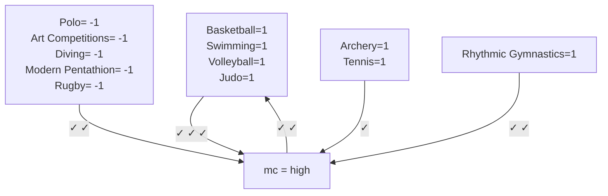
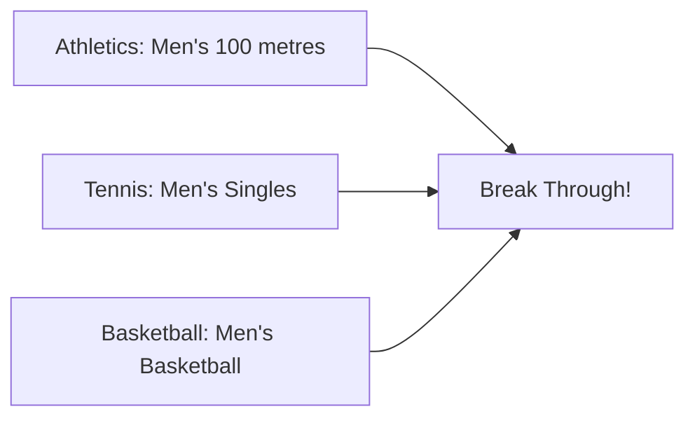

# From Data to Podiums: A Study for Olympic Medal Forecasting

Summary

This research examines the forecasting of Olympic medal counts by analyzing the competitive outcomes of various nations since the inception of the Olympic Games in 1896. The study addresses five primary concerns:

Predict Medal Standings for the 2028 LA Olympics: To effectively model the number of medals awarded to countries, we propose a zero-inflated negative binomial regression model (ZINB). Adopting a Bayesian framework, we employ the Markov Chain Monte Carlo (MCMC) method to derive the posterior distribution of the model parameters. Subsequently, we conduct random simulations to predict the medal standings for the 2028 Olympics. Comprehensive testing of all parameters yielded Rhat values of 1, with both Bulk Effective Sample Size (ESS) and Tail ESS values reaching ten thousand, thereby demonstrating the model's exceptional predictive stability and precision.

Overcoming the Historical Lack of Medals: We introduced the concepts of sampling zero and structural zero within the ZIBN model. By evaluating the probability of generating structural zeros in various countries, we predicted which nations might secure their first medal at the 2028 Los Angeles Olympics. The findings indicate that Mauritania has a 24.8% chance of achieving this milestone!

Factors Influencing Medal Totals: In this section, we employed an Association Rule Model utilizing GRI algorithm. Using the United States as a case study, we developed a 'type-num' comprehensive indicator $\varphi_{i}$ as the antecedent and the medal count as the consequent, which led to the identification of five strong association rules. Furthermore, the model reinforced the finding that "the host's choice contribute to its medal success", resulting in two strong rules. The analysis revealed that 'Athletics' plays a vital role for all nations. The support for these rules was as high as $80.56\%$ , with confidence levels generally exceeding $80\%$ , and lift values all above 1, confirming the validity of the findings.

Great Coach Effect: To investigate the presence of the "great coach" effect while accounting for the influence of both the coach and the country they represent, we developed a mixed-effects model. In this model, the pairing of coach and country is treated as a random block, while the "great coach" factor is considered a fixed two-level factor. Our analysis confirmed the existence of the "great coach" effect and provided a point estimate of 3.74. For the countries we analyzed, hiring a "great coach" increases the likelihood of winning a silver or gold medal to over 50%.

Original Insights: Based on the results of the regression parameter estimates and the established association rules, we found that the number of events has a minimal impact on performance and can be considered negligible. Therefore, we recommend targeted resource allocation, prioritization of qualifications based on medal probability, and precise talent scouting to synergistically enhance medal efficiency.

Keywords: Zero-Inflated Negative Binomial Regression; Association Rules; GRI Algorithm; Mixed-effects Model; Prediction of the LA Olympics.

# Contents

# 1 Introduction 3

1.1 Background 3  
1.2 Problem Restatement 3  
1.3 Our Work 4

# 2 Assumptions and Notations 4

# 3 Data Preprocessing 5

# 4 Who Will Rule the Medal Race at the 2028 LA Olympics? 6

4.1 Count Regression Model 6  
4.2 Zero-Inflated Model 7  
4.3 Zero-Inflated Negative Binomial Model 8  
4.4 Fitting the Model Using Bayesian Inference and MCMC 8  
4.5 Problem Solutions 10  
4.6 Results 10  
4.7 Model Assessment 13

# 5 How Events of Various Sports Impact the Results? 13

5.1 Establishment of Indicators 13  
5.2 Events-Medals Association Rule Model Based on GRI Algorithm 14  
5.3 Results Analysis 17

# 6 Could a Great Coach Boost Your Country's Medal Count? 19

6.1 Analysis of Variance, Mixed-effects Model 20  
6.2 Definition of the Response Variable 20  
6.3 Problem Solutions 21  
6.4 Fitting the Model 21  
6.5 Results 23

# 7 What Else Is Included in Our Model? 24

# 8 Model Evaluation 24

8.1 Advantages 24  
8.2 Limitations 25

# 1 Introduction

# 1.1 Background

During each Olympic Games, spectators not only follow the thrilling sports competitions but also keep an eye on the national medal standings. Figure 1 illustrates the fluctuations in the total medal counts of seven nations, including the United States and China, over the past five Summer Olympics.

area_stacked

| Year | USA | CHY | GBR | FRA | GER | AUS | JPN |
| --- | --- | --- | --- | --- | --- | --- | --- |
| 2008 | ~105 | ~78 | ~35 | ~25 | ~15 | ~10 | ~5 |
| 2012 | ~102 | ~75 | ~38 | ~28 | ~18 | ~12 | ~8 |
| 2016 | ~100 | ~72 | ~40 | ~25 | ~15 | ~10 | ~10 |
| 2020 | ~110 | ~55 | ~38 | ~28 | ~20 | ~15 | ~15 |
| 2024 | ~115 | ~68 | ~38 | ~30 | ~22 | ~18 | ~12 |

Figure 1: Total Medal Count of the Last 5 Summer Olympics – 7 Countries

For these relatively strong nations, fans are particularly interested in ranking changes, such as whether they have made it into the top 5 or top 3. They also pay attention to variations in the total number of medals, especially gold medals. Conversely, for some countries, securing even a single medal is a noteworthy accomplishment.

Given this context, forecasting the medal counts for each nation in the upcoming Olympic Games is valuable. This article utilizes historical data from the Summer Olympics to predict the number of medals anticipated for the 2028 Games and seeks to identify factors that may influence medal outcomes based on past data.

# 1.2 Problem Restatement

Through an in-depth analysis of the background, while considering the existing constraints, we can only use the given datasets to build the model. We need to address the following issues:

- Develop a predictive model for the medal count for the 2028 Summer Olympics. This model should estimate the number of gold, silver, and bronze medals for each participating country, as well as the overall medal tally, and should include a prediction interval. Furthermore, an analysis of the results should be conducted to determine whether the performance of each country is comparatively better or worse, with particular emphasis on including predictions for nations that have not previously secured any medals.  
- Create a model to investigate the correlation between various sporting events and the medal outcomes of different countries. This model should account for both the quantity of events and

the diversity of disciplines, thereby identifying which sports are significant for multiple nations. Additionally, it should consider the influence of event additions motivated by the host country's objectives in prior Olympic Games on the resulting medal outcomes.

- Formulate a model to evaluate the influence of prominent coaches. This model must ascertain the existence of such an impact exists and, if present, assess its magnitude. Subsequently, three countries should be identified for analysis regarding which sports would benefit from investment in elite coaching, along with an indication of the potential advantages.  
- Utilize the model previously developed to uncover additional distinctive insights and communicate these findings to the Olympic Committee.

# 1.3 Our Work

Framework of our work are as follows.

  
Figure 2: Framework of Our Work.

# 2 Assumptions and Notations

Concerning the assumptions of the model, we have:

Assumption 1: Countries that have never won a medal at the Olympics are those that participated in the Olympics but have never won any awards in ‘summerOly\_athletes.csv’.

Assumption 2: The number of medals won by the country follows a negative binomial distribution.

Assumption 3: A country's performance in the next Olympic Games can be predicted based on its performance in previous Olympic Games, whether it is the host country, and the number of events that year.

With respect to the notation, we define the following:

<table><tr><td>Symbol</td><td>Explanation</td></tr><tr><td> $n_{gold,i}$ </td><td>number of gold medals in the ith most recent Olympic Games</td></tr><tr><td> $n_{silver,i}$ </td><td>number of silver medals in the ith most recent Olympic Games</td></tr><tr><td> $n_{bronze,i}$ </td><td>number of bronze medals in the ith most recent Olympic Games</td></tr><tr><td> $n_{events}$ </td><td>number of events in that Olympic Games</td></tr><tr><td> $host$ </td><td>binary variable: whether that country is the host country</td></tr><tr><td> $country$ </td><td>random effect of different countries</td></tr><tr><td> $\sigma_{c}^{2}$ </td><td>variance of the random effect  $country$ </td></tr><tr><td> $p_{0}$ </td><td>probability of a structural zero occurring</td></tr><tr><td> $Y$ </td><td>random variable of the number of medals</td></tr><tr><td> $\phi$ </td><td>overdispersion of the negative binomial regression model</td></tr><tr><td> $\alpha_{i}$ </td><td>regression coefficients of the zero-inflated model</td></tr><tr><td> $\beta_{i}$ </td><td>regression coefficients of the negative binomial regression model</td></tr><tr><td> $a_{ijk}$ </td><td>value of the response variable for the k-th replicate in the j-th block at the i-th level.</td></tr></table>

Table 1: List of Symbols

# 3 Data Preprocessing

In the analysis of the provided datasets, specifically 'data\_dictionary.csv', 'summerOly\_athletes.csv', 'summerOly\_hosts.csv', 'summerOly\_medal\_counts.csv', and 'summerOly\_programs.csv' (hereafter referred to as dic, athletes, hosts, medals, and programs), the following processing steps were undertaken:

1. The medals dataset did not include countries that did not win any medals. Therefore, we retrieved data on countries that participated in the Olympics but did not win any medals from the athletes dataset.  
2. Within the athletes dataset, the Team column contained notations such as -1 and -2, and it is noted that early Olympic Games featured teams represented by cities. For the purpose of data screening, only the National Olympic Committee (NOC) was considered, excluding the Team column.  
3. Data pertaining to the year 1906, which is classified as an unofficial competition, was entirely removed from the datasets.  
4. An analysis of the NOC revealed that certain countries have undergone changes due to historical and political developments. As a result, all data associated with the original countries of the Soviet

Union, Yugoslavia, and other nations that have subsequently fragmented have been removed. Furthermore, data from countries such as East Germany and West Germany, which have ceased to exist due to historical circumstances, have also been excluded.

5. The issue of missing values within the provided datasets was systematically addressed. The athletes and medals datasets contained no missing values. For the programs dataset, if related events were recorded in the athletes, the occurrences were counted to supplement the missing data; if no related events were recorded, all occurrences for that particular year were recorded as 0.  
6. The treatment of question marks within the programs dataset was conducted as follows: for '0', it was interpreted that the event did not occur during that year for unspecified reasons. For 'non-0', after verification, if the event was not recorded in the athletes data, it was also noted as zero. The 'Designation, which appeared in the athletes table, was determined to refer to informal competitions, such as exhibitions, which do not contribute to medal counts; consequently, data pertaining to these informal competitions was deleted. Furthermore, the items Jeu de Paume and Roque, which appeared with 'in the Code, were found through research to have been briefly included as official events in the early Olympic Games but are no longer recognized; therefore, this data was also removed.  
7. A garbled text issue was identified in the programs dataset, where 'Baseball\*\*nd Softball' was recorded, while the athletes dataset correctly listed it as 'Baseball/Softball'. Consequently, the programs dataset was subsequently amended to align with the format used in the athletes dataset.

# 4 Who Will Rule the Medal Race at the 2028 LA Olympics?

# 4.1 Count Regression Model

Problem 1 requires us to predict the medal outcomes for various countries at the 2028 Los Angeles Olympics. Since the dependent variable—the number of medals—is a count variable, meaning it can only take on non-negative integer values, we have opted to use a count regression model instead of a general regression or machine learning model.

In counting problems, there are two primary types of regression models: Poisson regression and negative binomial regression. Poisson regression is predicated on the assumption that the data follows a Poisson distribution, which necessitates that the mean and variance are approximately equal. Upon examining this assumption, we found the variances for the number of gold medals and the total number of medals to be 28.57 and 202.05, respectively, while the means were only 1.64 and 5.11. The variance of the total number of medals significantly exceeds the mean, indicating that the data is overdispersed. Consequently, we chose to employ negative binomial regression for our analysis.

<table><tr><td>Type</td><td>Expectation</td><td>Variance</td></tr><tr><td>Gold Medals</td><td>1.64</td><td>28.57</td></tr><tr><td>Total Medals</td><td>5.11</td><td>202.05</td></tr></table>

Table 2: Expectation and Variance for Gold Medals and Total Medals

histogram

| Bin (Number of Gold Medals) | Density |
| --- | --- |
| 0~2 | ~0.092 |
| 2~4 | ~0.052 |
| 4~6 | ~0.035 |
| 6~8 | ~0.020 |
| 8~10 | ~0.012 |
| 10~12 | ~0.011 |
| 12~14 | ~0.009 |
| 14~16 | ~0.007 |
| 16~18 | ~0.005 |
| 18~20 | ~0.004 |
| 20~22 | ~0.003 |
| 22~24 | ~0.002 |
| 24~26 | ~0.002 |
| 26~28 | ~0.001 |
| 28~30 | ~0.001 |
| 30~32 | ~0.001 |
| 32~34 | ~0.001 |
| 34~36 | ~0.001 |
| 36~38 | ~0.001 |
| 38~40 | ~0.001 |
| 40~42 | ~0.001 |
| 42~44 | ~0.001 |
| 44~46 | ~0.001 |
| 46~48 | ~0.001 |
| 48~50 | ~0.001 |
| 50~52 | ~0.001 |
| 52~54 | ~0.001 |
| 54~56 | ~0.001 |
| 56~58 | ~0.001 |
| 58~60 | ~0.001 |
| 60~62 | ~0.001 |
| 62~64 | ~0.001 |
| 64~66 | ~0.001 |
| 66~68 | ~0.001 |
| 68~70 | ~0.001 |
| 70~72 | ~0.001 |
| 72~74 | ~0.001 |
| 74~76 | ~0.001 |
| 76~78 | ~0.001 |
| 78~80 | ~0.001 |
| 80~82 | ~0.001 |
| 82~84 | ~0.001 |
| 84~86 | ~0.001 |
| 86~88 | ~0.001 |
| 88~90 | ~0.001 |

(a) Distribution of Gold Medals

histogram

| Bin (Number of Total Medals) | Density |
| --- | --- |
| 0~5 | ~0.034 |
| 5~10 | ~0.027 |
| 10~15 | ~0.015 |
| 15~20 | ~0.008 |
| 20~25 | ~0.007 |
| 25~30 | ~0.005 |
| 30~35 | ~0.004 |
| 35~40 | ~0.003 |
| 40~45 | ~0.002 |
| 45~50 | ~0.002 |
| 50~55 | ~0.001 |
| 55~60 | ~0.001 |
| 60~65 | ~0.001 |
| 65~70 | ~0.001 |
| 70~75 | ~0.001 |
| 75~80 | ~0.001 |
| 80~85 | ~0.001 |
| 85~90 | ~0.001 |
| 90~95 | ~0.001 |
| 95~100 | ~0.001 |
| 100~105 | ~0.001 |
| 105~110 | ~0.001 |
| 110~115 | ~0.001 |
| 115~120 | ~0.001 |
| 120~125 | ~0.001 |
| 125~130 | ~0.001 |
| 130~135 | ~0.001 |
| 135~140 | ~0.001 |
| 140~145 | ~0.001 |
| 145~150 | ~0.001 |
| 150~155 | ~0.001 |
| 155~160 | ~0.001 |
| 160~165 | ~0.001 |
| 165~170 | ~0.001 |
| 170~175 | ~0.001 |
| 175~180 | ~0.001 |
| 180~185 | ~0.001 |
| 185~190 | ~0.001 |
| 190~195 | ~0.001 |
| 195~200 | ~0.001 |
| 200~205 | ~0.001 |
| 205~210 | ~0.001 |
| 210~215 | ~0.001 |
| 215~220 | ~0.001 |
| 220~225 | ~0.001 |
| 225~230 | ~0.001 |
| 230~235 | ~0.001 |
| 235~240 | ~0.001 |
| 240~245 | ~0.001 |
| 245~250 | ~0.001 |
| 250~255 | ~0.001 |
| 255~260 | ~0.001 |
| 260~265 | ~0.001 |
| 265~270 | ~0.001 |
| 270~275 | ~0.001 |
| 275~280 | ~0.001 |
| 280~285 | ~0.001 |
| 285~290 | ~0.001 |
| 290~295 | ~0.001 |
| 295~300 | ~0.001 |
| 300~305 | ~0.001 |
| 305~310 | ~0.001 |
| 310~315 | ~0.001 |
| 315~320 | ~0.001 |
| 320~325 | ~0.001 |
| 325~330 | ~0.001 |
| 330~335 | ~0.001 |
| 335~340 | ~0.001 |
| 340~345 | ~0.001 |
| 345~350 | ~0.001 |
| 350~355 | ~0.001 |
| 355~360 | ~0.001 |
| 360~365 | ~0.001 |
| 365~370 | ~0.001 |
| 370~375 | ~0.001 |
| 375~380 | ~0.001 |
| 380~385 | ~0.001 |
| 385~390 | ~0.001 |
| 390~395 | ~0.001 |
| 395~400 | ~0.001 |
| 400~405 | ~0.001 |
| 405~410 | ~0.001 |
| 410~415 | ~0.001 |
| 415~420 | ~0.001 |
| 420~425 | ~0.001 |
| 425~430 | ~0.001 |
| 430~435 | ~0.001 |
| 435~440 | ~0.001 |
| 440~445 | ~0.001 |
| 445~450 | ~0.001 |
| 450~455 | ~0.001 |
| 455~460 | ~0.001 |
| 460~465 | ~0.001 |
| 465~470 | ~0.001 |
| 470~475 | ~0.001 |
| 475~480 | ~0.001 |
| 480~485 | ~0.001 |
| 485~490 | ~0.001 |
| 490~495 | ~0.001 |
| 495~500 | ~0.001 |
| 500~505 | ~0.001 |
| 505~510 | ~0.001 |
| 510~515 | ~0.001 |
| 515~520 | ~0.001 |
| 520~525 | ~0.001 |
| 525~530 | ~0.001 |
| 530~535 | ~0.001 |
| 535~540 | ~0.001 |
| 540~545 | ~0.001 |
| 545~550 | ~0.001 |
| 550~555 | ~0.001 |
| 555~560 | ~0.001 |
| 560~565 | ~0.001 |
| 565~570 | ~0.001 |
| 570~575 | ~0.001 |
| 575~580 | ~0.001 |
| 580~585 | ~0.001 |
| 585~590 | ~0.001 |
| 590~595 | ~0.001 |
| 595~600 | ~0.001 |
| 600~605 | ~0.001 |
| 605~610 | ~0.001 |
| 610~615 | ~0.001 |
| 615~620 | ~0.001 |
| 620~625 | ~0.001 |
| 625~630 | ~0.001 |
| 630~635 | ~0.001 |
| 635~640 | ~0.001 |
| 640~645 | ~0.001 |
| 645~650 | ~0.001 |
| 650~655 | ~0.001 |
| 655~660 | ~0.001 |
| 660~665 | ~0.001 |
| 665~670 | ~0.001 |
| 670~675 | ~0.001 |
| 675~680 | ~0.001 |
| 680~685 | ~0.001 |
| 685~690 | ~0.001 |
| 690~695 | ~0.001 |
| 695~700 | ~0.001 |
| 700~705 | ~0.001 |
| 705~710 | ~0.001 |
| 710~715 | ~0.001 |
| 715~720 | ~0.001 |
| 720~725 | ~0.001 |
| 725~730 | ~0.001 |
| 730~735 | ~0.001 |
| 735~740 | ~0.001 |
| 740~745 | ~0.001 |
| 745~750 | ~0.001 |
| 750~755 | ~0.001 |
| 755~760 | ~0.001 |
| 760~765 | ~0.001 |
| 765~770 | ~0.001 |
| 770~775 | ~0.001 |
| 775~780 | ~0.001 |
| 780~785 | ~0.001 |
| 785~790 | ~0.001 |
| 790~795 | ~0.001 |
| 795~800 | ~0.001 |
| 800~805 | ~0.001 |
| 805~810 | ~0.001 |
| 810~815 | ~0.001 |
| 815~820 | ~0.001 |
| 820~825 | ~0.001 |
| 825~830 | ~0.001 |
| 830~835 | ~0.001 |
| 835~840 | ~0.001 |
| 840~845 | ~0.001 |
| 845~850 | ~0.001 |
| 850~855 | ~0.001 |
| 855~860 | ~0.001 |
| 860~865 | ~0.001 |
| 865~870 | ~0.001 |
| 870~875 | ~0.001 |
| 875~880 | ~0.001 |
| 880~885 | ~0.001 |
| 885~890 | ~0.001 |
| 890~895 | ~0.001 |
| 895~900 | ~0.001 |
| 900~905 | ~0.001 |
| 905~910 | ~0.001 |
| 910~915 | ~0.001 |
| 915~920 | ~0.001 |
| 920~925 | ~0.001 |
| 925~930 | ~0.001 |
| 930~935 | ~0.001 |
| 935~940 | ~0.001 |
| 940~945 | ~0.001 |
| 945~950 | ~0.001 |
| 950~955 | ~0.001 |
| 955~960 | ~0.001 |
| 960~965 | ~0.001 |
| 965~970 | ~0.001 |
| 970~975 | ~0.001 |
| 975~980 | ~0.001 |
| 980~985 | ~0.001 |
| 985~990 | ~0.001 |
| 990~995 | ~0.001 |
| 995~1000 | ~0.001 |

(b) Distribution of Total Medals  
Figure 3: Histograms of Gold and Total Medals

We believe that a country's performance in a specific Olympic Games can be predicted by considering several factors: the number of events that year, whether the country is the host, and its performance in the previous three Olympic Games. This reasoning is intuitive: more events provide greater opportunities to win medals; host countries often benefit from a home advantage and typically secure more medals; and past performance reflects the country's overall strength. Based on these factors, we developed the following model $^{1}$ :

$$
P (Y = y) = \binom {y + \phi - 1} {y} \left(\frac {\mu}{\mu + \phi}\right) ^ {y} \left(\frac {\phi}{\mu + \phi}\right) ^ {\phi} \tag {1}
$$

where $\phi$ is the overdispersion parameter and $\mu$ is the mean number of medals, which can be calculated as follows:

$$
\ln (\mu) = \beta_ {0} + \sum_ {i = 1} ^ {3} \beta_ {i} n _ {\text {gold}, i} + \beta_ {4} n _ {\text {events}} + \beta_ {5} \text {host} \tag {2}
$$

# 4.2 Zero-Inflated Model

The Olympic Games, a prominent international sporting event, attract a significant number of athletes from around the world for each iteration. However, it is important to note that in each competition, typically only three nations are awarded medals, and instances of tied results are relatively rare. Historically, since the inception of the Olympic Games in 1896, numerous countries have yet to secure any medals. As a result, the dataset contains a substantial number of zero values. The prevalence of these zeros presents a challenge, as the negative binomial distribution does not adequately account

for the frequent occurrence of zeros. This necessitates the use of the Zero-Inflated Model, which incorporates an additional framework specifically designed to address the zeros within the dataset, thereby providing a more accurate representation of the phenomenon of high-frequency zeros.

We propose that there are two distinct scenarios that may result in a value of zero. The first scenario occurs when a nation has the potential to secure a medal but ultimately fails to do so due to random factors; we categorize this type of zero value as a sampling zero, signifying that it is merely a random outcome derived from sampling. The second scenario arises when a nation lacks the requisite strength in a particular sport and, as a result, has no realistic chance of winning a medal; we designate this type of zero value as a structural zero. Subsequently, we will model the occurrence of zero values as a Bernoulli distribution process, which will be executed through logistic regression, as follows:

$$
p _ {0} = P (Y = 0) = \frac {1}{1 + e ^ {- \lambda}} \tag {3}
$$

$$
\lambda = \alpha_ {0} + \sum_ {i = 1} ^ {3} \alpha_ {i} n _ {\text {gold}, i} + \sum_ {i = 4} ^ {6} \alpha_ {i} n _ {\text {silver}, i - 3} + \sum_ {i = 7} ^ {9} \alpha_ {i} n _ {\text {bronze}, i - 6} + \text {country} \tag {4}
$$

$$
\text {country} \sim \mathrm{N} (0, \sigma_ {c} ^ {2}) \tag {5}
$$

In this analysis, we incorporate a random effect for the variable 'country' to examine the variations in medal counts among various countries. This random effect is denoted as 'country'.

# 4.3 Zero-Inflated Negative Binomial Model

We integrate the zero-inflated model with the negative binomial model to create the Zero-Inflated Negative Binomial model, ZINB:

$$
P (Y = y) = \left\{ \begin{array}{l l} p _ {0} = \frac {1}{1 + e ^ {- \lambda}}, & y = 0 \\ \left(1 - p _ {0}\right) P (Y = y \mid Y > 0) = \left(1 - p _ {0}\right) \binom {y + \phi - 1} {y} \left(\frac {\mu}{\mu + \phi}\right) ^ {y} \left(\frac {\phi}{\mu + \phi}\right) ^ {\phi}, & y > 0 \end{array} \right. \tag {6}
$$

This model typically consists of two components: one part employs a binomial distribution to model the generation of zeros, while the other utilizes a negative binomial distribution to characterize the non-zero values. This dual structure enables the model to effectively address both actual zero counts and non-zero count data simultaneously.

# 4.4 Fitting the Model Using Bayesian Inference and MCMC

In this problem, we utilized Bayesian inference in conjunction with Markov Chain Monte Carlo(MCMC) methods to fit the model and derive its posterior distribution. Bayesian inference allows for the integration of prior knowledge or beliefs regarding the parameters, which can subsequently be updated in light of the observed data. The application of MCMC techniques enables efficient sampling from the posterior distribution, particularly in scenarios where direct computation is challenging or unfeasible. The detailed procedural framework of the algorithm is illustrated in the following diagram.

Algorithm 1 MCMC Algorithm for Bayesian Model Fitting with Multiple Chains

Input: Data $\{y_i, X_i\}$, initial parameter values $\theta^{(0)}$
Output: Samples from the posterior distribution of $\theta$
Initialization: Set initial values for the model parameters:
$\theta^{(0)} = \{\beta_0, \beta_1, \ldots, \beta_5, \alpha_0, \alpha_1, \ldots, \alpha_9, \mu, \phi\}$
where $\beta$ are the negative binomial regression coefficients, $\alpha$ are the zero-inflation coefficients, and $\mu$ and $\phi$ are the parameters of the negative binomial distribution.
Initialize chains: Run $C$ parallel chains, each starting with random initial values of $\theta_c^{(0)}$ for chain $c \in \{1, 2, \ldots, C\}$
for each chain $c = 1, \ldots, C$ do
    for each iteration $t = 1, \ldots, T$ do
        Step 1: Compute the log-likelihood of the model with current parameter values:

$$
\log \text {-likelihood} _ {c} = \sum_ {i = 1} ^ {N} \log (p (y _ {i} | \theta_ {c}))
$$

where $p(y_{i}|\theta_{c})$ is the likelihood of the data given the parameters for chain c.

10: Step 2: Calculate the posterior distribution using Bayes' Theorem:

$$
p (\theta_ {c} | \text { data }) \propto p (\text { data } | \theta_ {c}) \cdot p (\theta_ {c})
$$

where $p(\text{data}|\theta_{c})$ is the likelihood, and $p(\theta_{c})$ is the prior distribution for chain c.

11: Step 3: Propose new values for the parameters $\theta_{c}^{*}=\{\beta_{0}^{*},\beta_{1}^{*},\ldots,\mu^{*},\phi^{*}\}$ using a proposal distribution.

12: Step 4: Calculate the acceptance probability for the new parameter set:

$$
A (\theta_ {c} ^ {*} \to \theta_ {c}) = \min \left(1, \frac {p (\theta_ {c} ^ {*} | \text {data})}{p (\theta_ {c} | \text {data})}\right)
$$

13: if a random number $u \sim U(0,1)$ is less than the acceptance probability $A$ then

14: Accept the new parameter set: $\theta_c^{(t)} = \theta_c^*$

15: else

16: Reject the new parameter set: $\theta_c^{(t)} = \theta_c^{(t - 1)}$

17: end if

18: end for

19: end for

20: Return: The concatenated set of accepted parameter samples from all chains:

$$
\theta = \left\{\theta_ {1} ^ {(1)}, \theta_ {1} ^ {(2)}, \dots , \theta_ {1} ^ {(T)}, \dots , \theta_ {C} ^ {(1)}, \theta_ {C} ^ {(2)}, \dots , \theta_ {C} ^ {(T)} \right\}
$$

# 4.5 Problem Solutions

We have previously derived the posterior distributions of the parameters associated with the zero-inflated negative binomial regression model using MCMC methods. To determine the medal standings of various nations for the year 2028, we employ simulation techniques to estimate the medal outcomes for each country. The detailed algorithmic procedure is outlined as follows:

Algorithm 2 Bayesian Zero-Inflated Negative Binomial Model Prediction

Input: Trained Bayesian model, new data $X_{\text{new}}$
Output: Point estimate and prediction interval
Get posterior samples: $\theta^{(s)} \sim p(\theta|X, Y)$
Make predictions for new data:
for $s = 1$ to $S$ do
    Compute $p_0^{(s)}$ and $\mu^{(s)}$
    Sample $y_{\text{new}}^{(s)} \sim \text{NegBin}(\mu^{(s)}, \theta_{\text{disp}}^{(s)})$
    With probability $1 - p_0^{(s)}$, set $y_{\text{new}}^{(s)}$
end for
Point estimate:
Compute point estimate $\hat{y}_{\text{new}} = \frac{1}{S} \sum_{s=1}^{S} y_{\text{new}}^{(s)}$
Prediction interval:
Calculate the 2.5
Output: Return $\hat{y}_{\text{new}}$ and the prediction interval

Based on the construction of the previous zero-inflated negative binomial model, we choose to use the zero-inflation factor to evaluate the likelihood of these nations achieving their first medal at the 2028 Los Angeles Olympics. The relevant formula can be expressed as follows:

$$
P _ {f i r s t} ^ {(i)} = 1 - \frac {1}{1 + e ^ {- \lambda_ {i}}}
$$

$$
\begin{array}{l} \lambda_ {i} = \alpha_ {0} + \sum_ {i = 1} ^ {3} \alpha_ {i} n _ {\text {gold}, i} + \sum_ {i = 4} ^ {6} \alpha_ {i} n _ {\text {silver}, i - 3} + \sum_ {i = 7} ^ {9} \alpha_ {i} n _ {\text {bronze}, i - 6} + \text {country} _ {i} \\ = \alpha_ {0} + c o u n t r y _ {i} \\ \end{array}
$$

# 4.6 Results

Based on analytical assessments, the anticipated medal rankings for the 2028 Los Angeles Olympics are as follows.

LA 2028 Medal Table

<table><tr><td>NOC</td><td>Gold</td><td>95%HDI</td><td>Silver</td><td>95%HDI</td><td>Bronze</td><td>95%HDI</td><td>Total</td><td>95%HDI</td></tr><tr><td>USA</td><td>48</td><td>43~53</td><td>45</td><td>40~49</td><td>41</td><td>36~45</td><td>123</td><td>110~135</td></tr><tr><td>CHN</td><td>33</td><td>28~38</td><td>24</td><td>20~29</td><td>21</td><td>16~25</td><td>82</td><td>70~94</td></tr><tr><td>GBR</td><td>18</td><td>13~23</td><td>20</td><td>15~24</td><td>22</td><td>18~27</td><td>60</td><td>47~72</td></tr><tr><td>JPN</td><td>19</td><td>13~24</td><td>11</td><td>7~15</td><td>15</td><td>10~19</td><td>48</td><td>36~60</td></tr><tr><td>FRA</td><td>12</td><td>7~17</td><td>18</td><td>14~23</td><td>16</td><td>11~20</td><td>45</td><td>34~58</td></tr><tr><td>AUS</td><td>14</td><td>9~19</td><td>12</td><td>7~16</td><td>16</td><td>11~20</td><td>44</td><td>31~55</td></tr><tr><td>ITA</td><td>10</td><td>5~15</td><td>10</td><td>6~15</td><td>13</td><td>9~18</td><td>34</td><td>22~46</td></tr><tr><td>GER</td><td>11</td><td>7~17</td><td>10</td><td>6~15</td><td>11</td><td>6~15</td><td>33</td><td>21~45</td></tr><tr><td>NED</td><td>11</td><td>6~16</td><td>8</td><td>4~13</td><td>10</td><td>6~15</td><td>31</td><td>20~44</td></tr><tr><td>KOR</td><td>9</td><td>5~15</td><td>6</td><td>1~10</td><td>9</td><td>5~14</td><td>25</td><td>14~38</td></tr><tr><td>CAN</td><td>7</td><td>2~12</td><td>5</td><td>1~10</td><td>11</td><td>7~16</td><td>24</td><td>11~36</td></tr><tr><td>ROC</td><td>6</td><td>1~11</td><td>9</td><td>4~13</td><td>7</td><td>2~11</td><td>22</td><td>9~33</td></tr><tr><td>NZL</td><td>7</td><td>2~12</td><td>7</td><td>2~11</td><td>5</td><td>0~9</td><td>20</td><td>9~32</td></tr><tr><td>BRA</td><td>5</td><td>0~10</td><td>6</td><td>2~11</td><td>8</td><td>4~13</td><td>19</td><td>7~31</td></tr><tr><td>HUN</td><td>6</td><td>1~11</td><td>6</td><td>1~11</td><td>5</td><td>1~10</td><td>17</td><td>5~29</td></tr><tr><td>ESP</td><td>5</td><td>0~10</td><td>5</td><td>1~10</td><td>7</td><td>3~12</td><td>16</td><td>5~29</td></tr><tr><td>UKR</td><td>2</td><td>0~7</td><td>5</td><td>1~9</td><td>6</td><td>2~11</td><td>13</td><td>2~26</td></tr><tr><td>RUS</td><td>5</td><td>0~9</td><td>4</td><td>0~9</td><td>4</td><td>0~8</td><td>12</td><td>0~24</td></tr><tr><td>POL</td><td>2</td><td>0~7</td><td>4</td><td>0~8</td><td>5</td><td>1~10</td><td>11</td><td>0~23</td></tr><tr><td>CUB</td><td>4</td><td>0~9</td><td>2</td><td>0~6</td><td>5</td><td>1~10</td><td>11</td><td>0~23</td></tr><tr><td>KEN</td><td>4</td><td>0~9</td><td>3</td><td>0~8</td><td>3</td><td>0~8</td><td>11</td><td>0~24</td></tr><tr><td>UZB</td><td>5</td><td>0~10</td><td>1</td><td>0~6</td><td>3</td><td>0~8</td><td>11</td><td>0~23</td></tr><tr><td>DEN</td><td>2</td><td>0~7</td><td>3</td><td>0~8</td><td>5</td><td>1~10</td><td>11</td><td>0~22</td></tr><tr><td>SWE</td><td>3</td><td>0~8</td><td>5</td><td>0~9</td><td>2</td><td>0~7</td><td>10</td><td>0~22</td></tr><tr><td>KAZ</td><td>1</td><td>0~6</td><td>2</td><td>0~7</td><td>6</td><td>2~11</td><td>10</td><td>0~21</td></tr><tr><td>TUR</td><td>1</td><td>0~6</td><td>3</td><td>0~7</td><td>6</td><td>1~10</td><td>9</td><td>0~21</td></tr><tr><td>AZE</td><td>1</td><td>0~6</td><td>3</td><td>0~8</td><td>5</td><td>0~9</td><td>9</td><td>0~22</td></tr><tr><td>IRI</td><td>3</td><td>0~8</td><td>3</td><td>0~8</td><td>3</td><td>0~8</td><td>9</td><td>0~20</td></tr><tr><td>SUI</td><td>2</td><td>0~7</td><td>3</td><td>0~7</td><td>5</td><td>0~9</td><td>9</td><td>0~21</td></tr><tr><td>CZE</td><td>3</td><td>0~8</td><td>2</td><td>0~6</td><td>3</td><td>0~8</td><td>9</td><td>0~21</td></tr><tr><td>JAM</td><td>3</td><td>0~8</td><td>2</td><td>0~7</td><td>3</td><td>0~7</td><td>8</td><td>0~19</td></tr><tr><td>NOR</td><td>3</td><td>0~8</td><td>1</td><td>0~6</td><td>3</td><td>0~7</td><td>8</td><td>0~21</td></tr><tr><td>CRO</td><td>3</td><td>0~8</td><td>3</td><td>0~7</td><td>3</td><td>0~7</td><td>8</td><td>0~20</td></tr><tr><td>BEL</td><td>3</td><td>0~8</td><td>1</td><td>0~6</td><td>4</td><td>0~8</td><td>8</td><td>0~20</td></tr><tr><td>TPE</td><td>2</td><td>0~6</td><td>1</td><td>0~6</td><td>5</td><td>0~9</td><td>8</td><td>0~20</td></tr><tr><td>SRB</td><td>3</td><td>0~8</td><td>2</td><td>0~6</td><td>3</td><td>0~7</td><td>8</td><td>0~19</td></tr></table>

To evaluate the performance of countries in 2028 relative to 2024, we identified the twenty countries predicted to win the most medals in 2028 and the twenty countries that ranked highest in the 2024 medal standings for our analysis. Here are the findings.

bar

| Category | Country | Total medals |
| --- | --- | --- |
| Entering the top 20 | Russia | Less total medals |
| Entering the top 20 | Poland | Less total medals |
| Entering the top 20 | Cuba | Less total medals |
| Entering the top 20 | China | Less total medals |
| Entering the top 20 | Great Britain | Less total medals |
| Entering the top 20 | France | Less total medals |
| Entering the top 20 | Australia | Less total medals |
| Missing the top 20 | Uzbekistan | Less total medals |
| Missing the top 20 | Iran | Less total medals |
| Missing the top 20 | Kenya | Less total medals |
| Missing the top 20 | Sweden | Less total medals |
| Missing the top 20 | Italy | Less total medals |
| Missing the top 20 | Netherlands | Less total medals |
| Missing the top 20 | South Korea | Less total medals |
| Missing the top 20 | Canada | Less total medals |
| More total medals | United States | Same total medals |
| More total medals | Japan | Same total medals |
| More total medals | Germany | Same total medals |
| More total medals | Ukraine | Same total medals |
| More total medals | Brazil | Same total medals |
| More total medals | Hungary | Same total medals |
| More total medals | Spain | Same total medals |
| More total medals | New Zealand | Same total medals |

Figure 4: Comparison of the top twenty predicted medal-winning countries in 2028 with the highest-ranked countries in the 2024 medal standings. Russia, Poland, and Cuba are anticipated to break into the top twenty, while Uzbekistan, Iran, Kenya, and Sweden are expected to fall short. The United States, Japan, Germany, and Ukraine are projected to earn more medals than they did in 2024, whereas China, Great Britain, France, Australia, Italy, the Netherlands, South Korea, Canada, Brazil, Hungary, and Spain are expected to win fewer medals. New Zealand's medal count is anticipated to remain unchanged.

The anticipated medal distribution for the leading six countries in the 2028 medal standings is projected to be as follows.

bar_stacked

| Different Medals | USA (%) | CHN (%) | JPN (%) | GBR (%) | AUS (%) | FRA (%) |
| --- | --- | --- | --- | --- | --- | --- |
| Gold | 33 | 23 | 13 | 13 | 10 | 8 |
| Silver | 35 | 18 | 8 | 15 | 9 | 14 |
| Bronze | 31 | 16 | 11 | 17 | 12 | 12 |

Figure 5: Predicted Medal Distribution for Top 6 Nations at LA28.

The following six nations have the potential to secure their inaugural Olympic medal at the 2028 Los Angeles Games.

<table><tr><td>NOC</td><td>Country</td><td>Est. prob</td><td>Population</td><td>GDP</td></tr><tr><td>MTN</td><td>Mauritania</td><td>0.248</td><td>5,022,441</td><td>10,651,709,411</td></tr><tr><td>BIH</td><td>Bosnia and Herzegovina</td><td>0.163</td><td>3,185,073</td><td>27,514,782,476</td></tr><tr><td>LES</td><td>Lesotho</td><td>0.145</td><td>2,311,472</td><td>2,117,962,451</td></tr><tr><td>AND</td><td>Andorra</td><td>0.139</td><td>80,856</td><td>3,785,067,332</td></tr><tr><td>CAY</td><td>Cayman Islands</td><td>0.136</td><td>73,038</td><td>7,139,428,558</td></tr><tr><td>COM</td><td>Comoros</td><td>0.136</td><td>850,387</td><td>1,352,380,971</td></tr></table>

Figure 6: The top six nations poised to win the inaugural medal at the Los Angeles Olympics.

# 4.7 Model Assessment

Due to space limitations, only the performance evaluation and uncertainty measurement of the gold medal count prediction model are presented. The analysis process for the other models is similar, and the results are comparable.  
According to the findings from MCMC, the parameter estimates for the zero-inflated negative binomial model and the highest density interval (HDI) are as follows: the standard errors for each parameter are quite small, indicating minimal uncertainty associated with each estimate.  
The table also presents the Rhat and Effective Sample Size (ESS) values for each parameter. In this model, all Rhat values are 1.00, indicating that all parameters have converged, which reflects excellent model convergence. The Bulk ESS values for all parameters are substantial, suggesting that the MCMC chains provide a sufficient number of effective samples, thereby enhancing the reliability of the results. Additionally, the Tail ESS values are also high, indicating that the model possesses an adequate number of effective samples in the tail region, which ensures that the estimation of extreme predictions is equally reliable.

<table><tr><td></td><td>Estimate</td><td>95% HDI</td><td>Rhat</td><td>Bulk ESS</td><td>Tail ESS</td></tr><tr><td> $\beta_0$ </td><td>-0.05</td><td>-0.49-0.38</td><td>1.00</td><td>24043</td><td>10826</td></tr><tr><td> $\beta_1$ </td><td>0.41</td><td>0.38-0.44</td><td>1.00</td><td>11050</td><td>10315</td></tr><tr><td> $\beta_2$ </td><td>0.28</td><td>0.24-0.31</td><td>1.00</td><td>10853</td><td>9464</td></tr><tr><td> $\beta_3$ </td><td>0.22</td><td>0.19-0.26</td><td>1.00</td><td>11291</td><td>10474</td></tr><tr><td> $\beta_4$ </td><td>0.00</td><td>-0.00-0.00</td><td>1.00</td><td>25202</td><td>10858</td></tr><tr><td> $\beta_5$ </td><td>10.47</td><td>9.55-11.36</td><td>1.00</td><td>13949</td><td>11491</td></tr><tr><td> $\sigma_c^2$ </td><td>2.53</td><td>2.46-2.60</td><td>1.00</td><td>13927</td><td>11230</td></tr></table>

Table 3: Model Estimates with Uncertainty Intervals, Rhat, and ESS values

# 5 How Events of Various Sports Impact the Results?

# 5.1 Establishment of Indicators

This section aims to investigate the influence of events on the outcomes of the Olympic Games. Specifically, we seek to determine whether the number of events within each discipline for each Olympic game, as well as the types of events, affect the performance of participating countries, thereby impacting the overall medal standings.

To analyze this phenomenon, it is essential to establish several key indicators. For a given country (designated as A) participating in a specific Olympic Games, let p denote the total number of events conducted, q represent the total number of events in which country A participated, and s signify the total number of events in which country A secured medals (i.e., the total number of medals awarded to country A). Furthermore, for a particular discipline i, let a indicate the total number of events held, b represent the number of events in discipline i that country A participated in, and c denote the total number of medals won by country A in that discipline. To facilitate this analysis, it is necessary to filter the athletes and programs data. It is noteworthy that discrepancies were identified in the notation of sport within the athletes dataset, which correspond to discipline outlined in the programs dataset.

<table><tr><td>Discipline</td><td>Indicators</td><td>Explanation</td><td>Method of Calculation</td><td>Meaning</td></tr><tr><td rowspan="3">i</td><td> $x_i$ </td><td>Type influencing factor</td><td>b/q</td><td>Proficiency level</td></tr><tr><td> $y_i$ </td><td>Number influencing factor</td><td>b/p</td><td>Popularity level</td></tr><tr><td> $z_i$ </td><td>Discipline importance factor</td><td>c/s</td><td>Award winning ability</td></tr></table>

Table 4: Relevant Indicators

Consequently, by considering both the quantity and type of events, we can derive a comprehensive indicator reflecting the competitive advantage of discipline $i$ for country A. We propose the following indicators:

$$
\varphi_ {i} = \omega_ {1} x _ {i} + \omega_ {2} y _ {i} \tag {7}
$$

In this context, $\omega_{1}$ and $\omega_{2}$ are designated weights, and a higher value of $\varphi_{i}$ indicates a greater advantage of discipline $i$ for country A.

# 5.2 Events-Medals Association Rule Model Based on GRI Algorithm

The correlation between events and medal counts can be examined through the application of association rule models. Association analysis reveals causal relationships among sets of items by categorizing various data item sets as either antecedents or consequents. In summary, the formal representation of association rules is as follows: $(m_{c}$ denotes the counts of medals).

$$
\text {if antecedent} \rightarrow \text {consequent}
$$

$$
i f \varphi_ {i} \rightarrow m _ {c}
$$

Association analysis can be conducted using various algorithms, with the GRI algorithm and the Apriori algorithm being among the most prevalent. This study employs the GRI algorithm due to its advantages over the Apriori algorithm, particularly in minimizing the generation of redundant rules through the incorporation of concepts such as interaction entropy and information gain, thereby enhancing the efficiency of rule discovery. Furthermore, given the extensive range of disciplines involved, the GRI algorithm demonstrates greater adaptability in exploring rules within large item sets compared to the Apriori algorithm.

The fundamental principle of the GRI algorithm can be expressed through a specific formula, which delineates the disparity between the probability of $m_{c}$ occurring in the presence of $\varphi_{i}$ and the overall probability of $m_{c}$ .

$$
J (m _ {c} \mid \varphi_ {i}) = p (\varphi_ {i}) \left(p (m _ {c} \mid \varphi_ {i}) \log \frac {P (m _ {c} \mid \varphi_ {i})}{p (m _ {c})} + (1 - p (m _ {c} \mid \varphi_ {i})) \log \frac {1 - p (m _ {c} \mid \varphi_ {i})}{1 - p (m _ {c})}\right) \tag {8}
$$

Utilizing the aforementioned algorithm, we conducted an analysis of data from the 29 Summer Olympic Games in which the United States has participated, spanning the years 1896 to 2024. In accordance with Formula 7, we assigned a value of 0.5 to both $\omega_{1}$ and $\omega_{2}$ , reflecting the equal significance attributed to the type factor and the number factor of events. Following this, we computed $\varphi_{i}$ for 65 disciplines based on the established formula, with select data presented in Table 5.

<table><tr><td>Year</td><td>Wrestling( $\varphi_1$ )</td><td>Athletics( $\varphi_2$ )</td><td>Golf( $\varphi_3$ )</td><td>Rowing( $\varphi_4$ )</td><td>Fencing( $\varphi_5$ )</td><td>Swimming( $\varphi_6$ )</td><td>......</td><td> $m_c$ </td></tr><tr><td>1896</td><td>0</td><td>0.617</td><td>0</td><td>0</td><td>0</td><td>0.061</td><td></td><td>20</td></tr><tr><td>1900</td><td>0</td><td>0.648</td><td>0.068</td><td>0.011</td><td>0.034</td><td>0.023</td><td></td><td>48</td></tr><tr><td>1904</td><td>0.160</td><td>0.611</td><td>0.042</td><td>0.097</td><td>0.097</td><td>0.153</td><td></td><td>231</td></tr><tr><td>1908</td><td>0.052</td><td>0.554</td><td>0</td><td>0</td><td>0</td><td>0.073</td><td>......</td><td>47</td></tr><tr><td>1912</td><td>0.009</td><td>0.597</td><td>0</td><td>0</td><td>0.036</td><td>0.071</td><td></td><td>64</td></tr><tr><td>1920</td><td>0.085</td><td>0.339</td><td>0</td><td>0.024</td><td>0.036</td><td>0.145</td><td></td><td>95</td></tr><tr><td></td><td></td><td></td><td></td><td>......</td><td></td><td></td><td></td><td></td></tr><tr><td>2016</td><td>0.045</td><td>0.236</td><td>0.010</td><td>0.035</td><td>0.035</td><td>0.182</td><td></td><td>121</td></tr><tr><td>2020</td><td>0.047</td><td>0.218</td><td>0.012</td><td>0.028</td><td>0.040</td><td>0.165</td><td>......</td><td>113</td></tr><tr><td>2024</td><td>0.051</td><td>0.250</td><td>0.009</td><td>0.038</td><td>0.041</td><td>0.161</td><td></td><td>126</td></tr></table>

Table 5: Events-Medals Data Matrix

Association rules necessitate the classification of data. For the variable $\varphi_{i}$ , classification is conducted using the threshold $Q_{0.5}$ ; values exceeding $Q_{0.5}$ are designated as 1, signifying that the discipline is advantageous, while values that are less than or equal to $Q_{0.5}$ are assigned a value of -1, indicating a normative status. In relation to the variable mc, its quantitative representation is illustrated in Figure 4. This variable is categorized into three segments: high, low, and normal, based on the prevailing conditions in the United States, with corresponding values of 1, 0, and -1, respectively.

scatter

| Year | Medal Counts | Severity |
| --- | --- | --- |
| ~1900 | 231 | high |
| ~1900 | 48 | low |
| ~1900 | 20 | low |
| ~1910 | 47 | low |
| ~1915 | 64 | normal |
| ~1920 | 95 | normal |
| ~1925 | 56 | low |
| ~1930 | 99 | normal |
| ~1935 | 110 | high |
| ~1945 | 84 | normal |
| ~1950 | 57 | low |
| ~1960 | 94 | normal |
| ~1965 | 108 | high |
| ~1970 | 174 | high |
| ~1980 | 94 | normal |
| ~1990 | 108 | high |
| ~1995 | 100 | high |
| ~2000 | 92 | normal |
| ~2005 | 100 | high |
| ~2010 | 112 | high |
| ~2015 | 102 | high |
| ~2020 | 126 | high |
| ~2025 | 112 | high |
| ~2030 | 126 | high |

Figure 7: Total Medal Count of the USA in Past Summer Olympics

Consequently, we construct a data matrix of dimensions 29 by 66 and employ the GRI algorithm to extract the following robust association rules:

flowchart

(a) Illustration of 5 Strong Rules

bubble

| Sport | X (range) | Y (range) |
| --- | --- | --- |
| Archery | -1.000000~1.000000 | -1.000000~1.000000 |
| Basketball | -1.000000~1.000000 | -1.000000~1.000000 |
| Judo | -1.000000~1.000000 | -1.000000~1.000000 |
| new_num_medals | -1.000000~1.000000 | -1.000000~1.000000 |
| Rhythmic Gymnastics | -1.000000~1.000000 | -1.000000~1.000000 |
| Swimming | -1.000000~1.000000 | -1.000000~1.000000 |
| Volleyball | -1.000000~1.000000 | -1.000000~1.000000 |
| Art Competitions | -1.000000~1.000000 | -1.000000~1.000000 |
| Diving | -1.000000~1.000000 | -1.000000~1.000000 |
| Modern Pentathlon | -1.000000~1.000000 | -1.000000~1.000000 |
| Polo | -1.000000~1.000000 | -1.000000~1.000000 |
| Rugby | -1.000000~1.000000 | -1.000000~1.000000 |
| Tennis | -1.000000~1.000000 | -1.000000~1.000000 |

(b) Network Graph Visualization  
Figure 8: The Result of Association Rule Model(USA)

According to the aforementioned criteria, it can be inferred that Basketball, Swimming, Volleyball, Judo, Archery, Tennis, and Rhythmic Gymnastics hold considerable significance for the United States. Increased participation in these sports may enhance the likelihood of the U.S. securing additional medals.

Employing a similar analytical framework, it is feasible to derive insights for other nations and perform comparative assessments to identify disciplines of importance across multiple countries. Furthermore, the previously defined indicator $z_{i}$ warrants examination. By calculating the average value of $z_{i}$ for all participating countries over the last seven Olympic Games, one can derive $\overline{z_{i}} = \frac{1}{7} \sum_{i}^{7} z_{i}$ (the average medal-winning proportion for each event), which serves as a metric of importance. Visualization through a heatmap indicates that Athletics is of considerable significance for numerous countries.

  
Figure 9: Importance of Sports(disciplines) to Various Countries

Moreover, through the application of association rules, we can investigate whether the introduction of new disciplines by the host country contributes positively to the increase in medal counts. We construct item sets as delineated in the table..., where $if_{int}$ indicates whether the new discipline was primarily introduced at the behest of the host country, $if_{par}$ denotes the host country's participation in this discipline, $if_{have}$ indicates whether the host country secured an award, and $if_{max}$ signifies whether the host country achieved the highest number of awards in this event. Each row of the data matrix encapsulates information regarding the new disciplines introduced in previous Olympic Games:

<table><tr><td>Symbol</td><td> $if_{int}$ </td><td> $if_{par}$ </td><td> $if_{have}$ </td><td> $if_{max}$ </td></tr><tr><td>Sign</td><td>1/-1</td><td>1/-1</td><td>1/-1</td><td>1/-1</td></tr></table>

Table 6: Relevant indicators of Host Countries

We designate $if_{int}$ and $if_{par}$ as the antecedents, while $if_{have}$ and $if_{max}$ serve as the consequents, and we perform association analysis utilizing the GRI algorithm to derive the following rules. It can be posited that the inclusion of events at the behest of the host country is likely to be advantageous for that country, potentially facilitating an increase in their medal count:

$$
i f \quad i f _ {i n t} = 1. 0 \text { and } i f _ {p a r} = 1. 0
$$

$$
\downarrow{if_{have} = 1.0}
$$

$$
i f \quad i f _ {i n t} = 1. 0 \text {   and   } i f _ {p a r} = 1. 0
$$

$$
\downarrow   i f _ {m a x} = 1. 0
$$

(a) Illustration of 2 Strong Rules  

radar

| Dimension | Value |
| --- | --- |
| Have | 1.000000 |
| Intent | 1.000000 |
| Max | 1.000000 |
| Participate | 1.000000 |

(b) Network Graph Visualization  
Figure 10: The Result of Association Rule Model(Host Country)

# 5.3 Results Analysis

To assess the efficacy of a rule, it is essential to examine it through the lens of validity indicators pertinent to association rules. For instance, consider the association analysis where the antecedent is denoted as $\varphi_{i}$ and the consequent as $m_{c}$ :

\- Support

$$
S _ {\varphi_ {i} \rightarrow m _ {c}} = \frac {N (\varphi_ {i} \cap m _ {c})}{N} \tag {9}
$$

$N(\varphi_{i} \cap m_{c})$ signifies the number of transactions that include both $\varphi_{i}$ and $m_{c}$ , while N denotes the total number of transactions. The support metric of the rule indicates its generalizability; a higher support value suggests a greater universality of the rule. In general, the minimum level for support can be established at a fairly low point.

# - Confidence

$$
C _ {\varphi_ {i} \rightarrow m _ {c}} = \frac {N (\varphi_ {i} \cap m _ {c})}{N (\varphi_ {i})} = \frac {S _ {\varphi_ {i} \rightarrow m _ {c}}}{S _ {\varphi_ {i}}} \tag {10}
$$

$N(\varphi_{i})$ represents the number of transactions that include $\varphi_{i}$ . The confidence of the rule can be interpreted as a conditional probability; a higher confidence level indicates a stronger reliability of the rule. In general, the minimum confidence threshold should be established at a fairly high level.

# - Lift

$$
L _ {\varphi_ {i} \rightarrow m _ {c}} = \frac {N (\varphi_ {i} \cap m _ {c})}{N (\varphi_ {i})} \Bigg / \frac {N (m _ {c})}{N} = \frac {C _ {\varphi_ {i} \rightarrow m _ {c}}}{S _ {m _ {c}}} \tag {11}
$$

The lift of a rule is defined as the ratio of the rule's confidence to the support of the consequent. This metric illustrates the extent to which the antecedent influences the consequent in comparison to the overall context. Consequently, when $L_{\varphi_i \to m_c} > 1$ holds true, the antecedent exerts a positive influence on the consequent, with a greater lift indicating a stronger degree of positive influence. Conversely, if $L_{\varphi_i \to m_c} < 1$ is true, even with high support and confidence, the rule still not be deemed effective.

# - Deployment Capability

$$
D _ {\varphi_ {i} \rightarrow m _ {c}} = S _ {\varphi_ {i}} - S _ {\varphi_ {i} \rightarrow m _ {c}} \tag {12}
$$

Deployment capability measures the proportion of instances where the antecedent is true but the consequent is not. A higher deployment capability suggests greater potential for improvement in the rule; therefore, a lower deployment capability is generally preferred.

In conclusion, we have conducted a validity analysis of the rule outcomes from the preceding section, and the findings indicate that all our rules are valid and of considerable quality.

<table><tr><td>Antecedent</td><td>Consequent</td><td>Supp.</td><td>Conf.</td><td>Lift</td><td>Deploy.</td><td>Rules</td><td>Strength</td></tr><tr><td>Basketball=1</td><td></td><td></td><td></td><td></td><td></td><td></td><td></td></tr><tr><td>Swimming=1</td><td> $m_c$ =high</td><td>34.48</td><td>90.0</td><td>3.175</td><td>2.448</td><td></td><td>●●●</td></tr><tr><td>Volleyball=1</td><td></td><td></td><td></td><td></td><td></td><td></td><td></td></tr><tr><td>Judo=1</td><td></td><td></td><td></td><td></td><td></td><td></td><td></td></tr><tr><td>Rhythmic Gymnastics=1</td><td> $m_c$ =high</td><td>31.03</td><td>88.89</td><td>2.148</td><td>3.447</td><td></td><td>●●</td></tr><tr><td>Archery=1</td><td> $m_c$ =high</td><td>34.48</td><td>80.0</td><td>1.933</td><td>6.896</td><td></td><td>●</td></tr><tr><td>Tennis =1</td><td></td><td></td><td></td><td></td><td></td><td></td><td></td></tr><tr><td>Art Competitions=-1</td><td></td><td></td><td></td><td></td><td></td><td></td><td></td></tr><tr><td>Diving=-1</td><td> $m_c$ =high</td><td>41.38</td><td>83.33</td><td>2.014</td><td>6.898</td><td></td><td>●●</td></tr><tr><td>Modern Pentathlon=-1</td><td></td><td></td><td></td><td></td><td></td><td></td><td></td></tr><tr><td>Polo=-1</td><td></td><td></td><td></td><td></td><td></td><td></td><td></td></tr><tr><td>Art Competitions=-1</td><td></td><td></td><td></td><td></td><td></td><td></td><td></td></tr><tr><td>Diving=-1</td><td> $m_c$ =high</td><td>41.38</td><td>83.33</td><td>2.014</td><td>6.898</td><td></td><td>●●</td></tr><tr><td>Modern Pentathlon=-1</td><td></td><td></td><td></td><td></td><td></td><td></td><td></td></tr><tr><td>Rugby=-1</td><td></td><td></td><td></td><td></td><td></td><td></td><td></td></tr></table>

Table 7: Analysis of the Validity of Association Rules 1

<table><tr><td>Antecedent</td><td>Consequent</td><td>Supp.</td><td>Conf.</td><td>Lift</td><td>Deploy.</td><td>Rules Strength</td></tr><tr><td> $if_{int}=1$ </td><td rowspan="2"> $if_{have}=1$ </td><td rowspan="2">80.56</td><td rowspan="2">100</td><td rowspan="2">1.2</td><td rowspan="2">0</td><td rowspan="2">●●●</td></tr><tr><td> $if_{par}=1$ </td></tr><tr><td> $if_{int}=1$ </td><td rowspan="2"> $if_{max}=1$ </td><td rowspan="2">80.56</td><td rowspan="2">68.97</td><td rowspan="2">1.241</td><td rowspan="2">24.998</td><td rowspan="2">●</td></tr><tr><td> $if_{par}=1$ </td></tr></table>

Table 8: Analysis of the Validity of Association Rules 2

# 6 Could a Great Coach Boost Your Country's Medal Count?

In competitive sports, achieving success depends not only on the skills and training of athletes but also significantly on the influence of coaches. The term "great coach" refers to those who achieve remarkable achievements with various teams or countries due to their outstanding tactical knowledge, extensive expertise, and ability to inspire their teams. These coaches are not limited by their nationality; they can transcend borders, sharing their coaching experience and strategies in diverse sports environments, which can enhance the overall performance of their teams. However, this is merely a perception. Is the "great coach" effect genuinely real? In the following discussion, we will explore the existence of the "great coach" effect and attempt to assess its impact on the medal tallies of different nations.

To examine the "Great Coach" phenomenon, we initially selected four prominent coaches:

1. Lang Ping, who led the U.S. women's volleyball team to a silver medal at the 2008 Beijing Olympics and guided the Chinese women's volleyball team to a gold medal at the 2016 Rio Olympics;

2. Bela Karolyi, the head coach of the women's gymnastics team, led the Romanian team to three gold medals, one silver medal and two bronze medals at the 1976 Montreal Olympics. He later coached the U.S. team to a gold medal at the 1996 Atlanta Olympics.  
3. Anastasia Bliznyuk, who began coaching in China in 2022, secured a gold medal in the Group All-Around Rhythmic Gymnastics event at the 2024 Paris Olympics;  
4. Erwann Le Péchoux, who has been coaching the Chinese fencing team since 2021 and won a gold medal in Men's Foil Team fencing.

# 6.1 Analysis of Variance, Mixed-effects Model

We aim to investigate the role of a "great coach" as a variable influencing a country's sports performance. This variable has two levels: a value of 1 indicates the presence of a "great coach," while a value of 0 indicates their absence. However, we recognize that the effectiveness of a "great coach" may depend on the specific conditions within a country. Even with an outstanding coach, if the athletes are unable to collaborate effectively or lack the necessary skills, the country's sports performance may not improve. Therefore, it is essential to consider each country's unique circumstances alongside the "great coach" factor to accurately assess the coach's impact.

To facilitate this analysis, we will categorize our units of analysis into distinct "blocks", each comprising a specific coach and the country they represent. For example, Lang Ping coaching the U.S. team would represent one block, while her coaching of the Chinese team would constitute another. This approach will enhance our understanding of the relationship between coaches and countries and its impact on performance.

In our analysis, the presence of a "great coach" will be treated as a fixed effect, enabling us to concentrate on the specific impact of each coach. Conversely, the "block effect" will be regarded as a random effect, given that our study involves a limited selection of coaches and countries.

In summary, a country's performance can be decomposed as follows:

$$
S c o r e = \varphi_ {0} + \varphi_ {1} \omega + \delta + \varepsilon \tag {13}
$$

$$
\omega = \left\{ \begin{array}{l l} 1, & \text {if a "great" coach is present} \\ 0, & \text {if no "great" coach is present} \end{array} \right. \tag {14}
$$

$$
\delta \sim \mathrm{N} (0, \sigma_ {\delta} ^ {2}), \quad \varepsilon \sim \mathrm{N} (0, \sigma^ {2}) \tag {15}
$$

In this context, $\varphi_{1}$ denotes the constant effect of the "great coach", $\delta$ signifies the random effect associated with the block, and $\varepsilon$ stands for the error term.

# 6.2 Definition of the Response Variable

How should we define the response variable? We believe that using the total number of medals earned by teams led by "great coaches" is not appropriate. Gold, silver, and bronze medals should not be treated as equal; for some nations, achieving their first bronze medal is a significant milestone, while for already successful countries, progressing from silver to gold represents a substantial advancement. Selecting only one type of medal fails to capture the true impact of "great coaches". Furthermore,

different types of medals cannot be simply aggregated to reflect the influence of "great coaches" on a country's performance in a specific sport. After thorough consideration, we have decided to assign weights to each type of medal, and the final weights are presented in the table below:

<table><tr><td></td><td>Gold</td><td>Silver</td><td>Bronze</td><td>No Medal</td></tr><tr><td>Weights</td><td>10</td><td>5</td><td>2</td><td>0</td></tr></table>

Table 9: Weights of Different Medals  
The definition and calculation formula for the response variable value is as follows:

$$
S c o r e = 1 0 \times n _ {g o l d} + 5 \times n _ {s i l v e r} + 2 \times n _ {b r o n z e} \tag {16}
$$

# 6.3 Problem Solutions

We believe that the influence of a "great coach" can have a significant but short-lived impact on the countries they coach. To analyze this phenomenon, we examine the year a country hired the "great coach" and review the outcomes of the last three Olympic Games in which they participated, as well as the results of the subsequent two Olympic Games, totaling six Olympic Games. For each experimental point, we conduct three repetitions and perform a variance analysis of these results using a mixed-effects model with equal repetitions. If the fixed effect is both significant and positive, it indicates the existence of the "great coach" effect, allowing us to estimate this effect based on the point estimate of the effect of the fixed factor in the mixed-effects model.

<table><tr><td></td><td> $Block_1$ </td><td> $Block_2$ </td><td> $Block_3$ </td><td> $Block_4$ </td><td> $Block_5$ </td></tr><tr><td>0</td><td> $a_{011},a_{012},a_{013}$ </td><td> $a_{021},a_{022},a_{023}$ </td><td> $a_{031},a_{032},a_{033}$ </td><td> $a_{041},a_{042},a_{043}$ </td><td> $a_{051},a_{052},a_{053}$ </td></tr><tr><td>1</td><td> $a_{111},a_{112},a_{113}$ </td><td> $a_{121},a_{122},a_{123}$ </td><td> $a_{131},a_{132},a_{133}$ </td><td> $a_{141},a_{142},a_{143}$ </td><td> $a_{151},a_{152},a_{153}$ </td></tr></table>

Table 10: Repeated Measures Mixed-effects Experimental Data Table

# 6.4 Fitting the Model

We have conducted a preliminary fitting of the model and obtained the following results.

The table below indicates that the variance of the random factor is quite low and can be ignored. We create a residual plot and a QQ plot to assess if the data satisfy the assumptions of normality and homoscedasticity.

<table><tr><td>Random Effects</td><td>Variance</td><td>Std. Dev.</td></tr><tr><td>Block</td><td>7.220e-14</td><td>2.687e-07</td></tr><tr><td>Residual</td><td>9.395</td><td>3.065</td></tr></table>

Number of observations: 32, groups: block, 5

<table><tr><td>Fixed Effects</td><td>Estimate</td><td>Std. Error</td><td>df</td><td>t value</td><td>Pr(&gt;|t|)</td></tr><tr><td>(Intercept)</td><td>0.4118</td><td>0.7434</td><td>30.0000</td><td>0.554</td><td>0.584</td></tr><tr><td>Fixed Factor</td><td>6.7216</td><td>1.0858</td><td>30.0000</td><td>6.190</td><td>8.2e-07 ***</td></tr></table>

Significance codes: 0 ‘\*\*\*’ 0.001 ‘\*\*’ 0.01 ‘\*’ 0.05 ‘.’ 0.1 ‘ ’ 1

Table 11: Random and Fixed Effects Summary  

qq

| X | Y |
| --- | --- |
| ~-2.2 | ~-5.5 |
| ~-1.7 | ~-4.8 |
| ~-1.4 | ~-4.8 |
| ~-1.2 | ~-2.0 |
| ~-1.0 | ~-2.0 |
| ~-0.9 | ~-2.0 |
| ~-0.8 | ~-2.0 |
| ~-0.5 | ~-0.5 |
| ~-0.4 | ~-0.5 |
| ~-0.3 | ~-0.5 |
| ~-0.2 | ~-0.5 |
| ~-0.1 | ~-0.5 |
| ~0.0 | ~-0.5 |
| ~0.1 | ~-0.5 |
| ~0.2 | ~-0.5 |
| ~0.3 | ~-0.5 |
| ~0.4 | ~-0.5 |
| ~0.5 | ~-0.5 |
| ~0.6 | ~-0.2 |
| ~0.7 | ~1.8 |
| ~0.8 | ~3.0 |
| ~0.9 | ~3.0 |
| ~1.0 | ~3.0 |
| ~1.2 | ~4.5 |
| ~1.4 | ~5.0 |
| ~1.6 | ~5.0 |
| ~2.1 | ~8.0 |

(a) Distribution of Gold Medals

scatter

| Fitted Values | Residuals |
| --- | --- |
| ~0.8 | ~4.6 |
| ~0.8 | ~1.8 |
| ~0.8 | ~-0.3 |
| ~7.2 | ~8.0 |
| ~7.2 | ~4.8 |
| ~7.2 | ~3.0 |
| ~7.2 | ~0.0 |
| ~7.2 | ~-1.8 |
| ~7.2 | ~-4.8 |
| ~7.2 | ~-6.8 |

(b) Distribution of Total Medals  
Figure 11: QQ Plot and Residuals Plot for Model Diagnostics

The QQ plot indicates that the data fails to satisfy the normality assumption, and the residual plot reveals a noticeable trend. To address this issue, we apply the Box-Cox transformation in an effort to adjust the parameters to align with the Gauss-Markov assumptions. Since the Box-Cox transformation requires the data to be positive and our dataset contains zeros, we have adjusted the values by adding one to each. The calculated coefficient for the Box-Cox transformation is 0.38. After performing the transformation and refitting the data, we generate new QQ and residual plots.

qq

Q-Q Plot of Residuals (Box-Cox Transformed)
| X | Y |
| --- | --- |
| ~-2.2 | ~-1.3 |
| ~-1.7 | ~-0.4 |
| ~-1.4 | ~-0.4 |
| ~-1.2 | ~-0.1 |
| ~-1.1 | ~-0.1 |
| ~-0.9 | ~-0.1 |
| ~-0.8 | ~-0.1 |
| ~-0.6 | ~-0.1 |
| ~-0.5 | ~-0.1 |
| ~-0.4 | ~-0.1 |
| ~-0.3 | ~-0.1 |
| ~-0.2 | ~-0.1 |
| ~-0.1 | ~-0.1 |
| ~0.0 | ~-0.1 |
| ~0.1 | ~-0.1 |
| ~0.2 | ~0.0 |
| ~0.3 | ~0.0 |
| ~0.4 | ~0.0 |
| ~0.7 | ~0.25 |
| ~0.8 | ~0.25 |
| ~0.9 | ~0.3 |
| ~1.0 | ~0.35 |
| ~1.1 | ~0.35 |
| ~1.3 | ~0.4 |
| ~1.6 | ~0.75 |
| ~2.1 | ~1.2 |

(a) Distribution of Gold Medals

scatter

| Fitted Values (Box-Cox Transformed) | Residuals (Box-Cox Transformed) |
| --- | --- |
| ~0.1 | ~1.15 |
| ~0.1 | ~0.75 |
| ~0.1 | ~-0.1 |
| ~1.2 | ~0.4 |
| ~1.2 | ~0.3 |
| ~1.2 | ~0.25 |
| ~1.2 | ~0.15 |
| ~1.2 | 0.0 |
| ~1.2 | ~-0.4 |
| ~1.2 | ~-1.3 |

(b) Distribution of Total Medals  
Figure 12: QQ Plot and Residuals Plot for Model Diagnostics(After Box-Cox Transformation)

At this stage, the QQ plot shows a slanted straight line, with data points scattered around it, indicating that the data appears to satisfy the normality assumption. However, an analysis of the residual plot reveals that there is still a noticeable trend in the data following the Box-Cox transformation, suggesting that the residuals do not meet the homoscedasticity requirement. Consequently, we applied White's robust standard errors to adjust and evaluate the model fitting results, which are presented in the table below. The effect of the "great coach" factor, obtained through the Box-Cox inverse

<table><tr><td>Variable</td><td>Estimate</td><td>Std. Error</td><td>t value</td><td>Pr(&gt;|t|)</td><td>CI Lower</td><td>CI Upper</td><td>df</td></tr><tr><td>(Intercept)</td><td>0.1289</td><td>0.08992</td><td>1.434</td><td>0.1619</td><td>-0.05471</td><td>0.3126</td><td>30</td></tr><tr><td>Fixed Factor</td><td>1.1719</td><td>0.14391</td><td>8.143</td><td>4.329e-09</td><td>0.87800</td><td>1.4658</td><td>30</td></tr></table>

Table 12: Model Estimates with Confidence Intervals and t-Statistics

transformation formula, is 3.74.

# 6.5 Results

We conducted research to identify countries eager to achieve breakthroughs in specific sporting events. We found that Australia is particularly focused on advancing in basketball and tennis, with tennis being a traditional sport. However, in recent years, both men's singles tennis and men's basketball have failed to secure any medals. A similar situation is observed in France with men's 100m sprint athletics and in Canada with men's basketball.

Based on the estimated "Great Coach" effect and the conversion relationship between effect size and medal weight, if these nations choose to invest in a "great coach", the following outcomes are expected:

1. For countries that currently lack the capacity to secure a medal, there is a 74.8% probability of winning a silver medal following investment;  
2. For countries that can achieve a bronze medal but not a silver, there is a 57.4% probability of winning a gold medal following investment;  
3. For countries that are capable of winning a silver medal but not a gold, there is an 87.4% probability of winning a gold medal following investment.

flowchart

Figure 13: If these countries invest in great coaches, they will reap the rewards of medals.

# 7 What Else Is Included in Our Model?

While conventional wisdom holds that "more events lead to higher medal chances", our Bayesian regression model shows: The regression coefficient for event count ( $\beta_{4}$ ) has a $95\%$ Highest Density Interval (HDI) that fully overlaps with zero. This means increasing the number of events entered does not have a statistically significant impact on a nation's total medal count.

Furthermore, the findings from the Events-Medals Association Rule Model in the United States show a significant link between restricted involvement in specific sports and an increased total medal tally for the nation. This suggests that it is crucial for a country to carefully select the events it competes in, rather than taking part in a wide range of competitions.

Strategic Implications for Olympic Committees:

1. Resource Reallocation Opportunity: Concentrating resources on dominant events rather than dispersing them across multiple disciplines may create a "focus effect" for higher returns.  
2. Qualification Strategy Overhaul: Transition from a "quantity-driven" participation model to a "medal conversion rate" evaluation system to prioritize high-potential events.  
3. Talent Development Shift: Targeted investments in athletes/projects with podium potential yield better results than a broad but shallow approach to talent cultivation.

# 8 Model Evaluation

# 8.1 Advantages

1. Zero-Inflated Negative Binomial Model.

(a) This model generally has two elements: one uses a binomial distribution to represent the creation of zeros, and the other applies a negative binomial distribution to describe the non-zero values. This two-part framework allows the model to effectively handle both true zero counts and non-zero count data at the same time.  
(b) Unlike regression models or machine learning algorithms designed for continuous outcomes, the Zero-Inflated Negative Binomial model is specifically tailored for count data. It ensures that predictions are non-negative integers, thus avoiding the problem of predicting continuous values or negative numbers, which would be unrealistic in count data scenarios.

2. GRI Association Rule Model.

(a) Association rule mining is an automated analysis method that does not rely on pre-set hypotheses but directly extracts relationships from data, avoiding biases from manual assumptions.  
(b) This model can handle large-scale datasets. The historical data of the Olympics involves a vast and complex array of data from multiple countries, spanning various years, and numerous events, and using association rules can efficiently reveal the intricate relationships between the data.

(c) The output of association rules is typically presented in the form of "if... then...", making the interpretation of the rules intuitive and easy to understand.  
(d) GRI can discover multi-level associations. For example, it can reveal not only the relationship between a single event and the total number of medals but also the combined impact of multiple events on the number of medals.

3. Mixed-effects Model. Mixed-effects models are highly effective for assessing significant differences among various levels of factors and accurately estimating the effects associated with fixed factor levels. This model facilitates the investigation of the "great coach" effect, showcasing both efficacy and clarity in their application.

# 8.2 Limitations

1. The resolution of the zero-inflated negative binomial model is accomplished through the implementation of the Markov Chain Monte Carlo (MCMC) algorithm, which necessitates considerable computational resources and is marked by lengthy processing times.  
2. Forecasting medal counts utilizes a simulation approach that also demands significant computational resources and entails extended solving durations.  
3. When mining rules, GRI may encounter false positive issues (irrelevant rules mistakenly identified as having strong associations). For instance, we may not be particularly concerned about strong rules where mc equals 0, but such rules can still occur.

# References

[1] Csurilla, Gergely, and Imre Fertó. 2024. "How to win the first Olympic medal? And the second?". Social Science Quarterly 105: 1544–1564. https://doi.org/10.1111/ssqu.13436.

[2] Olympic Games France Delegation.

[3] How patience helps French sprinter Lemaitre to aim for a third Olympic podium.

[4] World Bank.