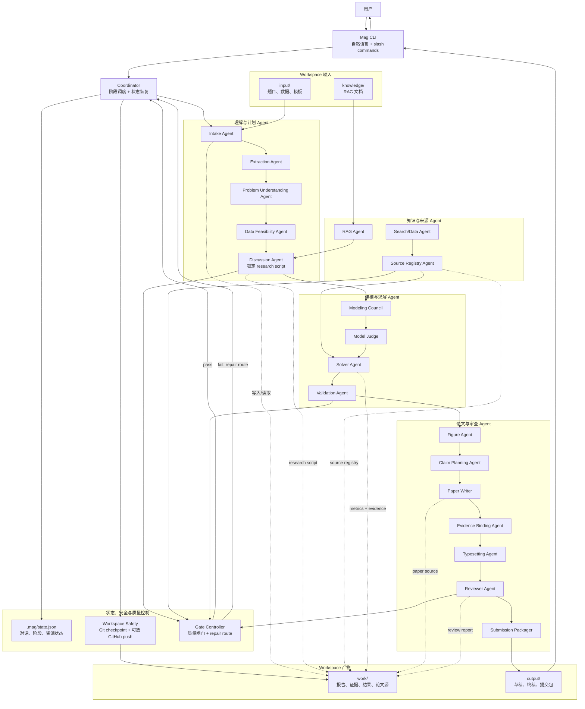

# Mag 命令行数学建模 Agent 设计文档

最后更新：2026-06-19

## 1. 产品定位

Mag 是一个本地命令行数学建模 Agent。用户从 GitHub 看到项目后，通过一条安装命令把
`mag` 安装到本机。安装完成后，用户在任意新建的赛题文件夹里输入：

```bash
mag
```

即可进入一个类似 Claude Code / Codex CLI 的交互式 Agent 界面。用户可以直接用自然语言
与 Agent 讨论，也可以输入以 `/` 开头的命令来导入题目、导入数据、配置 API、导入 RAG
资料、启动建模流程、查看状态和修改论文。

Mag 的目标不是做一个普通聊天机器人，而是做一个围绕 MCM/ICM 数学建模论文的本地工作台：

```text
安装 mag
  -> 在赛题文件夹运行 mag
  -> 初始化 workspace
  -> 自动创建本地 Git 安全网
  -> 配置最少必要 API
  -> 导入题目、数据、模板、RAG 资料
  -> 与 Agent 讨论研究方向
  -> 检查数据可得性
  -> 确认最终论文脚本
  -> 自动建模、求解、写作、排版、审查
  -> 用户反馈修改
  -> 循环修订直到提交包可用
```

设计上，用户应该感知到的是“一个命令行工具”，而不是“一个 Python 包”。Python 只是当前
实现和分发方式。正式文档和启动体验都应该围绕 `mag` 命令，而不是围绕 `python -m pip`
或内部模块名。

## 2. 用户视角的一键安装

### 2.1 GitHub 页面上的安装体验

用户从 GitHub README 看到一条安装命令，例如：

```bash
curl -fsSL https://raw.githubusercontent.com/jsyzlbw/MCM-ICM-Agent/main/install.sh | bash
```

安装脚本负责：

1. 检查本机是否有可用 Python 运行时，推荐 Python 3.12 或以上。
2. 优先使用隔离安装方式安装 Mag，例如 `pipx`、`uv tool` 或项目自带安装目录。
3. 把 `mag` 命令加入用户 PATH。
4. 打印安装结果和下一步指令。

用户预期看到：

```text
Mag installed successfully.

Next:
  mkdir my-mcm-task
  cd my-mcm-task
  mag
```

### 2.2 安装后的全局命令

安装后，用户可以在 `~` 或任意目录运行：

```bash
mag -v
```

输出：

```text
mag 0.1.0
```

这一步只验证命令是否安装成功，不创建 workspace。

## 3. Workspace 入口行为

### 3.1 用户创建新文件夹并运行 `mag`

典型用户流程：

```bash
mkdir 2026-mcm-c
cd 2026-mcm-c
mag
```

Mag 启动后首先检查当前目录：

1. 当前目录是否已经是 Mag workspace。
2. 当前目录是否为空。
3. 当前目录是否非空但不是 Mag workspace。

### 3.2 Workspace 识别规则

一个目录被认为是 Mag workspace，需要至少满足：

- 存在 `.mag/workspace.json`。
- 存在 `.mag/state.json`。
- 存在 Mag 管理的基础目录结构。

推荐 workspace 标记文件：

```text
.mag/
  workspace.json
  state.json
```

`workspace.json` 用于记录 workspace 元信息：

```json
{
  "schema_version": 1,
  "workspace_id": "2026-mcm-c",
  "created_at": "2026-06-19T10:00:00+08:00",
  "mag_version": "0.1.0",
  "status": "initialized"
}
```

`state.json` 用于记录当前对话、阶段、已导入资源和 workflow 状态摘要。

### 3.3 空目录第一次运行

如果当前目录为空，输入 `mag` 后自动初始化 workspace。

Mag 创建：

```text
.
├── .git/
├── .gitignore
├── .env
├── .mag/
│   ├── workspace.json
│   ├── state.json
│   ├── config.toml
│   ├── chat/
│   │   ├── messages.jsonl
│   │   └── sessions/
│   ├── logs/
│   └── cache/
├── input/
│   ├── problem/
│   ├── data/
│   ├── layout/
│   └── notes/
├── knowledge/
│   ├── papers/
│   ├── methods/
│   ├── rules/
│   └── cases/
├── work/
│   ├── parsed/
│   ├── reports/
│   ├── discussion/
│   ├── data/
│   ├── results/
│   ├── figures/
│   ├── paper/
│   └── review/
└── output/
    ├── draft/
    ├── final/
    └── package/
```

目录职责：

| 路径 | 作用 |
|---|---|
| `.git/` | 保存本地 checkpoint 历史，用于恢复 Agent 误删或误改的文件。 |
| `.gitignore` | 排除 `.env`、缓存、敏感日志和本地临时文件。 |
| `.env` | 保存 API key。默认创建但不提交。 |
| `.mag/config.toml` | 保存非 secret 用户设置，例如默认模型、语言、偏好、启用的 provider。 |
| `.mag/state.json` | 保存 workspace 当前阶段、初始化状态、导入资源摘要。 |
| `.mag/chat/messages.jsonl` | 保存用户与 Agent 的对话历史。 |
| `.mag/logs/` | 保存运行日志、错误日志、provider 调用摘要。 |
| `.mag/cache/` | 保存本地缓存，例如 embedding cache、索引缓存。 |
| `input/problem/` | 保存题目文件。 |
| `input/data/` | 保存题目给出的数据附件。 |
| `input/layout/` | 保存论文模板、格式说明、LaTeX 模板。 |
| `input/notes/` | 保存用户额外要求、人工说明、赛题解读笔记。 |
| `knowledge/` | 保存用户导入的 RAG 文档。 |
| `work/` | 保存 Agent 中间工作产物。 |
| `output/` | 保存用户最终需要看的草稿、终稿和提交包。 |

初始化完成后，Mag 必须创建第一个 Git checkpoint commit，例如：

```text
mag workspace initialized
```

这个 checkpoint 是 workspace 的安全基线。之后 Agent 每轮完成有意义的文件修改，都应该继续
创建 checkpoint，让用户可以从 Git 历史恢复误删、误覆盖或错误生成的内容。

### 3.4 非空目录第一次运行

如果当前目录非空，但不是 Mag workspace，Mag 不直接初始化。

提示：

```text
当前文件夹不为空，并且没有发现 Mag workspace。

为了避免混入已有文件，建议在空文件夹中运行：
  mkdir my-mcm-task
  cd my-mcm-task
  mag

如果你确认要把当前文件夹作为 Mag workspace，可以运行：
  mag init --force
```

默认策略是中止，而不是询问 y/n 后继续。这一点与早期 `mag init` 的行为不同：裸 `mag`
应该更谨慎，因为它是普通用户入口。

### 3.5 已有 workspace 再次运行

如果当前目录已经是 Mag workspace，输入 `mag` 后恢复之前工作：

- 加载 `.mag/state.json`。
- 加载 `.mag/chat/messages.jsonl`。
- 检查是否有未完成 workflow。
- 检查是否有失败 gate。
- 进入交互界面。

启动摘要示例：

```text
Mag workspace detected: 2026-mcm-c

Problem: input/problem/problem.pdf
Data: 3 files
RAG: 12 documents
Current stage: discussion
Last update: 2026-06-19 11:40

Type naturally to continue, or use /start, /status, /api.
```

## 4. 交互式 CLI 启动界面

### 4.1 基本形态

用户输入 `mag` 后，进入一个长期运行的终端交互界面。它应该像 Claude Code / Codex CLI
一样自然：

```text
╭────────────────────────────────────────────╮
│ Mag                                        │
│ MCM/ICM Modeling Agent                     │
╰────────────────────────────────────────────╯

Workspace: 2026-mcm-c
Status: not initialized

Type /init to set up this workspace.
Type /help to see commands.

> 
```

用户可以输入自然语言：

```text
> 这个题目我想用排队论和多目标优化结合，你觉得可行吗？
```

也可以输入 slash command：

```text
> /api
> /question
> /data
> /start
```

### 4.2 Slash command 设计原则

1. `/` 开头的命令用于明确操作。
2. 非 `/` 输入默认为自然语言消息，交给 Agent 处理。
3. 命令应该能引导用户逐步填写信息。
4. 命令应该支持中途取消，例如输入 `cancel` 或按 `Ctrl+C` 回到主对话。
5. 命令执行结果必须写入 workspace state，方便下次 `mag` 恢复。

## 5. 必须支持的 slash commands

### 5.1 `/api`

用途：查看和配置 API。

用户输入：

```text
> /api
```

Mag 显示：

```text
API status

Required:
  [missing] LLM API        OpenAI-compatible / other supported LLM

Recommended:
  [missing] Search API     web search for public data and references
  [missing] arXiv API      academic paper search

Optional:
  [disabled] GitHub        optional checkpoint push
  [missing] Firecrawl      web extraction
  [missing] Voyage         embedding and rerank
  [missing] FRED           economic data
  [missing] NOAA           climate data
  [missing] Census         census data
  [missing] MinerU         PDF parsing
```

原则：

- LLM API 是唯一强制项。
- Search、arXiv 这类高概率会用到的 API 属于 recommended。
- 数据库类 API 只有在题目分析或讨论中发现需要时才提示配置。
- GitHub 自动 push 是 optional，只有用户显式开启后才把 checkpoint 同步到云端。
- 用户可以对非必需 API 选择“暂不启用”。

交互示例：

```text
LLM API is required before Mag can reason about your task.
Configure now? [Y/n]:

Provider:
  1. OpenAI-compatible
  2. DeepSeek-compatible
  3. Custom base URL

Select provider: 1
API key: ********
Base URL [https://api.openai.com/v1]:
Model [gpt-4.1]:

Saved to .env and .mag/config.toml.
```

`.env` 保存 secret：

```dotenv
MAG_LLM_API_KEY=
MAG_SEARCH_API_KEY=
MAG_ARXIV_API_KEY=
MAG_FIRECRAWL_API_KEY=
MAG_VOYAGE_API_KEY=
MAG_GITHUB_TOKEN=
```

`.mag/config.toml` 保存非 secret：

```toml
[llm]
provider = "openai_compatible"
base_url = "https://api.openai.com/v1"
model = "gpt-4.1"
enabled = true

[search]
enabled = false

[arxiv]
enabled = false

[git]
enabled = true
checkpoint = true
auto_push = false
remote = "origin"
branch = "main"
```

### 5.2 `/rag`

用途：导入 RAG 文档，例如优秀论文、方法笔记、比赛规则、评分标准、模板说明。

用户输入：

```text
> /rag
```

Mag 引导：

```text
Paste one or more file paths.
Supported: .pdf, .md, .txt, .docx
Separate multiple paths by new lines.
Type done when finished.

Path:
```

用户粘贴：

```text
/Users/me/Papers/mcm_gold_paper_2024.pdf
/Users/me/Notes/queueing_methods.md
done
```

Mag 复制并组织：

```text
knowledge/
  papers/
    mcm_gold_paper_2024.pdf
  methods/
    queueing_methods.md
```

导入后，Mag 建立文档记录：

```json
{
  "document_id": "rag_20260619_001",
  "source_path": "/Users/me/Papers/mcm_gold_paper_2024.pdf",
  "workspace_path": "knowledge/papers/mcm_gold_paper_2024.pdf",
  "type": "paper",
  "usage": "methodology_guidance",
  "indexed": false
}
```

重要规则：

- RAG 文档默认只作为方法论、写作结构、建模套路和 review checklist 参考。
- RAG 文档不能自动成为论文事实来源。
- 如果要把某个 RAG 文档当作引用来源，必须经过 source verification。

### 5.3 `/question`

用途：导入本次数学建模题目。

用户输入：

```text
> /question
```

Mag 引导：

```text
Paste the problem file path.
Supported: .pdf, .md, .txt, .docx

Problem path:
```

用户输入：

```text
/Users/me/Downloads/2026_MCM_Problem_C.pdf
```

Mag 复制到：

```text
input/problem/2026_MCM_Problem_C.pdf
```

并更新 state：

```json
{
  "problem": {
    "path": "input/problem/2026_MCM_Problem_C.pdf",
    "status": "imported"
  }
}
```

如果已有题目，Mag 提示：

```text
A problem file already exists:
  input/problem/2026_MCM_Problem_C.pdf

Replace it? [y/N]:
```

### 5.4 `/data`

用途：导入题目给出的数据附件。

用户输入：

```text
> /data
```

Mag 引导：

```text
Paste data file or folder paths.
Supported: .csv, .xlsx, .json, .txt, .zip, folders
Type done when finished.

Path:
```

用户输入多个文件或文件夹后，Mag 复制到：

```text
input/data/
```

如果用户输入文件夹，Mag 保留其相对结构：

```text
input/data/raw_city_indicators/city.csv
input/data/raw_city_indicators/readme.txt
```

导入后，Mag 做轻量检查：

- 文件是否存在。
- 文件大小是否异常。
- CSV/XLSX 是否可读。
- 是否需要解压。
- 是否和题目文件明显相关。

### 5.5 `/layout`

用途：导入论文模板、LaTeX 模板、格式要求、官方样式文件。

用户输入：

```text
> /layout
```

Mag 引导用户粘贴模板文件或目录路径，并复制到：

```text
input/layout/
```

支持：

- `.tex`
- `.cls`
- `.sty`
- `.bib`
- `.docx`
- `.pdf`
- 模板文件夹

如果没有模板，用户可以选择跳过：

```text
No layout template? You can skip this step.
Skip layout import? [Y/n]:
```

### 5.6 `/init`

用途：初始化或重新初始化 workspace。

#### 第一次打开 workspace

如果 workspace 尚未完成初始化，`/init` 引导用户完成：

1. 配置 LLM API。
2. 选择是否启用搜索。
3. 选择是否启用 arXiv 或学术搜索。
4. 选择是否启用 GitHub 自动 push。
5. 导入 RAG 文档。
6. 导入题目。
7. 导入题目数据。
8. 导入论文模板。
9. 确认默认语言和输出偏好。

初始化完成后，`.mag/state.json` 中记录：

```json
{
  "init": {
    "completed": true,
    "llm_configured": true,
    "problem_imported": true,
    "rag_documents": 12,
    "data_files": 3,
    "layout_imported": true
  }
}
```

#### 非第一次打开 workspace

如果 workspace 已经初始化，用户再次输入：

```text
> /init
```

Mag 警告：

```text
This workspace has already been initialized.

Choose:
  1. Cancel
  2. Re-think only: clear chat and generated reasoning, keep API/RAG/input files
  3. Full reset: clear all Mag files, including RAG, API config, inputs, outputs
```

选择 2：重新思考。

- 清空 `.mag/chat/`
- 清空 `work/`
- 清空 `output/`
- 保留 `.env`
- 保留 `.mag/config.toml`
- 保留 `knowledge/`
- 保留 `input/`

选择 3：完全重置。

- 删除 `.mag/`
- 删除 `.env`
- 删除 `input/`
- 删除 `knowledge/`
- 删除 `work/`
- 删除 `output/`
- 重新创建空 workspace

完全重置前必须二次确认：

```text
This will delete API config, RAG documents, inputs, generated work, and outputs.
Type RESET to continue:
```

### 5.7 `/start`

用途：开始分析题目并进入正式建模讨论。

执行前检查：

- LLM API 是否配置。
- 题目是否导入。
- 当前 workspace 是否初始化。

如果缺少 LLM API：

```text
LLM API is required before analysis can start.
Configure it now? [Y/n]:
```

如果缺少题目：

```text
No problem file found.
Run /question first? [Y/n]:
```

满足条件后，`/start` 开始：

1. 读取题目。
2. 抽取任务、约束、目标、格式要求。
3. 如果有数据，做初步数据扫描。
4. 如果有 RAG，检索相关方法和论文套路。
5. 生成初始题意理解。
6. 与用户讨论研究方向。

输出示例：

```text
I have read the problem. It appears to require:

1. Constructing a risk evaluation index.
2. Forecasting future demand.
3. Optimizing allocation under constraints.

Before we lock the modeling script, I need to check whether the required data is available.
May I search for public sources now? [Y/n]:
```

### 5.8 `/git`

用途：查看和管理 workspace 的 Git 安全网。

用户输入：

```text
> /git
```

Mag 显示：

```text
Git safety net

Local repository: enabled
Working tree: clean
Last checkpoint: mag: lock research script
Remote sync: disabled
Auto push: disabled
```

`/git` 至少支持：

- 查看本地 checkpoint 状态。
- 查看是否有未提交修改。
- 查看 remote 是否配置。
- 开启或关闭 GitHub 自动 push。
- 展示最近一次 push 错误。
- 给出从 checkpoint 恢复的提示。

GitHub 自动 push 默认关闭。用户开启时，Mag 必须先确认 `.gitignore` 已排除 `.env` 和敏感缓存。
开启后，每次 checkpoint commit 完成后尝试 push。push 失败不阻断本地 workflow，只记录状态并提示用户。

## 6. 未完成 `/init` 时的自然语言对话

用户可能第一次进入 workspace 后直接输入自然语言，例如：

```text
> 帮我分析这个题，我想做一个偏优化的方案
```

Mag 不应该直接假装可以工作。它要检查初始化状态。

### 6.1 缺少 LLM API

如果 LLM API 未配置：

```text
LLM API 尚未配置。Mag 需要 LLM API 才能与你讨论题目和生成方案。

是否现在配置？ [Y/n]:
```

如果用户选择 `n`：

```text
已跳过。你可以稍后输入 /api 配置 LLM API。
在配置 LLM API 前，Mag 只能导入文件和查看状态，不能进行题目分析。
```

### 6.2 缺少可选 API

如果缺少 search、arXiv、数据库 API，不阻止普通对话。Mag 可以提示：

```text
Search API 尚未配置。之后如果需要联网检索数据或参考资料，我会再提示你配置。
现在可以先继续讨论。
```

原则：

- LLM API：必须。
- Search、arXiv：强烈建议，但可以暂不启用。
- 数据库 API：按题目需要再配置。
- MinerU、embedding、humanizer：按实际阶段需要再配置。

## 7. 最少但必要的 API 策略

### 7.1 初始化阶段只要求高概率必需项

`/init` 阶段默认只强制配置：

- LLM API。

`/init` 阶段建议配置：

- Search API。
- arXiv 或学术搜索能力。
- MinerU。
- Voyage embedding。
- Humanizer。

`/init` 阶段不强制配置：

- GitHub 自动 push。
- FRED。
- NOAA。
- US Census。
- World Bank。
- OECD。
- UNData。
- NASA POWER。
- Overpass。
- Firecrawl。

### 7.2 需要时再配置专业 API

Agent 在题目分析、研究方向讨论和数据可得性检查中，发现需要特定 API 时再提示用户。

示例：

```text
This plan needs historical US county-level population and income data.
The US Census API is likely useful.

Configure Census API now?
  1. Configure now
  2. Continue with manual uploaded data
  3. Change the modeling plan
```

再例如：

```text
This plan requires daily weather history.
NOAA or NASA POWER may provide the needed data.

Recommended:
  - NOAA for station observations
  - NASA POWER for gridded climate variables

Configure one now? [y/N]:
```

## 8. 研究方向讨论与数据可得性检查

### 8.1 先讨论，不急于写论文

用户完成 `/init` 后，可以自然语言与 Agent 讨论：

```text
> 我想用多目标优化和图模型结合，重点写得像国奖论文
```

Agent 应该围绕以下问题进行讨论：

- 题目要求到底是什么。
- 每个子问题的目标和约束是什么。
- 用户希望的建模风格是什么。
- 哪些数据是题目自带的。
- 哪些数据需要外部获取。
- 哪些假设可以接受。
- 哪些模型路线更容易写出高质量论文。

### 8.2 形成“研究脚本”

讨论的目标不是闲聊，而是形成一个详细研究脚本。研究脚本应包括：

- 论文总目标。
- 子问题拆解。
- 每个子问题的模型选择。
- 数据需求清单。
- 可用数据和缺失数据。
- 需要搜索或申请的数据源。
- 指标体系。
- 求解方法。
- 图表计划。
- 论文结构。
- 风险和备选方案。

研究脚本保存到：

```text
work/discussion/research_script.md
work/discussion/research_script.json
```

### 8.3 数据可得性检查

在最终锁定研究脚本前，Agent 必须检查关键数据是否可获得。

检查顺序：

1. 用户上传的数据。
2. 题目文件中给出的数据说明。
3. 已导入 RAG 文档中提到的数据来源。
4. 公开网页搜索。
5. 学术论文和 arXiv。
6. 官方数据库。
7. 需要申请 key 或权限的数据库。

### 8.4 找不到数据时的决策

如果发现某个关键数据公开网络上找不到，但很可能存在于需要权限的数据库中，Agent 告诉用户：

```text
The required data is not publicly downloadable from ordinary web search.
It is likely available from:

  Database: NOAA Climate Data Online
  Why: station-level daily observations are usually exposed there
  Required credential: NOAA API token
  Website: https://www.ncdc.noaa.gov/cdo-web/token

Options:
  1. Configure this API and continue
  2. Upload the data manually
  3. Replace this part of the modeling plan
```

如果确认找不到可靠数据，Agent 必须建议修改写作思路：

```text
I cannot verify a reliable source for this data need.
Using it would make the paper fragile.

Recommended change:
  Replace the city-level real-time mobility variable with a proxy index based on
  population density, road network centrality, and public transport capacity.

This changes Section 3.2 and Figure 4, but keeps the overall optimization story.
```

不能继续使用不可验证数据硬写论文。

## 9. 最终论文脚本确认与实现

### 9.1 锁定研究脚本

当 Agent 和用户讨论完成后，Agent 输出最终研究脚本摘要：

```text
Ready to lock the research script.

The paper will:
  1. Build an interpretable evaluation index.
  2. Forecast demand using a lightweight time-series model.
  3. Optimize allocation with constraints.
  4. Validate robustness through sensitivity analysis.

Data status:
  - Uploaded contest data: available
  - Public demographic data: available
  - Real-time mobility data: unavailable, replaced by proxy

Lock this script and start implementation? [y/N]:
```

用户确认后，写入：

```text
work/discussion/locked_research_script.md
work/discussion/locked_research_script.json
```

### 9.2 自动实现阶段

锁定后，Agent 开始具体实现：

1. 解析题目和数据。
2. 清洗数据。
3. 构建模型。
4. 运行代码。
5. 记录证据。
6. 生成图表。
7. 写论文。
8. 编译 LaTeX。
9. 审查论文。
10. 生成草稿和提交包。

用户可以看到阶段进度：

```text
[1/10] Parsing problem
[2/10] Profiling data
[3/10] Building model
[4/10] Running solver
[5/10] Validating results
[6/10] Generating figures
[7/10] Writing paper
[8/10] Compiling LaTeX
[9/10] Reviewing draft
[10/10] Packaging outputs
```

### 9.3 Agent 协作图

Mag 的多 Agent 协作以 workspace artifacts 为中心：每个 Agent 读取明确输入、写入明确输出，
由 Coordinator 调度，由 Gate Controller 检查质量，由 Workspace Safety 创建 Git checkpoint。



## 10. 用户反馈与修订循环

### 10.1 用户查看论文

Agent 生成初稿后，告诉用户输出位置：

```text
Draft generated:
  output/draft/main.pdf
  output/draft/main.tex
  output/draft/reviewer_report.md

You can ask for changes naturally, for example:
  "第二问的模型太简单，换成多目标优化"
  "摘要写得更竞赛风一点"
  "图 3 看不清，重画"
```

### 10.2 用户提出修改意见

用户自然语言输入：

```text
> 第二问的模型不够强，能不能加入网络流模型？图也要更清楚。
```

Agent 不直接改论文，而是先生成修订脚本：

```text
Revision plan:

1. Replace Q2 allocation baseline with a network-flow formulation.
2. Re-run solver for Q2.
3. Update evidence registry for affected metrics.
4. Regenerate Figure 3.
5. Rewrite model and results sections.
6. Re-run validation and final review.

Proceed? [y/N]:
```

用户确认后执行。

### 10.3 循环直到满意

每轮修订都保存：

```text
work/revisions/revision_001.md
work/revisions/revision_001.json
output/draft/revision_001/
```

循环：

```text
用户反馈
  -> Agent 生成修订脚本
  -> 用户确认
  -> Agent 实现修订
  -> 重新验证、写作、排版、审查
  -> 用户继续反馈或接受
```

## 11. 交互状态机

Mag 的高层状态：

```text
not_workspace
  -> workspace_initialized
  -> init_incomplete
  -> init_complete
  -> discussing
  -> checking_data_feasibility
  -> script_locked
  -> implementing
  -> draft_ready
  -> revising
  -> final_ready
  -> blocked
```

状态含义：

| 状态 | 含义 |
|---|---|
| `not_workspace` | 当前目录不是 Mag workspace。 |
| `workspace_initialized` | 目录结构已创建，但配置和题目可能未完成。 |
| `init_incomplete` | `/init` 尚未完成。 |
| `init_complete` | 必要配置和输入已完成。 |
| `discussing` | 用户与 Agent 正在讨论研究方向。 |
| `checking_data_feasibility` | Agent 正在检查数据可得性。 |
| `script_locked` | 最终研究脚本已确认。 |
| `implementing` | Agent 正在建模、求解、写作、排版。 |
| `draft_ready` | 初稿已生成，等待用户反馈。 |
| `revising` | 正在执行用户修订意见。 |
| `final_ready` | 最终提交包已生成。 |
| `blocked` | 某个关键条件失败，需要用户决策或补充资源。 |

## 12. 和当前已实现系统的关系

当前仓库已经实现了很多底层能力：

- workspace artifact contract
- graph-aware stage executor
- provider abstraction
- fake/demo provider
- RAG v2
- 数据可行性检查
- modeling council / model judge
- solver modules
- evidence registry
- figure planning
- paper writer
- review gate
- submission packager

新的设计不是推翻这些能力，而是把它们包装到更自然的 CLI 产品入口中。

当前偏开发者的命令：

```bash
mag run
mag resume
mag inspect
mag provider-smoke
```

仍然可以保留，但它们应该成为高级命令。普通用户的默认入口应该是：

```bash
mag
```

## 13. 实施优先级

### P0：让 `mag` 裸命令进入交互式 CLI

必须完成：

- `mag` 无参数启动。
- 识别当前目录是否 workspace。
- 空目录自动创建 workspace。
- workspace 创建时自动初始化 Git 安全网。
- 创建 `.gitignore` 并排除 `.env`、缓存和敏感日志。
- 初始化后创建第一个 checkpoint commit。
- 非空非 workspace 目录提示用户去空目录。
- 已有 workspace 自动恢复。
- 提供基本输入框。
- 支持 `/help`、`/api`、`/init`、`/question`、`/data`、`/rag`、`/layout`、`/start`。

### P1：实现最小可用 `/init`

必须完成：

- LLM API 配置。
- API 状态展示。
- 题目导入。
- 数据导入。
- RAG 导入。
- 模板导入。
- init state 持久化。
- `/git` 状态展示。
- GitHub 自动 push 可选配置。

### P2：自然语言对话与初始化守卫

必须完成：

- 未配置 LLM 时拦截自然语言对话。
- 未导入题目时引导 `/question`。
- 非必需 API 可以跳过。
- 对话历史写入 `.mag/chat/messages.jsonl`。

### P3：研究脚本与数据可得性检查

必须完成：

- 讨论后生成 `research_script.md/json`。
- 锁定前检查关键数据。
- 找不到数据时建议 API、手动上传或换思路。
- 用户确认后写入 locked script。

### P4：接入现有 workflow 自动实现

必须完成：

- 从 locked script 映射到现有 workflow input。
- 复用现有 StageExecutor。
- 把中间产物映射到 `work/`。
- 把最终可读产物映射到 `output/`。

### P5：修订循环

必须完成：

- 用户反馈后生成修订脚本。
- 用户确认后局部重跑。
- 保存 revision history。
- 输出新 draft。

## 14. 设计原则总结

1. 用户只需要记住 `mag`。
2. `mag` 默认是交互式 Agent，不是传统参数型 CLI。
3. `/` 命令负责明确动作，自然语言负责讨论和决策。
4. LLM API 是唯一必须提前配置的 API。
5. 其他 API 遵循最少但必要原则，在真正需要时再配置。
6. 数据可得性检查必须发生在锁定最终研究脚本之前。
7. 找不到可靠数据时，必须提示申请 API、手动上传或修改写作思路。
8. Agent 不应绕过用户直接锁定研究方向。
9. 创建 workspace 时默认启用本地 Git checkpoint 安全网。
10. GitHub 自动 push 必须由用户显式开启，默认只保存本地 checkpoint。
11. 每次重要决策都要写入 workspace。
12. 每次生成论文前都要有可审计的研究脚本、证据、图表和 review 记录。

## 15. 用户需求覆盖表

| 用户场景 | 文档覆盖位置 |
|---|---|
| 从 GitHub 看到项目，一键安装 `mag` | 第 2 节：用户视角的一键安装。 |
| 在新文件夹运行 `mag` 自动创建结构 | 第 3.1、3.3 节：Workspace 入口行为和空目录初始化。 |
| 创建 workspace 时自动创建 Git 项目，防止 Agent 误删文件 | 第 3.3、5.8、13、14 节：Git checkpoint 安全网。 |
| 可选 GitHub 项目，每次修改后 Agent push 到云端 | 第 5.1、5.8、7、13、14 节：GitHub 自动 push 可选配置。 |
| 非空目录检查是否已有 workspace，否则提示去空文件夹 | 第 3.2、3.4、3.5 节：识别规则、非空目录处理、已有 workspace 恢复。 |
| 启动后像 Claude Code / Codex CLI 一样自然语言对话 | 第 4 节：交互式 CLI 启动界面。 |
| 支持 `/api`、`/rag`、`/question`、`/data`、`/layout`、`/init`、`/start` | 第 5 节：必须支持的 slash commands。 |
| 未完成 `/init` 就对话时提示 API 配置，且只有 LLM 必须 | 第 6、7 节：初始化守卫和最少但必要 API 策略。 |
| 讨论研究方向后检查数据可得性，必要时提示申请 API 或换思路 | 第 8 节：研究方向讨论与数据可得性检查。 |
| 锁定论文脚本后开始实现并生成论文 | 第 9 节：最终论文脚本确认与实现。 |
| 用户查看论文后反馈修改，Agent 循环修订 | 第 10 节：用户反馈与修订循环。 |
