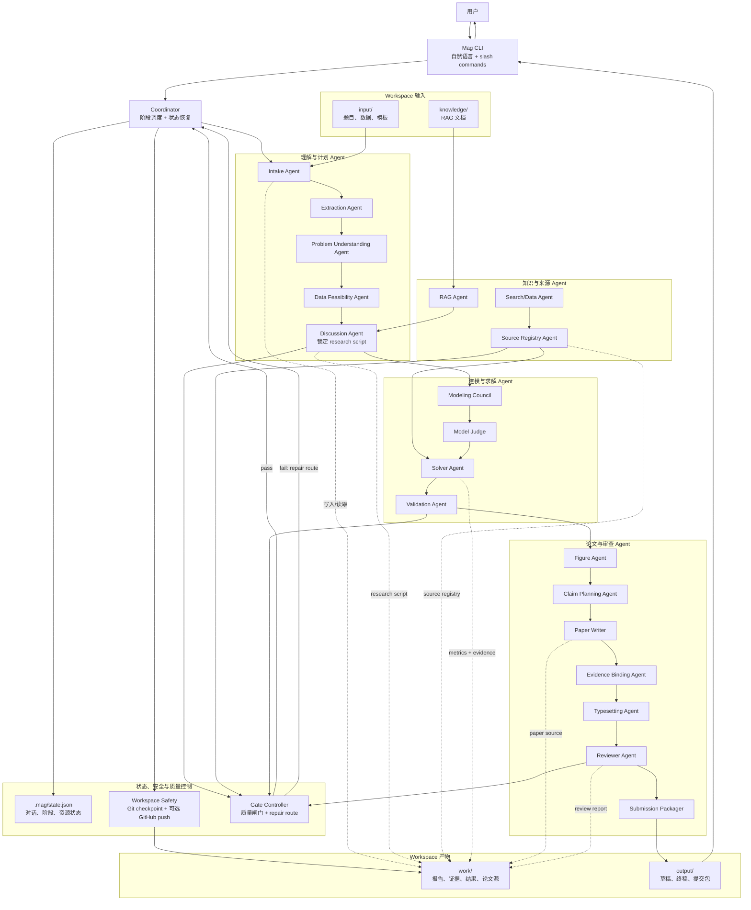

# 03. Agent 工作流设计

## 1. 目标

Mag 的 Agent 工作流必须可审计、可恢复、可修复。它不应该只输出一篇论文，而要输出从题意理解
到最终提交包的完整证据链。

## 2. 高层流程

```text
题目导入
  -> 题面抽取
  -> 题意理解
  -> 数据可行性检查
  -> 用户讨论与方向锁定
  -> RAG 方法检索
  -> 建模候选
  -> 模型裁决
  -> 数据搜索与注册
  -> EDA
  -> 求解
  -> 验证
  -> 图表规划与生成
  -> claim planning
  -> 论文写作
  -> 证据绑定
  -> 排版与修复
  -> 最终审稿
  -> 打包
```

## 3. Agent 协作图

Mag 的 Agent 不是彼此共享一段隐藏上下文，而是围绕 workspace 中的 artifacts 协作。每个阶段
读取明确输入、写入明确输出，再由 gate 判断是否进入下一阶段或回到责任阶段修复。



这张图表达三个设计约束：

1. CLI 只负责交互和命令分发，不把所有业务逻辑塞进终端层。
2. Agent 通过 workspace artifacts 协作，关键输出必须可审计、可恢复。
3. Gate Controller 和 Workspace Safety 是横切能力：前者防止错误结果继续传播，后者防止高权限
   文件操作造成不可恢复损失。

## 4. Stage 列表

| Stage | 职责 | 关键输出 |
|---|---|---|
| `intake` | 建立输入契约。 | input manifest |
| `document_extraction` | 解析题目。 | parsed problem |
| `problem_understanding` | 拆解问题。 | understanding report |
| `data_feasibility_scout` | 检查关键数据可得性。 | feasibility report |
| `user_discussion` | 与用户确认方向。 | research script |
| `methodology_rag` | 检索方法和论文套路。 | RAG hits |
| `modeling_council` | 提出候选模型。 | model candidates |
| `model_judge` | 选择模型路线。 | experiment spec |
| `search_data` | 搜索并注册来源。 | source registry |
| `data_eda` | 数据清洗与画像。 | processed data |
| `solver_coder` | 建模求解。 | metrics, evidence |
| `validation_gate` | 验证结果。 | validation decision |
| `figure_planning` | 规划图表。 | figure plan |
| `visualization` | 生成图表。 | figure registry |
| `claim_planning` | 规划论文论断。 | claim plan |
| `paper_writer` | 写 LaTeX 论文。 | paper source |
| `paper_evidence_binding` | 检查证据绑定。 | binding report |
| `typesetting` | 编译和排版修复。 | PDF, QA report |
| `pre_submission_review` | 最终审稿。 | reviewer report |
| `submission_packager` | 打包提交材料。 | zip package |

## 5. Gate 设计

Gate 是 workflow 的质量闸门。失败时不能继续假装完成。

Gate decision 格式：

```json
{
  "gate_id": "validation_gate",
  "status": "fail",
  "failure_reason": "bad_results",
  "repair_stage": "solver_coder",
  "blocking_findings": ["Missing evidence for metric."]
}
```

## 6. 主要 Gate

| Gate | 失败原因示例 | 修复阶段 |
|---|---|---|
| extraction gate | 题面为空、公式缺失 | document_extraction |
| modeling gate | 模型不可执行、指标不明确 | modeling_council |
| source gate | 来源不可靠、数据不足 | search_data |
| validation gate | 结果缺失、约束违反 | solver_coder/search_data |
| figure gate | 图表不可读、缺 vector 输出 | figure_planning |
| paper evidence gate | claim 无证据 | claim_planning/paper_writer |
| final gate | PDF 缺失、审稿 blocker | 对应责任阶段 |

## 7. Repair Flow

修复流程：

```text
stage produces artifact
  -> gate checks artifact
  -> gate pass: next stage
  -> gate fail: repair stage
  -> repaired artifact
  -> gate re-check
```

如果同一 gate 反复失败，应进入 `blocked` 状态，并要求用户决策。

## 8. 用户参与点

用户必须参与：

- 确认研究方向。
- 接受数据不可得时的改写策略。
- 锁定最终研究脚本。
- 确认重大修订脚本。

用户可以选择自动批准：

- 常规图表重绘。
- 小范围文案修订。
- 非关键格式修复。

## 9. 与交互式 CLI 的关系

`mag` 交互界面不直接展示所有 stage 细节。它应该把复杂 workflow 翻译成用户能理解的状态：

```text
正在理解题目
正在检查数据
正在和你确认研究方向
正在运行模型
正在写论文
正在审查
```

开发者可用 `mag inspect` 查看底层 stage、gate 和 artifact。
