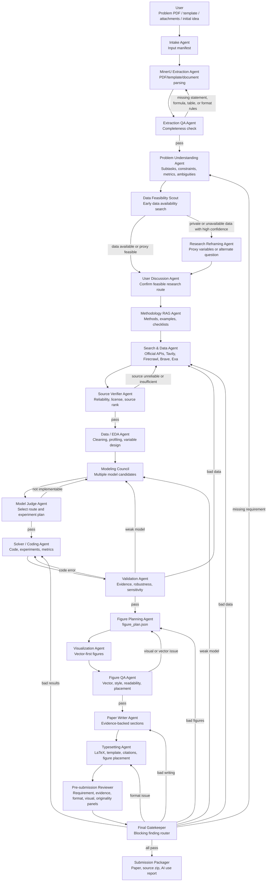

# Agent Topology

This document defines the collaboration topology for the MCM/ICM agent system. The
runtime should be treated as a checkpointed workflow graph, not a single linear chain.
Each agent reads registered artifacts, writes new artifacts, and passes through explicit
quality gates before downstream agents can rely on the result.

## Design Principle

The system must discover data feasibility before the user commits to a research route.
For example, if a problem asks for a salary strategy for football players, detailed salary,
bonus, and contract terms may be private or incomplete. In that case the agent should not
continue as if the data exists. It should classify the data gap, propose proxy variables,
ask whether the user can provide private assumptions, or reframe the study around public
performance, market value, transfer fee, team revenue, injury history, or ranking data.

## Main Workflow Graph



## Data Feasibility Before User Discussion

The user discussion stage should receive a data feasibility report, not just a problem
understanding report. This prevents the agent and user from agreeing on an elegant plan
that later collapses because the required data is private, expensive, unavailable, or too
sparse.

`Data Feasibility Scout` classifies each critical dataset as:

- `available`: public or user-provided data appears sufficient.
- `proxy_required`: direct data is unavailable, but public proxy variables can support a
  defensible model.
- `private_or_unavailable`: the direct data is likely not obtainable; the research route
  must be reframed or explicitly assumption-driven.
- `unknown`: more search is needed before direction lock.

Recommended behavior:

| Data state | Next stage | Action |
|---|---|---|
| Available | User Discussion | Present route and data sources to the user. |
| Proxy required | User Discussion | Ask the user to approve proxy variables and limitations. |
| Private or unavailable | Research Reframing | Propose proxy-data plans or change the research question. |
| Unknown | Search & Data | Continue targeted search and log uncertainty. |

Example for private salary data:

```text
Unavailable target:
  Player salary, bonus clauses, and internal club compensation standards.

Proxy candidates:
  public market value, transfer fee, playing time, goals, assists, expected goals,
  injury record, age, position, league strength, team revenue, attendance, rankings.

Possible reframing:
  Instead of estimating exact salary, design a transparent compensation score or salary
  band strategy that clubs can calibrate with private budgets.
```

## Review Feedback Routing

The final reviewer should not merely say "failed." It must route each blocking finding to
the responsible repair stage.

| Finding category | Repair stage |
|---|---|
| Requirement missed | Problem Understanding Agent |
| Data unavailable or unreliable | Search & Data Agent |
| Model weak or mismatched | Modeling Council |
| Code or result error | Solver / Coding Agent |
| Evidence gap | Solver / Coding Agent |
| Figure quality issue | Figure Planning Agent |
| Writing issue | Paper Writer Agent |
| Format or layout issue | Typesetting Agent |
| Humanization changed facts | Paper Writer Agent |

## Runtime Artifacts

Every workspace stores the active topology snapshot:

```text
workflow_topology.json
```

The snapshot contains:

- `nodes`: agent responsibilities, inputs, outputs, and pass criteria.
- `edges`: normal pass paths and special conditional paths.
- `failure_routes`: review or gate failures mapped to repair stages.

This file lets the system explain why it is returning to a prior stage and gives future UI
work a clean source for drawing the workflow graph.

## Implementation Roadmap

1. Keep `workflow_topology.json` generated at workspace creation.
2. Add concrete `DataFeasibilityScoutAgent` that writes `reports/data_feasibility_report.md`.
3. Insert the scout before `UserDiscussionAgent` in `run_mvp_workflow`.
4. Add gate agents that write machine-readable decisions, not only markdown reports.
5. Replace the current linear workflow with a coordinator-driven stage executor that can
   follow `failure_routes` automatically.
