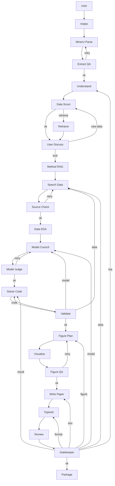

# Agent Topology

This document defines the collaboration topology for the MCM/ICM agent system. The
runtime should be treated as a checkpointed workflow graph, not a single linear chain.
Each agent reads registered artifacts, writes new artifacts, and passes through explicit
quality gates before downstream agents can rely on the result.

## Design Principle

The system must discover data feasibility before the user commits to a research route.
For example, if a problem asks for a salary strategy for football players, detailed salary,
bonus, and contract terms may be private or incomplete. In that case the agent should not
continue as if the data exists. It should classify the data gap, propose proxy variables,
ask whether the user can provide private assumptions, or reframe the study around public
performance, market value, transfer fee, team revenue, injury history, or ranking data.

## Main Workflow Graph



Short labels are intentional so the diagram renders cleanly in GitHub and Mermaid
previewers. The full responsibilities are:

| Short label | Full agent | Main responsibility |
|---|---|---|
| User | User | Provides problem PDF, template, attachments, and initial ideas. |
| Intake | Intake Agent | Copies inputs and writes the input manifest. |
| MinerU Parse | MinerU Extraction Agent | Parses PDFs, templates, tables, formulas, and images. |
| Extract QA | Extraction QA Agent | Checks whether the parsed problem is complete enough to reason about. |
| Understand | Problem Understanding Agent | Extracts subtasks, constraints, metrics, ambiguities, and implicit assumptions. |
| Data Scout | Data Feasibility Scout | Checks whether critical data is public, proxy-needed, private, or unknown before user discussion. |
| Reframe | Research Reframing Agent | Converts unavailable-data plans into proxy-data or alternate-question routes. |
| User Discuss | User Discussion Agent | Confirms a feasible research direction; sends new data-dependent ideas back to Data Scout. |
| Method RAG | Methodology RAG Agent | Retrieves modeling methods, excellent-paper patterns, and review checklists. |
| Search Data | Search & Data Agent | Uses official APIs, Tavily, Firecrawl, Brave, and Exa to collect data and sources. |
| Source Check | Source Verifier Agent | Checks source reliability, license, rank, and whether data can support claims. |
| Data EDA | Data / EDA Agent | Cleans data, profiles fields, designs variables, and documents limitations. |
| Model Council | Modeling Council | Generates multiple candidate modeling routes. |
| Model Judge | Model Judge Agent | Selects the model route and experiment plan. |
| Solver Code | Solver / Coding Agent | Writes code, runs experiments, and registers evidence. |
| Validate | Validation Agent | Checks robustness, sensitivity, metrics, and evidence coverage. |
| Figure Plan | Figure Planning Agent | Plans every figure's purpose, data source, and target section. |
| Visualize | Visualization Agent | Generates vector-first plots and diagrams. |
| Figure QA | Figure QA Agent | Checks vector output, visual style, readability, captions, and placement. |
| Write Paper | Paper Writer Agent | Writes evidence-backed paper sections. |
| Typeset | Typesetting Agent | Assembles LaTeX, citations, template rules, page limits, and figure placement. |
| Review | Pre-submission Reviewer | Runs requirement, evidence, format, visual, and originality review panels. |
| Gatekeeper | Final Gatekeeper | Routes blocking findings back to the responsible repair stage. |
| Package | Submission Packager | Produces final paper, source zip, AI use report, and submission checklist. |

## Data Feasibility Before User Discussion

The user discussion stage should receive a data feasibility report, not just a problem
understanding report. This prevents the agent and user from agreeing on an elegant plan
that later collapses because the required data is private, expensive, unavailable, or too
sparse.

The loop is intentional:

```text
Data Scout -> User Discuss -> Data Scout
```

If the user introduces a new idea during discussion, and that idea depends on a new dataset,
the workflow must return to `Data Scout` before the direction is locked. Only when both the
research idea and its data assumptions are feasible does `User Discuss` move forward to
`Method RAG`.

`Data Feasibility Scout` classifies each critical dataset as:

- `available`: public or user-provided data appears sufficient.
- `proxy_required`: direct data is unavailable, but public proxy variables can support a
  defensible model.
- `private_or_unavailable`: the direct data is likely not obtainable; the research route
  must be reframed or explicitly assumption-driven.
- `unknown`: more search is needed before direction lock.

Recommended behavior:

| Data state | Next stage | Action |
|---|---|---|
| Available | User Discussion | Present route and data sources to the user. |
| Proxy required | User Discussion | Ask the user to approve proxy variables and limitations. |
| Private or unavailable | Research Reframing | Propose proxy-data plans or change the research question. |
| Unknown | Search & Data | Continue targeted search and log uncertainty. |

Example for private salary data:

```text
Unavailable target:
  Player salary, bonus clauses, and internal club compensation standards.

Proxy candidates:
  public market value, transfer fee, playing time, goals, assists, expected goals,
  injury record, age, position, league strength, team revenue, attendance, rankings.

Possible reframing:
  Instead of estimating exact salary, design a transparent compensation score or salary
  band strategy that clubs can calibrate with private budgets.
```

## Review Feedback Routing

The final reviewer should not merely say "failed." It must route each blocking finding to
the responsible repair stage.

| Finding category | Repair stage |
|---|---|
| Requirement missed | Problem Understanding Agent |
| Data unavailable or unreliable | Search & Data Agent |
| Model weak or mismatched | Modeling Council |
| Code or result error | Solver / Coding Agent |
| Evidence gap | Solver / Coding Agent |
| Figure quality issue | Figure Planning Agent |
| Writing issue | Paper Writer Agent |
| Format or layout issue | Typesetting Agent |
| Humanization changed facts | Paper Writer Agent |

## Runtime Artifacts

Every workspace stores the active topology snapshot:

```text
workflow_topology.json
```

The snapshot contains:

- `nodes`: agent responsibilities, inputs, outputs, and pass criteria.
- `edges`: normal pass paths and special conditional paths.
- `failure_routes`: review or gate failures mapped to repair stages.

This file lets the system explain why it is returning to a prior stage and gives future UI
work a clean source for drawing the workflow graph.

## Implementation Roadmap

1. Keep `workflow_topology.json` generated at workspace creation.
2. Add concrete `DataFeasibilityScoutAgent` that writes `reports/data_feasibility_report.md`.
3. Insert the scout before `UserDiscussionAgent` in `run_mvp_workflow`.
4. Add gate agents that write machine-readable decisions, not only markdown reports.
5. Replace the current linear workflow with a coordinator-driven stage executor that can
   follow `failure_routes` automatically.
