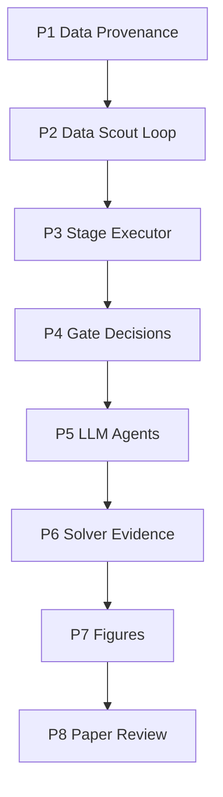

# MCM Agent Implementation Roadmap

> **For agentic workers:** REQUIRED SUB-SKILL: Use superpowers:subagent-driven-development (recommended) or superpowers:executing-plans to implement this plan task-by-task. Steps use checkbox (`- [ ]`) syntax for tracking.

**Goal:** Turn the current reference MVP into a graph-driven, source-auditable MCM/ICM agent that can discuss feasible plans with the user, bind every external datum to a source, execute modeling work, write a paper, and route review failures back to the correct repair stage.

**Architecture:** Keep the current CLI-first Python package. Add provenance contracts, gate decision contracts, and a graph-aware stage executor on top of the existing agents instead of rewriting the whole workflow. Each phase must land as a tested, independently useful increment.

**Tech Stack:** Python 3.12+, Typer, Pydantic v2, httpx, pandas, matplotlib, pytest, respx, ruff, existing provider adapters for LLM/MinerU/Tavily/Firecrawl/Brave/Exa/UShallPass.

---

## Current Baseline

Already implemented:

- Configurable providers for LLM, MinerU, Tavily, Firecrawl, Brave, Exa, and UShallPass.
- Real `mcm-agent run` command.
- Official MinerU API flow.
- Search fallback stack.
- LLM-backed problem understanding.
- UShallPass async humanization provider.
- `workflow_topology.json` generated per workspace.
- `DataFeasibilityScoutAgent` before user discussion.
- `User Discuss -> Data Scout` loop in the topology.
- Full test suite currently passing.

The next work should avoid broad rewrites. The system should mature in layers.

---

## Recommended Build Order



The most important next phase is **P1 Data Provenance**. Without it, search results may be recorded, but individual numbers used in models and citations are still too hard to audit.

---

## Phase 1: Data Provenance And Reference Binding

**Purpose:** Every external datum must be source-bound. A human reviewer should be able to trace a number in the paper back to the exact source URL, access time, provider, local extraction file, and citation candidate.

**Files:**

- Modify: `src/mcm_agent/core/models.py`
- Modify: `src/mcm_agent/core/workspace.py`
- Modify: `src/mcm_agent/agents/search_data.py`
- Modify: `src/mcm_agent/agents/eda.py`
- Modify: `src/mcm_agent/agents/solver.py`
- Modify: `src/mcm_agent/agents/reviewer.py`
- Modify: `docs/DESIGN.md`
- Create: `src/mcm_agent/core/lineage.py`
- Create: `tests/test_data_lineage.py`

**New runtime files:**

```text
data/data_lineage.json
data/citation_candidates.json
review/source_audit_report.md
```

**Core contracts:**

`DataLineageRecord` should include:

- `datum_id`
- `name`
- `value`
- `unit`
- `entity`
- `time_period`
- `source_id`
- `source_url`
- `source_title`
- `accessed_at`
- `local_path`
- `extraction_method`
- `confidence`
- `used_in`

`CitationCandidate` should include:

- `citation_id`
- `source_id`
- `title`
- `url`
- `accessed_at`
- `bibtex_key`
- `bibtex`
- `citation_note`

**Implementation steps:**

- [x] Write failing tests in `tests/test_data_lineage.py` proving a `DataLineageRecord` requires `source_id`, `source_url`, and `accessed_at`.
- [x] Add `DataLineageRecord` and `CitationCandidate` Pydantic models to `src/mcm_agent/core/models.py`.
- [x] Initialize `data/data_lineage.json` and `data/citation_candidates.json` in `create_workspace`.
- [x] Add helper functions in `src/mcm_agent/core/lineage.py`:
  - `append_lineage_record(path, record)`
  - `append_citation_candidate(path, candidate)`
  - `find_unbound_external_data(workspace_root)`
- [x] Update `SearchDataAgent` so every accepted extracted source also creates a citation candidate.
- [x] Update `DataEDAAgent` so processed outputs carry lineage metadata when source-bound external data is used.
- [x] Update `SolverCoderAgent` so evidence records can reference lineage IDs.
- [x] Update `ReviewerAgent` so any external data without lineage becomes a blocking finding.
- [x] Add `review/source_audit_report.md` describing source-bound and unbound data.

**Acceptance criteria:**

- `pytest tests/test_data_lineage.py -v` passes.
- Full `pytest -v` passes.
- `ruff check src tests` passes.
- A demo run creates `data/data_lineage.json`, `data/citation_candidates.json`, and `review/source_audit_report.md`.

---

## Phase 2: Data Scout And User Discussion Loop

**Purpose:** Make the existing topology loop executable. If the user proposes a new data-dependent idea during discussion, the workflow should return to `DataFeasibilityScoutAgent` before locking the direction.

**Files:**

- Modify: `src/mcm_agent/agents/discussion.py`
- Modify: `src/mcm_agent/agents/data_feasibility.py`
- Modify: `src/mcm_agent/workflows/mvp.py`
- Create: `src/mcm_agent/core/discussion_state.py`
- Create: `tests/test_discussion_data_loop.py`

**New runtime files:**

```text
discussion/data_questions.json
discussion/reframing_options.md
discussion/direction_lock.json
```

**Implementation steps:**

- [x] Add a `DiscussionDecision` model with fields `status`, `new_data_needs`, `selected_route`, and `requires_data_scout`.
- [x] Make `UserDiscussionAgent` write `discussion/direction_lock.json`.
- [x] If `new_data_needs` is non-empty, emit an event such as `discussion.new_data_requested`.
- [ ] Update workflow execution so `discussion.new_data_requested` routes back to `DataFeasibilityScoutAgent`.
  - Current status: event and data-question artifacts exist; automatic graph execution belongs to Phase 3 `StageExecutor`.
- [x] Make `DataFeasibilityScoutAgent` accept explicit target datasets from `discussion/data_questions.json`, not only inferred problem text.
- [x] Add tests for a user idea like "use real salary bonuses" routing back to Data Scout.

**Acceptance criteria:**

- A discussion can remain unlocked until all new data needs have feasibility decisions.
- Direction lock is impossible when a critical dataset is marked `private_or_unavailable` and no proxy/reframe option has been accepted.

---

## Phase 3: Graph-Aware Stage Executor

**Purpose:** Replace the linear workflow runner with a graph-aware executor that can run stages, persist progress, and follow failure routes.

**Files:**

- Modify: `src/mcm_agent/workflows/mvp.py`
- Modify: `src/mcm_agent/core/coordinator.py`
- Create: `src/mcm_agent/core/stage_executor.py`
- Create: `src/mcm_agent/core/gate_decision.py`
- Create: `tests/test_stage_executor.py`

**New runtime files:**

```text
stage_runs.jsonl
review/gate_decisions.json
```

**Implementation steps:**

- [x] Add `StageRunRecord` with `stage_id`, `status`, `started_at`, `finished_at`, `inputs`, `outputs`, and `next_stage`.
- [x] Add `GateDecision` with `gate_id`, `status`, `failure_reason`, `repair_stage`, and `blocking_findings`.
- [x] Implement `StageExecutor.run_stage(stage_id)` with injectable stage handlers and persistent run records.
- [x] Implement route lookup using `workflow_topology.json`.
- [x] Keep the existing `run_mvp_workflow` as a compatibility wrapper calling the executor.
- [x] Add tests proving topology failure routes and explicit gate repair stages are honored.

**Acceptance criteria:**

- The executor persists `current_phase` in `task_state.json`. *(Pending: explicit CLI resume command.)*
- Every stage run is appended to `stage_runs.jsonl`.
- Failure routes are not hard-coded in the executor; they come from `workflow_topology.json`.

---

## Phase 4: Machine-Readable Gate Agents

**Purpose:** Gates should write structured decisions, not only markdown reports. This makes automatic repair routing possible.

**Files:**

- Modify: `src/mcm_agent/agents/extraction.py`
- Modify: `src/mcm_agent/agents/search_data.py`
- Modify: `src/mcm_agent/agents/validation.py`
- Modify: `src/mcm_agent/agents/visualization.py`
- Modify: `src/mcm_agent/agents/reviewer.py`
- Create: `tests/test_gate_decisions.py`

**Gate outputs:**

```text
review/extraction_gate.json
review/source_gate.json
review/validation_gate.json
review/figure_gate.json
review/final_gate.json
```

**Implementation steps:**

- [x] Define shared gate statuses: `pass`, `fail`, `needs_user`, `needs_repair`.
- [x] Extraction gate fails on missing problem text.
- [x] Source gate fails when no accepted official, academic, or reputable source is retrieved.
- [x] Validation gate fails when metrics lack evidence coverage or evidence paths are missing.
- [x] Figure gate fails when data plots lack PDF/SVG outputs.
- [x] Final gate maps source-lineage blocking findings to `search_data` and writing/fact blockers to `paper_writer`.

**Acceptance criteria:**

- Every implemented gate emits both markdown/report artifacts and JSON.
- The stage executor can consume gate JSON without parsing markdown.

---

## Phase 5: LLM-Driven Core Reasoning Agents

**Purpose:** Move template-like agents toward LLM-assisted reasoning while keeping structural validation and fallback behavior.

**Files:**

- Modify: `src/mcm_agent/agents/modeling.py`
- Modify: `src/mcm_agent/agents/writer.py`
- Modify: `src/mcm_agent/agents/reviewer.py`
- Create: `src/mcm_agent/templates/prompts/modeling_council.md`
- Create: `src/mcm_agent/templates/prompts/model_judge.md`
- Create: `src/mcm_agent/templates/prompts/paper_writer.md`
- Create: `src/mcm_agent/templates/prompts/reviewer.md`
- Create: `tests/test_llm_agents.py`

**Implementation steps:**

- [x] Inject `TextGenerationProvider` into `ModelingCouncil`, `ModelJudge`, `PaperWriterAgent`, and `ReviewerAgent`.
- [x] Add required heading validators for each generated artifact.
- [x] Make each agent fall back to deterministic output if the LLM response is invalid.
- [x] Require generated model plans to cite available data and data limitations.
- [x] Require generated paper results sections to reference `evidence_id`, `figure_id`, and `source_id` where applicable.

**Acceptance criteria:**

- Invalid LLM output does not crash the workflow.
- LLM-generated text cannot bypass heading and traceability validation.

---

## Phase 6: Solver Evidence And Reproducible Experiments

**Purpose:** Make modeling code more credible. Every result should come from a runnable script and be captured as evidence.

**Files:**

- Modify: `src/mcm_agent/agents/solver.py`
- Modify: `src/mcm_agent/utils/subprocesses.py`
- Modify: `src/mcm_agent/agents/validation.py`
- Create: `src/mcm_agent/core/experiment.py`
- Create: `tests/test_experiment_runner.py`

**New runtime files:**

```text
code/experiments/
results/experiment_runs.jsonl
results/model_metrics.json
results/evidence_registry.json
```

**Implementation steps:**

- [x] Define `ExperimentRunRecord` with command, exit code, stdout path, stderr path, produced files, and runtime.
- [x] Execute generated scripts through a constrained runner with timeout.
- [x] Register produced metrics as evidence and record produced CSV/JSON outputs in `experiment_runs.jsonl`.
- [x] Validation fails if claimed metrics do not appear in registered evidence or experiment runs fail.

**Acceptance criteria:**

- A reviewer can trace every reported metric to a command run and output file.
- Failed code runs become repairable validation findings, not silent placeholders.

---

## Phase 7: Vector-First Figure System

**Purpose:** Make figures contest-paper quality, reproducible, and reviewable.

**Files:**

- Modify: `src/mcm_agent/agents/visualization.py`
- Modify: `src/mcm_agent/core/models.py`
- Create: `src/mcm_agent/agents/figure_quality.py`
- Create: `tests/test_figure_quality.py`

**Implementation steps:**

- [x] Extend `FigurePlanItem` with `claim_supported`, `source_ids`, and `evidence_ids`.
- [x] Require data plots to output PDF or SVG.
- [x] Generate a `review/figure_quality_report.md`.
- [x] Generate `review/figure_gate.json`.
- [x] Fail figure QA when a data figure has no source data, no vector output, missing caption intent, or no target section.

**Acceptance criteria:**

- Every figure has a script, source data, output files, and target paper location.
- Figure QA can route back to `figure_planning`.

---

## Phase 8: Paper, References, And Final Review

**Purpose:** Produce a submission package that is easy for a human to audit and revise.

**Files:**

- Modify: `src/mcm_agent/agents/writer.py`
- Modify: `src/mcm_agent/providers/latex.py`
- Modify: `src/mcm_agent/agents/submission.py`
- Modify: `src/mcm_agent/agents/reviewer.py`
- Create: `src/mcm_agent/agents/reference_manager.py`
- Create: `tests/test_reference_manager.py`

**New runtime files:**

```text
paper/references.bib
review/reference_audit_report.md
final_submission/submission_checklist.md
```

**Implementation steps:**

- [x] Generate BibTeX candidates from `data/citation_candidates.json`.
- [x] Insert citations into paper sections only for registered sources.
- [x] Final reviewer fails when a source is used in data/model/figures but absent from references.
- [x] Submission packager includes source registry, data lineage, evidence registry, reference audit, and AI use report.

**Acceptance criteria:**

- Human reviewers can open one package and audit sources, code, figures, paper, and AI usage.
- Final submission blocks unresolved placeholders and unreferenced external data.

---

## Operating Rules For All Phases

- Use TDD for behavior changes.
- Keep changes small and commit after each passing phase.
- Do not call paid/live APIs in unit tests; use `respx` or fake providers.
- Never commit `.env` or secrets.
- Every external datum must have `source_id`.
- Every modeled result must have `evidence_id`.
- Every final figure must have `figure_id`, source data, and vector output unless explicitly marked as an AI visual draft.
- Every blocking review finding must map to a repair stage.

---

## Immediate Next Step

Start with **Phase 1: Data Provenance And Reference Binding**.

Reason:

1. It directly addresses the user's requirement that every searched datum must include a website source.
2. It strengthens later modeling, figures, paper writing, and reference generation.
3. It is low-risk and can be tested without live APIs.
4. It gives the future reviewer and StageExecutor concrete artifacts to inspect.

The first implementation commit should add `DataLineageRecord`, `CitationCandidate`, workspace initialization for lineage files, and tests proving source IDs are mandatory.
